# The Geography of Development

Klaus Desmet

Southern Methodist University

Da´vid Krisztia´n Nagy

Centre de Recerca en Economia Internacional

Esteban Rossi-Hansberg

Princeton University

We develop a dynamic spatial growth theory with realistic geography. We characterize the model and its balanced-growth path and propose a methodology to analyze equilibria with different levels of migration frictions. Different migration scenarios change local market size, innovation incentives, and the evolution oftechnology. We bring the model to the data for the whole world economy at a $1 ^ { \circ } \times 1 ^ { \circ }$ geographic resolution. We then use the model to quantify the gains from relaxing migration restrictions. Our results indicate that fully liberalizing migration would increase welfare about threefold and would significantly affect the evolution of particular regions of the world.

## I. Introduction

An individual’s place ofresidence is essential in determining her productivity, income, and well-being. A person’s location, however, is neither a

We thank Treb Allen, Costas Arkolakis, Maya Buchanan, Angus Deaton, Gordon Hanson, Tom Holmes, Chang-Tai Hsieh, Erik Hurst, Steve Redding, Frédéric Robert-Nicoud, Andrés Rodríguez-Clare,Jesse Shapiro,Joe Shapiro, Áron Tóbiás, Rob Townsend, and five referees for comments and discussions. We also wish to thank Adrien Bilal, Mathilde Le Moigne, permanent characteristic nor a fully free choice. People tend to flee undesirable and low-productivity areas to go to places that offer better opportunities, but these choices are often hindered by an assortment of restrictions. An obvious example is the effort to stop undocumented migration to Europe, the United States, and most developed countries. How do these restrictions affect the evolution of the world economy? How do they interact with today’s production centers, as well as today’s most desirable places to live, to shape the economy of the future? Any attempt to answer these questions requires a theory of development that explicitly takes into account the spatial distribution of economic activity, the mobility restrictions and transport costs associated with it, and the incentives for innovation implied by the world’s economic geography. Once we have a basic understanding of the role of geography in development, we can start evaluating the impact of events that change this geography.

Constructing a theory to study the effect of geography on development requires incorporating some well-known forces as well as others that have received, so far, less attention. First, a particular location is unique because of where it is relative to other locations, which determines its costs of trading goods. Furthermore, each location has particular amenities that determine its desirability as a place to live and a particular productivity level that determines its effectiveness as a place to produce and work. This singularity ofindividual places underscores the importance ofbringing the actual geography of the world, as measured by the location of land and water, as well as the distribution of other local spatial and economic characteristics, into the analysis. Second, migration across and within countries is possible but limited, partly because of institutional restrictions and partly because of social norms and other mobility costs. National borders restrain mobility well beyond the existing frictions within countries, but frictions within countries are also potentially large. Third, the distinct levels of labor productivity of locations, which reflect their institutions, infrastructure, education systems, and capital stocks, as well as locationspecific technological know-how, evolve over time. Firms can invest in improving this local technology and infrastructure. Their incentives to do so depend on the size of the market to which they can sell their products. This market size is determined by the magnitude of transport costs and the location’s geography relative to the potential customers of the product. Not all improvements in technology are local in nature or are the result of purposeful investments, though. Firms also benefit from the diffusion of the innovations and creativity of others. Fourth, a location’s population density affects its productivity, its incentives to innovate, and, perhaps most important, its amenities. Large concentrations of people in, for example, urban areas benefit from agglomeration effects but also suffer the undesirable costs from congestion.

Our aim is to study the evolution ofthe world economy at a rich level of geographic detail $( \dot { 1 } ^ { \circ } \times 1 ^ { \circ }$ resolution) over many years. So our analysis naturally involves many choices and compromises. The basic structure ofthe model is as follows. Each $1 ^ { \circ } \times 1 ^ { \circ }$ cell ofthe world contains firms that produce a variety of goods using location-specific technologies that employ labor and a local factor we refer to as land. Firms can trade subject to iceberg transport costs. Each location is endowed with amenities that enhance the quality of life in that cell. Agents have stochastic idiosyncratic locational preferences drawn independently every period from a Fréchet distribution. The static spatial equilibrium resembles the one proposed in Allen and Arkolakis (2014), but with migration, local factors, a trade structure à la Eaton and Kortum (2002), and heterogeneous preferences as in Kline and Moretti (2014).1 The dynamic model uses this structure and allows firms to invest in improving local technology as in Desmet and Rossi-Hansberg (2014). Technological innovations depend on a location’s market size, which is a function of transport costs and the entire spatial distribution of expenditure. Local innovations determine next period’s productivity after taking into account that part of these technologies disseminate over space.

We not only characterize the distribution of economic activity in the balanced-growth path but are also able to compute transitions since, as in Desmet and Rossi-Hansberg (2014), the innovation decision can be reduced to a simple static problem due to land competition and technological diffusion. Our ability to prove the uniqueness of the equilibrium, to characterize the steady state, to identify the initial distribution of amenities, productivity levels, and migration costs in all locations, and to simulate the model, though novel, is importantly enhanced by the set of results in Zabreyko et al. (1975), first used in spatial models in the related static and single-country model of Allen and Arkolakis (2014). So we owe a substantial debt to that work.

Identifying the reasons why agents locate in a particular place necessarily requires taking a stand on the opportunities they have to move across locations in search of better living and work opportunities. Under the assumption of free mobility, a long tradition in urban and regional economics has identified productivity and amenities across locations using land prices and population counts (see, e.g., Roback [1982] following the hedonic approach of Rosen [1979]). More recently, another strand of the literature has used income per capita and population counts, together with a spatial equilibrium model, to identify these same local characteristics (see, among many others, Desmet and Rossi-Hansberg [2013], Allen and Arkolakis [2014], Fajgelbaum and Redding [2014], and Behrens et al. [2017]).

We follow this second strand of the literature but note that the static nature of these papers yields a decomposition that depends crucially on parameters that are likely to evolve with the level of development of the economy. That is, the parameters used to identify amenities and productivities depend on the particular time period when the exercise was done. As a result, they do not represent stable parameters that one can use to obtain meaningful conclusions in a dynamic context. In fact, in our theoretical framework, the relationship between income, population density, and amenities evolves over time as the economy becomes richer and slowly converges to a balanced-growth path. We provide empirical evidence consistent with these theoretical patterns, using data from different regions of the world, as well as from US counties and zip codes.

Another problematic assumption in this literature is free mobility, particularly because we are analyzing not only migration across regions within a country but also migration across all countries in the world. While the assumption of free mobility within countries is clearly imperfect, although perhaps acceptable in some contexts, it is hard to argue that people anywhere can freely move to the nicest and most productive places on earth. To see this, it suffices to have a casual look at the United States–Mexico border or the restrictions on African immigration in Europe. More important, ignoring mobility restrictions leads to unreasonable conclusions. Take the example of the Democratic Republic of the Congo, a country with the same population density as the United States but with real wages that are orders of magnitude lower. The only way in which standard economic geography models with free mobility can reconcile this fact is to assume that Congo has some ofthe best amenities on earth. Even though it is hard to take a definitive stand on what characteristics a country’s individuals enjoy the most, and the heterogeneity in their preferences, basic evidence on health, education, governance, and institutions suggests that such a conclusion masks the fact that many people in Congo do not choose to live there, but instead are trapped in an undesirable location. Thus, we incorporate migration frictions within and across countries in our analysis.

Once we explicitly account for migration restrictions, and therefore utility differences across space, we get a more nuanced picture. To understand why, note that our theory identifies amenities only relative to utility at each location. Hence, in the absence of mobility restrictions, the large values of amenities relative to utility in Congo would show up as those regions having high amenity levels. But if the Congolese face high mobility costs, then the same large values of amenities relative to utility would show up as Congo having a low utility level. Identifying the actual amenity levels therefore involves incorporating more data. To do so, we use survey data on Cantril ladder measures of subjective well-being from the Gallup World Poll.

The subjective well-being data are an evaluative measure that asks individuals to assess their lives on a ladder scale, from the worst possible to the best possible life they can envision for themselves. Deaton (2008) and Kahneman and Deaton (2010) argue that this measure correlates well with log income and does not exhibit a variety of well-known pathologies that afflict hedonic measures of subjective well-being or happiness. We therefore interpret this evaluative measure as giving us information on the welfare of individuals. Still, we need to convert this ladder with 11 steps into a cardinal measure of the level of utility. To do so, we match the relationship between the ladder measure and log income in the model and in the data. Using the cardinal measures of utility together with the amenity to utility ratios, we can recover the actual level of amenities for each cell of the world. As an overidentification check, we find that these estimated amenities correlate well with commonly used exogenous measures of quality of life.2

We can then use the evolution of population in the model together with data on population counts in each location for two subsequent periods to compute the cost of moving in and out of each location in the world. This identifies mobility costs between all locations, both within and across countries, as the product of an origin- and a destination-specific cost. These migration costs will be key to quantitatively assessing different migration policies, such as keeping costs constant in the future or fully liberalizing mobility.

We calibrate the rest of the model using data on the evolution of output across countries and other information from a variety of sources. We then perform a number of experiments in which we simulate the transition of the world economy to its balanced-growth path. The parameters we estimate guarantee that the equilibrium is unique and that the economy eventually converges to a balanced-growth path in which the geographic distribution of economic activity is constant. The transition to this balanced-growth path can, however, take very long. If current migration frictions do not change, it takes about 400 years for the economy to reach its balanced-growth path. The protracted length ofthis transition is the result of the sequential development of clusters due to the complexity of the world’s geography. During these 400 years the world experiences large changes. The world’s real output growth rate increases progressively to around 2.9 percent by 2100 and then decreases back to 2.8 percent, while the growth rate of welfare increases from around 2.4 percent to 2.8 percent. The correlation between GDP per capita and population density also changes dramatically. The world goes from the current negative correlation of around 2.41 to a high correlation of .65 in the balanced-growth path.3 That is, in contrast to the world today, where many densely populated areas are poor, in the future the dense regions will be the wealthy regions.

Before using our quantified framework as a tool to evaluate the role of migratory restrictions and potentially other spatial frictions, it is important to gauge its performance using data that were not directly used in the quantification. For this purpose we develop a method to solve our model backward, allowing us to compute the model-implied distribution of population in the past. We run the model backward for 130 years and compare the country population levels and growth rates predicted by the model to those in the Penn World Tables and Maddison (2001). The results are encouraging. The model does very well in matching population levels, and it also performs quite well in matching population growth rates. For example, we find that the correlation of the population growth rates between 1950 and 2000 implied by the model and those observed in the data is more than .7. This number declines somewhat for other time periods, but the model preserves predictive power, even going as far back as 1870, in spite of many historical shocks, such as World Wars I and II, not being included in the analysis.

Relaxing migration restrictions leads to large increases in output and welfare at impact. The growth rates of real GDP and welfare also unambiguously increase in the balanced-growth path, with the magnitude of the effect depending on the degree of liberalization. With the current frictions, about 0.3 percent of people migrate across countries and about 0.45 percent move across cells in a year today (which is matched exactly by the model), with this percentage converging to zero in the balancedgrowth path. If, instead, we drop all restrictions, so there is free mobility, at impact 70.3 percent of the population moves across countries and 71.6 percent across cells. In present discounted value terms, complete liberalization yields output gains of 126 percent and welfare gains of 306 percent. Although this experiment is somewhat extreme and we also compute the effects of partial liberalizations, it illustrates the large magnitude of the gains at stake and it highlights the role of migration policies when thinking about the future of the world economy.

Different levels of migration restrictions put the world on alternative development paths in which the set of regions that benefit varies dramatically. With the current restrictions, we get a productivity reversal, with many of today’s high-density, low-productivity regions in sub-Saharan Africa, South Asia, and East Asia becoming high-density, high-productivity regions, and North America and Europe falling behind in terms of both population and productivity. In contrast, when we relax migration restrictions, Europe and the eastern areas of the United States remain strong, with certain regions in Brazil and Mexico becoming important clusters of economic activity too.

The driving forces behind these results are complex since the world is so heterogeneous. One of the key determinants of these patterns is the correlation between GDP per capita and population density. As we mentioned above, the correlation is negative and weak today, and our theory predicts that, consistent with the evidence across regions in the world today, this correlation will become positive and grow substantially over the next six centuries, as the world becomes richer. Two forces drive this result. First, people move to more productive areas, and second, more dense locations become more productive over time since investing in local technologies in dense areas is, in general, more profitable. Migration restrictions shift the balance between these two mechanisms. If migration restrictions are strict, people tend to stay where they are, and today’s dense areas, which often coincide with developing countries, become the most developed parts of the world in the future. If, in contrast, migration is free, then people move to the most productive, high-amenity areas. This tends to favor today’s developed economies. Liberalizing migration improves welfare so much because it makes the high-productivity regions in the future coincide with the high-amenity locations. So relaxing migration restrictions eliminates the productivity reversal that we observe when migration restrictions are kept constant.

These results highlight the importance of geography, and the interaction of geography with factor mobility, for the future development path of the world economy. Any policy or shock that affects this geography can have potentially large effects through similar channels. One relative strength of our framework compared to the current literature is that, by explicitly modeling the evolution of local technology over time, it incorporates into the analysis the effect of spatial frictions on productivity. By doing so, it accounts for the future impact of migrants on local productivity and amenities, rather than for just their immediate impact on congestion and the use of local factors. The resulting growth effects can be large, suggesting that this interaction between spatial frictions and productivity should be an essential element in any analysis of the impact of migration restrictions.

The rest of the paper is organized as follows. Section II presents the model and proves the existence and uniqueness of the equilibrium. Section III provides a sufficient condition on the parameters for a unique balancedgrowth path to exist. Section IV discusses the calibration of the model, including the inversion to obtain initial productivity and amenity values, the methodology to estimate migration costs, and the algorithm to simulate the model. Section V presents our numerical findings, which include the results for the benchmark calibration and the results for different levels of migration frictions. Section VI presents conclusions. Appendix A presents empirical evidence of the correlation of density and productivity, and it shows how our estimates of amenities correlate with exogenous measures of quality of life. It also discusses the robustness ofour results to changes in different parameter values. Appendix B presents the proofs not included in the main text. Appendix C provides a summary of the data sources. Videos with simulations of the world economy for different migration scenarios are available online.

## II. The Model

Consider an economy that occupies a closed and bounded subset S of a two-dimensional surface that has positive Lebesgue measure. A location is a point $r \in S .$ Location r has land density $H ( r ) > 0$ , where $H ( \cdot )$ is an exogenously given continuous function that we normalize so that $\int _ { S } H ( r ) d r = 1$ . There are C countries. Each location belongs to one country; hence countries constitute a partition of S: $( S _ { 1 } , \ldots , S _ { C } )$ . The world economy is populated by L- agents who are endowed with one unit of labor, which they supply inelastically. The initial population distribution is given by a continuous function $\bar { L } _ { 0 } ( r )$

## A. Preferences and Agents’ Choices

Every period agents derive utility from local amenities and from consuming a set of differentiated products according to constant elasticity of substitution preferences. The period utility of an agent i who resides in r this period t and lived in a series of locations $\bar { \boldsymbol { r } } _ { - } = \big ( r _ { 0 } , \dots , r _ { t - 1 } \big )$ in all previous periods is given by

$$
u _ {t} ^ {i} (\bar {r} _ {-}, r) = a _ {t} (r) \left[ \int_ {0} ^ {1} c _ {t} ^ {\omega} (r) ^ {\rho} d \omega \right] ^ {1 / \rho} \varepsilon_ {t} ^ {i} (r) \prod_ {s = 1} ^ {t} m \left(r _ {s - 1}, r _ {s}\right) ^ {- 1},\tag{1}
$$

where $1 / [ 1 - \rho ]$ is the elasticity of substitution with $0 < \rho < 1$ ， $a _ { t } ( r )$ denotes amenities at location r and time $t , \ c _ { t } ^ { \omega } ( r )$ denotes consumption of good q at location r and time $t , \ m ( r _ { s - 1 } , r _ { s } )$ represents the permanent flow-utility cost of moving from $r _ { s - 1 }$ in period $s - 1$ to $r _ { s }$ in period $s ,$ and $\varepsilon _ { t } ^ { i } ( r )$ is a taste shock distributed according to a Fréchet distribution. We assume that the log of the idiosyncratic preferences has constant mean proportional to Q and variance $\dot { \pi } ^ { 2 } \Omega ^ { 2 } / 6$ with $\Omega < 1$ . Thus,

$$
\operatorname * {P r} \left[ \varepsilon_ {t} ^ {i} (r) \leq z \right] = e ^ {- z ^ {- 1 / \Omega}}.
$$

A higher value of Q indicates greater taste heterogeneity. We assume that $\varepsilon _ { t } ^ { i } ( r )$ is independent and identically distributed (i.i.d.) across locations, individuals, and time.

Agents discount the future at rate $\beta ,$ and so the welfare ofan individual i in the first period is given by $\begin{array} { r } { \sum _ { t } \beta ^ { t } u _ { t } ^ { i } \big ( r _ { t - } ^ { i } , r _ { t } ^ { i } \big ) } \end{array}$ , where ri denotes her location choice at $t , \ r _ { t - } ^ { i }$ denotes the history of locations before t, and $r _ { 0 } ^ { i }$ is given. Amenities take the form

$$
a _ {t} (r) = \bar {a} (r) \bar {L} _ {t} (r) ^ {- \lambda},\tag{2}
$$

where $\bar { a } ( r ) > 0$ is an exogenously given continuous function, $\bar { L } _ { t } ( r )$ is population per unit of land at r in period t, and l is a fixed parameter, where $\lambda \ge 0 .$ 5 Thus, we allow for congestion externalities in local amenities as a result of high population density, with an elasticity of amenities to population given by 2l.

An agent earns income from work, $w _ { t } ( r )$ , and from the local ownership of land.6 Local rents are distributed uniformly across a location’s residents.7 So if $R _ { t } ( r )$ denotes rents per unit ofland, then each agent receives land rent income $R _ { t } ( r ) / \bar { L } _ { t } ( r )$ . Total income of an agent in location r at time t is therefore $w _ { t } ( r ) + R _ { t } ( r ) / \bar { L } _ { t } ( r )$ . Agents cannot write debt contracts with each other. Thus, every period agents simply consume their income, and so

$$
\begin{array}{l} u _ {t} ^ {i} (\bar {r} _ {-}, r) = \frac {a _ {t} (r)}{\prod_ {s = 1} ^ {t} m (r _ {s - 1} , r _ {s})} \frac {w _ {t} (r) + R _ {t} (r) / \bar {L} _ {t} (r)}{P _ {t} (r)} \varepsilon_ {t} ^ {i} (r) \\ = \frac {a _ {t} (r)}{\prod_ {s = 1} ^ {t} m (r _ {s - 1} , r _ {s})} y _ {t} (r) \varepsilon_ {t} ^ {i} (r), \end{array}
$$

where $y _ { t } ( r )$ denotes the real income of an agent in location r, and $P _ { t } ( r )$ denotes the ideal price index at location r in period t, where

$$
P _ {t} (r) = \left[ \int_ {0} ^ {1} p _ {t} ^ {\omega} (r) ^ {- \rho / (1 - \rho)} d \omega \right] ^ {- (1 - \rho) / \rho}.
$$

Every period, after observing their idiosyncratic taste shock, agents decide where to live subject to permanent flow-utility bilateral mobility costs $m ( s , r )$ . These costs are paid in terms of a permanent percentage decline in utility. In what follows we let $m ( s , r ) = m _ { 1 } ( s ) m _ { 2 } ( r )$ , with $m ( r , r ) = 1$ for all $r \in S .$ . These assumptions guarantee that there is no cost to staying in the same place and that the utility discount from moving from one place to another is the product of an origin-specific and a destination-specific discount. Furthermore, these assumptions also imply that $m _ { 1 } ( r ) = 1 / m _ { 2 } ( r )$ Hence, a migrant who leaves a location r will receive a benefit (or pay a cost) $m _ { 1 } ( r )$ , which is the inverse of the cost (or benefit) $m _ { 2 } ( r ) = 1 / m _ { 1 } ( r )$ of entering that same location r. As a result, a migrant who enters a country and leaves that same country after a few periods will end up paying the entry migration costs only while being in that country. This happens because, although the flow-utility mobility costs are permanent, the cost of entering is compensated by the benefit from leaving.

Our theory focuses on net, rather than gross, migration flows, since local population levels are what determines innovation and hence the evolution of the global economy. Important, these assumptions on migration costs do not impose a restriction on our ability to match data on changes in population. As we will later show, because the migration cost between any pair of locations in the world consists of an origin- and a destination-specific cost, we can use observations on population levels in each location for two subsequent periods to exactly identify all migration costs. We summarize these assumptions in assumption 1.

Assumption 1. Bilateral moving costs can be decomposed into an origin- and a destination-specific component, so $m ( s , r ) = m _ { 1 } ( s ) m _ { 2 } ( r )$ Furthermore, there are no moving costs within a location, so $m ( r , r ) =$ 1 for all $r \in S .$

Independently of the magnitude of migration costs, preference heterogeneity implies that the elasticity of population with respect to real income adjusted by amenities is not infinite. This elasticity is governed by the parameter Q, which determines the variance of the idiosyncratic preference distribution. Conditional on a location’s characteristics, summarized by $a _ { t } ( r ) y _ { t } ( r )$ , a location with higher population has lower average flow utility, since the marginal agent has a lower preference to live in that location. In that sense, preference heterogeneity acts like a congestion force, an issue we will return to later on.

Assumption 1 implies that the location choice of agents depends only on current variables and not on their history or the future characteristics of the economy. The value function of an agent living at $r _ { 0 }$ in period 0, after observing a distribution of taste shocks in all locations, $\bar { \varepsilon } _ { 1 } ^ { i } \equiv \varepsilon _ { 1 } ^ { i } ( \cdot )$ is given by

$$
\begin{array}{l} V (r _ {0}, \bar {\varepsilon} _ {1} ^ {i}) = \max _ {r _ {1}} \left[ \frac {a _ {1} (r _ {1})}{m (r _ {0} , r _ {1})} y _ {1} (r _ {1}) \varepsilon_ {1} ^ {i} (r _ {1}) + \beta E \left(\frac {V (r _ {1} , \bar {\varepsilon} _ {2} ^ {i})}{m (r _ {0} , r _ {1})}\right) \right] \\ = \frac {1}{m _ {1} (r _ {0})} \max _ {r _ {1}} \left[ \frac {a _ {1} (r _ {1})}{m _ {2} (r _ {1})} y _ {1} (r _ {1}) \varepsilon_ {1} ^ {i} (r _ {1}) + \beta E \left(\frac {V (r _ {1} , \bar {\varepsilon} _ {2} ^ {i})}{m _ {2} (r _ {1})}\right) \right] \\ = \frac {1}{m _ {1} (r _ {0})} \left\{\max _ {r _ {1}} \left[ \frac {a _ {1} (r _ {1})}{m _ {2} (r _ {1})} y _ {1} (r _ {1}) \varepsilon_ {1} ^ {i} (r _ {1}) \right] \right. \\ \left. + \beta E \left(\max _ {r _ {2}} \left[ \frac {a _ {2} (r _ {2})}{m _ {2} (r _ {2})} y _ {2} (r _ {2}) \varepsilon_ {2} ^ {i} (r _ {2}) + \frac {V (r _ {2} , \bar {\varepsilon} _ {3} ^ {i})}{m _ {2} (r _ {2})} \right]\right) \right\}, \end{array}
$$

where the second and third lines use assumption 1. Hence, since $[ a _ { 1 } ( r _ { 1 } ) / m _ { 2 } ( r _ { 1 } ) ] y _ { 1 } ( r _ { 1 } ) \varepsilon _ { 1 } ^ { i } ( r _ { 1 } )$ depends only on current variables and taste shocks, the decision of where to locate in period 1 is independent of the past history and future characteristics of the economy. That is, the value function adjusted for the value of leaving the current location $V ( r , \varepsilon ^ { i } ) / m _ { 2 } ( r )$ (which is equal to $V ( r , \varepsilon ^ { i } ) m _ { 1 } ( r )$ by assumption 1) is independent of the current location r. This setup implies that the location decision is a static one and that we do not need to keep track of people’s past location histories, a feature that enhances the tractability of our framework substantially.

Consistent with this, we can show that an individual’s flow utility depends only on her current location and on where she was in period 0 (which is not a choice). Using (1) and taking logs, the period t log utility of an agent who resided in $r _ { 0 }$ in period 0 and lives in $r _ { t }$ in period t is

$$
\tilde {u} _ {t} ^ {i} (r _ {0}, r _ {t}) = \tilde {u} _ {t} (r _ {t}) - \tilde {m} _ {1} (r _ {0}) - \tilde {m} _ {2} (r _ {t}) + \tilde {\varepsilon} _ {t} ^ {i} (r _ {t}),
$$

where $\tilde { x } =$ lnx and $u _ { t } ( r )$ denotes the utility level associated with local amenities and real consumption, so

$$
u _ {t} (r) = a _ {t} (r) \left[ \int_ {0} ^ {1} c _ {t} ^ {\omega} (r) ^ {\rho} d \omega \right] ^ {1 / \rho} = a _ {t} (r) y _ {t} (r).\tag{3}
$$

Note that $u _ { t } ( r )$ summarizes fully how individuals value the production and amenity characteristics of a location. Hence, it is a good measure of the desirability of a location, and it will be one of the measures we use to evaluate social welfare. However, it does not include the mobility costs incurred to get there or the idiosyncratic preferences of individuals who live there.

As an alternative measure to evaluate social welfare, we include taste shocks into our measure, while still ignoring the direct utility effects of migration costs. As we will argue, it is more meaningful to leave out mobility costs because very often the lack of migration between two locations reflects a legal impossibility of moving (as well as lack of information or ex ante psychological impediments) rather than an actual utility cost once the agent has moved. Hence, including migration costs when evaluating the social welfare effects of liberalizing migration restrictions would tend to grossly overestimate the gains. To compute this alternative measure, suppose therefore that individuals move across locations assuming they have to pay the cost $m ( \cdot , \cdot )$ but that the ones that move get reimbursed for the whole stream of moving costs ex post. Then the expected period t utility of an agent i who resides in r is

$$
\begin{array}{c} E (u _ {t} (r) \varepsilon_ {t} ^ {i} (r) | i \text {   lives   in   } r) \\ = \Gamma (1 - \Omega) m _ {2} (r) \left[ \int_ {S} u _ {t} (s) ^ {1 / \Omega} m _ {2} (s) ^ {- 1 / \Omega} d s \right] ^ {\Omega}, \end{array}\tag{4}
$$

where G denotes the gamma function. Section A in appendix B provides details on how to obtain this expression.

We now derive expressions of the shares of people moving between locations. The density of individuals residing in location s in period $t - 1$ who prefer location r in period t over all other locations is given by

$$
\begin{array}{l} \operatorname * {P r} (\tilde {u} _ {t} (s, r) \geq \tilde {u} _ {t} (s, v) \forall v \in S) = \frac {\exp ([ \tilde {u} _ {t} (r) - \tilde {m} _ {2} (r) ] / \Omega)}{\int_ {S} \exp ([ \tilde {u} _ {t} (v) - \tilde {m} _ {2} (v) ] / \Omega) d v} \\ = \frac {u _ {t} (r) ^ {1 / \Omega} m _ {2} (r) ^ {- 1 / \Omega}}{\int_ {S} u _ {t} (v) ^ {1 / \Omega} m _ {2} (v) ^ {- 1 / \Omega} d v}. \end{array}\tag{5}
$$

This corresponds to the fraction of the population in location s that moves to location $r ,$

$$
\frac {\ell_ {t} (s , r)}{H (s) \bar {L} _ {t - 1} (s)} = \frac {u _ {t} (r) ^ {1 / \Omega} m _ {2} (r) ^ {- 1 / \Omega}}{\int_ {S} u _ {t} (v) ^ {1 / \Omega} m _ {2} (v) ^ {- 1 / \Omega} d v},\tag{6}
$$

where $\ell _ { t } ( s , r )$ denotes the number ofpeople moving from s to r in period t (or that stayed in r for $\ell _ { t } ( r , r ) )$ ) and $\bar { L } _ { t - 1 } \left( s \right)$ denotes the total population per unit of land in s at $t - 1$ . The number of people living at r at time t must coincide with the number ofpeople who moved there or stayed there, so

$$
H (r) \bar {L} _ {t} (r) = \int_ {S} \ell_ {t} (s, r) d s.
$$

Using (6), this equation can be written as

$$
\begin{array}{l} H (r) \bar {L} _ {t} (r) = \int_ {S} \frac {u _ {t} (r) ^ {1 / \Omega} m _ {2} (r) ^ {- 1 / \Omega}}{\int_ {S} u _ {t} (v) ^ {1 / \Omega} m _ {2} (v) ^ {- 1 / \Omega} d v} H (s) \bar {L} _ {t - 1} (s) d s \\ = \frac {u _ {t} (r) ^ {1 / \Omega} m _ {2} (r) ^ {- 1 / \Omega}}{\int_ {S} u _ {t} (v) ^ {1 / \Omega} m _ {2} (v) ^ {- 1 / \Omega} d v} \bar {L}. \end{array}\tag{7}
$$

## B. Technology

Firms produce a good q $\in \ [ 0 , 1 ]$ using land and labor. A firm using $L _ { t } ^ { \omega } ( r )$ production workers per unit of land at location r at time t produces

$$
q _ {t} ^ {\omega} (r) = \phi_ {t} ^ {\omega} (r) ^ {\gamma_ {1}} z _ {t} ^ {\omega} (r) L _ {t} ^ {\omega} (r) ^ {\mu}
$$

units ofgood q per unit ofland, where $\gamma _ { 1 } , \mu \in ( 0 , 1 ]$ . A firm’s productivity is determined by its decision on the quality of its technology—what we call an innovation $\phi _ { t } ^ { \omega } ( r )$ —and an exogenous local and good-specific productivity shifter $z _ { t } ^ { \omega } ( r )$ . To use an innovation $\phi _ { t } ^ { \omega } ( r )$ , the firm has to employ $\nu \phi _ { t } ^ { \omega } ( r ) ^ { \xi }$ additional units of labor per unit of land, where $\xi > \gamma _ { 1 } / [ 1 - \mu ]$ The exogenous productivity shifter $z _ { t } ^ { \omega } ( r )$ is the realization of a random variable that is i.i.d. across goods and time periods. It is drawn from a Fréchet distribution with cumulative distribution function

$$
F (z, r) = e ^ {- T _ {t} (r) z ^ {- \theta}},
$$

where $T _ { t } ( r ) = \tau _ { t } ( r ) \bar { L } _ { t } ( r ) ^ { \alpha }$ , and $\alpha \ge 0$ and $\theta > 0$ are exogenously given. The value of $\tau _ { t } ( r )$ is determined by an endogenous dynamic process that depends on past innovation decisions in this location and potentially in others, $\phi _ { \cdot } ^ { \omega } ( \cdot )$

We assume that the initial productivity $\tau _ { 0 } ( \cdot )$ is an exogenously given positive continuous function. Conditional on the spatial distribution of productivity in period $t - 1 , \tau _ { t - 1 } ( \cdot )$ , the productivity at location r in period t is given by

$$
\tau_ {t} (r) = \phi_ {t - 1} (r) ^ {\theta \gamma_ {1}} \left[ \int_ {S} \eta \tau_ {t - 1} (s) d s \right] ^ {1 - \gamma_ {2}} \tau_ {t - 1} (r) ^ {\gamma_ {2}},\tag{8}
$$

where $\eta$ is a constant such that $\int _ { \cal S } \eta d r = 1$ and $\gamma _ { 1 } , \gamma _ { 2 } \in [ 0 , 1 ]$ . If $\gamma _ { 2 } = 1$ and population density is constant over time, this implies that the mean of $z _ { t } ^ { \omega } ( r ) \operatorname { i s } \phi _ { t - 1 } ( r ) ^ { \gamma _ { 1 } }$ times the mean of $z _ { t - 1 } ^ { \omega } ( r ) . ^ { \mathrm { ~ s ~ } }$ That is, the distribution of productivity draws is shifted up by past innovations, but with decreasing returns $\mathrm { i f } \gamma _ { 1 } < 1 . \mathrm { I f } \gamma _ { 2 } < 1$ , the dynamic evolution ofa location’s technology also depends on the aggregate level of technology, $\int _ { S } \eta \tau _ { t } ( s ) d s . ^ { 9 }$

Later we will see that assuming $\gamma _ { 1 } , \gamma _ { 2 } ~ \in ~ ( 0 , 1 )$ helps with the convergence properties ofthe model since we can have local decreasing returns but economywide linear technological progress. $\operatorname { I f } \gamma _ { 2 } = 1$ , the evolution of local technology is independent of aggregate technology, and as we will show below, in a balanced-growth path in which the economy is growing, economic activity could end up concentrating in a unique point. In contrast, ${ \mathrm { i f } } \gamma _ { 1 } = \gamma _ { 2 } = 0$ , only the aggregate evolution of technology matters, there are no incentives to innovate, and the economy stagnates.

Across locations $z _ { t } ^ { \omega } ( r )$ is assumed to be spatially correlated. In particular, we assume that the productivity draws for a particular variety in a given period are perfectly correlated for neighboring locations as the distance between them goes to zero. We also assume that at large enough distances the draws are independent. This implies that the law of large numbers still applies in the sense that a particular productivity draw has no aggregate effects. Formally, let $\zeta _ { t } ^ { \omega } ( r , s )$ denote the correlation in the draws $z _ { t } ^ { \omega } ( r )$ and $\textstyle z _ { t } ^ { \omega } { \bigl ( } s { \bigr ) }$ and let $\delta ( r , s )$ denote the distance between r and s. We assume that there exists a continuous function $s ( d )$ , where $\delta ( r , s ( d ) ) = d$ such that lim $\cdot d \to 0  \zeta _ { t } ^ { \omega } ( r , s ( d ) ) \to 1$ . Furthermore, $\zeta _ { t } ^ { \omega } ( r , s ) = 0$ for $\delta ( r , s )$ large enough. One easy example is having land divided into regions of positive area, where $\zeta _ { t } ^ { \omega } ( r , s ) = 1$ within a region and $\zeta _ { t } ^ { \omega } ( r , s ) = 0$ otherwise.

8 To obtain the mean of the standard Fréchet distribution $F ( z ) = e ^ { - T _ { \imath } z ^ { - \theta } }$ , first write down the density function $f ( z ) = \theta T _ { t } z ^ { - \theta - 1 } e ^ { - T _ { t } z ^ { - \theta } }$ v . The mean is then $\begin{array} { r } { \int _ { 0 } ^ { \infty } z f ( z ) d z = \int _ { 0 } ^ { \infty } \theta T _ { t } z ^ { - \theta } e ^ { - T _ { t } z ^ { - \theta } } d z . } \end{array}$ Remember that $\Gamma ( \alpha ) \stackrel {  } { = } \int _ { 0 } ^ { \infty } y ^ { \alpha - 1 } e ^ { - y } d y$ . Redefine $T _ { t } z ^ { - \theta } = y ,$ so that $\stackrel { \cdot } { d y } = - \theta \stackrel { \cdot \cdot } { T _ { t } } z ^ { - \theta - 1 } d z$ . Substitute this into the previous expression, so that

$$
\int_ {\infty} ^ {0} \frac {T _ {t} \theta z ^ {- \theta}}{- \theta T _ {t} z ^ {- \theta - 1}} e ^ {- y} d y = \int_ {\infty} ^ {0} - z e ^ {- y} d y = T _ {t} ^ {\frac {1}{\theta}} \int_ {0} ^ {\infty} y ^ {- \frac {1}{\theta}} e ^ {- y} d y = T _ {t} ^ {\frac {1}{\theta}} \Gamma \left(\frac {\theta - 1}{\theta}\right),
$$

where $T _ { t } = \tau _ { t } L _ { t } ^ { \alpha } . \mathrm { ~ H ~ } \gamma _ { 2 } = 1$ , we have $\tau _ { t } = \phi _ { t - 1 } ^ { \theta \gamma _ { 1 } } \tau _ { t - 1 }$ . Assuming the labor force does not change over time, we can write

$$
\frac {T _ {t}}{T _ {t - 1}} = \frac {\tau_ {t}}{\tau_ {t - 1}} = \phi_ {t - 1} ^ {\theta \gamma_ {1}},
$$

so that $T _ { t } = \phi _ { t - 1 } ^ { \theta \gamma _ { 1 } } T _ { t - 1 }$ . Hence, the expectation is given by

$$
E (z _ {t}) = T _ {t} ^ {\frac {1}{\theta}} \Gamma \left(\frac {\theta - 1}{\theta}\right) = \phi_ {t - 1} ^ {\gamma_ {1}} T _ {t - 1} ^ {\frac {1}{\theta}} \Gamma \left(\frac {\theta - 1}{\theta}\right) = \phi_ {t - 1} ^ {\gamma_ {1}} E (z _ {t - 1}).
$$

Since firm profits are linear in land, for any small interval with positive measure there is a continuum of firms that compete in prices (à la Bertrand). Note that the spatial correlation of the productivity draws, as well as the continuity of amenities and transport costs in space, implies that the factor prices and transport costs faced by these firms will be similar in a small interval. Hence, Bertrand competition implies that their pricing will be similar as well. As the size of the interval goes to zero, these price differences converge to zero, leading to an economy in which firms face perfect local competition.

Local competition implies that firms will bid for land up to the point at which they obtain zero profits after covering their investment in technology, $w _ { t } ( r ) \dot { \nu } \phi _ { t } ^ { \omega } ( r ) ^ { \xi } . ^$ 0 So even though this investment in technology affects productivity in the future through equation (8), the investment decision at any given point can safely disregard this dependence given the absence of future profits regardless of the level of investment. This implies that the solution to the dynamic innovation decision problem is identical to a sequence of static innovation decisions that maximize static profits. Firms innovate in order to maximize their bid for land, win the land auction, and produce. This decision affects the economy in the future, but not the future profits of the firm, which are always zero. The implication, as discussed in detail in Desmet and Rossi-Hansberg (2014), is that we need to solve only the static optimization problem of the firm and can disregard equation (8) in the firm’s problem.

Therefore, after learning their common local productivity draw, $z _ { t } ^ { \omega } { \left( \boldsymbol { r } \right) }$ a potential firm at r maximizes its current profits per unit of land by choosing how much labor to employ and how much to innovate,

$$
\begin{array}{c} \max _ {L _ {t} ^ {\omega} (r), \phi_ {t} ^ {\omega} (r)} p _ {t} ^ {\omega} (r, r) \phi_ {t} ^ {\omega} (r) ^ {\gamma_ {1}} z _ {t} ^ {\omega} (r) L _ {t} ^ {\omega} (r) ^ {\mu} - w _ {t} (r) L _ {t} ^ {\omega} (r) \\ - w _ {t} (r) \nu \phi_ {t} ^ {\omega} (r) ^ {\xi} - R _ {t} (r), \end{array}
$$

where $\displaystyle p _ { t } ^ { \omega } ( \boldsymbol { r } , \boldsymbol { r } )$ is the price charged by the firm of a good sold at $r ,$ which is equivalent to the price the firm charges in another location net of transport costs. The two first-order conditions are

$$
\mu p _ {t} ^ {\omega} (r, r) \phi_ {t} ^ {\omega} (r) ^ {\gamma_ {1}} z _ {t} ^ {\omega} (r) L _ {t} ^ {\omega} (r) ^ {\mu - 1} = w _ {t} (r)\tag{9}
$$

and

$$
\gamma_ {1} p _ {t} ^ {\omega} (r, r) \phi_ {t} ^ {\omega} (r) ^ {\gamma_ {1} - 1} z _ {t} ^ {\omega} (r) L _ {t} ^ {\omega} (r) ^ {\mu} = \xi w _ {t} (r) \nu \phi_ {t} ^ {\omega} (r) ^ {\xi - 1}.\tag{10}
$$

So a firm’s bid rent per unit of land is given by

$$
\begin{array}{l} R _ {t} (r) = p _ {t} ^ {\omega} (r, r) \phi_ {t} ^ {\omega} (r) ^ {\gamma_ {1}} z _ {t} ^ {\omega} (r) L _ {t} ^ {\omega} (r) ^ {\mu} - w _ {t} (r) L _ {t} ^ {\omega} (r) \\ \qquad - w _ {t} (r) \nu \phi_ {t} ^ {\omega} (r) ^ {\xi}, \end{array}\tag{11}
$$

which ensures all firms make zero profits. Using (9) and (10) gives

$$
\frac {L _ {t} ^ {\omega} (r)}{\mu} = \frac {\xi \nu \phi_ {t} ^ {\omega} (r) ^ {\xi}}{\gamma_ {1}}.\tag{12}
$$

Then total employment at r for variety q, $\bar { L } _ { t } ^ { \omega } ( r )$ , is the the sum of production workers, $\bar { L } _ { t } ^ { \omega } ( \dot { r } )$ , and innovation workers, nfq $( r ) ^ { \xi }$ , so

$$
\bar {L} _ {t} ^ {\omega} (r) = L _ {t} ^ {\omega} (r) + \nu \phi_ {t} ^ {\omega} (r) ^ {\xi} = \frac {L _ {t} ^ {\omega} (r)}{\mu} \left[ \mu + \frac {\gamma_ {1}}{\xi} \right].\tag{13}
$$

Note also that

$$
R _ {t} (r) = \left[ \frac {\xi (1 - \mu)}{\gamma_ {1}} - 1 \right] w _ {t} (r) \nu \phi_ {t} ^ {\omega} (r) ^ {\xi},\tag{14}
$$

so bid rents are proportional and increasing in a firm’s investment in technology, w $( r ) \bar { \nu } \phi _ { t } ^ { \omega } ( r ) ^ { \xi }$ , as we argued above.

In equilibrium firms take the bids for land by others, and therefore the equilibrium land rent, as given and produce in a location if their land bid is greater than or equal to the equilibrium land rent. Hence, in equilibrium, in a given location, the number of workers hired per unit of land and the amount of innovation done per unit of land are identical across goods. We state this formally in the following result.

Lemma 1. The decisions of how much to innovate, fqt ðrÞ, and how many workers to hire per unit of land, $\bar { L } _ { t } ^ { \omega } ( r )$ , are independent of the local idiosyncratic productivity draws, $z _ { t } ^ { \omega } ( r )$ , and so are identical across goods q.

Proof. Since in equilibrium $R _ { t } ( r )$ is taken as given by firms producing at r, the proof is immediate by inspecting (12), (13), and (14). QED

Lemma 1 greatly simplifies the analysis, as it will provide us with a relation between $\displaystyle p _ { t } ^ { \omega } ( r , r )$ and $z _ { t } ^ { \omega } ( r )$ similar to the one in Eaton and Kortum (2002) in spite of firms being able to innovate. Combining the equations above yields an expression for the price of a good produced at r and sold at r:

$$
p _ {t} ^ {\omega} (r, r) = \left[ \frac {1}{\mu} \right] ^ {\mu} \left[ \frac {\nu \xi}{\gamma_ {1}} \right] ^ {1 - \mu} \left[ \frac {\gamma_ {1} R _ {t} (r)}{w _ {t} (r) \nu (\xi (1 - \mu) - \gamma_ {1})} \right] ^ {(1 - \mu) - (\gamma_ {1} / \xi)} \frac {w _ {t} (r)}{z _ {t} ^ {\omega} (r)}.\tag{15}
$$

To facilitate subsequent notation, we rewrite the above expression as

$$
p _ {t} ^ {\omega} (r, r) = \frac {m c _ {t} (r)}{z _ {t} ^ {\omega} (r)},\tag{16}
$$

where $m c _ { t } ( \boldsymbol { r } )$ denotes the input cost in location r at time t, namely,

$$
m c _ {t} (r) \equiv \left[ \frac {1}{\mu} \right] ^ {\mu} \left[ \frac {\nu \xi}{\gamma_ {1}} \right] ^ {1 - \mu} \left[ \frac {\gamma_ {1} R _ {t} (r)}{w _ {t} (r) \nu (\xi (1 - \mu) - \gamma_ {1})} \right] ^ {(1 - \mu) - (\gamma_ {1} / \xi)} w _ {t} (r).\tag{17}
$$

It is key to understand that from the point of view of the individual firm, this input cost $m c _ { t } ( r )$ is given. As a result, expression (16) describes a straightforward relation between the productivity draw $z _ { t } ^ { \omega } ( r )$ and the price $\displaystyle p _ { t } ^ { \omega } ( r , r )$ . As in Eaton and Kortum (2002), this is what allows us in the next subsection to derive probabilistic expressions of a location’s price distribution, its probability of exporting to other locations, and its share of exports.

## C. Prices, Export Probabilities, and Export Shares

Let $\varsigma ( s , r ) \geq 1$ denote the iceberg cost of transporting a good from r to s. Then, the price of a good q, produced in r and sold in s, will be

$$
p _ {t} ^ {\omega} (s, r) = p _ {t} ^ {\omega} (r, r) \varsigma (s, r) = \frac {m c _ {t} (r) \varsigma (s , r)}{z _ {t} ^ {\omega} (r)}.\tag{18}
$$

We impose the following assumption on transport costs.

Assumption 2. $\varsigma ( \cdot , \cdot ) : S \times S \to \mathbb { R }$ is symmetric.

As we derive formally in appendix B, the probability density that a given good produced in an area r is bought in s is given by

$$
\pi_ {t} (s, r) = \frac {T _ {t} (r) [ m c _ {t} (r) \varsigma (r , s) ] ^ {- \theta}}{\int_ {S} T _ {t} (u) [ m c _ {t} (u) \varsigma (u , s) ] ^ {- \theta} d u} \quad \text { all } r, s \in S.\tag{19}
$$

The price index of a location s, as we also show in appendix B, is then given by

$$
P _ {t} (s) = \Gamma \left(\frac {- \rho}{(1 - \rho) \theta} + 1\right) ^ {- (1 - \rho) / \rho} \left\{\int_ {s} T _ {t} (u) [ m c _ {t} (u) \varsigma (s, u) ] ^ {- \theta} d u \right\} ^ {- 1 / \theta}.\tag{20}
$$

## D. Trade Balance

We impose trade balance location by location since there is no mechanism for borrowing from or lending to other agents. Market clearing requires total revenue in location r to be equal to total expenditure on goods from r. Total revenue at r is

$$
w _ {t} (r) H (r) \big [ L _ {t} (r) + \nu \phi_ {t} (r) ^ {\xi} \big ] + H (r) R _ {t} (r) = \frac {1}{\mu} w _ {t} (r) H (r) L _ {t} (r),
$$

where the last equality comes from (12), (13), and (14). As in Eaton and Kortum (2002), the fraction of goods that location s buys from $r , \pi _ { t } ( s , r )$ is equal to the fraction of expenditure on goods from $r ,$ so that the trade balance condition can be written as

$$
w _ {t} (r) H (r) \bar {L} _ {t} (r) = \int_ {S} \pi_ {t} (s, r) w _ {t} (s) H (s) \bar {L} _ {t} (s) d s \quad \text { all } r \in S,\tag{21}
$$

where the superscript q can be dropped because the number of workers does not depend on the good a firm produces, and L can be replaced by L- because the proportion of total workers to production workers is constant across locations.

## E. Equilibrium

We define a dynamic competitive equilibrium as follows.

Definition 1. Given a set of locations, S, and their initial technology, amenity, population, and land functions $( \tau _ { 0 } , \bar { a } , \bar { L } _ { 0 } , H ) : S \longrightarrow \mathbb { R } _ { + + } ,$ , as well as their bilateral trade and migration cost functions $\varsigma , m : S \times S  \mathbb { R } _ { + + }$ a competitive equilibrium is a set of functions $\left( u _ { t } , \bar { L } _ { t } , \phi _ { t } , R _ { t } , w _ { t } , P _ { t } , \tau _ { t } , \right.$ $T _ { t } ) : S \to \mathbb { R } _ { + }$ for all $t = 1 , \dots { } _ { i }$ as well as a pair of functions $\left( \dot { p _ { t } } , \dot { c _ { t } } \right) : \left[ 0 , 1 \right] \times$ $S \to \mathbb { R } _ { + + }$ for all $t = 1 , \ldots$ , such that for all $t = 1 , \dots :$

1. Firms optimize and markets clear. Namely, (9), (10), and (13) hold at all locations.

2. The share of income of location s spent on goods of location r is given by (17) and (19) for all $r , s \in S$

3. Trade balance implies that (21) holds for all $r \in S .$

4. Land markets are in equilibrium, so land is assigned to the highest bidder. Thus, for all $r \in S _ { i }$

$$
R _ {t} (r) = \left[ \frac {\xi - \mu \xi - \gamma_ {1}}{\mu \xi + \gamma_ {1}} \right] w _ {t} (r) \bar {L} _ {t} (r).
$$

5. Given migration costs and their idiosyncratic preferences, people choose where to live, so (7) holds for all $r \in S .$

6. The utility associated with real income and amenities in location r is given by

$$
\begin{array}{l} u _ {t} (r) = a _ {t} (r) \frac {w _ {t} (r) + R _ {t} (r) / \bar {L} _ {t} (r)}{P _ {t} (r)} \\ = \bar {a} (r) \bar {L} _ {t} (r) ^ {- \lambda} \frac {\xi}{\mu \xi + \gamma_ {1}} \frac {w _ {t} (r)}{P _ {t} (r)} \quad \text { for   all } r \in S, \end{array}\tag{22}
$$

where the price index $P _ { t } ( \cdot )$ is given by (20).

7. Labor markets clear, so

$$
\int_ {S} H (r) \bar {L} _ {t} (r) d r = \bar {L}.
$$

## 8. Technology evolves according to (8) for all $r \in S .$

In what follows we prove results under the following assumption. 1 C

Assumption $\begin{array} { r l } { { 3 } . \ } & { { } \bar { a } ( \cdot ) , \ H ( \cdot ) , \ \tau _ { 0 } ( \cdot ) , \ \bar { L } _ { 0 } ( \cdot ) : S \longrightarrow \mathbb { R } _ { + + } } \end{array}$ , and $m ( \cdot , \cdot ) , \varsigma ( \cdot , \cdot )$ $S \ \times \ S \to \mathbb { R } _ { + + }$ are continuous functions.

Assumption 3 implies that there is no discontinuity in the underlying functions determining the distribution of economic activity in space. Since we can make these functions as steep as we want at borders or other natural geographic barriers, this assumption comes at essentially no loss of generality. We prove all the results below under this assumption. Of course, for the quantification and calibration of the model we will use a discrete approximation. Similar results for existence and uniqueness, involving the exact same parameter restrictions we impose below, can be established directly for the discrete case by adapting some of the arguments in Allen and Arkolakis (2014).

We can manipulate the system ofequations that defines an equilibrium and, ultimately, reduce it to a system of equations that determines wages, employment levels, and utility, $u _ { t } ( \cdot )$ , in all locations. In a given period t, the following lemma characterizes the relationship between wages, utility, and labor density, conditional on $\bar { a } ( \cdot ) , \tau _ { t } ( \cdot ) , \bar { L } _ { t - 1 } ( \cdot ) , \varsigma ( \cdot , \cdot ) , m ( \cdot , \cdot ) , H ( \cdot )$ , and parameter values. Appendix B presents all proofs not included in the main text.

Lemma 2. For any t and for all $r \in S _ { i }$ , given $\bar { a } ( \cdot ) , \tau _ { t } ( \cdot ) , \bar { L } _ { t - 1 } ( \cdot ) , \varsigma ( \cdot , \cdot )$ $m ( \cdot , \cdot )$ , and $H ( \cdot )$ , the equilibrium wage, wt(⋅), population density, $\bar { L } _ { t } ( \cdot )$ and utility, $u _ { t } ( \cdot )$ schedules satisfy equations (7), as well as

$$
w _ {t} (r) = \bar {w} \left[ \frac {\bar {a} (r)}{u _ {t} (r)} \right] ^ {- \frac {\theta}{1 + 2 \theta}} \tau_ {t} (r) ^ {\frac {1}{1 + 2 \theta}} H (r) ^ {- \frac {1}{1 + 2 \theta}} \bar {L} _ {t} (r) ^ {\frac {\alpha - 1 + \left[ \lambda + \frac {\gamma_ {1}}{2} - | 1 - \mu \right] \theta}{1 + 2 \theta}}\tag{23}
$$

and

$$
\begin{array}{l} \left[ \frac {\overline {{a}} (r)}{u _ {t} (r)} \right] ^ {- \frac {\theta (1 + \theta)}{1 + 2 \theta}} \tau_ {t} (r) ^ {- \frac {\theta}{1 + 2 \theta}} H (r) ^ {\frac {\theta}{1 + 2 \theta}} \\ \times \bar {L} _ {t} (r) ^ {\lambda \theta - \frac {\theta}{1 + 2 \theta} [ \alpha - 1 + [ \lambda + \frac {\gamma_ {1}}{\xi} - [ 1 - \mu ] ] \theta ]} \\ = \kappa_ {1} \int_ {S} \left[ \frac {\overline {{a}} (s)}{u _ {t} (s)} \right] ^ {\frac {\theta^ {2}}{1 + 2 \theta}} \tau_ {t} (s) ^ {\frac {1 + \theta}{1 + 2 \theta}} H (s) ^ {\frac {\theta}{1 + 2 \theta}} \varsigma (r, s) ^ {- \theta} \\ \times \bar {L} _ {t} (s) ^ {1 - \lambda \theta + \frac {1 + \theta}{1 + 2 \theta} [ \alpha - 1 + [ \lambda + \frac {\gamma_ {1}}{\xi} - [ 1 - \mu ] ] \theta ]} d s, \end{array}\tag{24}
$$

where $\kappa _ { 1 }$ is a constant.

We now establish conditions to guarantee that the solution to the system of equations (7), (23), and (24) exists and is unique. We can prove that there exists a unique solution $w _ { t } ( \cdot ) , \bar { L } _ { t } ( \cdot )$ , and $u _ { t } ( \cdot )$ that satisfies (7), (23), and (24) if

$$
\frac {\alpha}{\theta} + \frac {\gamma_ {1}}{\xi} \leq \lambda + 1 - \mu + \Omega .
$$

This condition is very intuitive. It states that the static agglomeration economies associated with the local production externalities $( \alpha / \theta )$ and the degree of returns to innovation $( \gamma _ { 1 } / \xi )$ do not dominate the three congestion forces. These three forces are governed by the value of the negative elasticity of amenities to density $( \lambda )$ , the share of land in production, and therefore the decreasing returns to local labor $( 1 - \mu )$ , and the variance of taste shocks (Q). Of course, the condition is stated as a function of exogenous parameters only. We summarize this result in the following lemma.

Lemma 3. A solution $w _ { t } ( \cdot ) , \bar { L } _ { t } ( \cdot )$ , and $u _ { t } ( \cdot )$ that satisfies (7), (23), and (24) exists and is unique if $\alpha / \theta + \gamma _ { 1 } / \xi < \lambda + 1 - \mu + \Omega$ . Furthermore, the solution can be found with an iterative procedure.

The two lemmas above imply that we can uniquely solve for $w _ { t } ( \cdot ) , \bar { L } _ { t } ( \cdot )$ and $u _ { t } ( \cdot )$ given the allocation in the previous period. For $t = 0 _ { ; }$ , using the initial conditions $\tau _ { 0 } ( \cdot )$ and $\bar { L } _ { 0 } ( \cdot )$ , we can easily calculate all other equilibrium variables using the formulas described in the definition of the equilibrium. We can then calculate next period’s productivity $\tau _ { 1 } ( \cdot )$ at all locations using equation (8). Applying the algorithm in lemma 3 for every time period then determines a unique equilibrium allocation over time. The following proposition summarizes this result.

Proposition 1. An equilibrium of this economy exists and is unique if $\alpha / \theta + \gamma _ { 1 } / \xi \le \lambda + 1 - \bar { \mu } + \Omega$

## III. The Balanced-Growth Path

In a balanced-growth path (BGP) of the economy, if one exists, all regions grow at the same rate. A BGP might not exist; instead, all economic activity might eventually concentrate in one point, or the economy may cycle without reaching a BGP. Given the evolution of technology in (8), the growth rate of $\tau _ { t } ( r )$ is given by

$$
\frac {\tau_ {t + 1} (r)}{\tau_ {t} (r)} = \phi_ {t} (r) ^ {\theta \gamma_ {1}} \left[ \int_ {S} \eta \frac {\tau_ {t} (s)}{\tau_ {t} (r)} d s \right] ^ {1 - \gamma_ {2}}.
$$

Hence, in a BGP in which technology growth rates are constant, so $\tau _ { t + 1 } ( r ) / \tau _ { t } ( r )$ is constant over time and space and $\tau _ { t } ( s ) / \tau _ { t } ( r )$ is constant over time, the investment decision will be constant but different across locations. Divide both sides of the equation by the corresponding equation for location $s ,$ and rearrange to get

$$
\frac {\tau_ {t} (s)}{\tau_ {t} (r)} = \left[ \frac {\phi (s)}{\phi (r)} \right] ^ {\frac {\theta_ {\gamma_ {1}}}{1 - \gamma_ {2}}} = \left[ \frac {\bar {L} (s)}{\bar {L} (r)} \right] ^ {\frac {\theta_ {\gamma_ {1}}}{| 1 - \gamma_ {2} | \xi}},
$$

where the second equality follows from (12) and where we drop the time subscript to indicate that we refer to a variable that remains constant in the BGP. We can then use (7), (24), and the labor market clearing condition to derive an equation that determines the spatial distribution of $u _ { t } ( r )$ on the BGP. According to theorem 2.19 in Zabreyko et al. (1975), a unique positive solution to that equation exists if

$$
\frac {\alpha}{\theta} + \frac {\gamma_ {1}}{\xi} + \frac {\gamma_ {1}}{[ 1 - \gamma_ {2} ] \xi} \leq \lambda + 1 - \mu + \Omega .\tag{25}
$$

This condition is strictly more restrictive than the condition that guarantees the existence and uniqueness of an equilibrium in lemma 1 since it includes an extra positive term on the left-hand side. It is also intuitive. On the left-hand side we have the two static agglomeration effects: agglomeration externalities $( \alpha / \theta )$ and improvements in local technology for today’s production $( \gamma _ { 1 } / \xi )$ . The third term, which appears in the condition for the BGP only, is related to the dynamic agglomeration effect from local investments in technology as well as diffusion $( \gamma _ { 1 } / ( [ 1 - \gamma _ { 2 } ] \xi ) )$ ). In fact, without diffusion, when $1 - \gamma _ { 2 } = 0 \nonumber$ , condition (25) is never satisfied and there is no BGP with a nondegenerate distribution of employment. On the right-hand side of condition (25) we have the parameters governing the three dispersion forces, namely, congestion through lower amenities (l), congestion through lower land per worker $( 1 - \mu )$ , and dispersion because of taste shocks (Q). So condition (25) simply says that in order for the economy to have a unique BGP, the dispersion forces have to be large enough relative to all agglomeration forces. Similarly, the condition in lemma 1 says that dispersion forces have to be strong enough relative to static agglomeration forces in order for an equilibrium to exist. The difference is that an equilibrium can exist even if condition (25) is violated since the dynamic agglomeration effect might lead economic activity to progressively concentrate in an area of measure zero.

We summarize the result in the following lemma.

C Lemma 4. I $\dot { \alpha } / \theta + \gamma _ { 1 } / \xi + \gamma _ { 1 } / [ [ 1 - \gamma _ { 2 } ] \xi ] \le \lambda + 1 - \mu + \Omega$ , then there exists a unique balanced-growth path with a constant distribution of employment densities $\bar { L } ( \cdot )$ and innovation $\phi ( \cdot )$ . In the BGP $\tau _ { t } ( r )$ grows at a constant rate for all $r \in S$

The condition that determines $\tau _ { t } ( r )$ in the BGP (which we write explicitly in the proof of lemma 4) guarantees that in the BGP welfare grows uniformly everywhere at the rate

$$
\frac {u _ {t + 1} (r)}{u _ {t} (r)} = \left[ \frac {\tau_ {t + 1} (r)}{\tau_ {t} (r)} \right] ^ {1 / \theta}.
$$

We can then use the equations above to show that the growth rate of world utility (or the growth rate of real output) is a function of the distribution of employment in the BGP.

Lemma 5. In a balanced-growth path, under the conditions of lemma 4, aggregate welfare and aggregate real consumption grow according to

$$
\begin{array}{l} \frac {u _ {t + 1} (r)}{u _ {t} (r)} = \left[ \frac {\int_ {0} ^ {1} c _ {t + 1} ^ {\omega} (r) ^ {\rho} d \omega}{\int_ {0} ^ {1} c _ {t} ^ {\omega} (r) ^ {\rho} d \omega} \right] ^ {\frac {1}{\rho}} \\ = \eta^ {\frac {1 - \gamma_ {2}}{\theta}} \left[ \frac {\gamma_ {1} / \nu}{\gamma_ {1} + \mu \xi} \right] ^ {\frac {\gamma_ {1}}{\xi}} \left[ \int_ {S} \bar {L} (s) ^ {\frac {\theta \gamma_ {1}}{| 1 - \gamma_ {2} | \xi}} d s \right] ^ {\frac {1 - \gamma_ {2}}{\theta}}. \end{array}\tag{26}
$$

Hence welfare and aggregate real output growth depend on population size and its distribution in space.

In a world with aggregate population growth the above result would result in strong scale effects in the BGP: growth of aggregate consumption would be an increasing function of world population in the BGP. There is some debate about whether such strong scale effects are consistent with the empirical evidence. In particular,Jones (1995) observes that over the course of the twentieth century there has been no acceleration in the growth of income per capita in the United States in spite of an important increase in its population. Given that in our model the world economy is not in the BGP and that population is constant, this issue is not of direct concern. However, if we were to allow for the world population to grow over time, it would be straightforward to eliminate strong scale effects in the BGP by making the cost of innovation an increasing function of the size of world population.11

## IV. Calibration and Simulation of the Model

In order to compute the equilibrium of the model we need values for the 12 parameters used in the equations above, in addition to values for initial productivity levels and amenities for all locations, as well as bilateral migration costs and transport costs between any two locations. Once we have numbers for all of these variables and parameters, we can compute the model with the simple iterative algorithm described in the proof of lemma 3.

Table 1 lists the parameter values and gives a brief explanation of how they are assigned. When assigning parameter values, we assume a model period to be 1 year, so we set $\bar { \beta } = \bar { 0 . 9 6 5 . } ^ { 1 2 }$ We base some of the parameter values on those in the existing literature. We estimate other parameter values using our model. In what follows we start by briefly discussing some of the parameter values that come from the literature and then provide a detailed discussion of how we estimate the remaining parameters.

The elasticity of substitution, $1 / ( 1 - \rho )$ , is set to 4, similar to the 3.8 estimated in Bernard et al. (2003). We choose a trade elasticity, v, equal to 6.5, somewhere in the middle between the 8.3 value estimated by Eaton and Kortum (2002) and the 4.6 value estimated by Simonovska and Waugh (2014). The labor share in production, m, is set to 0.8. While higher than the standard labor share, this parameter should be interpreted as the nonland share. Desmet and Rappaport (2017) find a land share of 0.1 when accounting for the land used in both production and housing. Taking a broader view of land by including structures, this share increases to around 0.2, on the basis of a structures share slightly above 0.1, as calibrated by Greenwood, Hercowitz, and Krusell (1997). We therefore take the nonland share to be 0.8 but have checked that our main results are robust to alternative values of this parameter.

Equation (6) implies that Q is the inverse of the elasticity of migration flows with respect to real income. In our specification, that elasticity is independent of the migration costs as those are captured by our estimate of $m _ { 2 } .$ . We therefore focus on elasticity measures estimated in contexts in which there are no formal migration restrictions. On the basis of the study by Ortega and Peri (2013), who look at intra-EU migration, as well as Diamond (2016), Fajgelbaum et al. (2016), and Monte, Redding, and Rossi-Hansberg (2018), who consider intra-US migration, a reasonable value for that elasticity is 2, so we set $\Omega = 0 . 5$ . In Section D of appendix A, we explore how our results depend on the particular value of Q by recomputing the model for a higher value.

rameter Val ABLE1

<table><tr><td>Parameter</td><td>Target/Comment</td></tr><tr><td></td><td>1. Preferences:  $\Sigma_t\beta^t u_t(r)$ , where  $u_t(r) = \bar{a}(r)\overline{L_t}(r)^{-\lambda}(r)[\int_0^1 c_t^\omega(r)^{\rho} d\omega]^{1/\rho}$  and  $u_0(r) = e^{\psi \bar{u}(r)}$ </td></tr><tr><td> $\beta = .965$ </td><td>Discount factor</td></tr><tr><td> $\rho = .75$ </td><td>Elasticity of substitution of 4 (Bernard et al. 2003)</td></tr><tr><td> $\lambda = .32$ </td><td>Relation between amenities and population</td></tr><tr><td> $\Omega = .5$ </td><td>Elasticity of migration flows with respect to income (Monte et al. 2018)</td></tr><tr><td> $\psi = 1.8$ </td><td>Deaton and Stone (2013)</td></tr><tr><td></td><td>2. Technology:  $q_t^\omega(r) = \phi_t^\omega(r)^{\gamma_1} z_t^\omega(r)L_t^\omega(r)^\mu$ ,  $F(z, r) = e^{-T_t^\omega(r)z^{-\theta}}$ , and  $T_t^\omega(r) = \tau_t(r)\overline{L_t}(r)^{\alpha}$ </td></tr><tr><td> $\alpha = .06$ </td><td>Static elasticity of productivity to density (Carlino et al. 2007)</td></tr><tr><td> $\theta = 6.5$ </td><td>Trade elasticity (Eaton and Kortum 2002; Simonovska and Waugh 2014)</td></tr><tr><td> $\mu = .8$ </td><td>Labor or nonland share in production (Greenwood et al. 1997; Desmet and Rappaport 2017)</td></tr><tr><td> $\gamma_1 = .319$ </td><td>Relation between population distribution and growth</td></tr><tr><td></td><td>3. Evolution of productivity:  $\tau_t(r) = \phi_{t-1}(r)^{\theta \gamma_1} [\int_S \eta \tau_{t-1}(s) ds]^{1-\gamma_2} \tau_{t-1}(r)^{\gamma_2}$  and  $\psi(\phi) = \nu \phi^\xi$ </td></tr><tr><td> $\gamma_2 = .993$ </td><td>Relation between population distribution and growth</td></tr><tr><td> $\xi = 125$ </td><td>Desmet and Rossi-Hansberg (2015)</td></tr><tr><td> $\nu = .15$ </td><td>Initial world growth rate of real GDP of 2%</td></tr><tr><td></td><td>4. Trade Costs</td></tr><tr><td> $\varsigma_{\text{rail}} = .1434$ </td><td></td></tr><tr><td> $\varsigma_{\text{no\_rail}} = .4302$ </td><td></td></tr><tr><td> $\varsigma_{\text{major\_road}} = .5636$ </td><td></td></tr><tr><td> $\varsigma_{\text{other\_road}} = 1.1272$ </td><td>Allen and Arkolakis (2014)</td></tr><tr><td> $\varsigma_{\text{no\_road}} = 1.9726$ </td><td></td></tr><tr><td> $\varsigma_{\text{water}} = .0779$ </td><td></td></tr><tr><td> $\varsigma_{\text{no\_water}} = .0779$ </td><td></td></tr><tr><td> $\hat{T} = .393$ </td><td>Elasticity of trade flows with respect to distance of -.93 (Head and Mayer 2014)</td></tr></table>

## A. Amenity Parameter

The theory assumes that a location’s amenities decrease with its population. As given by $a ( r ) = \bar { a } ( r ) \bar { L } ( r ) ^ { - \lambda }$ , the parameter l represents the elasticity of amenities to population. Taking logs gives us the following equation:

$$
\log (a (r)) = E (\log (\bar {a} (r))) - \lambda \log \bar {L} (r) + \varepsilon_ {a} (r),\tag{27}
$$

where $E ( \log ( \bar { a } ( \boldsymbol { r } ) ) )$ is the mean of $\log ( \bar { a } ( \boldsymbol { r } ) )$ across locations, and $\varepsilon _ { a } ( r )$ is the location-specific deviation of logða-ðrÞÞ from the mean. Assuming that amenities are lognormally distributed across locations, we use data from Desmet and Rossi-Hansberg (2013) on amenities and population for 192 metropolitan statistical areas (MSAs) in the United States to estimate equation (27). One remaining issue is that not only does population affect amenities, but amenities also affect population. To deal with this problem of reverse causality, we use an MSA’s exogenous productivity level as an instrument for its population. Desmet and Rossi-Hansberg provide estimates for the exogenous productivity of MSAs, which they define as the productivity that is not due to agglomeration economies. When using this as an instrument, the identifying assumption is that a location’s exogenous productivity does not affect its amenities directly, but only indirectly through the level of its population. This is consistent with the assumptions of our model. Estimating (27) by two-stage least squares yields a value of $\lambda = 0 . 3 2$ , which is what we report in table 1.

## B. Technology Parameters

Our starting point is the economy’s utility growth equation in the balanced-growth path (26). To exploit the cross-country variation in growth rates in the data, assume that all countries are in a balanced-growth path, but their growth rates may differ.13 After taking logs and discretizing space into cells, we can rewrite (26) for country c as

$$
\begin{array}{r l} \log u _ {t + 1} (c) - \log u _ {t} (c) & = \log y _ {t + 1} (c) - \log y _ {t} (c) \\ & = \alpha_ {1} + \alpha_ {2} \log \sum_ {S _ {c}} L _ {c} (s) ^ {\alpha_ {s}}, \end{array}\tag{28}
$$

where $\alpha _ { 1 }$ is a constant and

$$
\alpha_ {2} = \frac {[ 1 - \gamma_ {2} ]}{\theta},
$$

$$
\alpha_ {3} = \frac {\theta \gamma_ {1}}{[ 1 - \gamma_ {2} ] \xi},
$$

and country-level per capita growth is such that, in a steady state,

$$
\log y _ {t + 1} (c) - \log y _ {t} (c) = \log y _ {t + 1} (r) - \log y _ {t} (r)
$$

for all $r \in \ c . ^ { 1 4 }$ The theory therefore predicts that steady-state growth is a function of the following measure of the spatial distribution of population:

$$
\sum_ {s} L (s) ^ {\alpha_ {3}}.\tag{29}
$$

Assuming $\alpha _ { 2 } > 0 ;$ , then if $0 < \alpha _ { 3 } < 1$ , steady-state growth is maximized when labor is equally spread across space; and if $\alpha _ { 3 } > 1$ , steady-state growth is maximized when labor is concentrated in one cell. Before estimating (28), we normalize (29) in order to eliminate the effect of the number of cells differing across countries:

$$
\frac {1}{N S} \sum_ {s} L (s) ^ {\alpha_ {3}},\tag{30}
$$

where NS is the number of cells in a country. To see what this normalization does, consider two examples. Country A has four cells: two have population levels $L _ { 1 }$ and two have population levels $L _ { 2 } .$ . Country B is identical to country A but is quadruple its size: it has 16 cells, of which eight have population levels $L _ { 1 }$ and eight have population levels $L _ { 2 } .$ The above normalization (30) makes the population distribution measures of countries A and B identical.

To get empirical estimates for $\alpha _ { 1 } , \alpha _ { 2 } ,$ and $\alpha _ { 3 } ,$ we use cell population data from G-Econ 4.0 to construct a measure of(30) for four years: 1990, 1995, 2000, and 2005. We focus on countries with at least 20 cells, and for the data on real GDP per capita, we aggregate cell GDP and cell population from the G-Econ data set to compute a measure of real GDP per capita. This gives us 106 countries and three time periods.

When estimating (28), we use the between-estimator; that is, we use the mean ofthe different variables. We do so because the dependent variable (growth) is rather volatile, whereas the independent variable of interest (the spatial distribution of population) is rather persistent. This suggests that most of the variation should come from differences between countries rather than from differences within countries. Moreover, (28) is a steady-state relation, so focusing on the average 5-year growth rates seems sensible. Our estimation gives values of $\alpha _ { \mathrm { 2 } } = 0 . 0 0 1 1 6$ and $\alpha _ { 3 } = 2 . 2$ . Using the expressions for $\alpha _ { 2 }$ and $\alpha _ { 3 }$ following (28), this yields $\gamma _ { 1 } = 0 . 3 1 9$ and $\gamma _ { \mathrm { { 2 } } } = 0 . 9 9 3$ , which are the values reported in table 1. Section D of appendix A presents some sensitivity analysis of our results to the strength of technological diffusion, given by $1 - \gamma _ { 2 }$

If we were to allow for population growth, this would not affect the estimates as long as in the balanced-growth path population growth is the same across countries. If, however, population growth rates do differ across countries, equation (28) would become

$$
\begin{array}{l} \log y _ {t + 1} (c) - \log y _ {t} (c) = \alpha_ {1} + \alpha_ {2} \log \sum_ {S _ {c}} L _ {c} (s) ^ {\alpha_ {3}} \\ \qquad \qquad \qquad \qquad + \lambda [ \log L _ {t + 1} (c) - \log L _ {t} (c) ]. \end{array}
$$

Reestimating this equation and imposing a value o $\ ' \lambda = 0 . 3 2$ , as estimated before, yields very similar results: $\alpha _ { 2 } = 0 . 0 0 1 0 3$ and $\alpha _ { 3 } = 2 . 6$ . This leaves the values of $\gamma _ { 1 }$ and $\gamma _ { 2 }$ virtually unchanged at, respectively, 0.335 and 0.993.

Finally, we choose the level ofinnovation costs n so as to match a growth rate of real GDP of 2 percent in the initial period. This yields a value of $\nu = 0 . 1 5$ . We also need to choose a value for the static agglomeration effect governed by $\alpha .$ Our model includes both static and dynamic agglomeration effects, so we choose a relatively low value of $\alpha = 0 . 0 6$ , which corresponds to a static agglomeration effect of $\alpha / \theta = 0 . 0 1$ . This value is similar to, although a bit smaller than, the one estimated in Carlino, Chatterjee, and Hunt (2007) or Combes et al. (2012), since our model also features a dynamic agglomeration effect. In Section D of appendix A, we present a robustness test with a 20 percent larger value of a.

## C. Trade Costs

We discretize the world into $1 ^ { \circ } \times 1 ^ { \circ }$ grid cells, which means $1 8 0 \times 3 6 0 =$ 64,800 grid cells in total. A location thus corresponds to a grid cell. To ship a good from location r to s, one has to follow a continuous and oncedifferentiable path $g ( r , s )$ over the surface of the earth that connects the two locations. Passing through a location is costly. We assume that the cost of passing through location r is given (in logs) by

$$
\begin{array}{l} \log \varsigma (r) = \log \varsigma_ {\text { rail }} \text { rail } (r) + \log \varsigma_ {\text { no\_rail }} [ 1 - \text { rail } (r) ] \\ \qquad + \log \varsigma_ {\text { major\_road }} \text { major\_road } (r) + \log \varsigma_ {\text { other\_road }} \text { other\_road } (r) \\ \qquad + \log \varsigma_ {\text { no\_road }} [ 1 - \text { major\_road } (r) - \text { other\_road } (r) ] \\ \qquad + \log \varsigma_ {\text { water }} \text { water } (r) + \log \varsigma_ {\text { no\_water }} [ 1 - \text { water } (r) ], \end{array}
$$

where rail(r) equals one if there is a railroad passing through r and zero otherwise, major\_road(r) equals one if there is a major road passing through r and zero otherwise, other\_road(r) equals one if there is some other road (but no major road) passing through r and zero otherwise, and water(r) equals one if there is a major water route at r and zero otherwise. The coefficients $\varsigma _ { \mathrm { r a i l } } ,$ ςno\_rail, ςmajor\_road, ςother\_road, ςno\_road, $\varsigma _ { \mathrm { w a t e r } } ,$ and $\varsigma _ { \mathrm { n o \_ w a t e r } }$ are positive constants, and their values are based on values in Allen and Arkolakis (2014).

We observe data on water, rail, and road networks at a finer spatial scale than the $1 ^ { \circ } \times 1 ^ { \circ }$ level. In particular, using data from http://www.natural earthdata.com/, we can see whether there is a railroad, major road, and so forth passing through any cell of size $0 . 1 ^ { \circ } \times 0 . 1 ^ { \circ }$ . We aggregate these data up to the $\bar { 1 } ^ { \circ } \times 1 ^ { \circ }$ grid cell level such that, for instance, rail(r) now corresponds to the fraction of smaller cells within cell r that have access to the rail network. We do the same aggregation for the road and water variables.15

Having $\varsigma ( r )$ , we use the Fast Marching Algorithm16 to compute the lowest cost between any two cells $r \neq s ,$

$$
\varsigma (r, s) = \left[ \inf _ {g (r, s)} \int_ {g (r, s)} \varsigma (u) d u \right] ^ {\intercal},
$$

where $\int _ { g ( r , s ) } \varsigma ( u ) d u$ denotes the line integral of $\zeta ( \cdot )$ along the path $g ( r , s ) . ^ { 1 7 }$

We calibrate U to match the elasticity ofbilateral trade flows across cells to distance in the data. In a meta-analysis of the empirical gravity literature, Head and Mayer (2014) find a mean value of this elasticity equal $\mathrm { t o } \ - 0 . 9 3$ . We run a standard gravity regression on trade data simulated by the model for the initial period and search for the value of U that matches this elasticity. This procedure identifies U uniquely since higher values of U must correspond to higher absolute values of the elasticity. It yields $\Upsilon = 0 . 3 9 3$ , implying that, conditional on the mode of transportation, trade costs are concave in distance traveled. We also find that the resulting distance elasticity of within-country trade flows equals 21.32, which is very close to 21.29, the distance elasticity of trade flows across counties within the United States estimated by Monte et al. (2018).

Though we did not match it in the calibration, the simulation of the world economy we present in the next section yields a ratio of trade to GDP in the world that is identical to the one observed in the data. We perform robustness tests with respect to trade costs in Section D of appendix A.

## D. Local Amenities and Initial Productivity

To simulate the model, we also need to know the spatial distribution of $\bar { \boldsymbol { a } } ( \boldsymbol { r } )$ and $\tau _ { 0 } ( r )$ . We use data at the grid cell level on land $H ( r )$ from the National Oceanic and Atmospheric Administration, as well as population $\bar { L } _ { 0 } ( r )$ and wages $w _ { 0 } ( r )$ as measured by GDP per capita in 2000 (period 0) from G-Econ 4.0, to recover these distributions. Using equation (23) for $t = 0$ ,

$$
w _ {0} (r) = \bar {w} \left[ \frac {\bar {a} (r)}{u _ {0} (r)} \right] ^ {- \frac {\theta}{1 + 2 \theta}} \tau_ {0} (r) ^ {\frac {1}{1 + 2 \theta}} H (r) ^ {- \frac {1}{1 + 2 \theta}} \bar {L} _ {0} (r) ^ {\frac {\alpha - 1 + \left[ \lambda + \frac {\gamma_ {1}}{\xi} - [ 1 - \mu ] \right] ^ {\theta}}{1 + 2 \theta}},
$$

we obtain

$$
\tau_ {0} (r) = \bar {w} ^ {- (1 + 2 \theta)} \left[ \frac {\bar {a} (r)}{u _ {0} (r)} \right] ^ {\theta} H (r) w _ {0} (r) ^ {1 + 2 \theta} \bar {L} _ {0} (r) ^ {1 - \alpha - \left[ \lambda + \frac {\gamma_ {1}}{\xi} - [ 1 - \mu ] \right] \theta}\tag{31}
$$

for any r. Plugging this into equation (24), we get

$$
\begin{array}{c} w _ {0} (r) ^ {- \theta} \bar {L} _ {0} (r) ^ {\lambda \theta} \left[ \frac {\bar {a} (r)}{u _ {0} (r)} \right] ^ {- \theta} \\ = \kappa_ {1} \bar {w} ^ {- (1 + 2 \theta)} \int_ {S} w _ {0} (s) ^ {1 + \theta} \bar {L} _ {0} (s) ^ {1 - \lambda \theta} H (s) \varsigma (r, s) ^ {- \theta} \left[ \frac {\bar {a} (s)}{u _ {0} (s)} \right] ^ {\theta} d s. \end{array}\tag{32}
$$

Given $H ( r ) , \bar { L } _ { 0 } ( r )$ , and w0(r), we solve equation (32) for $\bar { \boldsymbol { a } } ( \boldsymbol { r } ) / u _ { 0 } ( \boldsymbol { r } )$ . We can then use equation (31) to obtain $\tau _ { 0 } ( r )$ . The following lemma shows that the values of $\bar { \boldsymbol { a } } ( \boldsymbol { r } ) / u _ { 0 } ( \boldsymbol { r } )$ and $\tau _ { 0 } ( r )$ that satisfy these equations are unique.

Lemma 6. Given $\bar { w } ,$ the solution to equations (31) and (32) exists and is unique.

Proof. The existence and uniqueness of a solution to (31) directly follow from the existence and uniqueness of a solution to (32). To prove existence and uniqueness for (32), see theorem 2.19 in Zabreyko et al. (1975). QED

Lemma $6$ guarantees the existence and uniqueness of the inversion of the model used to obtain $\bar { \boldsymbol { a } } ( \boldsymbol { r } ) / u _ { 0 } ( \boldsymbol { r } )$ and $\tau _ { 0 } ( r )$ . However, it does not guarantee that we can find a solution using an iterative procedure. In Section G ofappendix $\mathbf { B } ,$ we discuss the numerical algorithm we use to find a solution. Also, to solve for $\bar { \boldsymbol { a } } ( \boldsymbol { r } ) / u _ { 0 } ( \boldsymbol { r } )$ and $\tau _ { 0 } ( r )$ , we normalize w- to the average wage in the world in 2000.

The system above identifies $\bar { \boldsymbol { a } } ( \boldsymbol { r } ) / u _ { 0 } ( \boldsymbol { r } )$ but is unable to tell $\bar { \boldsymbol { a } } ( \boldsymbol { r } )$ apart from $u _ { 0 } ( r )$ . To disentangle a location’s amenity from its initial utility, we need to obtain an estimate of $u _ { 0 } ( r )$ ). To do so we use data on subjective well-being from the Gallup World Poll. Subjective well-being is measured on a Cantril ladder from 0 to 10, where 0 represents the worst possible life and 10 the best possible life the individual can contemplate for herself. This measure is, ofcourse, ordinal, not cardinal. Furthermore, it requires the individual to set her own comparison benchmark when determining what the best possible life, or the worst possible life, might mean. This benchmark might vary across individuals, regions, and countries. However, given that Deaton and Stone (2013) and Stevenson and Wolfers (2013) find a relationship between subjective well-being and the log of real income that is similar within the United States and across countries, we abstract from these potential differences in welfare benchmarks across the world. But we still need to transform subjective well-being into a cardinal measure of the level of well-being.

Ignoring migration costs, recall that in the model the flow utility of an individual i residing in location r is linear in her real income, namely,

$$
u ^ {i} (r) = a (r) y (r) \varepsilon^ {i} (r),\tag{33}
$$

where real income is $y ( r ) = [ w ( r ) + R ( r ) / { \bar { L } } ( r ) ] / P ( r )$ . Since we are focusing on a given time period, we have dropped the time subscript in the previous expressions. Then, to make the “ladder” data from the Gallup World Poll comparable to the utility measure in the model, we need to transform subjective well-being into a measure that is linear in income.

Deaton and Stone (2013) find that the ladder measure of the subjective well-being of an individual i residing in location r is linearly related to the log of her real income (see also Kahneman and Deaton 2010). In particular, they estimate a relation

$$
\check {u} ^ {i} (r) = \rho \ln y ^ {i} (r) + v (r) + \varepsilon_ {D S} ^ {i} (r),\tag{34}
$$

where the inverted hat refers to subjective well-being, as measured by the Cantril ladder, v(r) is a location fixed effect, and $\varepsilon _ { D S } ^ { i } ( r )$ is a random variable with mean zero. Whereas the ladder measure is linear in the log of real income, our utility measure in (33) is linear in the level ofreal income. To make (34) consistent with our model, we can rewrite (33) as18

$$
\rho \ln u ^ {i} (r) = \rho \ln y ^ {i} (r) + \rho \ln a (r) + \rho \ln \varepsilon^ {i} (r).\tag{35}
$$

Equations (34) and (35) imply the following relation between utility as defined in our model, $u ^ { i } ( r )$ , and utility as defined by subjective wellbeing, $\check { u } ^ { i } ( r )$

$$
u ^ {i} (r) = e ^ {\psi \tilde {u} ^ {i} (r)},\tag{36}
$$

where $\psi = 1 / \rho$ . Given the structure of our model, one potential issue with estimating (34) ifwe were to use only cross-country or cross-regional data is endogeneity: a location with a higher utility attracts more people and therefore affects the amenity levels through $a \dot { ( } r ) = \bar { a } ( r ) \bar { L } ( r ) ^ { - \hat { \lambda } }$ . However, if (34) is estimated for a given time period using the cross-sectional variation and including location fixed effects, this is less of a concern. Using individual-level data, Deaton and Stone (2013) estimate $\rho$ to be around 0.55, which implies a value of $\psi$ of 1.8. Our data on subjective well-being are at the country level, so we set $u _ { 0 } ( r ) = e ^ { 1 . 8 \tilde { u } ( c ( r ) ) }$ , where $\check { u } ( c ( r ) )$ is the subjective well-being measure of the country c to which location r belongs.

Since the inversion has yielded estimates for $\bar { \boldsymbol { a } } ( \boldsymbol { r } ) / u _ { 0 } ( \boldsymbol { r } )$ , we can then use the estimates of $u _ { 0 } ( r )$ to get a separate estimate for $\bar { \boldsymbol { a } } ( \boldsymbol { r } )$ . Because the estimates of $u _ { 0 } ( r )$ vary only at the country level, the data on subjective well-being are correcting only for the average utility level in a country, but not for the relative utility levels across regions within a country.19

## E. Migration Costs

With initial technology and amenities at each location we can use data on population levels in period 1 to estimate local migration costs. Equation (7) implies that

$$
u _ {1} (r) = H (r) ^ {\Omega} \bar {L} _ {1} (r) ^ {\Omega} \bar {L} ^ {- \Omega} \left[ \int_ {S} u _ {1} (v) ^ {1 / \Omega} m _ {2} (v) ^ {- 1 / \Omega} d v \right] ^ {\Omega} m _ {2} (r).
$$

Plugging this into equation (24) that relates the period 1 population distribution to amenities, land, and period 1 productivity and utility, we get

$$
\begin{array}{l} \left[ \frac {\bar {a} (r)}{\hat {m} _ {2} (r)} \right] ^ {- \frac {\theta (1 + \theta)}{1 + 2 \theta}} \tau_ {1} (r) ^ {- \frac {\theta}{1 + 2 \theta}} H (r) ^ {\frac {\theta + \theta (1 + \theta) \Omega}{1 + 2 \theta}} \\ \times \bar {L} _ {1} (r) ^ {\lambda \theta - \frac {\theta}{1 + 2 \theta} [ \alpha - 1 + [ \lambda + \frac {\gamma_ {1}}{\xi} - [ 1 - \mu ] ] \theta ] + \frac {\theta (1 + \theta) \Omega}{1 + 2 \theta}} \\ = \kappa_ {1} \int_ {S} \left[ \frac {\bar {a} (s)}{\hat {m} _ {2} (s)} \right] ^ {\frac {\theta^ {2}}{1 + 2 \theta}} \tau_ {1} (s) ^ {\frac {1 + \theta}{1 + 2 \theta}} H (s) ^ {\frac {\theta - \theta^ {2} \Omega}{1 + 2 \theta}} \varsigma (r, s) ^ {- \theta} \\ \times \bar {L} _ {1} (s) ^ {1 - \lambda \theta + \frac {1 + \theta}{1 + 2 \theta} [ \alpha - 1 + [ \lambda + \frac {\gamma_ {1}}{\xi} - [ 1 - \mu ] ] \theta ] - \frac {\theta^ {2} \Omega}{1 + 2 \theta}} d s, \end{array}\tag{37}
$$

where

$$
\hat {m} _ {2} (r) = \frac {m _ {2} (r)}{\bar {L} ^ {\Omega} \left[ \int_ {S} u _ {1} (v) ^ {1 / \Omega} m _ {2} (v) ^ {- 1 / \Omega} d v \right] ^ {- \Omega}}.\tag{38}
$$

The following lemma shows that, for a given continuous distribution of $\bar { a } ( \cdot ) , \tau _ { 1 } ( \cdot ) , H ( \cdot )$ , and $\bar { L } _ { 1 } ( \cdot )$ , there exists a unique solution to equation (37). Lemma 7. The solution to equation $( 3 7 ) , \hat { m } _ { 2 } ( \cdot )$ , exists, is unique, and can be found by iteration.

Proof. It follows from theorem 2.19 in Zabreyko et al. (1975) that the solution exists and is unique if the ratio of the exponents on the righthand side and on the left-hand side is not larger than one in absolute value. It also follows from theorem 2.19 that iterating on the equation, we always converge to the solution ifthe ratio ofthe exponents is strictly smaller than one in absolute value. Both conditions are automatically satisfied as

$$
\frac {\frac {\theta^ {2}}{1 + 2 \theta}}{\frac {\theta (1 + \theta)}{1 + 2 \theta}} = \frac {\theta}{1 + \theta} <   1.
$$

QED

The solution to equation (37) yields a unique $\hat { m } _ { 2 } ( \boldsymbol { r } )$ for all $r \in S .$ . The implied values of $m _ { 2 } ( \cdot )$ are identified only up to a scale by equation (38). All equilibrium conditions depend on the distribution of $m _ { 2 } ( \cdot )$ only, not on its level, so we simply normalize the level of $m _ { 2 } ( \cdot )$ such that its minimum is equal to one. For interpretation purposes, entering any location is costly relative to staying in one’s original location (and correspondingly, leaving any location involves a gain due to assumption 1). Note that these formulation and quantification of migration costs imply that everyone is “endowed” with the value of the location where they are born (or where their family is located in the initial period). Of course, people born in a more desirable location obtain a larger “endowment” relative to people born in less desirable places.

To solve for $m _ { 2 } ( \cdot )$ , we need to know period 1 productivity and population levels, $\tau _ { 1 } ( \cdot )$ and $\bar { L } _ { 1 } ( \cdot )$ . We use the productivity evolution equation (8) to obtain $\tau _ { 1 } ( \cdot )$ from $\tau _ { 0 } ( \cdot )$ and $\bar { L } _ { 0 } ( \cdot )$ , while we use data on the population distribution in 2005 to obtain $\bar { L } _ { 1 } ( \cdot ) . ^ { 2 0 }$

## F. Simulations and Counterfactual Migration Scenarios

Once all parameters, as well as the functions $\bar { a } ( \cdot ) , \tau _ { 0 } ( \cdot ) , m _ { 2 } ( \cdot )$ , and $\varsigma ( \cdot , \cdot )$ 9 are known, we can simulate the model forward by solving the system of three equations in lemma 3 to obtain $u _ { t } ( \cdot ) , \bar { L } _ { t } ( \cdot )$ , and $w _ { t } ( \cdot )$ for every $t =$ $1 , . . .$ . Every period we have to update the distribution of productivities $\tau _ { t } ( \cdot )$ using equation (8).

We also want to calculate a set of counterfactual migration scenarios in which we relax migration frictions in the world. To do so, we follow the procedure above but use counterfactual migration frictions given by $m _ { 2 } ( \cdot ) ^ { \vartheta }$ for $\vartheta \in [ 0 , 1 ]$ . When $\vartheta = 1$ , migration frictions are identical to the ones we estimate in the data, so this case corresponds to keeping migration frictions unchanged. When $\vartheta = 0$ , the counterfactual migration restrictions imply that $m ( s , r ; \vartheta = 0 ) = 1$ for all $s , r \in S$ , so that moving to any location in the world is free. We also calculate a variety of other migration scenarios in which we use values of ϑ strictly between zero and one. Note that, relative to $\vartheta = 1$ , an intermediate value ofϑ implies a distribution of migration costs with smaller differences across locations. Since we normalize $m _ { 2 } ( \cdot )$ by the minimum entry cost, we know that $m _ { 2 } ( r ) \geq 1$ for all $r \in S .$ Hence, $\vartheta < 1$ implies that we are decreasing the cost of entering any destination. The value of ϑ can then be understood as an index of the severity of migration frictions in the world.

## G. Backcasting

The procedure to simulate the model described in the previous section allows us to compute the distribution of economic activity over time starting from our base year, which we set to the year 2000. To gauge the performance of our model, we are also interested in simulating the model backward in order to compute the implied distribution of population in the past. This allows us to compare, as an overidentification test, the correlation between the past population data and the past distribution of population predicted by the model.

Equation (7) allows us to express utility as a function of population and moving costs,

$$
u _ {t} (r) = m _ {2} (r) H (r) ^ {\Omega} \bar {L} _ {t} (r) ^ {\Omega} \left[ \frac {\int_ {S} u _ {t} (v) ^ {1 / \Omega} m _ {2} (v) ^ {- 1 / \Omega} d v}{\bar {L}} \right] ^ {\Omega}.
$$

From equations (8), (12), and (13), productivity can be obtained as a function of population and next period’s productivity, which yields

$$
\tau_ {t} (r) = \left[ \frac {\mu + \gamma_ {1} / \xi}{\gamma_ {1} / \xi} \nu \right] ^ {\frac {\theta_ {\gamma_ {1}}}{\xi_ {\gamma_ {2}}}} \left[ \int_ {S} \eta \tau_ {t} (s) d s \right] ^ {1 - \frac {1}{\gamma_ {2}}} \tau_ {t + 1} (r) ^ {\frac {1}{\gamma_ {2}}} \bar {L} _ {t} (r) ^ {- \frac {\theta_ {\gamma_ {1}}}{\xi_ {\gamma_ {2}}}}.\tag{39}
$$

Substituting these two equations in equation (24), we obtain

$$
\begin{array}{l} \left[ \frac {\bar {a} (r)}{m _ {2} (r)} \right] ^ {- \frac {\theta (1 + \theta)}{1 + 2 \theta}} H (r) ^ {\frac {\theta + \theta (1 + \theta) \Omega}{1 + 2 \theta}} \tau_ {t + 1} (r) ^ {- \frac {\theta}{\gamma_ {2} (1 + 2 \theta)}} \\ \times \bar {L} _ {t} (r) ^ {\lambda \theta - \frac {\theta}{1 + 2 \theta} [ \alpha - 1 + [ \lambda + \frac {\gamma_ {1}}{\xi} - (1 - \mu) ] \theta ] + \frac {\theta (1 + \theta) \Omega}{1 + 2 \theta} + \frac {\theta^ {2}}{1 + 2 \theta} \frac {\gamma_ {1}}{\xi \gamma_ {2}}} \\ = \tilde {\kappa} _ {B t} \int_ {S} \left[ \frac {\bar {a} (s)}{m _ {2} (s)} \right] ^ {\frac {\theta^ {2}}{1 + 2 \theta}} H (s) ^ {\frac {\theta - \theta^ {2} \Omega}{1 + 2 \theta}} \tau_ {t + 1} (s) ^ {\frac {1 + \theta}{\gamma_ {2} (1 + 2 \theta)}} \\ \times \bar {L} _ {t} (s) ^ {1 - \lambda \theta + \frac {1 + \theta}{1 + 2 \theta} [ \alpha - 1 + [ \lambda + \frac {\gamma_ {1}}{\xi} - (1 - \mu) ] \theta ] - \frac {\theta^ {2} \Omega}{1 + 2 \theta} - \frac {\theta (1 + \theta)   \gamma_ {1}}{1 + 2 \theta}   \xi \gamma_ {2}} \varsigma (r, s) ^ {- \theta} d s, \end{array}\tag{40}
$$

where $\tilde { \kappa } _ { B t }$ does not depend on location. Given a set of continuous functions $\bar { a } ( \cdot ) , H ( \cdot ) , m _ { 2 } ( \cdot ) , \varsigma ( \cdot , \cdot ) , \tau _ { t + 1 } ( \cdot )$ , and the values of structural parameters, we can solve this equation, together with world labor market clearing $\begin{array} { r } { \int _ { S } \bar { L } _ { t } ( r ) d r = \bar { L } , } \end{array}$ , to obtain the population distribution $\bar { L } _ { t } ( \cdot )$ . We can then obtain $\tau _ { t } ( \cdot )$ from equation (39). Using theorem 2.19 in Zabreyko et al. (1975), as before, the solution to equation (40) exists and is unique if

$$
\frac {\alpha}{\theta} - \frac {\gamma_ {1}}{\xi} \left[ \frac {1}{\gamma_ {2}} - 1 \right] \leq \lambda + 1 - \mu + \Omega .
$$

If the inequality is strict, we can find a solution using the same iterative procedure as the one described in the proof of lemma 3. Note that this condition is strictly weaker than the condition guaranteeing the existence and uniqueness of an equilibrium in proposition 1, which is given by $\alpha / \theta + \gamma _ { 1 } / \xi \le \lambda + 1 - \mu + \Omega$ , since $\gamma _ { 2 } < 1$ . This result simply reflects that, since technology increases over time, dynamic agglomeration effects are not an issue when running time backward. Hence, a backward prediction can be uniquely computed. We compare the outcome of this exercise with historical data below.

## V. The Geographic Evolution of the World Economy

This section has three aims. First, we want to enhance our understanding ofthe relation between space and growth. Our model has predictions for the future evolution ofthe spatial distribution ofpopulation and productivity, as well as for the economy’s aggregate growth rate. Second, we want to assess the accuracy of our model’s predictions for the spatial distribution ofpopulation. To do so, we perform a backcasting exercise and compare its results with historical data. Finally, we want to understand the welfare impact of relaxing migration restrictions and how doing so changes the distribution of economic activity in the balanced-growth path.

## A. Benchmark Calibration

As explained in Sections IV.D and IV.E, we use cell-level data on land, population at two dates, wages, and trade costs to recover amenities, productivity, and mobility frictions. Whenever time-variant, the data are mostly for 2000 (see app. C for more details). All outcomes are plotted in natural logarithms. Figure 1 presents the results from the inversion exercise with actual migration frictions to calculate the fundamental productivities and amenities. $\mathrm { B y }$ “fundamental” we refer to the part of productivity and amenities that does not depend on population density. That is, it does not take into account the positive agglomeration economies that benefit productivity and the negative congestion effects that hurt amenities. We also present the values of utility-adjusted amenities that result directly from the inversion $\bar { a } ( r ) / u _ { 0 } ( r )$ and the values ofthe entry migration costs $( m _ { 2 } ( r ) )$ ) that we identify from population movements between years 2000 and 2005 as we described above.

Fundamental productivity exhibits the expected patterns (see fig. 1A). Productivity is generally high in North America, Europe, and Japan. When we look within countries, the main cities tend to display particularly high levels of productivity. Mexico, for example, exhibits relatively low productivities, except for Mexico City and Monterrey. In China, Beijing and Shanghai have clearly higher fundamental productivities than the rest of the country. This may reflect rules and regulations, as well as local educational institutions that lead to higher-skilled populations. It is also well known that cities often tend to attract more productive workers. In that sense it should not come as a surprise that urban areas stand out as places with high fundamental productivities. Clearly, since we are abstracting from local capital investments, fundamental productivities also reflect the local stock of capital, which tends to be larger in cities and, more broadly, in developed economies.

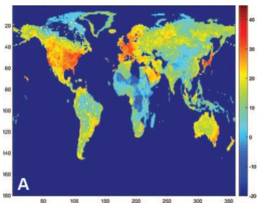

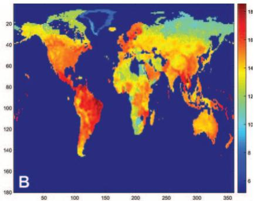

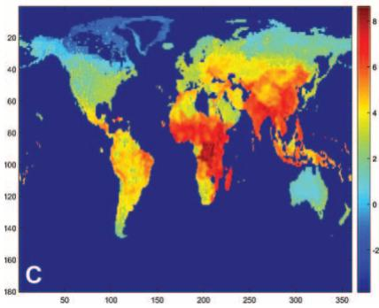

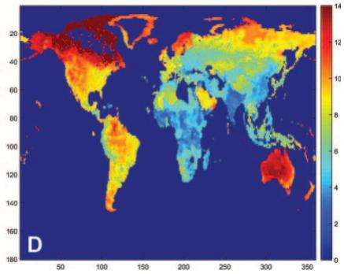  
FIG. 1.—Benchmark calibration: results from the inversion and migration costs. A, Fundamental productivities: t (r). B, Fundamental amenities: a-ðrÞ. C, Amenities over utility: $\bar { \boldsymbol { a } } ( \boldsymbol { r } ) / u _ { 0 } ( \boldsymbol { r } ) ^ { * }$ . D, Migration costs: m (r).

As for fundamental amenities (see fig. 1B), the highest values can be found in South America and, in particular, Brazil. North America also enjoys high fundamental amenities, particularly in urban areas. In Europe, Scandinavia and the Netherlands exhibit high amenities, while Portugal and southern Europe fare worse. Thailand and southeastern Australia are also desirable places to live, while some of the lowest amenities are found in Africa and Siberia. In figure 1C we also present fundamental amenities divided by the initial utility level, $\bar { a } ( r ) \bar { / } u _ { 0 } ( r )$ . As we show in lemma 6, these values are the direct result of inverting the model using population and GDP per capita. Poor and densely populated areas have high values since the model rationalizes this combination of facts through either high amenities or low utility associated with migration restrictions. Central Africa as well as large regions in Asia exhibit particularly high ratios. Comparing figures 1B and $1 C ,$ one can ascertain the role of initial utilitylevel differences due to migration costs, which we measured using the subjective well-being data.

To validate our identification strategy for amenities, it is worthwhile to correlate our estimates of fundamental amenities with commonly used exogenous measures of quality of life. We therefore collect data on different measures of geography (distance to oceans, distance to water, elevation, and vegetation) and climate (precipitation and temperature). The correlations between our estimates of amenities and these measures are consistent with the literature. For example, we find that people like living close to water and prefer higher average temperatures and precipitation (Davis and Ortalo-Magné 2011; Albouy et al. 2016). Qualitatively, the results do not depend on whether we look at all cells of the world, at only cells in the United States, or at randomly drawn cells across countries. This suggests that our methodology of using data on subjective well-being to identify amenities performs well. To further reinforce this point, placebo correlations based on alternative identification strategies of amenities yield correlations that are no longer the same across countries and within countries. Section B of appendix A presents these correlations and provides further details.

In figure 1D we present the measured entry migration costs $m _ { 2 } ( r )$ . The actual migration cost between s and r is given by $m _ { 1 } ( s ) m _ { 2 } ( r )$ , which is equal to $m _ { 2 } ( r ) / m _ { 2 } ( s )$ as a result of assumption 1. Since we obtain these costs so as to exactly match population changes between two subsequent years in the data, they should be interpreted as the total flow costs of entering a region, including information and psychological costs, the cost of actually getting there and settling there, and of course any legal migration restrictions. The figure shows very large log values of $m _ { 2 } ( r )$ in many parts of the world, suggesting that a very large share of the migration costs likely reflects legal impediments. It is hard to go to parts of Europe, particularly Scandinavia, parts of Canada and Alaska, Australia, New Zealand, and parts of the United States. One can distinguish the border between Mexico and the United States, Mexico and Central America, as well as Finland and Russia among others. Entering northern regions that are cold and hard to get to and settle is costly. Entering Africa, India, and China, as well as parts of Russia, is cheap. Overall these costs appear reasonable, but more importantly, they make the model match exactly observed population flows. In the next section we show that they also imply past population distributions that compare well with historical data.

Figure 2 (different panels) maps population, productivity, utility and real income per capita. Following the theory, average productivity in each cell is defined as $\bar { [ \tau _ { t } ( r ) L _ { t } } ( r ) ^ { \alpha } ] ^ { 1 / \theta }$ . This productivity includes the positive local agglomeration effect and takes into account that each location draws productivities from a Fréchet distribution. In contrast to figure 1, these are equilibrium outcomes in the first period of the model. Note that since $u _ { 0 } ( r )$ is based on our measure of subjective well-being and hence is constant within countries, $u _ { 1 } ( r )$ also varies little within countries since the adjustment takes place over a single year.

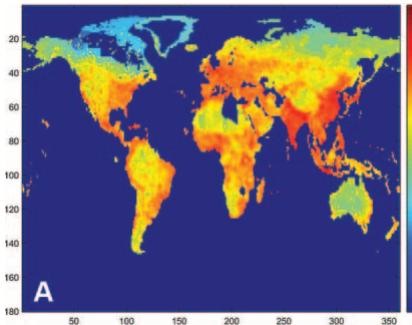

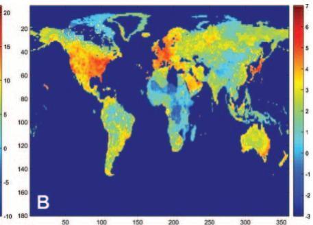

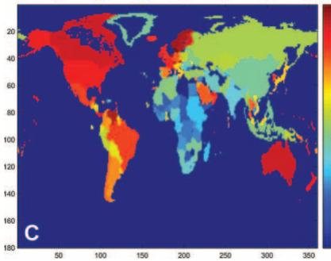

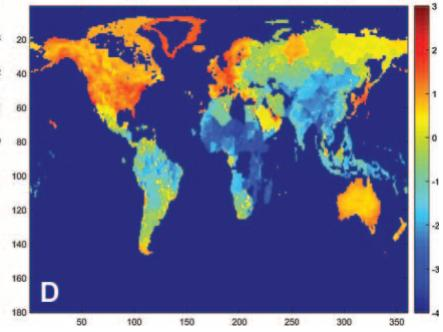  
FIG. 2.—Equilibrium in benchmark calibration (period 1). A, Population density. B, Productivity: $\begin{array} { r } { \left[ \dot { \tau } _ { t } ( r ) \bar { L } _ { t } ( r ) ^ { \alpha } \right] ^ { 1 / \theta } } \end{array}$ . C, Utility: $u _ { t } ( r )$ . D, Real income per capita: $y _ { t } ( r )$

Throughout this section we use $u _ { t } ( r )$ as our measure of utility since it is a sufficient statistic ofthe characteristics ofa location—real consumption and amenities—that individuals value. Actual experienced utility also includes the idiosyncratic preferences of individuals and possibly migration costs (if not rebated). At the end of this section we compare the behavior of these alternative measures of welfare.

A first observation is that the correlation between population density and productivity across countries is not that strong: there are some densely populated countries with high productivity levels, such as many of the European countries, but there are also some densely populated countries with low productivity levels, such as some of those located in sub-Saharan Africa. Countries that are densely populated in spite of having low productivity must have either low levels of utility (e.g., sub-Saharan Africa) or high levels of amenities (e.g., Latin America).21 A second observation is that the same relation between population density and productivity is much stronger across locations within countries, where the high-productivity areas typically tend to be the metropolitan areas. This is not surprising since mobility frictions tend to be smaller within countries, and so utility differences across locations within countries are relatively small. Thus, the negative congestion effects from living in densely populated areas have to be compensated by either higher productivity or better amenities. In line with this reasoning, we find that metropolitan areas have substantially higher productivity than the less dense neighboring locations, as well as somewhat higher, although less marked, real income per capita. The relatively high real income in cities suggests that cities must enjoy lower amenity levels due to the negative effect of density on amenities. Diamond (2016) provides empirical evidence on the importance of this effect.

Now consider the evolution of this economy over time, when we keep migratory barriers, as measured by $m _ { 2 } ( \cdot )$ , unchanged. Figure 3 (different panels) maps the predicted distributions of population, productivity, amenities, and real income per capita in period 600, at which point the economy has mostly converged to its balanced-growth path. Videos that show the evolution of these variables over time and over space are available online. To visualize the changes over time, we should compare figure 3, which represents the year 2600, with figure 2, which represents the year 2000.

Clearly, over time the correlation between population and productivity across countries becomes much stronger. As predicted by the theory, in the long run, high-density locations correspond to high-productivity locations. This can easily be seen when comparing the maps for period 1 and period 600. While in period 1 the population and the productivity maps look quite different, by period 600 they look very similar. As shown by the solid curve in panel B of figure 4, which presents the correlation of population density and productivity over time, the correlation increases from around .38 in period 0 to 1.0 by period 600. Note, however, that the correlation between population density and real GDP, which is driven not only by productivity but also by local prices, and therefore transport costs and geography, also grows but is never higher than .7. The solid curve in panel A of figure 4 shows this. Since the correlation between productivity and population density grows faster than the correlation between output and population density, panel C shows that the correlation between productivity and output exhibits a U-shaped pattern. Population responds slowly to increases in productivity because of the presence of migration restrictions.

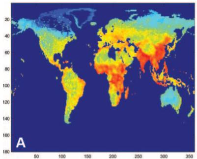

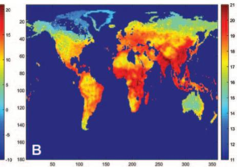

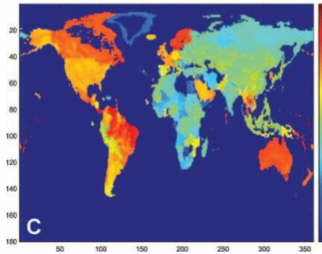

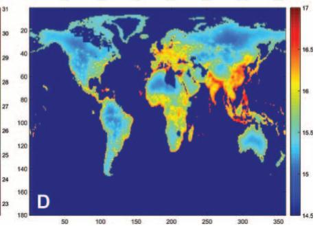  
FIG. 3.—Equilibrium keeping migratory restrictions unchanged (period 600). A, Population density. B, Productivity: $\begin{array} { r } { \left[ \tau _ { t } ( r ) \bar { L } _ { t } ( r ) ^ { \alpha } \right] ^ { 1 / \theta } . } \end{array}$ C, Utility: ut(r ). D, Real income per capita: yt(r ).

The model’s prediction that the correlation between population density and income becomes stronger as the world becomes richer is present in the data today. Although across all cells of the world the correlation today is negative, it is larger in wealthy regions. In 2000 the correlation between population density and real income per capita was 2.11 in Africa, .33 in western Europe, and .50 in North America. Similarly, in the United States the correlation is greater in high-income zip codes. In particular, in 2000 the correlation between population density and income per capita was .36 in zip codes with an income per capita above the median, compared to 2.06 in zip codes below the median. Section A of appendix A provides further details.

Another remark is that the high-productivity, high-density locations 600 years from now correspond to today’s low-productivity, high-density locations, mostly countries located in sub-Saharan Africa, South Asia, and East Asia. In comparison, most of today’s high-productivity, high-density locations in North America, Europe, Japan, and Australia fall behind in terms of both productivity and population. Clearly, this is not the case in terms of welfare as measured by ut(r) (namely, amenity-adjusted real income not including either migration costs or idiosyncratic shocks), where America, Europe, and Australia remain strong throughout.

This productivity reversal can be understood in the following way. The high population density in some of today’s poor countries implies high future rates of innovation in those countries. Low inward migration costs and high outward ones imply that population in those countries increases, leading to greater congestion costs and worse amenities. As a result, today’s high-density, low-productivity countries end up becoming highdensity, high-productivity, high-congestion, and low-amenity countries, whereas today’s high-density, high-productivity countries end up becoming medium-density, medium-productivity, low-congestion, and high-amenity countries; the United States is among them. Australia’s case is somewhat different since its low density and high inflow barriers imply that it becomes a low-productivity, high-amenity country. As can be seen in figure 4, given that the correlation between population density, productivity, and real income per capita becomes relatively high, it must be that low-density, high-utility countries have high amenities.

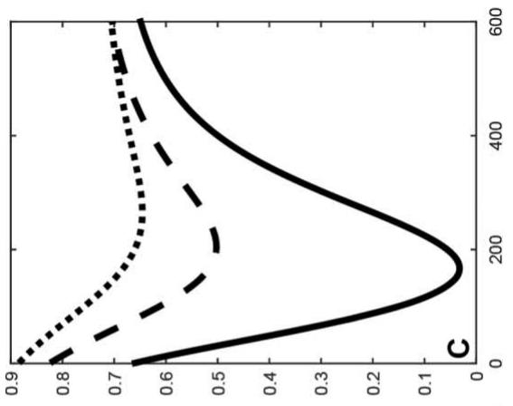

n of ln(productivity) and l h different migration restrictions.A, Correlation of ln y(r ) and lnL(r ). B, Correlation of ln(product  
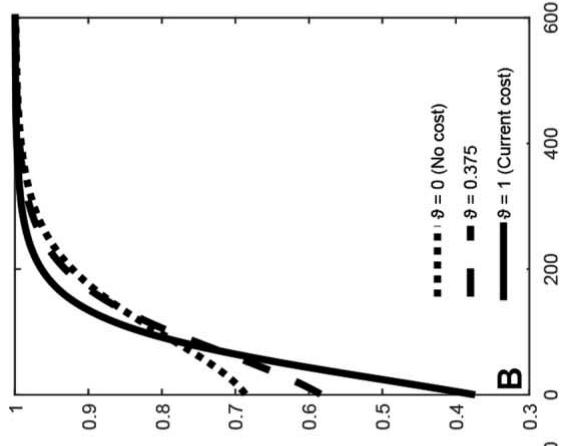

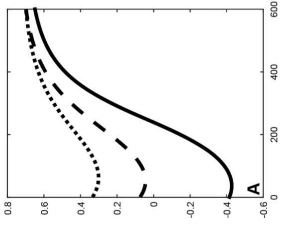

These dynamics imply a reallocation of population from high-utility to low-utility countries, as measured by $u _ { t } ( r )$ . Since the differences in amenityadjusted real GDP are now smaller, idiosyncratic preferences compensate more individuals to stay in areas with low $u _ { t } ( r )$ . In principle this could be driven by decreased migration from low- to high-utility countries or by increased migration from high- to low-utility countries. As increased innovation pushes up relative utility in low-income countries, fewer people want to migrate out, and more people want to migrate in, keeping relative utility levels about, although not completely, constant. Over time, this reallocation of population peters out. As predicted by lemma 4, decreasing returns to innovation, together with congestion costs, imply that, in the long run, the distribution of population reaches a steady state in which all locations innovate at the same constant rate.

Most of our discussion so far has focused on the changing differences across countries, but there are also interesting differences within countries. When focusing on the population distribution within countries, we observe that as the population share of North America and Europe declines, the locations that better withstand this decline are the coastal areas, which benefit from lower transport costs and thus higher real income. In the countries whose population shares are increasing, such as China, India, and parts of sub-Saharan Africa, there is less evidence of coastal areas gaining. This movement toward the coasts is evident in all countries when focusing on real GDP per capita, since coastal locations are high-density, low-amenity locations (due to congestion) that have high market access and therefore more innovation.

Figure 5 presents the average growth rates and levels of productivity, real output, and welfare for different scenarios.22 The benchmark calibration, which leaves mobility restrictions unchanged, corresponds to $\vartheta = 1$ (solid curve).23 Consistent with the argument above, figure 5 shows that the average growth rates of productivity, real GDP per capita, and utility converge to constants after about 400 years. Note that the long-run growth rate in real GDP per capita is higher than the initial growth rate, similar to the pattern of utility growth. The growth rate of real GDP increases from the calibrated 2 percent in 2000 to about 2.9 percent and then slowly decreases, to end slightly above 2.8 percent. Economic activity is more concentrated in the balanced-growth path, leading to more investment and faster growth. Productivity growth, in contrast, declines for the first 200 years, reflecting transitory losses from the initial population reallocation toward low-productivity regions. From then on the spatial distribution of population density, $\bar { L } _ { t } \dot { ( \cdot ) }$ , changes little in this migration scenario. Finally, recall that the growth rate in utility is equal to the growth rate in real GDP per capita minus l times the growth rate of population. Initially, the correlation between the growth in real GDP per capita and the growth in population is negative—many of the high-growth places in richer countries are losing population—so that the growth rate in utility is greater than the growth rate in GDP per capita. In the long run, when the steady state is reached, there is no more reallocation of population across space, so that real GDP per capita, productivity, and utility grow at the same rates. The bottom panels of figure 5 show the levels of world average productivity, real GDP, and utility as measured by $u _ { t } .$

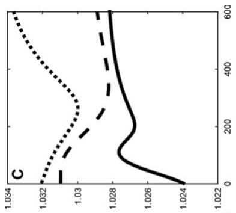

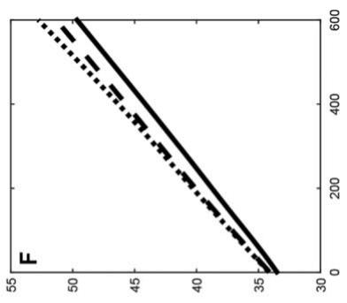

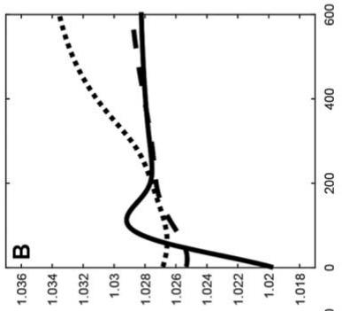

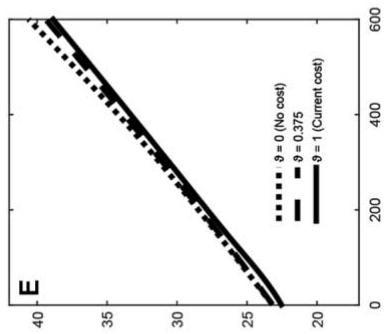  
rate of utility (u). D, Ln world average productivity.E, Ln world average real GDP.F, Ln wo d levels of productivity, real GDP, and utility under different migration scenarios.A, Growth rate of pr

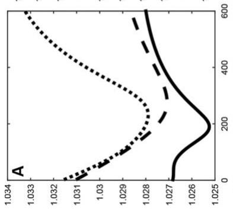

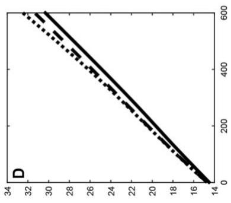

One of the forces that determine market size in the model is the ability to trade with other regions subject to transport costs. The level of transport costs determines the geographic scope of the area that firms consider when deciding how much to invest in innovation. In our framework, each cell trades with a group of other cells, within and across countries. Recall that we parameterize trade costs such that we match the mean empirical estimate of the elasticity of bilateral cell-level trade flows to distance (Head and Mayer 2014). We can also aggregate trade at the country level in order to calculate the overall level of international trade. The world trade share is calculated as

$$
\text { World   Trade   Share } _ {t} = 1 - \frac {\int_ {S} \int_ {c (s)} \pi_ {t} (s , r) y _ {t} (s) H (s) \bar {L} _ {t} (s) d r d s}{\int_ {S} y _ {t} (s) H (s) \bar {L} _ {t} (s) d s},
$$

where $c ( s )$ denotes the set of cells in the country of cell s. The second term denotes the share of domestic consumption, where the numerator includes the expenditure on domestic goods in the world and the denominator is total world GDP. In the simulation above, this trade share equals 14.1 percent in 2000. Though not targeted by our model, this matches the actual ratio of trade to GDP in the world economy.24 Over time, the model predicts the trade share to increase slightly, reaching 15.1 percent by 2600. This upward trend is due to the emergence of high-productivity clusters in Africa, South Asia, and East Asia, all of which belong to different countries.

Our model incorporates both national and international trade barriers and can be used to evaluate the overall effect ofchanges in trade costs. In particular, it can be used to measure both the static and dynamic gains from trade. This is in contrast with most of the trade literature, which focuses on static trade models without internal geography.25 Consider a counterfactual scenario that increases trade costs by 40 percent in the first period. Such a change reduces the trade share to 3.90 percent in period 1 and to 4.27 percent in the long run. The real GDP loss is 30.1 percent and the welfare loss, measured by $u _ { t } ,$ is 34.2 percent. These losses are an order of magnitude higher than the ones reported for static, onesector, models in the survey by Costinot and Rodríguez-Clare (2014), who compute a real income loss from a similar change in trade costs of 2.28 percent. Incorporating dynamic and within-country effects seems to change the impact of trade frictions dramatically.

## B. Predicting the Past

In this section we use the algorithm described in Section IV.G to compute the model’s implied population distribution in the past. Starting with the calibration described in Section V.A for the year 2000, we run the simulation backward and compute the distribution of population in all cells of the world all the way back to the year 1870. We then compare the modelimplied distribution to data from the Penn World Tables 8.1 for every decade until 1950 and to data from Maddison (2001) for 1913 and 1870. These historic data are easily available at the country level, so we aggregate the cells in the model to the country level.

This exercise is intended as an overidentification check for the model, given that none of these historic population data were used in the quantification. Of course, there is a variety of world events and shocks that the model does not incorporate, so it would be unreasonable to ask the model to perfectly match the data. The model’s implications should be understood as the distribution of population that would result in the absence of any forces and shocks not directly modeled. Examples of such unmodeled shocks abound: the two world wars, trade liberalization, decolonization, and so forth. With that caveat in mind, it is interesting to see how much of the population changes the model can account for. Given that our framework attempts to model long-run forces driving population changes and growth, rather than short-term fluctuations and shocks, we would expect the model to perform best over the medium run, when shortterm shocks are less important, but the economy has not changed in fundamental ways not modeled here.

Table 2 reports the results. The model does very well: in levels, the correlations back to 1950 are all larger than .96. Clearly, this is in large part due to the fact that we match population levels in 2000 by construction, and population changes are not that large (about 3 percent per year). Hence, we also present the correlations of population growth rates. The correlations for growth rates are clearly lower, but altogether still relatively high. The correlation between the population growth rate from 1950 to 2000 in the model and the data is .74. We view this as quite a success of the model. If we go all the way to 1870, the predictive power of the simulation is smaller, but the correlation of growth rates is still .34. In spite of the disruption of two world wars and many other major world events not accounted for here, the model preserves substantial predictive power.

## C. Evaluating Mobility Restrictions

We now analyze the effect of completely or partially relaxing existing migration restrictions. We start with the free mobility scenario and then present some calculations for scenarios with partial mobility in which ϑ is between one (current restrictions) and zero (free mobility).

## 1. Free Migration

In this exercise we evaluate the effects of completely liberalizing migration restrictions. We start off with the benchmark calibration in period 0 and then reallocate population such that $m _ { 2 } ( r ) = 1$ for all $r \in S ,$ , as corresponds to the case with $\vartheta = 0$ . For now, we take amenity-adjusted real $\mathrm { G D P } , u _ { t } ( r )$ , as our measure of a location’s utility. With free migration people move from locations with low $u _ { t }$ to locations with high $u _ { t } .$ This reduces utility differences across locations because of greater land congestion and lower amenities in high-utility locations (and the opposite in lowutility locations). This reallocation of population not only has a static effect but also has a dynamic effect by putting the economy on a different dynamic path. As we have emphasized repeatedly, even though $m _ { 2 } ( r ) = 1$ for all $r \in S _ { i }$ , differences in $u _ { t } ( r )$ are not eliminated, since idiosyncratic taste shocks imply that the elasticity of population to $u _ { t } ( r )$ is positive but finite.

Country-Level Population Correlations, 1870–2000: Model vs. Data  
TABLE 2

<table><tr><td rowspan="2">YEAR t</td><td colspan="5">PENN WORLD TABLES 8.1</td><td colspan="2">MADDISON</td></tr><tr><td>1990</td><td>1980</td><td>1970</td><td>1960</td><td>1950</td><td>1913</td><td>1870</td></tr><tr><td>Correlation log population in t</td><td>.993</td><td>.991</td><td>.982</td><td>.974</td><td>.965</td><td>.843</td><td>.681</td></tr><tr><td>Correlation population growth from t to 2000</td><td>.414</td><td>.535</td><td>.504</td><td>.671</td><td>.742</td><td>.461</td><td>.344</td></tr><tr><td>Number of countries</td><td>152</td><td>131</td><td>131</td><td>102</td><td>53</td><td>76</td><td>76</td></tr></table>

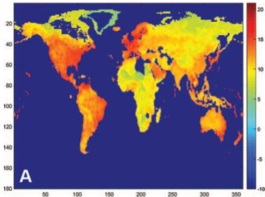

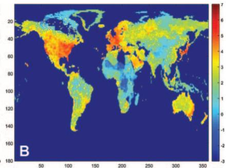

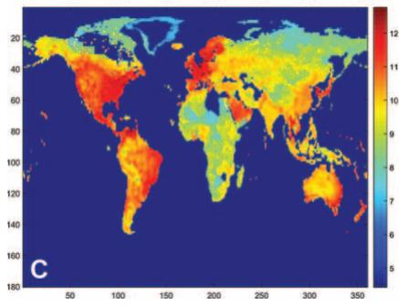

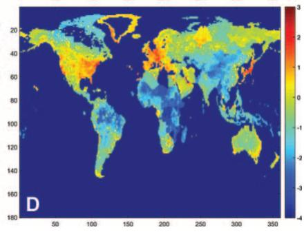  
FIG. 6.—Equilibrium with free migration (period 1). A, Population density for ϑ 5 0. B, Productivity for $\vartheta = 0 \colon [ \tau _ { t } ( r ) \bar { L } _ { t } ( r ) ^ { \alpha } ] ^ { 1 / \theta } \cdot C ,$ , Utility for $\vartheta = 0 :$ ut(r ). D, Real income per capita for $\vartheta = 0 \colon \dot { y } _ { t } ( r )$

Figure 6 and figure 7 map the distributions of population, productivity, utility, and real income per capita for period 1 and period 600, under the assumption that people are freely mobile across locations.26 Compared to the exercise in which we kept migratory restrictions unchanged, several observations stand out. First, migration increases the initial correlation between population density and productivity across countries, so that we see fewer countries in which high density and low productivity coexist. In panel B of figure 4 we see that in the case of complete liberalization $( \vartheta = 0 )$ the initial correlation between density and productivity increases from around .38 to nearly .69. Second, this initial effect has important dynamic consequences. Because today’s poor countries lose population through migration, they innovate less. As a result, and in contrast to the previous exercise, no productivity reversal occurs between the United States, India, China, and sub-Saharan Africa. Third, this absence of a large-scale productivity reversal does not mean that relative productivities across countries remain unchanged. Some countries, such as Venezuela, Brazil, and Mexico, start offwith relatively high utility levels but relatively low productivity levels. This means they must have high amenities. Because of migration, they end up becoming some of the world’s densest and most productive countries, together with parts of Australia, Europe, and the United States. Fourth, migration changes the determination of the development path of the world and thereby increases the growth rate in the balanced-growth path, as is clear from figure 5. In the balanced-growth path, real GDP growth increases by about 0.5 percentage points. Fifth, within countries, there is stronger evidence of an increasing concentration of the population in coastal areas, compared to the benchmark case. The greater concentration of population within countries, which was already apparent in the benchmark case, is now reinforced by greater migration across countries. Sixth, the importance of coastal areas becomes even more apparent when we look at real income per capita. The fact that locations close to coastal areas have lower real income per capita but high population suggests that those locations have higher amenities than the coastal areas themselves because of congestion.

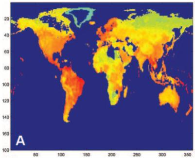

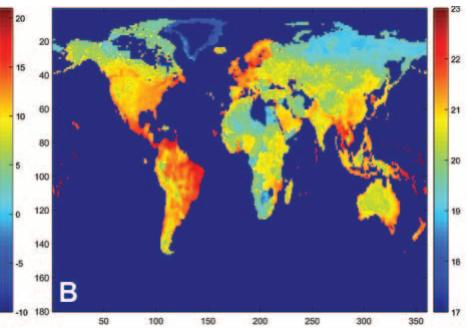

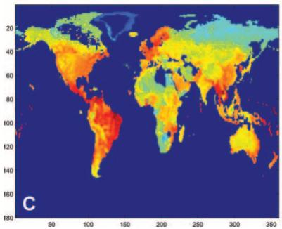

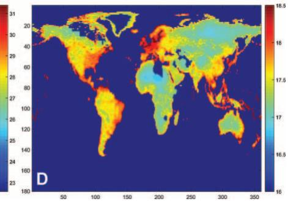  
FIG. 7.—Equilibrium with free migration (period 600). A, Population density for $\vartheta = 0 .$ B, Productivity for $\vartheta = 0 \colon [ \tau _ { t } ( r ) \bar { L } _ { t } ( r ) ^ { \simeq } ] ^ { 1 / \theta }$ . C, Utility for ϑ 5 0: ut(r ). D, Real income per capita for $\vartheta = 0 \colon y _ { t } ( r )$ ).

When analyzing the average growth in real income per capita and utility, two differences become immediately apparent in figure 5 when comparing the case of free migration $( \vartheta = 0 )$ to the case of no liberalization $( \vartheta = 1 )$ . First, mobility increases the long-run growth rate of the economy as well as the average level of welfare, output, and productivity in the world. Second, growth in utility drops substantially in the short run as many people move to areas with high real GDP; hence these areas become more congested and become worse places to live (lower amenities). This initial loss in growth is, however, compensated in the long run by a large surge in productivity growth after year 2200.

## 2. Partial Liberalization

We now present the changes in discounted real income and welfare, as well as migration flows, that result from a variety of scenarios in which we partially relax migration frictions. Figures 4 and 5 in the previous section already presented correlations as well as growth rates and levels of the different variables for an example scenario of partial liberalization, where we set $\vartheta = 0 . 3 7 5 . ^ { 2 7 }$ As can be seen in table 3, although this value ofϑ is around the middle between keeping existing migration restrictions unchanged and free migration, it leads to reallocations of population that are closer to the free migration case. When we liberalize migration fully, 70.3 percent of the population changes country immediately; the corresponding number when $\vartheta = 0 . 3 7 5$ is 52.7 percent. As expected, the share of population that moves decreases monotonically with the magnitude of migration frictions as measured by ϑ.

In terms of welfare, migration frictions are tremendously important, particularly when we move closer to free migration.28 As shown in table 3, a liberalization that implies that about a quarter of the world population moves at impact $( \vartheta = 0 . 7 5 )$ yields an increase in real output of 30.6 percent. In terms of welfare, the increase depends on the measure we use. If, as we have done so far, we measure welfare as the present discounted value of the population-weighted average of u(r), the resulting welfare increase when we set ϑ 5 0:75 is 60 percent. This measure includes neither the mobility costs nor the idiosyncratic preference shocks. As we have noted before, given that a large share of the migration costs are likely to derive from legal restrictions, accounting for the direct benefits from lowering migration restrictions would tend to grossly overestimate the gains from liberalization. However, it might make sense to incorporate idiosyncratic locational preferences into our welfare calculation. If we do so and calculate the value of the expected utility of agents as measured by equation (4), we obtain a welfare gain of 19.2 percent (as can be observed in col. 3 table 3 with heading E[uεi]). The second measure is naturally smaller since agents are less selected when migration costs drop.

TABLE 3  
The Impact of Mobility Frictions

<table><tr><td>Mobility  $\vartheta$ </td><td>Real Incomea% Δ w.r.t.  $\vartheta = 1$ (1)</td><td>Welfare  $(u)^{b}$ % Δ w.r.t.  $\vartheta = 1$ (2)</td><td>Expected Welfare $E[u\varepsilon^{f}]^{c}$ % Δ w.r.t.  $\vartheta = 1$ (3)</td><td>Migration Flowsd% Δ from t = 0 to 1(4)</td></tr><tr><td> $1^{e}$ </td><td>0</td><td>0</td><td>0</td><td>.30</td></tr><tr><td>.875</td><td>13.8</td><td>26.4</td><td>9.1</td><td>10.0</td></tr><tr><td>.750</td><td>30.6</td><td>59.8</td><td>19.2</td><td>21.2</td></tr><tr><td>.500</td><td>69.2</td><td>144.3</td><td>40.5</td><td>43.2</td></tr><tr><td>.375</td><td>87.1</td><td>188.8</td><td>50.3</td><td>52.7</td></tr><tr><td>.250</td><td>101.6</td><td>228.8</td><td>58.9</td><td>60.2</td></tr><tr><td>.125</td><td>113.2</td><td>264.5</td><td>67.3</td><td>66.0</td></tr><tr><td> $0^{f}$ </td><td>125.8</td><td>305.9</td><td>79.0</td><td>70.3</td></tr></table>

a Change in present discounted value (PDV).  
b Change in PDV of population-weighted average of cells’ discounted utility levels u(r).  
c Change of PDV of expected discounted utility levels as measured in eq. (4).  
d Net population changes in countries that grow divided by L- immediately after the change in ϑ.  
e Observed restrictions.  
f Free mobility.

Full liberalization that sets ϑ 5 0 leads to slightly less than three-quarters of the world population migrating at impact and gives welfare gains, as measured by amenity-adjusted real GDP, of 305.9 percent and an increase in real income of 125.8 percent.29 Furthermore, if we take into account idiosyncratic preference shocks, the gain is 79 percent. As explained before, the welfare gains when taking into account locational preferences are smaller because there is less selection under free mobility. These idiosyncratic preferences have sometimes been interpreted as capturing another type of mobility frictions. This is reflected in the elasticity of population to ut being finite. When assessing the gains from free migration, we are not relaxing those implicit frictions.

Two comments are in order when analyzing the numbers in table 3. First, the mobility numbers presented in table 3 include agents who move across countries at impact in period 1 only. Of course, as a result of migratory liberalization, the entire development path of the world economy changes significantly as shown in figures 4–7. Second, in general the gains in utility as measured by amenity-adjusted real GDP are much larger than the gains in real income, especially when migration becomes freer. Relaxing migration restrictions tends to relocate people to high-amenity regions. In the case of free migration, this reallocation accounts for nearly 60 percent of the total welfare effect. Although the planner’s problem is intractable and unsolvable, this finding suggests what a planner might want to do. Given that our model implies that in the long run the highproductivity places will be the high-density places, ideally one would like to see these high-density places in high-amenity places. Hence, a planner interested in maximizing long-run welfare would probably want to implement policies that facilitate people moving to high-amenity places. Liberalizing migration restrictions pushes the economy in that direction.

Figure 8 presents growth rates of welfare using the two alternative measures. The figures in the first column simply reproduce the ones we presented in figure 5; the ones in the second column present growth rates and levels of welfare as measured by E[uεi] as in equation (4). With both measures the growth rate of welfare is in general higher with freer migration. Fluctuations over time in the growth rate of E[uεi] are a bit larger. When we compare the levels ofwelfare, the two measures exhibit a similar behavior.

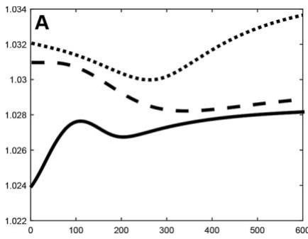

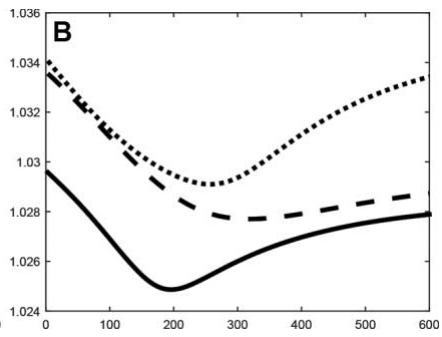

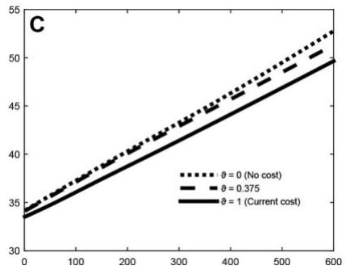

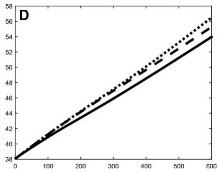  
FIG. 8.—Growth rates and levels with different migration restrictions. A, Growth rate of utility (u). B, Growth rate of $E [ u \varepsilon ^ { i } ]$ . C, Ln world average utility (u). D, Ln $E [ u \varepsilon ^ { i } ]$

So far we have ignored the interaction between migration liberalization and trade liberalization. Of course, the gains from lowering migratory barriers are likely to depend on the level of trade costs. To explore this question, we compare the gains from free migration under different trade costs. In particular, we analyze how those gains change if we increase trade barriers by 40 percent. Completely liberalizing migration increases real income by 125.8 percent if we leave trade restrictions unchanged, but those gains rise to 156.9 percent in a world with trade costs that are 40 percent higher. The corresponding figures in terms of welfare, as measured by amenity-adjusted real GDP, are 305.9 percent and 382.9 percent, respectively. The larger gains from free migration when trade costs are higher suggest that trade and migration are substitutes: when trade is less free, the impact of liberalizing migration is larger.

## VI. Conclusion

The complex interaction between geography and economic development is at the core of a wide variety of important economic phenomena. In our analysis we have underscored the fact that the world is interconnected through trade, technology diffusion, and migration. We have conducted our analysis at a fine geographic detail, enabling us to incorporate the significant heterogeneity across regions in amenities, productivity, geography, and transport costs, as well as migration frictions. This framework and its quantification have allowed us to forecast the future evolution of the world economy and to evaluate the impact of migration frictions. Our confidence in this exercise was enhanced by the model’s ability to backcast population changes and levels, quite accurately, for many decades.

Our results highlight the complexity of the impact of geographic characteristics as well as the importance of their interaction with factor mobility. We found that relaxing migration restrictions can lead to very large welfare gains but that the world economy will concentrate in very different sets of regions and nations depending on migratory frictions. This inequity in the cross-country economic implications of relaxing migration frictions will (and does) undoubtedly lead to political disagreements about their implementation. For example, developed economies today will guarantee their future economic superiority only in scenarios in which the world relaxes migration restrictions. We have abstracted from these political economy considerations, but they are clearly extremely important.

Even though our framework incorporates a large set of forces in a rather large general equilibrium exercise, we had to make the choice of leaving some important forces aside. Perhaps the most relevant one is the ability of the world economy to accumulate a factor of production like capital. In our framework, only technology can be accumulated over time, not capital. In our view, the ability of regions to invest in technology substitutes partially for the lack of capital accumulation, but clearly not fully. We also abstracted from local investments in amenities. In our framework, amenities vary only through changes in congestion as a result of in- or out-migration. Finally, we also abstracted from individual heterogeneity in education or skills. Given our long-term focus, we view educational heterogeneity as part of the local technology of regions. It is obviously the case that individuals can migrate with their human capital, and we ignore this. However, the human capital embedded in migrants lasts mostly for only one generation. Ultimately, migrants and, more important, their descendants will obtain an education that is commensurate with the local technology in a region.

The framework we have proposed can be enhanced in the future to incorporate some of these other forces. However, as it already stands, it is a useful tool to understand the dynamic impact of any spatial friction. We have illustrated this using migration frictions, but clearly one could do a large variety of other exercises. Two important ones that we hope we, or other researchers, will do in the future relate to climate change and trade liberalizations. Both the international trade and the environmental literatures require a quantitative framework to understand the dynamic impact of environmental and trade policy that takes into account, and measures, local effects. The quantitative framework in this paper is ready to take on these new challenges.

## Appendix A

## Density-Income Correlation and Subjective Well-Being

## A. Correlation of Density and Income

In our theory, the presence of both static and dynamic agglomeration economies, together with the role played by amenities, implies that the correlation between density and income per capita is relatively low (and possibly negative) when income per capita is low and relatively high when income per capita is high. Two forces drive this result. On the one hand, the standard positive correlation between density and per capita income, due to static agglomeration economies, is stronger in high-productivity places that benefit from greater dynamic agglomeration economies. This explains why the correlation between density and per capita income is increasing in per capita income. On the other hand, mobility means that high-amenity places tend to have both high population density and low per capita income. This explains why in relatively low per capita income locations, where dynamic agglomeration economies are weak, the correlation between density and per capita income might be negative. To see whether these findings hold in the data, we provide evidence for the United States and the globe.

Evidencefrom the United States.—For the United States we do two exercises. First, we compute the correlation between population density and income per worker across US zip codes. We split zip codes into different groups: those with income per capita (worker) below the median and those with income per capita (worker) above the median. The theory predicts a higher correlation between density and income per capita for the latter group and possibly a negative correlation for the former group. We also consider a finer split-up into four different groups by income per capita quartile. In that case, we would expect the correlation to increase when we go from lower income per capita quartiles to higher income per capita quartiles.

Table A1 reports the results. Data on population, mean income per worker, and geographic area come from the 2000 US census and from the American Community Survey 5-year estimates. The geographic units of observation are ZIP Code Tabulation Areas (ZCTAs). We use two different definitions ofincome: “earnings” correspond essentially to labor income, whereas “total income” also includes capital income. As predicted by the theory, panel A shows that the correlation between population density and earnings per full-time worker, both measured in logs, increases from .12 for ZCTAs with below-median earnings per full-time worker to .31 for ZCTAs above the median. When we focus on total income in panel B, the results are similar, but now the correlation between population density and income per full-time worker is negative for ZCTAs below the median. In particular, the correlation increases from 2.06 for those ZCTAs below the median to .36 for those above the median. All these correlations are statistically different from zero at the 1 percent level, and in both cases, the increase in the correlation is statistically significant at the 1 percent level. When we compare different quartiles, rather than below and above the median, the results continue to be consistent with the theory: the correlations between density and income are greater for higher-income quartiles.

Second, we explore whether the relation between density and income is stronger in richer areas by analyzing how that relation at the zip code level changes with the relative income of the Core Based Statistical Area (CBSA) the zip code pertains to. To analyze this, we start by running separate regressions for each CBSA of the log of payroll per employee on the log of employee density at the zip code level. Using data of 2010 from the ZIP Code Business Patterns, this yields 653 coefficients of employee density, one for each CBSA. Figure A1 then plots these 653 coefficients against the relative income of the CBSA. As expected, as the relative income of the CBSA increases, the effect of employee density on payroll per employee increases.

TABLE A1  
Density and Income

<table><tr><td rowspan="2">YEAR</td><td colspan="6">PERCENTILES BASED ON MEAN EARNINGS</td></tr><tr><td>&lt;25th</td><td>25th–50th</td><td>50th–75th</td><td>&gt;75th</td><td>&lt;Median</td><td>≥Median</td></tr><tr><td colspan="7">A. Correlation Population Density (Logs) and Mean Earnings per Full-Time Worker (Logs)</td></tr><tr><td>2000</td><td>.0549***</td><td>.0884***</td><td>.1291***</td><td>.2199***</td><td>.1216***</td><td>.3128***</td></tr><tr><td>2007–11</td><td>-.0237*</td><td>.0428***</td><td>.1048***</td><td>.2727***</td><td>.0222***</td><td>.3546***</td></tr><tr><td colspan="7">B. Correlation Population Density (Logs) and Per Capita Income (Logs)</td></tr><tr><td>2000</td><td>-.1001***</td><td>.0495***</td><td>.1499***</td><td>.2248***</td><td>-.0609***</td><td>.3589***</td></tr><tr><td>2007–11</td><td>-.0930***</td><td>.0175</td><td>.0733***</td><td>.2420***</td><td>-.0781***</td><td>.3234***</td></tr></table>

\* Significant at the 10 percent level.  
\*\* Significant at the 5 percent level.  
\*\*\* Significant at the 1 percent level.

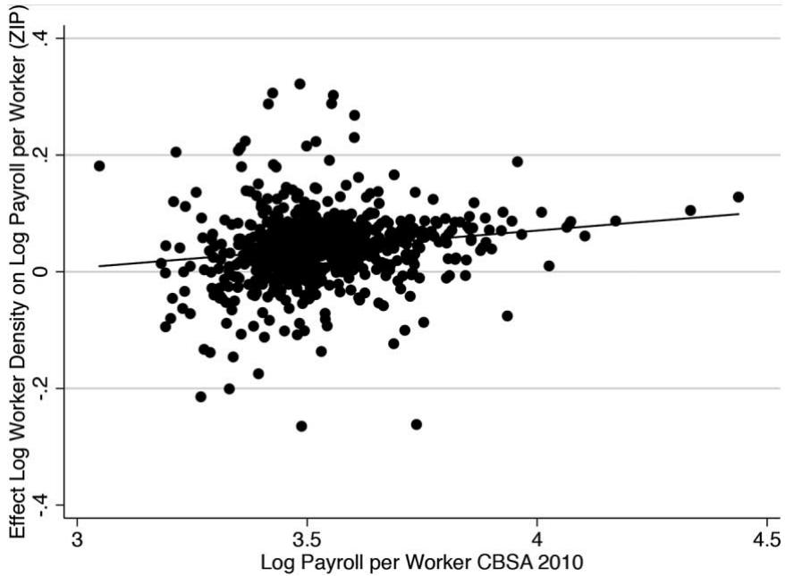  
FIG. A1.—Payroll per employee and employee density

Rather than running separate regressions for each CBSA, we can also run a single regression with an interaction term of density at the zip code level with payroll per employee at the CBSA level:

$$
y (\text { zip }) = a _ {0} + a _ {1} d (\text { zip }) + a _ {2} d (\text { zip }) y (\text { cbsa }) + \varepsilon (\text { zip }),\tag{A1}
$$

where y(zip) is the log of payroll per employee at the zip code level, y(cbsa) is the log of payroll per employee at the CBSA level, and $d ( \mathrm { z i p } )$ is the log of employee density at the zip code level. The theory predicts that $a _ { 1 }$ may be negative and that $a _ { 2 }$ is positive. Consistent with this, when using data from 2010, we find $a _ { 1 } = - 0 . 2 4 1$ and $a _ { 2 } = 0 . 0 7 9$ , and both are statistically significant at the 1 percent level. Using data from 2000 yields similar results: $a _ { 1 } = - 0 . 1 9 4$ and $a _ { 2 } = 0 . 0 7 5$ , and once again both are statistically significant at the 1 percent level.

Comparing different countries and regions.—Next we analyze the correlation between real income per capita and population density across cells. Table A2 reports the results for different geographic subsets of the data. Across all cells of the world, the correlation between population density and real income per capita is 2.41. Not surprisingly, within countries in which population mobility is higher, that correlation is positive and equal to .17. Of more interest is the comparison between richer and poorer cells. We start by splitting up the world into the 50 percent poorest cells and the 50 percent richest cells. As expected, the correlation between population density and income per capita is lower for the poorer cells (2.06) than for the richer cells (.11). A similar ranking emerges when contrasting the 50 percent poorest cells and the 50 percent richest cells within countries: the correlation is .16 for the poorer cells and .48 for the richer cells. Finally, we compare different continents and regions across the world. Once again, we would expect the correlation between density and income per capita to be higher in more developed regions. With the exception of Latin America, the results confirm this picture: we see the lowest correlation in Africa (2.11) and the highest correlations in North America (.50) and in Australia and New Zealand (.70).

TABLE A2  
Correlation Population Density and Real Income per Capita across Cells

<table><tr><td>1. Across all cells of the world</td><td>-.41</td></tr><tr><td>2. Weighted within-country average</td><td>.17</td></tr><tr><td>3. Richest vs. poorest cells of the world:</td><td></td></tr><tr><td>50% poorest cells</td><td>-.06</td></tr><tr><td>50% richest cells</td><td>.11</td></tr><tr><td>4. Richest vs. poorest cells within countries(weighted by number of cells per country):</td><td></td></tr><tr><td>50% poorest cells</td><td>.16</td></tr><tr><td>50% richest cells</td><td>.48</td></tr><tr><td>5. Cell average within continents and regions:</td><td></td></tr><tr><td>Africa</td><td>-.11</td></tr><tr><td>Asia</td><td>.06</td></tr><tr><td>Latin America and Caribbean</td><td>.18</td></tr><tr><td>Europe</td><td>.15</td></tr><tr><td>Of which western Europe</td><td>.33</td></tr><tr><td>North America</td><td>.50</td></tr><tr><td>Australia and New Zealand</td><td>.70</td></tr></table>

## B. Correlations of Amenities and Quality of Life

Our goal is to compute correlations between our estimated measures of fundamental amenities and different exogenous measures of a location’s quality of life. The different variables on quality of life, related to distance to water, elevation, precipitation, temperature, and vegetation, come from G-Econ 4.0.30 The results are reported in table A3.

TABLE A3  
Correlations between Estimated Amenities and Different Measures of Quality of Life

<table><tr><td rowspan="2"></td><td colspan="5">CORRELATIONS WITH ESTIMATED AMENITIES (Logs)</td></tr><tr><td>All Cells(1)</td><td>United States(2)</td><td>One Cellper Country(3)</td><td>Placebo ofCol. 1(4)</td><td>Placebo ofCol. 3(5)</td></tr><tr><td colspan="6">A. Water:</td></tr><tr><td>Distance to ocean</td><td>-.3288***</td><td>.0544**</td><td>-.1102*</td><td>-.1277***</td><td>.3181***</td></tr><tr><td>Distance to water</td><td>-.4894***</td><td>-.3045***</td><td>-.2054***</td><td>-.3675***</td><td>.1638***</td></tr><tr><td>Water &lt; 50 km</td><td>.2653***</td><td>.1731***</td><td>.1123*</td><td>.1442***</td><td>-.1428**</td></tr><tr><td colspan="6">B. Elevation (logs):</td></tr><tr><td>Level</td><td>-.4536***</td><td>-.2116***</td><td>-.2491***</td><td>-.3151***</td><td>.2694***</td></tr><tr><td>Standard deviation</td><td>-.4912***</td><td>-.3018***</td><td>-.2781***</td><td>-.3597***</td><td>.2023**</td></tr><tr><td colspan="6">C. Precipitation:</td></tr><tr><td>Average</td><td>.4301***</td><td>.1350***</td><td>.3860***</td><td>.3350***</td><td>.1016**</td></tr><tr><td>Maximum</td><td>.4462***</td><td>.1733***</td><td>.2383***</td><td>.4443***</td><td>.2992***</td></tr><tr><td>Minimum</td><td>.2279***</td><td>.2653***</td><td>.2150***</td><td>.0064</td><td>-.2613***</td></tr><tr><td>Standard deviation</td><td>.4126***</td><td>.0833***</td><td>.1969***</td><td>.4824***</td><td>.3954***</td></tr><tr><td colspan="6">D. Temperature:</td></tr><tr><td>Average</td><td>.5920***</td><td>.7836***</td><td>.1123*</td><td>.6832***</td><td>.4652***</td></tr><tr><td>Maximum</td><td>.5045***</td><td>.8141***</td><td>-.0498</td><td>.6449***</td><td>.4034***</td></tr><tr><td>Minimum</td><td>.5867***</td><td>.7029***</td><td>.1621***</td><td>.6529***</td><td>.4131***</td></tr><tr><td>Standard deviation</td><td>-.5455***</td><td>-.3953***</td><td>-.2438***</td><td>-.5576***</td><td>-.2983**</td></tr><tr><td colspan="6">E. Vegetation:</td></tr><tr><td>Desert, ice, or tundra</td><td>-.3553***</td><td>-.4412***</td><td>-.1771***</td><td>-.2775***</td><td>-.0919</td></tr></table>

\* Significant at the 10 percent level.  
\*\* Significant at the 5 percent level.  
\*\*\* Significant at the 1 percent level.

Column 1 presents correlations based on all 17 - 17 cells of the world. These correlations suggest that people prefer to live close to water, dislike high elevations and rough terrain, like precipitation but not constantly, prefer warm and stable temperatures, and dislike deserts, tundras, and ice-covered areas. It is reassuring that these correlations are largely consistent with those found in the literature. For example, Albouy et al. (2016) provide evidence that Americans have a mild preference for precipitation and a strong preference to live close to water, and Davis and Ortalo-Magné (2011) find that there is a positive correlation between quality of life and average temperature and precipitation. One thing that may come as a surprise is that people not only prefer higher average temperatures but also like higher maximum temperatures. This result is driven by the imposed linearity: once we allow for a quadratic relation between our measure of amenities and maximum temperatures, we find an optimal maximum temperature of 25.97 Celsius.

The fact that our correlations are overall in line with what we would expect suggests that our methodology of identifying amenities by using data on subjective well-being is reasonable. To further confirm this, we compare our results to what these correlations would look like within the United States. Because utility is the same across all cells within a country, the correlations within the United States do not depend on our use of data on subjective well-being. Hence, if the results for the United States are similar to those of the world, this is further evidence in favor of our methodology. Column 2 confirms that this is largely the case.

Another possible worry is that the correlations across all cells of the world are driven by a few large countries. If so, what we observe in column 1 may mostly reflect within-country variation, and this might explain why columns 1 and 2 look similar. To address this concern, we choose a random sample of 176 cells, one for each country, and compute the correlations. We repeat this procedure 5,000 times and report the resulting cross-country correlations in column 3. They look similar to those in columns 1 and 2.

As a further robustness check, we compute some placebo correlations to be compared with those in columns 1 and 3. To do so, we take a different value of w when transforming subjective well-being into our measure of utility. In particular, we assume that all countries in the world have the same utility when identifying fundamental amenities. The results are reported in columns 4 and 5. Note that there is no need to run a similar placebo test on column 2 since the correlations within countries are independent of our measure of utility. Columns 4 and 1 are similar. This is not surprising since most of the variation in those two columns is across cells within countries, and that variation is unaffected by the particular value of w. In contrast, when we focus on the variation across countries, using a different value ofw should change the results. This is indeed what we find: column 5 yields correlations very different from those in column 3. All the signs on proximity to water and elevation have switched signs, and the correlation on minimum precipitation changes from positive to negative.

If the fundamental amenities that we have estimated are reasonable, then columns 1, 2, and 3 should yield similar results, columns 4 and 1 should not differ much, and columns 5 and 3 should be quite different. Our results in table A3 confirm these priors. Together with the fact that the correlations in column 1 are in line with those in the literature, this allows us to conclude that our particular methodology of using subjective well-being to identify fundamental amenities performs well.

## C. Subjective Well-Being

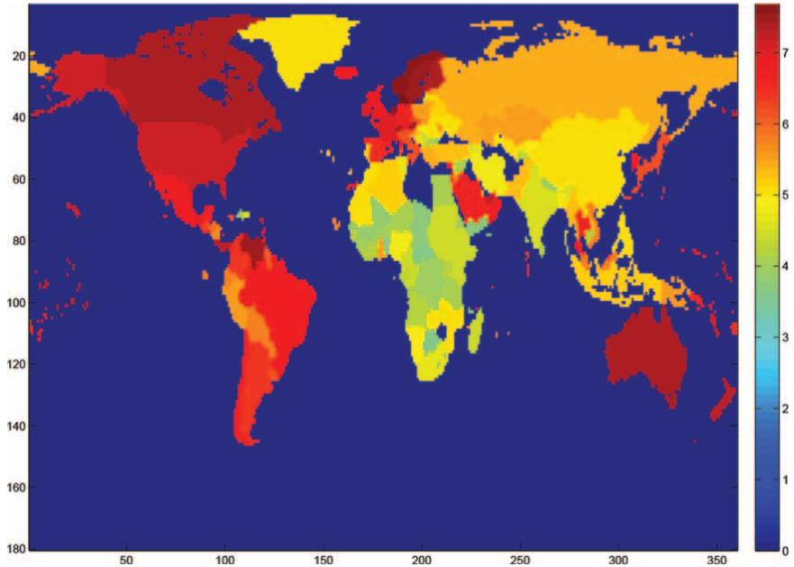  
FIG. A2.—Cantril ladder measure of subjective well-being from the Gallup World Poll (max 5 10, min 5 0).

## D. Robustness Exercises

We now conduct a number of robustness checks, related to different parameters. We study the effect of 20 percent changes in the parameters driving taste heterogeneity (Q), static agglomeration economies (a), congestion in amenities (l), the degree of technological diffusion (1 2 g2), the spatial span of technological diffusion (h), and the level of trade costs (U). All exercises keep the values of initial amenities, productivities, and migration costs, as well as other parameters, as in the benchmark calibration. In addition to providing a quantitative assessment of the sensitivity of our findings to these different parameters, these robustness checks also contribute to our understanding ofthe workings of the model.

Preference heterogeneity.—In this exercise we increase Q, the parameter that determines preference heterogeneity, from 0.5 to 0.6. The elasticity ofmigrant flows to real income drops from 2 to 1.67. As a result, people are less likely to move to high-income or high-amenity places. This lowers the degree of spatial concentration over time, so that growth rates go down in the long run (fig. A3). Relaxing mobility restrictions also has a smaller effect if people are less willing to move because of stronger locational preferences. Consistent with this, table A4 shows a welfare gain of 243.0 percent from free mobility, compared to 305.9 percent in the benchmark.

TABLE A4  
The Impact of Mobility Frictions

<table><tr><td rowspan="2"></td><td colspan="2">REAL INCOME (%)</td><td colspan="2">WELFARE (u) (%)a</td><td colspan="2">WELFARE E[uεi] (%)b</td></tr><tr><td>θ = 1</td><td>θ = 0</td><td>θ = 1</td><td>θ = 0</td><td>θ = 1</td><td>θ = 0</td></tr><tr><td>1. Benchmark</td><td>0</td><td>125.8</td><td>0</td><td>305.9</td><td>0</td><td>79.0</td></tr><tr><td rowspan="2">2. Higher Ω: .6</td><td rowspan="2">.1</td><td>109.6</td><td rowspan="2">4.6</td><td>258.7</td><td rowspan="2">499.3</td><td>703.7</td></tr><tr><td>109.4</td><td>243.0</td><td>34.1</td></tr><tr><td rowspan="2">3. Higher α: .072</td><td rowspan="2">2.8</td><td>132.9</td><td rowspan="2">2.6</td><td>319.9</td><td rowspan="2">2.3</td><td>84.4</td></tr><tr><td>126.6</td><td>309.4</td><td>80.4</td></tr><tr><td rowspan="2">4. Lower λ: .256</td><td rowspan="2">1.0</td><td>176.6</td><td rowspan="2">142.8</td><td>1,476</td><td rowspan="2">115.6</td><td>459.3</td></tr><tr><td>174.0</td><td>549.1</td><td>159.4</td></tr><tr><td rowspan="2">5. Higher 1 - γ2: 1 - .991</td><td rowspan="2">16.9</td><td>156.9</td><td rowspan="2">18.7</td><td>396.7</td><td rowspan="2">21.9</td><td>128.2</td></tr><tr><td>119.7</td><td>318.5</td><td>87.2</td></tr><tr><td rowspan="2">6. Local spatial diffusion</td><td rowspan="2">-6.1</td><td>117.7</td><td rowspan="2">-6.5</td><td>203.8</td><td rowspan="2">-7.8</td><td>32.5</td></tr><tr><td>131.8</td><td>224.9</td><td>43.7</td></tr><tr><td rowspan="2">7. Trade costs + 20%</td><td rowspan="2">-17.3</td><td>97.0</td><td rowspan="2">-20.0</td><td>251.0</td><td rowspan="2">-23.7</td><td>47.2</td></tr><tr><td>138.3</td><td>338.9</td><td>93.0</td></tr><tr><td rowspan="2">8. Trade costs + 40%</td><td rowspan="2">-30.1</td><td>79.5</td><td rowspan="2">-34.2</td><td>217.8</td><td rowspan="2">-39.3</td><td>26.1</td></tr><tr><td>156.9</td><td>382.9</td><td>107.8</td></tr></table>

Note.—For each robustness exercise, the first line gives changes relative to the benchmark with $\vartheta = 1$ , while the second line gives gains from fully liberalizing migration.  
b Change of PDV of expected discounted utility levels as measured in eq. (4).  
Change in PDV of population-weighted average of cells’ discounted utility levels, u(r).

f real GDP and utility for different values of Q. A, Growth rate of real GDP. B, Growth rate of utili  
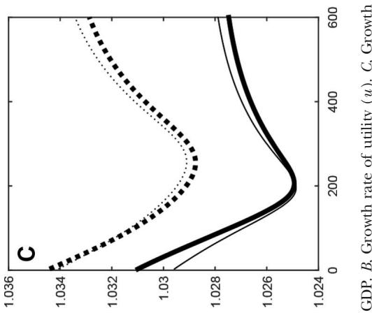

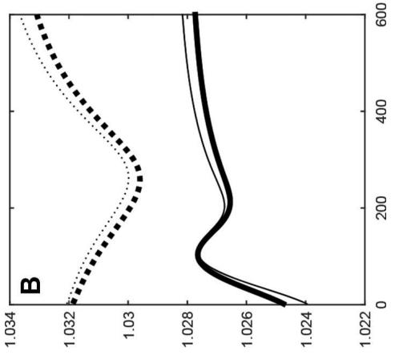

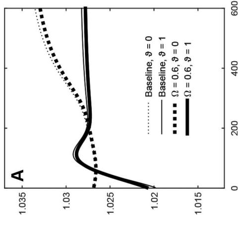  
963

Agglomeration economies.—Static agglomeration economies in our model are given by a=v. In the benchmark, with $\alpha = 0 . 0 6$ and $\theta = 6 . 5 ,$ , the static elasticity of productivity to density was around 0.01. We now increase a by 20 percent to 0.072. As expected, compared to the benchmark case, the present discounted values of real income and welfare increase. We would expect this effect to be larger under free mobility because it is easier to benefit from increased agglomeration economies when people can freely move. This is indeed the case: table A4 shows that the gains in real income increase from 125.8 percent in the benchmark to 126.6 percent, and the welfare gains increase from 305.9 percent in the benchmark to 309.4 percent. Given that we increased the magnitude of static agglomeration economies by 20 percent, the effects may seem modest. Note, however, that dynamic agglomeration economies are more important in the long run than static ones.

Congestion in amenities.—We now reduce the elasticity of amenities to density by 20 percent. This drastically reduces congestion and hence makes it less costly to agglomerate. As a result, real income increases compared to the benchmark. The effects are larger under free mobility, when the possibility to concentrate in the most attractive places is enhanced. Greater concentration leads to faster growth, explaining why the increase in real GDP from free mobility rises from 125.8 percent in the benchmark to 174.0 percent (table A4). Not surprisingly, because the negative congestion effect on amenities is much lower, the welfare gains are in relative terms much greater. Free mobility now increases welfare by 549.1 percent.

Strength of technology diffusion.—In the model the degree of spatial diffusion of technology is given by $1 - \gamma _ { 2 } .$ . In this exercise, we decrease $\gamma _ { 2 }$ from 0.993 in the benchmark to 0.991. This amounts to an increase in the degree of spatial diffusion of 20 percent.31 If best-practice technology diffuses faster, we would expect this to increase growth. As can be seen in figure A4, this is indeed the case, but only under current migration restrictions. In the case in which we eliminate moving costs, after some decades of faster growth, more diffusion actually lowers growth. The reason is that greater diffusion of technology lowers the incentive to concentrate in space. In the short run, the positive effect of more diffusion dominates, but in the long run the negative effect of less concentration and therefore less innovation dominates. This reversal underscores the importance of dynamics when thinking through the effect of more technological diffusion. In present discounted value (PDV) terms, the effect of greater diffusion is positive on real income and welfare gains. Since technological diffusion acts as a dispersion force, there is less congestion, so amenities improve. Stronger diffusion also implies that the economy takes less time to reach its BGP, as can be seen from figure A4.

f real GDP and utility for different values of g2. A, Growth rate of real GDP.B, Growth rate of utili  
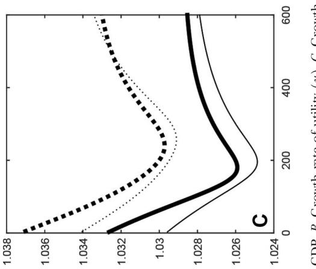

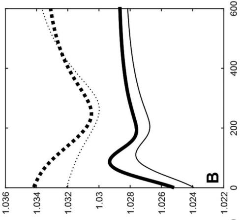

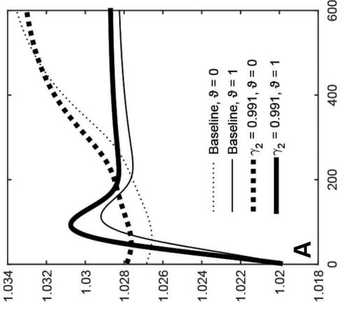

Spatial scope oftechnology diffusion.—Though technology diffusion in the model is slow, it diffuses to the whole world simultaneously. In this exercise, we explore what happens when we let technology diffuse locally rather than globally. In equation (8), we no longer take h to be constant, but instead assume that $\eta ( r , s ) =$ $\bar { \eta } \exp ( - \varkappa \hat { \delta } ( r , s ) )$ , with $\varkappa > 0$ and d(r, s) denoting the distance between locations r and s measured in kilometers. That is, location r obtains more technology spillovers from nearby locations. On the basis of the median of the distance decay parameters across different technologies in Comin, Dmitriev, and Rossi-Hansberg (2012), we use $\varkappa = 0 . 0 0 1 5$ . We choose the value of -h such that the initial growth rate of the economy is 2 percent as in the benchmark calibration; in other words, we change the geographic distribution oftechnology diffusion, but not its overall level. We present the results in figure A5. In the short run less spatial diffusion lowers growth rates, but in the long run it increases growth rates. To understand figure A5 note that there are two effects at work. On the one hand, less spatial diffusion hurts some places, lowering growth. On the other hand, less spatial diffusion keeps economic activity more spatially concentrated, increasing innovation. In the short run, the first effect dominates, whereas in the long run the second one does. Overall, going from global to local diffusion decreases real output and welfare by about 7 percent as shown in table A4.

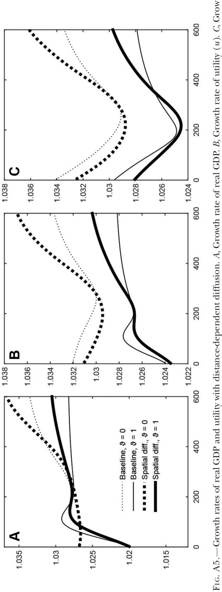

In terms of the gains from liberalization, the effect on real income increases from 125.8 percent in the benchmark to 131.8 percent in the case with local diffusion. Greater movement of people makes it easier for the high-productivity places to attract more people, and this is more important when technology is more concentrated. Focusing on the welfare measures yields the opposite results; namely, the gains are smaller than in the benchmark. This result is intuitive: with less diffusion of technology, you get more people living in places they do not particularly like.32

Transportation costs.—As a last robustness check, we increase transportation costs, first by 20 percent and then by 40 percent. We discuss some of these results in the main text. As expected, the rise in transport costs reduces real income and welfare. Table A4 shows that real output declines by 17.3 percent with an increase in trade costs of 20 percent: a fairly large effect. When transport costs go up by 20 percent, the gains from liberalizing migration are higher than in the benchmark case. The reason is as follows: greater transportation costs increase the incentives to spatially concentrate. Lower migration costs facilitate this geographic concentration, hence giving a boost to real income. So trade and migration are substitutes. The results are similar, but even larger in magnitude, in the case in which transport costs go up by 40 percent.

## Appendix B

## Proofs, Derivations, and Other Details

## A. Derivation of Expected Utility

To determine the expected utility of agents at $r , E [ u ( r ) \varepsilon ^ { i } ( r ) | \cdot $ i lives at $r ] ,$ we first derive the expected utility of agents who lived at u in period 0 and live at r in period $t . ^ { 3 3 }$ The cumulative density function of utility levels $u ^ { i } ( u , r )$ conditional on originating from u and choosing to live at r is

the geography of development

$$
\begin{array}{l} \operatorname * {P r} [ u ^ {i} (u, r) \leq \bar {u} | u ^ {i} (u, r) \geq u ^ {i} (u, s) \forall s \neq r ] \\ = \frac {\operatorname * {P r} [ u ^ {i} (u , r) \leq \bar {u} , u ^ {i} (u , r) \geq u ^ {i} (u , s) \forall s \neq r ]}{\operatorname * {P r} [ u ^ {i} (u , r) \geq u ^ {i} (u , s) \forall s \neq r ]} \\ = \left[ - \int_ {0} ^ {\bar {u}} \prod_ {S \backslash \{r \}} e ^ {- u (s) ^ {1 / \Omega} m (u, s) ^ {- 1 / \Omega} z ^ {- 1 / \Omega} d s} \frac {1}{\Omega} u (r) ^ {1 / \Omega} m (u, r) ^ {- 1 / \Omega} \right. \\ \times z ^ {- (1 / \Omega + 1)} e ^ {- u (r) ^ {1 / \Omega} m (u, r) ^ {- 1 / \Omega} z ^ {- 1 / \Omega}} d z \Bigg ] \\ \div \left\{u (r) ^ {1 / \Omega} m (u, r) ^ {- 1 / \Omega} / \left[ \int_ {S} u (s) ^ {1 / \Omega} m (u, s) ^ {- 1 / \Omega} d s \right] \right\} \\ = \int_ {0} ^ {\bar {u}} - \frac {1}{\Omega} \left[ \int_ {S} u (s) ^ {1 / \Omega} m (u, s) ^ {- 1 / \Omega} d s \right] \\ \times z ^ {- (1 / \Omega + 1)} e ^ {- \left[ \int_ {S} u (s) ^ {1 / \Omega} m (u, s) ^ {- 1 / \Omega} d s \right] z ^ {- 1 / \Omega}} d z \\ = e ^ {- \left[ \int_ {S} u (s) ^ {1 / \Omega} m (u, s) ^ {- 1 / \Omega} d s \right] z ^ {- 1 / \Omega}}; \end{array}\tag{969}
$$

that is, $u ^ { i } ( u , r )$ is distributed Fréchet, and therefore its mean is given by

$$
E [ u ^ {i} (u, r) | i \text {   originates   from   } u, \text {   lives   at   } r ]
$$

$$
= \Gamma (1 - \Omega) \left[ \int_ {s} u (s) ^ {1 / \Omega} m (u, s) ^ {- 1 / \Omega} d s \right] ^ {\Omega}.
$$

By equation (1), the expected value of $u ( r ) \varepsilon ^ { i } ( r )$ equals this expression divided by the moving costs the agent has to pay,

$$
E [ u (r) \varepsilon^ {i} (r) | i \text {   originates   from   } u, \text {   lives   at   } r ]
$$

$$
= \frac {\Gamma (1 - \Omega) \left[ \int_ {s} u (s) ^ {1 / \Omega} m (u , s) ^ {- 1 / \Omega} d s \right] ^ {\Omega}}{\prod_ {s = 1} ^ {t} m \left(r _ {s - 1} , r _ {s}\right)},
$$

from which, using assumption 1, we get

$E [ u ( r ) \varepsilon ^ { i } ( r ) | i$ originates from $u ,$ lives at $r ]$

$$
= \Gamma (1 - \Omega) m _ {2} (r) \left[ \int_ {S} u (s) ^ {1 / \Omega} m _ {2} (s) ^ {- 1 / \Omega} d s \right] ^ {\Omega};
$$

since this expression does not depend on u, we also have

$$
E [ u (r) \varepsilon^ {i} (r) | i \text {   lives   at   } r ] = \Gamma (1 - \Omega) m _ {2} (r) \left[ \int_ {S} u (s) ^ {1 / \Omega} m _ {2} (s) ^ {- 1 / \Omega} d s \right] ^ {\Omega},
$$

which is equation (4).

## B. Derivation of Trade Shares and the Price Index

We derive here in detail first the probability that a given good produced in an area r is bought in s. The area $\boldsymbol { B } ( \boldsymbol { r } , \delta )$ (a ball of radius d centered at r ) offers different goods in location s. The distribution of prices $\boldsymbol { B } ( \boldsymbol { r } , \delta )$ offered in s is given by

$$
G _ {t} (p, s, B (r, \delta)) = 1 - e ^ {- \int_ {B (r, \delta)} T _ {t} (r) \left[ \frac {m c _ {t} (r) \zeta (s , r)}{p} \right] ^ {- \theta} d r}.
$$

The distribution of the prices of the goods s actually buys is then

$$
G _ {t} (p, s) = 1 - e ^ {- \int_ {S} T _ {t} (u) \left[ \frac {m c _ {t} (u) \zeta (s , u)}{p} \right] ^ {- \theta} d u} = 1 - e ^ {- \chi_ {t} (s) p ^ {\theta}},
$$

where

$$
\chi_ {t} (s) = \int_ {S} T _ {t} (u) [ m c _ {t} (u) \varsigma (s, u) ] ^ {- \theta} d u.\tag{B1}
$$

Now we calculate the probability that a given good produced in an area $B ( r , \delta )$ is bought in $s .$ Start by computing the probability density that the price of the good produced in $B ( r , \delta )$ and offered in s is equal to $\boldsymbol { p }$ and that this is the lowest price offered in s. This is

$$
\frac {d G _ {t} (p , s , B (r , \delta))}{d p} e ^ {- \int_ {S \setminus B (r, \delta)} T _ {t} (u) \left[ \frac {m c _ {t} (u) \xi (u , \delta)}{p} \right] ^ {- \theta} d u}.
$$

Rewrite

$$
\begin{array}{l} d G _ {t} (p, s, B (r, \delta)) = e ^ {- \int_ {B (r, \delta)} T _ {t} (r) \left[ \frac {m c _ {t} (r) \varsigma (s , r)}{p} \right] ^ {- \theta} d r} \\ \qquad \times \int_ {B (r, \delta)} T _ {t} (r) [ m c _ {t} (r) \varsigma (r, s) ] ^ {- \theta} d r \theta p ^ {\theta - 1} d p. \end{array}
$$

Replace this into the previous expression and integrate over all possible prices,

$$
\int_ {0} ^ {\infty} e ^ {- \int_ {S} T _ {t} (u) \left[ \frac {m c _ {t} (u) \varsigma (s , u)}{p} \right] ^ {- \theta}} d u \int_ {B (r, \delta)} T _ {t} (r) [ m c _ {t} (r) \varsigma (r, s) ] ^ {- \theta} d r \theta p ^ {\theta - 1} d p.
$$

Solving this integral yields

$$
\left[ - e ^ {- \chi_ {t} (s) p ^ {\theta}} \frac {\int_ {B (r , \delta)} T _ {t} (r) [ m c _ {t} (r) \varsigma (r , s) ] ^ {- \theta} d r}{\chi_ {t} (s)} \right] _ {0} ^ {\infty},
$$

which gives

$$
\begin{array}{l} \pi_ {t} (s, B (r, \delta)) = \frac {\int_ {B (r , \delta)} T _ {t} (r) [ m c _ {t} (r) \varsigma (r , s) ] ^ {- \theta} d r}{\int_ {S} T _ {t} (u) [ m c _ {t} (u) \varsigma (u , s) ] ^ {- \theta} d u} \\ = \frac {\int_ {B (r , \delta)} T _ {t} (r) [ m c _ {t} (r) \varsigma (r , s) ] ^ {- \theta} d r}{\chi_ {t} (s)} \end{array}
$$

for all $r , s \in S$ . Since in any small interval with positive measure there will be many firms producing many goods, the above expressions can be interpreted as the fraction of goods location s buys from $\boldsymbol { B } ( \boldsymbol { r } , \delta )$ . In the limit, as $\delta \longrightarrow 0 ,$ this expression can be rewritten as

$$
\begin{array}{l} \pi_ {t} (s, r) = \frac {T _ {t} (r) [ m c _ {t} (r) \varsigma (r , s) ] ^ {- \theta}}{\int_ {S} T _ {t} (u) [ m c _ {t} (u) \varsigma (u , s) ] ^ {- \theta} d u} \\ = \frac {T _ {t} (r) [ m c _ {t} (r) \varsigma (r , s) ] ^ {- \theta}}{\chi_ {t} (s)} \quad \text { all } r, s \in S, \end{array}
$$

which is the expression in the text.

To finish this subsection, we derive the price index of a location s. We know that

$$
P _ {t} (s) ^ {\frac {- \rho}{1 - \rho}} = \int_ {0} ^ {1} p _ {t} ^ {\omega} (s) ^ {\frac {- \rho}{1 - \rho}} d \omega .
$$

This can be interpreted as the average price computed over the different goods that are being sold in s. This is the same as the expected value of the price of any good sold in s, so that

$$
P _ {t} (s) ^ {\frac {- \rho}{1 - \rho}} = \int_ {0} ^ {\infty} p ^ {\frac {- \rho}{1 - \rho}} \frac {d G _ {t} (s)}{d p} d p.
$$

Since

$$
\frac {d G _ {t} (s)}{d p} = \chi_ {t} (s) \theta p ^ {\theta - 1} e ^ {- \chi_ {t} (s) p ^ {\theta}},
$$

we can write the previous expression as

$$
P _ {t} (s) ^ {\frac {- \rho}{1 - \rho}} = \int_ {0} ^ {\infty} p ^ {\frac {- \rho}{1 - \rho}} \chi_ {t} (s) \theta p ^ {\theta - 1} e ^ {- \chi_ {t} (s) p ^ {\theta}} d p.
$$

By defining $x = \chi _ { t } ( s ) p ^ { \theta }$ , we can write $d x = \theta p ^ { \theta - 1 } \chi _ { t } ( s )$ . Substituting yields

$$
\int_ {0} ^ {\infty} \left[ \frac {x}{\chi_ {t} (s)} \right] ^ {\frac {- \rho}{(1 - \rho) \theta}} e ^ {- x} d x,
$$

which is equal to

$$
\chi_ {t} (s) ^ {\frac {\rho}{(1 - \rho) \theta}} \int_ {0} ^ {\infty} x ^ {\frac {- \rho}{(1 - \rho) \theta}} e ^ {- x} d x.
$$

The G function is defined as $\Gamma ( \alpha ) = \int _ { 0 } ^ { \infty } y ^ { \alpha - 1 } e ^ { - y } d y$ , so that we can rewrite the above expression as

$$
\chi_ {t} (s) ^ {\frac {\rho}{(1 - \rho) \theta}} \Gamma \left(\frac {- \rho}{(1 - \rho) \theta} + 1\right).
$$

Therefore,

$$
P _ {t} (s) ^ {\frac {- \rho}{1 - \rho}} = \chi_ {t} (s) ^ {\frac {\rho}{(1 - \rho) \theta}} \Gamma \left(\frac {- \rho}{(1 - \rho) \theta} + 1\right),
$$

so that

$$
P _ {t} (s) = \chi_ {t} (s) ^ {\frac {- 1}{\theta}} \left[ \Gamma \left(\frac {- \rho}{(1 - \rho) \theta} + 1\right) \right] ^ {- \frac {1 - \rho}{\rho}},
$$

which is the expression in the text.

## C. Proof of Lemma 2

Substituting (20) and (B1) into (22), we obtain

$$
u _ {t} (r) = \bar {a} (r) \bar {L} _ {t} (r) ^ {- \lambda} \frac {\xi}{\mu \xi + \gamma_ {1}} \frac {w _ {t} (r)}{\left[ \int_ {s} T _ {t} (s) [ m c _ {t} (s) \varsigma (r , s) ] ^ {- \theta} d s \right] ^ {\frac {- 1}{\theta}} \bar {p}}
$$

for any location $r ,$ where

$$
\bar {p} = \left[ \Gamma \left(\frac {- \rho}{(1 - \rho) \theta} + 1\right) \right] ^ {- \frac {1 - \rho}{\rho}}.
$$

We can rewrite this as

$$
\bar {a} (r) ^ {- \theta} w _ {t} (r) ^ {- \theta} \bar {L} _ {t} (r) ^ {\lambda \theta} = \left[ \frac {\mu \xi + \gamma_ {1}}{\xi} \right] ^ {- \theta} (u _ {t} (r) \bar {p}) ^ {- \theta} \int_ {s} T _ {t} (s) [ m c _ {t} (s) \varsigma (r, s) ] ^ {- \theta} d s,
$$

from which

$$
\begin{array}{l} \left[ \frac {\bar {a} (r)}{u _ {t} (r)} \right] ^ {- \theta} w _ {t} (r) ^ {- \theta} \bar {L} _ {t} (r) ^ {\lambda \theta} \\ = \kappa_ {1} \int_ {S} \tau_ {t} (s) \varsigma (r, s) ^ {- \theta} w _ {t} (s) ^ {- \theta} \bar {L} _ {t} (s) ^ {\alpha - (1 - \mu - \frac {\gamma_ {i}}{\xi}) \theta} d s, \end{array}\tag{B2}
$$

where

$$
\kappa_ {1} = \left[ \frac {\mu \xi + \gamma_ {1}}{\xi} \right] ^ {- \left[ \mu + \frac {\gamma_ {1}}{\xi} \right] \theta} \mu^ {\mu \theta} \left[ \frac {\xi \nu}{\gamma_ {1}} \right] ^ {- \frac {\gamma_ {1} \theta}{\xi}} \bar {p} ^ {- \theta}.
$$

This yields the first set of equations that $u _ { t } ( \cdot ) , \bar { L } _ { t } ( \cdot )$ , and $w _ { t } ( \cdot )$ have to solve.

Inserting (19) and (20) into the balanced trade condition, we get

$$
w _ {t} (r) H (r) \bar {L} _ {t} (r) = \bar {p} ^ {- \theta} \int_ {S} T _ {t} (r) [ m c _ {t} (r) \varsigma (r, s) ] ^ {- \theta} P _ {t} (s) ^ {\theta} w _ {t} (s) H (s) \bar {L} _ {t} (s) d s.
$$

Substituting (22) and $T _ { t } ( r ) = \tau _ { t } ( r ) \bar { L } _ { t } ( r ) ^ { \alpha }$ into the previous equation yields

$$
\begin{array}{c} \tau_ {t} (r) ^ {- 1} H (r) w _ {t} (r) ^ {1 + \theta} \bar {L} _ {t} (r) ^ {1 - \alpha + (1 - \mu - \frac {\gamma_ {l}}{\xi}) \theta} \\ = \kappa_ {1} \int_ {S} \left[ \frac {\bar {a} (s)}{u _ {t} (s)} \right] ^ {\theta} H (s) \varsigma (s, r) ^ {- \theta} w _ {t} (s) ^ {1 + \theta} \bar {L} _ {t} (s) ^ {1 - \lambda \theta} d s. \end{array}\tag{B3}
$$

This gives the second set of equations that $u _ { t } ( \cdot ) , \bar { L } _ { t } ( \cdot )$ , and $w _ { t } ( \cdot )$ have to solve. The third set ofequations that $u _ { t } ( \cdot ) , \bar { L } _ { t } ( \cdot )$ , and $w _ { t } ( \cdot )$ have to solve is given by (7). Clearly, $\tau _ { t } ( \cdot )$ is obtained directly from (8) and $\bar { L } _ { t - 1 } ( \cdot )$

We can use (B2) and (B3) to analyze the equilibrium allocation further under symmetric trade costs. In doing so, we follow the proof of theorem 2 in Allen and Arkolakis (2014). Assume trade costs are symmetric so that $\varsigma ( r , s ) = \varsigma ( s , r )$ . Introduce the following function, which is the ratio of the left-hand sides of (B1) and (B2):

$$
f _ {1} (r) = \frac {\tau_ {t} (r) ^ {- 1} H (r) w _ {t} (r) ^ {1 + \theta} \bar {L} _ {t} (r) ^ {1 - \alpha + \left(1 - \mu - \frac {2 1}{\xi}\right) \theta}}{\left[ \frac {\bar {a} (r)}{u _ {t} (r)} \right] ^ {- \theta} w _ {t} (r) ^ {- \theta} \bar {L} _ {t} (r) ^ {\lambda \theta}}.
$$

Obviously, f1(r) equals the ratio of the right-hand sides, that is,

$$
f _ {1} (r) = \frac {\int_ {S} \left[ \frac {\bar {a} (s)}{u _ {t} (s)} \right] ^ {\theta} H (s) w _ {t} (s) ^ {1 + \theta} \bar {L} _ {t} (s) ^ {1 - \lambda \theta} \varsigma (s , r) ^ {- \theta} d s}{\int_ {S} \tau_ {t} (s) w _ {t} (s) ^ {- \theta} \bar {L} _ {t} (s) ^ {\alpha - (1 - \mu - \frac {\gamma_ {1}}{\xi}) \theta} \varsigma (r , s) ^ {- \theta} d s},
$$

from which, using $\varsigma ( r , s ) = \varsigma ( s , r )$ , we obtain

$$
f _ {1} (r) = \frac {\int_ {s} f _ {1} (s) ^ {- \lambda} f _ {2} (s , r) d s}{\int_ {s} f _ {1} (s) ^ {- (1 + \lambda)} f _ {2} (s , r) d s},\tag{B4}
$$

where

$$
\begin{array}{l} f _ {2} (s, r) = \frac {\tau_ {t} (s) ^ {- \lambda}}{\varsigma (s , r) ^ {\theta}} \left[ \frac {\overline {{a}} (s)}{u _ {t} (s)} \right] ^ {(1 + \lambda) \theta} H (s) ^ {1 + \lambda} w _ {t} (s) ^ {1 + \theta + (1 + 2 \theta) \lambda} \\ \times \bar {L} _ {t} (s) ^ {1 - \lambda \theta - \lambda [ \alpha - 1 + [ \lambda + \frac {\gamma_ {1}}{\xi} - (1 - \mu) ] \theta ]}. \end{array}
$$

Write (B4) as

$$
f _ {3} (r) = \frac {f _ {1} (r) ^ {- \lambda}}{\int_ {S} f _ {1} (s) ^ {- \lambda} f _ {2} (s , r) d s} = \frac {f _ {1} (r) ^ {- (1 + \lambda)}}{\int_ {S} f _ {1} (s) ^ {- (1 + \lambda)} f _ {2} (s , r) d s}.\tag{B5}
$$

Then, using the notation

$$
g _ {1} (r) = f _ {1} (r) ^ {- \lambda}
$$

and

$$
g _ {2} (r) = f _ {1} (r) ^ {- (1 + \lambda)},
$$

one can write this last equation as

$$
g _ {1} (r) = \int_ {S} f _ {3} (r) f _ {2} (s, r) g _ {1} (s) d s\tag{B6}
$$

and

$$
g _ {2} (r) = \int_ {S} f _ {3} (r) f _ {2} (s, r) g _ {2} (s) d s.\tag{B7}
$$

Define $K ( s , r )$ as the value of $f _ { 3 } ( r ) f _ { 2 } ( s , r )$ evaluated at the solution $g _ { 1 } ^ { * } .$ . By (B5), the value of $f _ { 3 } ( r ) f _ { 2 } ( s , r )$ evaluated at $g _ { 2 }$ is the same for any pair of locations (r, s). Therefore, $g _ { 1 }$ and $g _ { 2 }$ are both solutions to the integral equation

$$
x (r) = \int_ {s} K (s, r) x (s) d s.\tag{B8}
$$

Note that $K ( s , r )$ is nonnegative, continuous, and square-integrable. Nonnegativity of $K ( \cdot , \cdot )$ immediately follows from the nonnegativity of $f _ { 2 }$ and $f _ { 3 } .$ . To see measurability, recall that $\bar { \boldsymbol { a } } ( \boldsymbol { r } )$ $H ( r )$ , and $\tau _ { 0 } ( r )$ are assumed to be continuous functions. We also need to assume that $u _ { 0 } ( r )$ , w (r), and $\bar { L } _ { 0 } ( r )$ are continuous; otherwise, the integrals on the right-hand sides of (B2) and (B3) would not be well defined. Once this is the case, $\tau _ { 1 } ( r )$ is also continuous by $( 8 ) ;$ ; hence so are $u _ { 1 } ( r ) , w _ { 1 } ( r )$ and $\bar { L } _ { 1 } ( r )$ . Using this logic, one can show that $\tau _ { 1 } ( r )$ , ut(r ), wt(r ), and $\bar { L } _ { t } ( r )$ are continuous for any t. Thus, $, f _ { 1 } , f _ { 2 } ,$ and $f _ { 3 }$ are all continuous, which implies that $K ( \cdot , \cdot )$ is continuous.34 Square-integrability, which means

$$
\int_ {S} \int_ {S} K (s, r) ^ {2} d s d r <   \infty ,
$$

is due to the fact that S is bounded by assumption, but so is $K ( \cdot , \cdot )$ . To see why $K ( \cdot , \cdot )$ is bounded, note that population at a location cannot shrink to zero unless the location offers zero nominal wages that compensate for its infinitely good amenities. Also, population at a location cannot be larger than $\bar { L }$ . These upper and lower bounds on population translate into upper and lower bounds on $f _ { 2 } ( \cdot , \cdot )$ and $f _ { 3 } ( \cdot )$ and hence on $K ( \cdot , \cdot )$

Given the above properties of $K ( \cdot , \cdot )$ , theorem 2.1 in Zabreyko et al. (1975) guarantees that the solution to (B8) exists and is unique up to a scalar multiple. Hence

$$
g _ {1} (r) = \varpi g _ {2} (r),
$$

where ϖ is a constant. Therefore, we have

$$
f _ {1} (r) ^ {- \lambda} = \varpi f _ {1} (r) ^ {- (1 + \lambda)},
$$

from which

$$
f _ {1} (r) = \varpi .
$$

That is,

$$
\frac {\tau_ {t} (r) ^ {- 1} H (r) w _ {t} (r) ^ {1 + \theta} \bar {L} _ {t} (r) ^ {1 - \alpha + \left(1 - \mu - \frac {\gamma \lambda}{\xi}\right) \theta}}{\left[ \frac {\bar {a} (r)}{u _ {t} (r)} \right] ^ {- \theta} w _ {t} (r) ^ {- \theta} \bar {L} _ {t} (r) ^ {\lambda \theta}} = \varpi ;
$$

thus

34 A rigorous proof of the measurability of $K ( \cdot , \cdot )$ requires some further steps that we have not included in this draft but are available on request. We acknowledge the help of Áron Tóbiás in formulating this more rigorous proof.

the geography of development

$$
w _ {t} (r) = \varpi^ {\frac {1}{1 + 2 \theta}} \biggl [ \frac {\bar {a} (r)}{u _ {t} (r)} \biggr ] ^ {- \frac {\theta}{1 + 2 \theta}} \tau_ {t} (r) ^ {\frac {1}{1 + 2 \theta}} H (r) ^ {- \frac {1}{1 + 2 \theta}} \bar {L} _ {t} (r) ^ {\frac {\alpha - 1 + \left[ \lambda + \frac {\gamma_ {1}}{\xi} - (1 - \mu) \right] \theta}{1 + 2 \theta}},
$$

which is the same as equation (23), with w- defined as $\bar { w } = { { \varpi ^ { 1 / ( 1 + 2 \theta ) } } }$

Substituting this into (B2) yields the second equation in lemma 2:

$$
\begin{array}{l} \left[ \frac {\bar {a} (r)}{u _ {t} (r)} \right] ^ {- \frac {\theta (1 + \theta)}{1 + 2 \theta}} \tau_ {t} (r) ^ {- \frac {\theta}{1 + 2 \theta}} H (r) ^ {\frac {\theta}{1 + 2 \theta}} \bar {L} _ {t} (r) ^ {\lambda \theta - \frac {\theta}{1 + 2 \theta} [ \alpha - 1 + [ \lambda + \frac {\gamma_ {1}}{\xi} - (1 - \mu) ] \theta ]} \\ = \kappa_ {1} \int_ {S} \left[ \frac {\bar {a} (s)}{u _ {t} (s)} \right] ^ {\frac {\theta^ {2}}{1 + 2 \theta}} \tau_ {t} (s) ^ {\frac {1 + \theta}{1 + 2 \theta}} H (s) ^ {\frac {\theta}{1 + 2 \theta}} \varsigma (r, s) ^ {- \theta} \\ \times \bar {L} _ {t} (s) ^ {1 - \lambda \theta + \frac {1 + \theta}{1 + 2 \theta} [ \alpha - 1 + [ \lambda + \frac {\gamma_ {1}}{\xi} - (1 - \mu) ] \theta ]} d s. \end{array}\tag{B9}
$$

QED

## D. Proof of Lemma 3

Substituting (7) in (24) yields

$$
\begin{array}{c} B _ {1 t} (r) \hat {u} _ {t} (r) ^ {\frac {1}{\theta} \left[ \lambda \theta - \frac {\theta}{1 + 2 \theta} \left[ \alpha - 1 + \left[ \lambda + \frac {\gamma_ {1}}{\xi} - [ 1 - \mu ] \theta \right] \right] + \frac {\theta (1 + \theta)}{1 + 2 \theta} \right.} \\ = \kappa_ {1} \int_ {S} \hat {u} _ {t} (s) ^ {\frac {1}{\theta} \left[ 1 - \lambda \theta + \frac {1 + \theta}{1 + 2 \theta} \left[ \alpha - 1 + \left[ \lambda + \frac {\gamma_ {1}}{\xi} - [ 1 - \mu ] \theta \right] \right] - \frac {\theta^ {2}}{1 + 2 \theta} \right.} B _ {2 t} (s) \varsigma (r, s) ^ {- \theta} d s, \end{array}\tag{B10}
$$

where

$$
\begin{array}{l} B _ {1 t} (r) = \bar {a} (r) ^ {- \frac {\theta (1 + \theta)}{1 + 2 \theta}} \tau_ {t} (r) ^ {- \frac {\theta}{1 + 2 \theta}} H (r) ^ {\frac {\theta}{1 + 2 \theta} \left[ \alpha + \left[ \lambda + \frac {\gamma_ {1}}{\xi} - [ 1 - \mu ] \theta \right] - \lambda \theta \right.} \\ \times m _ {2} (r) ^ {- \frac {1}{\Omega} \left[ \lambda \theta - \frac {\theta}{1 + 2 \theta} \left[ \alpha - 1 + \left[ \lambda + \frac {\gamma_ {1}}{\xi} - [ 1 - \mu ] \theta \right] \right] \right.} \end{array}
$$

and

$$
\begin{array}{r l} B _ {2 t} (r, s) = & \bar {a} (s) ^ {\frac {\theta^ {2}}{1 + 2 \theta}} \tau_ {t} (s) ^ {\frac {1 + \theta}{1 + 2 \theta}} H (s) ^ {\frac {\theta}{1 + 2 \theta} - 1 + \lambda \theta - \frac {1 + \theta}{1 + 2 \theta} [ \alpha - 1 + [ \lambda + \frac {\gamma_ {1}}{\xi} - [ 1 - \mu ] ] \theta ]} \\ & \times m _ {2} (s) ^ {- \frac {1}{\Omega} [ 1 - \lambda \theta + \frac {1 + \theta}{1 + 2 \theta} [ \alpha - 1 + [ \lambda + \frac {\gamma_ {1}}{\xi} - [ 1 - \mu ] ] \theta ] ]} \varsigma (r, s) ^ {- \theta} \end{array}
$$

are exogenously given functions, and

$$
\hat {u} _ {t} (r) = u _ {t} (r) \left[ \frac {\bar {L}}{\int_ {S} u _ {t} (v) ^ {1 / \Omega} m _ {2} (v) ^ {- 1 / \Omega} d v} \right] ^ {\Omega \left[ 1 - \frac {\theta}{\frac {1}{\Omega} \left[ (\lambda + (1 - \mu) - \frac {2 \lambda}{\xi}) ^ {\beta - \alpha} + \theta \right]} \right]}.\tag{B11}
$$

First we prove that a solution to (B10) exists and is unique if $\alpha / \theta + \gamma _ { 1 } / \xi \leq \Omega +$ $\lambda + 1 - \mu .$ Equations (B10) constitute a system of equations that pin down $\hat { \boldsymbol u } _ { t } ( \boldsymbol r )$ It follows from theorem 2.19 in Zabreyko et al. (1975) that the solution $f ( \cdot )$ to equation

$$
B _ {1} (r) f (r) ^ {\tilde {\gamma} _ {1}} = \kappa_ {1} \int_ {S} B _ {2} (r, s) f (s) ^ {\tilde {\gamma} _ {2}} d s
$$

exists and is unique if (i) the function $\kappa _ { 1 } B _ { 1 } ( r ) ^ { - 1 } B _ { 2 } ( r , s )$ is strictly positive and continuous, which is a direct consequence of assumption 3, and $\mathrm { ( i i ) } \ \lvert \tilde { \gamma } _ { 2 } / \tilde { \gamma } _ { 1 } \rvert \leq 1 ;$ that is, the ratio of exponents on the right-hand side and on the left-hand side is not larger than one in absolute value. In the case of equation (B10), this condition implies

$$
\frac {\frac {1}{\Omega} \left[ 1 - \lambda \theta + \frac {1 + \theta}{1 + 2 \theta} \left[ \alpha - 1 + \left[ \lambda + \frac {\gamma_ {1}}{\xi} - [ 1 - \mu ] \right] \theta \right] \right] - \frac {\theta^ {2}}{1 + 2 \theta}}{\frac {1}{\Omega} \left[ \lambda \theta - \frac {\theta}{1 + 2 \theta} \left[ \alpha - 1 + \left[ \lambda + \frac {\gamma_ {1}}{\xi} - [ 1 - \mu ] \right] \theta \right] \right] + \frac {\theta (1 + \theta)}{1 + 2 \theta}} \leq 1,
$$

from which, by arranging, we get

$$
\frac {\alpha}{\theta} + \frac {\gamma_ {1}}{\xi} \leq \lambda + 1 - \mu + \Omega .
$$

Theorem 2.19 in Zabreyko et al. (1975) also implies that we can solve equation (B10) using the following iterative procedure. Guess an initial distribution, $\hat { u } _ { t } ^ { 0 } ( \cdot )$ Plug it into the right-hand side of equation (B10), calculate the left-hand side, and solve for the distribution of utility; call this $\hat { u } _ { t } ^ { 1 } ( \cdot )$ . Then compute the distance between $\hat { u } _ { t } ^ { 1 } ( \cdot )$ and $\hat { u } _ { t } ^ { 0 } ( \cdot )$ , defined as

$$
\mathrm{dist} _ {t} ^ {1} = \int_ {S} \left[ \hat {u} _ {t} ^ {1} (r) - \hat {u} _ {t} ^ {0} (r) \right] ^ {2} d r.
$$

If dist1t $< \varepsilon ,$ where ε is an exogenously given tolerance level, stop. Otherwise, plug $\hat { u } _ { t } ^ { 1 } ( \cdot )$ into the right-hand side of (B10), obtain the updated distribution $\hat { \boldsymbol { u } } _ { t } ^ { 2 } ( \boldsymbol { r } )$ , and compute dist2, defined analogously to dist1. Continue the procedure until disti < ε for some $i .$

To obtain $u _ { t } ( \cdot )$ from $\hat { u } _ { t } ( \cdot )$ , we write equation (B11) as

$$
u _ {t} (r) = \frac {\hat {u} _ {t} (r)}{\hat {U} _ {t} ^ {F}},\tag{B12}
$$

where

$$
\hat {U} _ {t} = \frac {\bar {L}}{\int_ {S} m _ {2} (v) ^ {- 1 / \Omega} u _ {t} (v) ^ {1 / \Omega} d v}\tag{B13}
$$

is independent of r and

$$
\frac {F}{\Omega} = 1 - \frac {\theta}{\frac {1}{\Omega} \left[ \left[ \lambda + (1 - \mu) - \frac {\gamma_ {1}}{\xi} \right] \theta - \alpha \right] + \theta}.
$$

Plugging (B12) into (B13) and rearranging yields

$$
\hat {U} _ {t} ^ {1 - \frac {F}{\Omega}} = \frac {\bar {L}}{\int_ {S} m _ {2} (v) ^ {- 1 / \Omega} \hat {u} _ {t} (v) ^ {1 / \Omega} d v}.
$$

Therefore, the value of $\hat { U } _ { t }$ can be uniquely expressed as

the geography of development

$$
\hat {U} _ {t} = \left[ \frac {\bar {L}}{\int_ {S} m _ {2} (v) ^ {- 1 / \Omega} u _ {t} (v) ^ {1 / \Omega} d v} \right] ^ {\frac {1}{1 - \frac {E}{\Omega}}},
$$

as long as $F / \Omega \neq 1$ which is guaranteed by $\theta > 0$ . Hence, under the stated parameter restriction the value of $u _ { t } ( r )$ can be uniquely expressed from equation (B12). With unique values of $u _ { t } ( r )$ in hand, we can simply use equations (7) to obtain unique population levels $\bar { \boldsymbol { L } } _ { t } ( s )$ and equations (23) to obtain unique wages, wt(r ) for all $r \in S . \operatorname { Q E D }$

## E. Proof of Lemma 4

Given the evolution of technology in (8), the growth rate of $\tau _ { t } ( r )$ is given by

$$
\frac {\tau_ {t + 1} (r)}{\tau_ {t} (r)} = \phi_ {t} (r) ^ {\theta \gamma_ {1}} \left[ \int_ {S} \eta \frac {\tau_ {t} (s)}{\tau_ {t} (r)} d s \right] ^ {1 - \gamma_ {2}}.
$$

Divide both sides of the equation by the corresponding equation for location s, and rearrange to get

$$
\frac {\tau_ {t} (s)}{\tau_ {t} (r)} = \left[ \frac {\phi (s)}{\phi (r)} \right] ^ {\frac {\theta \gamma_ {1}}{1 - \gamma_ {2}}} = \left[ \frac {\bar {L} (s)}{\bar {L} (r)} \right] ^ {\frac {\theta \gamma_ {1}}{(1 - \gamma_ {2}) \xi}},
$$

where the second equality follows from (12), and where we drop the time subscript to indicate that we refer to a variable that remains constant in the BGP. Use this relationship to obtain that

$$
\bar {L} (s) = \left[ \frac {\tau_ {t} (s)}{\tau_ {t} (r)} \right] ^ {\frac {(1 - \gamma_ {2}) \xi}{\theta \gamma_ {1}}} \bar {L} (r),
$$

and $^ { \mathrm { s o , } }$ after integrating over s and using the labor market clearing condition, that

$$
\int_ {S} H (s) \bar {L} (s) d s = \bar {L} = \bar {L} (r) \tau_ {t} (r) ^ {- \frac {(1 - \gamma_ {2}) \xi}{\theta_ {\gamma_ {1}}}} \int_ {S} H (s) \tau_ {t} (s) ^ {\frac {(1 - \gamma_ {2}) \xi}{\theta_ {\gamma_ {1}}}} d s
$$

or

$$
\tau_ {t} (r) = \kappa_ {t} ^ {2} L (r) ^ {\frac {\theta \gamma_ {1}}{(1 - \gamma_ {2}) \xi}},\tag{B14}
$$

where $\kappa _ { t } ^ { 2 }$ depends on time but not on location. Substituting (B14) into (24) implies that

$$
\begin{array}{l} \left[ \frac {\bar {a} (r)}{u _ {t} (r)} \right] ^ {- \frac {\theta (1 + \theta)}{1 + 2 \theta}} H (r) ^ {\frac {\theta}{1 + 2 \theta}} \bar {L} (r) ^ {\lambda \theta - \frac {\theta}{1 + 2 \theta} \left[ \alpha - 1 + \left[ \lambda + \frac {\gamma_ {1}}{\xi} - [ 1 - \mu ] \right] \theta + \frac {\theta \gamma_ {1}}{(1 - \gamma_ {2}) \xi} \right]} \\ = \kappa_ {1} \kappa_ {t} ^ {2} \int_ {S} \left[ \frac {\bar {a} (s)}{u _ {t} (s)} \right] ^ {\frac {\theta^ {2}}{1 + 2 \theta}} H (s) ^ {\frac {\theta}{1 + 2 \theta}} \varsigma (r, s) ^ {- \theta} \\ \times \bar {L} (s) ^ {1 - \lambda \theta + \frac {1 + \theta}{1 + 2 \theta} \left[ \alpha - 1 + \left[ \lambda + \frac {\gamma_ {1}}{\xi} - [ 1 - \mu ] \right] \theta + \frac {\theta \gamma_ {1}}{(1 - \gamma_ {2}) \xi} \right]} d s. \end{array}\tag{B15}
$$

Substituting equation (7) in (B15) yields

$$
\begin{array}{l} \left[ \frac {\bar {a} (r)}{u _ {t} (r)} \right] ^ {- \frac {\theta (1 + \theta)}{1 + 2 \theta}} H (r) ^ {\frac {\theta}{1 + 2 \theta}} \left[ \frac {u _ {t} (r) ^ {1 / \Omega} m _ {2} (r) ^ {- 1 / \Omega}}{\int_ {S} u _ {t} (v) ^ {1 / \Omega} m _ {2} (v) ^ {- 1 / \Omega} d v} \frac {\bar {L}}{H (r)} \right] ^ {\lambda \theta - \frac {\theta}{1 + 2 \theta} \left[ \alpha - 1 + \left[ \lambda + \frac {\gamma_ {1}}{\xi} - [ 1 - \mu ] \right] \theta + \frac {\theta \gamma_ {1}}{(1 - \gamma_ {2}) \xi} \right]} \\ = \kappa_ {1} \kappa_ {t} ^ {2} \int_ {S} \left[ \frac {\bar {a} (s)}{u _ {t} (s)} \right] ^ {\frac {\theta^ {2}}{1 + 2 \theta}} H (s) ^ {\frac {\theta}{1 + 2 \theta}} \varsigma (r, s) ^ {- \theta} \\ \times \left[ \frac {u _ {t} (s) ^ {1 / \Omega} m _ {2} (s) ^ {- 1 / \Omega}}{\int_ {S} u _ {t} (v) ^ {1 / \Omega} m _ {2} (v) ^ {- 1 / \Omega} d v} \frac {\bar {L}}{H (s)} \right] ^ {1 - \lambda \theta + \frac {1 + \theta}{1 + 2 \theta} \left[ \alpha - 1 + \left[ \lambda + \frac {\gamma_ {1}}{\xi} - [ 1 - \mu ] \right] \theta + \frac {\theta \gamma_ {1}}{(1 - \gamma_ {2}) \xi} \right]} \\ \end{array}\tag{B16}
$$

ds,

where time subscripts have been dropped for variables that do not change in the BGP. Rearranging (B16) yields

$$
\begin{array}{c} B _ {1} (r) \hat {u} _ {t} (r) ^ {\frac {1}{\Omega}} \left[ \lambda \theta - \frac {\theta}{1 + 2 \theta} \left[ \alpha - 1 + \left[ \lambda + \frac {\gamma_ {1}}{\xi} - [ 1 - \mu ] \right] \theta + \frac {\theta \gamma_ {1}}{(1 - \gamma_ {2}) \xi} \right] \right] + \frac {\theta (1 + \theta)}{1 + 2 \theta} \\ = \kappa_ {1} \kappa_ {t} ^ {2} \int_ {S} \hat {u} _ {t} (s) ^ {\frac {1}{\Omega}} \left[ 1 - \lambda \theta + \frac {1 + \theta}{1 + 2 \theta} \left[ \alpha - 1 + \left[ \lambda + \frac {\gamma_ {1}}{\xi} - [ 1 - \mu ] \right] \theta + \frac {\theta \gamma_ {1}}{(1 - \gamma_ {2}) \xi} \right] \right] - \frac {\theta^ {2}}{1 + 2 \theta} B _ {2} (s) \varsigma (r, s) ^ {- \theta} d s, \end{array}\tag{B17}
$$

where

$$
\begin{array}{r l} B _ {1} (r) = & \bar {a} (r) ^ {- \frac {\theta (1 + \theta)}{1 + 2 \theta}} H (r) ^ {\frac {\theta}{1 + 2 \theta}} \left[ \alpha + \left[ \lambda + \frac {\gamma_ {1}}{\xi} - [ 1 - \mu ] \right] \theta + \frac {\theta \gamma_ {1}}{(1 - \gamma_ {2}) \xi} \right] - \lambda \theta \\ & \times m _ {2} (r) ^ {- \frac {1}{\Omega} \left[ \lambda \theta - \frac {\theta}{1 + 2 \theta} \left[ \alpha - 1 + \left[ \lambda + \frac {\gamma_ {1}}{\xi} - [ 1 - \mu ] \right] \theta + \frac {\theta \gamma_ {1}}{(1 - \gamma_ {2}) \xi} \right] \right]} \end{array}
$$

and

$$
\begin{array}{r c l} B _ {2} (s) & = & \bar {a} (s) ^ {\frac {\theta^ {2}}{1 + 2 \theta}} H (s) ^ {\frac {\theta}{1 + 2 \theta} - 1 + \lambda \theta - \frac {1 + \theta}{1 + 2 \theta} \left[ \alpha - 1 + \left[ \lambda + \frac {\gamma_ {1}}{\xi} - [ 1 - \mu ] \right] \theta + \frac {\theta \gamma_ {1}}{(1 - \gamma_ {2}) \xi} \right]} \\ & & \times m _ {2} (s) ^ {- \frac {1}{\Omega} \left[ 1 - \lambda \theta + \frac {1 + \theta}{1 + 2 \theta} \left[ \alpha - 1 + \left[ \lambda + \frac {\gamma_ {1}}{\xi} - [ 1 - \mu ] \right] \theta + \frac {\theta \gamma_ {1}}{(1 - \gamma_ {2}) \xi} \right] \right]} \end{array}
$$

are exogenously given functions, and

$$
\hat {u} _ {t} (r) = u _ {t} (r) \tilde {U} _ {t},\tag{B18}
$$

where

$$
\tilde {U} _ {t} = \left[ \frac {\bar {L}}{\int_ {S} u _ {t} (v) ^ {1 / \Omega} m _ {2} (v) ^ {- 1 / \Omega} d v} \right] ^ {\Omega \left[ 1 - \frac {\theta}{\frac {1}{\Omega} \left[ \left(\lambda + (1 - \mu) - \frac {\gamma_ {1}}{\xi} \right] \theta - \alpha - \frac {\theta \gamma_ {1}}{(1 - \gamma_ {2}) \xi} \right] + \theta} \right]}.
$$

Equations (B17) constitute a system of equations that pin down $\hat { \boldsymbol u } _ { t } ( \boldsymbol r )$ . It follows from theorem 2.19 in Zabreyko et al. (1975) that the solution $f ( \cdot )$ to equation

$$
B _ {1} (r) f (r) ^ {\tilde {\gamma} _ {1}} = B _ {3} \int_ {S} B _ {2} (s) f (s) ^ {\tilde {\gamma} _ {2}} d s
$$

exists and is unique i $\mathrm { ~ f ~ } | \tilde { \gamma } _ { 2 } / \tilde { \gamma } _ { 1 } | \le 1 ;$ that is, the ratio of exponents on the righthand side and on the left-hand side is not larger than one in absolute value. In the case of equation (B17), this condition implies

$$
\frac {\frac {1}{\Omega} \left[ 1 - \lambda \theta + \frac {1 + \theta}{1 + 2 \theta} \left[ \alpha - 1 + \left[ \lambda + \frac {\gamma_ {1}}{\xi} - [ 1 - \mu ] \right] \theta + \frac {\theta \gamma_ {1}}{(1 - \gamma_ {2}) \xi} \right] \right] - \frac {\theta^ {2}}{1 + 2 \theta}}{\frac {1}{\Omega} \left[ \lambda \theta - \frac {\theta}{1 + 2 \theta} \left[ \alpha - 1 + \left[ \lambda + \frac {\gamma_ {1}}{\xi} - [ 1 - \mu ] \right] \theta + \frac {\theta \gamma_ {1}}{(1 - \gamma_ {2}) \xi} \right] \right] + \frac {\theta (1 + \theta)}{1 + 2 \theta}} \leq 1,
$$

from which, by arranging, we get

$$
\frac {\alpha}{\theta} + \frac {\gamma_ {1}}{\xi} + \frac {\gamma_ {1}}{(1 - \gamma_ {2}) \xi} \leq \lambda + 1 - \mu + \Omega .
$$

Once we have found a solution $\hat { \boldsymbol u } _ { t } ( \boldsymbol r )$ , the rest of the equilibrium calculation proceeds as in lemma 3. QED

## F. Proof of Lemma 5

Lemma 4 guarantees that if the economy is in its BGP in periods t and $t + 1$ , then

$$
\begin{array}{r} \frac {u _ {t + 1} (r)}{u _ {t} (r)} = \left[ \frac {\kappa_ {t + 1} ^ {2}}{\kappa_ {t} ^ {2}} \right] ^ {\frac {1}{\theta}} \\ = \left[ \frac {\tau_ {t + 1} (r)}{\tau_ {t} (r)} \right] ^ {\frac {1}{\theta}} \end{array}
$$

for all $r ,$ so since

$$
\begin{array}{l} \frac {\tau_ {t + 1} (r)}{\tau_ {t} (r)} = \phi (r) ^ {\theta \gamma_ {1}} \left[ \int_ {S} \eta \frac {\tau_ {t} (s)}{\tau_ {t} (r)} d s \right] ^ {1 - \gamma_ {2}} = \phi (r) ^ {\theta \gamma_ {1}} \left[ \int_ {S} \eta \left[ \frac {\phi (s)}{\phi (r)} \right] ^ {\frac {\theta \gamma_ {1}}{1 - \gamma_ {2}}} d s \right] ^ {1 - \gamma_ {2}} \\ = \eta^ {1 - \gamma_ {2}} \left[ \frac {\gamma_ {1} / \nu}{\gamma_ {1} + \mu \xi} \right] ^ {\frac {\theta \gamma_ {1}}{\xi}} \left[ \int_ {S} \bar {L} (s) ^ {\frac {\theta \gamma_ {1}}{1 - \gamma_ {2} | \xi}} d s \right] ^ {1 - \gamma_ {2}}, \end{array}
$$

we have that

$$
\frac {u _ {t + 1} (r)}{u _ {t} (r)} = \eta^ {\frac {1 - \gamma_ {2}}{\theta}} \left[ \frac {\gamma_ {1} / \nu}{\gamma_ {1} + \mu \xi} \right] ^ {\frac {\gamma_ {1}}{\xi}} \left[ \int_ {S} \bar {L} (s) ^ {\frac {\theta \gamma_ {1}}{| 1 - \gamma_ {2} | \xi}} d s \right] ^ {\frac {1 - \gamma_ {2}}{\theta}}.
$$

QED

## G. Procedure to Find a Solution to Equation (32)

We use the following procedure to solve equation (32). We approximate (32) by

$$
\begin{array}{c} w _ {0} (r) ^ {- \theta} \bar {L} _ {0} (r) ^ {\lambda \theta} \left[ \frac {\bar {a} (r)}{u _ {0} (r)} \right] ^ {- \theta} \\ = \kappa_ {1} \bar {w} ^ {- [ 1 + 2 \theta ]} \int_ {S} w _ {0} (s) ^ {1 + \theta} \bar {L} _ {0} (s) ^ {1 - \lambda \theta} H (s) \varsigma (r, s) ^ {- \theta} \left[ \frac {\bar {a} (s)}{u _ {0} (s)} \right] ^ {\theta - \epsilon^ {0}} d s, \end{array}\tag{B19}
$$

where $\epsilon ^ { 0 } > 0$ is a constant. For any positive $\epsilon ^ { 0 } ,$ theorem 2.19 in Zabreyko et al. (1975) guarantees that (B19) can be solved by the following simple iterative procedure. Guess some initial distribution $[ \bar { a } ( r ) \dot { / } u _ { 0 } ( r ) ] _ { \epsilon } ^ { 0 }$ , plug it into the right-hand side of equation (B19), calculate the left-hand side, and solve for $\bar { \boldsymbol { a } } ( \boldsymbol { r } ) / u _ { 0 } ( \boldsymbol { r } )$ ; call this $[ \bar { a } ( r ) \dot { / } u _ { 0 } ( r ) ] _ { \epsilon } ^ { 1 }$ 10 . Compute the distance between $[ \bar { a } ( r ) / u _ { 0 } ( r ) ] _ { \epsilon } ^ { 1 }$ 10 and $[ \bar { a } ( r ) / u _ { 0 } ( r ) ] _ { \epsilon } ^ { 0 }$ defined as

$$
\mathrm{dist} ^ {1} = \int_ {S} \left[ \left[ \frac {\bar {a} (r)}{u _ {0} (r)} \right] _ {\epsilon^ {0}} ^ {1} - \left[ \frac {\bar {a} (r)}{u _ {0} (r)} \right] _ {\epsilon^ {0}} ^ {0} \right] ^ {2} d r.
$$

If dist1 $< \varepsilon ,$ where ε is an exogenously given tolerance level, stop. Otherwise, plug $[ \bar { a } ( r ) / u _ { 0 } ( r ) ] _ { \epsilon } ^ { 1 }$ 0 into the right-hand side of (B19), express $\bar { a } ( r ) / u _ { 0 } ( r )$ from the lefthand side, that is, obtain $[ \bar { a } ( r ) / u _ { 0 } ( r ) ] _ { \epsilon } ^ { 2 }$ , and compute dist2, defined analogously to dist1. Continue the procedure until disti < ε for some i.

Having the solution to (B19), $[ \bar { a } ( r ) / u _ { 0 } ( r ) ] _ { \epsilon ^ { 0 } }$ , one needs to check whether it is sufficiently close to the solution of (32). Given that the system of (24) and (23) is equivalent to the system of (32) and (31), we can check this in the following way. First, we solve for $\tau _ { 0 } ( r )$ e0 using $\left[ \bar { a } ( r ) / u _ { 0 } ( r ) \right]$ e0 and equation (31). Next, we plug $\left[ \bar { a } ( r ) / u _ { 0 } ( r ) \right]$ 0 and $\tau _ { 0 } ( r ) _ { \mathfrak { c } }$ e0 into (24) and solve for population levels $\bar { L } ( r ) _ { \epsilon ^ { 0 } } . ^ { 3 5 }$ Finally, we check whether $\bar { L } _ { 0 } ( r )$ e0 are sufficiently close to $\bar { L } _ { 0 } ( r )$ , the population levels seen in the data. $\cdot ^ { 3 6 }$ If they are not close enough, we take $\epsilon ^ { 1 } = \epsilon ^ { 0 } \bar { / } 2$ and redo the whole procedure with $\epsilon ^ { 1 }$ instead of $\epsilon ^ { 0 } .$ Now, if $\bar { L } _ { 0 } ( r ) _ { \epsilon ^ { 1 } }$ are sufficiently close to $\bar { L } _ { 0 } ( r )$ , we stop. Otherwise, we proceed with $\epsilon ^ { 2 } = \epsilon ^ { 1 } / 2 ;$ and so on. This procedure results in a pair of distributions $[ \bar { a } ( r ) / u _ { 0 } ( r ) ] _ { \epsilon }$ i and $\tau _ { 0 } ( r ) _ { \epsilon ^ { i } } ,$ which are sufficiently close to the solution of (32) and (31).

## Appendix C

## Data Appendix

The data description and sources follow approximately the order in which they appear in the paper. For the numerical exercise, all data are essentially for the time period 2000–2010, whereas for the calibration of the parameters we sometimes use data from a longer time period.

Population and amenities of US metropolitan statistical areas.—Data on population of US MSAs come from the Bureau of Economic Analysis, Regional Economic Accounts, and are for the years 2005 and 2008. Corresponding data on amenities are estimated by the structural model in Desmet and Rossi-Hansberg (2013).

Population, GDP, and wages at $I ^ { \circ } \times I ^ { \circ }$ resolution.—Data on population and GDP for $1 ^ { \circ } \times 1 ^ { \circ }$ cells for the entire world come from the G-Econ 4.0 research project at Yale University. For the calibration of the technology parameters, we use data of

1990, 1995, 2000, and 2005 and take GDP measured in purchasing power parity (PPP) terms. For the benchmark model, we use data of 2000. Wages are taken to be GDP in PPP terms divided by population.

Railroads, major roads, other roads, and waterways at $I ^ { \circ } \times I ^ { \circ }$ resolution.—Data on railroads, major roads, and other roads come from http://www.naturalearthdata .com/, a public-domain map data set built through the collaborative effort of many volunteers and supported by the North American Cartographic Information Society. For each $1 ^ { \circ } \times 1 ^ { \circ }$ cell, we define railroads as the share of $0 . 1 ^ { \circ } \times 0 . 1 ^ { \circ }$ cells through which a railroad passes. Major roads, other roads, and waterways are defined analogously. Major roads refer to a major highway, a beltway, or a bypass; other roads refer to any other type of road; and waterways refer to either a river or an ocean.

Land at $I ^ { \circ } \times I ^ { \circ }$ and $3 { { O } ^ { \prime \prime } } \times 3 { { O } ^ { \prime \prime } }$ resolution.—Data on land come from the Global Land One-km Base Elevation (GLOBE) digital elevation model (DEM), a raster elevation data set from the National Oceanic and Atmospheric Administration covering all $3 0 ^ { \prime \prime } \times 3 0 ^ { \prime \prime }$ (arcsecond) cells that are located on land. Using this information, we compute for each $1 ^ { \circ } \times 1 ^ { \circ }$ cell on the globe the share of the $3 0 ^ { \prime \prime } \times 3 0 ^ { \prime \prime }$ cells that are on land.

Subjective well-being at country level.—Subjective well-being is measured on a Cantril ladder from 0 to 10, where 0 represents the worst possible life and 10 the best possible life the individual can contemplate for himself. The main data source is the Gallup World Poll, and we take the mean for the period 2007–11 as reported in the Human Development Report 2013. This gives us data on 151 countries. To increase the coverage of countries, we proceed in three ways. First, we use the 2013 World Database of Happiness by R. Veenhoven (http://world databaseofhappiness.eur.nl), who reports data for a similar time period on the same evaluative measure of subjective well-being from Gallup, the Pew Research Center, and Latinobarómetro. This gives an additional seven countries. Second, Abdallah, Thompson, and Marks (2008) propose a model to estimate subjective measures of well-being for countries that are typically not surveyed. To make the data comparable, we normalize the Abdallah et al. measure so that the countries that are common with those surveyed by Gallup have the same means and standard deviations. This increases the coverage to 184 countries. Third, for the rest of the world—mostly small islands and territories—we assign subjective well-being measures in an ad hoc manner. For example, for Andorra we take the average of France and Spain. For another example, in the case of Nauru, a small island in the Pacific, we take the average of the Solomon Islands and Vanuatu.

Population at $3 { \cal O } ^ { \prime \prime } \times 3 { \cal O } ^ { \prime \prime }$ resolution.—Population data at the same resolution of 3000 - 3000 come from LandScan 2005 at the Oak Ridge National Laboratory.

US zip code and CBSA data.—Data on area, population, mean earnings per worker, and income per capita come from the US census. Data referred to as 2000 are from the 2000 census, and data referred to as 2007–11 come from the 2007–11 American Community Survey 5-year estimates. The geographic unit of observation is the ZIP Code Tabulation Areas (ZCTAs).

Data on payroll and number of employees for US zip codes in 2010 come from the ZIP Code Business Patterns from the US Census Bureau. Note that zip codes and ZCTAs are not exactly the same. In particular, zip codes do not have areas. ZCTAs should be understood as areal representations of US Postal Service zip codes. When calculating employee density for zip codes, we therefore use the corresponding ZCTAs. To match ZCTAs to CBSA, we rely on tabulation files from the US Census Bureau.

Historical population data.—Country-level historical population data for the period 1950–2000 come from the Penn World Tables 8.1. Similar data for 1920 and 1870 come from Maddison (2001).

## References

Abdallah, S., S. Thompson, and N. Marks. 2008. “Estimating Worldwide Life Satisfaction.” Ecological Econ. 65 (1): 35–47.

Albouy, D., W. Graf, R. Kellogg, and H. Wolff. 2016. “Climate Amenities, Climate Change, and American Quality of Life.” J. Assoc. Environmental and Resource Econ. 3 (1): 205–46.

Allen, T., and C. Arkolakis. 2014. “Trade and the Topography of the Spatial Economy.” Q.J.E. 129 (3): 1085–1140.

Behrens, K., G. Mion, Y. Murata, and J. Suedekum. 2017. “Spatial Frictions.” J. Urban Econ. 97 (C): 40–70.

Bernard, A. B., J. Eaton, J. B. Jensen, and S. Kortum. 2003. “Plants and Productivity in International Trade.” A.E.R. 93 (4): 1268–90.

Caliendo, L., F. Parro, E. Rossi-Hansberg, and P. Sarte. 2018. “The Impact of Regional and Sectoral Productivity Changes in the U.S. Economy.” Rev. Econ. Studies, forthcoming.

Carlino, G., S. Chatterjee, and R. Hunt. 2007. “Urban Density and the Rate of Invention.” J. Urban Econ. 61:389–419.

Combes, P., G. Duranton, L. Gobillon, D. Puga, and S. Roux. 2012. “The Productivity Advantages of Large Cities: Distinguishing Agglomeration from Firm Selection.” Econometrica 80:2543–94.

Comin, D. A., M. Dmitriev, and E. Rossi-Hansberg. 2012. “The Spatial Diffusion of Technology.” Working Paper no. 18534, NBER, Cambridge, MA.

Costinot, A., and A. Rodríguez-Clare. 2014. “Trade Theory with Numbers: Quantifying the Consequences of Globalization.” In Handbook of International Economics, vol. 4, edited by Gita Gopinath, Elhanan Helpman, and Kenneth Rogoff, 197–261. Amsterdam: Elsevier.

Davis, M. A., and F. Ortalo-Magné. 2011. “Household Expenditures, Wages, Rents.” Rev. Econ. Dynamics 14 (2): 248–61.

Deaton, A. 2008. “Income, Health, and Well-Being around the World: Evidence from the Gallup World Poll.” J. Econ. Perspectives 22 (2): 53–72.

Deaton, A., and A. Stone. 2013. “Two Happiness Puzzles.” A.E.R. 103 (3): 591–97.

Desmet, K., and J. Rappaport. 2017. “The Settlement of the United States, 1800– 2000: The Long Transition towards Gibrat’s Law.” J. Urban Econ. 98 (March): 50–68.

Desmet, K., and E. Rossi-Hansberg. 2013. “Urban Accounting and Welfare.” A.E.R. 103 (6): 2296–2327.

. 2014. “Spatial Development.” A.E.R. 104 (4): 1211–43.

. 2015. “On the Spatial Economic Impact of Global Warming.” J. Urban Econ. 88:16–37.

Diamond, R. 2016. “The Determinants and Welfare Implications of US Workers Diverging Location Choices by Skill: 1980–2000.” A.E.R. 106 (3): 479–524.

Eaton, J., and S. Kortum. 2002. “Technology, Geography, and Trade.” Econometrica 70 (5): 1741–79.

Fajgelbaum, P., E. Morales, J. Suarez Serrato, and O. Zidar. 2016. “State Taxes and Spatial Misallocation.” Manuscript, Princeton Univ.

Fajgelbaum, P., and S. Redding. 2014. “External Integration, Structural Transformation and Economic Development: Evidence from Argentina 1870–1914.” Manuscript, Princeton Univ.

Glaeser, E. L., J. D. Gottlieb, and O. Ziv. 2016. “Unhappy Cities.” J. Labor Econ. 34 (S2): S129–S182.

Greenwood, J., Z. Hercowitz, and P. Krusell. 1997. “Long-Run Implications of Investment-Specific Technological Change.” A.E.R. 87 (3): 342–62.

Head, K., and T. Mayer. 2014. “Gravity Equations: Workhorse, Toolkit, and Cookbook.” In Handbook of International Economics, vol. 4, edited by Gita Gopinath, Elhanan Helpman, and Kenneth Rogoff, 131–95. Amsterdam: Elsevier.

Jones, C. I. 1995. “R&D-Based Models of Economic Growth.” J.P.E. 103 (4): 759– 84.

Kahneman, D., and A. Deaton. 2010. “High Income Improves Evaluation of Life but Not Emotional Well-Being.” Proc. Nat. Acad. Sci. 107 (38): 16489–93.

Kennan, J. 2013. “Open Borders.” Rev. Econ. Dynamics 16 (2): L1–L13.

Klein, P., and G. Ventura. 2007. “TFP Differences and the Aggregate Effects of Labor Mobility in the Long Run.” B.E.J. Macroeconomics 7 (1): 1–36.

Kline, P., and E. Moretti. 2014. “Local Economic Development, Agglomeration Economies, and the Big Push: 100 Years of Evidence from the Tennessee Valley Authority.” Q.J.E. 129 (1): 275–331.

Maddison, A. 2001. TheWorldEconomy: A MillennialPerspective. Paris: Development Centre of the OECD.

Monte, F., S. Redding, and E. Rossi-Hansberg. 2018. “Commuting, Migration and Local Employment Elasticities.” A.E.R., forthcoming.

Ortega, F., and G. Peri. 2013. “The Effect of Income and Immigration Policies on International Migration.” Migration Studies 1 (1): 47–74.

Roback, J. 1982. “Wages, Rents, and the Quality of Life.” J.P.E. 90 (6): 1257–78.

Rosen, S. 1979. “Wage-Based Indexes of Urban Quality of Life.” In Current Issues in Urban Economics, edited by Peter M. Mieszowski and Mahlon R. Straszheim, 74–104. Baltimore: Johns Hopkins Univ. Press.

Simonovska, I., and W. E. Waugh. 2014. “Trade Models, Trade Elasticities, and the Gains from Trade.” Working Paper no. 20495, NBER, Cambridge, MA.

Stevenson, B., and J. Wolfers. 2013. “Subjective Well-Being and Income: Is There Any Evidence of Satiation?” A.E.R. 103 (3): 598–604.

Zabreyko, P., A. Koshelev, M. Krasnoselskii, S. Mikhlin, L. Rakovshchik, and V. Stet’senko. 1975. Integral Equations: A Reference Text. Leyden: Noordhoff.