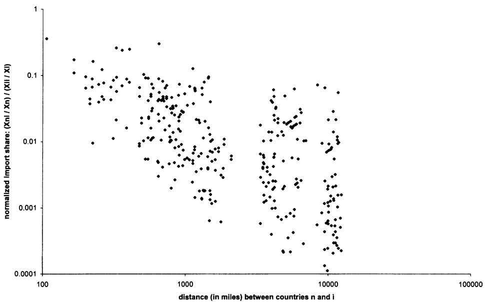
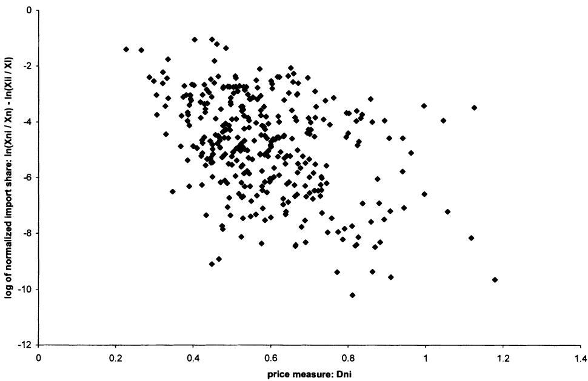
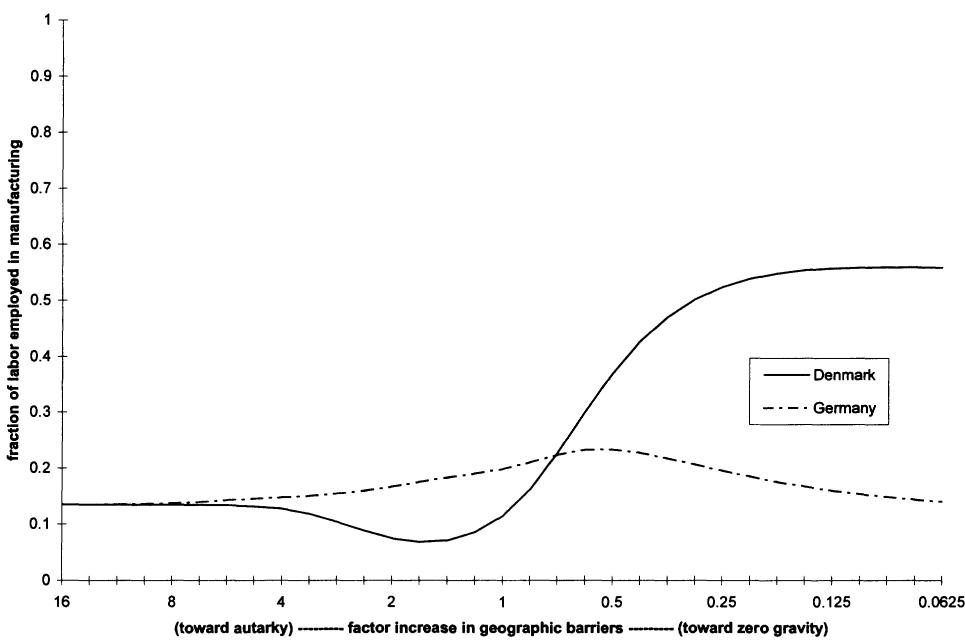

Technology, Geography, and Trade

Author(s): Jonathan Eaton and Samuel Kortum

Source: Econometrica, Sep., 2002, Vol. 70, No. 5 (Sep., 2002), pp. 1741-1779

Published by: The Econometric Society

Stable URL: https://www.jstor.org/stable/3082019

JSTOR is a not-for-profit service that helps scholars, researchers, and students discover, use, and build upon a wide range of content in a trusted digital archive. We use information technology and tools to increase productivity and facilitate new forms of scholarship. For more information about JSTOR, please contact support@jstor.org.

Your use of the JSTOR archive indicates your acceptance of the Terms & Conditions of Use, available at https://about.jstor.org/terms

Econometrica, Vol. 70, No. 5 (September, 2002), 1741–1779

# TECHNOLOGY, GEOGRAPHY, AND TRADE

BY JONATHAN EATON AND SAMUEL KORTUM $^{1}$

We develop a Ricardian trade model that incorporates realistic geographic features into general equilibrium. It delivers simple structural equations for bilateral trade with parameters relating to absolute advantage, to comparative advantage (promoting trade), and to geographic barriers (resisting it). We estimate the parameters with data on bilateral trade in manufactures, prices, and geography from 19 OECD countries in 1990. We use the model to explore various issues such as the gains from trade, the role of trade in spreading the benefits of new technology, and the effects of tariff reduction.

KEYWORDS: Trade, gravity, technology, geography, research, integration, bilateral.

## 1. INTRODUCTION

THEORIES OF INTERNATIONAL TRADE have not come to grips with a number of basic facts: (i) trade diminishes dramatically with distance; (ii) prices vary across locations, with greater differences between places farther apart; (iii) factor rewards are far from equal across countries; (iv) countries' relative productivities vary substantially across industries. The first pair of facts indicate that geography plays an important role in economic activity. The second pair suggests that countries are working with different technologies. Various studies have confronted these features individually, but have not provided a simple framework that captures all of them.

We develop and quantify a Ricardian model of international trade (one based on differences in technology) that incorporates a role for geography. $^{2}$ The model captures the competing forces of comparative advantage promoting trade and of geographic barriers (both natural and artificial) inhibiting it. These geographic barriers reflect such myriad impediments as transport costs, tariffs and quotas, delay, and problems with negotiating a deal from afar.

The model yields simple expressions relating bilateral trade volumes, first, to deviations from purchasing power parity and, second, to technology and geographic barriers. $^{3}$ From these two relationships we can estimate the parameters needed to solve the world trading equilibrium of the model and to examine how it changes in response to various policies.

Our point of departure is the Dornbusch, Fischer, and Samuelson (1977) two-country Ricardian model with a continuum of goods. We employ a probabilistic formulation of technological heterogeneity under which the model extends naturally to a world with many countries separated by geographic barriers. This formulation leads to a tractable and flexible framework for incorporating geographical features into general equilibrium analysis.

An additional feature of our model is that it can recognize, in a simple way, the preponderance of trade in intermediate products. Trade in intermediates has important implications for the sensitivity of trade to factor costs and to geographic barriers. Furthermore, because of intermediates, location, through its effect on input cost, plays an important role in determining specialization. $^{4}$

We estimate the model using bilateral trade in manufactures for a cross-section of 19 OECD countries in 1990. $^{5}$ The parameters correspond to: (i) each country's state of technology, governing absolute advantage, (ii) the heterogeneity of technology, which governs comparative advantage, and (iii) geographic barriers. We pursue several strategies to estimate these parameters using different structural equations delivered by the model and data on trade flows, prices, geography, and wages.

Our parameter estimates allow us to quantify the general equilibrium of our model in order to explore numerically a number of counterfactual situations:

(i) We explore the gains from trade in manufactures. Not surprisingly, all countries benefit from freer world trade, with small countries gaining more than big ones. The cost of a move to autarky in manufactures is modest relative to the gains from a move to a “zero gravity” world with no geographic barriers.

(ii) We examine how technology and geography determine patterns of specialization. As geographic barriers fall from their autarky level, manufacturing shifts toward larger countries where intermediate inputs tend to be cheaper. But at some point further declines reverse this pattern as smaller countries can also buy intermediates cheaply. A decline in geographic barriers from their current level tends to work against the largest countries and favor the smallest.

(iii) We calculate the role of trade in spreading the benefits of new technology. An improvement in a country's state of technology raises welfare almost everywhere. But the magnitude of the gains abroad approach those at home only in countries enjoying proximity to the source and the flexibility to downsize manufacturing.

TABLE I  
TRADE, LABOR, AND INCOME DATA

<table><tr><td rowspan="2">Country</td><td rowspan="2">Imports % of Mfg. Spending</td><td rowspan="2">Imports from Sample as % of All Imports</td><td rowspan="2">Mfg. Wage (U.S. = 1)</td><td colspan="2">Human-Capital Adj.</td><td rowspan="2">Mfg. Labor&#x27;s % Share of GDP</td></tr><tr><td>Mfg. Wage (U.S. = 1)</td><td>Mfg. Labor (U.S. = 1)</td></tr><tr><td>Australia</td><td>23.8</td><td>75.8</td><td>0.61</td><td>0.75</td><td>0.050</td><td>8.6</td></tr><tr><td>Austria</td><td>40.4</td><td>84.2</td><td>0.70</td><td>0.87</td><td>0.036</td><td>13.4</td></tr><tr><td>Belgium</td><td>74.8</td><td>86.7</td><td>0.92</td><td>1.08</td><td>0.035</td><td>13.2</td></tr><tr><td>Canada</td><td>37.3</td><td>89.6</td><td>0.88</td><td>0.99</td><td>0.087</td><td>10.5</td></tr><tr><td>Denmark</td><td>50.8</td><td>85.2</td><td>0.80</td><td>1.10</td><td>0.020</td><td>11.5</td></tr><tr><td>Finland</td><td>31.3</td><td>82.2</td><td>1.02</td><td>1.10</td><td>0.022</td><td>12.5</td></tr><tr><td>France</td><td>29.6</td><td>82.3</td><td>0.92</td><td>1.07</td><td>0.205</td><td>12.6</td></tr><tr><td>Germany</td><td>25.0</td><td>77.3</td><td>0.97</td><td>1.08</td><td>0.421</td><td>20.6</td></tr><tr><td>Greece</td><td>42.9</td><td>80.8</td><td>0.40</td><td>0.50</td><td>0.015</td><td>6.1</td></tr><tr><td>Italy</td><td>21.3</td><td>76.8</td><td>0.74</td><td>0.88</td><td>0.225</td><td>12.4</td></tr><tr><td>Japan</td><td>6.4</td><td>50.0</td><td>0.78</td><td>0.91</td><td>0.686</td><td>14.4</td></tr><tr><td>Netherlands</td><td>66.9</td><td>83.0</td><td>0.91</td><td>1.06</td><td>0.043</td><td>11.0</td></tr><tr><td>New Zealand</td><td>36.3</td><td>80.9</td><td>0.48</td><td>0.57</td><td>0.011</td><td>9.6</td></tr><tr><td>Norway</td><td>43.6</td><td>85.2</td><td>0.99</td><td>1.18</td><td>0.012</td><td>8.7</td></tr><tr><td>Portugal</td><td>41.6</td><td>84.9</td><td>0.23</td><td>0.32</td><td>0.033</td><td>10.7</td></tr><tr><td>Spain</td><td>24.5</td><td>82.0</td><td>0.56</td><td>0.65</td><td>0.128</td><td>11.6</td></tr><tr><td>Sweden</td><td>37.3</td><td>86.3</td><td>0.96</td><td>1.11</td><td>0.043</td><td>14.2</td></tr><tr><td>United Kingdom</td><td>31.3</td><td>79.1</td><td>0.73</td><td>0.91</td><td>0.232</td><td>14.7</td></tr><tr><td>United States</td><td>14.5</td><td>62.0</td><td>1.00</td><td>1.00</td><td>1.000</td><td>12.4</td></tr></table>

Notes: All data except GDP are for the manufacturing sector in 1990. Spending on manufactures is gross manufacturing production less exports of manufactures plus imports of manufactures. Imports from the other 18 excludes imports of manufactures from outside our sample of countries. To adjust the manufacturing wage and manufacturing employment for human capital, we multiply the wage in country i by $e^{-0.06H_{i}}$ and employment in country i by $e^{0.06H_{i}}$ , where $H_{i}$ is average years of schooling in country i as measured by Kyriacou (1991). See the Appendix for a complete description of all data sources.

(iv) We analyze the consequences of tariff reductions. Nearly every country benefits from a multilateral move to freer trade, but the United States suffers if it drops its tariffs unilaterally. Depending on internal labor mobility, European regional integration has the potential to harm participants through trade diversion or to harm nonparticipants nearby through worsened terms of trade.

With a handful of exceptions, the Ricardian model has not previously served as the basis for the empirical analysis of trade flows, probably because its standard formulation glosses over so many first-order features of the data (e.g., multiple countries and goods, trade in intermediates, and geographic barriers). $^{6}$ More active empirical fronts have been: (i) the gravity modeling of bilateral trade flows, (ii) computable general equilibrium (CGE) models of the international economy, and (iii) factor endowments or Heckscher-Ohlin-Vanek (HOV) explanations of trade.

Our theory implies that bilateral trade volumes adhere to a structure resembling a gravity equation, which relates trade flows to distance and to the product of the source and destination countries' GDPs. Given the success of the gravity model in explaining the data, this feature of our model is an empirical plus. $^{7}$ But to perform counterfactuals we must scratch beneath the surface of the gravity equation to uncover the structural parameters governing the roles of technology and geography in trade. $^{8}$

In common with CGE models we analyze trade flows within a general equilibrium framework, so we can conduct policy experiments. Our specification is more Spartan than a typical CGE model, however. For one thing, CGE models usually treat each country's goods as unique, entering preferences separately as in Armington (1969). $^{9}$ In contrast, we take the Ricardian approach of defining the set of commodities independent of country, with specialization governed by comparative advantage.

Our approach has less in common with the empirical work emanating from the HOV model, which has focussed on the relationship between factor endowments and patterns of specialization. This work has tended to ignore locational questions (by treating trade as costless), technology (by assuming that it is common to the world), and bilateral trade volumes (since the model makes no prediction about them). $^{10}$ While we make the Ricardian assumption that labor is the only internationally immobile factor, in principle one could bridge the two approaches by incorporating additional immobile factors.

To focus immediately on the most novel features of the model and how they relate to the data we present our analysis in a somewhat nonstandard order. Section 2, which follows, sets out our model of trade, conditioning on input costs around the world. It delivers relationships connecting bilateral trade flows to prices as well as to geographic barriers, technology, and input costs. We explore empirically the trade-price relationship in Section 3. In Section 4 we complete the theory, closing the model to determine input costs. With the full model in hand, Section 5 follows several approaches to estimating its parameters. Section 6 uses the quantified model to explore the counterfactual scenarios listed above. Section 7 concludes. (The Appendix reports data details.)

## 2. A MODEL OF TECHNOLOGY, PRICES, AND TRADE FLOWS

We build on the Dornbusch, Fischer, Samuelson (1977) model of Ricardian trade with a continuum of goods. As in Ricardo, countries have differential access to technology, so that efficiency varies across commodities and countries. We denote country i's efficiency in producing good $j \in [0, 1]$ as $z_{i}(j)$ .

Also as in Ricardo, we treat the cost of a bundle of inputs as the same across commodities within a country (because within a country inputs are mobile across activities and because activities do not differ in their input shares). We denote input cost in country i as $c_{i}$ . With constant returns to scale, the cost of producing a unit of good j in country i is then $c_{i}/z_{i}(j)$ .

Later we break $c_{i}$ into the cost of labor and of intermediate inputs, model how they are determined, and assign a numeraire. For now it suffices to take as given the entire vector of costs across countries.

We introduce geographic barriers by making Samuelson's standard and convenient "iceberg" assumption, that delivering a unit from country $i$ to country $n$ requires producing $d_{ni}$ units in $i$ . $^{11}$ We set $d_{ii}=1$ for all $i$ . Positive geographic barriers mean $d_{ni}>1$ for $n\neq i$ . We assume that cross-border arbitrage forces effective geographic barriers to obey the triangle inequality: For any three countries $i$ , $k$ , and $n$ , $d_{ni}\leq d_{nk}d_{ki}$ .

Taking these barriers into account, delivering a unit of good j produced in country i to country n costs

$$
p _ {n i} (j) = \left(\frac {c _ {i}}{z _ {i} (j)}\right) d _ {n i},\tag{1}
$$

the unit production cost multiplied by the geographic barrier.

We assume perfect competition, so that $p_{ni}(j)$ is what buyers in country n would pay if they chose to buy good j from country i. But shopping around the world for the best deal, the price they actually pay for good j will be $p_{n}(j)$ , the lowest across all sources i:

$$
p _ {n} (j) = \min \left\{p _ {n i} (j); i = 1, \dots , N \right\},\tag{2}
$$

where N is the number of countries. $^{12}$

Facing these prices, buyers (who could be final consumers or firms buying intermediate inputs) purchase individual goods in amounts $Q(j)$ to maximize a CES objective:

$$
U = \left[ \int_ {0} ^ {1} Q (j) ^ {(\sigma - 1) / \sigma} d j \right] ^ {\sigma / (\sigma - 1)},\tag{3}
$$

where the elasticity of substitution is $\sigma > 0$ . This maximization is subject to a budget constraint that aggregates, across buyers in country $n$ , to $X_{n}$ , country $n$ 's total spending.

Dornbusch, Fischer, and Samuelson work out the two-country case, but their approach does not generalize to more countries. $^{13}$ Extending the model beyond this case is not only of theoretical interest, it is essential to any empirical analysis of bilateral trade flows.

## 2.1. Technology

We pursue a probabilistic representation of technologies that can relate trade flows to underlying parameters for an arbitrary number of countries across our continuum of goods. We assume that country i's efficiency in producing good j is the realization of a random variable $Z_{i}$ (drawn independently for each j) from its country-specific probability distribution $F_{i}(z)=\Pr[Z_{i}\leq z]$ . We follow the convention that, by the law of large numbers, $F_{i}(z)$ is also the fraction of goods for which country i's efficiency is below z.

From expression (1) the cost of purchasing a particular good from country i in country n is the realization of the random variable $P_{ni} = c_i d_{ni} / Z_i$ , and from (2) the lowest price is the realization of $P_n = \min\{P_{ni}; i = 1, \ldots, N\}$ . The likelihood that country i supplies a particular good to country n is the probability $\pi_{ni}$ that i's price turns out to be the lowest.

The probability theory of extremes provides a form for $F_{i}(z)$ that yields a simple expression for $\pi_{ni}$ and for the resulting distribution of prices. We assume that country i's efficiency distribution is Fréchet (also called the Type II extreme value distribution):

$$
F _ {i} (z) = e ^ {- T _ {i} z ^ {- \theta}},\tag{4}
$$

where $T_{i} > 0$ and $\theta > 1$ . We treat the distributions as independent across countries. The (country-specific) parameter $T_{i}$ governs the location of the distribution.

$^{13}$ For two countries 1 and 2 they order commodities j according to the countries' relative efficiencies $z_{1}(j)/z_{2}(j)$ . Relative wages (determined by demand and labor supplies) then determine the breakpoint in this "chain of comparative advantage." With more than two countries there is no such natural ordering of commodities. Wilson (1980) shows how to conduct local comparative static exercises for the N-country case by asserting that $z_{i}(j)$ is a continuous function of j. Closer to our probabilistic formulation, although with a finite number of goods and no geographic barriers, is Petri (1980). Neither paper relates trade flows or prices to underlying parameters of technology or geographic barriers, as we do here.

A bigger $T_{i}$ implies that a high efficiency draw for any good j is more likely. The parameter $\theta$ (which we treat as common to all countries) reflects the amount of variation within the distribution. A bigger $\theta$ implies less variability. Specifically, $Z_{i}$ (efficiency) has geometric mean $e^{\gamma/\theta}T_{i}^{1/\theta}$ and its log has standard deviation $\pi/(\theta\sqrt{6})$ . Here $\gamma=.577\ldots$ (Euler's constant) and $\pi=3.14\ldots$ (We use $\gamma$ and $\pi$ differently below.) $^{14}$

The parameters $T_{i}$ and $\theta$ enable us to depict very parsimoniously a world of many countries that differ in the basic Ricardian senses of absolute and comparative advantage across a continuum of goods. We will refer to the parameter $T_{i}$ as country i's state of technology. In a trade context $T_{i}$ reflects country i's absolute advantage across this continuum.

The parameter $\theta$ regulates heterogeneity across goods in countries' relative efficiencies. In a trade context $\theta$ governs comparative advantage within this continuum. As we show more formally below, a lower value of $\theta$ , generating more heterogeneity, means that comparative advantage exerts a stronger force for trade against the resistance imposed by the geographic barriers $d_{ni}$ . $^{15}$

## 2.2. Prices

What do these assumptions imply about the distribution of prices in different countries? Substituting the expression for $P_{ni}$ into the distribution of efficiency (4) implies that country i presents country n with a distribution of prices $G_{ni}(p)=\Pr[P_{ni}\leq p]=1-F_{i}(c_{i}d_{ni}/p)$ or

$$
G _ {n i} (p) = 1 - e ^ {- \left[ T _ {i} \left(c _ {i} d _ {n i}\right) ^ {- \theta} \right] p ^ {\theta}}.\tag{5}
$$

The lowest price for a good in country $n$ will be less than $p$ unless each source's price is greater than $p$ . Hence the distribution $G_{n}(p) = \operatorname{Pr}[P_{n} \leq p]$ for what

$^{14}$ Kortum (1997) and Eaton and Kortum (1999) show how a process of innovation and diffusion can give rise to this distribution, with $T_{i}$ reflecting a country's stock of original or imported ideas. Since the actual technique that would ever be used in any country represents the best discovered to date for producing each good, it makes sense to represent technology with an extreme value distribution. The distribution of the maximum of a set of draws can converge to one of only three distributions, the Weibull, the Gumbell, and the Fréchet (see Billingsley (1986)). Only for the third does the distribution of prices inherit an extreme value distribution, which is why we use it. As for our independence assumption, for our analysis here an observationally equivalent joint distribution that embeds correlation across countries is

$$
F (z _ {1}, \dots , z _ {N}) = \exp \left\{- \left[ \sum_ {i = 1} ^ {N} (T _ {i} z _ {i} ^ {- \theta}) ^ {1 / \rho} \right] ^ {\rho} \right\},
$$

where $1 \geq \rho > 0$ . Correlation decreases as $\rho$ rises, with $\rho = 1$ implying independence. See, e.g., Small (1987). All that we do in this paper stands, with $T_{i}$ reinterpreted as $T_{i}^{1/\rho}$ and $\theta$ as $\theta/\rho$ .

$^{15}$ Our results translate nicely into the two-country world of Dornbusch, Fischer, and Samuelson (1977). They represent technology by a function $A(x)$ , where x is the fraction of goods for which the ratio of home (country 1) to foreign (country 2) efficiency is at least A. Using a result on the distribution of the ratio of independent Type II extreme value random variables, our model delivers $A(x) = (T_{1}/T_{2})^{1/\theta}((1-x)/x)^{1/\theta}$ . It shifts up if the home state of technology $T_{1}$ rises relative to foreign's $T_{2}$ .

country $n$ actually buys is

$$
G _ {n} (p) = 1 - \prod_ {i = 1} ^ {N} [ 1 - G _ {n i} (p) ].
$$

Inserting (5), the price distribution inherits the form of $G_{ni}(p)$ :

$$
G _ {n} (p) = 1 - e ^ {- \Phi_ {n} p ^ {\theta}},\tag{6}
$$

where the parameter $\Phi_{n}$ of country $n$ 's price distribution is

$$
\Phi_ {n} = \sum_ {i = 1} ^ {N} T _ {i} (c _ {i} d _ {n i}) ^ {- \theta}.\tag{7}
$$

The price parameter $\Phi_{n}$ is critical to what follows. It summarizes how (i) states of technology around the world, (ii) input costs around the world, and (iii) geographic barriers govern prices in each country n. International trade enlarges each country's effective state of technology with technology available from other countries, discounted by input costs and geographic barriers. At one extreme, in a zero-gravity world with no geographic barriers ( $d_{ni}=1$ for all n and i), $\Phi$ is the same everywhere and the law of one price holds for each good. At the other extreme of autarky, with prohibitive geographic barriers ( $d_{ni}\to\infty$ for $n\neq i$ ), $\Phi_{n}$ reduces to $T_{n}c_{n}^{-\theta}$ , country n's own state of technology downweighted by its input cost.

We exploit three useful properties of the price distributions:

(a) The probability that country $i$ provides a good at the lowest price in country $n$ is simply

$$
\pi_ {n i} = \frac {T _ {i} (c _ {i} d _ {n i}) ^ {- \theta}}{\Phi_ {n}},\tag{8}
$$

i's contribution to country n's price parameter. $^{16}$ Since there are a continuum of goods, this probability is also the fraction of goods that country n buys from country i.

(b) The price of a good that country n actually buys from any country i also has the distribution $G_{n}(p)$ . $^{17}$ Thus, for goods that are purchased, conditioning on the source has no bearing on the good's price. A source with a higher state of technology, lower input cost, or lower barriers exploits its advantage by selling a wider range of goods, exactly to the point at which the distribution of prices for what it sells in n is the same as n's overall price distribution.

$^{16}$ We obtain this probability by calculating

$$
\pi_ {n i} = \operatorname * {P r} [ P _ {n i} (j) \leq \min \{P _ {n s} (j); s \neq i \} ] = \int_ {0} ^ {\infty} \prod_ {s \neq i} [ 1 - G _ {n s} (p) ] d G _ {n i} (p).
$$

$^{17}$ We obtain this result by showing that

$$
G _ {n} (p) = \frac {1}{\pi_ {n i}} \int_ {0} ^ {p} \prod_ {s \neq i} [ 1 - G _ {n s} (q) ] d G _ {n i} (q).
$$

(c) The exact price index for the CES objective function (3), assuming $\sigma < 1 + \theta$ , is

$$
p _ {n} = \gamma \Phi_ {n} ^ {- 1 / \theta}.\tag{9}
$$

Here

$$
\gamma = \left[ \Gamma \left(\frac {\theta + 1 - \sigma}{\theta}\right) \right] ^ {1 / (1 - \sigma)},
$$

where $\Gamma$ is the Gamma function. $^{18}$ This expression for the price index shows how geographic barriers, by generating different values of the price parameter in different countries, lead to deviations from purchasing power parity.

## 2.3. Trade Flows, and Gravity

To link the model to data on trade shares we exploit an immediate corollary of Property (b), that country n's average expenditure per good does not vary by source. Hence the fraction of goods that country n buys from country i, $\pi_{ni}$ from Property (a), is also the fraction of its expenditure on goods from country i:

$$
\frac {X _ {n i}}{X _ {n}} = \frac {T _ {i} (c _ {i} d _ {n i}) ^ {- \theta}}{\Phi_ {n}} = \frac {T _ {i} (c _ {i} d _ {n i}) ^ {- \theta}}{\sum_ {k = 1} ^ {N} T _ {k} (c _ {k} d _ {n k}) ^ {- \theta}},\tag{10}
$$

where $X_{n}$ is country $n$ 's total spending, of which $X_{ni}$ is spent (c.i.f.) on goods from $i$ . $^{19}$ Before proceeding with our own analysis, we discuss how expression (10) relates to the existing literature on bilateral trade.

Note that expression (10) already bears semblance to the standard gravity equation in that bilateral trade is related to the importer's total expenditure and to geographic barriers. Some manipulation brings it even closer to a gravity expression. Note that the exporter's total sales $Q_{i}$ are simply

$$
Q _ {i} = \sum_ {m = 1} ^ {N} X _ {m i} = T _ {i} c _ {i} ^ {- \theta} \sum_ {m = 1} ^ {N} \frac {d _ {m i} ^ {- \theta} X _ {m}}{\Phi_ {m}}.
$$

$^{18}$ The moment generating function for $x = -\ln p$ is $E(e^{tx}) = \Phi^{t/\theta} \Gamma(1 - t/\theta)$ . (See, e.g., Johnson and Kotz (1970).) Hence $E[p^{-t}]^{-1/t} = \Gamma(1 - t/\theta)^{-1/t} \Phi^{-1/\theta}$ . The result follows by replacing t with $\sigma - 1$ . While our framework allows for the possibility of inelastic demand ( $\sigma \leq 1$ ), we must restrict $\sigma < 1 + \theta$ in order to have a well defined price index. As long as this restriction is satisfied, the parameter $\sigma$ can be ignored, since it appears only in the constant term (common across countries) of the price index.

$^{19}$ Our model of trade bears resemblance to discrete-choice models of market share, popular in industrial organization (e.g., McFadden (1974), Anderson, dePalma, and Thisse (1992), and Berry (1994)): (i) Our trade model has a discrete number of countries whereas their consumer demand model has a discrete number of differentiated goods; (ii) in our model a good's efficiency of production in different countries is distributed multivariate extreme value whereas in their's a consumer's preferences for different goods is distributed multivariate extreme value; (iii) in our model each good is purchased (by a given importing country) from only one exporting country whereas in their model each consumer purchases only one good; (iv) we assume a continuum of goods whereas they assume a continuum of consumers. A distinction is that we can derive the extreme value distribution from deeper assumptions about the process of innovation.

Solving for $T_{i}c_{i}^{-\theta}$ , and substituting it into (10), incorporating (9), we get

$$
X _ {n i} = \frac {\left(\frac {d _ {n i}}{p _ {n}}\right) ^ {- \theta} X _ {n}}{\sum_ {m = 1} ^ {N} \left(\frac {d _ {m i}}{p _ {m}}\right) ^ {- \theta} X _ {m}} Q _ {i}.\tag{11}
$$

Here, as in the standard gravity equation, both the exporter's total sales $Q_{i}$ and, given the denominator, the importer's total purchases $X_{n}$ enter with unit elasticity. Note that the geographic barrier $d_{mi}$ between $i$ and any importer $m$ is deflated by the importer's price level $p_{m}$ : Stiffer competition in market $m$ reduces $p_{m}$ , reducing $i$ 's access in the same way as a higher geographic barrier. We can thus think of the term $(d_{mi} / p_m)^{-\theta}X_m$ as the market size of destination $m$ as perceived by country $i$ . The denominator of the right-hand side of (11), then, is the total world market from country $i$ 's perspective. The share of country $n$ in country $i$ 's total sales just equals $n$ 's share of $i$ 's effective world market.

Other justifications for a gravity equation have rested on the traditional Armington and monopolistic competition models. Under the Armington assumption goods produced by different sources are inherently imperfect substitutes by virtue of their provenance. Under monopolistic competition each country chooses to specialize in a distinct set of goods. The more substitutable are goods from different countries, the higher is the sensitivity of trade to production costs and geographic barriers. In contrast, in our model the sensitivity of trade to costs and geographic barriers depends on the technological parameter $\theta$ (reflecting the heterogeneity of goods in production) rather than the preference parameter $\sigma$ (reflecting the heterogeneity of goods in consumption). Trade shares respond to costs and geographic barriers at the extensive margin: As a source becomes more expensive or remote it exports a narrower range of goods. In contrast, in models that invoke Armington or (with some caveats) monopolistic competition, adjustment is at the intensive margin: Higher costs or geographic barriers leave the set of goods that are traded unaffected, but less is spent on each imported good. $^{20}$

$^{20}$ The expressions for bilateral trade shares delivered by the Armington and monopolistic competition models make the connections among these approaches explicit. For the Armington case define $a_{i}$ as the weight on goods from country i in CES preferences. Country i's share in country n's expenditure is then

$$
\frac {X _ {n i}}{X _ {n}} = \frac {a _ {i} ^ {\sigma - 1} (c _ {i} d _ {n i}) ^ {- (\sigma - 1)}}{\sum_ {k = 1} ^ {N} a _ {k} ^ {\sigma - 1} (c _ {k} d _ {n k}) ^ {- (\sigma - 1)}}.
$$

In the case of monopolistic competition with CES preferences define $m_{i}$ as the number of goods produced by country $i$ . Country $i$ 's share in country $n$ 's expenditure is then

$$
\frac {X _ {n i}}{X _ {n}} = \frac {m _ {i} (c _ {i} d _ {n i}) ^ {- (\sigma - 1)}}{\sum_ {k = 1} ^ {N} m _ {k} (c _ {k} d _ {n k}) ^ {- (\sigma - 1)}}.
$$

Returning to equation (10), the exporter's state of technology parameter $T_{i}$ in our model replaces its preference weight $a_{i}^{\sigma-1}$ (in Armington) or its number of goods $m_{i}$ (under monopolistic competition). In our model the heterogeneity of technology parameter $\theta$ replaces the preference parameter $\sigma-1$ in these alternatives. (The standard assumption in these other models is that all goods are produced with the same efficiency, so that $c_{i}$ reflects both the cost of inputs and the f.o.b. price of goods.)

## 3. TRADE, GEOGRAPHY, AND PRICES: A FIRST LOOK

Our model implies a connection between two important economic variables that have been analyzed extensively, but only in isolation: trade flows and price differences. To establish this link we divide (10) by the analogous expression for the share of country i producers at home, substituting in (9), to get

$$
\frac {X _ {n i} / X _ {n}}{X _ {i i} / X _ {i}} = \frac {\Phi_ {i}}{\Phi_ {n}} d _ {n i} ^ {- \theta} = \left(\frac {p _ {i} d _ {n i}}{p _ {n}}\right) ^ {- \theta}.\tag{12}
$$

We refer to the left-hand-side variable, country i's share in country n relative to i's share at home, as country i's normalized import share in country n. The triangle inequality implies that the normalized share never exceeds one. $^{21}$

As overall prices in market n fall relative to prices in market i (as reflected in higher $p_{i}/p_{n}$ ) or as n becomes more isolated from i (as reflected in a higher $d_{ni}$ ), i's normalized share in n declines. As the force of comparative advantage weakens (reflected by a higher $\theta$ ), normalized import shares become more elastic with respect to the average relative price and to geographic barriers. A higher value of $\theta$ means relative efficiencies are more similar across goods. Hence there are fewer efficiency outliers that overcome differences in average prices or geographic barriers. $^{22}$

The relationship between normalized trade share and prices in equation (12) is a structural one whose slope provides insight into the value of our comparative advantage parameter $\theta$ . Before using this relationship to estimate $\theta$ we first exploit it to assess the role played by geographic barriers in trade.

We measure normalized import shares, the left-hand side of equation (12), with data on bilateral trade in manufactures among 19 OECD countries in 1990, giving us 342 informative observations (in which n and i are different). $^{23}$ Normalized import shares never exceed 0.2, far below the level of one that would hold in a zero-gravity world with all $d_{ni}=1$ . Furthermore, they vary substantially across country-pairs, ranging over four orders of magnitude.

  
FIGURE 1.—Trade and geography.

An obvious, but crude, proxy for $d_{ni}$ in equation (12) is distance. Figure 1 graphs normalized import share against distance between the corresponding country-pair (on logarithmic scales). The relationship is not perfect, and shouldn't be. Imperfections in our proxy for geographic barriers aside, we are ignoring the price indices that appear in equation (12). Nevertheless, the resistance that geography imposes on trade comes through clearly.

Since we have no independent information on the extent to which geographic barriers rise with distance, the relationship in Figure 1 confounds the impact of comparative advantage ( $\theta$ ) and geographic barriers ( $d_{ni}$ ) on trade flows. The strong inverse correlation could result from geographic barriers that rise rapidly with distance, overcoming a strong force of comparative advantage (a low $\theta$ ). Alternatively, comparative advantage might exert only a very weak force (a high $\theta$ ), so that even a mild increase in geographic barriers could cause trade to drop off rapidly with distance.

To identify $\theta$ we turn to price data, which we use to measure the term $p_{i}d_{ni}/p_{n}$ on the right-hand side of equation (12). While we used standard data to calculate normalized trade shares, our measure of relative prices, and particularly geographic barriers, requires more explanation. We work with retail prices in each of our 19 countries of 50 manufactured products. $^{24}$ We interpret these data as a sample of the prices $p_{i}(j)$ of individual goods in our model. We use them to calculate, for each country-pair n and i and each good j, the logarithm of the relative price, $r_{ni}(j)=\ln p_{n}(j)-\ln p_{i}(j)$ . We calculate the logarithm of $p_{i}/p_{n}$ as the mean across j of $-r_{ni}(j)$ . To get at geographic barriers $d_{ni}$ we use our model's prediction that, for any commodity j, $r_{ni}(j)$ is bounded above by $\ln d_{ni}$ , with this bound attained for goods that n imports from i. (For goods that n does not buy from i, $r_{ni}(j)$ is below $\ln d_{ni}$ .) Every country in our sample does in fact import from every other. We take the (second) highest value of $r_{ni}$ across commodities to obtain a measure of $\ln d_{ni}$ .²⁵ In summary, we measure $\ln(p_{i}d_{ni}/p_{n})$ by the term $D_{ni}$ defined as

$$
D _ {n i} = \frac {\max 2 _ {j} \{r _ {n i} (j) \}}{\sum_ {j = 1} ^ {5 0} [ r _ {n i} (j) ] / 5 0}\tag{13}
$$

(where max 2 means second highest). $^{26}$

The price measure $\exp D_{ni}$ reflects what the price index in destination $n$ would be for a buyer there who insisted on purchasing everything from source $i$ , relative to the actual price index in $n$ (the price index for a buyer purchasing each good from the cheapest source). Table II provides some order statistics of our price measure. For each country we report, from its perspective as an importer, the foreign source for which the measure is lowest and highest. We then report, from that country's perspective as an exporter, the foreign destination for which the measure is lowest and highest. (In parentheses we report the associated values of $\exp D_{ni}$ .) France, for example, finds Germany its cheapest foreign source and New Zealand its most expensive. A French resident buying all commodities from Germany would face a 33 per cent higher price index and from New Zealand a 142 per cent higher price index. A resident abroad who insisted on buying everything from France would face the smallest penalty (40 per cent) if she were in Belgium and the largest (140 per cent) if she were in Japan. Note how geography comes out in the price data as well as in the trade data: The cheapest foreign source is usually nearby and the most expensive far away. Note also, from column 4, that large countries would typically suffer the most if required to buy everything from some given foreign source.

TABLE II  
PRICE MEASURE STATISTICS

<table><tr><td rowspan="2">Country</td><td colspan="2">Foreign Sources</td><td colspan="2">Foreign Destinations</td></tr><tr><td>Minimum</td><td>Maximum</td><td>Minimum</td><td>Maximum</td></tr><tr><td>Australia (AL)</td><td>NE (1.44)</td><td>PO (2.25)</td><td>BE (1.41)</td><td>US (2.03)</td></tr><tr><td>Austria (AS)</td><td>SW (1.39)</td><td>NZ (2.16)</td><td>UK (1.47)</td><td>JP (1.97)</td></tr><tr><td>Belgium (BE)</td><td>GE (1.25)</td><td>JP (2.02)</td><td>GE (1.35)</td><td>SW (1.77)</td></tr><tr><td>Canada (CA)</td><td>US (1.58)</td><td>NZ (2.57)</td><td>AS (1.57)</td><td>US (2.14)</td></tr><tr><td>Denmark (DK)</td><td>FI (1.36)</td><td>PO (2.21)</td><td>NE (1.48)</td><td>US (2.41)</td></tr><tr><td>Finland (FI)</td><td>SW (1.38)</td><td>PO (2.61)</td><td>DK (1.36)</td><td>US (2.87)</td></tr><tr><td>France (FR)</td><td>GE (1.33)</td><td>NZ (2.42)</td><td>BE (1.40)</td><td>JP (2.40)</td></tr><tr><td>Germany (GE)</td><td>BE (1.35)</td><td>NZ (2.28)</td><td>BE (1.25)</td><td>US (2.22)</td></tr><tr><td>Greece (GR)</td><td>SP (1.61)</td><td>NZ (2.71)</td><td>NE (1.48)</td><td>US (2.27)</td></tr><tr><td>Italy (IT)</td><td>FR (1.45)</td><td>NZ (2.19)</td><td>AS (1.46)</td><td>JP (2.10)</td></tr><tr><td>Japan (JP)</td><td>BE (1.62)</td><td>PO (3.25)</td><td>AL (1.72)</td><td>US (3.08)</td></tr><tr><td>Netherlands (NE)</td><td>GE (1.30)</td><td>NZ (2.17)</td><td>DK (1.39)</td><td>NZ (2.01)</td></tr><tr><td>New Zealand (NZ)</td><td>CA (1.60)</td><td>PO (2.08)</td><td>AL (1.64)</td><td>GR (2.71)</td></tr><tr><td>Norway (NO)</td><td>FI (1.45)</td><td>JP (2.84)</td><td>SW (1.36)</td><td>US (2.31)</td></tr><tr><td>Portugal (PO)</td><td>BE (1.49)</td><td>JP (2.56)</td><td>SP (1.59)</td><td>JP (3.25)</td></tr><tr><td>Spain (SP)</td><td>BE (1.39)</td><td>JP (2.47)</td><td>NO (1.51)</td><td>JP (3.05)</td></tr><tr><td>Sweden (SW)</td><td>NO (1.36)</td><td>US (2.70)</td><td>FI (1.38)</td><td>US (2.01)</td></tr><tr><td>United Kingdom (UK)</td><td>NE (1.46)</td><td>JP (2.37)</td><td>FR (1.52)</td><td>NZ (2.04)</td></tr><tr><td>United States (US)</td><td>FR (1.57)</td><td>JP (3.08)</td><td>CA (1.58)</td><td>SW (2.70)</td></tr></table>

Notes: The price measure $D_{ni}$ is defined in equation (13). For destination country $n$ , the minimum Foreign Source is $\min_{i \neq n} \exp D_{ni}$ . For source country $i$ , the minimum Foreign Destination is $\min_{n \neq i} \exp D_{ni}$ .

Figure 2 graphs our measure of normalized import share (in logarithms) against $D_{ni}$ . Observe that, while the scatter is fat, there is an obvious negative relationship, as the theory predicts. The correlation is -0.40. The relationship in Figure 2 thus confirms the connection between trade and prices predicted by our model.

Moreover, the slope of the relationship provides a handle on the value of the comparative advantage parameter $\theta$ . Since our theory implies a zero intercept, a simple method-of-moments estimator for $\theta$ is the mean of the left-hand-side variable over the mean of the right-hand-side variable. The implied $\theta$ is 8.28. Other appropriate estimation procedures yield very similar magnitudes. $^{27}$ Hence we use this value for $\theta$ in exploring counterfactuals. This value of $\theta$ implies a standard deviation in efficiency (for a given state of technology T) of 15 percent. In Section 5 we pursue two alternative strategies for estimating $\theta$ , but we first complete the full description of the model.

  
FIGURE 2.—Trade and prices.

## 4. EQUILIBRIUM INPUT COSTS

Our exposition so far has highlighted how trade flows relate to geography and to prices, taking input costs $c_{i}$ as given. In any counterfactual experiment, however, adjustment of input costs to a new equilibrium is crucial.

To close the model we decompose the input bundle into labor and intermediates. We then turn to the determination of prices of intermediates, given wages. Finally we model how wages are determined. Having completed the full model, we illustrate it with two special cases that yield simple closed-form solutions.

## 4.1. Production

We assume that production combines labor and intermediate inputs, with labor having a constant share $\beta.^{28}$ Intermediates comprise the full set of goods

$^{28}$ We ignore capital as an input to production and as a source of income, although our intermediate inputs play a similar role in the production function. Baxter (1992) shows how a model in which capital and labor serve as factors of production delivers Ricardian implications if the interest rate is common across countries.

combined according to the CES aggregator (3). The overall price index in country i, $p_{i}$ , given by equation (9), becomes the appropriate index of intermediate goods prices there. The cost of an input bundle in country i is thus

$$
c _ {i} = w _ {i} ^ {\beta} p _ {i} ^ {1 - \beta},\tag{14}
$$

where $w_{i}$ is the wage in country i. Because intermediates are used in production, $c_{i}$ depends on prices in country i, and hence on $\Phi_{i}$ . But through equation (7), the price parameter $\Phi_{i}$ depends on input costs everywhere.

Before turning to the determination of price levels around the world, we first note how expression (14), in combination with (9), (7), and (10), delivers an expression relating the real wage $w_{i}/p_{i}$ to the state of technology parameter $T_{i}$ and share of purchases from home $\pi_{ii}$ :

$$
\frac {w _ {i}}{p _ {i}} = \gamma^ {- 1 / \beta} \bigg (\frac {T _ {i}}{\pi_ {i i}} \bigg) ^ {1 / \beta \theta}.\tag{15}
$$

Since in autarky $\pi_{ii}=1$ , we can immediately infer the gains from trade from the share of imports in total purchases. Note that, given import share, trade gains are greater the smaller $\theta$ (more heterogeneity in efficiency) and $\beta$ (larger share of intermediates).

## 4.2. Price Levels

To see how price levels are mutually determined, substitute (14) into (7), applying (9), to obtain the system of equations:

$$
p _ {n} = \gamma \left[ \sum_ {i = 1} ^ {N} T _ {i} \left(d _ {n i} w _ {i} ^ {\beta} p _ {i} ^ {1 - \beta}\right) ^ {- \theta} \right] ^ {- 1 / \theta}.\tag{16}
$$

The solution, which in general must be computed numerically, gives price indices as functions of the parameters of the model and wages.

Expanding equation (10) using (14) we can also get expressions for trade shares as functions of wages and parameters of the model:

$$
\frac {X _ {n i}}{X _ {n}} = \pi_ {n i} = T _ {i} \bigg (\frac {\gamma d _ {n i} w _ {i} ^ {\beta} p _ {i} ^ {1 - \beta}}{p _ {n}} \bigg) ^ {- \theta},\tag{17}
$$

with the $p_i$ 's obtained from expression (16) above.

We now impose conditions for labor market equilibrium to determine wages themselves.

## 4.3. Labor-Market Equilibrium

Up to this point we have not had to take a stand about whether our model applies to the entire economy or to only one sector. Our empirical implementation is to production and trade in manufactures. We now show how manufacturing fits into the larger economy.

Manufacturing labor income in country i is labor's share of country i's manufacturing exports around the world, including its sales at home. Thus

$$
w _ {i} L _ {i} = \beta \sum_ {n = 1} ^ {N} \pi_ {n i} X _ {n},\tag{18}
$$

where $L_{i}$ is manufacturing workers and $X_{n}$ is total spending on manufactures.

We denote aggregate final expenditures as $Y_{n}$ with $\alpha$ the fraction spent on manufactures. Total manufacturing expenditures are then

$$
X _ {n} = \frac {1 - \beta}{\beta} w _ {n} L _ {n} + \alpha Y _ {n},\tag{19}
$$

where the first term captures demand for manufactures as intermediates by the manufacturing sector itself. Final expenditure $Y_{n}$ consists of value-added in manufacturing $Y_{n}^{M} = w_{n}L_{n}$ plus income generated in nonmanufacturing $Y_{n}^{O}$ . We assume that (at least some of) nonmanufacturing output can be traded costlessly, and use it as our numeraire. $^{29}$

To close the model as simply as possible we consider two polar cases that should straddle any more detailed specification of nonmanufacturing. In one case labor is mobile. Workers can move freely between manufacturing and nonmanufacturing. The wage $w_{n}$ is given by productivity in nonmanufacturing and total income $Y_{n}$ is exogenous. Equations (18) and (19) combine to give

$$
w _ {i} L _ {i} = \sum_ {n = 1} ^ {N} \pi_ {n i} \big [ (1 - \beta) w _ {n} L _ {n} + \alpha \beta Y _ {n} \big ],\tag{20}
$$

determining manufacturing employment $L_{i}$ .

In the other case labor is immobile. The number of manufacturing workers in each country is fixed at $L_{n}$ . Nonmanufacturing income $Y_{n}^{O}$ is exogenous. Equations (18) and (19) combine to form

$$
w _ {i} L _ {i} = \sum_ {n = 1} ^ {N} \pi_ {n i} \big [ (1 - \beta + \alpha \beta) w _ {n} L _ {n} + \alpha \beta Y _ {n} ^ {O} \big ],\tag{21}
$$

determining manufacturing wages $w_{i}$ .

In the mobile labor case we can use equations (16) and (17) to solve for prices and trade shares given exogenous wages before using (20) to calculate manufacturing employment. The immobile labor case is trickier in that we need to solve the three equations (16), (17), and (21) simultaneously for prices, trade shares, and manufacturing wages.

In the case of mobile labor, our model has implications not only for intra-industry trade within manufacturing, but for specialization in manufacturing. The technology parameter $T_{i}$ then reflects not only absolute advantage within manufactures, but comparative advantage in manufacturing relative to nonmanufacturing. In the immobile case labor specialization is exogenous, and $T_{i}$ is reflected in manufacturing wages. In either case $\theta$ governs specialization within manufacturing.

## 4.4. Zero-Gravity and Autarky

While, in general, the rich interaction among prices in different countries makes any analytic solution unattainable, two special cases yield simple closed-form solutions. We consider in turn the extremes in which (i) geographic barriers disappear (zero gravity), meaning that all $d_{ni} = 1$ , and (ii) geographic barriers are prohibitive (autarky), meaning that $d_{ni} \to \infty$ for $n \neq i$ .

With no geographic barriers the law of one price holds. In either the mobile or immobile labor cases the condition for labor market equilibrium reduces to

$$
\frac {w _ {i}}{w _ {N}} = \left(\frac {T _ {i} / L _ {i}}{T _ {N} / L _ {N}}\right) ^ {1 / (1 + \theta \beta)}.\tag{22}
$$

Since prices are the same everywhere this expression is also the relative real wage.

When labor is mobile this expression determines the relative amounts of manufacturing labor in each country, which are proportional to $T_{i}/w_{i}^{1+\theta\beta}$ : The country with a higher state of technology relative to its wage will specialize more in manufacturing. When labor is immobile the expression gives relative wages, which depend on the state of technology in per worker terms. Given $T_{i}$ , as $L_{i}$ increases workers must move into production of goods in which the country is less productive, driving down the wage.

Suppose manufacturing is the only activity so that $\alpha = 1$ and $Y_{i} = w_{i}L_{i}$ . The wage must adjust to maintain trade balance. Real GDP per worker (our welfare measure) is then $W_{i} = (Y_{i}/L_{i})/p = w_{i}/p$ . Manipulating (22) and (16),

$$
W _ {i} = \gamma^ {- 1 / \beta} T _ {i} ^ {1 / (1 + \theta \beta)} \left[ \sum_ {k = 1} ^ {N} T _ {k} ^ {1 / (1 + \theta \beta)} (L _ {k} / L _ {i}) ^ {\theta \beta / (1 + \theta \beta)} \right] ^ {1 / \theta \beta},\tag{23}
$$

which increases with technology $T_{k}$ anywhere. An increase at home confers an extra benefit, however, because it raises the home wage relative to wages abroad. How much country i benefits from an increase in $T_{k}$ depends on k's labor force relative to i's. If the labor force in the source country k is small, $w_{k}$ rises more, diminishing the benefits to others of its more advanced state of technology. $^{30}$

We can solve for a country's welfare in autarky by solving (23) for a one-country world or by referring back to (15) setting $\pi_{ii} = 1$ . Doing so, we get

$$
W _ {i} = \gamma^ {- 1 / \beta} T _ {i} ^ {1 / \theta \beta}.\tag{24}
$$

Note, of course, that there are gains from trade for everyone, as can be verified by observing that we derived (24) by removing positive terms from (23). $^{31}$

While these results illustrate how our model works, and provide insight into its implications, the raw data we presented in Section 3 show how far the actual world is from either zero-gravity or autarky. For empirical purposes we need to grapple with the messier world in between, to which we now return.

## 5. ESTIMATING THE TRADE EQUATION

Equations (16) and (17), along with either (20) or (21), comprise the full general equilibrium. These equations determine price levels, trade shares, and either manufacturing labor supplies (in the mobile labor case) or manufacturing wages (in the immobile case). In Section 6 we explore how these endogenous magnitudes respond to various counterfactual experiments. In this section we present the estimation that yields the parameter values used to examine these counterfactuals.

## 5.1. Estimates with Source Effects

Equation (17), like the standard gravity equation, relates bilateral trade volumes to characteristics of the trading partners and the geography between them. Estimating it provides a way to learn about states of technology $T_{i}$ and geographic barriers $d_{ni}$ .

Normalizing (17) by the importer's home sales delivers

$$
\frac {X _ {n i}}{X _ {n n}} = \frac {T _ {i}}{T _ {n}} \left(\frac {w _ {i}}{w _ {n}}\right) ^ {- \theta \beta} \left(\frac {p _ {i}}{p _ {n}}\right) ^ {- \theta (1 - \beta)} d _ {n i} ^ {- \theta}.\tag{25}
$$

$^{30}$ If we plug these results for zero gravity into our bilateral trade equation (10), we obtain a simple gravity equation with no “distance” term:

$$
X _ {n i} = \frac {Y _ {n} Y _ {i}}{\beta Y ^ {w}}.
$$

Bilateral trade equals the product of the trade partners' incomes, $Y_{i}$ and $Y_{n}$ , relative to world income, $Y^{W}$ , all scaled up by the ratio of gross production to value added. Note that this relationship masks the underlying structural parameters, $T_{i}$ and $\theta$ .

$^{31}$ Note also that trade has an equalizing effect in that the elasticity of real GDP with respect to one's own state of technology $T_{i}$ is greater when geographic barriers are prohibitive than when they are absent. The reason is that, with trade, the country that experiences a gain in technology spreads its production across a wider range of goods, allowing foreigners to specialize in a narrower set in which they are more efficient. The relative efficiency gain is consequently dampened. Under autarky, of course, every country produces the full range of goods.

We can use equation (17) as it applies to home sales, for both country i and country n, to obtain

$$
\frac {p _ {i}}{p _ {n}} = \frac {w _ {i}}{w _ {n}} \left(\frac {T _ {i}}{T _ {n}}\right) ^ {- 1 / \theta \beta} \left(\frac {X _ {i} / X _ {i i}}{X _ {n} / X _ {n n}}\right) ^ {- 1 / \theta \beta}
$$

Plugging this expression for the relative price of intermediates into (25) and rearranging gives, in logarithms:

$$
\ln \frac {X _ {n i} ^ {\prime}}{X _ {n n} ^ {\prime}} = - \theta \ln d _ {n i} + \frac {1}{\beta} \ln \frac {T _ {i}}{T _ {n}} - \theta \ln \frac {w _ {i}}{w _ {n}},\tag{26}
$$

where $\ln X_{ni}^{\prime}\equiv \ln X_{ni} - [(1 - \beta) / \beta ]\ln (X_i / X_{ii})$ . By defining

$$
S _ {i} \equiv \frac {1}{\beta} \ln T _ {i} - \theta \ln w _ {i},\tag{27}
$$

this equation simplifies to

$$
\ln \frac {X _ {n i} ^ {\prime}}{X _ {n n} ^ {\prime}} = - \theta \ln d _ {n i} + S _ {i} - S _ {n}.\tag{28}
$$

We can think of $S_{i}$ as a measure of country i's “competitiveness,” its state of technology adjusted for its labor costs. Equation (28) forms the basis of our estimation. $^{32}$

We calculate the left-hand side of (28) from the same data on bilateral trade among 19 countries that we use in Section 3, setting $\beta = .21$ , the average labor share in gross manufacturing production in our sample. As in Section 3, this equation is vacuous as it applies to n = i, leaving us 342 informative observations. Since prices of intermediates reflect imports from all sources, $X_{n}$ includes imports from all countries in the world. In other respects this bilateral trade equation lets us ignore the rest of the world.

As for the right-hand side of (28), we capture the $S_{i}$ as the coefficients on source-country dummies. We now turn to our handling of the $d_{ni}$ 's.

We use proxies for geographic barriers suggested by the gravity literature. $^{33}$ In particular, we relate the impediments in moving goods from i to n to proximity, language, and treaties. We have, for all $i \neq n$ ,

$$
\ln d _ {n i} = d _ {k} + b + l + e _ {h} + m _ {n} + \delta_ {n i},\tag{29}
$$

$^{32}$ If $\beta = 1$ and $S = \ln Y$ , equation (28) is implied by the standard gravity equation:

$$
X _ {n i} = \kappa d _ {n i} ^ {- \theta} Y _ {i} Y _ {n},
$$

where $\kappa$ is a constant. But from equation (11) our theory implies that S should reflect a country's production relative to the total world market from its perspective: Given the geographic barrier to a particular destination, an exporter will sell more there when it is more remote from third markets.

$^{33}$ An alternative strategy would have been to use the maximum price ratios introduced in Section 3 to measure $d_{ni}$ directly. The problem is that country-specific errors in this measure are no longer cancelled out by price level differences, as they are in (13).

where the dummy variable associated with each effect has been suppressed for notational simplicity. Here $d_{k}$ ( $k=1,\ldots,6$ ) is the effect of the distance between n and i lying in the kth interval, b is the effect of n and i sharing a border, l is the effect of n and i sharing a language, $e_{h}$ (h=1,2) is the effect of n and i both belonging to trading area h, and $m_{n}$ ( $n=1,\ldots,19$ ) is an overall destination effect. The error term $\delta_{ni}$ captures geographic barriers arising from all other factors. The six distance intervals (in miles) are: [0,375); [375,750); [750,1500); [1500,3000); [3000,6000); and [6000,maximum]. The two trading areas are the European Community (EC) and the European Free-Trade Area (EFTA). $^{34}$ We assume that the error $\delta_{ni}$ is orthogonal to the other regressors (source country dummies and the proxies for geographic barriers listed above).

To capture potential reciprocity in geographic barriers, we assume that the error term $\delta_{ni}$ consists of two components:

$$
\delta_ {n i} = \delta_ {n i} ^ {2} + \delta_ {n i} ^ {1}.
$$

The country-pair specific component $\delta_{ni}^{2}$ (with variance $\sigma_{2}^{2}$ ) affects two-way trade, so that $\delta_{ni}^{2} = \delta_{in}^{2}$ , while $\delta_{ni}^{1}$ (with variance $\sigma_{1}^{2}$ ) affects one-way trade. This error structure implies that the variance-covariance matrix of $\delta$ has diagonal elements $E(\delta_{ni}\delta_{ni}) = \sigma_{1}^{2} + \sigma_{2}^{2}$ and certain nonzero off-diagonal elements $E(\delta_{ni}\delta_{in}) = \sigma_{2}^{2}$ . Imposing this specification of geographic barriers, equation (28) becomes

$$
\ln \frac {X _ {n i} ^ {\prime}}{X _ {n n} ^ {\prime}} = S _ {i} - S _ {n} - \theta m _ {n} - \theta d _ {k} - \theta b - \theta l - \theta e _ {h} + \theta \delta_ {n i} ^ {2} + \theta \delta_ {n i} ^ {1},\tag{30}
$$

which we estimate by generalized least squares (GLS). $^{35}$

Table III reports the results. The estimates of the $S_{i}$ indicate that Japan is the most competitive country in 1990, closely followed by the United States. Belgium and Greece are the least competitive. As for geographic barriers, increased distance substantially inhibits trade, with its impact somewhat attenuated by a shared language, while borders, the EC, and EFTA do not play a major role. The United States, Japan, and Belgium are the most open countries while Greece is least open. $^{36}$ Note that about a quarter of the total residual variance is reciprocal.

TABLE III
BILATERAL TRADE EQUATION

<table><tr><td colspan="4">Variable</td><td colspan="2">est.</td><td>s.e.</td></tr><tr><td colspan="2">Distance [0, 375)</td><td colspan="2"> $-\theta d_{1}$ </td><td colspan="2">-3.10</td><td>(0.16)</td></tr><tr><td colspan="2">Distance [375, 750)</td><td colspan="2"> $-\theta d_{2}$ </td><td colspan="2">-3.66</td><td>(0.11)</td></tr><tr><td colspan="2">Distance [750, 1500)</td><td colspan="2"> $-\theta d_{3}$ </td><td colspan="2">-4.03</td><td>(0.10)</td></tr><tr><td colspan="2">Distance [1500, 3000)</td><td colspan="2"> $-\theta d_{4}$ </td><td colspan="2">-4.22</td><td>(0.16)</td></tr><tr><td colspan="2">Distance [3000, 6000)</td><td colspan="2"> $-\theta d_{5}$ </td><td colspan="2">-6.06</td><td>(0.09)</td></tr><tr><td colspan="2">Distance [6000, maximum]</td><td colspan="2"> $-\theta d_{6}$ </td><td colspan="2">-6.56</td><td>(0.10)</td></tr><tr><td colspan="2">Shared border</td><td colspan="2"> $-\theta b$ </td><td colspan="2">0.30</td><td>(0.14)</td></tr><tr><td colspan="2">Shared language</td><td colspan="2"> $-\theta l$ </td><td colspan="2">0.51</td><td>(0.15)</td></tr><tr><td colspan="2">European Community</td><td colspan="2"> $-\theta e_{1}$ </td><td colspan="2">0.04</td><td>(0.13)</td></tr><tr><td colspan="2">EFTA</td><td colspan="2"> $-\theta e_{2}$ </td><td colspan="2">0.54</td><td>(0.19)</td></tr><tr><td rowspan="2">Country</td><td colspan="3">Source Country</td><td colspan="3">Destination Country</td></tr><tr><td></td><td>est.</td><td>s.e.</td><td></td><td>est.</td><td>s.e.</td></tr><tr><td>Australia</td><td> $S_{1}$ </td><td>0.19</td><td>(0.15)</td><td> $-\theta m_{1}$ </td><td>0.24</td><td>(0.27)</td></tr><tr><td>Austria</td><td> $S_{2}$ </td><td>-1.16</td><td>(0.12)</td><td> $-\theta m_{2}$ </td><td>-1.68</td><td>(0.21)</td></tr><tr><td>Belgium</td><td> $S_{3}$ </td><td>-3.34</td><td>(0.11)</td><td> $-\theta m_{3}$ </td><td>1.12</td><td>(0.19)</td></tr><tr><td>Canada</td><td> $S_{4}$ </td><td>0.41</td><td>(0.14)</td><td> $-\theta m_{4}$ </td><td>0.69</td><td>(0.25)</td></tr><tr><td>Denmark</td><td> $S_{5}$ </td><td>-1.75</td><td>(0.12)</td><td> $-\theta m_{5}$ </td><td>-0.51</td><td>(0.19)</td></tr><tr><td>Finland</td><td> $S_{6}$ </td><td>-0.52</td><td>(0.12)</td><td> $-\theta m_{6}$ </td><td>-1.33</td><td>(0.22)</td></tr><tr><td>France</td><td> $S_{7}$ </td><td>1.28</td><td>(0.11)</td><td> $-\theta m_{7}$ </td><td>0.22</td><td>(0.19)</td></tr><tr><td>Germany</td><td> $S_{8}$ </td><td>2.35</td><td>(0.12)</td><td> $-\theta m_{8}$ </td><td>1.00</td><td>(0.19)</td></tr><tr><td>Greece</td><td> $S_{9}$ </td><td>-2.81</td><td>(0.12)</td><td> $-\theta m_{9}$ </td><td>-2.36</td><td>(0.20)</td></tr><tr><td>Italy</td><td> $S_{10}$ </td><td>1.78</td><td>(0.11)</td><td> $-\theta m_{10}$ </td><td>0.07</td><td>(0.19)</td></tr><tr><td>Japan</td><td> $S_{11}$ </td><td>4.20</td><td>(0.13)</td><td> $-\theta m_{11}$ </td><td>1.59</td><td>(0.22)</td></tr><tr><td>Netherlands</td><td> $S_{12}$ </td><td>-2.19</td><td>(0.11)</td><td> $-\theta m_{12}$ </td><td>1.00</td><td>(0.19)</td></tr><tr><td>New Zealand</td><td> $S_{13}$ </td><td>-1.20</td><td>(0.15)</td><td> $-\theta m_{13}$ </td><td>0.07</td><td>(0.27)</td></tr><tr><td>Norway</td><td> $S_{14}$ </td><td>-1.35</td><td>(0.12)</td><td> $-\theta m_{14}$ </td><td>-1.00</td><td>(0.21)</td></tr><tr><td>Portugal</td><td> $S_{15}$ </td><td>-1.57</td><td>(0.12)</td><td> $-\theta m_{15}$ </td><td>-1.21</td><td>(0.21)</td></tr><tr><td>Spain</td><td> $S_{16}$ </td><td>0.30</td><td>(0.12)</td><td> $-\theta m_{16}$ </td><td>-1.16</td><td>(0.19)</td></tr><tr><td>Sweden</td><td> $S_{17}$ </td><td>0.01</td><td>(0.12)</td><td> $-\theta m_{17}$ </td><td>-0.02</td><td>(0.22)</td></tr><tr><td>United Kingdom</td><td> $S_{18}$ </td><td>1.37</td><td>(0.12)</td><td> $-\theta m_{18}$ </td><td>0.81</td><td>(0.19)</td></tr><tr><td>United States</td><td> $S_{19}$ </td><td>3.98</td><td>(0.14)</td><td> $-\theta m_{19}$ </td><td>2.46</td><td>(0.25)</td></tr><tr><td>Total Sum of squares</td><td>2937</td><td></td><td>Error Variance:</td><td></td><td></td><td></td></tr><tr><td>Sum of squared residuals</td><td>71</td><td></td><td>Two-way ( $\theta^{2}\sigma_{2}^{2}$ )</td><td></td><td></td><td>0.05</td></tr><tr><td>Number of observations</td><td>342</td><td></td><td>One-way ( $\theta^{2}\sigma_{1}^{2}$ )</td><td></td><td></td><td>0.16</td></tr></table>

Notes: Estimated by generalized least squares using 1990 data. The specification is given in equation (30) of the paper. The parameter are normalized so that $\sum_{i=1}^{19} S_i = 0$ and $\sum_{n=1}^{19} m_n = 0$ . Standard errors are in parentheses.

On their own, the competitiveness measures and the coefficients on the proxies for geographic barriers reflect a combination of underlying factors. Below we use estimates of $\theta$ to extract from them the parameters that we need for our counterfactuals. We now provide two alternative estimates of $\theta$ to the one from Section 3.

## 5.2. Estimates using Wage Data

One approach brings data on wages to bear in estimating (26). The coefficient on relative wages in the bilateral wage equation provides the first alternative estimate of $\theta$ . This approach no longer allows us to absorb the technology parameter $T_{i}$ into a source country effect. Instead, based on Kortum (1997) and Eaton and Kortum (1996), we relate technology to national stocks of R&D and to human capital as measured by years of schooling. Table IV presents the data. (Again, see the Appendix for a description.) Using our estimates of $S_{i}$ from the previous section we estimate

TABLE IV  
DATA FOR ALTERNATIVE PARAMETERS

<table><tr><td>Country</td><td>Research Stock (U.S. = 1)</td><td>Years of Schooling (years/person)</td><td>Labor Force (HK adjusted) (U.S. = 1)</td><td>Density (pop/area) (U.S. = 1)</td></tr><tr><td>Australia</td><td>0.0087</td><td>8.7</td><td>0.054</td><td>0.08</td></tr><tr><td>Austria</td><td>0.0063</td><td>8.6</td><td>0.024</td><td>3.43</td></tr><tr><td>Belgium</td><td>0.0151</td><td>9.4</td><td>0.029</td><td>12.02</td></tr><tr><td>Canada</td><td>0.0299</td><td>10.0</td><td>0.094</td><td>0.10</td></tr><tr><td>Denmark</td><td>0.0051</td><td>6.9</td><td>0.017</td><td>4.47</td></tr><tr><td>Finland</td><td>0.0053</td><td>10.8</td><td>0.019</td><td>0.55</td></tr><tr><td>France</td><td>0.1108</td><td>9.5</td><td>0.181</td><td>3.88</td></tr><tr><td>Germany</td><td>0.1683</td><td>10.3</td><td>0.225</td><td>9.50</td></tr><tr><td>Greece</td><td>0.0005</td><td>8.4</td><td>0.025</td><td>2.87</td></tr><tr><td>Italy</td><td>0.0445</td><td>9.1</td><td>0.159</td><td>7.16</td></tr><tr><td>Japan</td><td>0.2492</td><td>9.5</td><td>0.544</td><td>12.42</td></tr><tr><td>Netherlands</td><td>0.0278</td><td>9.5</td><td>0.043</td><td>13.64</td></tr><tr><td>New Zealand</td><td>0.0010</td><td>9.3</td><td>0.010</td><td>0.47</td></tr><tr><td>Norway</td><td>0.0057</td><td>9.2</td><td>0.015</td><td>0.49</td></tr><tr><td>Portugal</td><td>0.0007</td><td>6.5</td><td>0.026</td><td>4.01</td></tr><tr><td>Spain</td><td>0.0084</td><td>9.7</td><td>0.100</td><td>2.88</td></tr><tr><td>Sweden</td><td>0.0206</td><td>9.6</td><td>0.031</td><td>0.71</td></tr><tr><td>United Kingdom</td><td>0.1423</td><td>8.5</td><td>0.186</td><td>8.76</td></tr><tr><td>United States</td><td>1.0000</td><td>12.1</td><td>1.000</td><td>1.00</td></tr></table>

Notes: Research stocks, in 1990, are from Coe and Helpman (1995). Average years of schooling $H_{i}$ , in 1985, are from Kyriacou (1991). Labor forces, in 1990, are from Summers and Heston (1991). They are adjusted for human capital by multiplying the country i figure by $e^{0.06H_{i}}$ . See the Appendix for complete definitions.

$$
S _ {i} = \alpha_ {0} + \alpha_ {R} \ln R _ {i} - \alpha_ {H} \left(\frac {1}{H _ {i}}\right) - \theta \ln w _ {i} + \tau_ {i},
$$

where $R_{i}$ is country $i$ 's R&D stock, $H_{i}$ is average years of schooling, and $\tau_{i}$ the error. The wage $w_{i}$ is adjusted for education.

Labor-market equilibrium suggests that a country's wage will increase with its level of technology, introducing a positive correlation between $\ln w$ and $\tau$ . As suggested by our model, we use the total workforce and population density as instruments: Given its technology $T_{i}$ , a country with more workers has a lower wage. Population density proxies (inversely) for productivity outside manufacturing. Table V reports the results.

Both the OLS and 2SLS estimates of $\theta$ are significant and of the correct sign, but lower than suggested by the trade-price relationship. As expected, accounting for the endogeneity of wages raises our estimate of $\theta$ , from 2.86 to 3.60.

TABLE V
COMPETITIVENESS EQUATION

<table><tr><td rowspan="2" colspan="2"></td><td colspan="2">OrdinaryLeast Squares</td><td colspan="2">Two-StageLeast Squares</td></tr><tr><td>est.</td><td>s.e.</td><td>est.</td><td>s.e.</td></tr><tr><td>Constant</td><td></td><td>3.75</td><td>(1.89)</td><td>3.82</td><td>(1.92)</td></tr><tr><td>Research stock,  $\ln R_i$ </td><td> $α_R$ </td><td>1.04</td><td>(0.17)</td><td>1.09</td><td>(0.18)</td></tr><tr><td>Human capital,  $1/H_i$ </td><td> $-α_H$ </td><td>-18.0</td><td>(20.6)</td><td>-22.7</td><td>(21.3)</td></tr><tr><td>Wage,  $\ln w_i$ </td><td> $-θ$ </td><td>-2.84</td><td>(1.02)</td><td>-3.60</td><td>(1.21)</td></tr><tr><td>Total Sum of squares</td><td></td><td>80.3</td><td></td><td>80.3</td><td></td></tr><tr><td>Sum of squared residuals</td><td></td><td>18.5</td><td></td><td>19.1</td><td></td></tr><tr><td>Number of observations</td><td></td><td>19</td><td></td><td>19</td><td></td></tr></table>

Notes: Estimated using 1990 data. The dependent variable is the estimate $\widehat{S}_{i}$ of source-country competitiveness shown in Table III. Standard errors are in parentheses.

## 5.3. Estimates using Price Data

The second alternative is to estimate the bilateral trade equation (28) using our measure of $\ln(p_{i}d_{ni}/p_{n})$ , $D_{ni}$ defined in expression (13), instead of the geography terms in (29), along with source and destination effects. The coefficient on $D_{ni}$ provides yet another estimate of $\theta$ . (The estimated source effects reflect the price level terms in $D_{ni}$ as well as technology and wages, making them harder to interpret.)

OLS estimation yields $\theta = 2.44$ (with a standard error of 0.49). A potential objection is the errors-in-variables problem with our $D_{ni}$ measure discussed in Section 3. We address this problem by using the observable geography terms in (29) as instruments for $D_{ni}$ . Doing so we obtain a 2SLS estimate of $\theta = 12.86$ (with a standard error of 1.64). The increase in magnitude supports the errors-in-variables interpretation.

## 5.4. States of Technology and Geographic Barriers

For each of our estimates of $\theta$ we derive estimates of the states of technology $T_{i}$ and geographic barriers as follows:

Following equation (27), we strip the estimates of $S_{i}$ in Table III down to $T_{i}$ using data on wages (adjusted for education) and an estimate of $\theta$ . Table VI shows the results. Note, for example, that, while our estimates of $S_{i}$ imply that Japan is more “competitive” than the United States, we find that her edge is the consequence of a lower wage rather than a higher state of technology. At the other end, our low estimate of Belgium’s competitiveness derives in large part from the high wage there.

Dividing the coefficients on geographic proxies in Table III by $\theta$ and exponentiating gives the percentage cost increase each imposes. Column two of Table VII reports the results. For $\theta = 8.28$ , a typical country in the closest distance category faces a 45 percent barrier relative to home sales, rising to 121 percent in the farthest distance category. Sharing a border reduces the barrier by 4 percent while sharing a language reduces it by 6 percent. It costs 25 percent less to export into the United States, the most open country, than to the average country. At the high end it costs 33 percent more to export to Greece than to the average country. $^{37}$ Moving to the alternative values of $\theta$ affects the implied geographic barriers in the opposite direction. Even for our high value of $\theta$ , however, geographic barriers appear substantial.

TABLE VI
STATES OF TECHNOLOGY

<table><tr><td rowspan="2">Country</td><td rowspan="2">Estimated Source-country Competitiveness</td><td colspan="3">Implied States of Technology</td></tr><tr><td>θ = 8.28</td><td>θ = 3.60</td><td>θ = 12.86</td></tr><tr><td>Australia</td><td>0.19</td><td>0.27</td><td>0.36</td><td>0.20</td></tr><tr><td>Austria</td><td>-1.16</td><td>0.26</td><td>0.30</td><td>0.23</td></tr><tr><td>Belgium</td><td>-3.34</td><td>0.24</td><td>0.22</td><td>0.26</td></tr><tr><td>Canada</td><td>0.41</td><td>0.46</td><td>0.47</td><td>0.46</td></tr><tr><td>Denmark</td><td>-1.75</td><td>0.35</td><td>0.32</td><td>0.38</td></tr><tr><td>Finland</td><td>-0.52</td><td>0.45</td><td>0.41</td><td>0.50</td></tr><tr><td>France</td><td>1.28</td><td>0.64</td><td>0.60</td><td>0.69</td></tr><tr><td>Germany</td><td>2.35</td><td>0.81</td><td>0.75</td><td>0.86</td></tr><tr><td>Greece</td><td>-2.81</td><td>0.07</td><td>0.14</td><td>0.04</td></tr><tr><td>Italy</td><td>1.78</td><td>0.50</td><td>0.57</td><td>0.45</td></tr><tr><td>Japan</td><td>4.20</td><td>0.89</td><td>0.97</td><td>0.81</td></tr><tr><td>Netherlands</td><td>-2.19</td><td>0.30</td><td>0.28</td><td>0.32</td></tr><tr><td>New Zealand</td><td>-1.20</td><td>0.12</td><td>0.22</td><td>0.07</td></tr><tr><td>Norway</td><td>-1.35</td><td>0.43</td><td>0.37</td><td>0.50</td></tr><tr><td>Portugal</td><td>-1.57</td><td>0.04</td><td>0.13</td><td>0.01</td></tr><tr><td>Spain</td><td>0.30</td><td>0.21</td><td>0.33</td><td>0.14</td></tr><tr><td>Sweden</td><td>0.01</td><td>0.51</td><td>0.47</td><td>0.57</td></tr><tr><td>United Kingdom</td><td>1.37</td><td>0.49</td><td>0.53</td><td>0.44</td></tr><tr><td>United States</td><td>3.98</td><td>1.00</td><td>1.00</td><td>1.00</td></tr></table>

Notes: The estimates of source-country competitiveness are the same as those shown in Table III. For an estimated parameter $\widehat{S}_i$ , the implied state of technology is $T_i = (e^{\widehat{S}_i w_i^\theta})^\beta$ . States of technology are normalized relative to the U.S. value.

Our simple method-of-moments estimator of $\theta = 8.28$ from Section 3 lies very much in the middle of the range of estimates we obtain from our alternative approaches, $\theta = 3.60$ using wage data and $\theta = 12.86$ using price data. Hence, except where noted, we use it (and the consequent value of $T_{i}$ and $d_{ni}$ ) in the analysis that follows. $^{38}$

$^{37}$ Wei (1996) obtains very similar results from a gravity model making the Armington assumption that each country produces a unique set of commodities. He does not estimate the elasticity of substitution between goods from different countries, but picks a value of 10 as his base. As discussed, the Armington elasticity plays a role like our parameter $\theta$ . Hummels (2002) relates data on actual freight costs for goods imported by the United States and a small number of other countries to geographical variables. His finding of a 0.3 elasticity of cost with respect to distance is reflected, roughly, in our estimates here.

$^{38}$ Our estimates of $\theta$ , obtained from different data using different methodologies, differ substantially. Nonetheless, they are in the range of Armington elasticities for imports used in computable general equilibrium models. See, for example, Hertel (1997).

TABLE VII GEOGRAPHIC BARRIERS

<table><tr><td rowspan="2">Source of Barrier</td><td rowspan="2">Estimated Geography Parameters</td><td colspan="3">ImpliedBarrier&#x27;s % Effect on Cost</td></tr><tr><td> $\theta = 8.28$ </td><td> $\theta = 3.60$ </td><td> $\theta = 12.86$ </td></tr><tr><td>Distance [0, 375)</td><td>-3.10</td><td>45.39</td><td>136.51</td><td>27.25</td></tr><tr><td>Distance [375, 750)</td><td>-3.66</td><td>55.67</td><td>176.74</td><td>32.97</td></tr><tr><td>Distance [750, 1500)</td><td>-4.03</td><td>62.77</td><td>206.65</td><td>36.85</td></tr><tr><td>Distance [1500, 3000)</td><td>-4.22</td><td>66.44</td><td>222.75</td><td>38.82</td></tr><tr><td>Distance [3000, 6000)</td><td>-6.06</td><td>108.02</td><td>439.04</td><td>60.25</td></tr><tr><td>Distance [6000, maximum]</td><td>-6.56</td><td>120.82</td><td>518.43</td><td>66.54</td></tr><tr><td>Shared border</td><td>0.30</td><td>-3.51</td><td>-7.89</td><td>-2.27</td></tr><tr><td>Shared language</td><td>0.51</td><td>-5.99</td><td>-13.25</td><td>-3.90</td></tr><tr><td>European Community</td><td>0.04</td><td>-0.44</td><td>-1.02</td><td>-0.29</td></tr><tr><td>EFTA</td><td>0.54</td><td>-6.28</td><td>-13.85</td><td>-4.09</td></tr><tr><td colspan="5">Destination country:</td></tr><tr><td>Australia</td><td>0.24</td><td>-2.81</td><td>-6.35</td><td>-1.82</td></tr><tr><td>Austria</td><td>-1.68</td><td>22.46</td><td>59.37</td><td>13.94</td></tr><tr><td>Belgium</td><td>1.12</td><td>-12.65</td><td>-26.74</td><td>-8.34</td></tr><tr><td>Canada</td><td>0.69</td><td>-7.99</td><td>-17.42</td><td>-5.22</td></tr><tr><td>Denmark</td><td>-0.51</td><td>6.33</td><td>15.15</td><td>4.03</td></tr><tr><td>Finland</td><td>-1.33</td><td>17.49</td><td>44.88</td><td>10.94</td></tr><tr><td>France</td><td>0.22</td><td>-2.61</td><td>-5.90</td><td>-1.69</td></tr><tr><td>Germany</td><td>1.00</td><td>-11.39</td><td>-24.27</td><td>-7.49</td></tr><tr><td>Greece</td><td>-2.36</td><td>32.93</td><td>92.45</td><td>20.11</td></tr><tr><td>Italy</td><td>0.07</td><td>-0.86</td><td>-1.97</td><td>-0.56</td></tr><tr><td>Japan</td><td>1.59</td><td>-17.43</td><td>-35.62</td><td>-11.60</td></tr><tr><td>Netherlands</td><td>1.00</td><td>-11.42</td><td>-24.33</td><td>-7.51</td></tr><tr><td>New Zealand</td><td>0.07</td><td>-0.80</td><td>-1.83</td><td>-0.52</td></tr><tr><td>Norway</td><td>-1.00</td><td>12.85</td><td>32.06</td><td>8.10</td></tr><tr><td>Portugal</td><td>-1.21</td><td>15.69</td><td>39.82</td><td>9.84</td></tr><tr><td>Spain</td><td>-1.16</td><td>14.98</td><td>37.85</td><td>9.40</td></tr><tr><td>Sweden</td><td>-0.02</td><td>0.30</td><td>0.69</td><td>0.19</td></tr><tr><td>United Kingdom</td><td>0.81</td><td>-9.36</td><td>-20.23</td><td>-6.13</td></tr><tr><td>United States</td><td>2.46</td><td>-25.70</td><td>-49.49</td><td>-17.40</td></tr></table>

Notes: The estimated parameters governing geographic barriers are the same as those shown in Table III. For an estimated parameter $\hat{d}$ , the implied percentage effect on cost is $100(e^{-\hat{d} / \theta} - 1)$ .

## 6. COUNTERFACTUALS

The estimation presented in Section 5 provides parameter values that allow us to quantify the full model, enabling us to pursue an analysis of counterfactuals. Given that the model is highly stylized (we have, for example, suppressed heterogeneity in geographic barriers across manufacturing goods), these counterfactuals should not be seen as definitive policy analysis. But regardless of how indicative they are of actual magnitudes, they do provide insight into the workings of the model.

TABLE VIII  
SUMMARY OF PARAMETERS

<table><tr><td>Parameter</td><td>Definition</td><td>Value</td><td>Source</td></tr><tr><td> $\theta$ </td><td>comparative advantage</td><td>8.28 (3.60, 12.86)</td><td>Section 3 (Section 5.2, Section 5.3)</td></tr><tr><td> $\alpha$ </td><td>manufacturing share</td><td>0.13</td><td>production and trade data</td></tr><tr><td> $\beta$ </td><td>labor share in costs</td><td>0.21</td><td>wage costs in gross output</td></tr><tr><td> $T_i$ </td><td>states of technology</td><td>Table VI</td><td>source effects stripped of wages</td></tr><tr><td> $d_{ni}$ </td><td>geographic barriers</td><td>Table VII</td><td>geographic proxies adjusted for  $\theta$ </td></tr></table>

To complete the parameterization we calculate $\alpha = 0.13$ , the average demand for final manufactures as a fraction of GDP. $^{39}$ Table VIII summarizes the structural parameters of the model, their definitions, the values we assign to them, and where we got these numbers.

We can examine counterfactuals according to a number of different criteria. One is overall welfare in country n, measured as real GDP: $W_{n} = Y_{n}/p_{n}^{\alpha}$ . (Since nonmanufactures are numeraire, the price level in country n is $p_{n}^{\alpha}$ . Since we hold labor supplies and populations fixed throughout, there is no need to distinguish between GDP and GDP per worker or GDP per capita.) Decomposing the change in welfare into income and price effects gives

$$
\ln \frac {W _ {n} ^ {\prime}}{W _ {n}} = \ln \frac {Y _ {n} ^ {\prime}}{Y _ {n}} - \alpha \ln \frac {p _ {n} ^ {\prime}}{p _ {n}} \approx \left(\frac {w _ {n} ^ {\prime} - w _ {n}}{w _ {n}}\right) \frac {w _ {n} L _ {n}}{Y _ {n}} - \alpha \ln \frac {p _ {n} ^ {\prime}}{p _ {n}}.
$$

(Here $x_{n}^{\prime}$ denotes the counterfactual value of a variable $x_{n}$ .) In the case of mobile labor, of course, only the price effect is operative. Aside from looking at welfare, for the case of mobile labor, we ask about manufacturing employment while, for the case of immobile labor, we look at the manufacturing wage $w_{n}$ . We also investigate how trade patterns change.

Since we have data on both manufacturing employment and manufacturing wages, we can look at our model's implications for each given data on the other. Our fit is not perfect since we (i) impose a common manufacturing demand share $\alpha$ across countries and (ii) ignore sources of manufactures from outside our sample of 19 OECD countries.

We wish to distinguish the effects of any of the counterfactuals we examine in the next section from the initial misfit of our model. We therefore compare the various counterfactuals that we examine with a baseline in which wages are

$^{39}$ Specifically we solve for $\alpha$ from the relationship

$$
X _ {n n} + I M P _ {n} = (1 - \beta) (X _ {n n} + E X P _ {n}) + \alpha Y _ {n}
$$

summed across our sample (with $\beta = .21$ ) in 1990. Here $IMP_{n}$ is manufacturing imports and $EXP_{n}$ is manufacturing exports, and $Y_{n}$ is total GDP, each translated from local currency values into U.S. dollars at the official exchange rate.

calculated to be consistent with equations (16), (17), and (20), given actual manufacturing employment and GDP. Comparing these baseline wages with actual data the root mean square error is 5.0 percent. $^{40}$

In performing counterfactuals we proceed as follows: With mobile labor we treat total GDP and wages as fixed. We set GDPs to their actual levels and wages to the baseline. With immobile labor we treat nonmanufacturing GDP and manufacturing employment as fixed. We set manufacturing employment to its actual level and nonmanufacturing GDP to actual GDP less the baseline value for labor income in manufacturing (actual employment times the baseline wage).

## 6.1. The Gains from Trade

We first consider the effects of raising geographic barriers to their autarky levels $(d_{ni} \to \infty \text{ for } n \neq i)$ . We then perform what turns out to be the more extreme exercise of asking what would happen in a zero-gravity world with no geographic barriers (with all $d_{ni} = 1$ ). $^{41}$

Table IX shows what happens in a move to autarky for each of our 19 countries. The first column reports the welfare loss in the case of mobile labor. The costs of moving to autarky range from one quarter of a percent for Japan up to ten percent for Belgium. $^{42}$ While these costs appear modest, it should be remembered that they reflect the effects of shutting down trade only in manufactures and hence understate the loss from not trading at all. $^{43}$ Manufacturing labor, shown in column three, rises everywhere except in Germany, Japan, Sweden, and the United Kingdom. That manufacturing employment shrinks in these four

TABLE IX  
THE GAINS FROM TRADE: RAISING GEOGRAPHIC BARRIERS

<table><tr><td rowspan="3">Country</td><td colspan="6">Percentage Change from Baseline to Autarky</td></tr><tr><td colspan="3">Mobile Labor</td><td colspan="3">Immobile Labor</td></tr><tr><td>Welfare</td><td>Mfg. Prices</td><td>Mfg. Labor</td><td>Welfare</td><td>Mfg. Prices</td><td>Mfg. Wages</td></tr><tr><td>Australia</td><td>-1.5</td><td>11.1</td><td>48.7</td><td>-3.0</td><td>65.6</td><td>54.5</td></tr><tr><td>Austria</td><td>-3.2</td><td>24.1</td><td>3.9</td><td>-3.3</td><td>28.6</td><td>4.5</td></tr><tr><td>Belgium</td><td>-10.3</td><td>76.0</td><td>2.8</td><td>-10.3</td><td>79.2</td><td>3.2</td></tr><tr><td>Canada</td><td>-6.5</td><td>48.4</td><td>6.6</td><td>-6.6</td><td>55.9</td><td>7.6</td></tr><tr><td>Denmark</td><td>-5.5</td><td>40.5</td><td>16.3</td><td>-5.6</td><td>59.1</td><td>18.6</td></tr><tr><td>Finland</td><td>-2.4</td><td>18.1</td><td>8.5</td><td>-2.5</td><td>27.9</td><td>9.7</td></tr><tr><td>France</td><td>-2.5</td><td>18.2</td><td>8.6</td><td>-2.5</td><td>28.0</td><td>9.8</td></tr><tr><td>Germany</td><td>-1.7</td><td>12.8</td><td>-38.7</td><td>-3.1</td><td>-33.6</td><td>-46.3</td></tr><tr><td>Greece</td><td>-3.2</td><td>24.1</td><td>84.9</td><td>-7.3</td><td>117.5</td><td>93.4</td></tr><tr><td>Italy</td><td>-1.7</td><td>12.7</td><td>7.3</td><td>-1.7</td><td>21.1</td><td>8.4</td></tr><tr><td>Japan</td><td>-0.2</td><td>1.6</td><td>-8.6</td><td>-0.3</td><td>-8.4</td><td>-10.0</td></tr><tr><td>Netherlands</td><td>-8.7</td><td>64.2</td><td>18.4</td><td>-8.9</td><td>85.2</td><td>21.0</td></tr><tr><td>New Zealand</td><td>-2.9</td><td>21.2</td><td>36.8</td><td>-3.8</td><td>62.7</td><td>41.4</td></tr><tr><td>Norway</td><td>-4.3</td><td>32.1</td><td>41.1</td><td>-5.4</td><td>78.3</td><td>46.2</td></tr><tr><td>Portugal</td><td>-3.4</td><td>25.3</td><td>25.1</td><td>-3.9</td><td>53.8</td><td>28.4</td></tr><tr><td>Spain</td><td>-1.4</td><td>10.4</td><td>19.8</td><td>-1.7</td><td>32.9</td><td>22.5</td></tr><tr><td>Sweden</td><td>-3.2</td><td>23.6</td><td>-3.7</td><td>-3.2</td><td>19.3</td><td>-4.3</td></tr><tr><td>United Kingdom</td><td>-2.6</td><td>19.2</td><td>-6.0</td><td>-2.6</td><td>12.3</td><td>-6.9</td></tr><tr><td>United States</td><td>-0.8</td><td>6.3</td><td>8.1</td><td>-0.9</td><td>15.5</td><td>9.3</td></tr></table>

Notes: All percentage changes are calculated as $100\ln (x' / x)$ where $x'$ is the outcome under autarky $(d_{ni}\to \infty$ for $n\neq i)$ and $x$ is the outcome in the baseline.

when trade is shut down could be seen as indicating their overall comparative advantage in manufactures.

The remaining columns consider the effects of moving to autarky with immobile labor. Column four reports the welfare loss. The effect on welfare is more negative than when labor is mobile, but usually only slightly so.

The net welfare effects mask larger changes in prices and incomes. In all but the four “natural manufacturers” (Germany, Japan, Sweden, the United Kingdom), the price rise is greater when manufacturing labor is immobile. (In Germany and Japan manufacturing prices actually fall.) But these greater price changes lead to only slightly larger effects on welfare because they are mitigated by wage changes (reported in column six): The wage in manufacturing rises in all but the four “natural manufacturers.” $^{44}$

$^{44}$ How much labor force immobility exacerbates the damage inflicted by autarky depends on the extent of specialization in manufacturing. A move to autarky raises the manufacturing wage the most in Greece, with the smallest manufacturing share. But since its share of manufacturing labor income (reported in Table I) is so small, the overall welfare effect is swamped by the large increase in manufacturing prices. In Germany, with the largest manufacturing share, a move to autarky lowers the manufacturing wage. But since the share of manufacturing is so large, the welfare cost of this loss in income is not offset by the drop in manufacturing prices. For countries that are less specialized (in or away from manufactures), labor mobility makes less difference for overall welfare.

TABLE X  
THE GAINS FROM TRADE: LOWERING GEOGRAPHIC BARRIERS

<table><tr><td rowspan="3">Country</td><td colspan="6">Percentage Changes in the Case of Mobile Labor</td></tr><tr><td colspan="3">Baseline to Zero Gravity</td><td colspan="3">Baseline to Doubled Trade</td></tr><tr><td>Welfare</td><td>Mfg. Prices</td><td>Mfg. Labor</td><td>Welfare</td><td>Mfg. Prices</td><td>Mfg. Labor</td></tr><tr><td>Australia</td><td>21.1</td><td>-156.7</td><td>153.2</td><td>2.3</td><td>-17.1</td><td>-16.8</td></tr><tr><td>Austria</td><td>21.6</td><td>-160.3</td><td>141.5</td><td>2.8</td><td>-20.9</td><td>41.1</td></tr><tr><td>Belgium</td><td>18.5</td><td>-137.2</td><td>69.6</td><td>2.5</td><td>-18.6</td><td>68.8</td></tr><tr><td>Canada</td><td>18.7</td><td>-139.0</td><td>11.4</td><td>1.9</td><td>-14.3</td><td>3.9</td></tr><tr><td>Denmark</td><td>20.7</td><td>-153.9</td><td>156.9</td><td>2.9</td><td>-21.5</td><td>72.6</td></tr><tr><td>Finland</td><td>21.7</td><td>-160.7</td><td>172.1</td><td>2.8</td><td>-20.9</td><td>44.3</td></tr><tr><td>France</td><td>18.7</td><td>-138.3</td><td>-7.0</td><td>2.3</td><td>-16.8</td><td>15.5</td></tr><tr><td>Germany</td><td>17.3</td><td>-128.7</td><td>-50.4</td><td>1.9</td><td>-14.3</td><td>12.9</td></tr><tr><td>Greece</td><td>24.1</td><td>-178.6</td><td>256.5</td><td>3.3</td><td>-24.8</td><td>29.6</td></tr><tr><td>Italy</td><td>18.9</td><td>-140.3</td><td>6.8</td><td>2.2</td><td>-16.1</td><td>5.7</td></tr><tr><td>Japan</td><td>16.6</td><td>-123.5</td><td>-59.8</td><td>0.9</td><td>-6.7</td><td>-24.4</td></tr><tr><td>Netherlands</td><td>18.5</td><td>-137.6</td><td>67.3</td><td>2.5</td><td>-18.5</td><td>65.6</td></tr><tr><td>New Zealand</td><td>22.2</td><td>-164.4</td><td>301.4</td><td>2.8</td><td>-20.5</td><td>50.2</td></tr><tr><td>Norway</td><td>21.7</td><td>-161.0</td><td>195.2</td><td>3.1</td><td>-22.9</td><td>69.3</td></tr><tr><td>Portugal</td><td>22.3</td><td>-165.3</td><td>237.4</td><td>3.1</td><td>-22.8</td><td>67.3</td></tr><tr><td>Spain</td><td>20.9</td><td>-155.0</td><td>77.5</td><td>2.4</td><td>-18.0</td><td>-4.4</td></tr><tr><td>Sweden</td><td>20.0</td><td>-148.3</td><td>118.8</td><td>2.7</td><td>-19.7</td><td>55.4</td></tr><tr><td>United Kingdom</td><td>18.2</td><td>-134.8</td><td>3.3</td><td>2.2</td><td>-16.4</td><td>28.5</td></tr><tr><td>United States</td><td>16.1</td><td>-119.1</td><td>-105.1</td><td>1.2</td><td>-9.0</td><td>-26.2</td></tr></table>

Notes: All percentage changes are calculated as $100\ln (x' / x)$ where $x'$ is the outcome under lower geographic barriers and $x$ is the outcome in the baseline.

Three of the four countries we have identified as “natural manufacturers,” where manufacturing shrinks in moving to autarky, are quite large. A question is whether these countries’ manufacturing prowess results from their state of technology relative to the cost of labor, or because of their size and location. In the first case a total elimination of geographic barriers would continue to favor these countries. In the second the elimination of geographic barriers would remove their advantage. Table X shows, in its first three columns, what out model says would happen in a zero-gravity world (setting all $d_{ni}=1$ ). Looking at manufacturing employment in the case of mobile labor (column three), Germany and Japan experience large drops while Sweden continues to gain. Little happens in the United Kingdom. At the same time smaller, peripheral countries all experience expansion.

Our welfare measure indicates that we are very far from a world of zero gravity. Furthermore, world trade would be about five times its current level in such a world. The last three columns of Table X report an experiment closer to reality: What happens if geographic barriers fall to 69 percent of their baseline levels across the board, leading to a doubling of world trade? $^{45}$ Welfare rises by 1 to 3 percent as the price of manufactures falls by 10 to 20 percent. These effects are of the same order of magnitude as the costs of moving to autarky, but with less variation around the mean. We already see the United States and Japan losing their size-based edge in manufactures from this more modest drop in geographic barriers, while manufacturing in most small countries rises.

## 6.2. Technology vs. Geography

Our discussion of the gains from trade has already brought up the question, raised in the economic geography literature, of the roles of geography and technology in determining specialization. To allow specialization to vary, we consider the case in which labor is mobile. With zero gravity the fraction of a country's labor force devoted to manufacturing is then proportional to $(T_{i}/L_{i})/w_{i}^{1+\theta\beta}$ , so depends only on the state of technology per worker and the wage. When geographic barriers are prohibitive the fraction is simply $\alpha$ , the share of manufactures in final demand, so that not even technology matters. But in neither case is geography relevant.

How do technology and geography compete in determining comparative advantage in between these extremes? Looking at what happens to the fraction of labor devoted to manufacturing as geographic barriers fall, two basic patterns emerge. For smaller countries manufacturing shrinks as geographic barriers diminish from their autarky level. Production shifts to larger countries where inputs are cheaper. As geographic barriers continue to fall, however, the forces of technology take over, and the fraction of the labor force in manufacturing grows, often exceeding its autarky level. The results for Denmark, depicted in Figure 3, illustrate this pattern nicely. For the largest countries in our sample, Germany, Japan, and the United States, the pattern is reversed. Their manufacturing sector at first grows and then shrinks as geographic barriers fall. Germany, also depicted in Figure 3, illustrates the pattern most starkly.

Extant geographic barriers place the world near a transition between one where the effects of geography dominate and one where technology governs comparative advantage. The results suggest a decline in barriers would lead to specialization more along Ricardian lines, with large countries starting to lose their edge. $^{46}$

## 6.3. The Benefits of Foreign Technology

With geographic barriers as high as they are, how much does trade spread the benefit of a local improvement in technology? We increase the state of technology $T_i$ by 20 percent, first for the United States and then for Germany. Table XI reports what happens to welfare in different countries of the world as a percentage of the effect locally. Other countries always gain through lower prices. With labor mobile there is no additional income effect, so the net welfare effect is always positive. When labor is immobile, foreign countries also experience a negative income effect through lower wages in manufacturing. Hence the overall welfare effect is generally lower when countries can't downsize their manufacturing labor forces. $^{47}$ Germany and Japan, with large manufacturing shares, actually suffer welfare losses in response to technological improvements elsewhere.

  
FIGURE 3.—Specialization, technology, and geography.

The percentage benefits decay dramatically with distance and size. With labor mobile the gain in nearby countries approaches that where the improvement occurred. Canada, for example, benefits almost as much as the United States from a U.S. technological improvement. Germany's smaller neighbors experience more than half the gain from an improvement in German technology as Germany itself. At the other extreme, Japan, which is both distant and large, gets little from either Germany or the United States.

The results point to the conclusion that trade does allow a country to benefit from foreign technological advances. But for big benefits two conditions must be met. First, the country must be near the source of the advance. Second, the country needs to be able to reallocate its labor to activities outside of manufacturing.

TABLE XI  
THE BENEFITS OF FOREIGN TECHNOLOGY

<table><tr><td rowspan="3">Country</td><td colspan="4">Welfare Consequences of Improved Technology</td></tr><tr><td colspan="2">Higher U.S. State of Technology</td><td colspan="2">Higher German State of Technology</td></tr><tr><td>Mobile Labor</td><td>Immobile Labor</td><td>Mobile Labor</td><td>Immobile Labor</td></tr><tr><td>Australia</td><td>27.1</td><td>14.9</td><td>12.3</td><td>4.4</td></tr><tr><td>Austria</td><td>9.3</td><td>2.9</td><td>61.8</td><td>5.4</td></tr><tr><td>Belgium</td><td>13.2</td><td>3.0</td><td>50.7</td><td>4.8</td></tr><tr><td>Canada</td><td>87.4</td><td>19.9</td><td>9.3</td><td>1.3</td></tr><tr><td>Denmark</td><td>12.2</td><td>6.2</td><td>62.5</td><td>7.1</td></tr><tr><td>Finland</td><td>11.3</td><td>4.3</td><td>37.5</td><td>3.0</td></tr><tr><td>France</td><td>10.1</td><td>4.2</td><td>39.2</td><td>3.0</td></tr><tr><td>Germany</td><td>9.7</td><td>-11.6</td><td>100.0</td><td>100.0</td></tr><tr><td>Greece</td><td>14.0</td><td>18.3</td><td>38.9</td><td>8.0</td></tr><tr><td>Italy</td><td>9.7</td><td>3.9</td><td>38.4</td><td>3.0</td></tr><tr><td>Japan</td><td>6.6</td><td>-0.8</td><td>5.9</td><td>-0.2</td></tr><tr><td>Netherlands</td><td>12.8</td><td>6.8</td><td>63.5</td><td>8.3</td></tr><tr><td>New Zealand</td><td>33.8</td><td>13.5</td><td>15.6</td><td>3.9</td></tr><tr><td>Norway</td><td>13.2</td><td>11.7</td><td>43.8</td><td>6.1</td></tr><tr><td>Portugal</td><td>14.3</td><td>8.6</td><td>39.6</td><td>4.7</td></tr><tr><td>Spain</td><td>9.6</td><td>7.0</td><td>27.3</td><td>3.3</td></tr><tr><td>Sweden</td><td>12.8</td><td>1.1</td><td>42.7</td><td>2.3</td></tr><tr><td>United Kingdom</td><td>14.6</td><td>0.5</td><td>38.3</td><td>1.6</td></tr><tr><td>United States</td><td>100.0</td><td>100.0</td><td>9.7</td><td>1.4</td></tr></table>

Notes: All numbers are expressed relative to the percentage welfare gain in the country whose technology expands. Based on a counterfactual 20 per cent increase in the state of technology for either the United States or Germany.

## 6.4. Eliminating Tariffs

In our analysis so far we have ignored, for simplicity, any revenues generated by geographic barriers, treating them as entirely natural. Our framework can, however, readily incorporate revenue-generating barriers. We assume that country n's imports from country i are subject to an ad valorem tariff $t_{ni}$ (on the c.i.f. price). Geographic barriers then decompose into their tariff $1 + t_{ni}$ and natural $d_{ni}^{*}$ components, so that $d_{ni} = (1 + t_{ni})d_{ni}^{*}$ . We augment income $Y_{n}$ by tariff revenue $TR_{n}$ , where

$$
T R _ {n} = \sum_ {i \neq n} \frac {t _ {n i}}{1 + t _ {n i}} X _ {n i}.
$$

We calculate a baseline world in which countries impose a uniform 5 percent tariff on all imports. $^{48}$ We then ask what happens when: (i) all countries remove tariffs, (ii) the United States removes its tariff unilaterally, and (iii) members of the European Community (as of 1990) drop tariffs against each other.

## General Multilateral Tariff Elimination:

Welfare rises almost everywhere if all 19 countries collectively remove tariffs. The benefits are substantially greater with mobile labor, varying from a high of 1.31 percent for Belgium to a low of 0.21 percent for Japan, with most countries gaining around one percent. With immobile labor the gains never exceed half a percent. Germany actually experiences a 0.05 percent loss (losing more in tariff revenue than its gain from lower prices and a slightly higher wage in manufacturing).

## U.S. Unilateral Tariff Elimination:

If the United States removes tariffs on its own, everyone benefits except the United States, which, for standard optimal tariff reasons, suffers a welfare loss of 0.005 percent with mobile labor (0.13 percent with immobile labor). The biggest winner is Canada, which enjoys a welfare gain of 0.5 percent with mobile labor (1.1 percent with immobile labor).

With mobile labor, the percentage gains for other countries roughly equal or exceed the U.S. loss. The results point to the importance of pursuing freer trade multilaterally, since the benefits to the rest of the world of U.S. liberalization far exceed the cost to the United States.

## Trade Diversion in the European Community:

Table XII reports some effects of eliminating tariffs within the 1990 European Community. Who gains and who loses depends very much on the mobility of labor. As the second column reports, with immobile labor the major losers are nonmembers nearby, whose manufacturing wages must fall in order for them to remain competitive suppliers to the EC. Members of the EC consequently benefit from lower external prices and a greater premium placed on their own manufacturing workers.

With mobile labor, however, the losers (as reported in the first column) are the northern EC members. In this scenario workers in nonmember states move to other activities rather than suffer wage cuts. Northern EC members divert imports from these nonmember states to less efficient southern EC sources.

Note from the third and fourth columns that with market integration, intra-EC trade expands substantially, especially when labor is mobile. Moreover, in the mobile labor case, EC market share elsewhere generally expands: By making inputs cheaper, market integration provides EC countries a cost advantage outside.

## 7. CONCLUSION

Comparative advantage creates potential gains from trade. The extent to which these gains are realized, however, is attenuated by the resistance imposed by geographic barriers. We have developed a Ricardian model that captures these two forces quite parsimoniously. The model delivers equations relating bilateral trade around the world to parameters of technology and geography. We use data on bilateral trade flows, prices, and geography to estimate the parameters.

TABLE XII  
THE EUROPEAN COMMUNITY: WELFARE AND TRADE

<table><tr><td rowspan="3">Country</td><td colspan="4">Effect of Removing all Tariffs on Intra-EC Trade</td></tr><tr><td colspan="2">Aggregate Welfare</td><td colspan="2">Imports from the EC</td></tr><tr><td>Mobile Labor</td><td>Immobile Labor</td><td>Mobile Labor</td><td>Immobile Labor</td></tr><tr><td>Australia</td><td>0.13</td><td>0.11</td><td>27.7</td><td>2.8</td></tr><tr><td>Austria</td><td>0.32</td><td>-0.07</td><td>-1.9</td><td>-3.4</td></tr><tr><td>Belgium*</td><td>-0.91</td><td>0.54</td><td>61.3</td><td>26.3</td></tr><tr><td>Canada</td><td>0.01</td><td>0.01</td><td>28.0</td><td>2.2</td></tr><tr><td>Denmark*</td><td>-0.27</td><td>0.18</td><td>49.9</td><td>30.8</td></tr><tr><td>Finland</td><td>0.28</td><td>-0.02</td><td>4.6</td><td>-2.9</td></tr><tr><td>France*</td><td>0.08</td><td>0.05</td><td>46.3</td><td>33.7</td></tr><tr><td>Germany*</td><td>-0.03</td><td>-0.03</td><td>58.5</td><td>41.9</td></tr><tr><td>Greece*</td><td>0.28</td><td>0.13</td><td>30.8</td><td>24.0</td></tr><tr><td>Italy*</td><td>0.14</td><td>0.04</td><td>44.9</td><td>36.4</td></tr><tr><td>Japan</td><td>0.07</td><td>-0.01</td><td>32.4</td><td>2.3</td></tr><tr><td>Netherlands*</td><td>-0.58</td><td>0.33</td><td>56.3</td><td>26.9</td></tr><tr><td>New Zealand</td><td>0.14</td><td>0.09</td><td>24.1</td><td>1.9</td></tr><tr><td>Norway</td><td>0.34</td><td>0.05</td><td>3.2</td><td>-2.9</td></tr><tr><td>Portugal*</td><td>0.03</td><td>0.10</td><td>44.0</td><td>32.8</td></tr><tr><td>Spain*</td><td>0.21</td><td>0.05</td><td>43.7</td><td>34.3</td></tr><tr><td>Sweden</td><td>0.31</td><td>-0.10</td><td>2.0</td><td>-3.3</td></tr><tr><td>United Kingdom*</td><td>-0.02</td><td>0.02</td><td>51.9</td><td>36.1</td></tr><tr><td>United States</td><td>0.10</td><td>0.03</td><td>27.8</td><td>2.2</td></tr></table>

Notes: All numbers are percentage changes from the baseline. In the baseline all trade is subject to a 5 percent tariff. The counterfactual is to remove tariffs between members (as of 1990) of the EC (appearing with a \*). Each pair of columns shows the results of performing the counterfactual first for the case of mobile labor and then for the case of immobile labor.

While the gravity literature has recognized the importance of geographic barriers in curtailing trade flows, formal models of international trade have typically ignored them. The exceptions are models in which specialization is preordained by product differentiation, via either the Armington assumption or monopolistic competition. In contrast, our framework allows geographic barriers as well as technology to determine specialization. It also connects trade flows to the deviations from the law of one price that geographic barriers generate.

Dept. of Economics, New York University, 269 Mercer St., New York, NY 10003, U.S.A., and NBER; jonathan.eaton@nyu.edu; http://econ.nyu.edu/user/eatonj

## and

Dept. of Economics, University of Minnesota, 1035 Heller Hall, Minneapolis, MN 55455, U.S.A., and NBER; kortum@econ.umn.edu; http://www.econ.umn.edu/\~kortum/

Manuscript received July, 2000; final revision received May, 2001.

# APPENDIX

Our analysis uses data for manufacturing in 1990 for the 19 OECD countries listed in Table I.

## Trade Data:

Our dependent variables are transformations (discussed in the text) of bilateral manufacturing imports. Country i's imports from home are gross manufacturing production less manufacturing exports. Its total manufacturing expenditures are home purchases plus imports from everywhere else. These measures are reported by the STAN database in local currencies (OECD (1995)). We calculate imports from each of the other 18 countries, as a fraction of total manufactured imports, based on the United Nations-Statistics Canada bilateral merchandise trade data by 4-digit SITC, as described in Feenstra, Lipsey, and Bowen (1997). $^{49}$ All import measures are c.i.f. Since our dependent variables normalize imports either by home sales or by total expenditures, no exchange rate translation is required.

The first column of Table I shows that imports typically represent less than half of spending on manufactures, the exceptions being Belgium, the Netherlands, and Denmark. The second column shows that most of the imports of our sample of 19 OECD countries are purchased from one of the other 18 countries in the sample.

## Price Data:

Prices in 1990 for over 100 GDP categories in each of our 19 countries are from World Bank (1993). We use the 50 items identified by Hooper and Vrankovich (1995) as corresponding to either: (i) textile, apparel, and leather products, (ii) machinery, equipment, and fabricated metal products, or (iii) other manufactured products. We dropped the many items related to food and chemicals since we thought their prices would be unduly influenced by proximity to natural resources and taxes on petroleum products, two factors absent from our model.

## Proxies for Geographic Barriers:

Distances between countries serve as a determinant of geographic barriers. The distances are in thousands of miles measured between central cities in each country. (A list of the cities is in Eaton and Tamura (1994).) Language groups are: (i) English (Australia, Canada, New Zealand, United Kingdom, United States), (ii) French (Belgium and France), and (iii) German (Austria and Germany).

## Manufacturing Employment and Wages:

Since we use the model itself to solve for the price of intermediates, the only input costs entering our empirical trade equations are manufacturing wages. Annual compensation per worker in manufacturing (which includes employers' compulsory pension and medical payments) is reported by the OECD (1995) in local currency. We translate into U.S. dollars at the current exchange rates to obtain measured compensation $comp_i$ , reported in the third column of Table I. $^{50}$ We then adjust by worker quality, setting $w_i = (comp_i)e^{-gH_i}$ , where $H_i$ is average years of schooling and $g$ is the return to education. Column four of Table I reports the human-capital adjusted wage (human-capital adjusted manufacturing employment is shown in column five). We set $g = .06$ , which Bils and Klenow (2000) suggest is a conservative estimate. Years of schooling is from Kyriacou (1991), as shown in Table IV.

$^{49}$ We used the concordance of Maskus (1991) to determine those SITC codes corresponding to manufactures. Using the concordance in Feenstra, Lipsey, and Bowen (1997) made virtually no difference.

$^{50}$ We use the official rather than the purchasing power exchange rate since it determines differences in costs of production. In our model, differences in purchasing power arise endogenously.

## Aggregate Income:

In our counterfactuals we require total income in 1990. We use local-currency GDP in 1990 (from OECD (1997)) translated into U.S. dollars at the 1990 exchange rate. The last column of Table I shows manufacturing labor income as a percentage of total income.

## Data for Alternative Parameters:

Table IV shows the data used to pursue our alternative estimate of $\theta$ , as described in Section 5.2. The first column shows stocks of research $R_{i}$ for each country, from Coe and Helpman (1995). They use the perpetual inventory method (assuming a depreciation rate of five percent) to add up real R&D investment by business enterprises. The second column shows the human capital measure $H_{i}$ , for which we use average years of schooling in 1985 from Kyriacou (1991).

We use two variables to instrument for wage costs. The first is aggregate workforce $work_{i}$ , from Summers and Heston (1991, version 5.6), shown in the third column of Table IV. As with wages, we adjust for education setting $L_{i} = (work_{i})e^{gH_{i}}$ . The second instrument is density, defined as the aggregate workforce divided by a country's land area, shown in the last column of Table IV.

## REFERENCES

ANDERSON, J. E. (1979): “A Theoretical Foundation for the Gravity Equation,” American Economic Review, 69, 106–116.

ANDERSON, J. E., AND E. VAN WINCOOP (2001): “Gravity with Gravitas: A Solution to the Border Puzzle,” NBER Working Paper No. 8079.

ANDERSON, S. P., A. DE PALMA, AND J. THISSE (1992): Discrete Choice Theory of Product Differentiation. Cambridge, MA: MIT Press.

ARMINGTON, P. S. (1969): “A Theory of Demand for Products Distinguished by Place of Production,” IMF Staff Papers No. 16.

BAXTER, M. (1992): “Fiscal Policy, Specialization, and Trade in the Two-Sector Model: The Return of Ricardo?” Journal of Political Economy, 100, 713–744.

BERNARD, A. B., J. EATON, J. B. JENSEN, AND S. KORTUM (2000): “Plants and Productivity in International Trade,” NBER Working Paper No. 7688.

BERNARD, A. B., AND J. B. JENSEN (1999): “Exceptional Exporter Performance: Cause, Effect, or Both?” Journal of International Economics, 47, 1–25.

BERGSTRAND, J. (1989): “The Generalized Gravity Equation, Monopolistic Competition, and Factor Proportions Theory in International Trade,” Review of Economics and Statistics, 71, 143–153.

BERRY, S. T. (1994): “Estimating Discrete-Choice Models of Product Differentiation,” Rand Journal of Economics, 71, 242–262.

BILLINGSLEY, P. (1986): Probability and Measure, 2nd edition. New York: John Wiley and Sons.

BILS, M., AND P. J. KLENOW (2000): “Does Schooling Cause Growth?” American Economic Review, 90, 1160–1183.

CHOUDHRI, E. U., AND L. L. SCHEMBRI (forthcoming): “Productivity Performance and International Competitiveness: A New Test of an Old Theory,” forthcoming in Canadian Journal of Economics.

COE, D. T., AND E. HELPMAN (1995): “International R&D Spillovers,” European Economic Review, 39, 859–887.

CRUCINI, M. J., C. I. TELMER, AND M. ZACHARIADIS (2001): “Understanding European Real Exchange Rates,” Vanderbilt Working Paper 01-W20.

DAVIS, D. R. (1998): “The Home Market, Trade, and Industrial Structure,” American Economic Review, 88, 1264–1276.

DAVIS, D. R., AND D. E. WEINSTEIN (2001): “An Account of Global Factor Trade,” American Economic Review, 91, 1423–1453.

DEARDORFF, A. V. (1984): “Testing Trade Theories and Predicting Trade Flows,” in Handbook of International Economics, Volume I, ed. by R. Jones and P. Kenen. Amsterdam: North-Holland.

DORNBUSCH, R., S. FISCHER, AND P. A. SAMUELSON (1977): “Comparative Advantage, Trade, and Payments in a Ricardian Model with a Continuum of Goods,” American Economic Review, 67, 823–839.

EATON, J., AND S. KORTUM (1996): “Trade in Ideas: Patenting and Productivity in the OECD,” Journal of International Economics, 40, 251–278.

(1999): “International Technology Diffusion: Theory and Measurement,” International Economic Review, 40, 537–570.

EATON, J., AND A. TAMURA (1994): “Bilateralism and Regionalism in Japanese and U.S. Trade and Direct Foreign Investment Patterns,” Journal of the Japanese and International Economies, 8, 478–510.

ENGEL, C., AND J. H. ROGERS (1996): "How Wide is the Border?" American Economic Review, 86, 1112–1125.

EVENETT, S. J., AND W. KELLER (2002): “On Theories Explaining the Success of the Gravity Equation,” Journal of Political Economy, 110, 281–316.

FEENSTRA, R. C., R. E. LIPSEY, AND H. P. BOWEN (1997): "World Trade Flows, 1970–1992, with Production and Tariff Data," NBER Working Paper No. 5910.

FRIEDMAN, M. (1957): A Theory of the Consumption Function. Princeton, NJ: Princeton University Press.

GROSSMAN, G. M., AND E. HELPMAN (1995): “Technology and Trade,” in The Handbook of International Economics, Volume III, ed. by G. M. Grossman and K. Rogoff. Amsterdam: North-Holland.

HARRIGAN, J. (1996): “Openness to Trade in Manufactures in the OECD,” Journal of International Economics, 40, 23–39.

(1997): “Technology, Factor Supplies, and International Specialization: Estimating the Neoclassical Model,” American Economic Review, 87, 475–494.

HAVEMAN, J., AND D. HUMMELS (2002): “Alternative Hypotheses and the Volume of Trade: The Gravity Equation and the Extent of Specialization,” Purdue University Working Paper.

HELPMAN, E. (1987): “Imperfect Competition and International Trade: Evidence from Fourteen Industrial Countries,” Journal of Japanese and International Economics, 1, 62–81.

HERTEL, T. W. (1997): Global Trade Analysis: Modeling and Applications. Cambridge: Cambridge University Press.

HOOPER, P., AND E. VRANKOVICH (1995): “International Comparisons of the Levels of Unit Labor Costs in Manufacturing,” International Finance Discussion Papers No. 527.

HUMMELS, D. (2002): “Toward a Geography of Trade Costs,” Purdue University Working Paper.

HUMMELS, D., AND J. LEVINSOHN (1995): "Monopolistic Competition and International Trade: Reconsidering the Evidence," Quarterly Journal of Economics, 110, 799–836.

HUMMELS, D., D. RAPOPORT, AND K. YI (1998): “Vertical Specialization and the Changing Nature of World Trade,” FRBNY Economic Policy Review, 4, 79–99.

JENSEN, P. E. (2000): “Analysis of Bilateral Trade Patterns with Panel Data,” Review of International Economics, 8, 86–99.

JOHNSON, N. L., AND S. KOTZ (1970): Continuous Univariate Distributions. Boston: Houghton and Mifflin.

KORTUM, S. (1997): “Research, Patenting, and Technological Change,” Econometrica, 65, 1389–1419.

(1995): “Increasing Returns, Imperfect Competition, and the Positive Theory of International Trade,” in The Handbook of International Economics, Volume III, ed. by G. M. Grossman and K. Rogoff. Amsterdam: North-Holland.

KRUGMAN, P. R., AND A. J. VENABLES (1995): “Globalization and the Inequality of Nations,” Quarterly Journal of Economics, 110, 857–880.

KYRIACOU, G. (1991): “Level and Growth Effects of Human Capital,” C. V. Starr Center Working Paper 91-26.

LEAMER, E. (1984): Sources of International Comparative Advantage: Theory and Evidence. Cambridge, MA: MIT Press.

LEAMER, E., AND J. LEVINSOHN (1995): “International Trade Theory: The Evidence,” in The Handbook of International Economics, Volume III, ed. by G. M. Grossman and K. Rogoff. Amsterdam: North-Holland.

MACDOUGALL, G. D. A. (1951): “British and American Exports: A Study Suggested by the Theory of Comparative Costs (Part I),” Economic Journal, 61, 697–724.

(1952): “British and American Exports: A Study Suggested by the Theory of Comparative Costs (Part II),” Economic Journal, 62, 487–521.

MASKUS, K. (1991): “Comparing International Trade Data and Product and National Characteristics Data for the Analysis of Trade Models,” in International Economic Transactions: Issues in Measurement and Empirical Research, National Bureau of Economic Research Studies in Income and Wealth, Volume 55, ed. by P. Hooper and J. D. Richardson. Chicago: University of Chicago Press.

MCFADDEN, D. P. (1974): “Conditional Logit Analysis of Qualitative Choice Behavior,” in Frontiers in Econometrics, ed. by P. Zarembka. New York: Academic Press.

OECD (1995): The OECD STAN Database. Paris: OECD.

PETRI, P. A. (1980): “A Ricardian Model of Market Sharing,” Journal of International Economics, 10, 201–211.

RAUCH, J. E. (1999): “Networks vs. Markets in International Trade,” Journal of International Economics, 48, 7–35.

REDDING, S., AND A. J. VENABLES (2001): “Economic Geography and International Inequality,” Center for Economic Performance Discussion Paper No. 495, London School of Economics.

SMALL, K. (1987): "A Discrete Choice Model for Ordered Alternatives," Econometrica, 55, 409–424.

SUMMERS, R., AND A. HESTON (1991): “The Penn World Table (Mark 5): An Expanded Set of International Comparisons, 1950–1988,” The Quarterly Journal of Economics, 106, 327–368.

TREFLER, D. (1993): “International Factor Price Differences: Leontief Was Right!” Journal of Political Economy, 101, 961–987.

(1995): “The Case of the Missing Trade and Other Mysteries,” American Economic Review, 85, 1029–1046.

WEI, S. (1996): "How Reluctant are Nations in Global Integration," NBER Working Paper No. 5531.

WILSON, C. A. (1980): “On the General Structure of Ricardian Models with a Continuum of Goods: Applications to Growth, Tariff Theory, and Technical Change,” Econometrica, 48, 1675–1702.

WORLD BANK (1993): Purchasing Power of Currencies, Comparing National Incomes Using ICP Data. Washington: World Bank.

YI, K. (forthcoming): “Can Vertical Specialization Explain the Growth of World Trade?” forthcoming in the Journal of Political Economy.