NBER WORKING PAPER SERIES

SPATIAL STRUCTURAL CHANGE

Fabian Eckert Michael Peters

Working Paper 30489 http://www.nber.org/papers/w30489

NATIONAL BUREAU OF ECONOMIC RESEARCH 1050 Massachusetts Avenue Cambridge, MA 02138 September 2022, revised July 2025

We are grateful to Simon Alder, Costas Arkolakis, Timo Boppart, David Lagakos, Claudia Goldin, Doug Gollin, Joe Kaboski, Pete Klenow, David Nagy, Pascual Restrepo, Esteban Rossi-Hansberg, Gregor Schubert, Kjetil Storesletten, Aleh Tsyvinski, and Fabrizio Zilibotti for their suggestions. We particularly thank Tasso Adamopoulos for his discussion at the Toronto Trade-Development Workshop and Claudia Steinwender and Andy Foster for their discussions at the AEA and the NBER DEV meetings. We also thank seminar participants at ASU, Berkeley, Boston University, Stanford, LSE, Penn State, Harvard, the NY Fed, the IMF, UNC, the University of Munich, the SED, the EEA, the NBER Macroeconomic Across Time and Space Conference, the NBER Trade and Geography Conference, the NBER Development Meeting, the NBER Inequality and Macroeconomics Meeting, and STEG. Andrés Gvirtz provided outstanding research assistance. The views expressed herein are those of the authors and do not necessarily reflect the views of the National Bureau of Economic Research.

NBER working papers are circulated for discussion and comment purposes. They have not been peer-reviewed or been subject to the review by the NBER Board of Directors that accompanies official NBER publications.

© 2022 by Fabian Eckert and Michael Peters. All rights reserved. Short sections of text, not to exceed two paragraphs, may be quoted without explicit permission provided that full credit, including © notice, is given to the source.

Spatial Structural Change Fabian Eckert and Michael Peters NBER Working Paper No. 30489 September 2022, revised July 2025 JEL No. O1, R11

## ABSTRACT

We develop a quantitative theory of spatial structural change in which economic growth, sectoral reallocation, and regional development are jointly determined in equilibrium. We show that sectoral reallocation inherently disadvantages regions specialized in the declining sector. Yet spatial forces such as technology diffusion, trade, and migration—can offset or even reverse this bias. These forces are crucial to understand the first structural transformation of the US. Between 1880 and 1920, GDP per capita doubled and the agricultural employment share fell from 50% to 25%. Yet wages rose fastest in agriculture-intensive regions. Calibrated to this period, our model shows that productivity catch-up through technology diffusion enabled rural America to benefit from structural change; in its absence, rural regions would not have stagnated—they would have fallen further behind.

Fabian Eckert University of California, San Diego f@fpeckert.me

Michael Peters Yale University Department of Economics and NBER m.peters@yale.edu

## INTRODUCTION

Since Kuznets’ seminal work, economists have equated structural change with sectoral reallocation—the shift of labor out of agriculture and into industry and services as economies grow. Yet in his Reflections on Modern Economic Growth Kuznets also emphasized a spatial dimension: as part of the sectoral transition, urbanization reshapes where people live and work, creating regional winners and losers. Modern macroeconomic models reproduce the sectoral facts, but because they abstract from geography, they remain silent on those regional outcomes.

This omission is not without consequence since standard economic intuitions risk misidentifying who gains and who loses from structural change. The first US structural transformation is a case in point: from 1880 to 1920, national income doubled while the agricultural employment share halved from 50 to 25 percent. A standard Bartik-type intuition predicts wage declines and out-migration in farm-intensive regions, given their outsized exposure to the contracting sector. Instead, wages in farm-intensive regions rose faster than in the already industrialized cities, and 80 percent of the 25- point fall in the agricultural employment share occurred within regions rather than through rural-to-urban migration.

This paper develops a theory of spatial structural change in which aggregate growth, sectoral transformation, and spatial reallocation are jointly determined in equilibrium. We embed standard macroeconomic mechanisms of structural change into a dynamic spatial model of growth, building on recent advances in quantitative spatial economics. The economy comprises two sectors—agriculture and manufacturing—and many regions that differ in productivity, amenities, and land endowments, and are connected by trade, migration, and technology diffusion. We show that sectoral reallocation is inherently urban-biased: regions specialized in the shrinking farm sector are most exposed to its decline. Yet this bias can be offset—or even reversed—by spatial forces absent from standard macro models: technology diffusion, trade, and migration. Quantitatively, we find that diffusion accounts for most of the rural–urban wage convergence between 1880 and 1920; without it, rural regions would have fallen further behind, and US industrialization would have been slower.

A theory of spatial structural change requires two key extensions to the canonical static spatial framework. First, to capture the role of income effects, we introduce non-homothetic preferences into a general equilibrium model of trade and migration in a tractable way. Second, since structural change is driven by long-run growth, we explicitly model the evolution of sectoral productivity across regions. Building on the macro literature on technology diffusion, we allow regions to adopt technologies from others. In equilibrium, these endogenous choices yield a parsimonious law of motion for regional productivity: lagging regions can catch up depending on their distance to the frontier and a single structural “catch-up” parameter that governs the ease of adopting local versus external technologies. When this parameter is positive, convergence occurs; when it is zero, productivity growth is spatially uniform.

The model permits an analytical decomposition of local wage growth and industrialization into contributions from sectoral productivity growth, local demand shifts, and population growth, which congests agricultural land. The decomposition shows that if sectoral productivity grows uniformly across space, trade is free, and population growth is spatially balanced, then structural change necessarily generates urban-biased wage growth—starkly at odds with the rural-biased growth observed in the data. Rural wage convergence requires either faster productivity growth in farm regions through catch-up growth, trade-cost declines that favor rural producers, or rising urban amenities that reduce compensating differentials and pull people out of the countryside.

We structurally estimate the model using a new panel dataset covering 495 commuting zones from 1880 to 1920. To construct it, we link the complete-count Population Censuses of 1880, 1900, and 1920 with the Agricultural and Manufacturing Censuses. The dataset includes commuting-zone-level wages, sectoral employment, land rents, and population, allowing us to trace America’s shift from farm to factory at a spatial scale consistent with modern regional analysis.

A key component of our quantitative analysis is the estimation of sector- and regionspecific productivity dynamics. We develop an empirical strategy to separately identify the initial distribution of productivities across space and the strength of catch-up growth, while accounting for regional variation in market access and population growth. Following standard methods in quantitative spatial economics, we invert the model’s static equilibrium conditions using 1880 data to recover initial local productivities, amenities, and land endowments. This reveals that agricultural regions had low productivity in both sectors, positioning them to benefit most from technology diffusion.

We identify the strength of catch-up by targeting the empirical relationships between initial agricultural specialization and subsequent wage growth and sectoral reallocation using indirect inference. This allows us to account for changes in trade costs due to railroad expansion, exogenous variation in population growth from immigration and fertility differences, changing urban amenities, and all general equilibrium interactions in a model-consistent way. The remaining parameters are chosen to match three macro targets (a 22-point fall in the farm share, 2 percent annual GDP-per-capita growth, and a 9 percent drop in the farm-goods relative price) and additional spatial moments.

We use the calibrated model to understand why the first US structural transformation featured rural-biased wage growth. To do so, we decompose local wage growth and industrialization into contributions from sectoral demand shifts, regional productivity growth, and population change. Technological catch-up in agriculture accounts for the bulk of rural wage convergence, as farm regions are most exposed to—and gain most from—agricultural productivity growth. However, because agricultural catch-up reinforces rural specialization in farming, it would slow industrialization if acting alone. Catch-up in manufacturing is thus essential to replicate the observed decline in rural agricultural employment. While local demand and population growth also play a role, each is quantitatively less important on its own.

Given the central role of technological catch-up, we conduct a counterfactual calibration that shuts down technology adoption from other regions. While this alternative still matches aggregate time-series trends, its spatial predictions diverge sharply: without catch-up, the Bartik-like exposure logic dominates, producing urban-biased wage growth, slower rural industrialization, and excessive worker relocation toward existing industrial centers. This highlights that catch-up growth was essential for rural America to weather the adverse effects of structural change. Without it, initially agricultural regions would not merely have stagnated—they would have fallen further behind.

Although our focus is historical, the lessons are contemporary. Structural change inherently produces uneven spatial outcomes by penalizing regions specialized in declining industries. Whether this bias translates into rising regional inequality depends on the strength of spatial linkages—migration, trade, and especially technology diffusion. In the 19th century, catch-up growth helped offset the urban bias of sectoral reallocation. Today’s shift toward services, by contrast, appears to be amplifying regional inequality—perhaps because technology diffuses more slowly in the service sector than it did in agriculture and manufacturing.

Related Literature Our paper contributes to and connects two strands of the literature: macroeconomic theories of structural change and spatial models of trade, migration and development.

First, we build on the macroeconomic literature on structural transformation, which explains the sectoral reallocation of labor through non-homothetic preferences, differential productivity growth, and capital deepening (see, for example, Kongsamut, Rebelo, and Xie, 2001; Ngai and Pissarides, 2007; Comin, Lashkari, and Mestieri, 2021; Boppart, 2014; Herrendorf, Rogerson, and Valentinyi, 2014). This work focuses exclusively on the mechanisms driving changes in sectoral composition over time, but treats the spatial heterogeneity of local labor markets as irrelevant. We show that structural change at the aggregate level has distinct spatial consequences that depend crucially on inherently spatial mechanisms that defy a simple Bartik logic.

Second, our paper contributes to the growing body of work in spatial economics that examines how trade, migration, and productivity shape the distribution of economic activity across space (see, for example, Allen and Arkolakis, 2014; Redding and Rossi-Hansberg, 2017). Most existing spatial models are static and abstract from sectoral reallocation. Recent dynamic frameworks allow for evolving local productivity and migration, but do not consider the interaction between long-run structural change and spatial dynamics (see, for example, Caliendo, Dvorkin, and Parro, 2019; Kleinman, Liu, and Redding, 2023; Desmet, Nagy, and Rossi-Hansberg, 2018). Our contribution is to provide a dynamic quantitative framework that jointly determines aggregate structural change and the spatial evolution of population, wages, and sectoral specialization.

A few notable papers combine geography, sectors, and dynamics, but do not offer a general quantitative theory of spatial structural change. Caselli and Coleman II (2001) develop a stylized two-region model to study the North-South convergence in the US highlighting the role of education. Most closely related to our work, Nagy (2023) studies the formation of US cities before 1860, that is before the wide-spread industrial revolution that made the US the world’s foremost industrial power. Michaels, Rauch, and Redding (2012) document the empirical relationship between population density and growth in 1880, without proposing a quantitative framework. Bohr, Mestieri, and Robert-Nicoud (2024) study the relationship between structural change and spatial concentration in a symmetric two-region New Economic Geography model. Recent work also explores aspects of the spatial shift toward services (see, for example Desmet and Rossi-Hansberg, 2014; Eckert, Ganapati, and Walsh, 2022; Fan, Peters, and Zilibotti, 2023).

Roadmap The rest of the paper is organized as follows. Section 1 documents the regional convergence patterns that motivate our analysis. Sections 2 and 3 present the model and its implications. Section 4 describes the calibration, and Section 5 quantifies the role of catch-up growth in rural convergence and structural change. Section 6 reports robustness checks, and Section 7 concludes. Additional details are provided in the Appendix.

## 1. SPATIAL STRUCTURAL CHANGE IN THE US: 1880-1920

The aggregate patterns of structural change in the US are well known: the US economy grew at around 2% a year over the past 150 years and its agricultural employment share declined from 50% in 1880 to about 1% today. In this paper, we focus on a period when this process was particularly fast: between 1880 and 1920 the economy industrialized at break-neck speed and the agricultural employment share dropped by almost 25% in just 40 years.

The spatial patterns of this process have received substantially less attention. In this section, we use data from the full-count Decennial Census files and the Census of Manufacturing to measure income growth and sectoral reallocation across US commuting zones and document how the structural transformation played out across space.1

We begin by describing the initial conditions of our analysis: the patterns of agricultural specialization and relative wages across US commuting zones in 1880. At that time, disparities in sectoral composition were stark. One fifth of workers lived in highly agricultural commuting zones, where 80% of employment was in agriculture, while another fifth lived in already industrialized zones, where agriculture accounted for just 10% of employment. These differences in specialization were closely tied to income. Wages in the industrialized zones were nearly twice as high as in the agricultural ones, mirroring the large urban-rural wage gaps observed in many developing countries today (Gollin, Kirchberger, and Lagakos, 2021).

The aggregate decline in agricultural employment masks vast differences in the speed of industrialization across space. As shown in the left panel of Figure 1, some commuting zones saw almost no decline in their agricultural employment shares while others experienced declines of 40 percentage points or more. Industrialization was fastest in commuting zones with intermediate levels of initial agricultural specialization: a typical region with 60% agricultural employment in 1880 experienced a 22-point decline in the subsequent 40 years. In contrast, declines in agricultural employment shares were limited in locations that were already very industrialized and to some extent in the most rural areas, producing a mildly U-shaped relationship between initial agricultural intensity and subsequent industrialization.

A natural Bartik-like intuition suggests that more agricultural regions were hurt by the aggregate shift away from their sector of specialization. After all, a hundred years later in 1980, many previously prosperous manufacturing towns entered periods of decline as manufacturing employment commenced its precipitous downward trend. However, contrary to this intuition, between 1880 and 1920 rural commuting zones prospered. The right panel of Figure 1 shows that the initially most agricultural regions saw faster wage growth: each year, wages in the most agricultural regions grew 1.5 to 2 percentage points faster than those in urban areas and the standard deviation of log wages across commuting zones fell from 0.41 to 0.22 over the period.2

In the next section, we develop a theory of spatial structural change in which aggregate structural change and industrialization and wage growth across regions are equilibrium outcomes. By embedding the canonical drivers of structural transformation—nonhomothetic preferences and sector-specific productivity growth—into a spatial economy linked by trade, migration, and technological catch-up, our framework can quantitatively decompose the patterns in Figure 1 into the contributions of differential productivity growth, demand shifts, and population movements.

(A) INDUSTRIALIZATION  
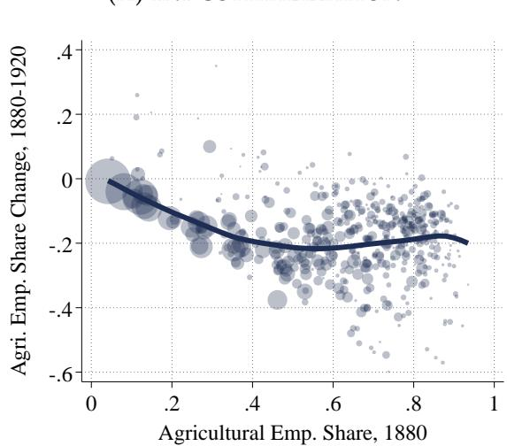

(B) WAGE GROWTH  
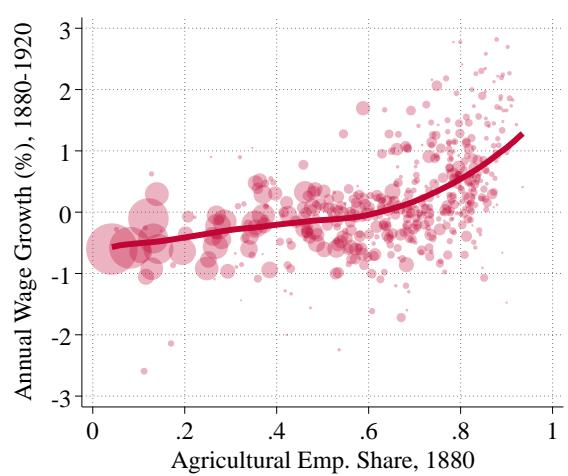  
Notes: The left panel plots commuting zones’ agricultural employment shares in 1880 against the change in agricultural employment shares from 1880 to 1920. The right panel plots 1880 agricultural shares against relative wage growth over the same period. Wage growth is normalized so that the population weighted mean is zero. Point sizes reflect total employment in each commuting zone. Each panel includes a nonparametric best-fit line, estimated using an Epanechnikov kernel-weighted polynomial smoother with a bin width of 0.1.

## 2. A THEORY OF SPATIAL STRUCTURAL CHANGE

We consider an economy that consists of a set of discrete locations, indexed by $r = 1 , . . . , R ,$ and two sectors, agriculture and manufacturing, indexed by $s = A , M . ^ { 3 }$ At each time $t ,$ the economy is populated by a mass ${ \bar { L } } _ { t }$ of workers who choose where to live subject to migration costs and whether to work as self-employed farmers or as wage earners in manufacturing. Each location r differs in its endowments of agricultural land, local amenities, and sectoral productivities, which evolve endogenously over time. Goods are traded across locations subject to iceberg trade costs, $\tau _ { r j t }$ , that can change over time. Preferences are non-homothetic, so that the expenditure share on agricultural goods falls as people become richer.

## 2.1 Technology

Each region can produce agricultural and manufacturing goods. A central feature of the model is that labor productivity is endogenous in both sectors since it depends on the technology adoption decisions of individual farmers and firms. These decisions, in turn, interact with the spatial structure of the economy, giving rise to region-specific

paths of productivity growth.

Agriculture Input and output markets in the agricultural sector are perfectly competitive. In each location, individuals can work as self-employed farmers by renting agricultural land on a frictionless spot market. The total supply of agricultural land in region r is fixed and given by $\overline { { T } } _ { r }$ . All farmers in location r produce the same variety, specific to region $r ,$ using land, innate ability, and time.

Each farmer i has an idiosyncratic farming ability $z _ { A } ^ { i }$ and one unit of time to allocate between production and adopting new technologies. A farmer with ability $z _ { A } ^ { i }$ who rents T units of land, devotes a fraction of time $t _ { P }$ to production and $t _ { A } = 1 - t _ { P }$ to adopting new agricultural techniques, produces

$$
y _ {r t} ^ {i} = A \left(z _ {A} ^ {i} t _ {P}\right) ^ {1 - \alpha} T ^ {\alpha} \quad \text { where } \quad A = K _ {r t} t _ {A} ^ {\gamma}.\tag{1}
$$

Here $\gamma$ governs the curvature of the adoption technology and $K _ { r t }$ is a region-specific shifter that determines the returns to technology adoption for farmers in region r.

A region r farmer with productivity $z _ { A } ^ { i }$ therefore is the residual claimant to the following profits:

$$
\chi_ {r t} \left(z _ {A} ^ {i}\right) \equiv \max _ {(t _ {P}, T)} \left\{p _ {r A t} K _ {r t} (1 - t _ {P}) ^ {\gamma} \left(z _ {A} ^ {i} t _ {P}\right) ^ {1 - \alpha} T ^ {\alpha} - R _ {r t} T \right\},\tag{2}
$$

where $R _ { r t }$ denotes the rental rate of agricultural land and $p _ { r A t }$ is the ”farm gate price” of the local agricultural variety; the same variety costs $p _ { r A t } \tau _ { r j t }$ in other locations j.

Equation (2) implies that a farmer’s optimal allocation of time is constant at $t _ { A } =$ $\gamma / ( \gamma + 1 - \alpha )$ . As a consequence, all farmers in region r at time t choose the same technology A, which we denote by $A _ { r t }$ . By implication, all heterogeneity in farm output within a location arises from differences in farmer ability $z _ { A } ^ { i }$ alone: farmer profits are proportional to ability $z _ { A } ^ { i }$ and given by $\chi _ { r t } z _ { A } ^ { i }$ , where $\chi _ { r t }$ denotes the return per unit of farming ability.

The term $K _ { r t }$ reflects the potential for technology adoption from farmers in other locations and determines the returns to adopting new techniques in location r. Following the literature on technology diffusion (see, for example, Acemoglu, Aghion, and Zilibotti, 2006; Desmet et al., 2018), we assume

$$
K _ {r t} = \mu_ {A} A _ {r t - 1} ^ {1 - \lambda_ {A}} \mathcal {F} _ {r A t} ^ {\lambda_ {A}}, \quad \text {where} \quad \mathcal {F} _ {r A t} = \mathcal {F} _ {A} \left(\left\{f (d _ {r j}) A _ {j t - 1} \right\} _ {j}\right),\tag{3}
$$

where $\mu _ { A }$ is an aggregate shifter, $A _ { r t - 1 }$ is region $r ^ { \prime } { \mathrm { s } }$ lagged agricultural productivity, $f ( d _ { r j } )$ is a function of distance between locations r and $j ,$ which parameterizes geographic frictions to spatial technology adoption, and ${ \mathcal { F } } _ { A }$ is a function that aggregates the distribution of ”distance discounted” lagged productivity into a scalar. The parameter $\lambda _ { A }$ governs the ease of adopting technologies from other locations.

Manufacturing Input markets in the manufacturing sector are perfectly competitive, while output markets feature monopolistic competition. Manufacturing entrepreneurs in any region r can start a manufacturing firm to produce a quantity q of a differentiated variety ω using $h _ { r M } ( \omega ) = f _ { E } + q ( \omega ) / Z$ units of manufacturing labor. The technology level Z is a choice variable of the firm. To produce with productivity $Z ,$ it must hire $( Z / \psi _ { r t } ) ^ { \theta }$ units of labor, where $\psi _ { r t }$ indexes the cost of adopting new technologies in region r. Because all manufacturing firms in region r are ex-ante homogeneous, we denote the optimal technology choice in location r at time t by $Z _ { r t }$

Mirroring the agricultural sector, we model the inverse technology adoption costs as

$$
\psi_ {r t} = \mu_ {M} Z _ {r t - 1} ^ {1 - \lambda_ {M}} \mathcal {F} _ {r M t} ^ {\lambda_ {M}} \quad \text { where } \quad \mathcal {F} _ {r M t} = \mathcal {F} _ {M} \left(\left\{f (d _ {r j}) Z _ {j t - 1} \right\} _ {j}\right).\tag{4}
$$

The function $\mathcal { F } _ { r M t }$ aggregates the past productivity of neighboring regions j, weighted by distance via $f ( d _ { r j } )$ . As in agriculture, the parameter $\lambda _ { M }$ governs the ease of adopting technologies from other regions. When $\lambda _ { M } = 0 ,$ , adoption costs depend solely on a region’s own productivity. For $\lambda _ { M } > 0$ , regions with relatively low productivity benefit from proximity to more productive locations, reflecting the potential for productivity catch-up through adoption of more advanced technologies.

Firms operate for a single period and free entry ensures that firms enter until profits net of adoption costs equal the entry cost:

$$
\max _ {Z} \left\{\pi_ {r t} (Z) - (Z / \psi_ {r t}) ^ {\theta} w _ {r M t} \right\} = w _ {r M t} f _ {E},\tag{5}
$$

where $\pi _ { r t } ( Z )$ denotes variable profits and $w _ { r M t }$ is the manufacturing wage. We denote the total mass of entering firms–and hence manufacturing varieties–in region r by Nr and total manufacturing employment in region r by $H _ { r M t } ,$ , which is the sum of labor used for entry, adoption, and production $( H _ { r E t } , H _ { r Z t } .$ , and $H _ { r P t } )$

## 2.2 Preferences

Consumers derive utility from agricultural and manufacturing consumption bundles. These bundles are CES aggregates of the available varieties in each sector:

$$
c _ {r A} ^ {i} = \left(\sum_ {j = 1} ^ {R} (c _ {r j A} ^ {i}) ^ {\frac {\sigma_ {A} - 1}{\sigma_ {A}}}\right) ^ {\frac {\sigma_ {A}}{\sigma_ {A} - 1}} \quad \text {and} \quad c _ {r M} ^ {i} = \left(\sum_ {j = 1} ^ {R} \int_ {0} ^ {N _ {j}} c _ {r j} ^ {i} (\omega) ^ {\frac {\sigma_ {M} - 1}{\sigma_ {M}}} d \omega\right) ^ {\frac {\sigma_ {M}}{\sigma_ {M} - 1}},\tag{6}
$$

where $\sigma _ { s }$ denotes the elasticity of substitution across varieties in sector s. Because goods are subject to iceberg trade costs, the corresponding ideal sectoral price indices $P _ { r M t }$

and $P _ { r A t }$ are location-specific.

To capture income-driven shifts in sectoral expenditure—an important feature of the structural transformation—we assume individuals have non-homothetic preferences over their sectoral consumption bundles, $c _ { r A } ^ { i }$ and $c _ { r M } ^ { i }$ . Specifically, we follow Boppart (2014) and adopt the Price-Independent Generalized Linear (PIGL) class of indirect utility functions which have useful aggregation properties illustrated below. As a result, the indirect utility function of worker i with total expenditure $e ^ { i }$ facing local prices $\left( P _ { r A t } , P _ { r M t } \right)$ is:

$$
V \left(e ^ {i}, P _ {r A t}, P _ {r M t}\right) = \frac {1}{\eta} \left(\frac {e ^ {i}}{P _ {r A t} ^ {\phi} P _ {r M t} ^ {1 - \phi}}\right) ^ {\eta} - \nu \ln \left(\frac {P _ {r A t}}{P _ {r M t}}\right),\tag{7}
$$

where $\eta , \phi \in ( 0 , 1 )$ and the term $e ^ { i } / ( P _ { r A t } ^ { \phi } P _ { r M t } ^ { 1 - \phi } )$ is a measure of real income. Applying Roy’s identity yields the agricultural expenditure share of consumer i:

$$
\vartheta_ {A} \left(e ^ {i}, P _ {r A t}, P _ {r M t}\right) = \phi + \nu \left(\frac {e ^ {i}}{P _ {r A t} ^ {\phi} P _ {r M t} ^ {1 - \phi}}\right) ^ {- \eta}.\tag{8}
$$

As long as $\nu > 0$ , the agricultural spending share declines with real income and asymptotes to $\phi$ from above. The ”Engel elasticity” η governs the strength of income effects on sectoral demand.4 For $\nu = 0 ,$ , preferences collapse to Cobb-Douglas with constant expenditure shares.

## 2.3 Labor Supply to Sectors and Regions

Workers choose in which location to live and in which sector to work. We begin by describing the sectoral choice conditional on having moved to a particular location.

Sectoral Labor Supply We model a worker’s sectoral choice using a Roy-type framework: each worker i draws sector-specific ability $( z _ { A } ^ { i } , z _ { M } ^ { i } )$ from independent Frechet ´ distributions with shape parameter $\zeta$ and scale 1. This setup captures imperfect substitutability of labor across sectors and endogenously generates selection into sectoral employment.

Workers choose their sector of employment to maximize earnings. In manufacturing, a worker with ability $z _ { M } ^ { i }$ earns $z _ { M } ^ { i } w _ { r M t }$ . In agriculture, we assume that payments to land are distributed to farmers in proportion to their output within each region. As a result, a farmer with ability $z _ { A } ^ { i }$ earns a share of agricultural revenue proportional to their contribution to total production. The total earnings of such a farmer are given by:5

$$
\overline {{\chi}} _ {r t} (z _ {A} ^ {i}) = \frac {1}{1 - \alpha} \chi_ {r t} z _ {A} ^ {i} \equiv \overline {{\chi}} _ {r t} z _ {A} ^ {i},
$$

where $\overline { { \chi } } _ { r t }$ captures the total return per efficiency unit of labor in agriculture. $\mathtt { A s } \mathtt { a }$ result, the income (and spending) of worker i in region r at time t is given by $e _ { r t } ^ { i } =$ max $\left\{ z _ { M } ^ { i } w _ { r M t } , z _ { A } ^ { i } \overline { { \chi } } _ { r t } \right\}$

Conveniently, the distribution of income inherits the shape of the distribution of individual ability so that:

$$
F _ {r t} (e) = \exp \left\{- (e / \overline {{w}} _ {r t}) ^ {- \zeta} \right\} \quad \text {where} \quad \overline {{w}} _ {r t} = \left(\overline {{\chi}} _ {r t} ^ {\zeta} + w _ {r M t} ^ {\zeta}\right) ^ {1 / \zeta}.\tag{9}
$$

The term $\overline { { w } } _ { r }$ is proportional to average income in region r, with a constant of proportionality of $\Gamma _ { \zeta } \equiv \Gamma \left( 1 - 1 / \zeta \right) > 0$ where $\Gamma ( \cdot )$ denotes the Gamma function. Since $\overline { { w } } _ { r }$ captures all regional and intertemporal variation in average income, we refer to it simply as average income throughout the remainder of the paper.

The Frechet assumption also leads to analytical expressions for the agricultural employ- ´ ment share, $s _ { r A t } ,$ and the aggregate supply of farmers’ efficiency units, $H _ { r A t }$ :

$$
s _ {r A t} = (\overline {{\chi}} _ {r t} / \overline {{w}} _ {r t}) ^ {\zeta} \quad \mathrm{and} \quad H _ {r A t} = \Gamma_ {\zeta} L _ {r t} s _ {r A t} ^ {\frac {\zeta - 1}{\zeta}},\tag{10}
$$

where analogous equations hold for manufacturing.

Equation (10) shows that $\zeta$ governs the sectoral labor supply elasticity: higher $\zeta$ implies more elastic labor supply. As in Lagakos and Waugh (2013), this reflects selection: the more workers choose a sector, the lower their average ability. In the limit, as $\zeta $ ∞ so that idiosyncratic differences in ability vanish, labor becomes fully elastic across sectors as in most macro models of structural change.

Spatial Mobility At the beginning of each period, worker i from location $j$ chooses their expected utility-maximizing location without knowing the realization of their sectoral ability:

$$
r ^ {i} = \arg \max \{\mathcal {V} _ {r t} \mu_ {j r} \mathcal {B} _ {r t} u _ {r t} ^ {i} \},
$$

where $\mathcal { V } _ { r t }$ denotes expected consumption utility which depends on wages and prices in the destination $r ,$ the term $\mu _ { j r } \in ( 0 , 1 ]$ captures migration frictions, $B _ { r t }$ denotes destination amenities, and $u _ { r t } ^ { i }$ is a worker- and destination-specific preference shifter. We present an expression for $\mathcal { V } _ { r t }$ in the next section.

We model amenities as $B _ { r t } = B _ { r t } L _ { r t } ^ { - \rho } .$ , where $B _ { r t }$ is an exogenous amenity shifter and $\rho > 0$ governs the strength of congestion forces, such as the increasing cost of nontradables like housing.

For aggregation purposes, we assume that idiosyncratic preferences over destinations, $u _ { r t } ^ { i } ,$ are drawn from an i.i.d. Frechet distribution with shape parameter ´ ε and scale parameter 1. This assumption yields an analytic expression for the fraction of workers born in origin j that choose location r and allows us to express the aggregate law of motion for local employment as follows:

$$
L _ {r t} = \sum_ {j} m _ {j r t} n _ {j t - 1} L _ {j t - 1} \quad \text { where } \quad m _ {j r t} = \frac {\left(\mu_ {j r} \mathcal {V} _ {r t} \mathcal {B} _ {r t}\right) ^ {\varepsilon}}{\sum_ {k} \left(\mu_ {j k} \mathcal {V} _ {k t} \mathcal {B} _ {k t}\right) ^ {\varepsilon}}.\tag{11}
$$

Here, $m _ { j r t }$ denotes the probability of moving from j to r and $n _ { j t - 1 }$ is the exogenous rate of employment growth in location $j$ between periods $t - 1$ and t. We follow Cruz and Rossi-Hansberg (2024) in introducing $n _ { j t - 1 }$ to account for sources of regional employment growth that are not modeled explicitly, such as international migration or differences in local fertility rates. A region’s employment at time t is thus determined by its employment in the previous period, the local rate of employment growth, and endogenous migration decisions of workers.

## 2.4 Aggregation and Equilibrium

This section derives closed-form expressions for the aggregate demand system, characterizes the laws of motion for local productivity, and formally defines the equilibrium of the economy.

Aggregate Demand and Spatial Welfare To compute the equilibrium, we need to characterize both the expected consumption utility of consumers $\nu _ { r t }$ and the aggregate demand system. The combination of PIGL preferences and the Frechet distribution´ of sectoral ability allows us to derive closed-form expressions for both these objects. In particular, we show that both aggregate spending patterns and expected utility admit representative-agent formulations that depend only on local average income and sectoral price indices:

Proposition 1. Let $\vartheta _ { r A t }$ denote the aggregate expenditure share on agricultural goods in region

r and $\nu _ { r t }$ the expected consumption utility of workers in region r. Then

(12)

$$
\vartheta_ {r A t} = \frac {\int \vartheta_ {A} (e , P _ {r A t} , P _ {r M t}) e d F _ {r t} (e)}{\int e d F _ {r t} (e)} = \phi + \nu^ {R C} (\overline {{w}} _ {r t} / (P _ {r A t} ^ {\phi} P _ {r M t} ^ {1 - \phi})) ^ {- \eta},\tag{13}
$$

$$
\mathcal {V} _ {r t} = \int V (e, P _ {r A t}, P _ {r M t}) d F _ {r t} (e) = \frac {1}{\eta} \Gamma_ {\frac {\zeta}{\eta}} (\overline {{w}} _ {r t} / (P _ {r A t} ^ {\phi} P _ {r M t} ^ {1 - \phi})) ^ {\eta} - \nu \ln (P _ {r A t} / P _ {r M t}),
$$

where $\begin{array} { r } { \nu ^ { R C } = \nu \frac { \Gamma _ { \zeta / ( 1 - \eta ) } } { \Gamma _ { \zeta } } > 0 } \end{array}$ .

Proof. See Section A.2.2 in the Appendix.

Proposition 1 contains closed-form expressions of aggregate demand and expected consumption utility in terms of average earnings and local price indices. In particular, it allow us to treat demand as $i f$ arising from a representative household with nonhomothetic PIGL preferences and a composite preference parameter $\nu ^ { R C }$ that depends on ν and the underlying income distribution parameterized by $\zeta .$

An important implication of Proposition 1 is that it leads to an explicit characterization of aggregate demand and sectoral revenue. Specifically, we can write aggregate revenue in sector s and region r as

$$
\mathcal {R} _ {r M t} = N _ {r t} p _ {r M t} ^ {1 - \sigma_ {M}} \mathcal {D} _ {r M t} \quad \mathrm{and} \quad \mathcal {R} _ {r A t} = p _ {r A t} ^ {1 - \sigma_ {A}} \mathcal {D} _ {r A t},\tag{14}
$$

where the terms $\mathcal { D } _ { r s t }$ capture the market access of a location (see Donaldson and Hornbeck, 2016):

$$
\mathcal {D} _ {r s t} = \sum_ {j} \tau_ {r j t} ^ {1 - \sigma_ {s}} P _ {j s t} ^ {\sigma_ {s} - 1} \vartheta_ {j s t} \Gamma_ {\zeta} L _ {j t} \overline {{w}} _ {j t} \quad \mathrm{for} \quad s = A, M,\tag{15}
$$

and $\vartheta _ { j s t } \Gamma _ { \zeta } L _ { j t } \overline { { w } } _ { j t }$ denotes aggregate spending on sector s goods in region $j .$ The market access terms summarize the sector-specific demand for producers in region $r ,$ incorporating trade costs, price competition, and sectoral spending. Crucially, economic growth raises manufacturing market access relative to agricultural market access because the agricultural expenditure share is falling as real income rises.

Adopting Technologies from Other Regions and Productivity Catch-Up A central feature of our theory is the possibility to benefit from the productivity of neighboring regions. This mechanism is embedded in our specification of adoption costs, which depend on both local productivity and a distance-weighted average of productivities in other locations. Despite the fact that technology adoption is endogenous in our theory, the resulting productivity processes admit simple, closed-form expressions in equilibrium.

Proposition 2. Let $A _ { r t }$ and $Z _ { r t }$ denote the optimal technology choices of farmers and manufacturing firms in location r at time t. Sectoral productivity growth in region r is then given by

(16)

$$
g _ {A r t} \equiv \ln {(A _ {r t} / A _ {r t - 1})} = g _ {A} + \lambda_ {A} \ln {(\mathcal {F} _ {r A t} / A _ {r t - 1})}\tag{17}
$$

$$
g _ {Z r t} \equiv \ln \left(Z _ {r t} / Z _ {r t - 1}\right) = g _ {M} + \lambda_ {M} \ln \left(\mathcal {F} _ {r Z t} / Z _ {r t - 1}\right),
$$

$$
w h e r e g _ {A} \equiv \ln \left(\left(\frac {\gamma}{\gamma + 1 - \alpha}\right) ^ {\gamma} \mu_ {A}\right) a n d g _ {M} \equiv \ln \left(\left(\frac {\sigma_ {M} - 1}{\theta - (\sigma_ {M} - 1)} f _ {E}\right) ^ {1 / \theta} \mu_ {M}\right).
$$

Proof. See Section A.2 in the Appendix.

Proposition 2 contains a key result of the paper: productivity growth in each sector consists of a nationwide term $g _ { s }$ shared by all regions, and a location-specific adjustment that depends on $\lambda _ { s } ,$ that is, the extent to which adoption from other locations is possible, and location $r ^ { \prime } { \mathrm { s } }$ productivity relative to the sectoral productivity distribution as summarized by $\mathcal { F } _ { r A t }$ and $\mathcal { F } _ { r Z t }$ . This second term introduces a “benefit of backwardness”: when $\lambda _ { s } > 0 ,$ less productive regions grow faster, leading to convergence in spatial productivity levels. In the absence of technology adoption from other locations $( \lambda _ { s } = 0 )$ 7 growth is uniform across space and the productivity distribution remains stationary. Spatial technology adoption is therefore intrinsically connected to regional productivity catch-up growth. We thus refer to $\{ \lambda _ { s } \} _ { s }$ as the strength of productivity catch-up growth or simply as productivity catch-up parameters.

The result in Proposition 2 for the agricultural sector follows directly from farmers’ constant time allocation across adoption and production activities, which implies that $A _ { r t } \propto K _ { r t }$ . Combined with the specification of the adoption technology in equation (3), equation (16) follows directly.

The law of motion for manufacturing technology emerges only in general equilibrium and exploits the free entry condition. To derive equation (17), consider first firms’ optimal technology choice in partial equilibrium. Firms choose their technology to maximize variable profits, which, using the expression for sectoral revenue in equation (14), are given by

$$
\pi_ {r t} (Z) = \frac {1}{\sigma_ {M}} \left(\frac {\sigma_ {M}}{\sigma_ {M} - 1} \frac {w _ {r M t}}{Z _ {r t}}\right) ^ {1 - \sigma_ {M}} \mathcal {D} _ {r M t}.
$$

As a result, equation (5) implies that the optimal technology choice is given by

$$
Z _ {r t} = \left(\frac {1}{\theta} \left(\frac {\sigma_ {M} - 1}{\sigma_ {M}}\right) ^ {\sigma_ {M}} \frac {\psi_ {r t} ^ {\theta} \mathcal {D} _ {r M t}}{w _ {r M t} ^ {\sigma_ {M}}}\right) ^ {\frac {1}{\theta - (\sigma_ {M} - 1)}},\tag{18}
$$

that is, firms’ desired productivity is increasing in market access and decreasing in local manufacturing wages and adoption costs.6 However, imposing the free entry condition implies that the optimal technology level depends only on the cost of adoption. This, in turn, yields Proposition 2. The intuition for this result is reminiscent of Young (1998): when demand increases in a location, profitability and the adoption incentives rise. However, local wages increase too, because free entry requires that profits net of adoption costs are pinned down by the entry cost. In Appendix Section A.2, we show formally that, in equilibrium, $Z _ { r t }$ is proportional to $\psi _ { r t } ,$ , so that equation (17) follows directly from the functional form of $\psi _ { r t }$ in equation (4).

Importantly, equations (16) and (17) do not mechanically imply a link between sectoral specialization and future productivity growth. A region’s productivity growth depends on its level of physical productivity, while its sectoral specialization reflects relative physical productivity as well as other sources of comparative advantages, such as agricultural land supply, employment density, and trade linkages.

Equilibrium Given initial conditions $\left\{ L _ { r 0 } , A _ { r 0 } , Z _ { r 0 } \right\}$ r for the distribution of workers and sectoral productivity across space, an equilibrium consists of a sequence of prices, allocations, and technology levels that satisfy individual optimization, firm behavior, market clearing, and dynamic consistency. Formally:

Definition. Given $\big \{ L _ { r 0 } , A _ { r 0 } , Z _ { r 0 } \big \} _ { r } ,$ an equilibrium is a sequence of prices $\{ P _ { r A t } , P _ { r M t } \} _ { r t } ,$ wages $\{ w _ { r M t } \} _ { r t } ,$ , rental rates for agricultural land $\{ R _ { r t } \} _ { r t } .$ , manufacturing varieties $\{ N _ { r t } \} _ { r t } ,$ employment allocations $\left\{ H _ { r A t } , H _ { r E t } , H _ { r P t } , H _ { r Z t } \right\} _ { r t }$ , local employment $\left\{ { L _ { r t } } \right\} _ { r t } ,$ , individual consumption $\left\{ c _ { r j A t } ^ { i } , \left[ c _ { r j M t } ^ { i } ( \omega ) \right] _ { \omega } \right\} _ { r j t } ^ { i } .$ , and productivity processes $\left\{ A _ { r t } , Z _ { r t } \right\} _ { r t } ,$ such that (i) consumers’ consumption and location choices maximize utility, (ii) the creation of local varieties is consistent withfree entry, (iii)firms maximize profits, (iv) all markets clear, and (v) productivity evolves according to the laws of motion in Proposition 2.

Given the initial distribution of productivity $\left\{ A _ { r 0 } , Z _ { r 0 } \right\} _ { r }$ , the evolution of productivity follows equations (16) and (17). The market-clearing conditions for both sectors, together with the spatial law of motion for employment (equation 11) and the aggregate labor supply across sectors (equation 10), jointly determine the endogenous equilibrium objects: skill prices in each sector $\left( w _ { r M t } , \overline { { \chi } } _ { r t } \right)$ , agricultural employment shares $s _ { r A t . }$ , and the mass of manufacturing varieties $N _ { r t }$ . Appendix A.2 presents the full equilibrium system.

## 3. THE ECONOMICS OF SPATIAL STRUCTURAL CHANGE

In this section, we derive the implications of the model for the patterns of spatial structural change documented in Figure 1. Specifically, we characterize how local wage growth and industrialization respond to local productivity growth, local population growth, and changes in sectoral demand. The central result of this section is the Bartik-style logic mentioned above: aggregate structural change per se systematically disadvantages regions specialized in the agricultural sector. Explaining why rural location flourished therefore requires additional forces that counteract this inherent urban bias of structural change.

To build toward our main proposition, we show in Appendix A.3 that sectoral revenue productivity can be written as:

$$
\begin{array}{r l} & {\mathcal {R} _ {r M t} / H _ {r M t} = w _ {r M t} = \overline {{f}} _ {E} Z _ {r t} ^ {\frac {\sigma_ {M} - 1}{\sigma_ {M}}} \mathcal {D} _ {r M t} ^ {\frac {1}{\sigma_ {M}}},} \\ & {\mathcal {R} _ {r A t} / H _ {r A t} = \overline {{\chi}} _ {r t} = \overline {{\alpha}} A _ {r t} ^ {\frac {\sigma_ {A} - 1}{\sigma_ {A}}} \mathcal {D} _ {r A t} ^ {\frac {1}{\sigma_ {A}}} \overline {{T}} _ {r} ^ {\alpha \frac {\sigma_ {A} - 1}{\sigma_ {A}}} H _ {r A t} ^ {- (1 - (1 - \alpha) \frac {\sigma_ {A} - 1}{\sigma_ {A}})},} \end{array}
$$

where $\overline { { f } } _ { E }$ and $\overline { { \alpha } }$ are inconsequential constants. These expressions show that sectoral revenue productivity, depends on a Cobb–Douglas composite of physical productivity and market access. In addition, the expressions highlight that revenue productivity is constant in manufacturing but declining in agriculture. In manufacturing this is the direct result of free entry which implies that additional labor translates into new varieties instead of more output per existing variety. The decreasing returns in agriculture reflect diminishing returns to land (α) and deteriorating terms of trade $( \sigma _ { A } )$

Motivated by these expressions, we define two revenue productivity shifters that summarize how physical productivity, market access, and the size of local population impact local revenue in each sector:

(19)

$$
\begin{array}{r l} & {\mathcal {Z} _ {r t} = \tilde {f} _ {E} Z _ {r t} ^ {\frac {\sigma_ {M} - 1}{\sigma_ {M}}} \mathcal {D} _ {r M t} ^ {\frac {1}{\sigma_ {M}}},} \\ & {\mathcal {A} _ {r t} = \tilde {\alpha} A _ {r t} ^ {\frac {\sigma_ {A} - 1}{\sigma_ {A}}} \mathcal {D} _ {r A t} ^ {\frac {1}{\sigma_ {A}}} (L _ {r t} / T _ {r}) ^ {- \alpha \frac {\sigma_ {A} - 1}{\sigma_ {A}}} L _ {r t} ^ {- \frac {1}{\sigma_ {A}}}.} \end{array}\tag{20}
$$

These shifters are sufficient to determine equilibrium wages and employment shares in each region.

Proposition 3. Average income $\overline { { w } } _ { r t }$ and agricultural employment shares $s _ { r A t }$ satisfy:

$$
1 = \left(\frac {\mathcal {Z} _ {r t}}{\overline {{w}} _ {r t}}\right) ^ {\zeta} + \left(\frac {\mathcal {A} _ {r t}}{\overline {{w}} _ {r t}}\right) ^ {\frac {\zeta}{\kappa}} a n d \frac {s _ {r A t} ^ {\kappa}}{1 - s _ {r A t}} = \left(\frac {\mathcal {A} _ {r t}}{\mathcal {Z} _ {r t}}\right) ^ {\zeta},\tag{21}
$$

where $\begin{array} { r } { \kappa \equiv \zeta - \left( \zeta - 1 \right) \left( 1 - \alpha \right) \frac { \sigma _ { A } - 1 } { \sigma _ { A } } \geq 1 . } \end{array}$

Proof. See Section A.3.2 in the Appendix.

Proposition 3 shows that local income and sectoral specialization are fully determined by $\mathcal { Z } _ { r }$ and $\ b { A _ { r } }$ . Physical productivity, market access terms, and local population are all endogenous local outcomes that depend on spatial linkages and equilibrium prices. The sectoral revenue shifters summarize all these factors and show that they are isomorphic in as far as wages and employment shares of an individual region are concerned.

Local income is increasing in both revenue productivities, while sectoral specialization depends only on their relative magnitude which summarizes the sectoral comparative advantage of a region. The mapping from these endogenous statistics to equilibrium allocations depends on the parameter $\kappa ,$ , which reflects the elasticity of labor supply, the importance of agricultural land, and the price elasticity of agricultural goods.

The result in Proposition 3 is quite general: it follows solely from static equilibrium conditions and does not rely on assumptions about consumer preferences, the structure of spatial labor supply, or the dynamics of local productivity. As a result, it applies to a broad class of models in which sectoral and spatial reallocation jointly determine local economic outcomes.

Importantly, Proposition 3 links the drivers of structural change – productivity growth, changes in sectoral demand as captured by the market access terms, and population dynamics – to local wage growth and industrialization in equilibrium. We formalize this insight in the following Proposition:

Proposition 4. Changes in local wages and agricultural employment shares are given by:

(22)

$$
{d \ln \overline {{w}} _ {r t}} = {\phi (s _ {r A t}) d \ln \mathcal {Z} _ {r t} + (1 - \phi (s _ {r A})) d \ln \mathcal {A} _ {r t}}\tag{23}
$$

$$
{d s _ {r A t}} = {\psi (s _ {r A t}) \left(d \ln \mathcal {Z} _ {r t} - d \ln \mathcal {A} _ {r t}\right),}
$$

where $\begin{array} { r } { \phi \left( { { s _ { r A t } } } \right) = \frac { 1 - { { s _ { r A t } } } } { 1 - { { s _ { r A t } } } + { { s _ { r A t } } } \frac { 1 } { \kappa } } \in ( 0 , 1 ) , \ \psi ( { { s _ { r A t } } } ) = - \frac { \zeta { { s _ { r A t } } } } { \kappa } \phi \left( { { s _ { r A t } } } \right) < 0 . } \end{array}$ , and κ is defined in Proposition 3.

Proof. See Section A.3.3 in the Appendix.

Proposition 4 delivers a complete analytical characterization of local wage growth and industrialization. It shows that regional heterogeneity in outcomes arises from two distinct sources: variation in the incidence of shocks to revenue productivity $( d \ln \mathcal { Z } _ { r t }$ and dln $\boldsymbol { A } _ { \boldsymbol { r } t } )$ , and variation in exposure to those shocks, as captured by the elasticities $\phi ( s _ { r A t } )$ and $\psi ( s _ { r A t } )$

Proposition 4 establishes that sectoral specialization, $s _ { r A t } ,$ is a sufficient statistic for regional exposure to structural change reflecting a Bartik-like intuition. As Figure 2 shows, the wage elasticity $\phi { \left( s _ { r A t } \right) }$ declines monotonically with agricultural employment: rural areas are disproportionately affected by agricultural shocks and relatively insulated from manufacturing shocks. By contrast, the industrialization elasticity $\psi ( s _ { r A t } )$ is Ushaped, implying that gains in relative manufacturing productivity induce the largest reallocation of employment in regions with intermediate specialization. Both elasticities are increasing in (the absolute value of) κ: when sectoral labor supply is highly elastic (high ζ) and agriculture exhibits limited decreasing returns (low $\begin{array} { r } { ( 1 - \alpha ) \frac { \sigma _ { A } - 1 } { \sigma _ { A } } ) } \end{array}$ , exposure to structural change is amplified.

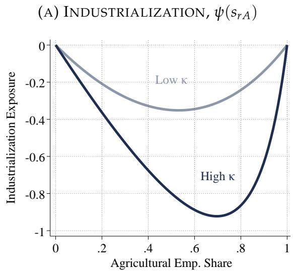

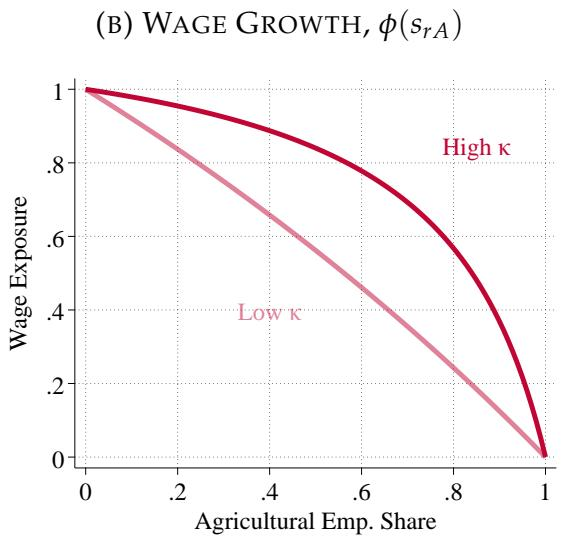  
Notes: This figure plots the exposure elasticities $\psi ( s _ { r A } )$ and $\phi ( s _ { r A } )$ from Proposition 4 as functions of the agricultural employment share. The dark line corresponds to a higher value of $\kappa ,$ and the lighter line to a lower value. The parameter $\begin{array} { r } { \kappa \equiv \zeta - ( \zeta - 1 ) ( 1 - \alpha ) \frac { \sigma _ { A } - 1 } { \sigma _ { A } } \geq 1 } \end{array}$ , where $\zeta$ denotes the elasticity of labor supply across sectors, $\sigma _ { A }$ is the demand elasticity for agricultural goods, and α is the land share in agricultural production.

Proposition 4 is central to understanding the economics of spatial structural change. It shows that aggregate structural change always has unbalanced spatial effects. Even when revenue productivity growth does not differ across locations, differences in agricultural employment shares across regions invariably imply heterogeneity in wage growth and industrialization across space.

In fact, the shape of the exposure elasticities in Figure 2 implies that if the aggregate agricultural employment share is decreasing, wage growth is necessarily urban-biased. To see this, consider a ”macro-spatial” economy in which growth is balanced across space, but not sectors so that d ln $\mathcal { A } _ { r t } = d \ln \mathcal { A } _ { t }$ and dln $\mathcal { Z } _ { r t } = d \ln \mathcal { Z } _ { t } . ^ { 7 }$ In such an economy, the agricultural employment declines if and only if d ln $\mathcal { Z } _ { t } > d \ln \mathcal { A } _ { t } ,$ , since $\psi ( s _ { r A t } ) < 0$ Equation (22) then implies that wage growth is decreasing in the agricultural employment share because rural locations are relatively more exposed to d ln $\boldsymbol { A } _ { t }$ . By contrast, rural-biased wage growth in a macro-spatial economy requires that dln $\mathcal { A } _ { t } > d \ln \mathcal { Z } _ { t } ,$ which, however, would lead to increasing agricultural employment everywhere.8

Note that the urban bias of structural change does not require physical productivity to grow faster in manufacturing than in agriculture. Even if physical agricultural productivity rises more quickly—that is, d ln $A _ { t } > d \ln Z _ { t }$ —agricultural revenue productivity may still grow more slowly than in manufacturing, that is, d ln $\mathcal { A } _ { t } < d \ln \mathcal { Z } _ { t }$ . This disconnect arises because revenue productivity depends on relative prices and relative demand. For instance, non-homothetic demand or an elasticity of substitution below one imply that a falling relative price of agricultural goods can go hand in hand with a falling expenditure share and hence faster revenue growth in the manufacturing sector.

The urban-biased wage growth predicted by aggregate structural change stands in stark contrast to the empirical patterns in Figure 1: between 1880 and 1920, sectoral reallocation toward manufacturing went hand-in-hand with rural-biased wage growth. Proposition 4 implies that, within our framework, this reversal can only be explained by spatially uneven revenue productivity growth—specifically, growth tilted toward agricultural regions. Our model identifies three mechanisms that could account for this pattern: faster physical productivity growth in rural areas via adoption of technologies from more advanced regions, faster increases in market access in rural areas, or reductions in rural populations that alleviate decreasing returns in agriculture. To assess the relative contribution of each, we now structurally estimate the model using detailed spatial data from this period.

## 4. STRUCTURAL ESTIMATION

We now describe how we estimate the structural parameters of our model. After summarizing the data in Section 4.1, we outline our estimation strategy in Section 4.2. Section 4.3 shows that our model matches a variety of targeted and non-targeted moments and successfully replicates the most salient features of the structural transformation in the US between 1880 and 1920 across time and space, most importantly the patterns in Figure 1.

## 4.1 Data Description

We treat each period in the model as spanning 20 years and use commuting zones (CZs) as our geographic units (Tolbert and Sizer, 1996). All workers are assigned to either agriculture or a residual non-agricultural sector combining manufacturing and services that we refer to simply as ”manufacturing” throughout.

We obtain total employment by sector and county from the US Census Bureau’s Decennial Full Count Census files for 1860, 1880, 1900, and 1920 (via IPUMS; see Ruggles, Genadek, Goeken, Grover, and Sobek, 2015). These data also contain information on children and immigrants, which we use to estimate the exogenous component of local employment growth, $n _ { r t }$

We obtain county-level data on average wages from the Census of Manufacturing and agricultural land values from the Census of Agriculture (both via NHGIS; see Manson, Schroeder, Van Riper, and Ruggles, 2017).9 The Census of Agriculture also provides data on the distribution of farm sizes (in acres) within each county, which we use to estimate the sectoral labor supply elasticity. To estimate spatial labor supply elasticities, we use inter-CZ migration flows constructed from linked Census microdata (Ruggles et al., 2015).

We aggregate all data to constant-boundary CZs using the crosswalk in Eckert et al. (2020), yielding a balanced panel of 495 CZs from 1860 to 1920 (see Section B.1 in the Appendix for a map). We supplement these regional data with aggregate time series data on GDP and prices from the Historical Statistics of the United States (Carter, Gartner, Haines, Olmstead, Sutch, Wright et al., 2006). Appendix B.1 provides full details on our data sources and processing.

## 4.2 Estimation Strategy

We estimate the model using a hybrid approach. First, we use cross-sectional data from 1880 to invert the static equilibrium conditions and recover region-specific fundamentals, that is productivities, amenities, and land endowments, for that year. This part of our calibration strategy only uses static equilibrium conditions; it does not depend on the parameters or specification of the dynamic productivity process. Second, we use dynamic moments from 1880–1920 to identify the structural parameters governing productivity catch-up growth via indirect inference. This two-step structure allows us to identify the initial productivity distribution independently from any assumptions on the process of productivity growth. Our estimation strategy does not require the economy to be in steady state.

Table 1 summarizes the parameter values and the moments used for estimation.

Regional Fundamentals in 1880: $\left[ Z _ { r 1 8 8 0 } , A _ { r 1 8 8 0 } , B _ { r 1 8 8 0 } , T _ { r 1 8 8 0 } \right]$ Proposition 3 shows that local wages and sectoral employment shares exactly identify the two sectoral revenue productivity terms. We then use the structure of the model and observed land rents to decompose these revenue productivities into physical productivity in each sector, sectoral market access, and land supply consistent with labor, land, and goods market clearing.10 This implies that the model matches the observed wages, rental rates, and sectoral employment shares in 1880 exactly, given local employment. We then choose regional amenities in 1880 so that the migration probabilities implied by the 1880 equilibrium generate the observed distribution of employment across commuting zones in 1880, given the distribution of employment in 1860.11

The resulting estimates from this inversion procedure are important for the subsequent calibration steps. In particular, as shown in the left panel of Figure 3, we find that in 1880, agricultural regions lagged behind in both agricultural and manufacturing productivity; their comparative advantage in agriculture stemmed primarily from abundant land rather than from high agricultural productivity. This implies that initially agricultural regions stand to benefit from catch-up productivity growth. We exploit this fact in calibrating the productivity catch-up parameters $\lambda _ { A }$ and $\lambda _ { M }$

In Appendix B.3.3, we report the relationship between all inferred regional fundamentals and agricultural employment shares in 1880. Interestingly, we find that agricultural regions also exhibited slightly higher amenity levels—consistent with historical accounts of poor sanitation and safety in early industrial cities.12

Technology Adoption Across Regions: $[ \lambda _ { s } , \mathcal { F } _ { s } ] _ { \underline { { s } } }$ s We assume the following functional form for the index capturing the potential for technology adoption from other regions for farmers in region r:

$$
\mathcal {F} _ {r A t} = \mathcal {F} _ {A} \left(\left\{f (d _ {r j}) A _ {j t - 1} \right\} _ {j}\right) = \left(\frac {1}{R} \sum_ {j = 1} ^ {R} d _ {r j} ^ {- \iota} A _ {j t - 1} ^ {\varsigma}\right) ^ {1 / \varsigma},\tag{24}
$$

where $d _ { r j }$ is the distance between region centroids. In our baseline calibration, we set $\varsigma \to \infty$ and $\iota = 0 ,$ , so that $\mathcal { F } _ { r A t } = \operatorname* { m a x } _ { j } \{ A _ { j , t - 1 } \}$ and hence also refer to $\mathcal { F } _ { r A t }$ as the agricultural productivity frontier.13 We parametrize the manufacturing frontier, $\mathcal { F } _ { r Z t . }$ , in the same way.

We estimate the productivity catch-up parameters $\lambda _ { A }$ and $\lambda _ { M }$ by indirect inference targeting the two core patterns of rural convergence in Figure 1. Specifically, we simulate the model and choose $\lambda _ { s }$ to match the coefficients $\beta _ { w }$ and $\beta _ { s _ { A } }$ of the following empirical regressions:

(25)

$$
d \ln \overline {{w}} _ {r t} = \delta_ {t} + \beta_ {w} s _ {r A t} + \nu_ {r t}\tag{26}
$$

$$
{d s _ {r A t}} = {\delta_ {t} + \beta_ {s _ {A}} s _ {r A t} + \gamma_ {s _ {A}} s _ {r A t} ^ {2} + \nu_ {r t},}
$$

with time differences taken over 20-year intervals. The quadratic specification in the second equation captures the U-shaped industrialization pattern in Figure 1. In the data, consistent with Figure 1, we find that $\beta _ { w } = 0 . 2 7$ and $\beta _ { s _ { A } } = - 0 . 4 9 ;$ see Column 1 of Table A.1.

Proposition 4 provides a direct identification argument for why the two moments $\beta _ { w }$ and $\beta _ { s _ { A } }$ are informative about the productivity catch-up parameters. The proposition shows that increases in agricultural productivity raise both the average wage and the agricultural employment share of a region, while increases in manufacturing productivity raise wages but shift employment toward manufacturing. As shown in the left panel of Figure 3, agricultural regions in 1880 lagged behind in both sectors. Productivity catch-up in either sector therefore raises wages, but the employment response differs: agricultural catch-up reinforces specialization in agriculture, while manufacturing catch-up pushes toward industrialization. This asymmetry underpins the separate identification of $\lambda _ { A }$ and $\lambda _ { M }$

Changes in Amenities $B _ { r t }$ The existing literature documents a systematically faster growth of amenities in urban areas during our study period.14 The corresponding fall of compensating differentials to reside in cities could have contributed to rural-biased wage growth. To allow for the possibility of urban-biased amenity growth, we model the growth in local amenities as d ln $B _ { r t } = \xi s _ { r A t }$ and treat $\xi$ as a structural parameter. We estimate $\xi$ using indirect inference by matching the empirical relationship between agricultural specialization and population growth. Specifically, we target the coefficient $\beta _ { L }$ from the regression

$$
d \ln L _ {r t} = \delta_ {t} + \beta_ {L} s _ {r A t} + \nu_ {r t},\tag{27}
$$

with time differences taken over 20-year intervals. In the data, we find that $\beta _ { L } = - 0 . 1$ implying essentially no correlation between agricultural specialization and subsequent population growth. Given faster rural wage growth, amenities must have grown more quickly in urban $\mathrm { C Z s , }$ , as suggested by the findings of Boustan et al. (2018).

Aggregate Productivity Growth $( g _ { A }$ and $g _ { M } )$ and Consumer Preferences $( \eta , \phi ,$ and ν) We estimate aggregate sectoral productivity growth $( g _ { A } , g _ { M } )$ and the Engel elasticity η to match three aggregate moments computed over the 1880-1920 period: GDP per capita growth, the decline in the agricultural employment share, and the change in relative sectoral prices. The parameter $\phi$ corresponds to the asymptotic agricultural employment share in the model and we set $\phi = 0 . 0 1$ , the approximate US agricultural employment share in 2020. We normalize $\nu = 1$ without loss of generality.15

Skill Heterogeneity $\zeta$ We estimate the Frechet dispersion parameter ´ $\zeta$ using data on the farm-size distribution in each CZ from the Agricultural Census. The data report the number of farms with less than 3, 10, 20, 50, 100, 500, and 1000 acres of farmland; we index these seven size bins by j. In the model, the optimal farm size is proportional to farmer ability and is hence also Frechet distributed. This implies that´ $\zeta$ can be estimated from the regression

$$
\ln \left(- \ln F _ {r t} ^ {T} (x ^ {j})\right) = \delta_ {r t} - \zeta \ln x ^ {j} + u _ {r t} ^ {j},\tag{28}
$$

where $x ^ { j }$ denotes the size cutoff of bin j (e.g., 3, 10, ... 1000), $F _ { r t } ^ { T } \left( x ^ { j } \right)$ is the share of farms in region r at time t smaller than $x ^ { j } ,$ , and $u _ { r t } ^ { j }$ is an error term, which we assume to reflect measurement error. If $\zeta$ is large, the share of farms in the upper tail of the size distribution declines quickly in size. Note that the region-time fixed effects $\delta _ { r t }$ control for local productivity $A _ { r t }$ and local rental rates $R _ { r t }$ , which are common across farmers within region r: our estimation of $\zeta$ uses variation across farm size bins $j$ within each CZ and year. As we show in Appendix Section B.3.4, this yields an estimate of $\zeta = 1 . 6 ,$ which is very robust across different specifications.16

Spatial Labor Supply The dynamics of spatial labor supply are governed by bilateral migration costs $\mu _ { r j } ,$ the dispersion of location preference shocks, $\varepsilon ,$ and the rate of exogenous population growth in each location, $n _ { r t }$

We parametrize migration costs as a function of distance, $\mu _ { r j } = d _ { r j } ^ { - \varpi }$ and estimate ε and $\varpi$ in two steps. First, we take the logarithm of the migration share expression in equation (11) to derive the following estimating equation:

$$
\ln m _ {r j t} = \delta_ {r t} ^ {o} + \delta_ {j t} ^ {d} - \varpi \epsilon \ln d _ {r j},\tag{29}
$$

where $\delta _ { r t } ^ { o }$ and $\delta _ { j t } ^ { d }$ are origin and destination fixed effects. As we show in Appendix B.3.2, estimating equation (29) using linked Census data, yields $\varpi \varepsilon = 2 . 8 . ^ { 1 7 }$

Second, we estimate ε using a method-of-moments estimator to match an average elasticity of labor supply across regions of $^ { 2 , }$ consistent with Peters (2022). Note that due to non-homothetic preferences, the labor supply elasticity is not a structural parameter but, in addition to ε, also depends on the Engel elasticity η, the taste parameter $\nu ,$ and a set of endogenous variables.

To estimate the exogenous region-specific employment growth shifters $n _ { r t } ,$ , we use historical data on international migration, local birth rates, and the age structure. As we describe in detail in Appendix B.3.1, we choose $n _ { r t }$ to match the net employment growth from international migration and new births for each region; we scale total employment growth across all regions to ensure our model also matches the aggregate rate of employment growth between 1880 and 1920.

Trade Costs We take trade costs from Donaldson and Hornbeck (2016), who reconstruct the entire historical transportation network of the US economy and provide direct estimates of iceberg trade costs between all county pairs for all years in our study. Since the railroad expanded massively from 1870 to 1890, their trade cost estimates decrease over time. In Section 6 below, we quantify the contribution of these changes to the observed patterns of structural change in Figure 1.

Other Parameters The remaining parameters are taken from established sources in the literature. Following Donaldson and Hornbeck (2016), we use a trade elasticity of $\sigma _ { A } = 8 . 2 2$ for the agricultural sector and, for symmetry in our baseline calibration, set $\sigma _ { M } = 8 . 2 2$ for manufacturing as well. We obtain the share of agricultural land in production, α, from Valentinyi and Herrendorf (2008) who find $\alpha = 0 . 4$ . Lastly, we take the congestion elasticity of $\rho = 0 . 1 5$ from Allen and Donaldson (2020), which is estimated using the same time period and Census data used in our study.

## 4.3 Estimates and Model Fit

Table 1 presents our parameter estimates alongside the moments used for identification. We distinguish between parameters estimated by solving the equilibrium of the model and targeting the respective empirical moments (”in-model,” Panel A), parameters estimated outside the model using model-derived estimating equations (”out-of-model,” Panel B), and parameters borrowed from the literature (”exogenously-set” Panel C). All structural residuals are inferred within the equilibrium loop since they depend on the other structural parameters.

Panel A shows that our model replicates the key empirical features of the structural transformation in the US between 1880 and 1920 both across sectors and regions. First, it matches three central time-series patterns: (i) the 22-point decline in agricultural employment, (ii) the average annual growth rate of GDP per capita of 2%, and (iii) the modest decline of the relative price of agricultural goods of 9 percentage points. To match these moments, we estimate 20-year frontier growth rates of 1% in agriculture and 17% in manufacturing, and an Engel elasticity of 0.8, implying a strong role for demand-side forces in driving structural transformation.

(A) INITIAL BACKWARDNESS, 1880  
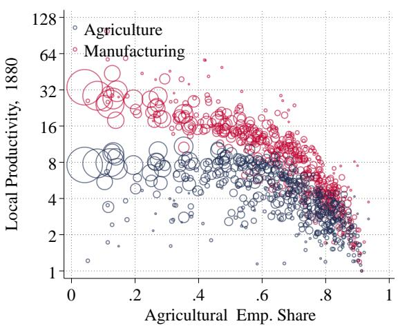

(B) PRODUCTIVITY GROWTH, 1880-1920  
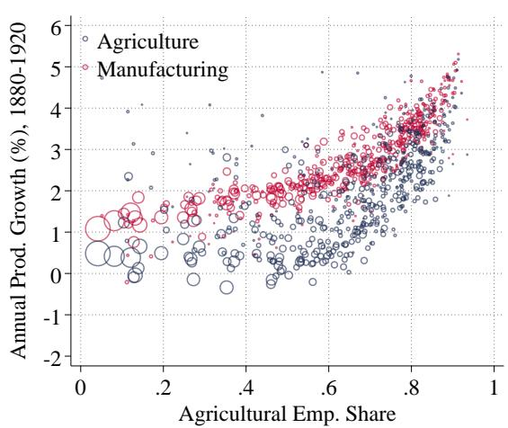  
Notes: The left panel displays the initial productivity distribution, ln $Z _ { r 1 8 8 0 }$ and ln $A _ { r 1 8 8 0 } ,$ with the agricultural employment share in 1880. The right panel displays the correlation of the estimated rate of annual local productivity growth between 1880 and 1920, that ${ \mathrm { i } } \mathbf { s } ,$ $\textstyle { \frac { 1 } { 4 0 } }$ ln $\left( Z _ { r 1 9 2 0 } / Z _ { r 1 8 8 0 } \right)$ ) and $\textstyle { \frac { 1 } { 4 0 } }$ ln $\left( A _ { r 1 9 2 0 } / A _ { r 1 8 8 0 } \right)$ with the agricultural employment share in 1880.

Second, the calibrated model successfully replicates the rural convergence patterns documented in Figure 1. It exactly matches the empirical coefficients from the linear regressions of wage growth and industrialization on initial agricultural employment shares (equations 25 and 26). As shown in Figure 4, the model-implied relationships closely align with the data—even though we target only the linear coefficients. The model captures both the strong rural bias in wage growth (right panel) and the nonmonotonic, U-shaped pattern of industrialization across space (left panel).

Notably, although the quadratic term in regression (26) is not targeted, the modelgenerated estimate, $\gamma _ { s A } = 0 . 4 2$ , closely matches the empirical value of 0.45. This success stems from the shape of the model-implied exposure to industrialization shown in Figure 2: the U-shape in exposure is inherited by the pattern of industrialization, despite substantial variation in the incidence of shocks across regions.

To match these convergence patterns, our estimates imply an important role for catchup growth. We estimate $\lambda _ { A } = 0 . 7 3$ and $\lambda _ { M } = 0 . 2 8$ , suggesting that backward regions experienced faster productivity growth in both sectors. The right panel of Figure 3 illustrates the magnitude of differential productivity growth implied by these parameters, given the initial productivity differences shown in the left panel. Quantitatively, rural labor markets experienced a growth premium of around three percentage points, with a slightly larger premium in the agricultural sector.

The model also replicates key patterns of spatial labor mobility. The left panel of Figure 5 shows local population growth by initial share of agricultural employment in both the model and data. Both display a weak, non-monotonic relationship: population grew slightly faster in the most rural and most urban regions. This is surprising, given that rural areas experienced faster wage growth, and implies that urban amenities must have improved relative to rural areas. Indeed, our estimate of ξ = 1.1 implies that a 10-point higher agricultural employment share at time t was associated with 11% slower amenity growth between t and t + 1, consistent with independent evidence on rising urban amenities in this period (see, Boustan et al., 2018).

TABLE 1: MODEL PARAMETERS AND FIT

<table><tr><td colspan="3">STRUCTURAL PARAMETERS</td><td colspan="3">ESTIMATION METHOD</td></tr><tr><td></td><td>DESCRIPTION</td><td>VALUE</td><td colspan="3">PANEL A: IN-MODEL (MOMENT, DATA, MODEL)</td></tr><tr><td> $g_A$ </td><td>Agg. prod. growth: agriculture</td><td>0.01</td><td>Annual GDP p.c. growth, 1880-1920</td><td>0.02</td><td>0.02</td></tr><tr><td> $g_M$ </td><td>Agg. prod. growth: manufacturing</td><td>0.17</td><td>Change in  $P_M/P_A$ , 1880-1920 (ppt.)</td><td>-8.95</td><td>-8.95</td></tr><tr><td> $λ_A$ </td><td>Catch-up parameter: agriculture</td><td>0.73</td><td> $β_{sA}$  in regression (26)</td><td>-0.49</td><td>-0.49</td></tr><tr><td> $λ_M$ </td><td>Catch-up parameter: manufacturing</td><td>0.28</td><td> $β_w$  in regression (25)</td><td>0.27</td><td>0.27</td></tr><tr><td> $ε$ </td><td>Location taste heterogeneity</td><td>2.47</td><td>Avg. Migration Elasticity</td><td>2.00</td><td>2.00</td></tr><tr><td> $η$ </td><td>Engel elasticity</td><td>0.80</td><td>Δ agri. emp. share, 1880-1920 (ppt.)</td><td>-21.37</td><td>-21.38</td></tr><tr><td> $ξ$ </td><td>Spatial bias in amenity growth</td><td>-1.10</td><td> $β_L$  in regression (27)</td><td>-0.10</td><td>-0.10</td></tr><tr><td></td><td></td><td></td><td colspan="3">PANEL B: OUT-OF-MODEL (STRATEGY)</td></tr><tr><td> $ζ$ </td><td>Labor Supply Elasticity</td><td>1.60</td><td colspan="3">Farm size distribution, 1880</td></tr><tr><td> $ω$ </td><td>Migration Cost Distance Elasticity</td><td>1.13</td><td colspan="3">Gravity relationship of migration flows</td></tr><tr><td> $φ$ </td><td>Asymptotic exp. share on agri. goods</td><td>0.01</td><td colspan="3">Agri. emp share 2020</td></tr><tr><td></td><td></td><td></td><td colspan="3">PANEL C: EXOGENOUSLY-SET (SOURCE)</td></tr><tr><td> $σ_A$ </td><td>Trade elasticity agriculture</td><td>8.22</td><td colspan="3">Donaldson and Hornbeck (2016)</td></tr><tr><td> $σ_M$ </td><td>Trade elasticity manufacturing</td><td>8.22</td><td colspan="3">Donaldson and Hornbeck (2016)</td></tr><tr><td> $ρ$ </td><td>Amenity congestion elasticity</td><td>0.15</td><td colspan="3">Allen and Donaldson (2020)</td></tr><tr><td> $α$ </td><td>Land Share in Production Function</td><td>0.40</td><td colspan="3">Valentinyi and Herrendorf (2008)</td></tr><tr><td> $ν$ </td><td>PIGL preference parameter</td><td>1.00</td><td colspan="3">Normalization</td></tr><tr><td> $f_E$ </td><td>Fixed cost of entry</td><td>1.00</td><td colspan="3">Normalization</td></tr><tr><td></td><td colspan="2">STRUCTURAL RESIDUALS</td><td colspan="3">MOMENT</td></tr><tr><td> $A_{r1880}$ </td><td colspan="2">Local productivity: agriculture</td><td colspan="3">CZ agricultural employment shares, 1880</td></tr><tr><td> $Z_{r1880}$ </td><td colspan="2">Local productivity: manufacturing</td><td colspan="3">CZ average wages, 1880</td></tr><tr><td> $T_{r1880}$ </td><td colspan="2">Local agricultural land supply</td><td colspan="3">CZ agricultural land rents, 1880</td></tr><tr><td> $B_{r1880}$ </td><td colspan="2">Local amenity</td><td colspan="3">CZ net employment growth, 1880-1900</td></tr><tr><td></td><td colspan="2">TRADE COSTS AND DEMOGRAPHICS</td><td colspan="3">SOURCE/TARGET</td></tr><tr><td> $τ_{rj}^A$ </td><td colspan="2">Trade cost: agriculture</td><td colspan="3">Donaldson and Hornbeck (2016)</td></tr><tr><td> $τ_{rj}^{NA}$ </td><td colspan="2">Trade cost: manufacturing</td><td colspan="3">Donaldson and Hornbeck (2016)</td></tr><tr><td> $n_{rt}$ </td><td colspan="2">Exogenous population growth</td><td colspan="3">Local birth and immigration rates</td></tr></table>

Notes: The table contains the values for all structural parameters and targeted moments of our model. ”In-Model” refers to parameters calibrated by solving the model repeatedly and adjusting parameters to match empirical moments. ”Out-of-Model” refers to parameters estimated using structural estimating equations derived from the model. All structural residuals are inferred as part of the equilibrium loop.

The fact that agricultural specialization and subsequent population growth are uncorrelated suggests that spatial reallocation from more to less agricultural regions did not play an important role in the aggregate decline in agricultural employment (Eckert, Juneau, and Peters, 2023). The right panel of Figure 5 decomposes the 22 percentage point decline of the national agricultural employment share into declines that occur within locations (holding constant regional populations in 1880), across locations (holding constant regional agricultural employment shares in 1880), and a covariance term. 18 We find that nearly all of the aggregate decline occurred within regions while spatial reallocation only played a minor role. Figure 5 also shows that our model replicates these patterns remarkably well. Even though all workers are spatially mobile, the aggregate shift out of agriculture is overwhelmingly a local phenomenon.

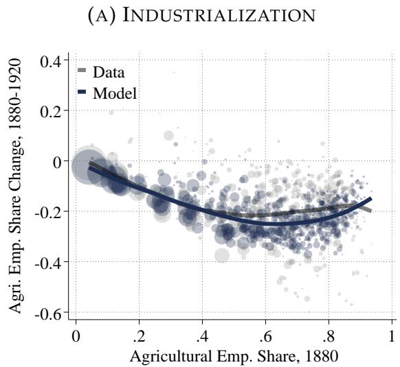

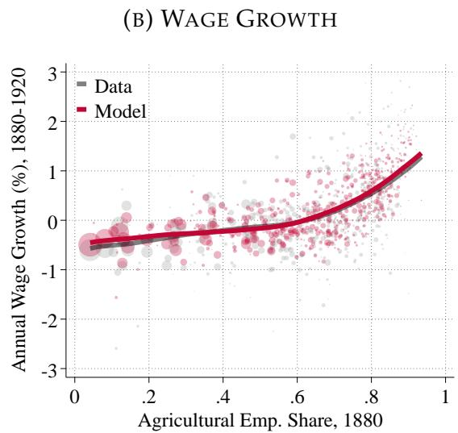  
Notes: The figure displays the correlation of industrialization (left panel) and wage growth (right panel) with the agricultural employment share. We show the data in lighter-shaded colors and model output in darker shades.

## 4.4 Rural Productivity Catch-up Growth: Additional Evidence

Our structural estimates imply that rural labor markets experienced significantly faster productivity growth between 1880 and 1920. This section provides three additional pieces of evidence in support of this finding. First, we estimate productivity growth using a fully flexible model inversion to show that our findings are not an artifact of our functional form assumptions on the dynamic productivity process. Second, we show that the rural bias in productivity growth does not reflect spatial differences in human capital accumulation. Finally, we provide direct evidence of rural-biased productivity growth using data from the Agricultural Census.

Model-Inversion Our theory proposes a specific and parsimonious model of technological convergence. A natural concern is whether our finding of rural productivity catch-up is driven by this modeling assumption. To address this, we estimate sectoral productivity— $\left. - A _ { r t } \right.$ and $Z _ { r t }$ —using direct model inversion. As in our baseline inversion for 1880, we recover $A _ { r t } , Z _ { r t } ,$ , and $T _ { r t }$ separately for 1880, 1900, and 1920, using observed wages, employment shares, land rents, and population. This procedure rationalizes the data exactly at each point in time, without imposing any assumptions on the dynamics of productivity or land supply.

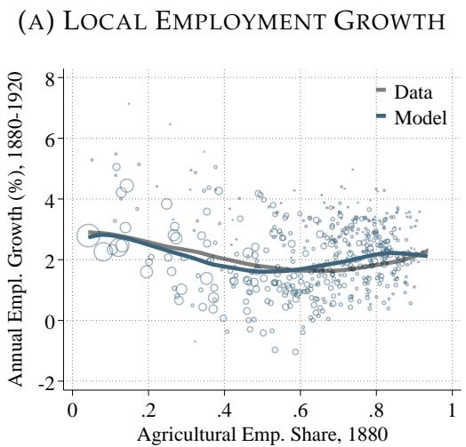

(B) LOCAL STRUCTURAL CHANGE  
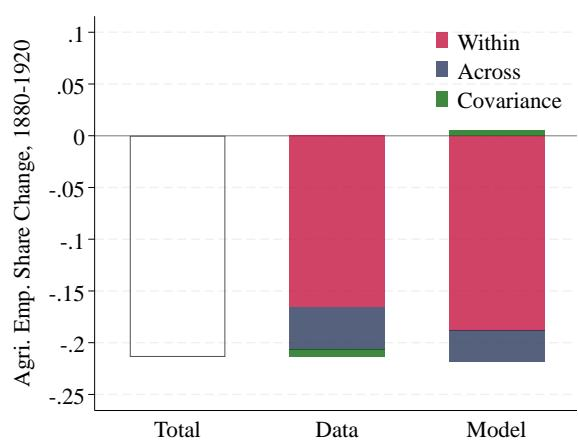  
Notes: The left panel shows the relationship between employment growth between 1880 and 1920 and the agricultural employment share in 1880. We show the data in grey and the model-generated data in blue. The size of the markers reflects the relative size of different commuting zones. The fit lines are Epanechnikov kernel-weighted polynomial fit lines with a bin width of 0.1. The right panel decomposes the aggregate decline in the agricultural employment share between 1880 and 1920, $\Delta s _ { A t }$ , as follows: $\begin{array} { r } { \Delta s _ { A t } = \sum _ { r } l _ { r t } \Delta s _ { r A t } + \sum _ { r } \Delta l _ { r t } s _ { r A t } + \sum _ { r } \Delta l _ { r t } \Delta s _ { r A t } , } \end{array}$ , where ∆ indicates time differences over 40 years and $l _ { r t }$ is the share of national employment at time t attributable to commuting zone r. We refer to the first components as ”within,” the second as ”across,” and the third as ”covariance.”

Figure 6 compares the resulting productivity growth estimates (in gray) to those from our baseline calibration (in red and blue). In both agriculture (left panel) and manufacturing (right panel), we again find a rural-biased pattern: initially more agricultural locations experienced faster productivity growth. The close alignment of the estimated productivity terms between the two approaches confirms that rural productivity catch-up is not a mechanical outcome of our assumptions on the productivity process.

Adjusting for Human Capital Our baseline model abstracts from human capital. Yet differential human capital accumulation across regions could, in principle, account for rural-biased productivity growth (e.g., Caselli and Coleman II, 2001). To address this possibility, we extend the model to allow for arbitrary human capital differences across sectors and space (see Appendix B.5). Specifically, we assume that individuals draw sector-specific ability from a Frechet distribution with mean´ $h _ { r t } ^ { s } \Gamma _ { \zeta } ,$ , where $h _ { r t } ^ { s }$ denotes the average human capital in sector s and region r.

This extension preserves the model’s structure and is isomorphic to the baseline formulation, with the sole difference that physical productivity is scaled by average human capital in each region and sector. For instance, agricultural productivity becomes $A _ { r t } = ( h _ { r t } ^ { A } ) ^ { v } \bar { A } _ { r t }$ for a known constant $v ,$ where $\bar { A } _ { r t }$ denotes physical productivity net of human capital. Given estimates of $h _ { r t } ^ { s } ,$ , we can therefore recover “purged” productivity measures $\bar { A } _ { r t }$ from our original estimates of $A _ { r t }$ .

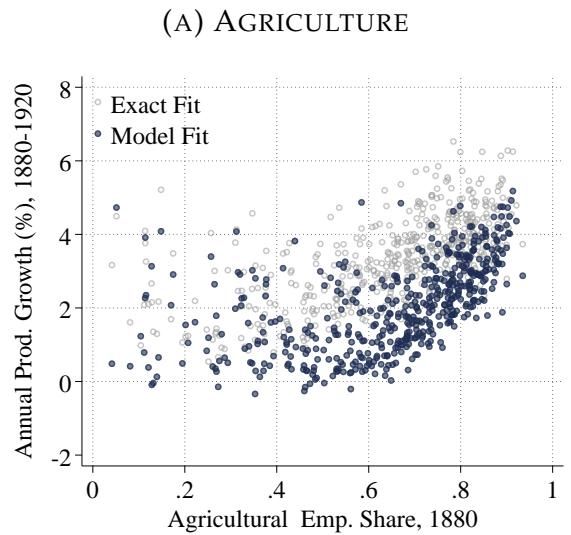

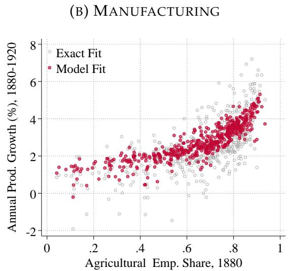  
Notes: The figure plots annualized productivity growth as estimated from our model and from full model inversion against the initial agricultural employment share.

We model human capital in a Mincerian way as $h _ { r t } ^ { s } = \exp \left( \gamma _ { s } s \mathrm { c h } _ { r t } \right)$ , where $\gamma _ { s }$ is the sector-specific return to schooling and $\mathrm { s c h } _ { r t }$ denotes average years of schooling among workers in location r at time t. When we combine Census data and model-implied estimating equations, we find substantial returns to schooling in manufacturing but near-zero returns in agriculture, consistent with prior work (e.g., Porzio, Rossi, and Santangelo, 2022). Using these estimates, we construct estimates of $h _ { r t } ^ { s }$ for every location and sector.19

When we recover the purged productivity terms, ${ \bar { A } } _ { r t } ,$ from our original estimates, we find that their cross-sectional and dynamic patterns closely mirror those in our original estimates. While rural regions had lower educational attainment in 1880, changes in education over time were not systematically related to initial agricultural specialization. We conclude that human capital growth cannot explain rural-biased productivity convergence, though it likely contributed to overall productivity growth—particularly in manufacturing where returns to education are important.

Direct Productivity Measurements Finally, we present model-free evidence on agricultural productivity growth using data from the Census of Agriculture. Specifically, we use agricultural yields—output per acre—as a direct proxy for local agricultural productivity. As shown in Appendix B.3.6, rural regions were less productive in 1880 but experienced faster yield growth between 1880 and 1920. These patterns reinforce two key findings of our structural estimation: initially agricultural regions had low agri cultural productivity, but experienced productivity catch-up, even in the agricultural

## 5. THE ECONOMICS OF SPATIAL STRUCTURAL CHANGE: QUANTITATIVE RESULTS

We now use our calibrated model to decompose the patterns of spatial structural change shown in Figure 1 into their underlying driving forces. This analysis delivers one of the central results of the paper: quantitatively, explaining the joint patterns of rural wage convergence and rural industrialization observed between 1880 and 1920 requires strong productivity catch-up in rural locations in both sectors.

We document this finding in two complementary ways, both of which build on our theoretical decomposition contained in Proposition 4. In Section 5.1, we directly leverage Proposition 4 to decompose wage growth and industrialization across regions into the impact of productivity growth, changes in demand, and local employment growth. We find that spatial differences in productivity growth account for the bulk of rural wage convergence and industrialization, while changes in demand and population growth played a secondary role.

In Section 5.2, we supplement this decomposition with a complimentary exercise where we re-estimate our entire model under the assumption of no catch-up growth in productivity. Under this calibration, the model continues to match the time series aspects of the structural transformation and incorporates other spatially-biased demand shifts such as falling transport costs or the arrival of international migrants. We show that this parametrization of our theory fails to account for the spatial patterns of structural change: it predicts faster wage growth in urban areas and substantially slower industrialization in all locations. These findings confirm the quantitative importance of the urban-bias of aggregate structural change, and highlight the pivotal role of productivity catch-up in producing the rural-biased wage growth in Figure 1.

## 5.1 Sources of Spatial Structural Change

Proposition 4 contains a model-based decomposition of local wage growth and local industrialization into changes in sectoral revenue productivity and region-specific exposure. Changes in revenue productivity can be further decomposed into five economic forces: (i) local productivity growth in agriculture and manufacturing $( d \ln A _ { r t } , d \ln Z _ { r t } )$ (ii) changes in market access (d ln $\mathcal { D } _ { r A t } , d \ln \mathcal { D } _ { r M t } )$ , and (iii) local employment growth $( d \ln L _ { r t } )$ . The local impact of each channel varies with a region’s exposure as summarized by its sectoral employment share.

To implement the decomposition, for each commuting zone, we compute the impact of each of these five factors multiplied by their respective exposure elasticities separately for local wage growth and local industrialization for 1880-1900 and 1900-1920. We then aggregate these results across time periods and among urban, intermediate and rural locations, which we define as all regions below, within, and above the interquartile range of agricultural employment shares in 1880.20

(A) INDUSTRIALIZATION  
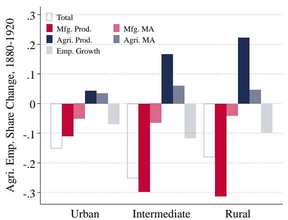

(B) WAGE GROWTH  
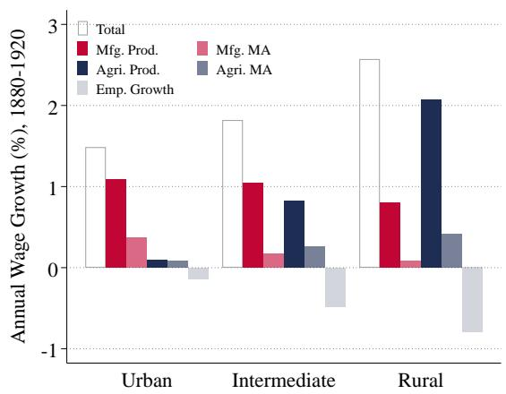  
Notes: The figure reports the decomposition of local industrialization, $d s _ { r A } ,$ and local wage growth, dln $\overline { { w } } _ { r t } ,$ into changes in market access (d ln $\mathcal { D } _ { r s t } , ~ { } ^ { \prime \prime } \mathrm { M A ^ { \prime \prime } } )$ , sectoral productivity (d ln $Z _ { r t }$ and dln $A _ { r t } )$ , and local employment $( d \ln L _ { r t } )$ , all pre-multiplied by the relevant exposure elasticities, see Proposition 4. We define urban (rural) locations as regions in the lower (upper) quartile of the distribution of agricultural employment shares in 1880. We refer to all commuting zones within the interquartile range as ”intermediate.”

Figure 7 shows the results. We depict the impact of physical productivity growth in dark blue and red, the impact of changes in market access in light blue and red and the impact of population growth in gray. The aggregate effect, shown in white, is the sum of these five forces.

Our first quantitative finding is that catch-up productivity growth in agriculture was essential to explain rural wage convergence. The right panel shows that wage growth in rural areas is overwhelmingly driven by agricultural productivity growth, while urban wage growth is primarily driven by productivity growth in manufacturing. Specifically, holding all else constant, agricultural TFP growth alone would have raised rural wages by nearly 2% annually.

Our second quantitative finding is that rural industrialization was driven by productivity catch-up in manufacturing as shown in the left panel of Figure 7. In fact, if only manufacturing productivity had increased, the overall decline in agricultural employment would have been larger than what is observed empirically. This reflects that agricultural productivity growth acts in the opposite direction—it strengthens comparative advantage in agriculture and works against reallocation.

A corollary of our findings on the role of sectoral productivity growth is that the contributions of demand-side forces and population growth are secondary. While falling trade costs improves market access in many regions and structural change shifts demand toward manufacturing due to non-homothetic preferences, quantitatively they play a less important role, both to explain local wage growth and local industrialization. The effect of population growth is similarly nuanced. In the presence of decreasing returns in agriculture, rising population density contributed to rural industrialization, but at the same time put downward pressure on rural wages.

The decompositions in Figure 7 highlight how the interaction between exposure and incidence shapes spatial economic outcomes: incidence determines who is affected, while exposure determines how strongly. For any force to have a large impact on a region, both its incidence and the region’s exposure to it must be high. For example, manufacturing productivity growth was a key driver of rural industrialization but had limited effects on rural wage growth, since wages respond little to rising productivity in sectors that employ a small share of the local workforce. Conversely, even though physical manufacturing productivity grew less in urban areas than in rural ones, its wage impact was larger in cities due to their greater exposure to the manufacturing sector. A similar logic applies to population growth: although average growth was spatially balanced, it depressed rural wages more because rural areas were more exposed to the sector—agriculture—where congestion effects are strongest.

Together, these findings deliver a sharp conclusion. First, productivity catch-up growth played the key role in explaining the empirical patterns of spatial structural change during the first structural transformation of the US. Second, while faster productivity growth in agriculture was at the heart of rural wage growth, rural industrialization was driven by productivity convergence in manufacturing. Third, neither changes in market access nor population growth can, on their own, account for the pro-rural nature of US economic growth between 1880 and 1920.

## 5.2 The Inherent Urban-Bias of Structural Change

A key implication of Proposition 4 is the inherent urban-bias of the structural transformation: spatially balanced productivity growth leads to faster wage growth in industrialized locations if and only if agricultural employment declines. While this result is exactly true with common population growth across space and free trade, we now use our quantitative model to show that this pattern also arises in the presence of trade costs and endogenous migration decisions.

To do so, we turn to a counterfactual analysis to quantify the full, system-wide impact of spatial productivity catch-up growth taking all general equilibrium interactions into account. In particular, we compare our baseline model to an alternative calibration in which the spatial distribution of productivity remains stationary, but the model still generates the same aggregate facts in the time-series. Specifically, we set $\lambda _ { A } = \lambda _ { M } = 0$ and re-estimate the aggregate productivity shifters $g _ { A }$ and $g _ { M }$ to match the observed aggregate growth rate and the change in relative prices. Because sectoral productivity grows at the common rates $g _ { s }$ in all locations, there are no benefits of backwardness and we refer to this parametrization as the “no productivity catch-up” calibration.

The results are stark. Without productivity catch-up growth, structural change becomes strongly urban-biased. Rural wage convergence disappears, rural industrialization slows markedly, and employment spatially reallocates towards urban centers. Aggregate structural change also takes a different form: although the total decline in agricultural employment remains similar, it is now driven much more by the spatial reallocation of labor toward industrialized labor markets than by falling agricultural employment within local labor markets.

TABLE 2: THE “NO PRODUCTIVITY CATCH-UP” CALIBRATION

<table><tr><td colspan="2">DESCRIPTION</td><td>VALUE</td><td>MOMENT</td><td>DATA</td><td>MODEL</td><td>TARGETTED</td></tr><tr><td colspan="7">Panel A: Re-calibrated</td></tr><tr><td> $g_A$ </td><td>Agg. prod. growth: agriculture</td><td>0.29</td><td>Annual GDP p.c. growth, 1880-1920</td><td>0.02</td><td>0.02</td><td>Yes</td></tr><tr><td> $g_M$ </td><td>Agg. prod. growth: manufacturing</td><td>0.30</td><td>Change in  $P_M/P_A$ , 1880-1920 (ppt.)</td><td>-8.95</td><td>-8.95</td><td>Yes</td></tr><tr><td colspan="7">Panel B: Exogenously Set</td></tr><tr><td> $\lambda_A$ </td><td>Catch-up parameter: agriculture</td><td>0.00</td><td> $\beta_{sA}$  in regression (26)</td><td>-0.49</td><td>-0.15</td><td>No</td></tr><tr><td> $\lambda_M$ </td><td>Catch-up parameter: manufacturing</td><td>0.00</td><td> $\beta_w$  in regression (25)</td><td>0.27</td><td>-0.11</td><td>No</td></tr><tr><td colspan="7">Panel C: Not-Recalibrated</td></tr><tr><td>ε</td><td>Location taste heterogeneity</td><td>2.47</td><td>Avg. Migration Elasticity</td><td>2.00</td><td>2.01</td><td>No</td></tr><tr><td>η</td><td>Engel elasticity</td><td>0.80</td><td>Agri. emp. share change, 1880-1920 (ppt.)</td><td>-21.37</td><td>-17.51</td><td>No</td></tr><tr><td>ξ</td><td>Spatial bias amenity growth</td><td>-1.10</td><td> $\beta_L$  in regression (27)</td><td>-0.10</td><td>-0.65</td><td>No</td></tr></table>

Notes: The table reports the structural parameters estimated by simulating the model and their corresponding moments for the ”no productivity catch-up” calibration. We set $\lambda _ { A }$ and $\lambda _ { M }$ to zero; the table reports the moments we use to estimate $\lambda _ { A }$ and $\lambda _ { M }$ in the baseline calibration for comparison. We recalibrate $g _ { A }$ and $g _ { M }$ to match the same targets as before. We also report the remaining structural parameters calibrated within the model and their corresponding moments, however, we are not re-calibrating these moments. All other parameters are the same in both calibrations and reported in Table 1.

These findings are summarized in Table 2 and Figure 8. Table 2 reports the parameter values and key moments for the “no productivity catch-up” calibration. Note first that the model still matches the aggregate patterns of structural change. Overall growth and the change in relative prices are, by construction, consistent with the data. In addition, the model still generates a large decline in agricultural employment of 17.5 percentage points.21

Crucially, Figure 8 shows that the model has drastically counterfactual predictions for the spatial patterns of structural change. Without productivity catch-up, the model neither replicates the observed rural wage convergence, nor the U-shaped relationship between initial agricultural employment and industrialization. In the baseline model (gray), rural locations experienced both faster wage growth and stronger industrialization. In the no-catch-up model (red and blue), urban locations pull ahead: annual wage growth is about 0.5 percentage points faster in cities, and industrialization in rural America is far more modest. Regions with a 60% agricultural employment share in 1880 saw a 25-point decline in agricultural employment in the baseline, but less than a 10-point decline in the no-catch-up model. These patterns are also reflected in the implied coefficients $\beta _ { w }$ and $\beta _ { s _ { A } }$ , which become smaller in absolute value and, in the case of $\beta _ { w } ,$ even reverse sign (see Table 2).

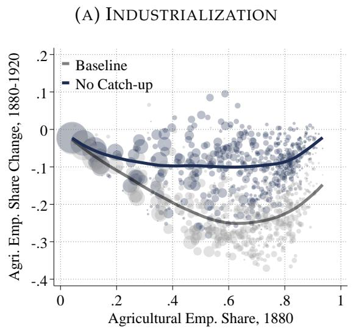

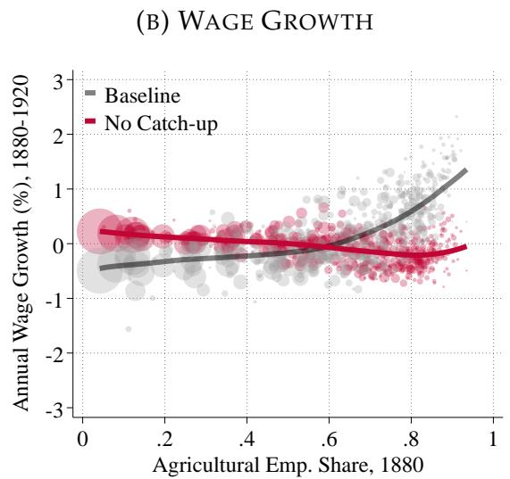  
Notes: In the left (right) panel, we show local industrialization (local wage growth) as a function of the initial agricultural employment share. We depict the baseline calibration in gray and the calibration without productivity catch-up in red and blue, respectively. The size of the markers reflects the relative size of different commuting zones.

Figure 8 also highlights how productivity catch-up growth shaped the composition of aggregate structural change. The decline of aggregate agricultural employment by 17.5 percentage points exceeds the decline within each local labor market. The reason is that in the absence of productivity catch-up growth, faster wage growth in urban centers pulls people into cities and hence out of agriculture.22 In terms of the decomposition shown in Figure 5, the ”within” component only accounts for about 50% of aggregate structural change, with 50% of it now accounted for by the spatial reallocation of workers from high to low agricultural employment share labor markets. In contrast, the model with productivity catch-up growth matches the empirical finding that most of the agricultural decline was a within-region transformation, not a product of migration. These findings summarize the central result of the paper. Aggregate structural change is inherently biased against rural locations. Moreover, this Bartik-like channel is not only a theoretical possibility but quantitatively important: differences in spatial exposure generate large differences in local wage growth. What made the US experience between 1880 and 1920 exceptional is that this urban bias was counteracted—and ultimately overturned—by strong productivity convergence. Faster productivity growth did not just help rural America to catch up to more industrialized areas, but rather prevented it from falling further behind.

## 6. ROBUSTNESS

We now assess the robustness of our central finding to alternative parameter values and modeling assumptions: throughout a set of alternative calibrations, catch-up productivity growth plays the central role for understanding the empirical patterns of spatial structural change. Appendix Section B.4 provides additional details.

Alternative Parameter Values We begin by exploring the sensitivity of our results to key structural parameters. As highlighted in Propositions 3 and 4, the elasticity of sectoral labor supply (ζ), the agricultural land share (α), and the elasticity of substitution in manufacturing $( \sigma _ { M } )$ play important roles in shaping the transmission of sectoral productivity growth into wages and employment. We re-estimate the model with a higher labor supply elasticity $( \zeta = 4 )$ , a lower agricultural land share $( \alpha = 0 . 2 )$ , and a lower elasticity of substitution in manufacturing $( \sigma _ { M } = 4 )$ , respectively.

We also probe our assumption of fixed land supply. As robustness, we consider a version of the model in which $T _ { r t } = \bar { T } _ { r } R _ { r t } ^ { \varrho } .$ , so that agricultural land supply responds to the local rental rate. We set $\varrho = 1 . 2$ based on estimates using historical data on land supply and rental rates from the Census of Agriculture, where we instrument for local demand shifts using inflows of international migrants (see Appendix B.4 for details).

Across all these parameter permutations, the rural bias in productivity growth remains the central force driving the patterns of spatial structural change. Table 3 summarizes the estimated strength of sectoral productivity growth in rural and urban locations, and its role for wage growth and industrialization. For comparison, we report the results of our baseline calibration in the first row.23 Physical productivity growth in both sectors remains substantially higher in rural relative to urban locations (Columns 1 and 2). Industrialization remains overwhelmingly driven by manufacturing productivity growth across all locations (Columns 3 and 4). Similarly, wage growth in rural areas continues to be driven almost entirely by agricultural productivity catch-up, while wage growth in urban areas is accounted for by growth in the manufacturing sector (Columns 5 and 6). These results reinforce our finding that productivity catch-up growth in agriculture was essential for rural wage growth, whereas productivity convergence toward the manufacturing frontier was the primary driver of rural industrialization.

TABLE 3: ROBUSTNESS

<table><tr><td rowspan="2"></td><td colspan="2">Annual Growth (%) in...</td><td colspan="2">Total Change in  $s_{rAt}$  due to...</td><td colspan="2">Annual Growth (%) in  $w_{rt}$  due to...</td></tr><tr><td> $A_{rt}$ </td><td> $Z_{rt}$ </td><td> $A_{rt}$ </td><td> $Z_{rt}$ </td><td> $A_{rt}$ </td><td> $Z_{rt}$ </td></tr><tr><td colspan="7">Panel A: Urban Commuting Zones</td></tr><tr><td>Baseline</td><td>0.57</td><td>1.54</td><td>0.04</td><td>-0.11</td><td>0.10</td><td>1.09</td></tr><tr><td> $\zeta=4$ </td><td>0.51</td><td>1.37</td><td>0.07</td><td>-0.14</td><td>0.07</td><td>1.07</td></tr><tr><td> $\alpha=0.2$ </td><td>1.07</td><td>1.53</td><td>0.07</td><td>-0.13</td><td>0.15</td><td>1.06</td></tr><tr><td> $\varrho=1.2$ </td><td>0.19</td><td>1.55</td><td>0.02</td><td>-0.12</td><td>0.05</td><td>1.09</td></tr><tr><td> $\sigma_{M}=4$ </td><td>0.59</td><td>0.97</td><td>0.04</td><td>-0.07</td><td>0.10</td><td>0.57</td></tr><tr><td> $\tau_{rjt}=\tau_{rj1880}$ </td><td>0.68</td><td>1.60</td><td>0.05</td><td>-0.12</td><td>0.12</td><td>1.13</td></tr><tr><td> $n_{rt}=n_{t}$ </td><td>0.63</td><td>1.55</td><td>0.05</td><td>-0.12</td><td>0.11</td><td>1.10</td></tr><tr><td> $\varsigma=5,\iota=1$ </td><td>0.48</td><td>1.54</td><td>0.03</td><td>-0.11</td><td>0.07</td><td>1.09</td></tr><tr><td colspan="7">Panel B: Rural Commuting Zones</td></tr><tr><td>Baseline</td><td>2.97</td><td>3.86</td><td>0.22</td><td>-0.31</td><td>2.07</td><td>0.79</td></tr><tr><td> $\zeta=4$ </td><td>3.27</td><td>2.81</td><td>0.51</td><td>-0.45</td><td>1.92</td><td>0.86</td></tr><tr><td> $\alpha=0.2$ </td><td>2.25</td><td>4.12</td><td>0.18</td><td>-0.35</td><td>1.57</td><td>0.86</td></tr><tr><td> $\varrho=1.2$ </td><td>2.08</td><td>3.85</td><td>0.20</td><td>-0.32</td><td>1.78</td><td>0.77</td></tr><tr><td> $\sigma_{M}=4$ </td><td>2.96</td><td>3.72</td><td>0.22</td><td>-0.25</td><td>2.05</td><td>0.65</td></tr><tr><td> $\tau_{rjt}=\tau_{rj1880}$ </td><td>3.09</td><td>4.01</td><td>0.23</td><td>-0.32</td><td>2.15</td><td>0.82</td></tr><tr><td> $n_{rt}=n_{t}$ </td><td>2.95</td><td>3.90</td><td>0.22</td><td>-0.32</td><td>2.04</td><td>0.80</td></tr><tr><td> $\varsigma=5,\iota=1$ </td><td>3.00</td><td>3.88</td><td>0.22</td><td>-0.31</td><td>2.08</td><td>0.79</td></tr></table>

Notes: The table reports the contribution of agricultural and manufacturing productivity growth to spatial wage growth and industrialization across several model specifications. Columns 1 and 2 display estimated productivity growth in each sector for urban and rural areas, defined as the bottom and top quartiles of 1880 agricultural employment shares, respectively. Columns 3 and 4 present the corresponding contributions to changes in the agricultural employment share over the same period. Columns 5 and 6 show the portion of wage growth from 1880 to 1920 attributable to sectoral productivity growth in urban and rural regions.

While they do not change our quantitative conclusions, the direction in which these alternative parameter values influence our findings is instructive. A higher sectoral labor supply elasticity raises the sensitivity of wages and employment shares to sectorspecific shocks by making it easier for workers to switch sectors. As a result, the size of the estimated productivity growth is lower to explain the same variation in wages and employment shares. Introducing an elastic land supply reduces the amount of agricultural productivity growth required to rationalize observed wage gains, since land expansion itself boosts labor productivity in agriculture by alleviating the decreasing returns to labor. Finally, lowering the elasticity of substitution in manufacturing reduces the estimated rate of productivity growth in that sector, because the decline in trade costs generates more economic growth if regional varieties are more complementary.

Structural Modeling Assumptions We next assess the role of three structural modeling assumptions: the evolution of trade costs, the specification of local population growth, and the presence of geographic frictions to technology adoption. Specifically, we re-estimate our model while holding trade costs fixed at their 1880 levels, removing the effects of the expanding railroad network and other advances in transportation technologies implicit in the annual trade cost matrices provided by Donaldson and Hornbeck (2016); we replace the differential exogenous population growth rates across locations with a spatially balanced growth rate of population $n _ { r t } = n _ { t }$ equal to aggregate population growth; and we allow the technological frontier to vary across space by setting $\varsigma = 5$ and ι = 1 in equation (24), so that access to the technologies of other regions declines with geographic distance.

The results of these exercises are contained in the last three rows of the respective panels of Table 3. Falling trade costs have a rural-biased wage growth effect, but their contribution pales compared to the importance of productivity catch-up. If trade costs were held constant at their 1880 level, our model would ”need” slightly faster productivity growth in both sectors and locations. Similarly, the fact that birth rates and immigration inflows were unbalanced across space or that our baseline calibration abstracts from geographic frictions to technology adoption does not interfere much with our inference of rural productivity catch-up growth and the decomposition of local wage growth and industrialization.

## 7. CONCLUSION

Aggregate structural change reallocates resources out of agriculture and into other sectors. Because agricultural activity is unevenly distributed across space, some locations are more exposed to this reallocation than others. As a result, a natural conjecture is that structural change creates regional winners and losers with urban areas benefiting from industrial expansion and rural labor markets contracting as their sector of specialization loses relevance. Yet the historical US data reveal the opposite pattern—between 1880 and 1920, rural areas experienced both faster wage growth and faster industrialization.

This paper reconciles these facts by developing a theory of spatial structural change in which sectoral reallocation interacts with region-specific productivity dynamics, trade across regions, and internal migration. Our theory stresses that structural change itself indeed inherently favors urban regions, but that rural areas can benefit if they are positioned behind the technological frontier and productivity catch-up is strong. Quantitatively, we find that rural productivity catch-up in both agriculture and manufacturing was essential to explain the observed pattern of wage growth and industrialization. Agricultural productivity catch-up accounts for rural wage convergence, while productivity catch-up in manufacturing drove rural industrialization. Absent these forces, the model predicts urban-biased wage growth, limited industrialization of rural labor markets, and a larger role for migration in the decline of agricultural employment.

Although our analysis focuses on the US during its first structural transformation, our framework offers a general approach to study structural change in a unified way across sectors and space. It opens several avenues for future work, two of which we think are particularly interesting. First, applying the model to the transition from manufacturing to services may shed light on the growing regional divergence in advanced economies (see, for example, Austin, Glaeser, and Summers, 2018; Chatterjee and Giannone, 2021). Through the lens of our model, divergence suggests that in this second sectoral transition, catch-up growth is weak and the urban bias in aggregate structural change dominates. Second, applying the model to other countries currently undergoing their first structural transformation can help assess whether productivity catch-up is a general feature of spatial structural change or specific to US experience of the late 19th century.

## REFERENCES

ABRAMITZKY, R., L. BOUSTAN, K. ERIKSSON, J. FEIGENBAUM, AND S. PEREZ´ (2021): “Automated Linking of Historical Data,” Journal ofEconomic Literature, 59, 865–918.

ABRAMITZKY, R., L. BOUSTAN, K. ERIKSSON, M. RASHID, AND S. PEREZ´ (2022): “Census Linking Project: 1850-1860 Crosswalk,” Tech. rep.

ACEMOGLU, D., P. AGHION, AND F. ZILIBOTTI (2006): “Distance to Frontier, Selection, and Economic Growth,” Journal of the European Economic Association, 4, 37–74.

ALLEN, T. AND C. ARKOLAKIS (2014): “Trade and the Topography of the Spatial Economy,” The Quarterly Journal of Economics, 129, 1085–1140.

ALLEN, T. AND D. DONALDSON (2020): “Persistence and Path Dependence in the Spatial Economy,” Tech. rep., National Bureau of Economic Research.

AUSTIN, B., E. GLAESER, AND L. SUMMERS (2018): “Jobs for the Heartland: Place-Based Policies in 21st-Century America,” Brookings Papers on Economic Activity, 2018, 151–255.

BOHR, C., M. MESTIERI, AND F. ROBERT-NICOUD (2024): “Heterothetic cobb douglas: Theory and applications,” Tech. rep., Centre for Economic Policy Research.

BOPPART, T. (2014): “Structural Change and the Kaldor Facts in a Growth Model with Relative Price Effects and non-Gorman Preferences,” Econometrica, 82, 2167–2196.

BOUSTAN, L., D. BUNTEN, AND O. HEAREY (2018): “Urbanization in American Economic History, 1800–2000,” in The Oxford Handbook of American Economic History Volume 2, Oxford University Press.

CALIENDO, L., M. DVORKIN, AND F. PARRO (2019): “Trade and Labor Market Dynamics: General Equilibrium Analysis of the China Trade Shock,” Econometrica, 87, 741–835.

CARTER, S. B., S. S. GARTNER, M. R. HAINES, A. L. OLMSTEAD, R. SUTCH, G. WRIGHT, ET AL. (2006): Historical Statistics of the United States: Millennial Edition, vol. 3, Cambridge: Cambridge University Press.

CASELLI, F. AND W. J. COLEMAN II (2001): “The U.S. Structural Transformation and Regional Convergence: A Reinterpretation,” Journal ofPolitical Economy, 109, 584–616.

CHATTERJEE, S. AND E. GIANNONE (2021): “Unequal Global Convergence,” Tech. rep., Working Paper.

COMIN, D., D. LASHKARI, AND M. MESTIERI (2021): “Structural Change with Longrun Income and Price Effects,” Econometrica, 89, 311–374.

CRUZ, J.-L. AND E. ROSSI-HANSBERG (2024): “The Economic Geography of Global Warming,” Review of Economic Studies, 91, 899–939.

DESMET, K., D. K. NAGY, AND E. ROSSI-HANSBERG (2018): “The Geography of Development,” Journal of Political Economy, 126, 903–983.

DESMET, K. AND E. ROSSI-HANSBERG (2014): “Spatial Development,” American Economic Review, 104, 1211–43.

DONALDSON, D. AND R. HORNBECK (2016): “Railroads and American Economic Growth: A “Market Access” Approach,” The Quarterly Journal of Economics, 131, 799–858.

ECKERT, F., S. GANAPATI, AND C. WALSH (2022): “Urban-Biased Growth: A Macroeconomic Analysis,” Tech. rep., National Bureau of Economic Research.

ECKERT, F., A. GVIRTZ, J. LIANG, AND M. PETERS (2020): “A Method to Construct Geographical Crosswalks with an Application to US Counties since 1790,” Tech. rep., National Bureau of Economic Research.

ECKERT, F., J. JUNEAU, AND M. PETERS (2023): “Sprouting Cities: How Rural America Industrialized,” in AEA Papers and Proceedings, vol. 113, 87–92.

FAN, T., M. PETERS, AND F. ZILIBOTTI (2023): “Growing Like India: The Unequal Effects of Service-led Growth,” Econometrica, 91, 1457–1494.

GOLLIN, D., M. KIRCHBERGER, AND D. LAGAKOS (2021): “Do Urban Wage Premia Reflect Lower Amenities? Evidence from Africa,” Journal of Urban Economics, 121, 103301.

HERRENDORF, B., R. ROGERSON, AND A. V ´ ALENTINYI (2013): “Two Perspectives on Preferences and Structural Transformation,” American Economic Review, 103, 2752–89.

(2014): “Growth and Structural Transformation,” Handbook ofEconomic Growth, 2, 855–941.

HORNBECK, R. AND M. ROTEMBERG (2024): “Growth Off the Rails: Aggregate Productivity Growth in Distorted Economies,” Journal of Political Economy, 132, 3547–3602.

KLEINMAN, B., E. LIU, AND S. J. REDDING (2023): “Dynamic Spatial General Equilibrium,” Econometrica, 91, 385–424.

KONGSAMUT, P., S. REBELO, AND D. XIE (2001): “Beyond Balanced Growth,” The Review ofEconomic Studies, 68, 869–882.

LAGAKOS, D. AND M. E. WAUGH (2013): “Selection, Agriculture, and Cross-country Productivity Differences,” American Economic Review, 103, 948–980.

MANSON, S., J. SCHROEDER, D. VAN RIPER, AND S. RUGGLES (2017): “IPUMS National Historical Geographic Information System: Version 12.0,” Minneapolis: University of Minnesota. 2017.

MICHAELS, G., F. RAUCH, AND S. J. REDDING (2012): “Urbanization and Structural Transformation,” The Quarterly Journal ofEconomics, 127, 535–586.

NAGY, D. K. (2023): “Hinterlands, City Formation and Growth: Evidence from the U.S. Westward Expansion,” Review ofEconomic Studies, 90, 3238–3281.

NGAI, L. R. AND C. A. PISSARIDES (2007): “Structural Change in a Multisector Model of Growth,” American Economic Review, 97, 429–443.

PETERS, M. (2022): “Market Size and Spatial Growth—Evidence From Germany’s Post-War Population Expulsions,” Econometrica, 90, 2357–2396.

PORZIO, T., F. ROSSI, AND G. SANTANGELO (2022): “The Human Side of Structural Transformation,” American Economic Review, 112, 2774–2814.

REDDING, S. J. AND E. ROSSI-HANSBERG (2017): “Quantitative Spatial Economics,” Annual Review of Economics, 9, 21–58.

RUGGLES, S., K. GENADEK, R. GOEKEN, J. GROVER, AND M. SOBEK (2015): “Integrated Public Use Microdata Series: Version 6.0,” Minneapolis: University ofMinnesota.

(2017): “Integrated Public Use Microdata Series: Version 7.0,” Minneapolis: University ofMinnesota.

SILVA, J. S. AND S. TENREYRO (2006): “The Log of Gravity,” The Review ofEconomics and Statistics, 88, 641–658.

TOLBERT, C. M. AND M. SIZER (1996): “US Commuting Zones and Labor Market Areas: A 1990 Update,” Tech. rep.

VALENTINYI, A.´ AND B. HERRENDORF (2008): “Measuring Factor Income Shares at the Sectoral Level,” Review ofEconomic Dynamics, 11, 820–835.

YOUNG, A. (1998): “Growth Without Scale Effects,” Journal of Political Economy, 106, 41–63.

# FOR ONLINE PUBLICATION:

## APPENDIX

## A. ADDITIONAL THEORETICAL RESULTS AND DERIVATIONS

The theory appendix contains additional proofs and derivations omitted in the body of the paper.

## A.1 Results in Sections 2.2 and 2.3

The PIGL Demand Function Consider the indirect utility function given in equation (7). Roy’s Identity implies that sectoral expenditure shares are given by:

$$
\vartheta_ {s} \equiv \vartheta_ {s} (y, P _ {r A}, P _ {r M}) = - \frac {\frac {\partial V (y , P _ {r A} , P _ {r M})}{\partial P _ {r s}} P _ {r s}}{\frac {\partial V (y , P _ {r A} , P _ {r M})}{\partial y} y}.\tag{A.1}
$$

Using equation (7), we have

$$
\vartheta_ {A} = \phi + \nu \left(\frac {y}{P _ {r A} ^ {\phi} P _ {r M} ^ {1 - \phi}}\right) ^ {- \eta} \qquad \text {and} \qquad \vartheta_ {M} = (1 - \phi) - \nu \left(\frac {e}{P _ {r A} ^ {\phi} P _ {r M} ^ {1 - \phi}}\right) ^ {- \eta}.\tag{A.2}
$$

Sector Labor Supply We denote total payments per efficiency unit of labor in region r by $w _ { r M t }$ and $\overline { { \chi } } _ { r t }$ . We denote the efficiency units individual i can supply to each sector by $z _ { A } ^ { i }$ and $z _ { M } ^ { i }$ . Individuals draw their efficiency units from a sector-specific Frechet ´ distribution, $P \left( z _ { s } ^ { i } \le z \right) = F _ { s } \left( z \right) = e ^ { - z ^ { - \zeta } }$ . Workers choose their sector so as to maximize their labor income. A standard set of arguments implies the following analytical expressions for the key objects of our theory.

1. The manufacturing employment share is given by

(A.3)

$$
s _ {r M} = \left(\frac {w _ {r M}}{\overline {{w}} _ {r}}\right) ^ {\zeta} \quad \text { where } \quad \overline {{w}} _ {r} = \left(w _ {r M} ^ {\zeta} + \overline {{\chi}} _ {r t} ^ {\zeta}\right) ^ {1 / \zeta},
$$

and $s _ { r A } = 1 - s _ { r M } = ( \overline { { \chi } } _ { r t } / \overline { { w } } _ { r } ) ^ { \zeta } .$

2. The aggregate amounts of sectoral human capital are

$$
H _ {r s} = \Gamma_ {\zeta} L _ {r} \left(\frac {w _ {r s}}{\overline {{w}} _ {r}}\right) ^ {\zeta - 1} = \Gamma_ {\zeta} L _ {r} s _ {r s} ^ {\frac {\zeta - 1}{\zeta}},
$$

where $\Gamma _ { x } \equiv \Gamma \left( 1 - 1 / x \right)$ and Γ denotes the Gamma function.

3. Total sectoral earnings are

$$
w _ {r M} H _ {r M} = w _ {r M} \Gamma_ {\zeta} L _ {r} \left(\frac {w _ {r M}}{\overline {{w}} _ {r}}\right) ^ {\zeta - 1} = \overline {{w}} _ {r} \Gamma_ {\zeta} L _ {r} \left(\frac {w _ {r M}}{\overline {{w}} _ {r}}\right) ^ {\zeta} = \overline {{w}} _ {r} \Gamma_ {\zeta} L _ {r} s _ {r M}.
$$

and $\overline { { { \chi } } } _ { r t } H _ { r A } = \overline { { { w } } } _ { r } \Gamma _ { \zeta } L _ { r } s _ { r A }$

4. The distribution of realized labor income, $y _ { r } ^ { i } ,$ inherits the Frechet distribution of´ the underlying efficiency units of labor and is given by

$$
F _ {r} (y) \equiv P \left(y _ {r} ^ {i} \leq y\right) = e ^ {- \left(w _ {r M} ^ {\zeta} + \overline {{\chi}} _ {r t} ^ {\zeta}\right) y ^ {- \zeta}} = e ^ {- (y / \overline {{w}} _ {r}) ^ {- \zeta}}.\tag{A.4}
$$

Hence, a worker’s expected income in region r prior to moving there is given by $E \left[ y _ { r } ^ { i } \right] = \Gamma _ { \zeta } \overline { { w } } _ { r }$ . Due to the law of large numbers this also corresponds to the ex-post average income in location $r ,$ so that, $Y _ { r } = \overline { { w } } _ { r } \Gamma _ { \zeta } L _ { r }$

## A.2 Results in Section 2.4

In this section we include detailed derivations for the results reported in Section 2.4, including Propositions 1 and 2.

## A.2.1 Proof of Proposition 1 (PIGL Aggregation)

Aggregate Demand Let $F _ { r } \left( y \right)$ be the distribution of income derived in equation $( \mathrm { A . 4 } )$ Integrating over the sectoral expenditure shares of individual workers in region r in equation $( \mathrm { A } . 2 )$ yields an expression for a region’s aggregate expenditure share:

$$
\vartheta_ {r s} \equiv \frac {\int \vartheta_ {A} (y , P _ {r A} , P _ {r M}) y d F _ {r} (y)}{\int y d F _ {r} (y)} = \phi + \nu \left(\frac {1}{P _ {r A} ^ {\phi} P _ {r M} ^ {1 - \phi}}\right) ^ {- \eta} \frac {\int y ^ {1 - \eta} d F _ {r} (y)}{\int y d F _ {r} (y)}.
$$

Given that $F _ { r } \left( y \right) = e ^ { - \left( y / \overline { { w } } _ { r } \right) ^ { - \zeta } }$ , we have that $P \left( y ^ { 1 - \eta } < m \right) = e ^ { - \left( \frac { m } { \overline { { w } } _ { r } ^ { 1 - \eta } } \right) ^ { - \frac { \zeta } { 1 - \eta } } }$ . Hence,

$$
\frac {\int y ^ {1 - \eta} d F _ {r} (y)}{\int y d F _ {r} (y)} = \frac {\Gamma_ {\frac {\zeta}{1 - \eta}} \overline {{w}} _ {r} ^ {1 - \eta}}{\Gamma_ {\zeta} \overline {{w}} _ {r}} = \frac {\Gamma_ {\frac {\zeta}{1 - \eta}}}{\Gamma_ {\zeta}} \overline {{w}} _ {r} ^ {- \eta},
$$

so that

$$
\vartheta_ {r A} = \phi + \nu \frac {\Gamma_ {\frac {\zeta}{1 - \eta}}}{\Gamma_ {\zeta}} \left(\frac {\overline {{w}} _ {r}}{P _ {r A} ^ {\phi} P _ {r M} ^ {1 - \phi}}\right) ^ {- \eta} = \phi + \nu^ {R C} \left(\frac {\overline {{w}} _ {r}}{P _ {r A} ^ {\phi} P _ {r M} ^ {1 - \phi}}\right) ^ {- \eta},\tag{A.5}
$$

where we defined the composite parameter $\nu ^ { R C } \equiv \nu \frac { \frac { \Gamma _ { \mathrm { \Lambda } _ { \zeta } } } { 1 - \eta } } { \Gamma _ { \zeta } }$

Indirect Utility Using the indirect utility function in equation (7), we derive the following expression for the expected utility in region r:

$$
E \left[ V (y, P _ {r A}, P _ {r M}) \right] = \frac {1}{\eta} \left(\frac {1}{P _ {r A} ^ {\phi} P _ {r M} ^ {1 - \phi}}\right) ^ {\eta} \int y ^ {\eta} d F _ {r} (y) - \nu \ln \left(\frac {P _ {r A}}{P _ {r M}}\right).
$$

Workers effectively draw their income from the Frechet distribution in equation´ $( \mathrm { A . 4 } )$ upon arriving in their region of choice. As a result, $y ^ { \eta }$ itself is drawn from a Frechet´ distribution with a shape parameter $\zeta / \eta$ and scale $\overline { { w } } _ { r } ^ { \eta } \colon P \left( y ^ { \eta } < m \right) = e ^ { - \left( \frac { m } { \overline { { w } } _ { r } ^ { \eta } } \right) ^ { - \frac { \zeta } { \eta } } }$ . By implication, $\begin{array} { r } { \int y ^ { \eta } d F _ { r } \left( y \right) = \Gamma \left( 1 - \frac { 1 } { \zeta / \eta } \right) \overline { { w } } _ { r } ^ { \eta } = \Gamma _ { \frac { \zeta } { \eta } } \overline { { w } } _ { r } ^ { \eta } . } \end{array}$ , so that

$$
E \left[ V (y, P _ {r A}, P _ {r M}) \right] = \frac {1}{\eta} \Gamma_ {\frac {\zeta}{\eta}} \left(\frac {\overline {{w}} _ {r t}}{P _ {r A} ^ {\phi} P _ {r M} ^ {1 - \phi}}\right) ^ {\eta} - \nu \ln \left(\frac {P _ {r A}}{P _ {r M}}\right).\tag{A.6}
$$

This is the expression in equation (13).

## A.2.2 Proof of Proposition 2 (Catch-Up Growth)

Agricultural Sector Consider first the agricultural sector. We consider the general case where the overall land supply elastic, i.e. $T _ { r t } = \overline { { T } } _ { r } R _ { r t } ^ { \varrho } ,$ , where $R _ { r t }$ denotes the equilibrium rental rate of agricultural land and : is the supply elasticity: if $\varrho = 0 .$ agricultural land is in fixed supply; if $\varrho > 0$ agricultural land can be expanded through cultivation. Our baseline model corresponds to the case of $\varrho = 0$ . The case of $\varrho > 0$ is explored in Section 6.

Agricultural profits are given by (see equation (2))

$$
\chi_ {r t} \left(z _ {A} ^ {i}\right) \equiv \max _ {(t _ {P}, T)} \left\{p _ {r A t} \mu_ {A} A _ {r t - 1} ^ {1 - \lambda_ {A}} \left(\mathcal {F} _ {r t - 1} ^ {A}\right) ^ {\lambda_ {A}} (1 - t _ {P}) ^ {\gamma} \left(z _ {A} ^ {i} t _ {P}\right) ^ {1 - \alpha} T ^ {\alpha} - R _ {r t} T \right\}
$$

The optimal allocation of farmer’s time is thus given by $\begin{array} { r } { t _ { P } = \frac { 1 - \alpha } { \gamma + 1 - \alpha } } \end{array}$ . This implies that

$$
A _ {r t} = \mu_ {A} A _ {r t - 1} ^ {1 - \lambda_ {A}} (\mathcal {F} _ {A t - 1}) ^ {\lambda_ {A}} \left(\frac {\gamma}{\gamma + 1 - \alpha}\right) ^ {\gamma},\tag{A.7}
$$

which is the expression in equation (16).

Manufacturing Sector Given the CES demand system, firms in region r that chose a technology $Z$ set a constant markup and hence a price $\begin{array} { r } { p _ { r M t } = \frac { \sigma _ { M } } { \sigma _ { M } - 1 } \frac { \ w { w } _ { r M t } } { Z _ { t } } } \end{array}$ . This implies that profits are given by

$$
\pi_ {r t} (Z) = \frac {1}{\sigma_ {M}} \left(\frac {\sigma_ {M}}{\sigma_ {M} - 1}\right) ^ {1 - \sigma_ {M}} Z ^ {\sigma_ {M} - 1} w _ {r M t} ^ {1 - \sigma_ {M}} \mathcal {D} _ {r M t}\tag{A.8}
$$

where $\begin{array} { r } { \mathcal { D } _ { r M t } = \sum _ { j } \tau _ { r j t } ^ { 1 - \sigma _ { M } } P _ { j M t } ^ { \sigma _ { M } - 1 } \vartheta _ { j M t } \Gamma _ { \zeta } L _ { j t } \overline { { w } } _ { j t } } \end{array}$ denotes manufacturing market access (see equation (15)). The optimal technology choice is thus given by

$$
Z _ {r t} = \arg \max _ {Z} \left\{\pi_ {r t} (Z) - \left(\frac {Z}{\psi_ {r t}}\right) ^ {\theta} w _ {r M t} \right\} = \left(\frac {1}{\theta} \left(\frac {\sigma_ {M} - 1}{\sigma_ {M}}\right) ^ {\sigma_ {M}} \frac {\psi_ {r t} ^ {\theta} \mathcal {D} _ {r M t}}{w _ {r M t} ^ {\sigma_ {M}}}\right) ^ {\frac {1}{\theta - (\sigma - 1)}},
$$

which is equation (18) in the main text. Note that we can also express the first order condition of the optimal technology choice as

$$
\frac {\sigma_ {M} - 1}{\theta} \pi_ {r t} (Z _ {r t}) = \left(\frac {Z _ {r t}}{\psi_ {r t}}\right) ^ {\theta} w _ {r M t}.\tag{A.9}
$$

Similarly,

$$
\max _ {Z} \left\{\pi_ {r t} (Z) - \left(\frac {Z}{\psi_ {r t}}\right) ^ {\theta} w _ {r M t} \right\} = \pi_ {r t} (Z _ {r t}) \left(1 - \frac {\sigma_ {M} - 1}{\theta}\right),
$$

that is the net profits after paying workers for the adoption of the production technology are proportional to the gross profits $\pi _ { r t } \left( Z _ { r t } \right)$ . Finally, free entry requires that profits net of entry costs are zero, that is $\begin{array} { r } { \pi _ { r t } \left( Z _ { r t } \right) \left( 1 - \frac { \sigma _ { M } - 1 } { \theta } \right) = f _ { E } w _ { r M t } } \end{array}$ . Combining this with equation (A.9) yields $\begin{array} { r } { Z _ { r t } = \left( \frac { \sigma _ { M } - 1 } { \theta - ( \sigma - 1 ) } f _ { E } \right) ^ { 1 / \theta } \psi _ { r t } } \end{array}$ . Using $\psi _ { r t } = \mu _ { M } \mathcal { F } _ { r Z t } ^ { \lambda _ { M } } Z _ { r t - 1 } ^ { 1 - \lambda _ { M } }$ , we arrive at

$$
Z _ {r t} = \left(\frac {\sigma_ {M} - 1}{\theta - (\sigma - 1)} f _ {E}\right) ^ {1 / \theta} \mu_ {M} \mathcal {F} _ {r Z t} ^ {\lambda_ {M}} Z _ {r t - 1} ^ {1 - \lambda_ {M}}.
$$

This is expression equation (17) in Proposition 2.

## A.2.3 The Equilibrium System

In this section we derive the characterization of the equilibrium system. We first derive total revenue and the return per agricultural efficiency unit, $\overline { { \chi } } _ { r t } ,$ in the agricultural sector. The optimal amount of land a farmer with productivity $z _ { A } ^ { \ i }$ hires is given by

$$
T _ {r} (z _ {A} ^ {i}) = \left(\frac {\alpha}{R _ {r t}} p _ {r A t} A _ {r t}\right) ^ {\frac {1}{1 - \alpha}} \frac {1 - \alpha}{\gamma + 1 - \alpha} z _ {A} ^ {i}.
$$

Total profits after paying for agricultural land are given by

$$
\chi_ {r t} \left(z _ {A} ^ {i}\right) = (1 - \alpha) \left(\frac {1 - \alpha}{\gamma + 1 - \alpha}\right) (p _ {r A t} A _ {r t}) ^ {\frac {1}{1 - \alpha}} \left(\frac {\alpha}{R _ {r t}}\right) ^ {\frac {\alpha}{1 - \alpha}} z _ {A} ^ {i}.\tag{A.10}
$$

Land market clearing implies that

$$
T _ {r t} = \overline {{T}} _ {r} R _ {r t} ^ {\varrho} = \int_ {z \in A g} T (z) L _ {r t} d F _ {r t} ^ {A} (z) = \left(\frac {\alpha}{R _ {r t}}\right) ^ {\frac {1}{1 - \alpha}} (p _ {r A t} A _ {r t}) ^ {\frac {1}{1 - \alpha}} \frac {1 - \alpha}{\gamma + 1 - \alpha} H _ {r A t}.\tag{A.11}
$$

The equilibrium rental rate for land is therefore given by

$$
R _ {r t} = \alpha^ {\frac {1}{\varrho + \frac {1}{1 - \alpha}}} (p _ {r A t} A _ {r t}) ^ {\frac {1}{\varrho + \frac {1}{1 - \alpha}}} \left(\frac {1 - \alpha}{\gamma + 1 - \alpha}\right) ^ {\frac {1}{\varrho + \frac {1}{1 - \alpha}}} \left(\frac {H _ {r A t}}{\overline {{T}} _ {r}}\right) ^ {\frac {1}{\varrho + \frac {1}{1 - \alpha}}}.
$$

Substituting this equation into equation (A.10) yields

$$
\begin{array}{r c l} \chi_ {r t} (z _ {A} ^ {i}) & = & (1 - \alpha) \left(\frac {1 - \alpha}{\gamma + 1 - \alpha}\right) ^ {\frac {(\varrho + 1) (1 - \alpha)}{\varrho (1 - \alpha) + 1}} (p _ {r A t} A _ {r t}) ^ {\frac {\varrho + 1}{\varrho (1 - \alpha) + 1}} \alpha^ {\frac {\varrho \alpha}{\varrho (1 - \alpha) + 1}} \left(\frac {\overline {{T}} _ {r}}{H _ {r A t}}\right) ^ {\frac {\alpha}{\varrho (1 - \alpha) + 1}} z _ {A} ^ {i} \\ & \equiv & (1 - \alpha) \overline {{\chi}} _ {r t} z _ {A} ^ {i}, \end{array}
$$

where

$$
\overline {{\chi}} _ {r t} = \left(\frac {1 - \alpha}{\gamma + 1 - \alpha}\right) ^ {\frac {(\varrho + 1) (1 - \alpha)}{\varrho (1 - \alpha) + 1}} (p _ {r A t} A _ {r t}) ^ {\frac {\varrho + 1}{\varrho (1 - \alpha) + 1}} \alpha^ {\frac {\varrho \alpha}{\varrho (1 - \alpha) + 1}} \left(\frac {\overline {{T}} _ {r}}{H _ {r A t}}\right) ^ {\frac {\alpha}{\varrho (1 - \alpha) + 1}}.\tag{A.12}
$$

Note also that equation (A.11) implies that $\begin{array} { r } { \overline { { \chi } } _ { r t } = \frac { 1 } { \alpha } \frac { R _ { r t } T _ { r } } { H _ { r A t } } } \end{array}$

To solve for the trade equilibrium in the manufacturing sector, we need to solve for the employment allocations. Letting $\mathcal { R } _ { \boldsymbol { r } M t }$ denote total manufacturing revenue in region r at time $t ,$ monopolistic competition requires that production workers receive a share $\frac { \sigma _ { M } - 1 } { \sigma _ { M } }$ of total revenue and aggregate profits account for the residual share $\frac { 1 } { \sigma _ { M } }$ , that is

$$
w _ {r t} H _ {P r t} = \frac {\sigma_ {M} - 1}{\sigma_ {M}} \mathcal {R} _ {r M t} \quad \mathrm{and} \quad N _ {r t} \pi_ {r t} (Z _ {r t}) = \frac {1}{\sigma_ {M}} \mathcal {R} _ {r M t}.
$$

Hence,

$$
H _ {P r t} = (\sigma - 1) \frac {N _ {r t} \pi_ {r t} (Z _ {r t})}{w _ {r t}} = \frac {(\sigma - 1) \theta}{\theta - (\sigma - 1)} N _ {r t} f _ {E} = \frac {(\sigma - 1) \theta}{\theta - (\sigma - 1)} H _ {E r t},
$$

where the second equality uses the free entry condition, and the third equality exploits that $\begin{array} { r } { N _ { r t } = \frac { 1 } { f _ { E } } H _ { E r t } } \end{array}$ as each firm requires $f _ { E }$ workers. This implies that the allocation of manufacturing employment across activities is constant and given by

$$
\frac {H _ {P r t}}{H _ {M r t}} = \frac {\sigma_ {M} - 1}{\sigma_ {M}} \quad \mathrm{and} \quad \frac {H _ {Z r t}}{H _ {M r t}} = \frac {1}{\theta} \frac {\sigma_ {M} - 1}{\sigma_ {M}} \quad \mathrm{and} \quad \frac {H _ {E r t}}{H _ {M r t}} = \frac {\theta - (\sigma - 1)}{\sigma \theta}.\tag{A.13}
$$

Armed with equations (A.12) and (A.13) we can now state the final equilibrium conditions. The equilibrium is characterized by the following system of equations:

1. Spatial labor supply: The spatial labor supply function is given in the law of motion for the local population in equation (A.14) given by

(A.14)

$$
L _ {j t} = \sum_ {r} m _ {r j t} n _ {r t - 1} L _ {r t - 1}.
$$

Together with the expression for expected utility $\nu _ { r t }$ given in equation (13), equation (A.14) determines the spatial supply function as a function of local wages $\overline { { w } } _ { r t }$ and local prices $\left\{ P _ { r A t } , P _ { r M t } \right\} _ { t }$

2. Market clearing in agriculture: The supply of agricultural efficiency units is given by $H _ { r A t } = \Gamma _ { \zeta } L _ { r t } \left( \overline { { \chi } } _ { r t } / \overline { { w } } _ { r t } \right) ^ { \zeta - 1 }$ (see equation 10). Using the expression for $\overline { { \chi } } _ { r t }$

in equation (A.12), we can write $\overline { { \chi } } _ { r t }$ as

$$
\overline {{\chi}} _ {r t} ^ {\zeta - 1 + \frac {\varrho (1 - \alpha) + 1}{\alpha}} = \overline {{w}} _ {r t} ^ {\zeta - 1} \left(\frac {1 - \alpha}{\gamma + 1 - \alpha}\right) ^ {\frac {(\varrho + 1) (1 - \alpha)}{\alpha}} \left(p _ {r A t} A _ {r t}\right) ^ {\frac {\varrho + 1}{\alpha}} \alpha^ {\varrho} \left(\frac {\overline {{T}} _ {r}}{\Gamma_ {\zeta} L _ {r t}}\right).\tag{A.15}
$$

Given agricultural prices, $p _ { r A t }$ , and the fact that aggregate income, $p _ { r A t } Y _ { r A t } ,$ is equal to agricultural earnings (including payments for land), $\overline { { \chi } } _ { r t } H _ { r A t } ,$ , the CES demand system implies that

$$
\overline {{\chi}} _ {r t} H _ {r A t} = \sum_ {j} \frac {\left(\tau_ {r j} p _ {r A t}\right) ^ {1 - \sigma_ {A}}}{\sum_ {k = 1} ^ {R} \left(\tau_ {k j} p _ {k A t}\right) ^ {1 - \sigma_ {A}}} \vartheta_ {j A t} \Gamma_ {\zeta} L _ {j} \overline {{w}} _ {j}.\tag{A.16}
$$

Given equation (A.15) and the expression for $H _ { r A t } ,$ , we can compute $\overline { { \chi } } _ { r t }$ and $H _ { r A t }$ as a function of $P _ { r A t } , \overline { { { w } } } _ { r t }$ , and $L _ { r t }$

Market clearing in manufacturing: For manufacturing products, sales of firm ω located in region r are given by

$$
p _ {r M t} (\omega) y _ {r t} (\omega) = \sum_ {j} \left(\frac {\tau_ {r j M} p _ {r M t} (\omega)}{P _ {j M t}}\right) ^ {1 - \sigma_ {M}} \vartheta_ {j M t} \Gamma_ {\zeta} L _ {j t} \overline {{w}} _ {j t}.
$$

The mass of manufacturing firms that enter a location, $N _ { r t } ,$ , is also equal to the number of varieties produced in region r. Aggregating over the measure of varieties, $N _ { r t }$ yields:

$$
\mathcal {R} _ {r M t} = w _ {r M t} H _ {r M t} = N _ {r t} \left(\frac {\sigma_ {M}}{\sigma_ {M} - 1}\right) ^ {1 - \sigma_ {M}} w _ {r M t} ^ {1 - \sigma_ {M}} Z _ {r t} ^ {\sigma_ {M} - 1} \sum_ {j} \left(\frac {\tau_ {r j M}}{P _ {j M t}}\right) ^ {1 - \sigma_ {M}} \vartheta_ {j M t} \Gamma_ {\zeta} L _ {j t} \overline {{w}} _ {j t}.
$$

Using that $\begin{array} { r } { N _ { r t } = \frac { 1 } { f _ { E } } H _ { E r t } = \frac { 1 } { f _ { E } } \frac { \theta - ( \sigma - 1 ) } { ( \sigma - 1 ) \theta } H _ { P } } \end{array}$ , we can solve for skill prices in the manufacturing sector as

$$
w _ {r M t} ^ {\sigma_ {M}} = \frac {1}{f _ {E} \sigma_ {M}} \frac {\theta - (\sigma - 1)}{\theta} \left(\frac {\sigma_ {M} - 1}{\sigma_ {M}}\right) ^ {\sigma_ {M} - 1} Z _ {r M t} ^ {\sigma_ {M} - 1} \sum_ {j} \tau_ {r j M} ^ {1 - \sigma_ {M}} P _ {j M t} ^ {\sigma_ {M} - 1} \vartheta_ {j M t} \Gamma_ {\zeta} L _ {j t} \overline {{w}} _ {j t},\tag{A.17}
$$

where the manufacturing spending share $\vartheta _ { r M t }$ is given in equation (A.5).

These equations fully determine the equilibrium. In particular, upon substituting for $\vartheta _ { r M t }$ and $\nu _ { r t }$ (which are fully determined from $\bar { w } _ { r t }$ and $\left\{ P _ { r M t } , \bar { P _ { r A t } } \right\} -$ see Proposition 1), equations (A.14), (A.16), and (A.17) are $3 \times R$ equations in the $3 \times R$ unknowns $\left\{ { { P _ { r A t } } , { P _ { r M t } } , { L _ { r t } } } \right\}$

## A.3 Results in Section 3

In this section we derive all results stated in Section 3.

## A.3.1 Market Access and Revenue Productivity

We follow Donaldson and Hornbeck (2016) to define market access for manufacturing firms in region r as $\begin{array} { r } { \mathcal { D } _ { r M t } = \sum _ { j } \tau _ { r j t } ^ { 1 - \sigma _ { M } } P _ { j M t } \vartheta _ { j M t } \Gamma _ { \zeta } L _ { j t } \bar { w } _ { j t } } \end{array}$ . Equation (A.17) then implies that wages in the manufacturing sector are given by

$$
w _ {r M t} = \left(\frac {1}{f _ {E} \sigma_ {M}} \frac {\theta - (\sigma - 1)}{\theta} \left(\frac {\sigma_ {M} - 1}{\sigma_ {M}}\right) ^ {\sigma_ {M} - 1}\right) ^ {1 / \sigma_ {M}} Z _ {r M t} ^ {\frac {\sigma_ {M} - 1}{\sigma_ {M}}} \mathcal {D} _ {r M} ^ {\frac {1}{\sigma_ {M}}}.\tag{A.18}
$$

Defining $\begin{array} { r } { \tilde { f } _ { E } = f _ { E } \frac { \sigma \theta } { \theta - ( \sigma - 1 ) } \left( \frac { \sigma _ { M } } { \sigma _ { M } - 1 } \right) ^ { \sigma _ { M } - 1 } } \end{array}$ , manufacturing revenue is given by

$$
\mathcal {R} _ {r M t} = w _ {r M t} H _ {r M t} = \left(\frac {1}{\tilde {f} _ {E}}\right) ^ {1 / \sigma_ {M}} Z _ {r t} ^ {(\sigma - 1) / \sigma_ {M}} \mathcal {D} _ {r M t} ^ {1 / \sigma_ {M}} H _ {r M t}.\tag{A.19}
$$

Similarly, market access of agricultural producers in region r is given by

$$
\mathcal {D} _ {r A t} = \sum_ {j} \tau_ {r j t} ^ {1 - \sigma_ {A}} P _ {j A t} (1 - \vartheta_ {j M t}) \Gamma_ {\zeta} L _ {j t} \bar {w} _ {j t}.
$$

Equation (A.16) then implies that $\overline { { \chi } } _ { r t } H _ { r A t } = p _ { r A t } ^ { 1 - \sigma _ { A } } \mathcal { D } _ { r A t }$ . Substituting $\begin{array} { r } { p _ { r A t } = \left( \frac { \overline { { \chi } } _ { r t } H _ { r A t } } { \mathcal { D } _ { r A t } } \right) ^ { \frac { 1 } { 1 - \sigma _ { A } } } } \end{array}$ into the expression for $\bar { \chi } _ { r t }$ in equation (A.12) yields

$$
\overline {{\chi}} _ {r t} = \left(\frac {1 - \alpha}{\gamma + 1 - \alpha}\right) ^ {(\varrho + 1) (1 - \alpha) \delta} (\mathcal {D} _ {r A t} ^ {\frac {1}{\sigma_ {A} - 1}} H _ {r A t} ^ {- \frac {1}{\sigma_ {A} - 1}} A _ {r t}) ^ {(\varrho + 1) \delta} \alpha^ {\varrho \alpha \delta} \left(\frac {\overline {{T}} _ {r}}{H _ {r A t}}\right) ^ {\alpha \delta},\tag{A.20}
$$

where

$$
\delta \equiv \frac {(\sigma_ {A} - 1)}{(\varrho (1 - \alpha) + 1) (\sigma_ {A} - 1) + (\varrho + 1)}.\tag{A.21}
$$

Agricultural revenue is thus given by

$$
\mathcal {R} _ {r A t} = \overline {{\chi}} _ {r t} H _ {r A t} = \left(\frac {1 - \alpha}{\gamma + 1 - \alpha}\right) ^ {(\varrho + 1) (1 - \alpha) \delta} \left(\mathcal {D} _ {r A t} ^ {\frac {1}{\sigma_ {A} - 1}} A _ {r t}\right) ^ {(\varrho + 1) \delta} \alpha^ {\varrho \alpha \delta} \overline {{T}} _ {r} ^ {\alpha \delta} H _ {r A t} ^ {1 - \alpha \delta - \frac {\varrho + 1}{\sigma_ {A} - 1} \delta}.
$$

For $\varrho = 0 \ /$ , equation (A.21) implies that $\begin{array} { r } { \delta = \frac { \sigma _ { A } - 1 } { \sigma _ { A } } } \end{array}$ so that

$$
\mathcal {R} _ {r A t} = \left(\frac {1 - \alpha}{\gamma + 1 - \alpha}\right) ^ {(1 - \alpha) \frac {\sigma_ {A} - 1}{\sigma_ {A}}} \left(\mathcal {D} _ {r A t} ^ {\frac {1}{\sigma_ {A} - 1}} A _ {r t}\right) ^ {\frac {\sigma_ {A} - 1}{\sigma_ {A}}} \overline {{T}} _ {r} ^ {\alpha \frac {\sigma_ {A} - 1}{\sigma_ {A}}} H _ {r A t} ^ {(1 - \alpha) \frac {\sigma_ {A} - 1}{\sigma_ {A}}}.
$$

## A.3.2 Proof of Proposition 3

Equation (A.18) implies that

$$
w _ {r M t} = \left(\frac {1}{\tilde {f} _ {E}}\right) ^ {1 / \sigma_ {M}} Z _ {r t} ^ {(\sigma - 1) / \sigma_ {M}} \mathcal {D} _ {r M t} ^ {1 / \sigma_ {M}} \equiv \mathcal {Z} _ {r t}.\tag{A.22}
$$

Similarly, equation (A.20) implies that

$$
\overline {{\chi}} _ {r t} = \left(\frac {1 - \alpha}{\gamma + 1 - \alpha}\right) ^ {(\varrho + 1) (1 - \alpha) \delta} (\mathcal {D} _ {r A t} ^ {\frac {1}{\sigma_ {A} - 1}} A _ {r t}) ^ {(\varrho + 1) \delta} \alpha^ {\varrho \alpha \delta} \overline {{T}} _ {r} ^ {\alpha \delta} H _ {r A t} ^ {- \left(\alpha + \frac {\varrho + 1}{\sigma_ {A} - 1}\right) \delta}.
$$

$H _ { r A t }$ is given by $\begin{array} { r } { H _ { r A t } = \Gamma _ { \zeta } L _ { r } \left( \overline { { \chi } } _ { r t } / \overline { { w } } _ { r } \right) ^ { \zeta - 1 } } \end{array}$ . Hence,

$$
\overline {{\chi}} _ {r t} = \mathcal {A} _ {r t} \left(\frac {\overline {{\chi}} _ {r t}}{\overline {{w}} _ {r t}}\right) ^ {- (\zeta - 1) \left(\frac {\varrho + 1}{\sigma_ {A} - 1} + \alpha\right) \delta},\tag{A.23}
$$

where

$$
\mathcal {A} _ {r t} \equiv \left(\frac {1 - \alpha}{\gamma + 1 - \alpha}\right) ^ {(\varrho + 1) (1 - \alpha) \delta} (\mathcal {D} _ {r A t} ^ {\frac {1}{\sigma_ {A} - 1}} A _ {r t}) ^ {(\varrho + 1) \delta} \alpha^ {\varrho \alpha \delta} \left(\overline {{T}} _ {r}\right) ^ {\alpha \delta} \left(\Gamma_ {\zeta} L _ {r t}\right) ^ {- \left(\frac {\varrho + 1}{\sigma_ {A} - 1} + \alpha\right) \delta}.\tag{A.24}
$$

This implies that

$$
\frac {\overline {{\chi}} _ {r t}}{\overline {{w}} _ {r t}} = \left(\frac {\mathcal {A} _ {r t}}{\overline {{w}} _ {r t}}\right) ^ {\frac {1}{\kappa (\varrho)}},\tag{A.25}
$$

where

$$
\kappa (\varrho) = 1 + (\zeta - 1) \left(\left(\frac {\varrho + 1}{\sigma_ {A} - 1}\right) + \alpha\right) \delta ,\tag{A.26}
$$

and $\delta$ is defined in equation (A.21). Regional wages $\overline { { w } } _ { r t }$ are thus implicitly defined by

$$
1 = \left(\frac {w _ {r M t}}{\overline {{w}} _ {r t}}\right) ^ {\zeta} + \left(\frac {\overline {{\chi}} _ {r t}}{\overline {{w}} _ {r t}}\right) ^ {\zeta} = \left(\frac {\mathcal {Z} _ {r t}}{\overline {{w}} _ {r t}}\right) ^ {\zeta} + \left(\frac {\mathcal {A} _ {r t}}{\overline {{w}} _ {r t}}\right) ^ {\frac {\zeta}{\kappa (\varrho)}}.
$$

For the case of $\begin{array} { r } { \varrho = 0 , \delta = \frac { \sigma _ { A } - 1 } { \sigma _ { A } } } \end{array}$ , so that

$$
\mathcal {A} _ {r t} = \left(\frac {1 - \alpha}{\gamma + 1 - \alpha}\right) ^ {(1 - \alpha) \frac {\sigma_ {A} - 1}{\sigma_ {A}}} (\mathcal {D} _ {r A t} ^ {\frac {1}{\sigma_ {A}}} A _ {r t} ^ {\frac {\sigma_ {A} - 1}{\sigma_ {A}}}) \left(\frac {\overline {{T}} _ {r}}{\Gamma_ {\zeta} L _ {r t}}\right) ^ {\alpha \frac {\sigma_ {A} - 1}{\sigma_ {A}}} (\Gamma_ {\zeta} L _ {r t}) ^ {- \frac {1}{\sigma_ {A}}}\tag{A.27}
$$

and $\overline { { w } } _ { r t }$ is given by

$$
1 = \left(\frac {w _ {r M t}}{\overline {{w}} _ {r t}}\right) ^ {\zeta} + \left(\frac {\overline {{\chi}} _ {r t}}{\overline {{w}} _ {r t}}\right) ^ {\zeta} = \left(\frac {\mathcal {Z} _ {r t}}{\overline {{w}} _ {r t}}\right) ^ {\zeta} + \left(\frac {\mathcal {A} _ {r t}}{\overline {{w}} _ {r t}}\right) ^ {\frac {\zeta}{\kappa}},
$$

where $\begin{array} { r } { \kappa = \kappa ( 0 ) = \frac { 1 } { \zeta - ( \zeta - 1 ) ( 1 - \alpha ) \frac { \sigma _ { A } - 1 } { \sigma _ { A } } } . } \end{array}$

To derive the second result in Proposition 3, recall that $\overline { { w } } _ { r t } = \overline { { \chi } } _ { r t } s _ { r A t } ^ { - 1 / \zeta }$ . Hence,

$$
\overline {{\chi}} _ {r t} = \mathcal {A} _ {r t} \left(\frac {\overline {{\chi}} _ {r t}}{\overline {{w}} _ {r t}}\right) ^ {- (\zeta - 1) \left(\left(\frac {\varrho + 1}{\sigma_ {A} - 1}\right) + \alpha\right) \delta} = \mathcal {A} _ {r t} s _ {r A t} ^ {- \left(\frac {\zeta - 1}{\zeta}\right) \left(\left(\frac {\varrho + 1}{\sigma_ {A} - 1}\right) + \alpha\right) \delta}.
$$

Also note that $\begin{array} { r } { \frac { s _ { r A t } } { 1 - s _ { r A t } } = \left( \frac { \overline { { \chi } } _ { r t } } { w _ { r M t } } \right) ^ { \zeta } = \left( \frac { \overline { { \chi } } _ { r t } } { \mathcal { Z } _ { r t } } \right) ^ { \zeta } } \end{array}$ . Substituting for $\overline { { \chi } } _ { r t }$ yields $\begin{array} { r } { \frac { s _ { r A t } ^ { \kappa ( \varrho ) } } { 1 - s _ { r A t } } = \left( \frac { \mathcal { A } _ { r t } } { \mathcal { Z } _ { r t } } \right) ^ { \zeta } } \end{array}$ For $\varrho = 0 \ /$ , we have

$$
\kappa (0) = 1 + (\zeta - 1) \left(\left(\frac {\varrho + 1}{\sigma_ {A} - 1}\right) + \alpha\right) \delta = \zeta - (\zeta - 1) (1 - \alpha) \frac {\sigma_ {A} - 1}{\sigma_ {A}} = \kappa
$$

so that $\begin{array} { r } { \frac { s _ { r A t } ^ { \kappa } } { 1 - s _ { r A t } } = \left( \frac { \mathcal { A } _ { r t } } { \mathcal { Z } _ { r t } } \right) ^ { \zeta } } \end{array}$

## A.3.3 Proof of Proposition 4

The wage exposure elasticity $\phi \left( s _ { r A } \right)$ The first result in Proposition 3, directly implies that dln $w _ { r M t } = d \mathbf { l n } \mathcal { Z } _ { r M t }$ . Equation (A.25) implies that

$$
\overline {{\chi}} _ {r t} = \overline {{w}} _ {r t} ^ {\frac {\kappa (\varrho) - 1}{\kappa (\varrho)}} \mathcal {A} _ {r t} ^ {\frac {1}{\kappa (\varrho)}}.
$$

Note that $\kappa ( 0 ) = \kappa$ as given in the main text.

Then we can take the total derivative for the expression for the average income in a location in equation (A.3) to obtain:

$$
\begin{array}{r c l} {d \ln \overline {{w}} _ {r t}} & = & {s _ {r A t} d \ln \overline {{\chi}} _ {r t} + (1 - s _ {r A t}) d \ln w _ {r M t}} \\ & = & {\frac {s _ {r A t} \frac {1}{\kappa (\varrho)}}{(1 - s _ {r A t}) + s _ {r A t} \frac {1}{\kappa (\varrho)}} d \ln \mathcal {A} _ {r t} + \frac {1 - s _ {r A t}}{(1 - s _ {r A t}) + s _ {r A t} \frac {1}{\kappa (\varrho)}} d \ln \mathcal {Z} _ {r t}} \\ & \equiv & {\phi (s _ {r A t}) d \ln \mathcal {Z} _ {r t} + (1 - \phi (s _ {r A t})) d \ln \mathcal {A} _ {r t},} \end{array}
$$

where

$$
\phi (s _ {r A t}) = \frac {1 - s _ {r A t}}{(1 - s _ {r A t}) + s _ {r A t} \frac {1}{\kappa (\varrho)}}
$$

The industrialization elasticity $\psi \left( s _ { r A } \right)$ To derive the change in $s _ { r A t } ,$ we take the total derivative of equation (A.3) and combine it with the expression for d ln $\overline { { w } } _ { r t }$ above to obtain:

$$
\begin{array}{r c l} {d \ln s _ {r A t}} & = & {\zeta (d \ln \overline {{\chi}} _ {r t} - d \ln \overline {{w}} _ {r t}) = - \frac {\zeta}{\kappa (\varrho)} (d \ln \overline {{w}} _ {r t} - d \ln \mathcal {A} _ {r t})} \\ & = & {- \frac {\zeta}{\kappa (\varrho)} \phi (s _ {r A t}) (d \ln \mathcal {Z} _ {r t} - d \ln \mathcal {A} _ {r t})} \end{array}
$$

Finally, using that d $s _ { r A t } = s _ { r A t } d \ln s _ { r A t } ,$ , yields $d s _ { r A t } = \psi ( s _ { r A t } ) \left( d \ln \mathcal { A } _ { r t } - d \ln \mathcal { Z } _ { r t } \right)$ , where $\begin{array} { r } { \psi ( s _ { r A t } ) = - \frac { \zeta s _ { r A t } } { \kappa ( \varrho ) } \phi \left( s _ { r A t } \right) } \end{array}$ , which is the expression in Proposition 4.

## B. ADDITIONAL DATA DETAILS AND EXHIBITS

The material presented in this section complements the quantification section of the main paper. It contains a detailed description of the data, additional figures and tables, and details of our estimation procedure.

## B.1 Description of Data Sources and Data Construction

The spatial unit of observation throughout the paper is the commuting zone, as defined by Tolbert and Sizer (1996). Because county boundaries changed substantially over time, we use the crosswalk developed by Eckert et al. (2020) to map historical counties to time-invariant commuting zones.

We restrict the sample to states that were part of the Union by 1870, excluding later entrants to ensure consistent and complete Census coverage.24 Accordingly, we drop Colorado (admitted 1876), North Dakota (1889), South Dakota (1889), Montana (1889), Washington (1889), Idaho (1890), Wyoming (1890), Utah (1896), Oklahoma (1907), New Mexico (1912), Arizona (1912), Alaska (1959), and Hawaii (1959). The map in Figure A.1 shows agricultural employment shares across commuting zones in 1880 for our final sample.

## B.1.1 Full Count Decennial Census, 1860-1920

Source and Description We obtained the full count decennial census micro-data files for the years 1860, 1880, 1900, and 1920 from the IPUMS database (see Ruggles, Genadek, Goeken, Grover, and Sobek, 2017).

We selected the following variables: state, county, age, years since immigration (“yrimmig”), state of birth (if applicable), and industry of employment using 1950 Census codes (ind1950). We use the county and state identifiers included in the data to assign each observation to a commuting zone. The full-count Census is the only data set from which we use the 1860 cross-section, since our calibration strategy for regional amenities in 1880 requires the 1860 employment counts by region.

Sample Selection, Processing, and Use In the data, we define different groups of observations used in various parts of the paper. We define “workers“ as observations with an industry identifier and age between 20 and 60 years. We define “agricultural workers“ as workers who work in Agriculture, Forestry, and Fishing, corresponding to ind1950 codes 105, 116, and 126. For each commuting zone, dividing the total agricultural worker count by the total number of workers yields the agricultural employment share we use throughout the paper. The map in Figure A.1 depicts a map of the agricultural employment share in 1880.

“Immigrant workers“ are workers who immigrated within the last 20 years. “Old workers“ are workers between the ages of 40 and 60. “Young workers“ are workers between the ages of 20 and 40. We use these groups of observations to inform the location- and decade-specific labor force growth rate $n _ { r t }$

For each state, we also compute the number of workers born in any state. We use the resulting “lifetime state-to-state migration matrix” to estimate the elasticity of migration flows to distance.

In the data, we define several groups of observations used throughout the paper. “Workers” are individuals with an industry identifier and an age between 20 and 60. “Agricultural workers” are workers employed in Agriculture, Forestry, and Fishing, corresponding to ind1950 codes 105, 116, and 126. “Immigrant workers” are defined as workers who immigrated within the past 20 years. We classify “young workers” as those aged 20 to 40 and “old workers” as those aged 40 to 60.25

FIGURE A.1: AGRICULTURAL EMPLOYMENT SHARES ACROSS COMMUTING ZONES, 1880  
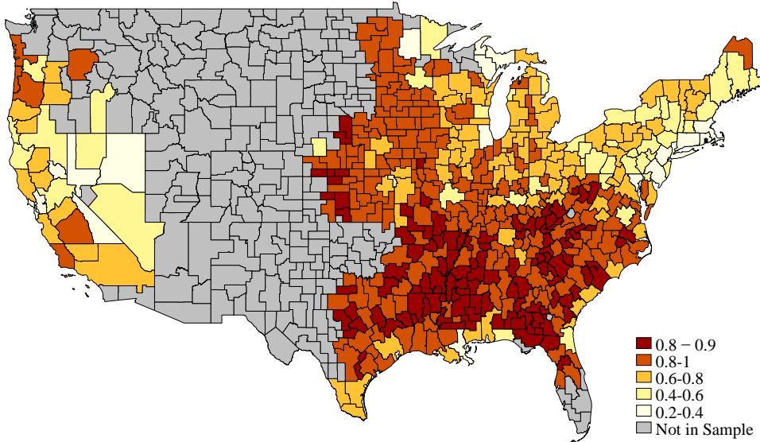  
Notes: The map displays all commuting zones in the United States, shaded by their agricultural employ ment share in 1880. Darker shades indicate higher agricultural specialization. Commuting zones shown in grey are excluded from our sample because their states had not yet joined the Union by 1870.

For each commuting zone, we compute the agricultural employment share as the ratio of agricultural workers to all workers. Figure A.1 shows the agricultural employment share in 1880 across commuting zones.

Finally, for each state, we compute the number of workers born in each other state. The resulting lifetime state-to-state migration matrix allows us to estimate the elasticity of migration flows with respect to distance.

## B.1.2 Census of Manufacturing

Source and Description We obtain county-level tabulations of the Census of Manufacturing for 1880, 1900, and 1920 from the NHGIS database (see Manson et al., 2017). We retain only two variables: total manufacturing payroll and total manufacturing employment.

Sample Selection, Processing, and Use We drop all counties with zero or missing manufacturing payroll or employment. Using the crosswalk from Eckert et al. (2020), we aggregate the county-level data to the commuting zone level. We compute commuting zone-level average wages by dividing total manufacturing payroll by total manufacturing employment. Throughout the paper, we refer to this measure simply as ”average wage” or ”earnings.” In our model, average earnings are identical across sectors, so that the average manufacturing wage in the data corresponds to the average commuting zone wage in the model, $\overline { { w } } _ { r t }$

## B.1.3 Census of Agriculture

Source and Description We obtain county-level tabulations of the Census of Agriculture for 1880, 1900, and 1920 from the NHGIS database (see Manson et al., 2017). We retain the following variables: average land value per acre, acres of agricultural land, total number of farms, number of farms by farm-size bin, and total value of agricultural output.

Sample Selection, Processing, and Use We drop all counties with zero or missing values for average land value per acre. Using the crosswalk from Eckert et al. (2020), we aggregate county-level data to the commuting zone level by computing a land-areaweighted average of land values across all counties within each commuting zone. As a result, the agricultural land value reflects the value of an average acre of agricultural land within a commuting zone. We interpret these data in 1880 as proportional to land rents in the model and use them to identify the supply of agricultural land, $T _ { r }$ Finally, we compute average farm size at the county level by dividing the total number of improved acres by the total number of farms.

## B.1.4 Linked Census Files

Source and Description Economists have developed algorithms to match individuals across sequential Decennial Census waves based on names and other observable characteristics. IPUMS provides a linked file identifying individuals appearing in both the 1880 and 1900 Censuses (see Ruggles et al., 2017). We supplement this with linked files constructed by Abramitzky, Boustan, Eriksson, Rashid, and Perez ´ (2022), which cover various pairs of Census years.

Sample Selection, Processing, and Use Both samples are restricted to men, as surname changes make it difficult to match women over time. We retain only observations who qualify as workers according to our definition applied to the full-count Census files. Using the linked data, we compute the share of workers who move from commuting zone r to commuting zone r⇒ between 1880 and 1900. The resulting “commuting-zoneto-commuting-zone migration matrix” is used to estimate the elasticity of migration flows with respect to distance.

## B.1.5 Historical Statistics of the United States

Source and Description For aggregate time series data, we use the canonical Historical Statistics of the United States (see Carter et al., 2006). We rely on the series for real GDP, the price of farm goods, and the price of all commodities excluding farm goods.

Sample Selection, Processing, and Use Both the GDP and price series provide target moments in our estimation. We interpret the farm goods price series as agricultural prices in the model, and the non-farm commodity price series as manufacturing prices. Our estimation targets the growth rate of real GDP and the change in relative prices between 1880 and 1920.

## B.2 Robustness of Empirical Results in Figure 1

In this section, we show that the patterns documented in Figure 1 are robust to changes in the spatial unit of observation and the inclusion of fixed effects. Table A.1 reports results from three key regressions: (1) log wages on agricultural employment shares in 1880 (Panel A), capturing the urban-rural wage gap; (2) local wage growth on initial agricultural employment shares (Panel B); and (3) changes in agricultural employment shares on initial agricultural employment shares and their square (Panel C).

Column 1 reproduces our baseline results corresponding to Figure 1. Columns 2 and 3 show that the results are robust to including state fixed effects and to unweighted regressions that do not account for employment size. Columns 4 and 5 repeat the analysis at the county level, with state and commuting zone fixed effects, respectively. Across all specifications, we find consistent evidence of spatial convergence: initially poor, agricultural regions experienced faster wage growth than more industrialized areas, and the process of industrialization displayed the same non-monotonic pattern observed in Figure 1.

## B.3 Details on Estimation Moments and Methods

## B.3.1 Local Employment Growth $\{ n _ { r t } \}$

Our theory accounts for local labor force growth solely through interregional migration. Empirically, other factors affecting the size of the local labor force are births, immigration, and deaths, all of which likely differ across commuting zones. These determinants of labor force entry and exit also generate aggregate employment growth. In this section, we show which determinants of local labor force growth vary substantially across commuting zones and how we account for them in our analysis.

Figure A.2 shows proxies for the three most important sources of local employment growth besides internal migration: births, immigration from outside the US, and deaths. The rightmost panel shows the number of children per adult (“birth rates”). We measure local “birth rates” as the fraction of children between 0 and 20 relative to the number of working adults aged 20-60. Rural locations have substantially higher birth rates which drive part of local employment growth.

The middle panel graphs the share of immigrants in the local workforce against a commuting zone’s initial agricultural employment shares. Immigrants are workers that immigrated within the last 20 years from outside the US. Immigrants predominantly settled in urban locations, and thus raised the employment of such manufacturing locations.

The rightmost panel of Figure A.2 provides evidence that - compared to births and immigration - labor force exit rates do not vary systematically across space. If death and retirement rates varied substantially across regions, the fraction of young workers (20-40 years old) in the total workforce should vary a lot, too. However, the figure shows that the fraction of young workers is essentially uncorrelated with the local agricultural employment share. We thus assume that the rate of labor force exit is constant across locations.

Our theory accounts for local labor force growth solely through migration internal to the US. Empirically, however, other forces also affect the local labor force: births,

TABLE A.1: SPATIAL STRUCTURAL CHANGE AND RURAL CATCH-UP

<table><tr><td></td><td>(1)</td><td>(2)</td><td>(3)</td><td>(4)</td><td>(5)</td></tr><tr><td colspan="6">Panel A: Log Average Wages, 1880</td></tr><tr><td> $s_{rAt}$ </td><td>-0.969***(0.042)</td><td>-1.062***(0.052)</td><td>-1.382***(0.072)</td><td>-1.002***(0.027)</td><td>-1.020***(0.035)</td></tr><tr><td>R-squared</td><td>.516</td><td>.804</td><td>.427</td><td>.717</td><td>.796</td></tr><tr><td>Observations</td><td>495</td><td>494</td><td>495</td><td>1,956</td><td>1,899</td></tr><tr><td colspan="6">Panel B: Annual Wage Growth (%), 1880-1920</td></tr><tr><td> $s_{rAt}$ </td><td>1.364***(0.106)</td><td>1.720***(0.179)</td><td>2.095***(0.196)</td><td>1.521***(0.094)</td><td>1.591***(0.129)</td></tr><tr><td>R-squared</td><td>.821</td><td>.85</td><td>.676</td><td>.697</td><td>.725</td></tr><tr><td>Observations</td><td>990</td><td>990</td><td>990</td><td>3,912</td><td>3,912</td></tr><tr><td colspan="6">Panel C: Changes in Agricultural Employment Shares, 1880-1920</td></tr><tr><td> $s_{rAt}$ </td><td>-0.485***(0.028)</td><td>-0.468***(0.034)</td><td>-0.366***(0.062)</td><td>-0.381***(0.016)</td><td>-0.384***(0.021)</td></tr><tr><td> $s^{2}_{rAt}$ </td><td>0.452***(0.032)</td><td>0.430***(0.039)</td><td>0.269***(0.057)</td><td>0.348***(0.019)</td><td>0.359***(0.023)</td></tr><tr><td>R-squared</td><td>.311</td><td>.386</td><td>.104</td><td>.241</td><td>.399</td></tr><tr><td>Observations</td><td>990</td><td>990</td><td>990</td><td>3,912</td><td>3,912</td></tr><tr><td>Geography</td><td>CZ</td><td>CZ</td><td>CZ</td><td>County</td><td>County</td></tr><tr><td>Year FEs (B,C only)</td><td>Yes</td><td>Yes</td><td>Yes</td><td>Yes</td><td>Yes</td></tr><tr><td>Geo. FEs</td><td></td><td>State</td><td></td><td>State</td><td>CZ</td></tr><tr><td>Emp. Weights</td><td>Yes</td><td>Yes</td><td>No</td><td>Yes</td><td>Yes</td></tr></table>

Notes: All regressions in panels B and C are pooled for the two periods 1880-1900 and 1900-1920 and include a fixed effect for each period. Data on wages are from the Census of Manufacturing; all other data are from the full-count US Decennial Census files. Robust standard errors are in parentheses. The variation in sample size across regressions reflects the fact that the fixed-effect regressions drop observations without variation within the fixed-effect category. Connecticut consists of a single commuting zone and 57 commuting zones consist of a single county. The symbols ⇑ , ⇑⇑, and ⇑⇑⇑ denote statistical significance at the 10%, 5% and 1% level, respectively.

immigration from outside the US, and deaths, all vary across commuting zones and contribute to aggregate employment growth. In this section, we document the importance of these forces and describe how we incorporate them into our analysis.

Figure A.2 shows proxies for the three primary drivers of local employment growth beyond internal migration: births, immigration from abroad, and deaths. The left panel plots local birth rates, measured as the ratio of children (ages 0–20) to working adults (ages 20–60). Birth rates were substantially higher in rural areas, contributing to faster local labor force growth in these regions. The middle panel displays the share of recent immigrants—defined as workers aged 20–60 who arrived within the past 20 years—in the local workforce. Immigrants settled predominantly in urban areas, boosting employment growth in more industrialized labor markets. Finally, the right panel shows that labor force exit rates do not vary systematically across space, by plotting the share of young workers among all workers across commuting zones. If mortality or retirement patterns differed across locations, the fraction of young workers (ages 20–40) would vary accordingly. Because the share of young workers is essentially

FIGURE A.2: IMMIGRATION, FERTILITY, AND AGE STRUCTURE ACROSS SPACE

(A) FERTILITY  
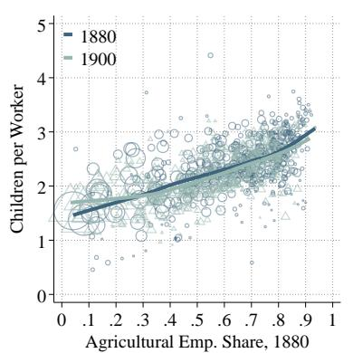

(B) IMMIGRATION  
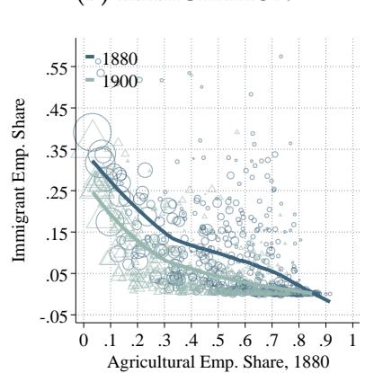

(C) AGE  
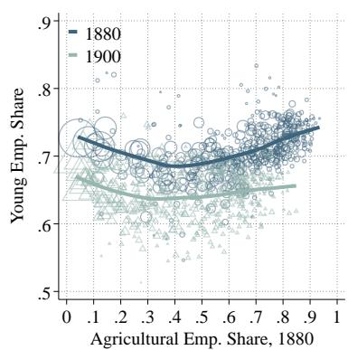  
Notes: The left panel plots a proxy for the local birth rate, measured as the share of children (ages 0–20) relative to working adults (ages 20–60), against the initial agricultural employment share. The middle panel plots the share of immigrants—defined as workers aged 20–60 who immigrated within the past 20 years—in the local workforce against the initial agricultural employment share. The right panel plots the share of young workers (ages 20–40) among all workers (ages $\overset { \bullet } { 2 0 } \mathtt { - }$ –60) in each commuting zone. Workers are defined as individuals with a reported industry identifier. The underlying data source for all panels is the US Decennial Census files for 1880 and 1900. Marker size is proportional to total employment in each region. Each panel displays the fit from a local polynomial regression.

uncorrelated with initial agricultural employment shares, we conclude that labor force exit rates were approximately constant across locations.

We now describe how we estimate the exogenous component of local employment growth $n _ { r t }$ in each region. We denote by $L _ { r t } ^ { Y }$ the number of workers in a location at the beginning of period t, that is before making their moving decisions. $L _ { r t }$ is the number of workers working in region r during period $t ,$ i.e., the mass of workers that chose to move to (or remain in) location r during period t. The local rate of exogenous labor force growth, $n _ { r t , }$ , is thus defined by $L _ { r t + 1 } ^ { Y } \stackrel { } { = } \dot { n } _ { r t } L _ { r t }$ . To calibrate $n _ { r t , }$ note that the following accounting identity describes the law of motion of the total labor force in region r at the beginning of period t:

$$
L _ {r t} ^ {Y} = L _ {r t - 1} - E x i t _ {r t - 1, t} + E n t r y _ {r t - 1, t} = L _ {r t - 1} \left(1 - \frac {E x i t _ {r t - 1 , t}}{L _ {r t - 1}} + \frac {E n t r y _ {r t - 1 , t}}{L _ {r t - 1}}\right),
$$

where $E x i t _ { r t - 1 , t }$ is the number of workers that exit the labor force between periods $t - 1$ and t but do not leave the location to work elsewhere. Similarly, $E n t r y _ { r t - 1 , t }$ is the number of workers entering the labor force between periods $t - 1$ and t that did not immigrate from another domestic region between t 1 and t.

Given our assumption of a constant labor force exit rate across regions, we set the exit rate equal to a common constant, $\delta ,$ so that $\begin{array} { r } { \frac { E x i t _ { r t - 1 , t } } { L _ { r t - 1 } } = \delta } \end{array}$ . The gross rate of local labor force growth prior to workers making their migration decisions is thus given by

$$
n _ {r t - 1} = \frac {L _ {r t} ^ {Y}}{L _ {r t - 1}} = 1 - \delta + \frac {E n t r y _ {r t - 1 , t}}{L _ {r t - 1}}.
$$

Let $C _ { r t }$ denote the number of children in r at time $t - 1$ and $I _ { r t }$ denote the number of working immigrants in location r that arrived between $t - 1$ and t. Since we assume differences in entry rates to be due to differences in fertility rates and immigration only, we relate $C _ { r t }$ and $I _ { r t }$ to $E n t r y _ { r t - 1 , t }$ according to

$$
\frac {E n t r y _ {r t - 1 , t}}{L _ {r t - 1}} = x \times \frac {C _ {r t} + I _ {r t}}{L _ {r t - 1}},
$$

where $x$ is a scalar that reflects measurement error, e.g., some children die, time is not $\mathrm { e . g . , }$ discrete $( \mathrm { i . e . } $ , the 16 year old children enter the labor market earlier than the $5 \mathrm { y r }$ old children), or immigrants might move across locations within the US in-between Census years. Then

$$
n _ {r t - 1} = 1 - \delta + x \times \frac {C _ {r t} + I _ {r t}}{L _ {r t - 1}}.
$$

Note that $C _ { r t } , I _ { r t }$ and $L _ { r t - 1 }$ are observed in the data. Hence, this equation determines $n _ { r t - 1 }$ as a function of the scalars $\delta$ and x.

We determine these scalars in the following way. First, we choose the scalar x to ensure that this accounting equation satisfies the aggregate rate of employment growth in the Census, that is we ensure that the following equation holds in the data:

$$
\text { Total   employment   at } t = \sum_ {r} \left(1 - \delta + x \frac {C _ {r t} + I _ {r t}}{L _ {r t - 1}}\right) L _ {r t - 1}.
$$

Rearranging terms implies that

$$
x = \frac {\text { Total   employment   in } t - (1 - \delta) \text { Total   employment   in } t - 1}{\sum_ {r} \left(C _ {r t} + I _ {r t}\right)}.
$$

Hence, for a given exit rate $\delta ,$ we pick the scale x for the aggregate birth and immigration inflow to account for all employment growth. And then we use this x to calculate - in the model - the number of workers in region r prior to their migration choices as

$$
L _ {r t} ^ {Y} = n _ {r t - 1} L _ {r t - 1} = L _ {r t - 1} (1 - \delta) + x (C _ {r t} + I _ {r t}).
$$

Hence, local labor force growth prior to worker’s migration choices depends on the observable $\left( C _ { r t } + I _ { r t } \right)$ and it has the correct slope for our model to be consistent with aggregate employment growth.

To pick the exit rate $\delta ,$ note that the fraction of old workers at time t is given by

$$
\text { Share   of   old   workers } _ {t} = \frac {(1 - \delta) \sum_ {r} L _ {r t - 1}}{\sum_ {r} L _ {r t} ^ {Y}} = (1 - \delta) \frac {\sum_ {r} L _ {r t - 1}}{\sum_ {r} L _ {r t}}.\tag{A.28}
$$

Because $\frac { \sum _ { r } L _ { r t - 1 } } { \sum _ { r } L _ { r t } }$ is simply the ratio of the total labor force at t 1 divided by the total labor force at $t ,$ which are both observed, we can calculate δ for any target of the share of old workers. A generation in our model corresponds to 20 years in the data. In calibrating $\delta ,$ we think of 0-20 year olds as not working, of 20-40 year olds as “young” workers, and of $^ { \prime \prime } 4 0 – 6 0 ^ { \prime \prime }$ year olds as “old workers.” The share of old workers in our data is 0.34, 0.35 and 0.37 in 1880, 1900, and 1920, respectively. Because, empirically, some people above 60 are still in the workforce, we take a number of 0.45. Together with a rate of employment growth of about 35% observed in the data (at the 20 year horizon), equation (A.28) implies that δ is given by $1 - 0 . 4 5 \times 1 . 3 5 = 0 . 4$

In Figure A.3, we show the calibrated exogenous rate of employment growth, $n _ { r t . }$ for the two time periods 1880-1900 and 1900-1920. The figure shows that, on net, exogenous employment growth was slightly higher in agricultural regions. The relationship between agricultural specialization and subsequent exogenous employment growth weakens somewhat over these periods suggesting employment growth became somewhat more balanced as fertility rates in more rural regions started to decline.

## FIGURE A.3: EXOGENOUS EMPLOYMENT GROWTH

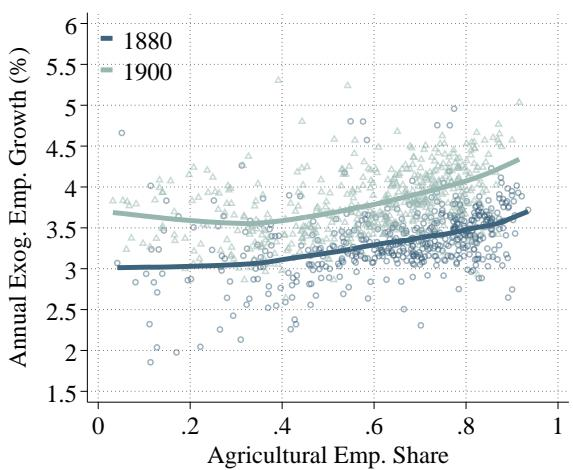  
Notes: The figure plots the calibrated annualized rate of exogenous employment growth across commuting zones between 1880–1900 and 1900–1920. For clarity, we omit one region in each period with a growth rate exceeding 3 to better display the variation among the remaining observations.

## B.3.2 Migration Gravity Equations

In this section, we describe our estimation of the distance elasticity of migration costs, 8. In the model, the mass of workers migrating from region r to region j between two periods is given by:

$$
M _ {r j t} = m _ {r j t} L _ {r t} ^ {Y} = \frac {\left(\mu_ {r j} \mathcal {V} _ {j t} \mathcal {B} _ {j t}\right) ^ {\varepsilon}}{\sum_ {j} \left(\mu_ {r k} \mathcal {V} _ {k t} \mathcal {B} _ {k t}\right) ^ {\varepsilon}} L _ {r t - 1} n _ {r t - 1}.
$$

We project the moving cost between two regions on the physical distance between them, that is we set $\mu _ { r j } = d _ { r j } ^ { - \varpi }$ , where the parameter 8 parameterizes the distance cost of migration. The larger $\varpi ,$ the more the destination utility of areas further away is discounted. In our empirical estimation, we set $d _ { r r }$ for all r to the average distance between county centroids within commuting zone $r ,$ , and $d _ { r j }$ for all regions $r \neq j$ to the distance between commuting zone centroids.

Taking logs on both sides and grouping terms then yields:

$$
\ln M _ {r j t} = \alpha_ {j t} + \beta_ {r t} - \varpi \epsilon \ln d _ {r j}\tag{A.29}
$$

where $\alpha _ { j t } = \varepsilon \ln ( \gamma _ { j t } B _ { j t } )$ and $\begin{array} { r } { \beta _ { r t } = \ln ( L _ { r t - 1 } n _ { r t - 1 } ) - \ln \left( \sum _ { k } \left( d _ { r k } ^ { - \infty } \mathcal { V } _ { k t } \mathcal { B } _ { k t } \right) ^ { \varepsilon } \right) } \end{array}$

Equation (A.29) suggests a fixed effect regression of commuting zone migration flows to recover the elasticity of migration flows to distance, 89, relevant in our model.

The Decennial Census files do not contain information on workers’ migration history at the commuting zone or county level. Hence, it is impossible to directly construct crosscommuting zone migration flows. We therefore rely on information from the linked Census files described in our data section above. We estimate equation (A.29) using Poisson Pseudo Maximum Likelihood (PPML), as proposed by Silva and Tenreyro (2006) because the migration matrix across commuting zones contains many zeros. More specifically, we estimate the following equation using PPML:

$$
M _ {r j t} = \exp \left(\alpha_ {j t} + \beta_ {r t} - \varpi \epsilon \ln d _ {r j}\right) + \epsilon_ {r j t}.\tag{A.30}
$$

Columns (1) and (2) in Table A.2 report the estimates based on two different linked-Census files by Ruggles et al. (2015) (“IPUMS”) and Abramitzky, Boustan, Eriksson, Feigenbaum, and Perez´ (2021) (“ABE”). These files differ slightly in their technique to link individuals across census years. Reassuringly, both produce similar estimates: we estimate an elasticity of migration flows with respect to geographic distance (8ε) of around 2.75, which we use in our baseline calibration.

TABLE A.2: MIGRATION GRAVITY REGRESSIONS

<table><tr><td></td><td>(1)</td><td>(2)</td><td>(3)</td><td>(4)</td><td>(5)</td></tr><tr><td>Log Distance</td><td>-2.922***(0.033)</td><td>-2.632***(0.011)</td><td>-3.925***(0.057)</td><td>-2.262***(0.031)</td><td>-2.291***(0.031)</td></tr><tr><td>Geography</td><td>CZ</td><td>CZ</td><td>State</td><td>State</td><td>State</td></tr><tr><td>Fixed Effects</td><td>O-D</td><td>O-D</td><td>O-D, Year</td><td>O-D, Year</td><td>O-D, Year</td></tr><tr><td>Pseudo R-squared</td><td>.814</td><td>.899</td><td>.93</td><td></td><td></td></tr><tr><td>R-squared</td><td></td><td></td><td></td><td>.81</td><td>.802</td></tr><tr><td>Observations</td><td>254,762</td><td>349,230</td><td>3,983</td><td>3,983</td><td>3,935</td></tr></table>

Notes: All regressions contain origin and destination fixed effects. (1) PPML with census data from IPUMS linked by IPUMS. (2) PPML with census data from IPUMS linked by Abramitzky Boustan Eriksson. (3) PPML in state flow data from IPUMS, pooled across all years. (4) OLS regression in state flow data from IPUMS adding a 1 to all flows, pooled across all years. (5) OLS regression in state flow data from IPUMS dropping zero flow observations, pooled across all years. Note the linked data is only available for one cross-section: 1880-1900. For the regressions using state data we pool data on lifetime migration between 1880-1900 and 1900-1920 and add year fixed effects into the regressions.

Linking data across census years requires a set of assumptions and large amounts of data processing. For robustness, we therefore repeat the estimation on a different data set that we can directly compute from the cross-sectional Census data but that only contains state-to-state flows. In particular, as discussed in the data section above, we use the information on the state of birth of each worker contained in the Decennial Census files to construct a matrix of lifetime state-to-state migration flows for all workers between 20 and 40. Column 3 of Table A.2 presents the PPML estimates of the distance elasticity in the state-to-state data. The coefficient on log distance is more negative than when using the commuting zone data highlighting that there are, by construction, less flows across states than across commuting zones making distance appear as a larger impediment of migration.

The state-to-state migration matrix contains relatively few pairs of states with zero flows between them. Across the two cross-sections (1880–1900 and 1900–1920), only about 50 state pairs exhibit zero flows. As a result, we can estimate the gravity regression using simple OLS instead of PPML. Columns 4 and 5 of Table $\mathrm { A } . 2$ report results from two alternative specifications: one that replaces zero flows with ones (Column 4) and one that omits state pairs with no migration flows (Column 5).

It is important to note that our theory only approximately delivers a gravity equation at the state level. Because of Jensen’s inequality, the distance elasticities estimated from aggregated state-level flows do not map exactly into the structural parameter 8ε. Nevertheless, it is reassuring that the estimates from state-level regressions are similar to those based on commuting zone flows. Moreover, since a fraction of moves in the model occur across commuting zones within the same state, we would expect the state-level distance elasticities to be larger than their commuting zone counterparts in model-generated data as well.

## B.3.3 Local fundamentals in 1880: $\left[ A _ { r 1 8 8 0 } , Z _ { r 1 8 8 0 } , B _ { r 1 8 8 0 } , T _ { r 1 8 8 0 } \right]$

Table A.3 shows the relationship between the inferred regional fundamentals and agricultural employment shares in 1880. Specifically, we run a set of cross-sectional regressions of srA1880 against the estimated fundamentals and population density in 1880. In 1880, agricultural regions had both low agricultural productivity, $A _ { r 1 8 8 0 . }$ , and low manufacturing productivity, $Z _ { r 1 8 8 0 }$ . Agricultural specialization was therefore a reflection of a comparative advantage in agriculture but not of an absolute advantage. Columns 3 and 4 show that more agricultural areas had a higher relative productivity in the agricultural sector and fewer workers per unit of agricultural land $\ell _ { r } = L _ { r } / T _ { r }$ This pattern is implied by the fact that, empirically, agricultural land rents in rural regions were relatively low in 1880. Table A.3 also shows that more agricultural regions had slightly higher amenities in 1880.

## B.3.4 Estimation of $\zeta$

In this section, we report the results from estimating regression (28), using data on the distribution of farm sizes within each commuting zone from the Census of Agriculture. The data report the share of farms with less than 3, 10, 20, 50, 100, 500, and 1000 hectares. Table A.4 summarizes the estimation results.

Columns 1 and 2 of Table A.4 pool data across commuting zones and decades (1880, 1900, and 1920), including a full set of region-year fixed effects. For the full sample of farms, we estimate a value of $\zeta$ around 1.4. In Column 2, we restrict the sample to farms with at least 10 hectares in order to focus on full-time farmers, excluding smaller part-time operations. This restriction yields an estimate of $\zeta$ around 1.6.

Columns 3 through 5 report results separately by decade. The decade-specific estimates are very similar to the pooled estimate in Column 2, suggesting that the distribution of farm sizes was stable over time. Based on these results, we set $\zeta = 1 . 6$ in our baseline calibration.

TABLE A.3: DETERMINANTS OF AGRICULTURAL SPECIALIZATION

<table><tr><td></td><td>(1)</td><td>(2)</td><td>(3)</td><td>(4)</td><td>(5)</td><td>(6)</td></tr><tr><td> $\log A_{r1880}$ </td><td>-0.197***(0.016)</td><td></td><td></td><td></td><td></td><td></td></tr><tr><td> $\log Z_{r1880}$ </td><td></td><td>-0.208***(0.007)</td><td></td><td></td><td></td><td>-0.032***(0.006)</td></tr><tr><td> $\log A_{r1880}/Z_{r1880}$ </td><td></td><td></td><td>0.255***(0.010)</td><td></td><td></td><td>0.208***(0.009)</td></tr><tr><td> $\log \ell_{r1880}$ </td><td></td><td></td><td></td><td>-0.131***(0.006)</td><td></td><td>-0.116***(0.004)</td></tr><tr><td> $\log B_{r1880}$ </td><td></td><td></td><td></td><td></td><td>0.060***(0.013)</td><td>-0.007***(0.002)</td></tr><tr><td>R-squared</td><td>.275</td><td>.724</td><td>.53</td><td>.491</td><td>.0555</td><td>.972</td></tr><tr><td>Observations</td><td>495</td><td>495</td><td>495</td><td>495</td><td>495</td><td>495</td></tr></table>

Notes: The table reports the results of a set of bivariate regressions $s _ { r A 1 8 8 0 } = \alpha + \beta x _ { r } + u _ { r } ,$ where $x _ { r } =$ ln $Z _ { r A 1 8 8 0 }$ (column 1) $, x _ { r } = \ln Z _ { r M 1 8 8 0 }$ (Column 2), $x _ { r } = \ln ( Z _ { r A 1 8 8 0 } / Z _ { r M 1 8 8 0 } )$ (Column 3), $x _ { r } = \ln \ell _ { r 1 8 8 0 }$ (Column 4) and $x _ { r } = \ln B _ { r 1 8 8 0 }$ (Column 5). Robust standard errors are in parentheses. The symbols ⇑ , \*\* and ⇑⇑⇑ denote statistical significance at the 10%, 5% and 1% level, respectively.

TABLE A.4: ESTIMATING ζ

<table><tr><td></td><td>(1)</td><td>(2)</td><td>(3)</td><td>(4)</td><td>(5)</td></tr><tr><td>Log Relative Farmsize</td><td>-1.405***(0.012)</td><td>-1.650***(0.015)</td><td>-1.581***(0.022)</td><td>-1.649***(0.023)</td><td>-1.688***(0.029)</td></tr><tr><td>Fixed Effects</td><td>CZ-Year</td><td>CZ-Year</td><td>CZ</td><td>CZ</td><td>CZ</td></tr><tr><td>Minimum Farm Size</td><td>-</td><td>10</td><td>10</td><td>10</td><td>10</td></tr><tr><td>Emp. weights</td><td>Yes</td><td>Yes</td><td>Yes</td><td>Yes</td><td>Yes</td></tr><tr><td>Sample</td><td>1880-1920</td><td>1880-1920</td><td>1880</td><td>1900</td><td>1920</td></tr><tr><td>R-squared</td><td>.866</td><td>.896</td><td>.894</td><td>.897</td><td>.897</td></tr><tr><td>Observations</td><td>10,259</td><td>8,860</td><td>2,929</td><td>2,969</td><td>2,962</td></tr></table>

Notes: The table reports the results from estimating equation (28) using data on the farm size distribution from the Census of Agriculture. Standard errors are clustered at the region-year level, and all regressions are weighted by local population. Columns 1 and 2 pool data across 1880, 1900, and 1920; Columns 3 to 5 report separate estimates by decade. Columns 2 to 5 restrict the sample to farms with at least 10 hectares.

## B.3.5 Aggregating Trade Costs to CZs

To construct trade cost matrices between commuting zones, we draw on the data from Hornbeck and Rotemberg (2024), who digitize information on the US transportation network by decade from 1830 to 1920. Their dataset, “NSFtranspCost.dta” in their replication package, contains county-to-county transportation cost estimates based on the existing infrastructure in each decade. All county definitions are held fixed at 1890 boundaries, allowing for consistent comparison over time.

Transportation costs are reported in dollars per ton of goods shipped and are calculated using centroid-to-centroid distances, where intra-county costs are set to zero. We follow Hornbeck and Rotemberg (2024), in converting these figures to unit-less ad-valorem cost parameters by assuming an average value of \$35 per ton of agricultural goods in 1890. Specifically, for each origin-destination pair, we compute trade costs as

$$
\tau_ {o d} = 1 + \frac {t _ {o d}}{3 5},\tag{A.31}
$$

where $t _ { o d }$ is the reported cost per ton from county o to county d. This yields an origindestination matrix of bilateral trade cost shifters at the county level.

To construct trade costs between commuting zones (CZs), we use the crosswalk provided by Eckert et al. (2020) from 1890 county boundaries to CZs. The resulting CZ-by-CZ trade cost matrices allow us to track the evolution of bilateral market access over time in our spatial model.

## B.3.6 Agricultural Productivity Growth: Direct Evidence from the Agricultural Census

To provide direct evidence on the relationship between agricultural productivity and initial agricultural specialization, we use data from the Census of Agriculture to compute agricultural productivity growth based on observed land yields. We define average agricultural productivity in region r at time t as the total value of agricultural output per acre of agricultural land. The left panel of Figure A.4 shows that agricultural productivity was substantially lower in more agricultural regions in 1880, consistent with the findings from our model-inversion exercise in the body of the paper. The right panel shows that these initially less productive regions subsequently experienced faster agricultural productivity growth, providing direct evidence of catch-up dynamics.

## B.3.7 Human Capital or Productivity?

Our baseline model abstracts from regional differences in human capital. In this section, we extend the model to allow for variation in human capital across regions and sectors, and develop a strategy to separately identify the effects of human capital and physical productivity on wage growth and industrialization.

Extending the Model Suppose the sector-specific human capital distribution in region r at time t is given by $\begin{array} { r } { F _ { r s t } \left( z \right) = \exp \left( - \left( \frac { z } { h _ { r t } ^ { s } } \right) ^ { - \zeta } \right) } \end{array}$ , where $h _ { r t } ^ { s }$ parametrizes the level of human capital for sector $s \in A , M .$ . Our baseline model corresponds to the special case

(A) INITIAL BACKWARDNESS, 1880  
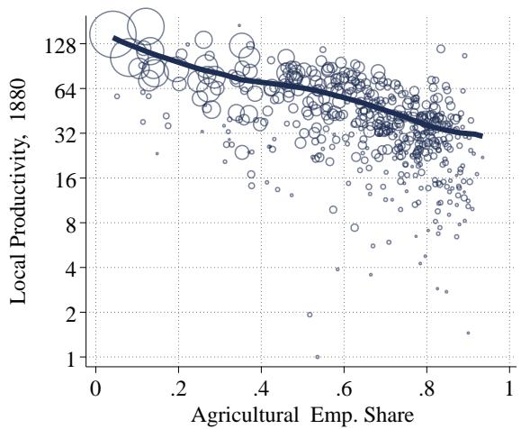

(B) PRODUCTIVITY GROWTH, 1880-1920  
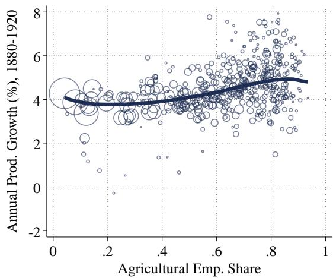  
Notes: In the left (right) panel we show the correlation between log agricultural output per acre (the growth rate of agricultural output per acre) against the agricultural employment share.

where $h _ { r t } ^ { s } = 1$

In this generalized setting, average earnings in region r satisfy:

$$
\overline {{w}} _ {r t} = \left(\left(h _ {r t} ^ {A} \overline {{\chi}} _ {r t}\right) ^ {\zeta} + \left(h _ {r t} ^ {M} w _ {r M t}\right) ^ {\zeta}\right) ^ {1 / \zeta}.\tag{A.32}
$$

The agricultural employment share and the human-capital-adjusted agricultural labor supply are:

$$
s _ {r A} = \left(\frac {h _ {r t} ^ {A} \overline {{\chi}} _ {r t}}{\overline {{w}} _ {r t}}\right) ^ {\zeta} \quad \text {and} \quad H _ {r A t} = \Gamma_ {\zeta} L _ {r} h _ {r t} ^ {A} s _ {r A} ^ {\frac {\zeta - 1}{\zeta}} = \Gamma_ {\zeta} L _ {r} h _ {r t} ^ {A} \left(\frac {h _ {r t} ^ {A} \overline {{\chi}} _ {r t}}{\overline {{w}} _ {r t}}\right) ^ {\zeta - 1}.\tag{A.33}
$$

Manufacturing wages are still given by $\begin{array} { r } { w _ { r M t } = \left( \frac { 1 } { \tilde { f } _ { E } } \right) ^ { 1 / \sigma _ { M } } Z _ { r t } ^ { ( \sigma _ { M } - 1 ) / \sigma _ { M } } \mathcal { D } _ { r M t } ^ { 1 / \sigma _ { M } } \equiv \mathcal { Z } _ { r t } , } \end{array}$ , so that

$$
h _ {r t} ^ {M} w _ {r M t} = h _ {r t} ^ {M} \mathcal {Z} _ {r t} \equiv \mathcal {Z} _ {r t} ^ {H C}.\tag{A.34}
$$

Similarly, agricultural profitability $\overline { { \chi } } _ { r t }$ satisfies

$$
\overline {{\chi}} _ {r t} = \left(\frac {1 - \alpha}{\gamma + 1 - \alpha}\right) ^ {(1 - \alpha) \frac {\sigma_ {A} - 1}{\sigma_ {A}}} (\mathcal {D} _ {r A t} ^ {\frac {1}{\sigma_ {A} - 1}} A _ {r t}) ^ {\frac {\sigma_ {A} - 1}{\sigma_ {A}}} \overline {{T}} _ {r} ^ {\alpha \frac {\sigma_ {A} - 1}{\sigma_ {A}}} H _ {r A t} ^ {- (\alpha + \frac {1}{\sigma_ {A} - 1}) \frac {\sigma_ {A} - 1}{\sigma_ {A}}}.
$$

Using the expression in equation (OA.11) yields

$$
\begin{array}{r c l} h _ {r t} ^ {A} \overline {{\chi}} _ {r t} & = & h _ {r t} ^ {A} \left(\frac {1 - \alpha}{\gamma + 1 - \alpha}\right) ^ {(1 - \alpha) \frac {\sigma_ {A} - 1}{\sigma_ {A}}} (\mathcal {D} _ {r A t} ^ {\frac {1}{\sigma_ {A} - 1}} A _ {r t}) ^ {\frac {\sigma_ {A} - 1}{\sigma_ {A}}} \overline {{T}} _ {r} ^ {\alpha \frac {\sigma_ {A} - 1}{\sigma_ {A}}} \left(\Gamma_ {\zeta} L _ {r} h _ {r t} ^ {A}\right) ^ {- \left(\alpha + \frac {1}{\sigma_ {A} - 1}\right) \frac {\sigma_ {A} - 1}{\sigma_ {A}}} \\ & & \times \left(\frac {h _ {r t} ^ {A} \overline {{\chi}} _ {r t}}{\overline {{w}} _ {r t}}\right) ^ {- \left(\alpha + \frac {1}{\sigma_ {A} - 1}\right) \frac {\sigma_ {A} - 1}{\sigma_ {A}} (\zeta - 1)}. \end{array}
$$

Defining

$$
\mathcal {A} _ {r t} ^ {H C} \equiv \left[ \left(h _ {r t} ^ {A}\right) ^ {1 - \alpha} \left(\frac {1 - \alpha}{\gamma + 1 - \alpha}\right) ^ {1 - \alpha} \mathcal {D} _ {r A t} ^ {\frac {1}{\sigma_ {A} - 1}} A _ {r t} \overline {{T}} _ {r} ^ {\alpha} \left(\Gamma_ {\zeta} L _ {r}\right) ^ {- \left(\alpha + \frac {1}{\sigma_ {A} - 1}\right)} \right] ^ {\frac {\sigma_ {A} - 1}{\sigma_ {A}}}\tag{A.35}
$$

yields

$$
\frac {h _ {r t} ^ {A} \overline {{\chi}} _ {r t}}{\overline {{w}} _ {r t}} = \left(\frac {\mathcal {A} _ {r t} ^ {H C}}{\overline {{w}} _ {r t}}\right) ^ {\frac {1}{\kappa}}.\tag{A.36}
$$

where $\begin{array} { r } { \kappa = \zeta - \left( \zeta - 1 \right) \left( 1 - \alpha \right) \frac { \sigma _ { A } - 1 } { \sigma _ { A } } } \end{array}$ . Equations (OA.10), (OA.12), and (OA.14) imply that average earnings $\overline { { w } } _ { r t }$ are given by

$$
1 = \left(\frac {h _ {r t} ^ {A} \overline {{\chi}} _ {r t}}{\overline {{w}} _ {r t}}\right) ^ {\zeta} + \left(\frac {h _ {r t} ^ {M} w _ {r M t}}{\overline {{w}} _ {r t}}\right) ^ {\zeta} = \left(\left(\frac {\mathcal {A} _ {r t} ^ {H C}}{\overline {{w}} _ {r t}}\right) ^ {\frac {1}{\kappa}}\right) ^ {\zeta} + \left(\frac {\mathcal {Z} _ {r t} ^ {H C}}{\overline {{w}} _ {r t}}\right) ^ {\zeta}.\tag{A.37}
$$

Similarly, note that

$$
h _ {r t} ^ {A} \overline {{\chi}} _ {r t} = \mathcal {A} _ {r t} ^ {H C} \left(\frac {h _ {r t} ^ {A} \overline {{\chi}} _ {r t}}{\overline {{w}} _ {r t}}\right) ^ {- \left(\alpha + \frac {1}{\sigma_ {A} - 1}\right) \frac {\sigma_ {A} - 1}{\sigma_ {A}} (\zeta - 1)} = \mathcal {A} _ {r t} ^ {H C} \left(\frac {h _ {r t} ^ {A} \overline {{\chi}} _ {r t}}{\overline {{w}} _ {r t}}\right) ^ {- (\kappa - 1)} = \mathcal {A} _ {r t} ^ {H C} s _ {r A t} ^ {- \frac {\kappa - 1}{\zeta}},
$$

where the last equality uses (OA.11). Hence, $\begin{array} { r } { \frac { s _ { r A } } { 1 - s _ { r A } } = \Big ( \frac { h _ { r t } ^ { A } \overline { { \chi } } _ { r t } } { h _ { r t } ^ { M } w _ { r M t } } \Big ) ^ { \zeta } = \Big ( \frac { A _ { r t } ^ { H C } } { \mathcal { Z } _ { r t } ^ { H C } } \Big ) ^ { \zeta } s _ { r A } ^ { - ( \kappa - 1 ) } } \end{array}$ , so that

$$
\frac {s _ {r A} ^ {\kappa}}{1 - s _ {r A}} = \left(\frac {\mathcal {A} _ {r t} ^ {H C}}{\mathcal {Z} _ {r t} ^ {H C}}\right) ^ {\zeta}.\tag{A.38}
$$

Given the human capital adjusted revenue productivity terms $\mathcal { A } _ { r t } ^ { H C }$ and $\mathcal { Z } _ { r t } ^ { H C }$ , equations (OA.15) and (OA.16) are the same equations as in Proposition 3.

Implications We establish the following result in our extended model with human capital differences across regions and sectors:

Proposition 5. Consider the model with human capital and let $\bar { Z } _ { r t }$ and $\bar { A } _ { r t }$ denote productivity in both sectors. The equilibrium allocations in this model are the same as the ones in our baseline model without human capital if we redefine, in our baseline model,

$$
Z _ {r t} ^ {B a s e} \equiv (h _ {r t} ^ {M}) ^ {\frac {\sigma_ {M}}{\sigma_ {M} - 1}} \bar {Z} _ {r t} \quad a n d \quad A _ {r t} ^ {B a s e} = \left(h _ {r t} ^ {A}\right) ^ {1 - \alpha} \bar {A} _ {r t}.
$$

Proof. Given data on $s _ { r A }$ and $\overline { { w } } _ { r } ,$ , we can uniquely solve for $\mathcal { A } _ { r t } ^ { H C }$ and $\mathcal { Z } _ { r t } ^ { H C }$ . We now show that given these data and the other structural parameters there is a one-to-one mapping between $\mathcal { A } _ { r t } ^ { H C }$ and $\mathcal { Z } _ { r t } ^ { H C }$ and $Z _ { r t } ^ { B a s e }$ and $A _ { r t } ^ { \hat { B a s e } }$ . The fact that $Z _ { r t } ^ { B a s e } \equiv h _ { r t } ^ { M } \bar { Z } _ { r t }$ follows immediately from (OA.12), which implies that

$$
\begin{array}{r c l} \mathcal {Z} _ {r t} ^ {H C} = h _ {r t} ^ {M} \mathcal {Z} _ {r t} & = & h _ {r t} ^ {M} \left(\frac {1}{\tilde {f} _ {E}}\right) ^ {1 / \sigma_ {M}} (\bar {Z} _ {r t}) ^ {(\sigma_ {M} - 1) / \sigma_ {M}} \mathcal {D} _ {r M t} ^ {1 / \sigma_ {M}} \\ & = & \left(\frac {1}{\tilde {f} _ {E}}\right) ^ {1 / \sigma_ {M}} \left(Z _ {r t} ^ {B a s e}\right) ^ {(\sigma_ {M} - 1) / \sigma_ {M}} \mathcal {D} _ {r M t} ^ {1 / \sigma_ {M}}. \end{array}
$$

To derive the expression for $A _ { r t } ^ { B a s e }$ note that (see equation OA.13)

$$
\begin{array}{r c l} \mathcal {A} _ {r t} ^ {H C} & = & \left[ \left(h _ {r t} ^ {A}\right) ^ {1 - \alpha} \left(\frac {1 - \alpha}{\gamma + 1 - \alpha}\right) ^ {1 - \alpha} \mathcal {D} _ {r A t} ^ {\frac {1}{\sigma_ {A} - 1}} \bar {A} _ {r t} \overline {{T}} _ {r} ^ {\alpha} \left(\Gamma_ {\zeta} L _ {r}\right) ^ {- \left(\alpha + \frac {1}{\sigma_ {A} - 1}\right)} \right] ^ {\frac {\sigma_ {A} - 1}{\sigma_ {A}}} \\ & = & \left[ \left(\frac {1 - \alpha}{\gamma + 1 - \alpha}\right) ^ {1 - \alpha} \mathcal {D} _ {r A t} ^ {\frac {1}{\sigma_ {A} - 1}} A _ {r t} ^ {B a s e} \overline {{T}} _ {r} ^ {\alpha} \left(\Gamma_ {\zeta} L _ {r}\right) ^ {- \left(\alpha + \frac {1}{\sigma_ {A} - 1}\right)} \right] ^ {\frac {\sigma_ {A} - 1}{\sigma_ {A}}}. \end{array}
$$

Furthermore, it can be shown that $\mathcal { D } _ { r A t }$ and $\mathcal { D } _ { \boldsymbol { r } M t }$ also only depend on $A _ { r t } ^ { B a s e }$ and $Z _ { r t } ^ { B a s e }$ conditional on the data $s _ { r A }$ and $\overline { { w } } _ { r }$ and the other structural parameters. □

Proposition 5 highlights that differences in human capital, across sectors and regions, are isomorphic to differences in productivity.26 This result highlights two concerns for our empirical analysis. First, the initial rural productivity disadvantage we observe in 1880 could, in principle, reflect lower human capital rather than lower physical productivity. Second, the faster growth we estimate for rural regions could be driven by improvements in education rather than by the diffusion of technology.

While both interpretations are consistent with rural convergence, they differ importantly in mechanism and policy implications. If convergence stems from human capital accumulation, it would suggest a central role for public investment in education. If, instead, it reflects physical productivity catch-up, it points to technology diffusion and access to innovation as primary drivers.

Linking Human Capital to Observables To quantify the potential role of human capital, we link human capital levels to observed measures of schooling. Specifically, we model

$$
h _ {r t} ^ {M} = e ^ {\gamma_ {M} s c h _ {r t}} \quad \mathrm{and} \quad h _ {r t} ^ {A} = e ^ {\gamma_ {A} s c h _ {r t}},\tag{A.39}
$$

where $s c h _ { r t }$ denotes the average years of schooling in region r at time t.

A key challenge in our setting is that the US Census does not report educational attainment before 1940. We therefore exploit the fact that education is decided when people are young and look at different cohorts in 1940 to learn about the educational distribution in the past. We measure the average years of schooling in region r in 1900

and 1920 as

$$
s c h _ {r 1 9 2 0} = \frac {1}{N _ {r 1 9 4 0} ^ {4 0 - 6 0}} \sum_ {a = 4 0} ^ {6 0} s c h _ {r 1 9 4 0} (a) \quad \text {and} \quad s c h _ {r 1 9 0 0} = \frac {1}{N _ {r 1 9 4 0} ^ {6 0 - 8 0}} \sum_ {a = 6 0} ^ {8 0} s c h _ {r 1 9 4 0} (a),
$$

where $N _ { r 1 9 4 0 } ^ { 4 0 - 6 0 } \left( N _ { r 1 9 4 0 } ^ { 6 0 - 8 0 } \right)$ denotes the number of people in region r in the 1940 Census between 40 and 60 years old (60 and 80 years old).27 Our approach assumes that old-age migration is limited, and thus that elderly residents reflect the human capital of the locations where they spent most of their working lives.

Note that the case of $\gamma _ { A } = \gamma _ { M } = \gamma$ is the case of sector neutral human capital: each year of schooling raises human capital in both sectors by $\gamma .$ . The case of $\gamma _ { A } = 0$ is the case where schooling does not raise the efficiency for agricultural work, that is as in Porzio et al. (2022) educational growth shifts labor supply toward manufacturing. For given $\gamma _ { M }$ and $\gamma _ { A }$ and measures of $s c h _ { r } ,$ we can directly compute $h _ { r t } ^ { s }$ and hence identify $\bar { A } _ { r t }$ and $\bar { Z } _ { r t }$ given our accounting solution $Z _ { r t } ^ { B a s e }$ and $A _ { r t } ^ { B a s e }$ . We can then directly measure physical productivity and compute its growth rate once human capital differences have been taken into account. We now explain how we measure $s c h _ { r }$ and how we estimate $\gamma _ { s }$

Estimating the Returns to Education To recover the returns $\gamma _ { M }$ and $\gamma _ { A }$ , we use cross-sectional variation across educational groups within regions.

The model implies that the agricultural employment share among workers with education level j satisfies:

$$
\ln \left(\frac {s _ {r A 1 9 4 0} ^ {j}}{1 - s _ {r A 1 9 4 0} ^ {j}}\right) = \delta_ {r} - \zeta (\gamma_ {M} - \gamma_ {A}) s c h _ {r 1 9 4 0} ^ {j} + u _ {r} ^ {j}.\tag{A.40}
$$

where $\delta _ { r }$ captures region fixed effects that control for unobserved skill prices $w _ { r M 1 9 4 0 }$ and $\overline { { \xi } } _ { \boldsymbol { r } 1 9 4 0 }$ . A steeper negative slope indicates that returns to education are larger in manufacturing than in agriculture.

According to equation $\mathrm { ( A . 4 0 ) }$ , we infer that educational returns are low in agriculture, that is, $\gamma _ { M } > \gamma _ { A } ,$ , if people with higher human capital are systematically less likely to work in agriculture.

The model implies a second estimating equation to isolate $\gamma _ { M } \mathbf { \mathbf { \cdot } }$ :

$$
\ln \overline {{w}} _ {r 1 9 4 0} ^ {j} = \delta_ {r} + \gamma_ {M} s c h _ {r 1 9 4 0} ^ {j} - \frac {1}{\zeta} \ln s _ {r M 1 9 4 0} ^ {j} + u _ {r} ^ {j}.\tag{A.41}
$$

Equation (A.41) looks exactly like a Mincer regression with a human capital return $\gamma _ { M } ,$ except that we need to control for the manufacturing share to control for unobserved selection. To estimate ${ \gamma } _ { M } ,$ we exploit data on earnings observed in the 1940 Census.

Results In Table $\mathrm { A . } 5 ,$ we report the results of estimating equations (A.40) and (A.41). Column 1 presents the estimates from equation (A.40). The estimated coefficient of -0.15 corresponds to $\zeta ( \gamma _ { M } - \gamma _ { A } )$ . Given our prior estimate of $\zeta = 1 . 6$ , this implies $\gamma _ { M } - \gamma _ { A } = 0 . 1 5 / 1 . 6 \approx 0 . 0 9 4$ , suggesting that returns to education are substantially higher in the manufacturing sector than in agriculture.

Column 2 reports the estimate from equation (A.41), yielding $\gamma _ { M } = 0 . 1$ . Taken together, these results imply that $\gamma _ { A } = 0 . 1 - 0 . 0 9 4 \approx 0 .$ , indicating that human capital has essentially no effect on earnings in the agricultural sector.

Columns 4 and 5 replicate the analysis, weighting each observation by total employment in the commuting zone. The point estimates are very similar, confirming the robustness of our results to alternative weighting schemes.

TABLE A.5: ESTIMATING THE RETURN TO EDUCATION

<table><tr><td></td><td>(1)</td><td>(2)</td><td>(3)</td><td>(4)</td><td>(5)</td><td>(6)</td></tr><tr><td>Years of Education</td><td>-0.150***(0.001)</td><td>0.102***(0.001)</td><td>0.016***(0.001)</td><td>-0.132***(0.004)</td><td>0.092***(0.002)</td><td>0.003(0.003)</td></tr><tr><td>Cty FEs</td><td>Yes</td><td>Yes</td><td>Yes</td><td>Yes</td><td>Yes</td><td>Yes</td></tr><tr><td>Cty Emp. Weights</td><td>No</td><td>No</td><td>No</td><td>Yes</td><td>Yes</td><td>Yes</td></tr><tr><td>Std. Err Cluster</td><td>Cty</td><td>Cty</td><td>Cty</td><td>Cty</td><td>Cty</td><td>Cty</td></tr><tr><td>R-squared</td><td>.702</td><td>.557</td><td>.406</td><td>.874</td><td>.746</td><td>.738</td></tr><tr><td>Observations</td><td>42,969</td><td>42,969</td><td>42,969</td><td>42,969</td><td>42,969</td><td>42,969</td></tr></table>

Notes: The table shows the estimated coefficient on the average years of education variable in a number of different regressions. Column 1 shows estimates from equation (A.40). Column 2 shows estimates from equation (A.41). Column 3 shows estimates from equation (A.42). Column 4 shows estimates from equation (A.40) with employment weights. Column 5 shows estimates from equation (A.41) with employment weights. Column 6 shows estimates from equation (A.42) with employment weights. The symbols ⇑ , ⇑⇑, and ⇑⇑⇑ denote statistical significance at the 10%, 5% and 1% level, respectively.

In columns 3 and $6 ,$ we estimate $\gamma _ { A }$ directly. In particular, we estimate equation (A.41) by directly focusing on the agricultural sector. Because equation (A.41) should hold for either sector, we can estimate $\gamma _ { A }$ from

$$
\ln \overline {{w}} _ {r 1 9 4 0} ^ {j} = \delta_ {r} + \gamma_ {A} s c h _ {r 1 9 4 0} ^ {j} - \frac {1}{\zeta} \ln s _ {r A 1 9 4 0} ^ {j} + u _ {r} ^ {j},\tag{A.42}
$$

where the dependent variable now denotes average earnings among agricultural workers. This indeed leads to estimates for $\gamma _ { A }$ , which are close to 0, indicating that schooling does not lead to higher earnings in the agricultural sector.

Based on Table A.5, we thus take $\gamma _ { A } = 0 . 0 1$ and $\gamma _ { M } = 0 . 0 9 5$ to compute regional human stocks for manufacturing and agriculture for all commuting zones in 1900 and 1920 according to equation (A.39).

Discussion Figure A.5 contrasts patterns in human capital and physical productivity across space. Panels (A) and (B) show the level and growth of human capital in agriculture and manufacturing, while Panels (C) and (D) report the corresponding measures of physical productivity. Human capital in manufacturing is strongly negatively correlated with initial agricultural employment shares in 1900, whereas agricultural human capital varies little across space. Because we estimate $\gamma _ { A } \approx 0 .$ , the agricultural human capital is uncorrelated with the initial agricultural employment share. At the same time, human capital growth is not very spatially-biased. In manufacturing, human capital growth is somewhat faster in rural areas, reflecting educational catch-up. In contrast, initial productivity in both sectors is lower in more agricultural regions (Panel C), but rural areas exhibit substantially faster productivity growth over time (Panel D). Together, the figure shows that while human capital and productivity share some spatial patterns, rural productivity convergence remains quantitatively much more pronounced.

(A) HUMAN CAPITAL STOCKS  
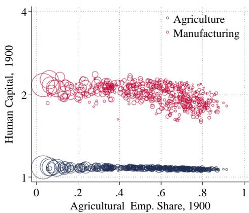  
(C) PRODUCTIVITY

(B) HUMAN CAPITAL GROWTH  
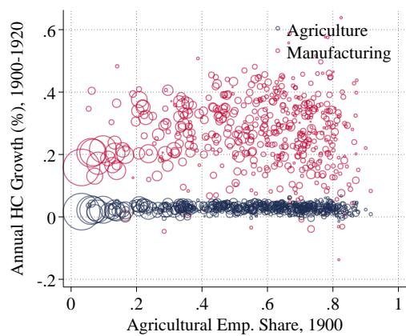  
(D) PRODUCTIVITY GROWTH

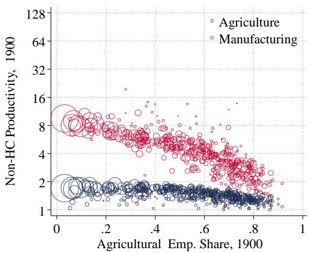

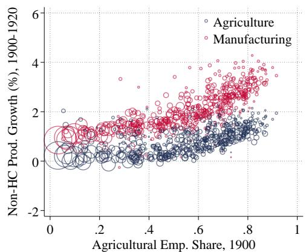  
Notes: The figure compares human capital and productivity across commuting zones by initial agricultural employment share. Panels (A) and (B) report sector-specific human capital levels in 1900 and their average annual growth between 1900 and 1920, respectively. Human capital stocks are based on local educational attainment and sector-specific returns to schooling. Panels (C) and (D) plot the corresponding patterns for physical productivity. Physical productivity is measured as the productivity residuals from our calibration cleansed of the contribution of human capital.

## B.4 Details of Robustness Exercises

This appendix provides additional details on the robustness exercises discussed in Section 6 of the main text.

Full Robustness Results Table 3 reports the robustness of our results for wage growth and industrialization, corresponding to the patterns in Figure 7. For brevity, the main text focused only on the contributions of agricultural and manufacturing productivity

TABLE A.6: ESTIMATING THE LAND SUPPLY ELASTICITY :

<table><tr><td></td><td>(1)</td><td>(2)</td><td>(3)</td><td>(4)</td><td>(5)</td><td>(6)</td></tr><tr><td> $\ln R_{rt}$ </td><td>0.520***(0.040)</td><td>1.588***(0.390)</td><td>1.940***(0.303)</td><td>0.372***(0.058)</td><td>1.049*(0.602)</td><td>0.701(2.411)</td></tr><tr><td>Fixed Effects</td><td>Year, CZ</td><td>Year, CZ</td><td>Year, CZ</td><td>Year, CZ</td><td>Year, CZ</td><td>Year, CZ</td></tr><tr><td>Emp. Weights</td><td>No</td><td>No</td><td>No</td><td>Yes</td><td>Yes</td><td>Yes</td></tr><tr><td>IV</td><td>No</td><td>Immigrants</td><td>Population</td><td>No</td><td>Immigrants</td><td>Population</td></tr><tr><td>R-squared</td><td>.901</td><td>-.598</td><td>-1.2</td><td>.936</td><td>-.552</td><td>.0525</td></tr><tr><td>Observations</td><td>1,485</td><td>1,485</td><td>1,485</td><td>1,485</td><td>1,485</td><td>1,485</td></tr></table>

Notes: The table reports estimates of the land supply elasticity : from equation (A.43). All specifications include commuting zone and year fixed effects. Columns 1 and 4 report OLS estimates. Columns 2 and 5 instrument ln $V _ { r t }$ with the log number of immigrants in region r at time t, while columns 3 and 6 use the log of total population as an instrument. Columns 4–6 re-estimate the corresponding specifications using population-weighted regressions. Standard errors are clustered at the commuting zone-year level.

growth (d ln $A _ { r t }$ and dln $Z _ { r t } )$ . Figures $\mathrm { A . 7 }$ and $_ { \mathrm { A } . 6 }$ present the full decompositions. Figure $\mathrm { A . 7 }$ reports results for wage growth (left panel of Figure 7) while Figure $_ { \mathrm { A } . 6 }$ reports results for industrialization (right panel).

Estimating the Elasticity of Land Supply : In our second robustness exercise, we allow for an elastic supply of agricultural land, modeled as $T _ { r t } = \overline { { T } } r R r t ^ { \varrho }$ . Our baseline calibration assumes $\varrho = 0 ;$ here, we estimate : using data on land values.

Let $V _ { r t }$ denote the value of agricultural land in region r at time t. We assume that land values are proportional to rental rates according to $R _ { r t } = V _ { r t } m _ { r } k _ { t } u _ { r t }$ , where $m _ { r }$ and $k _ { t }$ are region and time-specific wedges, and $u _ { r t }$ is an idiosyncratic error term capturing transitory deviations. Substituting this into the land supply equation yields

$$
\ln T _ {r t} = \delta_ {r} + \delta_ {t} + \varrho \ln V _ {r t} + e _ {r t},\tag{A.43}
$$

where $\delta _ { r }$ and $\delta _ { t }$ are region and time fixed effects, and $e _ { r t } = \varrho \ln u _ { r t }$ . If $u _ { r t }$ is uncorrelated with land values $V _ { r t }$ conditional on fixed effects, we can estimate : using OLS. Otherwise, an instrumental variables strategy is required to isolate exogenous variation in $V _ { r t }$

Table A.6 reports our estimates. Column 1 presents the OLS estimate, yielding $\varrho \approx 0 . 5$ Columns 2 and 3 implement two IV strategies, instrumenting ln $V _ { r t }$ with either (i) the log number of immigrants or (ii) the log of total population in region r at time t. Both instruments plausibly shift the demand for land without directly affecting supply conditions captured by $u _ { r t }$ . As expected, the IV estimates are larger than the OLS estimate, with $\varrho \approx 1 . 2$ . Columns 4–6 report population-weighted regressions. While the point estimates are similar, standard errors increase substantially, reflecting the noisier nature of the weighted specification. For our robustness analysis, we adopt a value of $\varrho = 1 . 2$ , corresponding to the upper range of the IV estimates and providing a useful contrast to the baseline case of $\varrho = 0$

(A) BALANCED EMP. GROWTH  
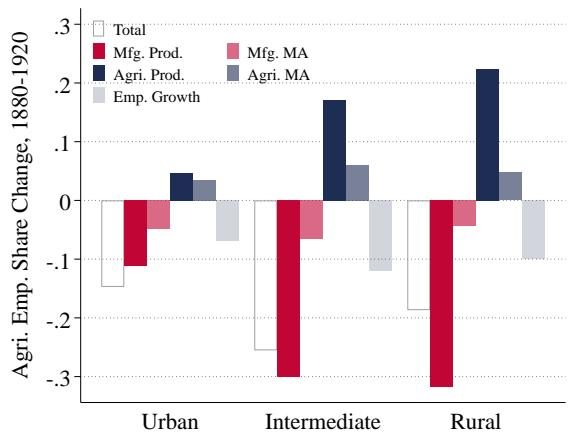  
(C) GEOGRAPHIC FRONTIER

(B) ELASTIC LAND  
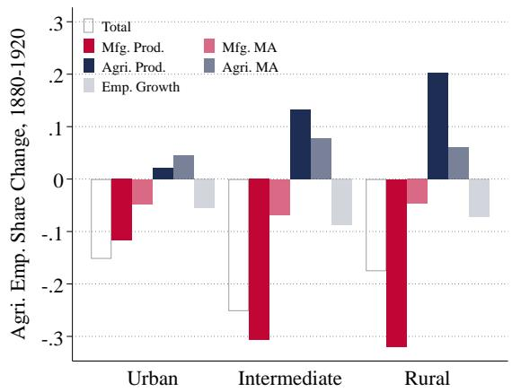  
(D) HIGH ζ

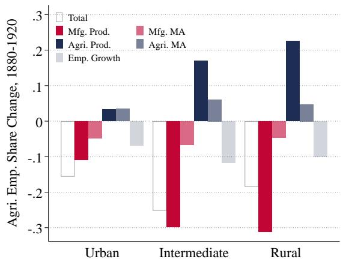  
(E) LOW σM

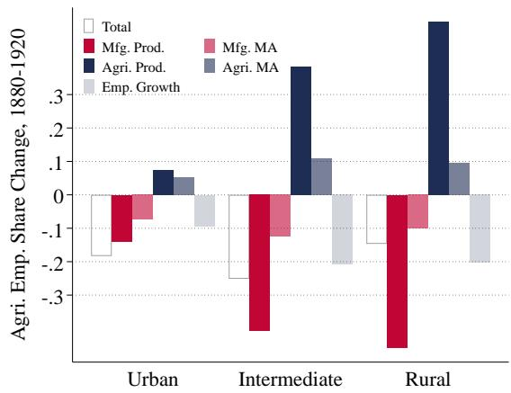  
(F) NO RAILROAD

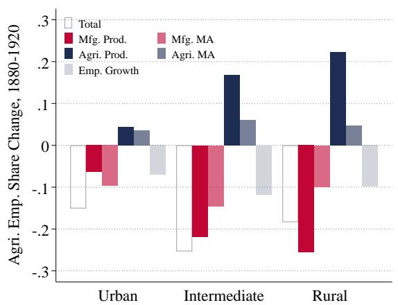

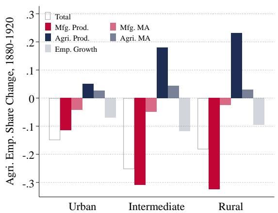

Notes: The figure decomposes local industrialization, $d s _ { r A } ,$ into contributions from changes in market access $( d \ln { \mathcal { D } } r s { \dot { t } } , \mathbf { \Lambda } ^ { \prime \prime } \mathbf { M } \mathbf { A } ^ { \prime \prime } )$ , sectoral productivity growth $( d \ln Z r t$ and dln $A _ { r t } ) .$ , and local employment growth $( d \ln L _ { r t } ) ,$ , each pre-multiplied by the corresponding exposure elasticities from Proposition 4. Urban (rural) locations are defined as commuting zones in the bottom (top) quartile of the 1880 agricultural employment share distribution; intermediate locations fall between these quartiles. Each panel shows a different model calibration relative to the baseline: balanced employment growth $( n _ { t } ) _ { \cdot }$ , elastic land supply $( \varrho = 1 . 2 ) .$ , geographic frontier $( \varsigma = 5 , \iota = 1 )$ , high labor supply elasticity $( \zeta = 4 ) .$ , low substitution elasticity in manufacturing $( \sigma _ { M } = 4 )$ , and fixed trade costs at 1880 levels (“no railroad,” A - 29 A - 29 $' \tau _ { r r t } = \tau _ { r r 1 8 8 0 } )$

## (A) BALANCED EMP. GROWTH

  
(C) GEOGRAPHIC FRONTIER

(B) ELASTIC LAND  
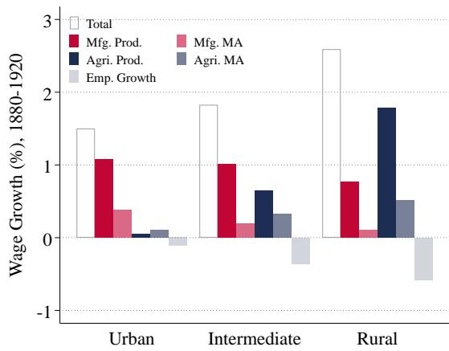  
(D) HIGH ζ

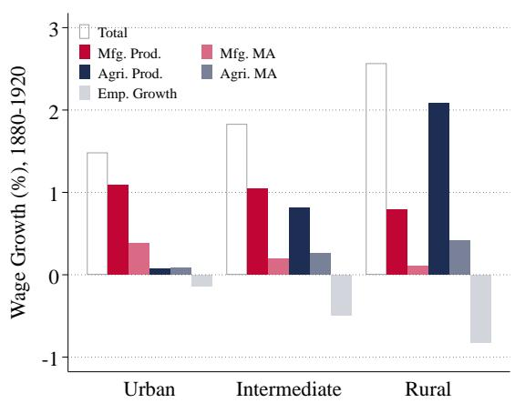  
(E) LOW σM

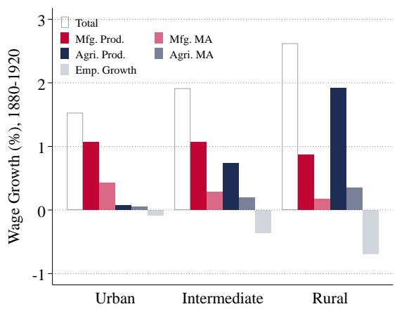  
(F) NO RAILROAD

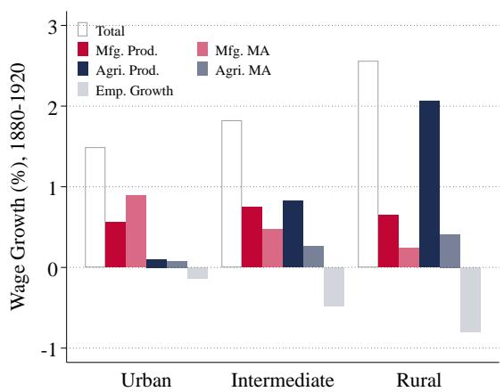

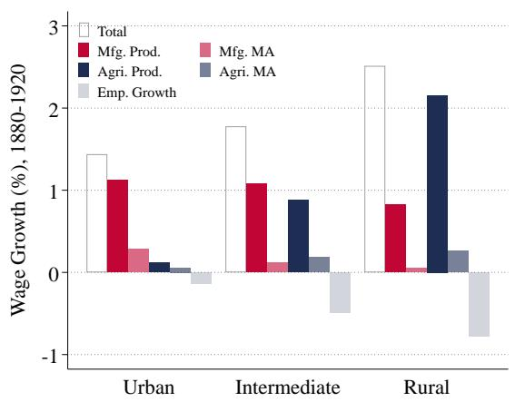  
Notes: The figure decomposes local wage growth, d lnwrt, into contributions from changes in market access (d ln $\bar { \mathcal { D } } \bar { r } s t , ^ { \prime \prime } \mathrm { M A ^ { \prime \prime } } )$ , sectoral productivity growth (d ln $Z _ { r t }$ and dln $A _ { r t } )$ , and local employment growth $( d \ln L _ { r t } ) .$ , each pre-multiplied by the corresponding exposure elasticities from Proposition 4. Urban (rural) locations are defined as commuting zones in the bottom (top) quartile of the 1880 agricultural employment share distribution; intermediate locations fall between these quartiles. Each panel shows a different model calibration relative to the baseline: balanced employment growth $( n _ { t } ) _ { \cdot }$ , elastic land supply $( \varrho = 1 . 2 ) .$ , geographic frontier $( \varsigma = 5 , \iota = 1 )$ , high labor supply elasticity $( \zeta = 4 ) .$ , low substitution elasticity in manufacturing $( \sigma _ { M } = 4 )$ , and fixed trade costs at 1880 levels (“no railroad,” $\prime \tau _ { r r t } = \tau _ { r r 1 8 8 0 } ) $ A - 30 A - 30