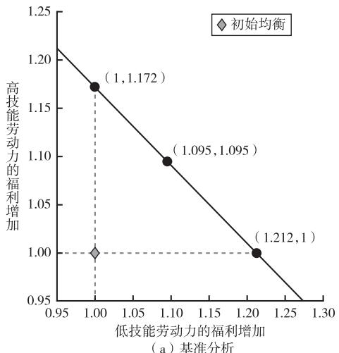
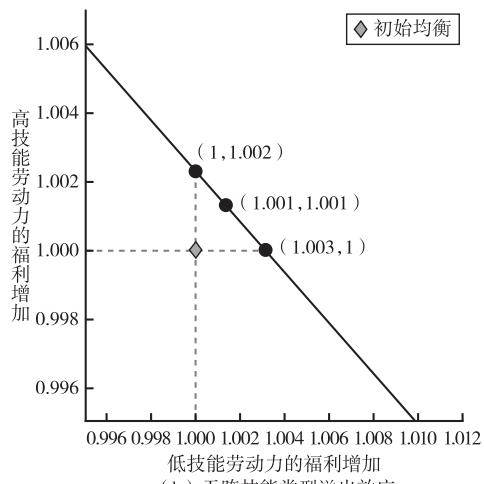
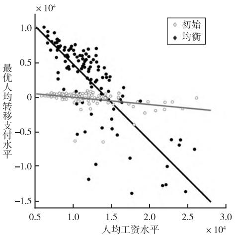
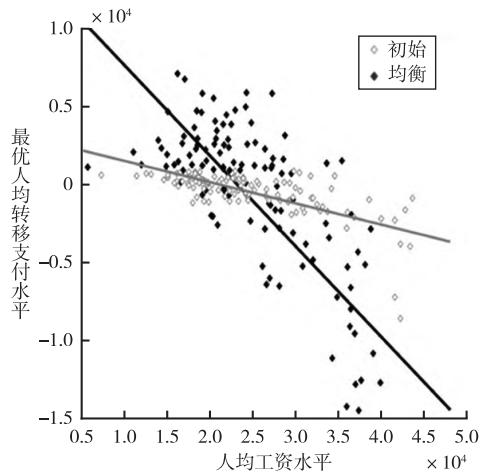
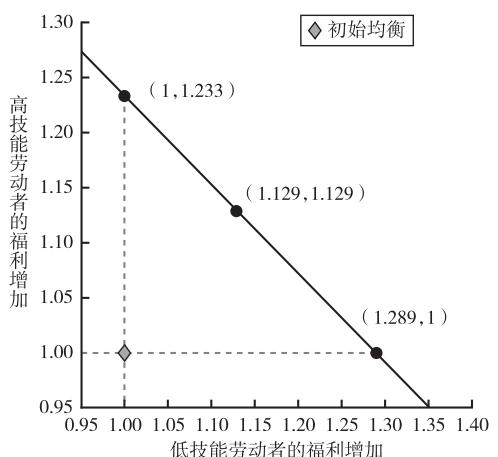
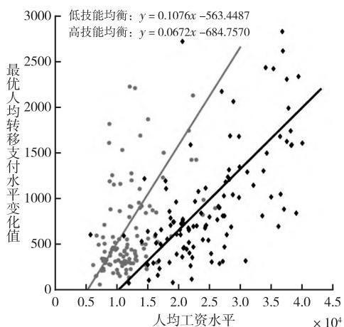
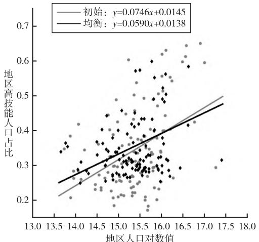
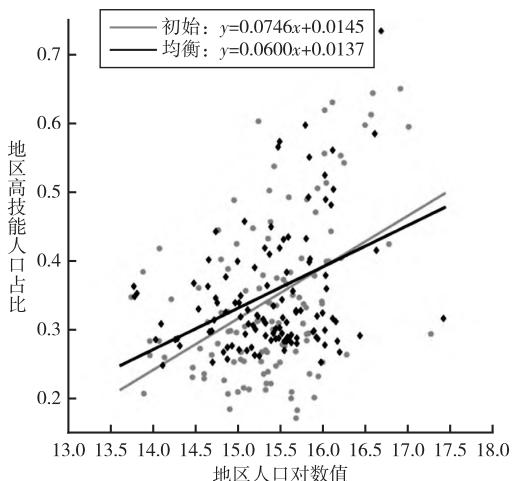

# 人力资本空间配置的社会福利效应研究

# ——基于量化空间一般均衡模型的分析

刘　华　王　姣　陈力朋

内容提要：优化人力资本空间配置能够通过人力资本外部性和技能互补提高生产率和创新，是应对人口增速放缓新形势的重要手段。本文构建了一个包含异质性劳动力生产率溢出和公共服务溢出的量化空间一般均衡模型，探究中国人力资本空间配置优化的福利效应及实现最优配置的可行财政政策。研究发现：在有劳动力跨技能类型生产率溢出和公共服务溢出的空间经济中，人力资本空间配置优化可以明显提高社会福利；实施从高技能工人（和高工资城市）到低技能工人（和低工资城市）的再分配政策能够实现人力资本的空间优化配置，使得经济状态达到帕累托有效前沿；相对目前中国人力资本的空间分布，均衡状态时人力资本的空间分布呈现出高技能人才区域布局更均衡的特征。本文为研究异质性劳动力跨技能类型溢出效应和人力资本空间配置优化问题提供了一个理论分析框架，研究结论可为中国推动人才区域合理布局和全国统一大市场建设提供理论依据。

关键词：人力资本　溢出效应　福利改进　量化空间均衡

## 一、引　言

年，中国人口出现近 年来的首次负增长，①直接影响劳动力供给和生产力水平，给中国经济高质量发展和中国式现代化建设带来新挑战。通过优化劳动力空间分布以发挥人力资本外部性和技能互补性，是推动生产率和创新能力提升，应对人口负增长的重要途径（陆铭， ；蔡昉，；翟振武和金光照， ）。随着交通基础设施的不断完善、户籍制度的深化改革，以及全国统一大市场建设的深入推进，中国人力资本正在大规模地跨区域空间流动。②人口的空间流动和集聚会产生外部性（包括正向的规模经济效应和负向的拥挤效应），不同技能群体受经济集聚的影响及其产生的外溢效应无疑是不同的，这些溢出效应塑造了城市间的人力资本空间分布。外部性会导致市场配置可能是低效的，且中国的人力资本空间流动并不是完全市场化的，还受到户籍制度和地方人才政策的影响。那么，中国当前的人力资本空间分布是否有效？调整当前空间布局能否提升社会福利？如果可以，实现优化配置的政策是什么？更优的人力资本空间配置呈现何种特征？

为了回答以上问题，本文结合理论研究前沿和中国户籍制度现实特征，将户籍制度和房地产税引入 Diamond（2016）和 Fajgelbaum & Gaubert（2020）的分析框架中，构建了包含异质性劳动力交叉溢出效应的量化空间一般均衡模型，从理论角度分析并反事实模拟不同情形下优化人力资本空间配置的福利效应和财税政策。量化空间一般均衡模型是研究人口流动的重要方法，该分析框架已发展较为成熟且广泛应用于贸易成本与劳动力流动（Allen & Arkolakis，2014；Redding，2016）、最优城 市 规 模（Helsley & Strange，2014；Albouy et al.，2019）和 最 优 人 力 资 本 空 间 分 布（Fajgelbaum &， ）等研究。近年来，基于量化空间一般均衡模型探讨中国劳动力流动问题的研究也逐渐兴起，但主要是基于同质劳动力集聚框架探讨中国户籍制度等政策性迁移成本对劳动力迁移决策、生产率、地区差距和社会福利的影响（Fan，2019；Tombe & Zhu，2019；Ma & Tang，2020；王永进等， ）。尽管有研究从技能差异和技能互补的视角分析了中国异质性劳动力的空间配置问题（刘晨晖和陈长石， ；周慧珺等， ；徐恺等， ），但尚未考虑不同技能群体之间跨技能的溢出效应。事实上，劳动力集聚带来的人力资本外部性和技能互补是城市发展和现代经济增长的基础（陆铭， ），忽视劳动力异质性和技能交叉溢出将无法准确量化人力资本空间配置优化的福利效应。

为此，本文构建了一个包含异质性劳动力交叉溢出效应的量化空间一般均衡模型，在异质性集聚框架下分析中国的人力资本空间配置问题。参考已有包含异质性劳动力的量化空间一般均衡模型的设定（Moretti，2013；Diamond，2016；Fajgelbaum & Gaubert，2020；Henkel et al.，2021），本文考虑两方面的溢出效应：一方面，个体作为劳动力从事生产经营活动会产生正向的生产率溢出效应；另一方面，个体作为消费者参与消费活动会产生公共服务拥挤效应，但高技能群体也可能产生正向的公共服务溢出效应，①因此个体位置选择会影响地区的生产率和公共服务水平。考虑到中国户籍制度的现实特征，本文参考Tombe & Zhu（2019）和黄文彬等（2023）等文献的做法，从劳动报酬视角理解户籍制度对劳动力资源配置的影响，在模型中设定为劳动力流动的“冰山成本”。最后，本文还在模型中引入了为地方政府公共服务融资的房地产税，从地方政府税收政策和中央政府转移支付政策两个视角为优化人力资本空间分布提供可行的财政政策选择。

基于 Dekle et al（. 2008）提出的精准帽子代数法（exact-hat algebra method），本文反事实模拟了人力资本空间配置优化的社会福利效应以及实现人力资本空间优化配置的财政政策效果，并刻画均衡情形下最优人力资本的空间分布特征。本文发现，当考虑不同技能类型劳动力的跨类型生产率溢出和公共服务溢出时，改变人力资本的空间分布能够带来明显的福利收益。其中，实施从高技能工人和高工资城市到低技能工人和低工资城市的再分配能够实现人力资本的空间优化配置，使得经济状态达到帕累托有效前沿，当征收房地产税时，从高工资城市向低工资城市、高技能群体到低技能群体的转移会降低。对应地，相对中国当前的人力资本空间分布，帕累托有效均衡状态时的高技能人力资本空间分布呈现出区域更均衡的特征，即高技能人口向原始人口规模更小的城市流动，低技能人口向原始人口规模更大的城市流动。

相对于已有文献，本文的边际贡献主要有如下三方面：第一，在理论上，从中国特色的户籍制度和房地产税等视角丰富了异质性劳动力空间集聚模型的有关文献。已有大量文献探讨了欧美国家的异质性劳动力空间区位选择问题（ ， ； ， ； ， ；， ）。例如， （ ）和 （ ）通过构建异质性空间集聚框架分析了高技能劳动力更多流入大城市和低技能劳动力更多进入小城市的原因，并发现这种不同技能区位选择的差异能够很大程度上解释不同技能劳动力收入的差异。Fajgelbaum & Gaubert（2020）构建了包含异质性集聚效应的量化空间分析框架，发现利用税收补贴等政策引导一部分高技能劳动力流向低工资城市可以提高社会总体福利水平。但鲜有文献建立异质性空间集聚框架分析中国的劳动力空间配置问题，①本文在已有研究的基础上进一步考虑了中国的户籍制度，并引入房地产税将公共服务供给内生化，为分析中国的人力资本空间配置优化的福利效应和可行财政政策提供了一个理论框架。

第二，在现实问题上，本文从人力资本空间配置优化的视角提出应对人口负增长冲击的新思路。近年来，随着人口总量达到顶峰以及人力资本水平不断提升，中国正处于“人口红利”向“人才红利”加速转变的关键时期。已有研究主要探讨了如何通过教育来提升中国整体的人力资本水平，也有研究分析了中国人口的空间配置优化问题，但多数是基于同质劳动力框架探讨中国户籍制度等政策性迁移成本对劳动力迁移决策、生产率、地区差距和社会福利的影响以及最优的城市规模（Fan，2019；Tombe & Zhu，2019；Ma & Tang，2020；王永进等，2022），本文则进一步基于异质性劳动力空间集聚理论，考虑不同技能类型劳动力的公共服务和生产率交叉溢出效应，研究中国人力资本空间配置优化问题，并系统模拟了优化人力资本空间分布的福利效应及实现优化的财政政策选择。研究结论为人口负增长背景下，如何通过优化劳动力空间分布结构，发挥人力资本外部性与技能溢出来实现社会福利效应提升提供了经验证据。

第三，在参数估计上，本文通过多维度精细化的宏微观数据，估计了中国异质性劳动力的生产率和公共服务交叉溢出效应弹性。经济活动集聚会产生正向生产率提升和负向的公共服务拥挤效应，这些溢出效应决定了城市规模和生产力的分布。不同技能群体产生的溢出效应以及其影响程度无疑是不同的，这些因素也塑造了不同技能群体在城市间的分布。准确有效地估计溢出效应弹性是分析人口空间流动有关问题的关键。诸多文献基于不同国家的证据，通过城市平均工资对城市人口的回归估计了同质性劳动力溢出效应弹性（Ciccone & Hall，1996；Combes et al.，； ， ；周慧珺等， ）。周慧珺等（ ）进一步估计出高技能和低技能同类型生产率溢出效应弹性分别为 和 。本文则进一步使用丰富的宏微观数据，估计了中国不同技能类型劳动力跨类型的生产率交叉溢出效应弹性和公共服务溢出效应弹性，为更加准确且精细地探讨中国不同技能劳动力空间集聚问题提供了较好的参数基础。

## 二、理论模型

本节基于中国经济社会的现实特征，将户籍制度、地方公共支出和地方房地产税引入 Fajgel⁃（ ）的人力资本空间类分的研究框架，构建了包含居民跨技能类型的生产率溢出效应和公共服务溢出效应的多区域空间一般均衡模型。

## （一）模型构建

## 1.经济背景

经济是封闭的，不考虑对外开放贸易情形。经济体共包含 J个地区，每个地区内生产两种产品：住房H和可贸易产品Y。住房H只能在本地区消费，可贸易品Y可向其他地区销售。经济中居民是异质的，其类型记为θ ， ，Θ ，外生给定且不可转换。居民技能类型θ从消费和生产两个层面影响经济：在消费方面，不同类型θ的居民消费偏好不同，产生的公共服务消费外溢效应也不同；在生产方面，类型θ反映了不同技能类型劳动力的生产率，同时也刻画了生产率溢出效应。居民可以在地区间流动，但受限于户籍制度形成的劳动流动摩擦。居民流动到不同地区后，将j地区θ类型居民数量记为 $L _ { j \textrm { c } } ^ { \theta }$ 。经济中劳动禀赋总量给定为 Lˉ，θ类型劳动禀赋为 $\bar { L } ^ { \theta }$ ，劳动市场出清条件

满足：

$$
\sum_ {j} \sum_ {\theta} L _ {j} ^ {\theta} = \bar {L}, \sum_ {j} L _ {j} ^ {\theta} = \bar {L} ^ {\theta}\tag{1}
$$

## 2.居民消费

地区j内 $\theta$ 类型居民消费可贸易品 $c _ { j } ^ { \theta }$ 、住房 $h _ { j } ^ { \theta }$ 和不可贸易公共服务品 $g _ { j } ^ { \theta }$ ，获得效用：

$$
U \left(c _ {j} ^ {\theta}, h _ {j} ^ {\theta}, g _ {j} ^ {\theta}\right)\tag{2}
$$

其中，效用函数U满足对各变量的一阶导数大于0，二阶导数小于0，并满足关于消费品 $c _ { j } ^ { \theta }$ 和住房 $h _ { j } ^ { \theta }$ 一次齐次性。

不失一般性，假设住房生产出来后在居民间随机分配，且产权不可贸易，产权在不同地区或只在一处分布实质是相同的，为方便表达将产权分配在其实际居住的辖区。因此，地区j中 $\theta$ 类型消费者拥有的住房 $H _ { j } ^ { \theta }$ 是外生且独立分布的随机变量，静态情形下，期初居民获得产权，期末被收回。因此，在期初，地区j中 $\theta$ 类型居民拥有住房禀赋 $H _ { j } ^ { \theta }$ ，从中可获得财产性收入 $r _ { j } H _ { j } ^ { \theta }$ 。其中，r 是住房租 $r _ { j }$ 赁价格。居民无弹性供给单位劳动，获得工资 $\boldsymbol { w } _ { j } ^ { \boldsymbol { \theta } } \boldsymbol { \cdot }$ 。地区内住房生产获得利润 $\pi _ { j } ^ { \cal H }$ ，贸易品生产获得利润 $\boldsymbol { \pi } _ { j } ^ { Y }$ ，生产者总利润为 $\pi _ { j } = \pi _ { j } ^ { H } + \pi _ { j } ^ { Y }$ 。令 $\theta$ 类型居民对生产利润的产权份额外生给定为 $\varrho _ { j } ^ { \theta }$ ，满足$\sum _ { \theta } \varrho _ { j } ^ { \theta } = 1$ ，①则居民的预算约束刻画为：

$$
p _ {j} c _ {j} ^ {\theta} + r _ {j} h _ {j} ^ {\theta} = w _ {j} ^ {\theta} \left(1 - \tau^ {w}\right) + r _ {j} H _ {j} ^ {\theta} - r _ {j} \left(H _ {j} ^ {\theta} - \bar {H} _ {j}\right) \tau_ {j} ^ {\theta} + Q _ {j} ^ {\theta} \pi_ {j} + t _ {j} ^ {\theta}\tag{3}
$$

其中， ${ \bf \nabla } \cdot { \bf \nabla } P _ { j }$ 是消费品价格， $\tau _ { j } ^ { \theta }$ 是依赖于居民个人类型的房地 $\vec { J } ^ { \pm }$ 税， $\bar { H _ { j } }$ 表示房地产税免税阈值， $\tau ^ { w }$ 是劳动所得税， $t _ { j } ^ { \theta }$ 是来自地方政府或中央政府的基于地区和劳动技能的转移支付。不可贸易公共服务品由地方政府提供，故不进入预算约束。

根据如上居民消费行为的刻画，对消费者的住房净额 ${ H } _ { j } ^ { \theta } \mathrm { ~ - ~ } \bar { H } _ { j }$ 征收房地产税，这意味着当 $H _ { i } ^ { \theta } \leqslant$ $\bar { H _ { j } }$ 时，不征收房地产税，即 $\tau _ { j } ^ { \theta } = 0$ 。居民拥有的住房禀赋总量等于住房消费总量：

$$
\sum_ {\theta} L _ {j} ^ {\theta} h _ {j} ^ {\theta} = \sum_ {\theta} L _ {j} ^ {\theta} H _ {j} ^ {\theta}\tag{4}
$$

公共服务 $g _ { j }$ 是由地区j地方政府向辖区居民提供的无差异公共服务品，与居民类型无关。公共服务由地方政府征收房地产税或中央政府征收劳动所得税后向地方政府转移支付提供。居民可以不需要直接支付费用即可消费，但居民的消费相互影响，不同类型居民在同一地区居住，对公共服务的需求产生溢出效应。不同类型居民对于每个地区公共服务的偏好不同，每种类型居民产生的公共服务拥挤效应也不同。比如，一个群体可能更喜欢居住在同类群体密度较高的地方，或者可能更喜欢特定人群集聚的城市。地区j中θ类型居民获得的有效公共服务为 $g _ { j } ^ { \theta } ( L _ { j } ^ { 1 } , \cdots , L _ { j } ^ { \theta } ; g _ { j } )$ ，取决于地区j居民类型 $\{ L _ { j } ^ { 1 } , \cdots , L _ { j } ^ { \theta } \}$ 的分布，以及地区内实际公共服务供给。定义地区j中 $\theta$ 类型居民对 $\theta ^ { \prime }$ 类型居民的公共服务溢出效应弹性为：

$$
\psi_ {\theta , \theta^ {\prime}} ^ {G, j} \equiv \frac {\partial g _ {j} ^ {\theta^ {\prime}}}{\partial L _ {j} ^ {\theta}} \frac {L _ {j} ^ {\theta}}{g _ {j} ^ {\theta^ {\prime}}}\tag{5}
$$

居民只考虑消费可贸易品和住房，而不直接考虑公共服务品的选择。在竞争性市场中，消费者的优化问题为在预算约束（ ）式下选择消费品 $c _ { j } ^ { \theta }$ 和住房 $h _ { j } ^ { \theta }$ 来最大化效用函数（ ）式。

## 3.企业生产

每个地区内的企业投入中间品和劳动生产可贸易商品和住房，则地区 $\cdot j$ 中住房 $H _ { j }$ 和可贸易商品$Y _ { j }$ 的生产函数分别设定为：

$$
Y _ {j} = Y \left(N _ {j} ^ {Y}, I _ {j} ^ {Y}\right), H _ {j} = Y \left(N _ {j} ^ {H}, I _ {j} ^ {H}\right)\tag{6}
$$

其中， $\cdot N _ { j } ^ { Y } , N _ { j } ^ { H } , I _ { j } ^ { Y } , I _ { j } ^ { H }$ 分别表示投入的有效劳动和中间产品。

由于居民生 $\vec { J } ^ { \pm }$ 会 $\vec { \boldsymbol { J } ^ { \mu } }$ 生溢出效应，因此投入的劳动为有效劳动，即充分考虑不同类型居民生 $\vec { \cal J } ^ { \pm }$ 率溢出效应的实际效率劳动。具体地，有效劳动 $N _ { j }$ 由地区j中所有类型居民的劳动供给复合而成：

$$
N _ {j} = N _ {j} \left(z _ {j} ^ {1} L _ {j} ^ {1}, \dots , z ^ {\theta} L _ {j} ^ {\theta}, \dots , z _ {j} ^ {\Theta} L _ {j} ^ {\Theta}\right)\tag{7}
$$

其中， $z _ { j } ^ { \theta }$ 表示地区j内θ类型居民的生产率， $z _ { j } ^ { \theta } L _ { j } ^ { \theta }$ 表示 $\theta$ 类型居民的劳动供给，有效劳动市场出清条件为 $N _ { j } = N _ { j } ^ { Y } + N _ { j } ^ { H } \mathrm { ~ c ~ }$ 。生产过程中θ类型劳动力的生产率受其他类型劳动力影响，因此地区j内θ类型劳动力的生产率为 $z _ { j } ^ { \theta } = z _ { j } ^ { \theta } \Big ( L _ { j } ^ { 1 } , \cdots , L _ { j } ^ { \Theta } \Big )$ 。例如，一个城市的劳动者集聚形成了丰富的劳动力市场，使企业和生产者之间能够更好地匹配，生产者通过相互学习产生了生产率外溢。与公共服务一样，溢出效应也取决于不同类型生产者 $\{ L _ { j } ^ { 1 } , \cdots , L _ { j } ^ { \theta }$ }的分布。定义类型为 $\theta$ 的生产者对 $\theta ^ { \prime }$ 类型生产者的生产率溢出效应弹性为：

$$
\psi_ {\theta , \theta^ {\prime}} ^ {P, j} \equiv \frac {L _ {j} ^ {\theta}}{z _ {j} ^ {\theta^ {\prime}}} \frac {\partial z _ {j} ^ {\theta^ {\prime}}}{\partial L _ {j} ^ {\theta}}\tag{8}
$$

中间投入品由来自不同地区可贸易品复合生成，即地区j生 $\vec { J } ^ { \pm }$ 的 $Y _ { j }$ 不能直接作为居民消费品，而是与来自各地的可贸易产品共同生产最终消费品集合 $Q _ { j } = Q \left( Q _ { 1 j } , \cdots , Q _ { J j } \right)$ 。 $Q _ { i }$ 表示地区j采购地区i内可贸易品的数量，最终可贸易品市场出清条件满足：

$$
Y _ {j} = \sum_ {i \in \{1, \dots , J \}} d _ {j i} Q _ {j i}\tag{9}
$$

其中， $d _ { \ j _ { i } }$ 是 $\vec { J } ^ { \pm }$ 品由地区j运往地区i的冰山成本，满足 $d _ { j i } \geqslant 1$ 以及 $d _ { j k } d _ { k i } \geqslant d _ { j i }$ C

地区j生 $\vec { \boldsymbol { { \cal J } } ^ { \pm } }$ 的 $\vec { \cal J } ^ { \pm }$ 品 $Q _ { j }$ ，可作为地 $\textstyle { \big \vert } { \big \vert } \times j$ 内居民最终消费品 $c _ { j }$ 、可贸易品 $Y _ { j }$ 和住房 $H _ { j }$ 生 $\vec { J } ^ { \pm }$ 的中间投入品 $I _ { j }$ ，以及公共服务品 $g _ { j }$ ，均衡状态下满足：

$$
Q _ {j} = \sum_ {\theta} L _ {j} ^ {\theta} c _ {j} ^ {\theta} + I _ {j} + g _ {j}\tag{10}
$$

其中， $I _ { j } = I _ { j } ^ { Y } + I _ { j } ^ { H } $ 。地区内可贸易品生产者的优化问题为，给定工资、中间品价格和可贸易品价格，选择有效劳动和中间投入品，使得利润最大化：

$$
\pi_ {j} ^ {Y} = \max _ {N _ {j} ^ {Y}, I _ {j} ^ {Y}} \chi_ {j} Y _ {j} \left(N _ {j} ^ {Y}, I _ {j} ^ {Y}\right) - W _ {j} N _ {j} ^ {Y} - p _ {j} I _ {j} ^ {Y}\tag{11}
$$

其中， $W _ { j }$ 表示有效劳动工资， $\chi _ { j }$ 表示可贸易 $\vec { J } ^ { \pm }$ 品价格， $p _ { j }$ 表示中间品价格。根据（ ）式，中间品价格即为最终 $\vec { J } ^ { \pm }$ 品价格，意味着消费品和公共服务品的价格也是 $p _ { j ^ { \mathsf { c } } }$ 。住房生 $\vec { \cal J } ^ { \pm }$ 者的优化问题类似，即：

$$
\pi_ {j} ^ {H} = \max _ {N _ {j} ^ {H}, I _ {j} ^ {H}} r _ {j} H _ {j} \left(N _ {j} ^ {H}, I _ {j} ^ {H}\right) - W _ {j} N _ {j} ^ {H} - p _ {j} I _ {j} ^ {H}\tag{12}
$$

劳动力市场中居民提供劳动，劳动报酬为实际劳动时间供给与效率工资的乘积，即θ类型劳动者的实际工资 $\left\{ \begin{array} { l } { w _ { j } ^ { \theta } } \end{array} \right\}$ 等于其边际 $\vec { J } ^ { \pm }$ 出价值。经济中的劳动者流动摩擦意味着居民迁移到地区j会支付一定“成本”，表现为实际劳动报酬的下降。类似地，黄文彬等（ ）从劳动报酬视角理解户籍制度对劳动力资源配置的影响。因此，可合理地从劳动报酬视角刻画劳动者流动摩擦，即在考虑劳动者迁移摩擦的空间经济中，实际劳动报酬满足：

$$
w _ {j} ^ {\theta} = f _ {j} W _ {j} \frac {\partial N \left(z _ {j} ^ {1} L _ {j} ^ {1} , \cdots , z _ {j} ^ {\Theta} L _ {j} ^ {\Theta}\right)}{\partial L _ {j} ^ {\theta}}\tag{13}
$$

其中， $\frac { \partial N ( \cdot ) } { \partial L _ { j } ^ { \theta } }$ 表示有效劳动关于θ类型劳动数量 $L _ { j } ^ { \theta }$ 的偏导数， $\mathbf { \nabla } , f _ { j }$ 刻画了地区j的劳动者迁移摩擦系数，数值越大则摩擦程度越低，居民迁移到该地区后实际可支配的工资收入越高。因此，迁移摩擦会影响到居民的迁移决策。需要注意的是，由于地区j内迁入人口相对下降，直接影响到劳动的边际产出，也会影响到劳动类型分布对生产率的溢出效应。因此，（ ）式并不意味着摩擦越大，劳动者流入越少，需要考察空间的一般均衡效应。实际上，（ ）式刻画了居民劳动收入的无套利条件，即不论迁移到哪一个地区，最终的实际均衡劳动报酬相等。

假设地区间可贸易品满足无套利条件：

$$
p _ {j} \frac {\partial Q (Q _ {1 i} , \cdots , Q _ {J i})}{\partial Q _ {i j}} = d _ {i j} \chi_ {i}\tag{14}
$$

地区i单位产品贸易到地区j的成本为 $d _ { i j } \chi _ { i }$ ，而该单位产品在地区j产生的边际价值为 $p _ { j } { \partial Q ( \cdot ) } / { \partial Q _ { i j } }$ 无套利条件意味着边际收益等于边际成本。

## 4.政府财政政策

经济中有 个中央政府和J个地方政府，中央政府征收劳动收入税 $\tau ^ { w }$ ，用于对全国各个地方政府的转移支付 $T _ { j }$ ，收支恒等式为：

$$
\sum_ {j} \sum_ {\theta} \tau^ {w} w _ {j} ^ {\theta} L _ {j} ^ {\theta} = \sum_ {j} T _ {j}\tag{15}
$$

之所以设定中央政府征收劳动税并进行转移支付是为考察地方政府最优空间财政政策提供预算平衡保障。也就是说，地方政府可以不征收任何税收，仅需要分配中央政府的转移支付便可实施空间配置财政政策。中央政府按照法定税率征税，在模型基准情形下没有目标函数和约束条件。因此，在优化问题求解中把中央政府征收税率视为外生给定。

地方政府征收房地产税 $\tau _ { j } ^ { \theta }$ ，并向辖区内居民提供公共服务产品 $g _ { j }$ ，在辖区内不具有排他性，影响消费者的公共服务获得 $g _ { j } ^ { \theta } ( L _ { j } ^ { 1 } , \cdots , L _ { j } ^ { \theta } ; g _ { j } )$ ，地方政府也向迁移到辖区内的居民按照技能类型进行转移支付 $t _ { j } ^ { \theta } { } _ { \mathcal { O } }$ 。因此，地方政府的收支恒等式为：

$$
\sum_ {\theta} r _ {j} (H _ {j} ^ {\theta} - \bar {H} _ {j}) \tau_ {j} ^ {\theta} L _ {j} ^ {\theta} + T _ {j} = p _ {j} g _ {j} + \sum_ {\theta} L _ {j} ^ {\theta} t _ {j} ^ {\theta}\tag{16}
$$

（ ）式和（ ）式刻画了经济中的财政政策工具需要满足的约束条件。本文主要聚焦于地方政府的转移支付和房地产税政策，即在满足（ ）式和（ ）式情形下，考察政府如何通过转移支付或设计房地产税来优化人力资本空间配置，从而实现居民社会福利帕累托改进。

## （二）均衡分析

本节首先定义市场完全竞争情形下空间经济的均衡，然后考察中央计划者经济优化情形下人力资本最优配置条件，最后分析实现中央计划者帕累托最优配置的财政政策。

## 1.均衡定义

空间经济中的行为主体包括消费最终产品的居民、住房和可贸易品的生产者、征税并提供转移支付和公共支出的政府等三部分，生产投入的要素主要包括可贸易品复合生成的中间品、包含居民类型分布溢出效应的有效劳动。经济均衡即为经济主体实现目标最大化，产品和要素价格使得中间品和劳动市场出清，且政府收支预算平衡。本文的竞争性空间经济均衡可定义为：住房价格、消费品价格、中间投入品价格、劳动工资和效率劳动工资等价格向量 $\left\{ { r } _ { j } , { p } _ { j } , { \chi } _ { j } , { W } _ { j } , { w } _ { j } ^ { \theta } \right\} _ { j \in \{ 1 , \cdots , J \} } ^ { \theta \in \{ 1 , \cdots , \theta \} }$ ，劳动收入税、房地 $\vec { J } ^ { \pm }$ 税、居民转移支付和中央对地方转移支付 $\left\{ \tau ^ { w } , \tau _ { j } ^ { \theta } , t _ { j } ^ { \theta } , T _ { j } \right\} _ { j \in \{ 1 , \cdots , J \} } ^ { \theta \in \{ 1 , \cdots , \theta \} }$ ，使得资源配置$\left\{ c _ { j } ^ { \theta } , h _ { j } ^ { \theta } , L _ { j } ^ { \theta } Q _ { i j } , N _ { j } ^ { Y } , N _ { j } ^ { H } , I _ { j } ^ { Y } , I _ { j } ^ { H } , g _ { j } \right\} _ { j \in \{ 1 , \cdots , J \} } ^ { \theta \in \{ 1 , \cdots , \theta \} }$ 满足如下条件：

居民消费可贸易品和住房 $\left\{ c _ { j } ^ { \theta } , h _ { j } ^ { \theta } \right\} _ { j \in \{ 1 , \cdots , J \} } ^ { \theta \in \{ 1 , \cdots , \theta \} }$ 使得效用最大化；

有效劳动和中间品的投入 $\left\{ N _ { j } ^ { Y } , N _ { j } ^ { h } , I _ { j } ^ { Y } , I _ { j } ^ { h } \right\} _ { j \in \{ 1 , \cdots , J \} }$ 使得住房生 $\vec { J } ^ { \pm }$ 者和可贸易品生产者的利润最大化，有效劳动 $N _ { j }$ 满足（7）式和（8）式，以及最终消费品 $Q _ { i j }$ 满足（9）式和（10）式；

③中央政府和地方政府财政收支满足（15）式和（16）式；

④劳动力市场出清满足（1）式，以及可贸易品市场出清满足（9）式。

## 2.中央计划者问题

考虑一个满足帕累托最优的中央计划者经济，中央计划者通过配置居民劳动 $\left\{ L _ { j } ^ { \theta } \right\}$ 、消费品和住房 $\left\{ c _ { j } ^ { \theta } , h _ { j } ^ { \theta } \right\}$ 、地区间贸易 $\left\{ Q _ { i j } \right\}$ ，劳动要素和中间投入品 $\left\{ N _ { j } ^ { Y } , N _ { j } ^ { H } , I _ { j } ^ { Y } , I _ { j } ^ { H } \right\}$ 来最大化社会福利。中央计划者优化问题求解思路为，给定其他类型 $\theta ^ { \prime } \in \left\{ 1 , \cdots , \theta \right\}$ 居民选择居住区域、消费品和住房下的效用水平，可贸易品和住房的生产在生产可能集内，有效劳动和中间品投入要素市场出清，以及政府收支预算平衡，类型θ居民选择居住在地区j而不会迁移到其他地区，且实现了效用最大化。具体刻画为：

$$
\max L ^ {\theta} u ^ {\theta}\tag{17}
$$

受约束于如下条件：

①空间人口流动性约束条件：

$L _ { j } ^ { \theta } u ^ { \theta } \leqslant L _ { j } ^ { \theta } U \Bigl ( c _ { j } ^ { \theta } , h _ { j } ^ { \theta } , g _ { j } ^ { \theta } \Bigl ( L _ { j } ^ { 1 } , \cdots , L _ { j } ^ { \theta } ; ~ g _ { j } \Bigr ) \Bigr )$ ，对所有的 j；

$L _ { j } ^ { \theta ^ { \prime } } u ^ { \theta ^ { \prime } } \leqslant L _ { j } ^ { \theta ^ { \prime } } U \Bigl ( c _ { j } ^ { \theta } , h _ { j } ^ { \theta } , g _ { j } ^ { \theta } ( L _ { j } ^ { 1 } , \cdots , L _ { j } ^ { \Theta } ; \ g _ { j } ) \Bigr )$ ，对所有的j和 $\theta \neq \theta ^ { \prime }$ 。

②贸易品和住房生 $\vec { J } ^ { \pm }$ 的可行性条件：

$\sum _ { i } d _ { j i } Q _ { j i } \leqslant Y _ { j } \left( N _ { j } ^ { Y } , I _ { j } ^ { Y } \right)$ ，对所有的j和i；

${ \sum } _ { \theta } L _ { j } ^ { \theta } c _ { j } ^ { \theta } + g _ { j } + I _ { j } ^ { H } + I _ { j } ^ { Y } \leqslant Q _ { j } ( Q _ { 1 j } , \cdots , Q _ { J _ { j } } )$ ，对所有的 j；

$\begin{array} { r } { \sum _ { \theta } L _ { j } ^ { \theta } h _ { j } ^ { \theta } \leqslant H _ { j } \big ( N _ { j } ^ { H } , I _ { j } ^ { H } \big ) } \end{array}$ ，对所有的 j。

③劳动力市场出清条件：

$N _ { j } ^ { H } + N _ { j } ^ { Y } = N \Big ( z _ { j } ^ { 1 } \big ( L _ { j } ^ { 1 } , \cdots , L _ { j } ^ { \theta } \big ) L _ { j } ^ { 1 } , \cdots , z _ { j } ^ { \theta } \big ( L _ { j } ^ { 1 } , \cdots , L _ { j } ^ { \theta } \big ) L _ { j } ^ { \theta } \Big )$ ，对所有的j；

$\textstyle \sum _ { j } L _ { j } ^ { \theta } \leqslant L ^ { \theta }$ ，对所有的 $\theta _ { \circ }$

地方政府公共支出的预算平衡约束条件：

${ \sum } _ { \theta } r _ { j } ( H _ { j } ^ { \theta } - \bar { H } _ { j } ) t _ { j } ^ { \theta } L _ { j } ^ { \theta } + T _ { j } = p _ { j } g _ { j } + { \sum } _ { \theta } L _ { j } ^ { \theta } \tau _ { j } ^ { \theta }$ ，对所有的 $j _ { \circ }$

实质上优化问题（17）式是指给定 $\theta ^ { \prime } \ne \theta$ 类型居民的最优效用水平如何实现类型θ居民效用最大化。求解优化问题（17）式可得到空间经济体中居民效用水平的帕累托有效前沿，为分析市场竞争情形下资源配置的帕累托改进提供了参考基准，从而可以探讨实现人力资本空间有效配置的财政政策设计。

## 3.最优资源配置

在上述刻画的中央计划者经济中，不同类型的居民对公共服务有拥挤效应，在生 $\vec { \cal J } ^ { \pm }$ 端有生产率溢出效应这意味着市场竞争中居民的消费和生产选择可能会使得所有居民的效用水平在可达效用水平集合的内部，而非处于效用水平帕累托有效前沿。也就是说，对人力资本和中间投入品等要素资源的再配置会影响到整个经济的福利水平。本文使用中央计划者经济优化问题刻画社会福利最大化 求解中央计划者优化问题(17)式使资源配置实现帕累托最优 进而根据福利经济学第二定理设计使得竞争市场配置帕累托改进的空间财政政策。

求解中央计划者优化问题（ ）式，可得资源帕累托最优配置的必要条件：

$$
\sum_ {\theta^ {\prime}} \frac {L _ {j} ^ {\theta^ {\prime}}}{L _ {j} ^ {\theta}} \psi_ {\theta , \theta^ {\prime}} ^ {G, j} e _ {j} ^ {\theta^ {\prime}} + f _ {j} W _ {j} \frac {\partial N \left(z _ {j} ^ {1} L _ {j} ^ {1} , \cdots , z _ {j} ^ {\Theta} L _ {j} ^ {\Theta}\right)}{\partial L _ {j} ^ {\theta}} = \epsilon_ {j} ^ {\theta} + \Delta^ {\theta}\tag{18}
$$

其中， $\Delta ^ { \theta }$ 和 $\varLambda _ { j }$ 为常数， $\epsilon _ { j } ^ { \theta } = e _ { j } ^ { \theta } + { \varLambda } _ { j } \Big ( p _ { j } g _ { j } + t _ { j } ^ { \theta } - r _ { j } { \tau } _ { j } ^ { \theta } \Big ( H _ { j } ^ { \theta } - \bar { H } _ { j } \Big ) \Big )$ ，而 $e _ { j } ^ { \theta }$ 是居民消费支出，根据（3）式表示为 $e _ { j } ^ { \theta } = w _ { j } ^ { \theta } \big ( 1 - \tau ^ { w } \big ) + r _ { j } H _ { j } ^ { \theta } - r _ { j } \Big ( H _ { j } ^ { \theta } - \bar { H } _ { j } \Big ) \tau _ { j } ^ { \theta } + t _ { j } ^ { \theta } + \varrho _ { j } ^ { \theta } \pi _ { j ^ { 0 } } ~ ^ { \theta }$ ①

（ ）式刻画了帕累托有效时劳动者在区域流动的优化条件，即人力资本的空间优化配置条件，左边描述了θ类型劳动者流入地区j所产生的边际收益，右边刻画了劳动者流入的边际成本。在资源有效配置情形下，θ类型居民迁移到地区j所产生的边际收益和边际成本恰好相等。

（18）式右边的成本第一项 $\epsilon _ { j } ^ { \theta }$ 包含了可贸易品和住房消费、在地区j所享有的公共服务价值、接收到的政府转移支付以及需要支付的房地产税。在最优资源配置情形下，地区j内的消费增加意味着其他地区消费的减少，因此视 $\epsilon _ { j } ^ { \theta }$ 为成本。（18）式第二项 $\Delta ^ { \theta }$ 是中央计划者问题中，全国市场出清约束条件的拉格朗日乘数，刻画了其他地区雇用类型θ劳动者的机会成本。

（ ）式左边的第一项是公共服务溢出效应，通过消费来衡量，如果为负向拥挤效应则为成本，第二项是劳动的边际产出值，进一步对 $N \left( z _ { j } ^ { 1 } L _ { j } ^ { 1 } , \cdots , z _ { j } ^ { \Theta } L _ { j } ^ { \Theta } \right)$ 关于 $L _ { j } ^ { \theta }$ 求解全微分得到：

$$
\frac {\partial N _ {j}}{\partial L _ {j} ^ {\theta}} = z _ {j} ^ {\theta} \frac {d N _ {j}}{d L _ {j} ^ {\theta}} + \sum_ {\theta^ {\prime}} \frac {d N _ {j}}{d L _ {j} ^ {\theta^ {\prime}}} \frac {d z _ {j} ^ {\theta^ {\prime}}}{d L _ {j} ^ {\theta}} L _ {j} ^ {\theta^ {\prime}}\tag{19}
$$

再结合（13）式，可得到：

$$
f _ {j} W _ {j} \frac {\partial N \left(z _ {j} ^ {1} L _ {j} ^ {1} , \cdots , z _ {j} ^ {\Theta} L _ {j} ^ {\Theta}\right)}{\partial L _ {j} ^ {\theta}} = w _ {j} ^ {\theta} (1 + \psi_ {\theta , \theta^ {\prime}} ^ {P, j}) + \sum_ {\theta^ {\prime} \neq \theta} \frac {L _ {j} ^ {\theta^ {\prime}}}{L _ {j} ^ {\theta}} \psi_ {\theta , \theta^ {\prime}} ^ {P, j} w _ {j} ^ {\theta^ {\prime}}\tag{20}
$$

因此，（18）式左边第二项刻画了劳动者流入对整个经济生 $\vec { J } ^ { \pm }$ 率的溢出效应，包括直接的产出效应 $w _ { j } ^ { \theta } \left( 1 ~ + ~ \psi _ { \theta , \theta } ^ { P , j } \right)$ 和对其他类型劳动者的生产率溢出效应 $\sum _ { \theta ^ { \prime } \ne \theta } \frac { L _ { j } ^ { \theta ^ { \prime } } } { L _ { j } ^ { \theta } } \psi _ { \theta , \theta ^ { \prime } } ^ { P , j } w _ { j } ^ { \theta ^ { \prime } }$ 。

## 三、量化设计

## （一）函数形式设定

地区j类型θ消费者对可贸易商品和住房的偏好满足柯布—道格拉斯形式：

$$
U (c, h, g) = \mathrm{g} _ {j} ^ {\theta} c _ {j} ^ {\theta^ {\gamma_ {c}}} h _ {j} ^ {\theta^ {1 - \gamma_ {c}}}\tag{21}
$$

其中， $\gamma _ { c } \in \left[ 0 , 1 \right]$ 表示对可贸易商品的支出份额。

贸易商品集合Q(⋅)由各地区生 $\vec { \boldsymbol { { \cal J } } ^ { \pm } }$ 的商品 $Q _ { \ddot { \mu } }$ 复合生成，是常替代弹性（CES）形式：

$$
Q \left(Q _ {1 i}, \dots , Q _ {J i}\right) = \left(\sum_ {i} Q _ {j i} ^ {\frac {\sigma}{\sigma - 1}}\right) ^ {\frac {\sigma - 1}{\sigma}}\tag{22}
$$

其中， $\sigma > 1$ 是不同产地产品的替代弹性。地区j中住房和可贸易品的生产函数设定为：

$$
Y _ {j} \left(N _ {j} ^ {Y}, I _ {j} ^ {Y}\right) = z _ {j} ^ {Y} \left(N _ {j} ^ {Y}\right) ^ {1 - b _ {Y, j} ^ {I}} \left(I _ {j} ^ {Y}\right) ^ {b _ {Y, j} ^ {I}}\tag{23}
$$

$$
H _ {j} \left(N _ {j} ^ {Y}, I _ {j} ^ {Y}\right) = z _ {j} ^ {H} \left[ \left(N _ {j} ^ {H}\right) ^ {1 - b _ {H, j} ^ {I}} \left(I _ {j} ^ {H}\right) ^ {b _ {H, j} ^ {I}} \right] ^ {\frac {1}{1 + \zeta_ {H , j}}}\tag{24}
$$

其中， $\left\{ z _ { j } ^ { Y } , z _ { j } ^ { H } \right\}$ 刻画了全要素生产率， $b _ { Y , j } ^ { I }$ 表示可贸易品的中间品投入份额， $b _ { H , j } ^ { I }$ 为住房生产的中间品投入份额， $1 / \left( 1 + \zeta _ { { \scriptscriptstyle H , j } } \right)$ 为住房供给逆弹性。

有效劳动供给由各类型劳动复合而成，具体设定为替代弹性为 $\textstyle 1 / ( 1 - \rho )$ 的CES函数：

$$
N _ {j} \left(z _ {j} ^ {1} L _ {j} ^ {1}, \dots , z _ {j} ^ {\Theta} L _ {j} ^ {\Theta}\right) = \left[ \sum_ {\theta \in \Theta} \left(z _ {j} ^ {\theta} L _ {j} ^ {\theta}\right) ^ {\rho} \right] ^ {\frac {1}{\rho}}\tag{25}
$$

生产率 $z _ { j } ^ { \theta }$ 和公共服务 $g _ { j } ^ { \theta }$ 具有恒定的溢出弹性，表示为：

$$
z _ {j} ^ {\theta} \Big (L _ {j} ^ {1}, \dots , L _ {j} ^ {\Theta} \Big) = Z _ {j} ^ {\theta} \prod_ {\theta^ {\prime}} \Big (L _ {j} ^ {\theta^ {\prime}} \Big) ^ {\psi_ {\theta , \theta^ {\prime}} ^ {P, j}}\tag{26}
$$

$$
g _ {j} ^ {\theta} \Big (L _ {j} ^ {1}, \dots , L _ {j} ^ {\Theta} \Big) = g _ {j} \prod_ {\theta^ {\prime}} \Big (L _ {j} ^ {\theta^ {\prime}} \Big) ^ {\psi_ {\theta , \theta^ {\prime}} ^ {G, j}}\tag{27}
$$

其中， $\cdot Z _ { j } ^ { \theta }$ 为基本生产率，外生给定， $\cdot { \boldsymbol { g } } _ { j }$ 为地方公共服务供给，由地方政府收入和房地产税收入决定。 $\prod _ { \theta ^ { \prime } } \left( L _ { j } ^ { \theta ^ { \prime } } \right) ^ { \psi _ { \theta , \theta ^ { \prime } } ^ { P , j } }$ 和 $\prod _ { \theta ^ { \prime } } \left( L _ { j } ^ { \theta ^ { \prime } } \right) ^ { \psi _ { \theta , \theta ^ { \prime } } ^ { G , j } }$ 分别表示生产率溢出效应和公共服务溢出效应，分别包含高低技能群体之间的四种交叉类型的溢出效应。

## （二）量化方法

精确帽子代数法可以规避一些参数的估计，比如外生生产率 $Z _ { j } ^ { \ L _ { \theta } }$ ，生产率调整项 $\left\{ z _ { j } ^ { Y } , z _ { j } ^ { H } \right\}$ 和双边贸易成本 $d _ { i j }$ 等。接下来本文使用精准帽子代数方法重新刻画经济均衡的优化条件。

结合（22）式中可贸易商品集合 $Q ( \cdot )$ 的函数形式和地区之间无套利条件（14）式，可得地区可贸易商品产出的相对变化：

$$
\hat {\chi} _ {i} \hat {Y} _ {i} = \sum_ {j} s _ {i j} ^ {E} \left(\frac {\hat {\chi} _ {i}}{\hat {p} _ {j}}\right) ^ {1 - \sigma} \hat {X} _ {j}\tag{28}
$$

其中， $s _ { i j } ^ { E } = \frac { X _ { j } } { \chi _ { i } Y _ { i } } s _ { i j } ^ { M }$ 是初始均衡下地区j出口到地区i的中间品占地区i生产可贸易中间品价值的比重，满足 $\sum _ { j } s _ { i j } ^ { E } = 1 \ : ; s _ { i j } ^ { M } = \frac { \chi _ { i j } Q _ { i j } } { X _ { i } }$ 表示地区j进口地区i中间品占地区j生产最终品价值的比重，满足$\sum _ { i } s _ { i j } ^ { M } = 1$ 。通过进口份额的相对变化可以将 $\hat { \chi } _ { i }$ 与 $\hat { p } _ { j }$ 的关系表示为：

$$
\sum_ {j} s _ {j i} ^ {M} \left(\frac {\hat {\chi} _ {j}}{\hat {p} _ {i}}\right) ^ {1 - \sigma} = 1\tag{29}
$$

根据（10）式定义的可贸易商品市场出清条件、生产者优化问题（11）式，以及可贸易品的生产函数（ ）式，将可贸易商品支出的相对变化 $\hat { X _ { j } }$ 表示为：

$$
\hat {X} _ {j} = \left(1 - \left(\bar {b} _ {Y, j} ^ {I}\right)\right) \hat {E} _ {j} + \bar {b} _ {Y, j} ^ {I} \hat {\chi} _ {j} \hat {Y}; \bar {b} _ {Y, j} ^ {I} = \frac {b _ {Y , j} ^ {I}}{\left(\alpha_ {C} + (1 - \alpha_ {C}) \frac {b _ {H , j}}{1 + \zeta_ {H , j}} + \frac {\psi_ {\theta , j} ^ {G G}}{(\Lambda_ {j} + 1)}\right) \frac {E _ {j}}{\chi_ {j} Y _ {j}} + b _ {Y , j} ^ {I}}\tag{30}
$$

结合可贸易品和住房生产函数（23）式和（24）式，以及生产者利润最大化问题（12）式，将劳动力市场出清条件的相对变化表示为：

$$
\hat {W} _ {j} \hat {N} _ {j} = \left(1 - \frac {N _ {j} ^ {H}}{N _ {j}}\right) \hat {\chi} _ {j} \hat {Y} _ {j} + \frac {N _ {j} ^ {H}}{N _ {j}} \hat {E} _ {j}\tag{31}
$$

其中， $\hat { E _ { j } } = \sum _ { \theta } s _ { j } ^ { X , \theta } \hat { e } _ { j } ^ { \theta } \hat { L } _ { j } ^ { \theta }$ 是地区j总支出的变化 $, s _ { j } ^ { X , \theta }$ 是初始均衡中j地区θ类型消费者支出分布比例。根据可贸易商品的生 $\vec { J } ^ { \pm }$ 优化问题（ ）式， $\hat { W } _ { j }$ 可以用进出口价格来表示：

$$
\left(\hat {W} _ {j}\right) ^ {1 - b _ {Y, j} ^ {I}} \left(\hat {p} _ {j}\right) ^ {b _ {Y, j} ^ {I}} = \hat {\chi} _ {j}\tag{32}
$$

给定劳动效率数量变化 $\hat { N _ { j } }$ 和地区总支出变化 $\hat { E _ { j } }$ ，可以根据（28）—（32）式求解 $\left\{ \hat { p } _ { j } , \hat { \chi } _ { j } , \hat { Y } _ { j } , \hat { N _ { j } } \right\}$ 。基于劳动力市场配置条件和有效劳动供给N(⋅)的函数形式，可以得到劳动效率数量的变化 $\hat { N _ { j } }$ ：

$$
\hat {N} _ {j} = \left[ \sum_ {\theta \in \Theta} \frac {w _ {j} ^ {\theta}}{f _ {j} \mathrm{W} _ {j}} \frac {L _ {j} ^ {\theta}}{N _ {j}} \left(\hat {z} _ {j} ^ {\theta} \hat {L} _ {j} ^ {\theta}\right) ^ {\rho} \right] ^ {\frac {1}{\rho}}\tag{33}
$$

其 中 ， $\frac { w _ { j } ^ { \theta } } { f _ { j } \mathbb { W } _ { \mathrm { j } } } \frac { L _ { j } ^ { \theta } } { N _ { j } } = s _ { j } ^ { \mathbb { W } , \theta }$ 代 表 初 始 均 衡 时 j 地 区 θ 类 型 居 民 的 工 资 份 额 ，生 $\vec { J } ^ { \pm }$ 率 变 化$\hat { z } _ { j } ^ { \boldsymbol { \mu } } = \prod _ { \boldsymbol { \theta } ^ { \prime } } \Bigl ( \hat { L } _ { j } ^ { \boldsymbol { \theta } ^ { \prime } } \Bigr ) ^ { \psi _ { \boldsymbol { \theta } , \boldsymbol { \theta } ^ { \prime } } ^ { P , j } }$ 。因此，可以通过现实经济中可观察到的工资分布、就业分布和生产溢出弹性参数来表达 $\hat { N } _ { j \circ }$ 在全国范围内，每种类型的劳动力市场出清条件可表示为：

$$
\sum_ {j} s _ {j} ^ {L, \theta} \hat {L} _ {j} ^ {\theta} = 1\tag{34}
$$

其中， $, s _ { j } ^ { L , \theta } = L _ { j } ^ { \theta } \bigg / \sum _ { \theta ^ { \prime } } { L _ { j } ^ { \theta ^ { \prime } } }$ 为初始均衡地区j中就业人员中θ类型劳动力的比例。

根据中央计划者的优化问题和（21）式，效用的相对变化可表示为：

$$
\hat {\mu} ^ {\theta} = \frac {\hat {g} _ {j} ^ {\theta} \hat {e} _ {j} ^ {\theta}}{\hat {p} _ {j} ^ {\gamma_ {c}} \hat {r} _ {j} ^ {1 - \gamma_ {c}}}\tag{35}
$$

其中，公共服务溢出弹性的相对变化可以表示为：

$$
\hat {\mathbf {g}} _ {j} ^ {\theta} = \frac {\hat {L} _ {j} ^ {\theta}}{\hat {p} _ {j} \sum_ {\theta} \hat {L} _ {j} ^ {\theta}} e _ {j} ^ {\theta} \prod_ {\theta^ {\prime}} \left(L _ {j} ^ {\theta^ {\prime}}\right) \psi_ {\theta , \theta^ {\prime}} ^ {G, j}\tag{36}
$$

结合住房市场均衡条件可以将住房价格的相对变化表示为：

$$
\hat {r} _ {j} = \left[ \begin{array}{c} \frac {1 - b _ {H , j} ^ {I}}{1 - b _ {Y , i} ^ {I}} \Big (\hat {E} _ {j} \Big) ^ {\zeta_ {H, j}} \Big (\hat {p} _ {j} \Big) ^ {b _ {H, j} ^ {I} - b _ {Y, j} ^ {I} \frac {1 - b _ {H , j} ^ {I}}{1 - b _ {Y , j} ^ {I}}} \end{array} \right] ^ {\frac {1}{1 + \zeta_ {H , j}}}\tag{37}
$$

（ ）—（ ）式通过工资分布、就业分布和生产溢出弹性参数刻画了 $\hat { N _ { j } } , \hat { E _ { j } }$ 可以通过xθ和 $\hat { L } _ { j } ^ { \theta }$ 来确定，（34）式通过初始就业分布 $s _ { j } ^ { L , \theta }$ 刻画 $\hat { L } _ { j \mathrm { ~ c ~ } } ^ { \theta }$ 。给定 $\left\{ \hat { p } _ { j } , \hat { \chi } _ { j } , \hat { L } _ { j } ^ { \theta } , \hat { E _ { j } } , \hat { x } _ { j } ^ { \theta } \right\}$ ，（ ）—（ ）式刻画了 $\left\{ \hat { r } _ { j } , \hat { \mu } ^ { \dag } \right\}$ 。因此，当给定 $\hat { x } _ { j } ^ { \theta }$ 时，使得（28）—（37）式成立的 $\left\{ \hat { p } _ { j } , \hat { \chi } _ { j } , \hat { Y } _ { j } , \hat { W } _ { j } , \hat { N _ { j } } , \hat { L _ { j } ^ { \theta } } , \hat { r } _ { j } , \hat { u } ^ { \theta } \right\}$ 刻画了新的经济均衡。综上，相对于初始均衡，最优人力资本空间配置可以通过如下变量和参数刻画：

不同劳动力类型和地区的收入、就业、私人支出、公共服务支出的分布；各个地区的双边进出口份额；②效用和生产函数参数 $\left\{ \gamma _ { c } , \sigma , \rho , b _ { Y , j } ^ { I } , b _ { H , j } ^ { I } , \zeta _ { H , j } \right\}$ ；溢出效应弹性 $\left\{ \psi _ { \theta , \theta ^ { \prime } } ^ { G , j } , \psi _ { \theta , \theta ^ { \prime } } ^ { P , j } , \varLambda _ { j } \right\}$ 。

## （三）数据来源与变量构造

要对上述理论模型进行量化分析，需要不同劳动力类型和地区的收入、就业、私人支出、公共服务支出的分布以及各个地区的双边进出口份额数据。鉴于数据的可得性，本文以中国 年的经济活动数据作为初始均衡设定。借鉴周慧珺等（ ），将劳动力的技能水平仅按照是否接受义务教育以上教育划分为两组·高技能对应于接受高中及以上教育的群体低技能对应于只接受初中及以下教育的群体。具体的变量构造和数据来源过程简述如下：

（ ） 年分地区和技能层面的就业人口、不同类型收入、住房和税收数据。由于现有城市层面数据未统计各个城市不同技能结构的人口和收入数据，本文通过以下步骤计算得到：

首先，通过各个地区统计年鉴获得地区层面的人口、不同来源收入（包括工资性收入、经营性收入、资本性收入、净转移收入）、住房价格、人均住房建筑面积和个人所得税等数据。其次，确定城市j技能θ群体所占份额 $s _ { j } ^ { X , \theta } = X _ { j } ^ { \theta } \Big / \sum _ { \theta ^ { \prime } } X _ { j } ^ { \theta ^ { \prime } }$ ，X包括人口、居民收入结构、住房资产和个人所得税等。现有城市层面宏观数据未统计各个城市区分技能结构的人口和收入等数据，因此本文使用微观调查数据推断地区的分技能的人口结构和收入结构。具体地，使用2015年的中国家庭金融调查（ChinaHousehold Finance Survey， CHFS）数据推断总体的人口结构和收入结构。为了尽可能减少数据测量误差可能带来的模拟结果误差，本文使用 年全国 人口抽样调查数据和宏观统计数据对基于 计算的人口结构和收入份额数据进行比对和筛选，剔除掉人口结构相对于人口抽样调查数据中的人口结构偏离较大的地区。最后，将基于微观数据计算的城市j技能θ群体份额 $s _ { j } ^ { X , \theta }$ 与基于统计年鉴获得的宏观数据相乘得到2015年分地区和技能层面的人口、收入结构、住房和税收数据，最终得到 个城市的数据。①

（ ） 年分地区分技能组层面的支出数据。首先，基于（ ）式构建分城市和技能的人均支出$e _ { j } ^ { \theta }$ ，即扣除税收的工资性收入和资本收入加上转移支付。其次，通过地区人均支出 $e _ { j } ^ { \theta }$ 可以计算地区层面的总支出 $\boldsymbol E _ { j } = \sum L _ { j } ^ { \theta } \boldsymbol e _ { j } ^ { \theta }$ 和地区不同类型居民的支出份额 $s _ { j } ^ { E , \theta }$ 。

（3）2015 年各个区域的进出口份额数据。本文使用中国碳核算数据库（China Emission Ac⁃counts & Datasets，CEADs）发布的 2015 年中国城市尺度的多区域投入产出表（Zheng et al.，2021），获取城市之间的贸易流数据。该区域投入产出表包含全国 个行政单位，覆盖全国 以上的人口与 以上的国内生产总值（ ），且与国家统计局公布的 年中国国家投入产出表相同，囊括42个社会经济行业，5种最终消费（农村居民消费、城镇居民消费、政府消费、资本形成、存货变动），具有较高的可信性，被诸多研究中国地区贸易的有关文献广泛应用（李敬和刘洋，2022）。

## （四）参数校准与估计

需 要 校 准 和 估 计 的 参 数 主 要 包 括 两 部 分 ：一 是 具 体 效 用 函 数 和 生 产 函 数 参 数$\left\{ \gamma _ { c } , \sigma , \rho , b _ { Y , j } ^ { I } , b _ { H , j } ^ { I } , \zeta _ { H , j } \right\}$ ；二是生产率和公共服务溢出效应弹性参数 $\left\{ \psi _ { \theta , \theta ^ { \prime } } ^ { G , j } , \psi _ { \theta , \theta ^ { \prime } } ^ { P , j } , \varLambda _ { j } \right\}$ ，具体的参数校准和估计过程如下：

本文根据已有数据和文献校准参数 $\left\{ \gamma _ { c } , \sigma , \rho , b _ { Y , j } ^ { I } , b _ { H , j } ^ { I } , A _ { j } \right\}$ 。其中，对于可贸易品的支出份额 $\gamma _ { c }$ ，参考 （ ）的方法，使用中国统计年鉴中 年的消费者支出数据校准。具体地，年中国居民家庭人均总消费为 元，居住支出 元，占总支出的比重为 ，因此设定 $\gamma _ { c } { = } 0 . 7 8 2$ 。中国不同地区贸易商品的替代弹性 $\sigma$ 也参考 （ ）的估计值，设定为。高技能劳动者与低技能劳动者的替代弹性参考陈勇和柏喆（ ）的估计，取值为 ，可计算出 $\rho { = } 0 . 3 3 3$ 。

对于贸易商品生产的中间品份额 $b _ { Y , j } ^ { I }$ ，参考 Fajgelbaum & Gaubert（2020）的做法，假设每个地区的中间品投入份额相等，并采用 年投入产出表中贸易部门中间品份额来校准，求得 $b _ { { _ { Y , j } } } ^ { I } { = } 0 . 6 9 8$ 。非贸易住房部门的中间品投入份额，可以通过住房部门的工资和总支出计算得到。具体地，通过住房市场均衡条件可将住房部门的中间品投入份额表示为：

$$
b _ {H, j} ^ {I} = 1 - \frac {\left(1 + \zeta_ {H , j}\right) W _ {j} N _ {j} ^ {H}}{\left(1 - \gamma_ {c}\right) E _ {j}}\tag{38}
$$

其中，对于用于非贸易住房部门生产的劳动投入比例 $N _ { j } ^ { H }$ ，本文使用中国城市统计年鉴公布的各个城市不同行业数据中非贸易部门就业的比例来衡量。②对于公共服务边际收益参数 $\varLambda _ { j }$ ，使用地区的公共服务支出和总消费的比值来校准。对于住房供给弹性参数 $\zeta _ { \boldsymbol { H } , j }$ 和溢出效应弹性$\left\{ \psi _ { \theta , \theta ^ { \prime } } ^ { G , j } , \psi _ { \theta , \theta ^ { \prime } } ^ { P , j } \right\}$ ，参考 （ ）的做法，使用 方法通过广义矩估计获得，详细的估计过程和数据来源见本刊网站登载的附录 。参数校准与估计情况汇总如表 。

表 1  
参数估计与描述

<table><tr><td>参数名称</td><td>参数定义</td><td>取值</td><td>来源依据</td></tr><tr><td> $\gamma_c$ </td><td>可贸易商品的支出份额</td><td>0.782</td><td>Tombe &amp; Zhu(2019)</td></tr><tr><td> $\sigma$ </td><td>不同地区贸易商品的替代弹性</td><td>4</td><td>Tombe &amp; Zhu(2019)</td></tr><tr><td> $\rho$ </td><td>高低技能劳动力替代弹性</td><td>0.333</td><td>陈勇和柏喆(2018)</td></tr><tr><td> $b_{Y,j}^I$ </td><td>贸易商品生产的中间品份额</td><td>0.698</td><td>2017年投入产出表</td></tr><tr><td> $b_{H,j}^I$ </td><td>不可贸易商品生产的中间品份额</td><td>城市异质</td><td>根据相关数据计算</td></tr><tr><td> $\zeta_{H,j}$ </td><td>住房供给弹性</td><td>城市异质</td><td>本文估计</td></tr><tr><td> $\Lambda_j$ </td><td>公共服务的边际收益</td><td>城市异质</td><td>根据相关数据计算</td></tr><tr><td> $\psi_{HH}^C$ </td><td>高技能劳动者之间的公共服务溢出效应</td><td>0.649</td><td>本文估计</td></tr><tr><td> $\psi_{LH}^C$ </td><td>低技能劳动者对高技能劳动者的公共服务溢出效应</td><td>-1.378</td><td>本文估计</td></tr><tr><td> $\psi_{LL}^C$ </td><td>低技能劳动者之间的公共服务溢出效应</td><td>-2.583</td><td>本文估计</td></tr><tr><td> $\psi_{HL}^C$ </td><td>高技能劳动者对低技能劳动者的公共服务溢出效应</td><td>0.475</td><td>本文估计</td></tr><tr><td> $\psi_{HH}^P$ </td><td>高技能劳动者之间的生产率溢出效应</td><td>0.058</td><td>本文估计</td></tr><tr><td> $\psi_{LH}^P$ </td><td>低技能劳动者对高技能劳动者的生产率溢出效应</td><td>0.056</td><td>本文估计</td></tr><tr><td> $\psi_{LL}^P$ </td><td>低技能劳动者之间的生产率溢出效应</td><td>0.020</td><td>本文估计</td></tr><tr><td> $\psi_{HL}^P$ </td><td>高技能劳动者对低技能劳动者的生产率溢出效应</td><td>0.012</td><td>本文估计</td></tr></table>

四、量化分析

基于中国宏微观数据和上文所估计的参数，本节量化分析如下三个问题：（ ）人力资本的空间配置优化如何影响社会福利？（2）实现人力资本空间最优配置的财政政策是什么？（3）人力资本空间优化配置的分布特征是什么？

## （一）人力资本空间优化配置的福利效应

根据量化设定可以分析人力资本再配置的社会福利效应，以社会福利最大化为目标求解中央计划者问题均衡解，即在高（低）技能工人效用不变的约束下最大化低（高）技能工人的效用，可得到帕累托有效前沿。将中国现实经济中的高技能和低技能工人社会福利作为初始均衡，即图 （）中菱形坐标点（ ，）。图 （）显示了中央计划者经济中人力资本空间再配置情形下不同技能工人福利改进情况。结果显示，给定低（高）技能工人福利水平，人力资本空间再配置会提升高（低）技能工人福利水平约 （ ）。如果以相同幅度提高低技能和高技能工人福利水平，人力资本空间配置优化会使两类工人福利水平提高 。图 $1 ( \mathrm { a } )$ 的结果表明，存在劳动力跨技能类型的生产率溢出和公共服务溢出时，改善人力资本的空间配置能够带来显著的福利收益。

本文理论分析的一个重要创新点是引入更符合现实特征的不同技能类型劳动力的交叉技能溢出效应，分析人力资本配置优化的社会福利改进效应，图 （）结果显示当存在交叉技能溢出效应时，优化当前人力资本分布能够显著提升社会福利。本文进一步分析假设工人是同质的，即不同技能分组之间没有显著差异，不存在技能互补，没有跨类型交叉生产率溢出效应和公共服务溢出效应，只有同类型的生产率集聚效应和公共服务拥挤效应，然后求解人力资本空间重新配置下的福利改进。参照已有文献（Fajgelbaum & Gaubert，2020；王永进等，2022），将同质公共服务拥挤效应 $\psi ^ { G }$ 设定为 ，同质劳动力生产率集聚效应 $\psi ^ { P }$ 设定为 。图 （ ）刻画了劳动力完全同质时的福利收益帕累托效率前沿，显示当不考虑人力资本溢出效应时，人力资本的空间优化配置的社会福利改进仅约为 。如果给定低（高）技能劳动力福利水平，优化人力资本配置只能提升高（低）技能劳动力福利水平0.2%（0.3%）。

  
图1　均衡时高技能和低技能工人的效用前沿

（b）无跨技能类型溢出效应

综上，图1的结果表明，人力资本空间再配置会改进社会福利，且人力资本跨技能类型的生产率溢出效应和公共服务溢出效应对福利改进起着重要作用。也就是说，如果不考虑不同技能类型工人间的生产率溢出效应和公共服务溢出效应，则不能准确估算人力资本空间配置优化对社会福利的改善作用。①

## （二）实现人力资本最优空间配置的空间财政政策

本文理论部分分析了实现人力资本空间优化配置的两种政策工具：一是由中央政府实施的转移支付工具；二是由地方政府征收的为辖区提供公共服务的差异化房地产税政策。②本节进一步反事实模拟实现人力资本空间最优配置时的两种政策工具。

## 1.转移支付政策

首先，基于不征收房地产税的情形，分析实现人力资本空间优化配置的空间财政转移支付政策。图 描述了低技能和高技能劳动者福利改进对应的转移支付水平。其中，空心点表示观测到的初始均衡结果，实心点表示帕累托有效前沿中两类居民的福利收益相等时对应的最优空间转移支付。可以看出，相对于初始市场竞争均衡，最优空间转移支付是基于居民技能和地区的再分配。一方面表现为从高技能工人向低技能工人的转移对比图2(a)和图2(b)可以看出 在大多数城市内部，对低技能工人的净转移更多地呈现为正的补贴，而对高技能劳动力的净转移更多呈现为正的税收。对于城市平均而言，低技能劳动者的转移为每年 元，约为其平均工资的 ；高技能劳动力的转移为每年 元，约为平均工资的 。另一方面，表现为从高工资城市到低工资城市的再分配。图 （）和图 （ ）中对高技能和低技能的最优转移均显示，在人均工资水平越低的城市，其均衡时获得的转移支付越高。

## 2.地方政府房地产税政策

中国目前尚未全面开征房地产税，囿于数据限制，无法量化分析最优房地产税政策。因此，本文基于已有房地产税相关文献计算的中国房地产税税率，反事实模拟分析当开征房地产税时，改变人力资本空间配置能够带来怎样的福利收益。已有大量文献基于不同理论和视角对中国房地产税征收税率进行了广泛的探讨（张平和侯一麟， ， ；王越和郝晓婧， ），其中纳税能力理论得到了广泛的认可，即房地产税的税收负担应与纳税人的负担能力相适应。因此，本文以张平和侯一麟（ ）的纳税能力理论为基础，用 数据测算的各个省份可行的地区差异化有效税率作为基准税率，①反事实模拟当征收房地产税时，优化人力资本空间分布的福利效应。图 （）结果显示，当征收地区差异化的有效税率（所有地区纳税能力为 ）时，实施转移政策优化人力资本空间分布能够使社会福利提升 ，相比基准结果（ ）福利改进空间更大。这一定程度上说明，当征收能够补充地方政府收入的房地产税，且当房地产税收入全部用于公共服务时，其能够为中央和地方的人力资本财政政策带来更大的福利改进空间。图 （）进一步展示了当征收地区差异化的房地产税时，各个地区的最优转移分布变化。可以看出，相对于基准分析中无房地产税时的最优转移分布，征收房地产税时对低技能和高技能人力资本的转移均会增加，并且随城市平均工资水平增加而增加，即高工资城市

  
（a）低技能

  
（b）高技能  
图2　城市不同技能劳动者的最优转移分布

  
（a）福利水平变化值

  
（b）人均转移支付水平变化值  
图3　征收房地产税时的最优转移分布

张平和侯一麟（ ）首先以 的有效税率计算了各个地区的纳税能力指数，发现不同省份之间的纳税能力指数有很大差异，进而又以全国平均纳税能力指数 计算了各地可行的有效税率在 — 之间。

和高技能群体的负向转移降低更多，意味着当征收房地产税时，从高工资城市向低工资城市、从高技能群体到低技能群体的转移均会降低。这意味着房地产税对空间转移支付具有一定的替代作用。

## （三）均衡情形下人力资本空间配置

转移支付政策和房地产税会影响劳动者的地区选择，影响人力资本的空间配置和城市人口规模，人力资本空间配置又通过集聚溢出效应影响劳动生产率和工资，最终形成了人力资本空间一般均衡最优配置。图 （）展示了不征收房地产税时的最优人力资本空间配置。其中，横轴表示城市的人口规模，纵轴表示地区的高技能人口占比，圆形点是初始数据的人力资本空间分布，即 年中国城市的人力资本空间分布，菱形点是模型模拟的最优人力资本空间配置。可以看出，初始数据和均衡情形均表现为人口规模更大的城市高技能人口占比更高，但是最优的人力资本分布相对初始数据更加均衡，即不同规模城市的高技能人口差异更小，这与图2中平均工资更低地区的高技能群体有更多的正向转移是一致的。图 （ ）是进一步考虑征收房地产税情形下的最优人力资本空间配置。相对无房地产税时的情形，征收房地产税时，大城市的高技能人口占比更高，但是与不征收房地产税时的最优人力资本相差不大，都显示出人力资本空间分布更加均衡的结果。图4展现的结果意味着，当前中国坚持引导高技能人才向欠发达地区流动的政策可以提升社会福利。

  
（a）无房地产税

  
（b）征收房地产税  
图4　均衡情形下的人力资本空间配置

## （四）比较静态分析

在基准分析的基础上，本文该部分还进行了三方面的比较静态分析：①

一是溢出效应弹性具体地将基准分析中公共服务和生产率溢出效应弹性分别增加（降低）和 重新进行反事实模拟，发现随着公共服务溢出效应弹性增加和生产率溢出效应弹性降低，优化人力资本分布的福利收益会增加。这是因为：公共服务溢出效应更多表现为负外部性，即拥挤效应，公共服务拥挤效应越大则意味着低技能人口集聚的负外部性越大，利用空间财政政策使不同技能人力资本更均衡配置的福利收益越大；而生产率溢出效应为正的集聚效应，即高技能人口向大城市集聚的生产率提升效应越大，意味着利用空间转移政策让高技能人口从大城市向小城市转移的福利收益会越小。

二是房地产税。在上文设定的房地产税的基础上，该部分进一步改变房地产税税率和房地产税起征点，观察人力资本空间配置优化的福利效应变化。具体地，将上文设定的房地产税税率分别增加和减少25%和50%比较房地产税税率变化如何影响优化人力资本的福利收益，量化结果显示：房产税税率降低，优化人力资本分布的福利收益会降低；税率增加，优化人力资本分布的收益会更高。基准分析是以地区全部房地产总额为应纳房地产价值，进一步按照人均价值减免来计算起征点变化如何影响优化人力资本分布的福利收益，量化结果显示随着起征点增加，优化人力资本分布的收益逐渐降低，与税率减免的结论一致。

三是劳动力流动摩擦系数。在理论分析时，将户籍制度设定为外生给定，本节进一步调整刻画户籍制度的劳动力流动摩擦系数进行反事实分析，考察户籍制度如何影响人力资本优化配置的福利收益。本文通过张吉鹏和卢冲（ ）使用投影寻踪法、等权重法和熵值法测度的 — 年城市综合落户门槛指数衡量城市迁移摩擦系数的反事实模拟发现，与基准结果相比，迁移摩擦会导致利用财政政策优化人力资本空间分布的福利收益明显降低。具体地，使用投影寻踪法、等权重法和熵值法计算的落户门槛指数衡量的迁移摩擦，使优化人力资本空间配置的福利收益分别降低了2.42%、2.38%和2.37%。

## 五、结论与政策启示

人力资本是社会经济发展中最核心和最活跃的生产要素。党的二十届三中全会提出，要完善人才有序流动机制，促进人才区域合理布局，深化东中西部人才协作。优化人力资本要素的空间配置可以提高资源配置效率、释放潜在生产力，是促进区域经济协调发展、构建新发展格局的重要举措。

本文构建了一个包含异质性劳动力生产率溢出和公共服务溢出的量化空间一般均衡模型，探究人力资本空间配置优化的福利效应以及实现人力资本最优配置的可行财政政策，并使用中国宏观和微观调查数据结构估计了中国高低技能群体之间的公共服务溢出弹性和生产率溢出效应弹性。本文还以中国 年经济活动为初始均衡设定，数值模拟了中国人力资本优化配置的福利效应以及最优财政政策。主要结论如下：（）人力资本空间配置优化可以改进社会福利，其中，人力资本跨技能类型的生产率溢出效应和公共服务溢出效应是其重要机制。当不考虑不同技能类型劳动者生产率溢出效应和公共服务溢出时，人力资本空间配置优化的福利改善作用很小。（）对不同类型居民提供转移支付或征收为辖区居民提供公共服务的房地产税，是实现人力资本空间优化配置的可行财政政策。具体地，实现经济状态的帕累托前沿需要实施从高工资城市（和高技能工人）到低工资城市（和低技能工人）的再分配，当征收房地产税时这种转移会降低。（）相对于目前中国的人力资本空间分布，帕累托有效均衡下的高技能人力资本结构的空间分布呈现出区域分布更均衡的特征，即原始人口规模更小的城市高技能人口会增加，原始人口规模更大的城市高技能人口会降低。本文不仅为探讨异质性劳动力跨类型溢出效应和人力资本空间配置优化相关问题提供了一个理论分析框架，还可为中国推动人才区域合理布局和全国统一大市场建设提供理论依据。本文的研究具有如下三点政策启示：

第一，破除妨碍劳动力流动的体制机制和政策弊端，促进人才区域合理布局和协调发展。本文研究发现，合理引导高技能人才向人口规模更小的城市转移以及低技能人才向大城市转移，能够更好地通过不同技能类型劳动力的生产率溢出和公共服务溢出提升社会福利。这意味着打破人口流动壁垒，促进劳动力跨区域流动和人才区域合理布局能够提升社会福利水平。鉴于此，为引导高技能人才和低技能人才在不同规模城市之间合理流动，进而促进区域协调发展并提升社会福利水平，本文提出如下建议：（ ）完善高技能人才的引进激励机制，促进高技能劳动力向中西部地区和中小城市流动。地区间初始要素禀赋差异会导致高技能人才向经济发达地区和就业回报率更高的大城市集聚进而导致地区间人力资本要素配置的不平衡和不充分因此中西部地区和中小城市既要持续不断优化产业结构，为高技能人才提供更多的就业机会，还要通过财政补贴或税收减免等激励机制加大对高技能人才的引进力度。（ ）完善低技能人才的社会保障机制，促进低技能人才向大城市流动。从事生活服务行业的大量低技能劳动者是大城市正常运行和居民生活质量的保障，而大城市较高的生活成本会制约低技能劳动者的流入。因此，大城市应进一步完善低技能劳动力相关的社会保障制度，减轻低技能劳动者在大城市的住房、教育和医疗等生活成本。（ ）持续深入户籍制度改革，消除劳动力流动壁垒。本文发现户籍制度会导致劳动力效率工资损失，降低社会福利。为消除户籍制度对劳动力流动的限制和社会福利的负面效应，在当前深入实施以人为本的新型城镇化战略背景下，应进一步深化户籍制度改革，加快推进居民身份证和居住证功能衔接并轨；根据城市人口规模和城市综合承载能力，逐步放开放宽落户限制；加快推进户籍管理领域立法，逐步推行以经常居住地登记户口制度，并提高户籍登记和迁移的便利程度。

第二，进一步优化和完善转移支付制度，促进地区间公共服务均等化和区域协调发展。本文研究发现，实施从高工资城市和高技能工人到低工资城市和低技能工人的再分配政策，促进高技能人才向小城市转移以及低技能人才向大城市转移可以提升社会福利。近年来，随着中国经济结构不断转型升级以及人口老龄化速度加快，各大城市陆续发动“抢人大战”，相继出台各式各样的人才引进政策，如住房和生活补贴、税收优惠以及创新资助等，以吸引更多的人才流入来推动地区的技术进步和经济发展。例如，深圳推出的“人才新政81条”，杭州、南京、武汉、成都等省会城市陆续推出的高技能人才落户、所得税优惠以及住房和生活补贴等政策。人才的竞争离不开地方财力的支持，经济发展更好、政府财力更强的东部沿海和省域中心城市，一方面通过人才政策吸引了更多的高技能人才，另一方面也因为更优质的公共服务吸引了大量人才。因此，在财政分权体制下，中国地区间横向财政失衡是导致人力资本空间布局分化、制约人力资本空间配置优化的重要因素。鉴于此，要实现人才区域合理布局和区域协调发展，需要进一步优化和完善转移支付制度，缩小地区间的财力差距和公共服务差距。首先，要优化转移支付结构，提高财力性转移支付的比重，缩小地区间的财力差距，逐步实现各地区基本公共服务的均衡性和可及性。具体而言，要适度增加对中西部平均工资水平较低地区的一般性转移支付力度，缓解平均工资水平较低地区的财政压力，增强平均工资水平较低地区的公共服务供给能力。同时要进一步优化专项转移支付制度，规范专项转移支付，针对中西部平均工资水平较低且教育医疗等基本公共服务供给能力不足的地区，中央财政专项转移支付资金应向教育医疗等基本公共服务领域适当倾斜，从而缩小地区间基本公共服务供给水平的差距。其次，要拓展中西部平均工资水平较低地区的地方税源，适当扩大地方的税收管理权限，稳步推进消费税下划地方，适当提高增值税的地方分享比例，增加地方的自主财力，提升财力同事权相匹配的程度，从而提高中西部平均工资水平较低地区的公共服务供给能力和人才吸引力。最后，要完善税收、社会保障等再分配调节机制，缩小同一地区高技能人才与低技能人才的收入分配差距。具体地，对于工资水平较高的大城市而言，要通过个人所得税加大对高技能人才过高收入的调节力度，同时完善对低收入低技能人才的社会保障机制，降低大城市低技能人才的生活成本。对于中西部地区工资水平较低且高技能人才缺乏的中小城市而言，要给予高技能人才适当的税收减免，从而吸引更多高技能人才流入。

第三，持续深化财税体制改革，完善房地产税等财产税制度，逐步健全地方税制体系。进入世纪以来，随着中国经济社会的快速发展与区域经济发展水平差距的扩大，中西部地区大量劳动人口流入东部经济发达地区的大城市，导致当前大城市普遍面临着高房价和交通拥挤等城市问题。但是在分税制财政体制下中西部地区的中小城市由于经济发展水平相对落后地方政府财力不足进而导致教育医疗等基本公共服务供给水平较低缺乏对劳动人口和高技能人才的吸引力本文研究发现，征收为辖区居民提供公共服务的房地产税，能够优化人力资本空间配置，提升社会福利水平，该研究结论在一定程度上为中国未来适时开征房地产税提供了理论依据与经验证据这意味着如果征收房地产税，中西部地区中小城市将征收的房地产税收入用于提供地方公共产品或改善地方公共服务时，可以有效提高当地的公共服务水平和质量，缩小不同城市和地区之间教育、医疗等基本公共服务供给的地区差异，从而增强对劳动人口和高技能人才的吸引力，实现人才区域合理布局，提升社会整体福利。因此，要持续深化财税体制改革，在未来时机成熟时应尽快扩大房地产税改革试点，逐步完善地方税收体系，破解地方税源不足和财政压力过大的难题。

## 参考文献

蔡昉， ：《人口负增长时代：中国经济增长的挑战与机遇》，中信出版社。

陈勇、柏喆， ：《技能偏向型技术进步、劳动者集聚效应与地区工资差距扩大》，《中国工业经济》第 期。

翟振武、金光照， ：《中国人口负增长：特征、挑战与应对》，《人口研究》第 期。

黄文彬、马银坡、史清华，2023：《劳动力配置效率与中国经济增长——户籍改革视角》，《经济学（季刊）》第2期。

李敬、刘洋， ：《中国国民经济循环：结构与区域网络关系透视》，《经济研究》第 期。

刘晨晖、陈长石， ：《劳动力流动、技能匹配与地区经济差距》，《经济研究》第 期。

陆铭， ：《城市、区域和国家发展——空间政治经济学的现在与未来》，《经济学（季刊）》第 期。

王永进、刘玉莹、陈晓佳，2022：《新型城镇化背景下的中央地方财政关系调整》，《经济研究》第2期。

王越、郝晓婧， ：《新时代房地产税改革：纳税能力、税负分布与收入规模》，《当代财经》第 期。

徐恺、彭晴、李杰， ：《中国城市间不同技能劳动力的分布合理吗？——基于高、低技能劳动力互补的视角》，《经济学（季刊）》第2期。

张吉鹏、卢冲， ：《户籍制度改革与城市落户门槛的量化分析》，《经济学（季刊）》第 期。

张平、侯一麟， ：《中国城镇居民的房地产税缴纳能力与地区差异》，《公共行政评论》第 期。

张平、侯一麟，2016b：《房地产税的纳税能力、税负分布及再分配效应》，《经济研究》第12期。

周慧珺、傅春杨、龚六堂， ：《就业政策如何影响收入分配？——基于量化空间一般均衡模型的理论分析》，《管理世界》第 1 期。

Albouy，D.，K. Behrens，F. Robert-Nicoud，and N. Seegert，2019，“The Optimal Distribution of Population Across Cities”，Journal ofUrban Economics， ， —

Allen，T.，and C. Arkolakis，2014，“Trade and the Topography of the Spatial Economy”，Quarterly Journal of Economics，129（3），1085—1140.

Ciccone，A.，and R. E. Hall，1996，“Productivity and the Density of Economic Activity”，American Economic Review，86（1），54—70

， ， ， ， ，“ ： ”，Journal of Urban Economics， （ ），723—742.

Dekle，R.，J. Eaton，and S. Kortum，2008，“Global Rebalancing with Gravity：Measuring the Burden of Adjustment”，IMF Technical Report 3.

Desmet，K.，and E. Rossi-Hansberg，2013，“Urban Accounting and Welfare”，American Economic Review，103（6），2296—2327.

Diamond，R.，2016，“The Determinants and Welfare Implications of US Workers’Diverging Location Choices by Skill：1980-2000”，American Economic Review， （ ）， —

， ， ， ，“ ， ， ”，Quarterly Journal of Economics， （ ），959—1036.

Fan，J.，2019，“Internal Geography，Labor Mobility，and the Distributional Impacts of Trade”，American Economic Journal：Macroeco⁃nomics， （ ）， —

Helsley，R. W.，and W. C. Strange，2014，“Coagglomeration，Clusters，and the Scale and Composition of Cities”，Journal of PoliticalEconomy，122（5），1064—1093

Henkel，M.，T. Seidel，and J. Suedekum，2021，“Fiscal Transfers in the Spatial Economy”，American Economic Journal：EconomicPolicy，13（4），433—68.

， ， ， ，“ ， ， ： ”，American Economic Review， （）（）， —

Moretti，E.，2013，“Real Wage Inequality”，American Economic Journal：Applied Economics，5（1），65—103.

Redding，S. J.，2016，“Goods Trade，Factor Mobility and Welfare”，Journal of International Economics，101，148—167.

Tombe，T.，and X. Zhu，2019，“Trade，Migration，and Productivity：A Quantitative Analysis of China”，American Economic Review，109（5），1843—1872.

Zheng，H.，Y. Bai，W. Wei，J. Meng，Z. Zhang，M. Song，and D. Guan，2021，“Chinese Provincial Multi-regional Input-output Data⁃， ， ”，Scientific Data，（ ），

# Social Welfare Effects of Spatial Configuration of Human Capital: Analysis Based on a Quantitative Spatial General Equilibrium Model

LIU Huaa, WANG Jiaoa and CHEN Lipengb

(a: School of Management, Huazhong University of Science and Technology; b: Business School, Zhengzhou University)

Summary: Optimizing the spatial configuration of human capital can significantly enhance productivity and innovation through human capital externalities and skill complementarity, offering a strategic response to the emerging challenge of negative population growth. This paper presents a quantitative spatial general equilibrium model that incorporates crossspillover effects among heterogeneous labor groups, allowing for theoretical analysis and counterfactual simulations to evaluate the welfare outcomes and fiscal policy implications of optimized human capital distribution across various sce narios. Key questions addressed in this study are as follows: Is China’s current human capital distribution efficient? Specifically, can adjustments in spatial configuration improve social welfare? If so, what policy interventions would support an optimized configuration? Furthermore, what can define an optimal spatial configuration of human capital?

This paper develops a quantitative spatial general equilibrium model that incorporates cross-spillover effects among heterogeneous labor groups to examine the spatial configuration of human capital in China within a framework of heterogeneous agglomeration. Two primary spillover effects are analyzed: as laborers engaged in production, individuals gener ate positive productivity spillovers; conversely, as consumers, they contribute to negative congestion effects for public ser vices. Additionally, high-skilled groups may generate positive spillover effects for public services, indicating that indi vidual location choices impact both regional productivity and public service quality. To account for the distinct character istics of China’s household registration (hukou) system, this paper follows the methodologies of Tombe & Zhu (2019) and Huang et al. (2023), interpreting the hukou system’s influence on labor resource allocation through the lens of labor com ‐ pensation. In the model, this influence appears as an “iceberg cost” to labor mobility. Furthermore, the model incorpo rates a property tax to finance local public services, exploring feasible fiscal and tax policies aimed at optimizing human capital distribution from the perspectives of local government taxation policies and central government transfer payments.

Using the “exact hat algebra” method developed by Dekle et al. (2008), this paper conducts counterfactual simulations to evaluate the social welfare effects of optimizing human capital distribution and examines fiscal policies to achieve this optimization. It further characterizes the optimal spatial distribution of human capital under equilibrium conditions. The results indicate that adjusting the spatial distribution of human capital can yield substantial welfare gains, particularly when considering productivity and public service spillovers across labor types. Specifically, redistributing human capital from high-skilled workers in high-wage cities to low-skilled workers in low-wage cities supports an optimal configuration, advancing the economy toward a Pareto-efficient frontier. When a property tax is introduced, transfers from high-wage to low-wage cities, as well as from high-skilled to low-skilled groups, are diminished. In contrast to China’s current human capital distribution, the equilibrium in this new redistribution state reflects a more balanced re gional configuration of high-skilled human capital. High-skilled workers increasingly migrate to cities with initially smaller populations, while low-skilled workers show a tendency to move to cities with initially larger populations.

Compared to existing literature, this paper makes three key contributions. First, on a theoretical level, it enriches the literature on spatial agglomeration models with heterogeneous labor by incorporating the specific influences of China’s hukou system and property tax considerations. Second, from a practical perspective, it offers a novel approach to addres challenges related to negative population growth by optimizing the spatial configuration of human capital. Third, in terms of parameter estimation, this paper utilizes multidimensional, finely-grained macro and micro data to structurally estimate the elasticity of productivity and the cross-spillover effects of public services for heterogeneous labor in China.

Keywords: Human Capital; Spillover Effects; Welfare Improvement; Quantitative Spatial Equilibrium JEL Classification: E62, J61, H21

（责任编辑：刘洪愧）（校对：王红梅）