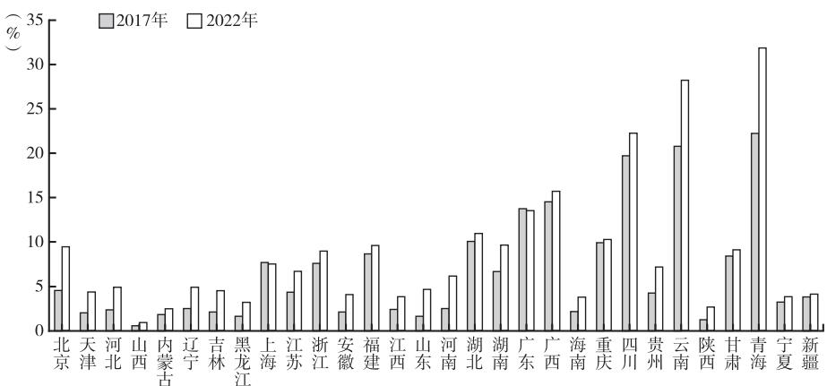
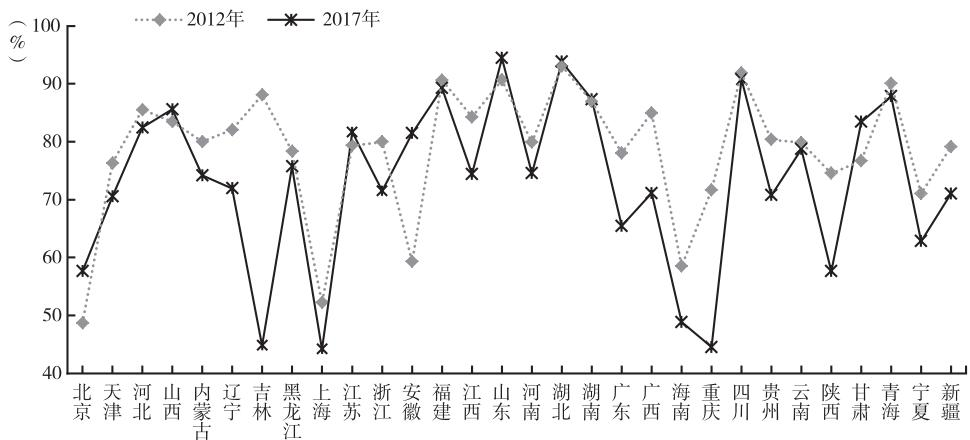
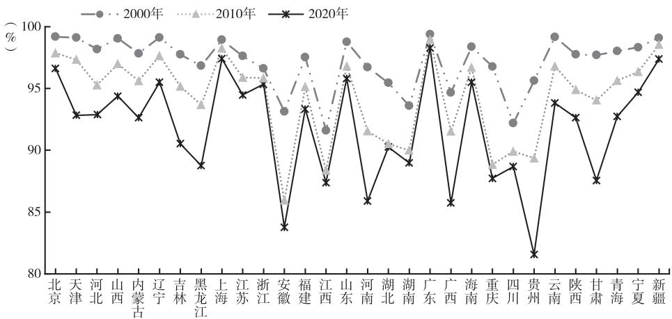
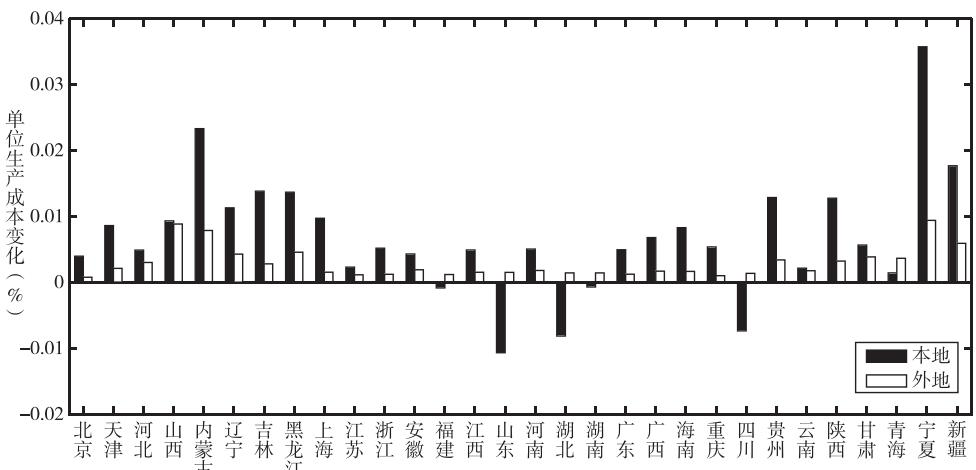
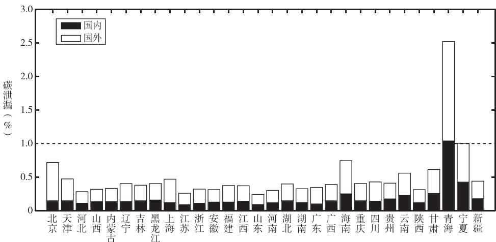

# 控碳政策的区域传导机制与效应

——基于量化空间一般均衡模型的分析

罗良文　罗志鹏

摘要：建立能耗双控向碳排放双控全面转型新机制是健全绿色低碳发展机制的重要一环。本文构建了一个内含贸易关联、劳动迁移决策、控碳约束、碳收益转移等丰富特征的量化空间一般均衡模型，分析了控碳政策的区域传导机制与效应。本文的研究表明：第一，国内单个区域控碳会冲击所有关联地区的生产成本，引发贸易和人口转移，作为结果，非控碳地区的GDP增长效应平均可以抵消控碳地区约38%的GDP损失效应，但其引发的碳泄漏问题也将使得控碳地区碳排放削减成效降低一半左右。第二，控能以间接控碳的效率低于直接控碳，而指令控碳会导致碳成本“融化”，其福利损失是采用碳定价工具控碳的2倍以上，但碳市场的碳收益跨区域转移机制具有扩大区域差距的倾向。第三，更加顺畅的人口流动能够降低控碳的经济与福利损失，而贸易关联则相反，此外，更高的可再生能源与化石能源间替代弹性和可再生能源供给弹性也能够降低控碳损失，“事缓则圆”的政策逻辑同样适用于控碳政策设计。本文为理解控碳政策区域传导机制以及优化区域控碳举措提供了参考。

关键词：量化空间一般均衡　控碳政策传导　区域关联　无谓损失　碳收益转移

## 一、引言

从“十一五”时期到“十四五”时期，中国先后建立起了针对能耗强度、碳排放强度以及能耗总量的控制制度，党的二十大报告指出逐步转向碳排放总量和强度“双控”制度，①党的二十届三中全会进一步明确，建立能耗双控向碳排放双控全面转型新机制。②碳排放总量控制已经提上日程。2024年，国务院办公厅印发的《加快构建碳排放双控制度体系工作方案》进一步明确碳排放双控制度体系建设的时间表：“十五五”时期，指导各地区根据碳排放强度降低目标编制碳排放预算并动态调整；“十六五”时期及以后，推动各地区建立碳排放总量控制刚性约束机制，实行五年规划期和年度碳排放预算全流程管理。过去，特别是在“十三五”能耗双控探索实践中，能耗总量控制为促进高质量发展、应对气候变化发挥了重要作用，但也面临一些挑战。例如，各地区的能源消费总量目标进展出现了一定程度的分化现象，部分地区难以完成能耗总量目标等。在此背景下，进一步完善能耗双控机制、科学谋划设计碳排放总量控制制度成为“积极推动能耗双控转向碳排放双控”的关键课题。

需认识到的是，各地区并非隔绝的“孤岛”，控碳约束除了会对受约束地区造成直接影响外，还将引发间接影响，蔓延至包括所有地区在内的整个经济系统。从这个意义上讲，控碳指标的区域间配置并非易事。许多研究都已指出，区域性公共政策冲击下的成本传递与贸易竞争力重构会影响非受约束地区的消费与价格水平（Ferrari & Ralph，2023），与此同时，也会改变各区域劳动力市场的平衡（Franklin et al.，2024）。在国内大循环不断畅通、区域壁垒逐渐瓦解的背景下，贸易与人口流动等限制条件的加速变化会增强区域间外生冲击的相互影响弹性，总体目标的区域分解执行策略需要积极适应新形势、新变化，在全局视角下统筹安排。

至少可以追溯到Leontief（1970），学者们已经认识到投入产出关联对经济活动环境效应所产生的连锁反应，也不乏大量的文献对此展开讨论，例如，与生态足迹、隐含碳排放等概念相关的研究（王文举、向其凤，2011；Flammer，2013；彭水军等，2016；Lenzen et al.，2018；邢源源等，2023），又如评估贸易与全球价值链重构对不同地区产生差异性环境效应的一系列文献（Cherniwchan，2017；Gao etal.，2024）。相比之下，对环境政策冲击的影响区域性传导以及溢出效应的研究远没有如此充分而明确，因为环境政策的影响面往往是广泛的，且诸如投入产出关联、要素收入份额等结构性参数也会在环境政策下发生改变（倪骁然等，2025）。

回顾已有的涉及环境约束的政策效应传导和溢出的相关文献，首先引发讨论的是环境约束成本在时间维度上的传导与溢出。例如，Lemoine & Rudik（2017）指出气候变化具有惯性且控碳成本受到资本动态的影响，不同时点间的控碳成本具有不同的传递性，控碳强度可以遵循“倒U”型变化，即后期采取逐步放松约束的措施以提高政策效率。Stern et al（. 2022）认为碳减排的节奏与进程关乎不同世代的福利和权利。郑新业等（2023）则指出控碳约束还会产生时间上的财富配置效应，影响代际公平。而随着各国陆续提出具体的环境目标时间表，空间维度的环境约束传导与溢出受到了更多讨论。还有研究认为区域不同的基础设施等投入导致了异质性的研发水平，将更多资源投入发达地区更有利于低碳技术的进步，技术溢出的外部性使得两个地区均获得帕累托改进，能够有效减少全局的政策成本。此外，Bogmans（2015）分析了环境政策的跨国效应，认为生产的投入产出关联具有放大效应，垂直联系增加了环境政策的机会成本，这也意味着当环境的负面影响具有全球性时，通过垂直联系，单个地区更严格的环境政策间接减少了世界其他地区的负面环境影响，但这种空间传导和溢出效应会加剧非合作博弈下的“搭便车”问题，同时可能产生严重的碳泄漏问题。Riekhof et al.（ ）同样指出，一国资源使用制度设置的变化通过贸易对其他国家经济增长产生外部性影响，进而反过来对所有国家的资源使用产生影响，在制定资源政策时需要考虑到这一点。除了环境约束的政策效率外，公平也是一个重要的议题。碳边境调节机制（CBAM）被认为是缓解跨国碳泄漏等问题的高效工具，但其也可能带来一系列公平问题。Ambec et al（. 2024）认为，欧盟碳边境调节机制只会在境内创造公平的竞争环境，并可能将经济导向封闭均衡，且为了扭转碳泄漏，碳边境调节机制需辅以出口退税，这样可以缓解贸易的衰减效应，同时提升境内与境外两部门的福利。Magacho et al.（2024）则认为欧盟碳边境调节机制将对发展中国家的就业、出口和税收造成不成比例的冲击，这会恶化国际发展的公平性，共同但有区别的责任原则意味着发达国家应更多地投资于研发和扩散改造能源密集型产业所需的技术，并承担主要责任。公平问题可以通过将碳边境调节机制收益返还给付款国或将其指定用于技术转让和国际气候融资来解决。

根据这些研究，总体来看，具有动态特征的资本积累是环境政策效应在时间维度上传导的基石。而在空间维度上的传导方面，以中间品贸易为承载的投入产出关联则是当前研究识别环境政策传导与溢出的起点。不过，当区域范围从国际转移到国内时，经济地理学所解释的跨越地理空间的经济主体之间的相互作用成为不可忽视的因素，这些研究与国际贸易理论的研究有本质的区别，即经济主体特别是劳动力可以在区域间流动（Krugman，1991）。而这种空间一般均衡效应下的区域转移平衡无疑会对控碳政策的区域传导与溢出产生进一步的微妙影响。此外，在空间一般均衡效应下，还可能产生控碳的公平性问题，这要求政策制定者在控碳效率与控碳公平之间找到平衡点。

出于上述这些明确的直觉与动机，本文将空间一般均衡分析作为推进研究的主要框架。本文在标准的空间一般均衡模型基础上，引入了能源的生产与消费、碳排放及其约束，并区分了化石能源与非化石能源的使用，以此将控碳政策与控能政策区别开来。除此之外，多层嵌套的CES生产函数设定也使得本文能够讨论长期的要素间的非对称替代，以便刻画在环境规制下有偏技术进步的潜在影响。当然，模型中也同时包含了中间品贸易、劳动迁移决策的标准空间一般均衡效应。工资、各类能源价格、中间品价格、异质性的偏好和生产率差异是经济与人口集聚的主要力量，而贸易成本、迁移成本则作为对冲集聚力量的拥堵。控碳政策的区域间传导与溢出依赖于这些集聚力量以及拥堵而产生。简言之，工人希望靠近公司，而公司希望靠近其他公司，以便能够更便宜地获得最终和中间用途的商品。当控碳约束施加于某个地区时，之前的集聚与拥堵的平衡将被打破，在一般均衡效应下经济发生变化并重新进入新的平衡，在这个过程中，单个区域控碳政策的影响会扩散到与之关联的所有区域。与此同时，这些灵活的空间一般均衡设定，也将使得本文能够把Bogmans（2015）对两区域约束成本的传导问题和碳泄漏问题的简化讨论推广到更加接近现实的多区域维度。

在理论模型的基础上，本文结合人口普查、区域间投入产出关联、区域能源消费等一系列丰富数据对空间一般均衡模型进行了量化基于量化模型模拟了各区域控碳对本地和非控碳区域产生的连锁反应，即包括受政策约束区域在内的所有区域各自受到的影响。单个地区控碳会在改变当地生产成本的同时，重构区域间的贸易竞争力与人口吸引力，在空间一般均衡效应下重塑整个经济格局。在全局层面，更加顺畅的人口流动机制作为平滑控碳影响的通道，有助于降低控碳约束的经济损失。而更加深入的贸易关联则使得区域间经济联系更加紧密，因此，控碳产生的“余波”也更大。

本文的模型主要基于从 Eaton & Kortum（2002）、Redding（2016）的基本框架下发展起来的量化空间一般均衡分析工具，这些方法不仅克服了Dornbusch et al（. 1977）构建的经典李嘉图模型推广到多个区域的理论推导复杂性，且能够结合现实数据，为相关问题找到定量而不仅是定性的答案。结合 Dekle et al（. 2007）推广的精确帽子代数（exact-hat algebra）方法，能够避开某些特定参数的复杂校准工作，同时可以容易地模拟政策制定者感兴趣的反事实问题，而将反事实政策结果与实际政策进行对比的能力也使本文能够衡量不同理论机制的现实重要性。近年来，量化空间一般均衡模型获得了较为广泛的应用，例如，Tombe & Zhu（2019）、赵扶扬和陈斌开（2021）、周慧珺和龚六堂（2024）、Franklin et al（. 2024）、林晨和李宇潇（2024）等的工作，虽然这些研究在方法论上与本文类似，但是从研究的核心主题与机制看，这些研究主要聚焦于生产率变化、土地配置、收入分配、就业政策等方面，并未引入和讨论能源或碳排放相关的机制。与本文主题类似，钟粤俊等（2023）、段玉婉等（2023）对能源与碳排放相关问题进行了分析。但钟粤俊等（2023）主要讨论的是经济集聚对能源产生的节约效应，本文则重点聚焦于分析控碳约束的潜在影响及其跨区域传导机制。段玉婉等（2023）对能源供需和碳成本约束均进行了细致刻画，但该研究主要聚焦于全球化背景下中国碳市场的福利效应，而本文着重刻画了国内不同区域间的关联特征，同时也进一步引入劳动迁移决策机制讨论人口流动对控碳成本传递和区域碳泄漏的影响。除此之外，本文的鲜明特色和独到之处还包括：（1）本文设定的多层嵌套的CES生产函数及其在精确帽子代数方法下的简洁推导，使得本文可以在不失一般性的情况下讨论差异化的要素替代弹性而要素替代弹性是控碳不可忽视的重要因素：(2)本文模型具有很强的拓展性，不仅能够区分控能与控碳政策，还将控碳指令、碳市场、碳税统一在同一框架下；（3）本文还分析了区域控碳产生的国内与国际碳泄漏，以及碳收益转移引发的公平性问题。

此外，随着 Kelejian & Prucha（2010）、Lee & Yu（2010）等开发出了一系列简单高效的空间计量估计方法，较多与环境政策相关的经验研究中均涉及空间溢出效应。同时，也有部分研究考虑到了投入产出关联的成本转嫁。但无论是空间计量中的空间溢出效应还是传统的投入产出关联效应，均将结构性的关联看作外生给定的份额，而非模型内生决定的结果，其中隐含的问题正如Redding &Rossi-Hansberg（2017）所指出的那样，由于从模型到经验规范的映射往往不明确，其系数随政策干预变化而保持不变，容易陷入“卢卡斯批判”之中，因此很难进行令人信服的反事实政策模拟。相比而言，本文所提及的控碳政策的区域传导，它不是简单地参照诸如Fujita et al（. 2001）所批评的局部溢出效应等不精确的概念假设得来，而是将贸易关联、人口迁移作为内生模型的结果而得出。因此，本文的理论框架也使得本文有别于上述研究。

## 二、政策演进与典型事实

## （一）区域控能与控碳的政策演进

中国的控碳政策与国际温控目标紧密联系，国际温控目标主要着眼于远景，中国国家和地区层面的控碳目标则主要为五年计划和年度计划。中国从“十一五”时期到“十二五”时期，先后建立起了能耗强度以及碳排放强度控制制度，“十三五”时期开始实施能耗双控制度，《中华人民共和国国民经济和社会发展第十三个五年规划纲要》首次明确了能耗总量控制的数值目标，提出“能源消费总量控制在50亿吨标准煤以内”，同时将目标逐级分解并实施考核。但在“十三五”能耗双控的探索实践中，各地区的能源消费总量目标进展出现了分化现象，特别是一些经济增长较快、发展质量较高的地区难以完成能耗总量目标。在此背景下，《中华人民共和国国民经济和社会发展第十四个五年规划纲要》不再设立明确的约束性数值目标，主要以“得到合理控制”进行弹性管理。2021年，国家发展改革委印发《完善能源消费强度和总量双控制度方案》，进一步强调“增强能源消费总量管理弹性”，并提出“推行用能指标市场化交易”等弹性措施，控能方式逐渐往政府目标结合市场化举措转变。2022年，党的二十大报告指出，逐步转向碳排放总量和强度“双控”制度。①随后，中央全面深化改革委员会第二次会议审议通过《关于推动能耗双控逐步转向碳排放双控的意见》。2024年，国务院办公厅印发《加快构建碳排放双控制度体系工作方案》，进一步明确碳排放双控制度体系建设的时间表：“十五五”时期，指导各地区根据碳排放强度降低目标编制碳排放预算并动态调整；“十六五”时期及以后，推动各地区建立碳排放总量控制刚性约束机制，实行五年规划期和年度碳排放预算全流程管理。同时也再次强调，“发挥市场机制调控作用”。相比于用能权市场化交易，中国探索市场化控碳工具时间较早，转向控碳不仅可以鼓励可再生能源发展，而且较为成熟的碳定价与碳交易工具也能够为实现控碳目标提供有力支撑。

总体来看，中国控碳策略从控能以间接控碳向“间接+直接”控碳层层递进，从控强度向控总量逐渐强化约束力，从政府目标层层分解向政府结合市场弹性管理稳步转变。

## （二）区域能源结构

控能虽然能够间接实现控碳，但是它与直接控碳之间会在两个方面产生分化，第一个是能源消费结构的差异，第二个是技术导向的差异。由于控能的“打击面”太广，太过严苛的控能措施可能抑制可再生能源的增长，另外也会部分迟滞可再生能源应用技术的研发。当然，无差别的节能技术研发会受到极大的促进。但是节能技术所带来的能效提升，也可能产生回弹效应，进一步刺激能源的使用。因此，严苛的能耗约束策略不仅可能对经济造成较大的损伤，可能还会恶化碳排放的情况，特别是无法鼓励地区加快实现可再生能源替代。而当控能转向控碳时，碳排放权的分配天然向可再生能源倾斜，这无疑促使可再生能源生产成本低、可再生能源增长快的地区的实际束缚减弱，有助于实现“双碳”目标战略和能源革命的双重目的。

地区的能源消费结构表征了地区由生产技术区别而形成的能源投入差异，在其他条件不变的情况下，更高的可再生电力消费占比地区，削减一单位能耗所带来的碳排放削减量更低。换言之，削减一单位碳排放需要能耗的减少水平更高，这也使得该地区直接的减排边际成本更大。图 1展示了2017年和2022年各地区可再生电力消费占能源总消费的比重，其中，地区能源消费量包括化石能源与可再生电力消费量化石能源消费量根据区域能源平衡表由的煤炭石油天然气三种主要能源消费量折标煤加总计算得到，可再生电力消费量根据核能、风力、太阳能、水力四种可再生电力消纳量折标煤加总计算得到。整体来看，2017—2022年，各地区的可再生电力消费占比普遍有所提高。从区域差距来看，地区间的能源结构差异较大。但是，在2017—2022年，各地区可再生电力消费占比的相对顺序并没有发生太大改变，这表明地区间在能源消费结构上的相对竞争力具有一定的稳定性。

  
图1　各地区可再生电力消费占比  
注：由于西藏自治区的能源公开数据有较多缺失，因此，本文没有汇报西藏自治区的结果，下同。  
数据来源：《中国能源统计年鉴》《2017年度全国可再生能源电力发展监测评价报告》《2022年度全国可再生能源电力发展监测评价报告》。

## （三）区域贸易与人口迁移

贸易与劳动迁移作为典型的区域关联特征，在空间一般均衡效应下，能够对控碳约束的传导产生间接的潜在影响。区域贸易是区域间互联互通的重要体现。图2汇报了2012年及2017年各地区本地投入占总投入的比例，其中，本地投入包含了增加值以及本地的中间品投入。这一比例越低，说明该地区与外地的生产关联越紧密。总体上看，2012—2017年，各地区本地投入占总投入的比例的平均值从 下降至 ，区域关联交错的格局有所加深。从 年的情况看，对外生产关联较紧密的地区为吉林、上海、重庆，这些区域的本地投入比例低于50%。而对外生产关联较弱的地区为山东、湖北、四川，这些区域的本地投入比例高于90%。

  
图2　各地区本地投入占总投入比例  
数据来源：《中国多区域投入产出模型：1987-2017年》（李善同，2023）。

随着中国城镇化和工业化的推进，人口流动的规模也在不断扩大。图3汇报了本地户籍居民在地区人口中所占的比例。可以发现，各地区的这一比例均呈现出下降趋势，换言之，人口迁移的规模在不断扩大。根据数据，地区人口中本地户籍居民的平均占比从2000年的97.20%下降至2010年的94.43%，到

2020年进一步下降到91.90%。2000年、2010年、2020年人口迁出的规模分别为4241万人、8587万人、1.2亿人。此外，2001年中国启动户籍制度改革，极大地提升了居民迁移户口的可能性和便利性，因此，如果考虑那些已经将户口迁至迁移目的地的居民，人口迁移的规模可能远超上述数据所显示的情况。

  
图3　本地户籍居民占比  
数据来源：《中国人口普查年鉴》。

上述的特征事实一方面凸显了控能向控碳转变的政策逻辑与现实意义，另一方面也展示了区域间较深的能源、贸易以及人口的嵌入关联特性。并且，这种嵌入关联特性呈现出逐渐强化的趋势，无论是区域控能约束还是区域控碳约束，若仅基于约束实施区域的特征制定控碳策略，政策的实际效果与预期效果间可能存在较大的偏差。有鉴于此，本文将建立一个内含贸易关联、劳动迁移决策、控碳约束、碳收益转移等丰富特征的量化空间一般均衡模型，在分析控碳政策的区域传导机制和效应时，将区域间的互动内生化地纳入考虑。

## 三、理论模型

在进行正式建模之前，首先对模型的环境进行概述。假设有N-1个国内区域和1个国外区域，本国居民可以在国内跨区域流动，但无法进行跨国流动。居民消费商品获得效用，具有异质性偏好。商品是由厂商集合劳动、能源、中间品所生产的，投入产出联系是迂回的。所有居民均无弹性供给1单位的劳动。①区域能源的实际使用成本在能源市场价格基础上受到约束性政策的间接加价。在碳税、碳市场政策下，间接加价转变为碳收益；而在指令政策下，间接加价成为无谓损失。

## （一）厂商技术、贸易份额与价格水平

中间品的生产需要投入具有替代性的劳动 $L _ { n } ( f )$ 、能源 $E _ { n } \left( f \right)$ 以及中间品复合物 $M _ { n } ( f ) $ ，并以嵌套CES生产函数组合而成。其中，能源由具有替代性的化石能源 $E _ { n } ^ { F } ( f )$ 和可再生能源ER(f)组合而成，化石能源则由具有替代性的煤炭 $E _ { n } ^ { C } ( f )$ 、石油 $E _ { n } ^ { O } \left( f \right)$ 、天然气 $E _ { n } ^ { G } ( f )$ )组合而成。具体如下：

$$
y _ {n} (f) = z _ {n} (f) \left\{\left(\chi_ {n} ^ {L}\right) ^ {\frac {1}{\rho_ {1}}} \left[ L _ {n} (f) \right] ^ {\frac {\rho_ {1} - 1}{\rho_ {1}}} + \left(\chi_ {n} ^ {E}\right) ^ {\frac {1}{\rho_ {1}}} \left[ E _ {n} (f) \right] ^ {\frac {\rho_ {1} - 1}{\rho_ {1}}} + \left(\chi_ {n} ^ {M}\right) ^ {\frac {1}{\rho_ {1}}} \left[ M _ {n} (f) \right] ^ {\frac {\rho_ {1} - 1}{\rho_ {1}}} \right\} ^ {\frac {\rho_ {1}}{\rho_ {1} - 1}}\tag{1}
$$

$$
E _ {n} (f) = \left\{\left(\chi_ {n} ^ {F}\right) ^ {\frac {1}{\rho_ {2}}} \left[ E _ {n} ^ {F} (f) \right] ^ {\frac {\rho_ {2} - 1}{\rho_ {2}}} + \left(\chi_ {n} ^ {R}\right) ^ {\frac {1}{\rho_ {2}}} \left[ E _ {n} ^ {R} (f) \right] ^ {\frac {\rho_ {2} - 1}{\rho_ {2}}} \right\} ^ {\frac {\rho_ {2}}{\rho_ {2} - 1}}\tag{2}
$$

$$
E _ {n} ^ {F} (f) = \left\{\left(\chi_ {n} ^ {C}\right) ^ {\frac {1}{\rho_ {3}}} \left[ E _ {n} ^ {C} (f) \right] ^ {\frac {\rho_ {3} - 1}{\rho_ {3}}} + \left(\chi_ {n} ^ {O}\right) ^ {\frac {1}{\rho_ {3}}} \left[ E _ {n} ^ {O} (f) \right] ^ {\frac {\rho_ {3} - 1}{\rho_ {3}}} + \left(\chi_ {n} ^ {G}\right) ^ {\frac {1}{\rho_ {3}}} \left[ E _ {n} ^ {G} (f) \right] ^ {\frac {\rho_ {3} - 1}{\rho_ {3}}} \right\} ^ {\frac {\rho_ {3}}{\rho_ {3} - 1}}\tag{3}
$$

其中， ${ } _ { y _ { n } } ( f )$ 为n地区中间品f的产出， ${ \cdot } \chi _ { n } ^ { \bullet }$ 为要素的权重参数， $z _ { n } ( f )$ 为厂商的生产率水平，并假设$z _ { n } \left( f \right)$ 以独立同分布的方式从 $\mathrm { F r } \acute { \mathrm { e c h e t } } \left( T _ { n } , \theta \right)$ 中抽取得到。具体地，该分布的累积分布函数为$\begin{array} { r } { F _ { n } ( z ) = e ^ { - T _ { n } z ^ { - \theta } } } \end{array}$ ，其中，T 描述了各地区贸易的绝对优势，贸易弹性θ则体现出地区贸易的比较优势。$\rho _ { 1 } { \setminus } \rho _ { 2 } { \setminus } \rho _ { 3 }$ 分别为不同要素间的替代弹性。由于产出的规模报酬不变且中间品市场完全竞争，异质性厂商中间品的价格等于单位产出的成本除以异质性生产率，即 ${ p } _ { n } ( f ) { = } { c } _ { n } { \big / } z _ { n } ( f ) ,$ 。其中， $c _ { n }$ 表示单位产出的成本，即单位产出需要的投入束。根据CES生产函数的嵌套关系，可以得到：

$$
c _ {n} = \left[ \chi_ {n} ^ {L} \left(w _ {n}\right) ^ {1 - \rho_ {1}} + \chi_ {n} ^ {E} \left(q _ {n} ^ {E}\right) ^ {1 - \rho_ {1}} + \chi_ {n} ^ {M} \left(P _ {n}\right) ^ {1 - \rho_ {1}} \right] ^ {\frac {1}{1 - \rho_ {1}}}\tag{4}
$$

$$
q _ {n} ^ {E} = \left[ \chi_ {n} ^ {F} \left(q _ {n} ^ {F}\right) ^ {1 - \rho_ {2}} + \chi_ {n} ^ {R} \left(q _ {n} ^ {R}\right) ^ {1 - \rho_ {2}} \right] ^ {\frac {1}{1 - \rho_ {2}}}\tag{5}
$$

$$
q _ {n} ^ {F} = \left[ \chi_ {n} ^ {C} \left(q _ {n} ^ {C}\right) ^ {1 - \rho_ {3}} + \chi_ {n} ^ {O} \left(q _ {n} ^ {O}\right) ^ {1 - \rho_ {3}} + \chi_ {n} ^ {G} \left(q _ {n} ^ {G}\right) ^ {1 - \rho_ {3}} \right] ^ {\frac {1}{1 - \rho_ {3}}}\tag{6}
$$

其中， ${ \boldsymbol { \ w } } _ { n } { \boldsymbol { \cdot } } { \boldsymbol { P } } _ { n }$ 分别为地区n的工资水平、中间品复合物价格。 $q _ { n } ^ { E }$ 为控碳或控能约束下企业实际的能源使用成本，其取决于实际的化石能源使用成本 $q _ { n } ^ { F }$ 和实际的可再生能源使用成本 $q _ { n } ^ { R } .$ 。而实际的化石能源使用成本则进一步由实际的煤炭使用成本 $q _ { n } ^ { C }$ 、石油使用成本 $q _ { n } ^ { O }$ 、天然气使用成本 $q _ { n } ^ { G }$ 决定。四种基础能源的实际使用成本等于其市场价格加上政策遵从成本，即 $q _ { n } ^ { e } = P _ { n } ^ { e } + \lambda _ { n } ^ { e } ,$ ，其中， $e \in \{ R , C , O , G \}$ 。当施加控能约束时， $\lambda _ { n } ^ { e } = v ^ { e } \lambda _ { n } , v ^ { e }$ 为能源e的折标煤系数， $, \lambda _ { n }$ 为与地区能耗削减幅度成正比的政策强度。当施加控碳约束时， $\lambda _ { n } ^ { e } = k ^ { e } \lambda _ { n } , k ^ { e }$ 为能源 $e$ 的碳排放系数。 $\lambda _ { n }$ 为与地区碳排放削减幅度成正比的政策强度度量，更加具体地讲， $\lambda _ { n }$ 等于特定碳排放（能耗）约束下的碳排放权（用能权）的影子价格，在本文给定的经济环境下，它由碳排放（能耗）约束值唯一确定。当政策强度提高时，由于不同种类能源的替代性，折标煤系数与碳排放系数更高的能源将被系数更低的能源部分替代。与此同时，能源也会被劳动或中间品复合物部分替代。

假设区域间贸易存在冰山成本形式的贸易成本 $d _ { n i }$ ，生产地政府征收生产税税率为t，则在n地购买i地产品f的价格为：

$$
P _ {n i} (f) = \frac {c _ {i} \left(1 + t _ {i}\right)}{z _ {i} (f)} d _ {n i}\tag{7}
$$

则基于生产率的分布假设，i地区的商品在n地区的价格最低的概率为：

$$
\pi_ {n i} = \operatorname * {P r} \left\{\frac {c _ {i} \left(1 + t _ {i}\right)}{z _ {i} (f)} d _ {n i} \leqslant \min _ {i ^ {\prime} \neq i} \left[ \frac {c _ {i ^ {\prime}} \left(1 + t _ {i ^ {\prime}}\right)}{z _ {i ^ {\prime}} (f)} d _ {n i ^ {\prime}} \right] \right\} = \frac {T _ {i} \left[ c _ {i} \left(1 + t _ {i}\right) d _ {n i} \right] ^ {- \theta}}{\sum_ {m = 1} ^ {N} T _ {m} \left[ c _ {m} \left(1 + t _ {m}\right) d _ {n m} \right] ^ {- \theta}}.\tag{8}
$$

记 $X _ { n i }$ 为地区n对地区i商品的总支出。地区n将采购到的中间品通过CES函数组合为中间品复合物：

$$
Q _ {n} = \left[ \int_ {0} ^ {1} y _ {n} (f) ^ {\frac {\sigma - 1}{\sigma}} d f \right] ^ {\frac {\sigma}{\sigma - 1}}\tag{9}
$$

其中，σ为中间品的替代弹性。中间品复合物可以用于最终使用或重新投入生产。根据生产率

的分布特性，可以求解出中间品复合物价格，n地区产品的中间品复合物价格为：①

$$
P _ {n} = \gamma_ {1} \left\{\sum_ {m = 1} ^ {N} T _ {m} \left[ c _ {m} (1 + t _ {m}) d _ {n m} \right] ^ {- \theta} \right\} ^ {- \frac {1}{\theta}}\tag{10}
$$

在能源的供给方面，本文采用Egger & Nigai（2015）、段玉婉等（2023）的设定，认为化石能源以国际统一价格在国际市场中进行贸易，价格由全球总供需决定，而可再生能源价格由地区供需决定。化石能源的供给函数为 $u ^ { f e } = B ^ { f e } \big ( \ v { p } ^ { f e } \big ) ^ { \eta ^ { f e } }$ ，其中 $f e \in \{ C , O , G \} , B ^ { f e }$ 为各化石能源的供给转换参数， $\cdot \eta ^ { f e }$ 为各化石 能 源 的 供 给 弹 性 。 地 区 n 对 化 石 能 源 $f e$ 的 需 求 为 $g _ { n } ^ { f e } { = } ( \gamma _ { n } ^ { f e } Y _ { n } ) \big / \big ( P _ { n } ^ { f e } { + } \lambda _ { n } ^ { f e } \big )$ 。 其 中 ， $\boldsymbol { Y } _ { n } =$ $\sum { _ { i = 1 } ^ { N } X _ { i n } } / ( 1 + t _ { n } )$ 为 n地区的总产出，γfe为化石能源的产出份额。 $\textcircled{2}$ 可再生能源的供给函数为 $u _ { n } ^ { R } =$ $B _ { n } ^ { R } \Big ( P _ { n } ^ { R } \Big ) ^ { \eta ^ { R } } \mathrm { ~ c ~ }$ 。B 为可再生能源的供给转换参数， $\eta ^ { R }$ 为可再生能源的供给弹性，地区n对可再生能源的需求为 $g _ { n } ^ { R } { = } ( \gamma _ { n } ^ { R } Y _ { n } ) \big / \big ( P _ { n } ^ { R } + \lambda _ { n } ^ { R } \big )$ 。则地区碳排放为 $C _ { n } { = } \sum _ { e } k ^ { e } g _ { n } ^ { e }$ ，地区能耗为 $O _ { n } = \sum _ { e } { v ^ { e } g _ { n } ^ { e } }$ O

## （二）收入分配

地区居民收入为地区劳动收入与地区公共收入的加总，即 $I _ { n } = w _ { n } L _ { n } + A _ { n \circ }$ 其中，地区公共收入为 $A _ { n } = T _ { n } + ( 1 - \varpi ) H _ { n } + E R _ { n } + C T _ { n } + D _ { n }$ ，它由五部分构成，第一个部分 $T _ { n } { = } t _ { n } Y _ { n }$ 为地区税收收入。第二部分 $\begin{array} { r } { H _ { n } { = } \sum _ { e } \Bigl [ ( \lambda _ { n } ^ { e } \gamma _ { n } ^ { e } Y _ { n } ) / ( \ p _ { n } ^ { e } + \lambda _ { n } ^ { e } ) \Bigr ] } \end{array}$ 为地区潜在的碳排放权（用能权）收益，但仅在经济系统中存在碳定价机制时才能获取(例如碳税或碳市场）在控碳(能)指令下碳排放权(用能权)收益会“融化”造成无谓损失，定义 $\varpi$ 为无谓损失率，当处在纯粹的指令控制下时 $\varpi = 1$ ，碳收益完全“融化”。第三部分 $E R _ { n } { = } \sum _ { e } { p _ { n } ^ { e } g _ { n } ^ { e } }$ 为地区能源销售收入。第四部分 $C T _ { n } = \lambda _ { n } ^ { e } ( C _ { n } ^ { q u o } - C _ { n } )$ 为碳排放权（用能权）的转移收入， $C _ { n } ^ { q u o }$ 为碳排放权（用能权）市场交易工具下地区碳排放总配额，当控碳（能）工具为碳税或指令时，无碳配额，碳排放权（用能权）收益转移的通道关闭， $C T _ { n } = 0$ ，该条件下若继续满足 $\varpi = 0$ ，则为碳税机制情景。此外，在碳排放权（用能权）市场交易工具下，地区所有企业的加总碳排放高于地区所有企业的加总碳配额时，地区加总碳收益向外流出，反之则向内流入，若相等则说明地区碳交易实现收支平衡。第五部分 $D _ { n }$ 为总贸易赤字，根据段玉婉等（2023）的设定，总贸易赤字包含了商品贸易赤字$\begin{array} { r } { D _ { n } ^ { Y } { = } \sum _ { i = 1 } ^ { N } \bigl [ X _ { n i } / ( 1 - t _ { i } ) \bigr ] { - } \sum _ { i = 1 } ^ { N } \bigl [ X _ { i n } / ( 1 - t _ { n } ) \bigr ] } \end{array}$ 与能源贸易赤字 $\begin{array} { r } { D _ { n } ^ { E } = \sum _ { e } \left( \mathbf { \nabla } \rho ^ { e } u _ { n } ^ { e } - \mathbf { \nabla } \rho ^ { e } g _ { n } ^ { e } \right) } \end{array}$ ，满 足 ${ \cal D } _ { n } =$ $D _ { n } ^ { Y } + D _ { n } ^ { E }$ 。总贸易赤字设定为外生，且 $\begin{array} { r } { \sum _ { n = 1 } ^ { N } D _ { n } = 0 } \end{array}$ 。

## （三）居民偏好与迁移决策

居民通过消费商品获得效用，居住在地区n且户籍地为地区i的居民h的效用由式（11）给出：

$$
U _ {n i} (h) = \varepsilon_ {n} (h) V _ {n i} (h)\tag{11}
$$

其中，居民的偏好分为两个部分。一部分是异质性偏好 $\varepsilon _ { n } { \big ( } h { \big ) }$ ，异质性偏好以独立同分布的方式从 ( ，κ)抽取得到，该分布的累积概率密度函数为 $F _ { n } \left( \varepsilon \right) = e ^ { - \varepsilon ^ { - \kappa } }$ ，迁移弹性κ是居民异质性偏好分散的反测度。异质性偏好捕捉了居民对某个地区特殊的定居倾向。另一部分为居民的实际收入 $\textstyle V _ { n i } ( h )$ 。

由于迁移人口分享当地公共服务在一定程度上与户籍挂钩（陆铭、李鹏飞，2022），外地迁入居民可能无法获得与本地户籍居民等同的公共服务，因此，在模型中引入公共服务可及性差异。记任意

①其中 $, \gamma _ { 1 } = \left[ { \frac { { \cal { { T } } } ( \theta + 1 - \sigma ) } { \theta } } \right] ^ { \frac { 1 } { \sigma - 1 } } , { \cal { { T } } } ( \cdot ) \rlap / { \jmath } { \rlap / { \jmath } } \star \mathrm { { { \rangle } \rlap / { \jmath } { \Uparrow } { \rlap / { \jmath } } { \times } \jmath { \downarrow } \mathrm { { \rangle } \mit { \ ! } } \mathrm { {  { g a m m a \bar { \mit { E } } } } } } }$ 函数。

②值得说明的是，由于本文生产函数采用了CES形式，因此产出份额是内生变量。根据谢波德（Shephard’s lemma）引理，可以推导出CES生产函数下的要素产出份额为 $\gamma _ { n } ^ { \bullet } { = } \chi _ { n } ^ { \bullet } \bigg ( { \frac { P _ { n } ^ { \bullet } } { \vartheta _ { n } } } \bigg ) ^ { 1 - \varsigma } .$ 。χ•为权重参数， ${ . P _ { n } ^ { \bullet } }$ 为要素价格，ϑ 为单位投入束的成本（the cost of an input bundle），ς 为替代弹性。

从i地迁往n地的居民群体均可以获得的基本劳动收入为 $\tilde { I _ { n i } } = \ w _ { n } L _ { n i }$ ，假设外地迁入居民只能享受部分公共服务。为了刻画这种差异特性，本文设置了公共服务可及率 $\delta _ { \textrm { \scriptsize C } }$ 。不同地区迁往地区n的居民群体获得的公共收入如下：

$$
A _ {n i} = \left\{ \begin{array}{l} \frac {L _ {n i}}{L _ {n}} (\delta A _ {n}) \quad , n \neq i \\ \frac {L _ {n i}}{L _ {n}} (\delta A _ {n}) + (1 - \delta) A _ {n}, n = i \end{array} \right.\tag{12}
$$

当公共服务可及率为 $\delta = 1$ 的极端情形时，本地户籍居民和外地迁入居民均等共享公共服务，当公共服务可及率为 $\delta = 0$ 的极端情形时，仅有本地户籍居民能够获得当地公共服务。不同地区迁往地区n的居民群体的收入为 $I _ { n i } { = } \tilde { I } _ { n i } + A _ { n i }$ ，则地区n的居民总收入为 $\begin{array} { r } { I _ { n } = \sum _ { i = 1 } ^ { N } I _ { n i 0 } } \end{array}$

由于居民有异质性的定居偏好，因此居民在迁移决策中还面临异质性的效用损失。假设当居民从 i地区迁移至 n地区时，面临 $\left( 1 - 1 / \mu _ { n i } \right)$ 效用损失， $, \mu _ { n i } \geqslant 1 .$ 。当 $n = i$ 时， $, \mu _ { n i } = 1$ 。定义 i地区迁往 n地区居民群体的人均实际收入为 $\boldsymbol { V } _ { n i } = \boldsymbol { I } _ { n i } / ( \boldsymbol { L } _ { n i } \boldsymbol { P } _ { n } )$ 。根据大数定律以及居民的效用最大化决策，户籍地为i地区的居民迁往n地区的人口数量占比为：

$$
m _ {n i} = \operatorname * {P r} \left(\varepsilon_ {n} V _ {n i} / \mu_ {n i} \geqslant \max _ {n ^ {\prime} \neq n} \varepsilon_ {n ^ {\prime}} V _ {n ^ {\prime} i} / \mu_ {n ^ {\prime} i}\right) = \frac {\left(V _ {n i} / \mu_ {n i}\right) ^ {\kappa}}{\sum_ {m = 1} ^ {N} \left(V _ {m i} / \mu_ {m i}\right) ^ {\kappa}}\tag{13}
$$

## （四）市场出清与均衡定义

地区n的总支出包括厂商生产用途的中间品复合物支出、居民最终使用用途的中间品复合物支出，以及未进行分配、无法重新进入经济循环的无谓损失。因此，地区产品市场的出清条件为：

$$
X _ {n} = I _ {n} + \gamma_ {n} ^ {M} \sum_ {i = 1} ^ {N} \frac {X _ {i n}}{\left(1 + t _ {n}\right)} + \varpi H _ {n}\tag{14}
$$

其中， $. X _ { n } { = } P _ { n } Q ,$ 为地区n的名义支出， $\gamma _ { n } ^ { M }$ 为中间品收入份额。由于无谓损失无法再进入经济循环，导致地区有效的支出需求减少，①并在投入产出结构中产生乘数效应。因此，地区n对地区i最终的有效支出为 $X _ { n i } { = } \pi _ { n i } ( X _ { n } { - } \varpi H _ { n } )$ 。

区域内的劳动力市场出清条件为：

$$
w _ {n} L _ {n} = \gamma_ {n} ^ {L} \sum_ {i = 1} ^ {N} \frac {X _ {i n}}{\left(1 + t _ {n}\right)}\tag{15}
$$

其中，γL为劳动收入份额。区域间的劳动力市场出清条件为：

$$
L _ {n i} = m _ {n i} \bar {L} _ {i}\tag{16}
$$

其中， $\bar { L } _ { i }$ 为i地区的户籍人口数量。化石能源市场出清条件为：

$$
B ^ {f e} \left(p ^ {f e}\right) ^ {\eta^ {f e}} = \frac {\gamma_ {n} ^ {f e}}{P ^ {f e} + \lambda_ {n} ^ {f e}} Y _ {n}\tag{17}
$$

可再生能源市场出清条件为：

$$
B _ {n} ^ {R} \left(p _ {n} ^ {R}\right) ^ {\eta^ {R}} = \frac {\gamma_ {n} ^ {R}}{P _ {n} ^ {R} + \lambda_ {n} ^ {R}} Y _ {n}\tag{18}
$$

此外，在控碳约束下，地区碳排放需要满足约束 $C _ { n } = C _ { n } ^ { T r }$ ；在控能约束下，地区能耗需要满足约束 $O _ { n } = O _ { n } ^ { T r }$ 。结合市场出清条件，可以对模型的均衡进行定义。本文在进行均衡定义之前，首先采用 Dekle et al.（2007）推广的精确帽子代数将模型转换为新旧状态变化的比值形式表示，即$\hat { X } { = } X ^ { \prime } / X _ { c }$ 。这一操作是量化贸易文献中的标准做法。在本文模型中运用该方法，其优势在于，它不需要显式地估计 $\left\{ \begin{array} { l l } { T _ { n } , B _ { n } ^ { R } , B ^ { f e } , \chi _ { n } ^ { \bullet } , \mu _ { n i } , d _ { n i } , \sigma } \end{array} \right\}$ ，并且确保了所有的反事实结果都是基于同一基准计算出来的。

基于此，本文模型在相对变化下的均衡可以定义为：给定地区控碳（能）约束 $\{ \hat { C } _ { n } ^ { T r } \} ( \{ \hat { O } _ { n } ^ { T r } \} )$ ）、外生变量和参数 $\left\{ \kappa , \theta , \varpi , \delta , \rho _ { 1 } , \rho _ { 2 } , \rho _ { 3 } , \eta ^ { e } , \upsilon ^ { e } , k ^ { e } , t _ { i } , C _ { n } ^ { q u o } \right\}$ 、基期变量 $\left\{ X _ { n i } , m _ { n i } , \bar { L } _ { i } , \gamma _ { n } ^ { L } , \gamma _ { n } ^ { e } , \gamma _ { n } ^ { M } , g _ { n } ^ { e } , C _ { n } \right\}$ ，竞争性均衡可以由一组内生变量 $\left\{ \hat { P } _ { n } , \hat { w } _ { n } , \hat { L } _ { n i } , \hat { P } _ { n } ^ { e } , \lambda _ { n } ^ { e } \right\}$ 唯一确定，该组内生变量中的均衡价格和劳动分布确保了所有市场都实现出清，碳排放（能耗）满足约束，且该均衡价格和劳动分布下的分配能够最大化代理人（居民和厂商）的决策目标（效用和利润）。此外，为了让本文的均衡系统更加直观，本文还展示了模型的“浓缩均衡条件”，模型均衡可以看作由 $\left( 3 N { + } N { \times } N { + } 3 \right)$ ）个方程和 $\left( 3 N \mathrm { + } N { \times } N \mathrm { + } 3 \right)$ ）个未知数构成的方程组系统。①根据瓦尔拉斯法则，设定一个标准化价格条件，并给定控碳（能）约束向量，即可对应求解内生变量及其对应的均衡配置。

## （五）目标变量及其变化

根据控碳政策讨论中常关注的经济后果与非经济后果，本文主要对GDP、居民福利、国内地区经济发展差距的变化进行定义和展示。根据生产法核算，地区 GDP的变化可以表示为 $\widehat { G D P _ { n } } =$ $\overline { { ( 1 - \gamma _ { n } ^ { M } ) } } \hat { Y } _ { n } \Big / \hat { P } _ { n }$ ，即总投入中去除中间投入后的地区增加值；地区福利的变化则可以表示为 $\hat { W } _ { n } =$ $\hat { V } _ { n n } \hat { m } _ { n n } ^ { - 1 / \kappa }$ 。

国内地区加总GDP变化可以表示为：

$$
\widehat {G D P} = \sum_ {n = 1} ^ {N - 1} \phi_ {n} \widehat {G D P _ {n}}\tag{19}
$$

其中，权重 $\begin{array} { r } { \phi _ { n } = ( 1 - \gamma _ { n } ^ { { \scriptscriptstyle M } } ) Y _ { n } \Big / \Big [ \sum _ { n = 1 } ^ { { \scriptscriptstyle N } - 1 } ( 1 - \gamma _ { n } ^ { { \scriptscriptstyle M } } ) Y _ { n } \Big ] \circ } \end{array}$ 。国内福利变化可以表示为：

$$
\hat {W} = \sum_ {i = 1} ^ {N - 1} \psi_ {i} \frac {V _ {i i} m _ {i i} ^ {- \frac {1}{\kappa}}}{\sum_ {i = 1} ^ {N - 1} \psi_ {i} V _ {i i} m _ {i i} ^ {- \frac {1}{\kappa}}} \hat {V} _ {i i} \hat {m} _ {i i} ^ {- \frac {1}{\kappa}}\tag{20}
$$

其中，权重 $\begin{array} { r } { \psi _ { i } = \bar { L } _ { i } / \sum _ { i = 1 } ^ { N - 1 } \bar { L } _ { i } } \end{array}$ 。国内地区经济发展差距采用基尼系数衡量，计算方法为，先将国内各地区 $G D P _ { n }$ 从小到大排序，得到 $G D P _ { 1 } , G D P _ { 2 } , \cdots , G D P _ { N - 1 }$ ，基期的基尼系数可以定义为：

$$
G N = \frac {\sum_ {n = 1} ^ {N - 1} G D P _ {n} [ 2 n - (N - 1) - 1 ]}{(N - 1) \sum_ {n = 1} ^ {N - 1} G D P _ {n}}\tag{21}
$$

基尼系数的变化为 $\widehat { G N } = G N ^ { \prime } / G N ,$

## 四、数据与参数选取

数据方面。本文主要用到的基础数据包括地区间的投入产出关联数据、人口迁移数据、能源数据。地区间的投入产出关联数据基于李善同（2023）整理得到的2017年内嵌中国省份的全球多区域投入产出表。基础的能源数据主要来自《能源统计年鉴》以及各地区的统计年鉴。户籍人口数量、人口迁移流量数据可以在第七次全国人口普查的数据资料中获取。此外，为了校准基期价格水平的差异，参考Tombe & Zhu（2019）的研究，基于Brandt & Holz（2006）核算的中国各省的价格差异，并根据国家统计局公布的历年价格指数，推算确定研究年份的价格差异，以此调整基期贸易数据。生产税税率t根据投入产出表中生产税净额占总产出的比值校准得到。基期变量 $\left\{ X _ { n i } , m _ { n i } , \bar { L } _ { i } , \gamma _ { n } ^ { L } , \gamma _ { n } ^ { e } , \gamma _ { n } ^ { M } , g _ { n } ^ { e } , C _ { n } \right\}$ 均可以基于基础数据直接校准得到。此外，西藏地区的部分数据存在缺失情况，因此参照Tombe & Zhu（2019）、赵扶扬和陈斌开（2021）的做法，在校准和量化分析中剔除西藏数据。

参数选取方面。参考赵扶扬和陈斌开（2021）、周慧珺等（2024）的研究，迁移弹性κ设置为1.5，贸易弹性θ设置为4。化石能源供给弹性参考段玉婉等（2023）， $\boldsymbol { \eta } ^ { c } , \boldsymbol { \eta } ^ { o } , \boldsymbol { \eta } ^ { G }$ 分别为 3、0.25、0.60。由于可再生能源种类较多，不同能源间的供给弹性差异较大，一般认为光伏弹性较高，长期供给弹性可以大于1，而水电生物质能等可再生能源供给弹性较低，一些地区甚至接近0，综合考虑，本文在基准反事实分析中将可再生能源供给弹性 $\eta ^ { R }$ 设置为0.6，同时，本文也将对这一参数取值进行调整以分析供给弹性变化的影响。要素间的替代弹性方面，根据王班班和齐绍洲（2014）的研究，能源与其他要素的替代弹性在0.3\~0.6之间，江深哲等（2024）校准的化石能源和可再生能源间的替代弹性为0.311，化石能源内部的替代弹性在0.6\~1.2之间。综合分析，本文在基准反事实分析中将要素间替代弹性$\rho _ { 1 } { \setminus } \rho _ { 2 } { \setminus } \rho _ { 3 }$ 三个参数均设定为0.6，同时本文也将调整替代弹性参数取值进行敏感性分析。无谓损失率ϖ在基准反事实分析中设定为1，公共服务可及率δ在基准反事实分析中设定为0。煤炭、石油、天然气以及可再生能源的单位能耗碳排放系数 $\smash { k ^ { c } , k ^ { o } , k ^ { G } , k ^ { R } }$ ，分别为 1.682、3.039、21.141、0，并基于此根据排放因子法计算得到区域碳排放 $C _ { n \circ }$ 。煤炭、石油、天然气以及可再生能源的折标煤系数 $\boldsymbol { v } ^ { c } , \boldsymbol { v } ^ { o } , \boldsymbol { v } ^ { G }$ $\boldsymbol { v } ^ { R }$ 来自《能源统计年鉴》，分别为0.7143、1.4286、12.143、1.229。各要素基期的份额参数根据区域间投入产出表计算得到。细分的能源份额以地区能源支出占生产总投入的比例校准得到。地区能源支出的计算需要获取能源使用量与能源价格，国内能源使用量数据可以根据《能源统计年鉴》能源平衡表中的数据计算得到，国际能源使用量可以从《BP世界能源统计年鉴》中获取。煤炭、石油、天然气三种能源采用国际能源价格，国际能源价格数据来自《国际统计年鉴》，可再生能源主要形式为电力，国内电价采用《国家能源局关于2017年度全国电力价格情况监管通报》中各区域对应的平均销售电价，国际电价从国际能源署（IEA）获取。

## 五、量化分析

减排成本是环境政策制定和评价的重要基准，减排成本一般是指削减特定碳排放导致的经济损失。现有研究大多从事后统计的视角对其进行核算，这虽然能给环境政策效果提供一个大概的预估，却很难回答减排成本产生以及控碳政策传导的机理。此外，现有的研究在估计区域减排成本时往往将其他区域的变化视作给定，这也可能导致政策的实际效果与预期出现偏离。为了克服这些问题，本文的模型提供了一个完整统一的分析框架，为识别控碳政策区域传导的空间一般均衡效应提供了有效工具。先聚焦于单个区域削减1%碳排放的反事实模拟，这一方面能够展示区域控碳的差异性，另一方面也有助于更加清晰地介绍空间一般均衡效应及其传导机制。在讨论减排成本之前，本文先对区域的单位生产成本变化进行分析，因为单位生产成本的变化几乎涵盖了本文模型涉及的所有价格变化，是揭开和理解空间一般均衡效应及其传导机制的极佳窗口，这十分有助于理解减排成本是如何在区域的互动中传递和形成的。

## （一）区域控碳导致的各地区单位生产成本变化

当某一地区受到控碳政策约束后，该地区的单位生产成本变化方向总体上取决于约束成本效应和减产效应的大小。一方面，控碳政策对单位生产成本中的化石能源的使用成本施加了上升的力量，产生了直接的约束成本效应使得单位生产成本上升；另一方面，化石能源的使用成本增加也会使得原有均衡产出对应的总成本上升，在利润最大化决策下，原有的最优生产规模不可维持，地区总产出趋于下降，生产规模缩减导致产品生产部门对所有生产要素的需求减少，要素价格趋于下降，发生减产效应，进而对单位生产成本施加了向下推力。当然，减产效应中要素需求减少对要素均衡价格的影响最终还取决于要素供给，要素供给与要素价格成正比需求冲击导致的要素均衡价格下降程度大小受到要素供给弹性的影响，供给弹性越大则均衡价格变化的幅度越小。以劳动为例，当区域的劳动收入随着产能减少同步下降时，劳动要素价格也将面临降低，此时，居民作为劳动的供给端并非无弹性地供给劳动，由于量化空间一般均衡模型人口流动机制的存在，居民对一个地区的劳动供给取决于地区收入水平，控碳约束扩大了本地区预期收入与其他地区预期收入的差距，居民在最大化效用决策下会增大向外迁移的概率进而减少本地区劳动的总供给，当迁移弹性越大时，即劳动供给曲线越平缓，劳动迁移决策对收入的敏感程度越高，劳动市场重新均衡时的劳动要素价格下降幅度越小。除了迁移弹性外，户籍制度等因素也会改变供给曲线的形状，进而影响控碳约束对区域生产成本的重塑。劳动迁移机制凸显了量化空间一般均衡模型中空间因素对区域控碳的重要意义。

图4展示了单个区域控碳对本地和外地单位生产成本的影响，其中，外地单位生产成本变化为非控碳区域单位生产成本变化的均值。可以看到，大部分地区施加1%的控碳约束后，本地单位生产成本均有所提升，即化石能源价格提高的约束成本效应占据上风。但也有部分区域在施加1%的控碳约束后，本地单位生产成本反而下降了，例如，山东、湖北、四川等地区，此时减产效应导致的要素价格下降盖过了控碳约束导致的化石能源价格上升效应。此外，值得说明的是，单个区域控碳对外地单位生产成本的影响也受到两股力量的影响。具体而言，单区域控碳对外地的单位生产成本影响主要通过中间品价格以及总需求两个渠道。一方面，控碳区域的单位成本变化通过影响非控碳区域的中间品采购价格对非控碳区域的单位生产成本产生作用。如果控碳地区的单位生产成本上升，会对非控碳区域的采购中间品复合物的价格以及单位成本施加上升的力量。若控碳地区的单位价格下降则反之。另一方面，控碳地区均衡产出的下降对于非控碳地区意味着生产面临的总需求下降，控碳地区的减产效应会借助贸易循环传递到非控碳区域，降低非控碳区域的要素价格从而对非控碳区域的单位生产成本施加向下的力量。从图4中可以看到，在任意地区进行控碳，非控碳区域单位生产成本均正向变化，这意味着控碳区域传递出的中间品价格效应总体上盖过了总需求效应。

  
图4　单地区控碳本地与外地单位生产成本变化  
数据来源：根据模型计算结果得到。

## （二）区域控碳导致的各地区贸易竞争力、人口吸引力变化

前文提到的减产效应和约束成本效应决定了本地单位生产成本的变化，人口流动和贸易关联是量化空间一般均衡模型的重要机制，这两个机制还会进一步影响减产效应的强弱。当控碳导致本地区单位生产成本提高时，当地产品的贸易竞争力下降导致贸易份额降低，产生贸易衰减效应，放大控碳带来的经济损失。而当控碳导致本地区单位生产成本下降时，当地产品的贸易竞争力相对提高从而使得贸易份额提高，产生贸易补偿效应，缓解部分控碳带来的经济损失。

表1展示了各地区控碳对地区贸易竞争力与人口吸引力的影响。可以看到，山东、湖北等地区在控碳约束下，贸易份额得到了提高，发生贸易补偿效应。宁夏、内蒙古等地区在控碳约束下，贸易份额则降低，发生了贸易衰减效应。值得说明的是，贸易补偿效应主要发生在单位生产成本降低的地区。但是，部分单位生产成本因控碳而提高的地区也发生了贸易补偿效应，如青海。对比图4不难发现，青海施加控碳约束时，非控碳地区相比于当地，单位生产成本提升的幅度更大，因此，虽然控碳地区绝对的单位生产成本提升，仍然获得了相对的贸易优势。在人口流动机制方面，地区控碳使得当地收入水平下降，促使人口外流。根据表1的模拟结果，对任意地区施加1%的控碳约束时，无论是本地人口留在本地的比例，还是外地人口流向本地的比例均出现下降。人口的迁移方向反映了地区劳动力的供给水平变化。前文已经提到了地区劳动供给对单位生产成本的影响，此处不再赘述。值得说明的是，除此之外，人口流动机制还将产生一个重要结论，那就是控碳约束下GDP变化与福利变化的“分离”，这对于政策导向具有较为深刻的启示，本文将对此进行讨论。

表1　控碳对本地贸易竞争力与人口吸引力的影响  
单位：%

<table><tr><td rowspan="2">控碳地区</td><td colspan="2">贸易竞争力</td><td colspan="2">人口吸引力</td></tr><tr><td>本地-本地</td><td>本地-外地</td><td>本地-本地</td><td>本地-外地</td></tr><tr><td>北京</td><td>-0.007</td><td>-0.012</td><td>-0.002</td><td>-0.030</td></tr><tr><td>天津</td><td>-0.011</td><td>-0.026</td><td>-0.011</td><td>-0.094</td></tr><tr><td>河北</td><td>-0.002</td><td>-0.006</td><td>-0.015</td><td>-0.146</td></tr><tr><td>山西</td><td>-0.000</td><td>-0.001</td><td>-0.033</td><td>-0.427</td></tr><tr><td>内蒙古</td><td>-0.028</td><td>-0.061</td><td>-0.037</td><td>-0.348</td></tr><tr><td>辽宁</td><td>-0.012</td><td>-0.027</td><td>-0.013</td><td>-0.194</td></tr><tr><td>吉林</td><td>-0.034</td><td>-0.044</td><td>-0.016</td><td>-0.112</td></tr><tr><td>黑龙江</td><td>-0.017</td><td>-0.036</td><td>-0.034</td><td>-0.206</td></tr><tr><td>上海</td><td>-0.026</td><td>-0.032</td><td>-0.003</td><td>-0.054</td></tr><tr><td>江苏</td><td>-0.001</td><td>-0.004</td><td>-0.005</td><td>-0.059</td></tr><tr><td>浙江</td><td>-0.006</td><td>-0.015</td><td>-0.004</td><td>-0.053</td></tr><tr><td>安徽</td><td>-0.003</td><td>-0.009</td><td>-0.022</td><td>-0.095</td></tr><tr><td>福建</td><td>0.001</td><td>0.008</td><td>-0.006</td><td>-0.062</td></tr><tr><td>江西</td><td>-0.005</td><td>-0.013</td><td>-0.013</td><td>-0.071</td></tr><tr><td>山东</td><td>0.005</td><td>0.049</td><td>-0.008</td><td>-0.124</td></tr><tr><td>河南</td><td>-0.004</td><td>-0.012</td><td>-0.019</td><td>-0.087</td></tr><tr><td>湖北</td><td>0.005</td><td>0.039</td><td>-0.012</td><td>-0.080</td></tr><tr><td>湖南</td><td>0.002</td><td>0.009</td><td>-0.012</td><td>-0.077</td></tr><tr><td>广东</td><td>-0.006</td><td>-0.014</td><td>-0.002</td><td>-0.050</td></tr><tr><td>广西</td><td>-0.011</td><td>-0.020</td><td>-0.017</td><td>-0.075</td></tr><tr><td>海南</td><td>-0.022</td><td>-0.027</td><td>-0.005</td><td>-0.069</td></tr><tr><td>重庆</td><td>-0.014</td><td>-0.017</td><td>-0.008</td><td>-0.038</td></tr><tr><td>四川</td><td>0.004</td><td>0.035</td><td>-0.013</td><td>-0.075</td></tr><tr><td>贵州</td><td>-0.019</td><td>-0.038</td><td>-0.039</td><td>-0.150</td></tr><tr><td>云南</td><td>-0.000</td><td>-0.001</td><td>-0.007</td><td>-0.085</td></tr><tr><td>陕西</td><td>-0.027</td><td>-0.038</td><td>-0.013</td><td>-0.121</td></tr><tr><td>甘肃</td><td>-0.002</td><td>-0.007</td><td>-0.032</td><td>-0.173</td></tr><tr><td>青海</td><td>0.002</td><td>0.009</td><td>-0.018</td><td>-0.175</td></tr><tr><td>宁夏</td><td>-0.059</td><td>-0.107</td><td>-0.032</td><td>-0.414</td></tr><tr><td>新疆</td><td>-0.022</td><td>-0.047</td><td>-0.011</td><td>-0.270</td></tr></table>

数据来源：根据模型计算结果得到。

## （三）区域控碳导致的各地区GDP、福利以及碳排放变化

本文模拟了单个区域被施加1%控碳约束所产生的本地GDP效应、外地GDP效应、全国GDP效应以及全国福利效应。①其中，本地GDP效应为“（反事实控碳地区GDP-初始控碳地区GDP）/初始控碳地区GDP”，为了使得外地GDP效应和本地GDP效应可比，让结果更加直观，外地GDP效应定义为“（反事实非控碳地区GDP加总-初始非控碳地区GDP加总）/初始控碳地区 $\mathrm { G D P ^ { \prime } }$ ”。全国GDP效应、全国福利效应的定义则与通常的定义一致，以全国 GDP变化和全国福利变化表示，即“（反事实全国GDP-初始全国GDP）/初始全国GDP”以及“（反事实全国福利-初始全国福利）/初始全国福利”。根据模型的计算结果，控碳约束对当地GDP的影响均为负向，其中，山西、宁夏、内蒙古等地区受控碳约束导致的GDP损失较大。而控碳对外地的GDP影响总体为正向。结合前文对贸易竞争力和人口吸引力的分析，控碳对外地的GDP促进效应主要来自控碳地区的人口迁入和贸易转移。对比本地GDP效应和外地GDP效应，非控碳地区的GDP增长效应平均可以抵消控碳地区约38%的GDP损失效应。进一步研究发现，对一些区域施加控碳约束，外溢的GDP正效应甚至可能微弱地盖过本地GDP的负效应，导致全国GDP的提高。换言之，全局减排成本可能是负的。这一看似不符合直觉的现象，实际上是由量化空间一般均衡模型中的人口流动机制所引致的重要结果。具体而言，控碳造成的成本冲击促使落后地区的人口迁往劳动生产率更高的区域，这提高了经济总体的生产效率，但代价是迁出居民的福利损失。根据模型的计算结果，在所有地区进行控碳的全国福利效应均是负向的。由于迁移成本的存在，居民迁出面临效用损失，这使得在基期均衡中即使存在部分收入差距，居民经过最大化效用决策后也不会选择迁出。而控碳冲击并不是通过提高居民迁出的预期收入使得居民离开家乡，而是通过降低本地收入拉大迁出与留下的预期收入差距，促使居民做出“被迫迁出决策”。因此，居民虽然迁往了生产率更高的区域，但福利却比之前下降了。在量化空间一般均衡模型中揭示的GDP和福利分离现象意味着，控碳配置不能仅仅追求经济效率，还应重视居民的幸福感、获得感。

除了减排成本，碳泄漏问题也是低碳政策讨论中的一个重要议题。对此，本文分析了单个地区控碳对其他地区碳排放的影响。对单个地区施加控碳约束，一方面会对其他区域产生减产或增产（抢占贸易份额）效应，进而减少或增加原来的化石能源使用量所产生的碳排放。另一方面，单个地区控碳还通过对要素总需求的影响改变了要素的均衡价格，非控碳区域的要素份额比例也将随着要素相对价格的变化发生变化，从而影响地区碳排放。图5展示了对单个地区施加控碳约束所引发的碳泄漏。为了展示碳泄漏的具体方向，本文将碳泄漏按区域划分为国内碳泄漏和国外碳泄漏。另外，为了使得碳泄漏更加直观，国内碳泄漏定义为“（反事实非控碳地区碳排放加总-初始非控碳地区碳排放加总）/初始控碳地区碳排放”，国外碳泄漏定义为“（反事实国外碳排放-初始国外碳排放）/初始控碳地区碳排放”。因此，如果国内碳泄漏与国外碳泄漏之和大于1%，则相当于碳泄漏完全抵消了控碳地区的碳排放削减，即高于控碳地区1%的反事实碳排放削减。可以看到，对所有地区施加控碳约束均产生了不同程度的碳泄漏，各地区控碳产生的碳泄漏占控碳地区碳减排量的比例均值约为49.71%，意味着在考虑空间一般均衡效应的情况下控碳效果降低了一半左右。一些地区的碳泄漏甚至完全抵消了控碳地区的碳排放削减，如青海和宁夏两个地区。此外，碳泄漏还表现出了一个比较显著的特征，即发生在国外的碳泄漏总体大于发生在国内的碳泄漏。这一现象一方面与国外的经济总规模大有关，另一方面也与人口流动机制密切相关。在空间一般均衡的机制下，国内人口能够迁往非控碳地区，增加非控碳地区劳动供给进而降低劳动要素的相对成本，劳动力稀缺性相对下降使得劳动对化石能源的替代增强，而由于跨国迁移存在限制，劳动供给变化导致的非控碳地区的化石能源使用抑制效应不存在。因此，从这一点上讲，发生在国外的碳泄漏问题相对更加严重。

  
图5　国内碳泄漏与国外碳泄漏  
数据来源：根据模型计算结果得到。

## 六、控碳政策讨论

本文在上一部分的内容中对单个区域削减1%的碳排放进行了反事实模拟和分析，解释了空间一般均衡效应的传导逻辑。本节内容转向对全国削减1%的碳排放进行反事实模拟，对控碳政策的效率与公平进行评估，并讨论政策联动与经济结构变化对控碳政策效应的影响。

## （一）控碳政策的效率与公平

碳税和碳市场机制均是目前较为常见的碳定价工具。从政策效果上看，碳税虽然也可以以“价格楔子”的方式实现类似碳市场“拉平”边际减排成本的功能，提升减排效率，但二者在碳收益的转移方面却有巨大差异。碳税通常使得碳排放权收益留在当地，而碳市场中的碳收益则由边际减排成本更小的主体获得以鼓励其更多地减少碳排放，这虽然为减排效率的提升提供了激励，但从宏观或中观视角看，产业结构偏轻、能源依赖度较小的地区更容易从产业结构偏重、能源依赖度较大的地区获得区域性的碳收益转移，这可能加剧区域间的经济发展差距。当然，无论是碳税还是碳市场机制，它们都使得碳收益保持在经济循环中。但如果是以“拉闸限电”等指令方式推进的碳减排行动，则可能使得碳成本像“冰山成本”一样“融化”，不再进入经济循环，造成经济系统的无谓损失，并在区域关联的经济循环中发生乘数效应。在这一方面，碳税与碳市场机制都实现了碳成本内部化，碳税让企业的碳成本转化为政府税收，政府税收再通过政府购买重新进入经济循环，而碳市场则让边际减排成本较高企业的碳成本转化为边际减排成本较低企业的碳收益，同样把碳收益留在了经济循环内部。

表2展示了碳市场，碳税，指令控碳以及指令控能四种不同碳排放约束工具实现全国1%碳排放削减目标的反事实结果。值得说明的是，考虑到碳市场具有碳价λ 和碳配额Cquo两个重要特征，在量化模拟过程中还需要对碳配额进行给定。一方面，因为碳交易基于统一的碳市场，全国碳市场下各地区企业面临的碳价一致；另一方面，中国碳市场的碳配额分配通常按照基准线法或历史强度法，这两种方法从宏观视角看，并不会对不同区域的企业产生倾斜。因此，本文将地区碳配额削减幅度设置为与全国碳配额削减幅度一致。此外，地区反事实碳排放与碳配额的差值乘以碳价即为当地碳收益的转移，且为了使得结果可比，所有碳排放约束工具均以实现全国1%碳排放削减为目标，该目标使得各地区碳税、指令控碳、指令控能的成本加价保持统一（与碳市场碳价一致）。结果显示，采用碳市场、碳税、指令控碳、指令控能政策工具削减1%碳排放引起的全国GDP变化分别为-0.042%、-0.042%、-0.045%、-0.046%。其中，四种工具中碳市场经济效率最高（控碳的经济损失最小），指令控能的经济效率最低。指令控能一方面造成了碳收益的无谓损失，另一方面也弱化了其他要素对化石能源的替代效应，用控能的方式实现控碳也会带来进一步的效率损失问题。基于中国目前的政策体系，控能暂时缺乏大规模的市场交易制度，地方政府过去出现了一些“拉闸限电”等指令控能现象。因此，从能耗双控向碳排放双控过渡不仅有助于降低控能本身的效率损失，更为重要的是可以发挥目前已经较大规模推行的碳定价工具将碳收益内部化，减少无谓损失。福利方面，指令工具的福利损失是碳定价工具的福利损失的近三倍，远高于 损失差距。值得注意的是，碳税的福利损失较碳市场略低，这种GDP与福利分离的现象表明，碳市场中碳收益的转移可能相对降低了落后地区的收入，增加了前文提到的居民“被迫迁出决策”的概率，从基尼系数的变动电也可以看到控碳总体上加大了区域的不平等程度，且碳市场工具对基尼系数的提升效应要略高于碳税工具。因此，碳市场在控碳中虽然体现了最高的经济效率，但是也需要出台一些配套措施缓解其可能带来的潜在公平问题。

本文也关注到了全国控碳导致的碳泄漏问题，表2中的模拟结果显示，中国采用各种控碳工具削减 1% 的碳排放，泄漏到国外的碳排放量均在国内碳排放削减量的 20% 以上，即控碳的具体效果仅有控碳目标值的八成左右。这一方面降低了中国应对气候变化问题的努力效果，另一方面也对中国的经济竞争力产生了影响。根据前文贸易竞争力的分析，中国推进控碳进程时，贸易份额也将有缩减的趋势，国外 GDP获得一定提升。因此，持续增强气候谈判国际合作，推动更多国家参与碳排放削减进程，无论从经济发展的“利益”还是从应对全球气候变化的“道义”出发均具有重要意义。

表2　不同碳排放约束工具的反事实结果  
单位：%

<table><tr><td>指标</td><td>碳市场</td><td>碳税</td><td>指令控碳</td><td>指令控能</td></tr><tr><td>GDP</td><td>-0.042</td><td>-0.042</td><td>-0.045</td><td>-0.046</td></tr><tr><td>福利</td><td>-0.046</td><td>-0.046</td><td>-0.114</td><td>-0.116</td></tr><tr><td>基尼系数</td><td>0.024</td><td>0.023</td><td>0.032</td><td>0.032</td></tr><tr><td>碳泄漏</td><td>0.221</td><td>0.220</td><td>0.257</td><td>0.264</td></tr></table>

数据来源：根据模型计算结果得到。

## （二）经济结构变迁的影响

在短期内，经济系统的结构性参数一般较为稳定，但长期来看则可能随着经济改革或经济发展发生变化，例如，短期内要素间的替代弹性通常较低，但长期来看经济具有更强的适应性，要素间的替代可能更具弹性。因此，本文以中国目前施行并逐渐推广的碳市场工具为参照，进一步评估经济结构变迁对控碳结果的影响，结果如表3所示，经济结构变迁总体上对控碳结果的影响有限，但引出了一系列具有启示性的结论。

表3　政策联动与经济结构变化的反事实结果  
单位：%

<table><tr><td>指标</td><td> $\delta=1$ </td><td> $\kappa=0.7$ </td><td> $\kappa=3$ </td><td> $\theta=2$ </td><td> $\theta=8$ </td><td> $\rho_2=0.3$ </td><td> $\rho_2=0.9$ </td><td> $\eta^R=0.3$ </td><td> $\eta^R=0.9$ </td></tr><tr><td>GDP</td><td>-0.041</td><td>-0.043</td><td>-0.040</td><td>-0.041</td><td>-0.042</td><td>-0.043</td><td>-0.041</td><td>-0.042</td><td>-0.042</td></tr><tr><td>福利</td><td>-0.046</td><td>-0.047</td><td>-0.047</td><td>-0.046</td><td>-0.047</td><td>-0.048</td><td>-0.046</td><td>-0.047</td><td>-0.046</td></tr><tr><td>基尼系数</td><td>0.025</td><td>0.022</td><td>0.028</td><td>0.022</td><td>0.025</td><td>0.025</td><td>0.024</td><td>0.024</td><td>0.024</td></tr><tr><td>碳泄漏</td><td>0.221</td><td>0.222</td><td>0.219</td><td>0.215</td><td>0.224</td><td>0.215</td><td>0.224</td><td>0.221</td><td>0.221</td></tr></table>

数据来源：根据模型计算结果得到。

首先，居民户籍身份在公共服务方面的获取差异对劳动力迁移决策产生了部分扭曲，本文通过调整迁移居民的公共服务可及率，将δ从原来的0调整为1，模拟统一社保体系建设等经济结构变迁对控碳结果的影响。可以看到，相较于基准情形，控碳的 损失和福利损失有所降低，碳泄漏基本保持稳定，但是基尼系数有所增大。公共服务可及率的提高使得人口迁移更加顺畅，这提高了劳动人口对控碳冲击的适应性，通过迁移渠道缓解了 损失与福利损失。基尼系数提升的主要原因在于，公共服务可及率的提升意味着外来人口对公共收入获取的提高，居民迁移的预期效用也会增大，这促进了整体迁移程度的提高，但也在客观上使得更多的人群聚集在发达地区，从而加大了地区经济总量的差距，但从福利角度看，迁移阻力的降低有助于提升总体福利。

其次本文模拟了迁移弹性与贸易弹性的变化对控碳结果的影响一方面较低的迁移弹性 $( \kappa { = } 0 . 7 )$ 相较于较高的迁移弹性 $\scriptstyle ( \kappa = 3 )$ ），控碳的GDP损失和碳泄漏程度更高，福利基本维持稳定，但基尼系数提升幅度更小。迁移弹性增大的影响与公共服务可及率提升的影响较为相似，均能促进整体迁移水平的提高，但迁移弹性增大主要影响迁移决策对地区收入差距的敏感程度，它并非如提高公共服务可及率一样使得客观收入提高，因此对整体福利的影响较为微弱。另一方面，贸易弹性的变化对控碳效果的影响与迁移弹性变化对控碳效果的影响在方向上存在差异。较低的贸易弹性（θ=2）相较于较高的迁移弹性（θ=8），控碳的GDP损失、福利损失以及碳泄漏程度均更低。主要原因在于国外能够在中国全国性的控碳中提升贸易竞争力，但由于跨国人口迁移渠道的关闭，国外并不能从中国全国范围内的控碳行动中获得人口吸引力。导致的结果是，贸易弹性越大，国外在中国控碳行动中获得的贸易份额越大。换言之，中国损失的贸易份额也越大。因此，更高的贸易弹性加剧了中国控碳的GDP损失与福利损失。与此同时，由于国外获得了因中国控碳而转移的贸易份额，产出扩大引发了碳排放的同步增加，碳泄漏程度也随之提升。

最后，本文还模拟了要素替代弹性与可再生能源供给弹性变化对控碳结果的影响。短期内，可再生能源和化石能源间的替代弹性以及可再生能源的供给弹性均较为固定。但是在长期视角下，企业节能改造、可再生能源技术进步等长期因素能够增大可再生能源和化石能源间的替代弹性以及可再生能源的供给弹性。可以看到，更大的可再生能源和化石能源间的替代弹性、可再生能源供给弹性能够降低控碳的GDP与福利损失。因此，总体上讲，“事缓则圆”的政策逻辑同样适用于控碳政策设计。更大的可再生能源和化石能源间的替代弹性还有助于抑制控碳过程中基尼系数的提升，但基尼系数对可再生能源供给弹性的变化相对不敏感。此外，在更大的可再生能源和化石能源替代弹性、可再生能源供给弹性下，控碳政策的碳泄漏程度更高。除了上述分析，本文还对控碳强度的敏感性进行了讨论。①

## 七、结论与启示

区域经济的相互嵌入特征正在持续加强，在单个地区施行控碳政策产生的影响将随着贸易关联、人口流动、碳收益转移等因素扩散到与之关联的区域，而当这些区域受到冲击后，也会通过一般均衡效应反作用于政策传导的起点。理解和识别这种迂回的内生关联机制对优化控碳政策及其配套措施具有重要章义因此本文构建了一个内含贸易关联 劳动迁移决策 控碳约束碳收益转移等丰富特征的量化空间一般均衡模型，分析了控碳政策的区域传导机制与效应。研究结论表明，第一，国内单个区域控碳会冲击所有关联地区的生产成本，引发贸易和人口转移，作为结果，非控碳地区的 增长效应平均可以抵消控碳地区约 的 损失效应，但引发的碳泄漏问题也将使得控碳地区碳排放削减成效降低一半左右，且在空间一般均衡的机制下，会产生效率与福利背离的问题，即居民在控碳约束下可能做出“被迫迁出决策”迁往生产率更高的区域，这虽然提高了总体经济效率，但福利却比之前下降了，因此，控碳政策的配置不仅要追求经济效率，还应重视居民的幸福感、获得感；第二，控能以间接控碳的效率低于直接控碳，而指令控碳会导致碳成本“融化”，其福利损失是采用碳定价工具控碳的2倍以上，但碳市场的碳收益跨区域转移机制具有扩大区域差距的倾向；第三，更加顺畅的人口流动能够降低控碳的经济损失与福利损失，而贸易关联则相反，此外，更高的可再生能源与化石能源间替代弹性和可再生能源供给弹性也能够降低控碳损失，“事缓则圆”的政策逻辑同样适用于控碳政策设计

本文的研究结论蕴含了以下三点政策启示。

第一重视区域政策的外溢效应把握区域控碳的全局影响。中国过去能源消费总量分解目标的制定中主要分配依据以约束地区的经济发展特性和情况为主，例加对“能源利用效率较高发展较快的地区适度倾斜”，但在新发展格局下，区域间的互动关系变得越发重要，全国性目标的区域性配置特别是控碳目标分解落实的复杂性也随之提高。本文的研究揭示了空间一般均衡视角下控碳政策在区域间的传导机制和效应，区域的关联特性对控碳的效果产生了重要影响。所谓“牵一发而动全身”，控碳政策的制定不仅需要考虑本地效应，还需进一步重视外溢后果，把握区域控碳的全局影响。未来，在碳排放总量控制目标设定与分解的过程中，应进一步提升区域关联因素在指标配置中的权重与重要性，推动碳排放约束指标对区域贸易集聚、劳动力集聚程度较高的地区合理适度倾斜，发挥贸易关联和劳动迁移的“杠杆效应”，优化控碳政策切入点。与此同时，进一步优化细化控碳目标分解落实管理措施，探索建立动态评估机制，及时掌握和分析各地实施控碳约束对其他地区上下游产业链供应链的影响、对人口流入流出的影响，推进碳排放治理体系和治理能力的现代化。

第二，增强碳排放总量目标管理弹性，建立碳收益转移调节机制。一方面，指令式的控碳措施会带来高昂的无谓损失，充分利用市场化的弹性控碳工具能够有效降低控碳成本。因此，应加快行业碳排放核算体系建设，稳步推动全国碳市场扩容，增强全国碳市场碳定价和碳收益内部化的功能，为后续开展碳排放双控提供有力抓手。另一方面，全国碳市场打破了区域碳市场的分割，这在提高效率的同时也可能产生公平问题，由于发达地区的研发水平和产业体系均具有一定优势，区域碳收益转移可能导致虹吸效应，加剧区域间的发展差距。对此，可以采取征收碳交易调节税，或参考欧盟碳市场的配额有偿发放机制，统筹部分碳收益作为逆向调节基金保障控碳进程下的区域协调发展。此外还应强化政府目标与市场工具的有机结合在确保全国碳市场高效运转的前提下基于市场化的碳价格以及控碳总量目标区域分解制度，建立碳排放总量指标跨地区交易机制，并在控碳指标分解过程中对碳排放历史惯性大、转型难度高的地区适当倾斜，中央根据交易结果调整相关地区总量目标并进行考核，统筹效率与公平。

第三，发挥控碳政策的战略协同效应，强化控碳举措的动态适应性。增强宏观政策取向一致性是国家治理体系和治理能力现代化的重要体现。不仅要发挥好一系列控碳政策工具的协同作用，还应进一步平衡好宏观战略目标，确保控碳政策与其他宏观政策同向发力、形成合力。特别是要发挥好控碳政策与全国统一大市场建设、户籍制度改革等政策措施的联动效应，持续降低户籍制度对公共服务可及性的阻碍，促进低碳转型过程中劳动力跨区域再就业更加顺畅，统筹建立气候转型失业保障基金，防范化解控碳的转型风险。与此同时，控碳制度设计也应增强动态适应性，与结构性改革同频共振。在控碳约束特别是以五年规划纲要为代表的中长期控碳约束制定中，可以加入结构性变化的平衡调整策略，国家层面预留一定总量指标，统筹支持地方保护和区域壁垒下降显著、集聚经济成效突出的区域，动态优化碳排放约束指标配置。此外，还应充分考虑经济长期调整更具灵活性这一特征，“事缓则圆”的政策逻辑同样适用于控碳约束执行。在对控碳的五年规划纲要目标进行年度分解时，可以采取约束先弱后强、允许前后拆补的策略，强化控碳约束指标考核的科学性与灵活性。

## 参考文献：

段玉婉 蔡龙飞 陈一文，2023：《全球化背景下中国碳市场的减排和福利效应》，《经济研究》第7期。

周慧珺 龚六堂，2024：《公共支出区域均等化政策效果的定量评估——基于量化空间一般均衡模型的分析》，《经济学动态》第9期。

Ambec， S. et al.（2024），“The economics of carbon leakage mitigation policies”，Journal of Enviromental Economicsand Management，125：102973.

Bogmans， C.（2015），“Can the terms of trade externality outweigh free-riding？ The role of vertical linkages”，Journalof International Economics，95（1）：115-128.

Brandt， L. & C. A. Holz （2006），“Spatial price differences in China： Estimates and implications”，Economic Develop⁃ment and Cultural Change，55（1）：43-86.

Cherniwchan， J.（2017），“Trade liberalization and the environment： Evidence from NAFTA and US manufacturing”，Journal of International Economics，105：130-149.

Dekle， R. et al.（2007），“Unbalanced trade”，American Economic Review，97（2）：351-355.

Dornbusch， R. et al.（1977），“Comparative advantage， trade， and payments in a Ricardian model with a continuum ofgoods”，American Economic Review，67（5）：823-839.

Eaton， J. & S. Kortum （2002），“Technology， geography， and trade”，Econometrica，70（5）：1741-1779.

Egger， P. & S. Nigai （2015），“Energy demand and trade in general equilibrium”，Environmental and Resource Eco⁃nomics，60（2）：191-213.

Ferrari， A. & R. Ossa （2023），“A quantitative analysis of subsidy competition in the US”，Journal of Public Econom⁃ics，224：104919.

Flammer， C.（2013），“Corporate social responsibility and shareholder reaction： The environmental awareness of inves‐tors”，Academy of Management Journal，56（3）：758-781.

Franklin， S. et al.（2024），“Urban public works in spatial equilibrium： Experimental evidence from Ethiopia”，Ameri⁃can Economic Review， （ ）：

Fujita， M. et al.（2001），The Spatial Economy: Cities, Regions, and International Trade， MIT Press.

Gao， Y. et al.（2024），“Will Global value chain participation reduce environmental emissions？ Evidence from Chinesefirm-level data”，Structural Change and Economic Dynamics，69：512-526.

Kelejian， H. H. & I. R. Prucha （2010），“Specification and estimation of spatial autoregressive models with autoregres‐sive and heteroskedastic disturbances”，Journal of Econometrics，157（1）：53-67.

Krugman， P.（1991），“Increasing returns and economic geography”，Journal of Political Economy，99（3）：483-499.

Lee， L. & J. Yu （2010），“Estimation of spatial autoregressive panel data models with fixed effects”，Journal of Econo⁃metrics，154（2）：165-185.

Lemoine， D. & I. Rudik （2017），“Steering the climate system： Using inertia to lower the cost of policy”，AmericanEconomic Review，107（10）：2947-2957.

Lenzen， M. et al.（2018），“The carbon footprint of global tourism”，Nature Climate Change，8（6）：522-528.

Leontief， W.（1970），“Environmental repercussions and the economic structure： An input-output approach”，Review ofEconomics and Statistics，52（3）：262-71.

Magacho， G. et al.（2024），“Impacts of the CBAM on EU trade partners： Consequences for developing countries”，Cli⁃mate Policy，24（2）：243-259.

Redding， S. J.（2016），“Goods trade， factor mobility and welfare”，Journal of International Economics，101：148-167.

Redding， S. J. & E. Rossi-Hansberg （2017），“Quantitative spatial economics”，Annual Review of Economics，9（1）：21-58.

Riekhof， M. C. et al.（2019），“Economic growth， international trade， and the depletion or conservation of renewablenatural resources”，Journal of Environmental Economics and Management，97：116-133.

Stern， N. et al.（2022），“The economics of immense risk， urgent action and radical change： Towards new approachesto the economics of climate change”，Journal of Economic Methodology，29（3）：181-216.

Tombe， T. & X. Zhu （2019），“Trade， migration， and productivity： A quantitative analysis of China”，American Economic Review，109（5）：1843-1872.

# Regional Transmission Mechanisms and Effects of Carbon Control Policies: Analysis Based on Quantitative Spatial General Equilibrium Model

LUO Liangwen and LUO Zhipeng （Zhongnan University of Economics and Law, Wuhan ,China）

Summary： In recent years， the Chinese government has vigorously advanced climate action， establishing control mechanisms for energy intensity， carbon emission intensity， and amount of energy consumption. These measures have played a pivotal role in facilitating high-quality development and addressing climate change. However， these rigorously binding and progressively decentralized policies also face challenges， such as the development of renewable energy being constrained by energy-saving targets and divergent progress in target achievement across regions. As China’s carbon mitigation efforts deepen， exercising better control over the amount and intensity of energy consumption and establishing a di rect control mechanism for amount of carbon emissions have been placed on the agenda. The report to the 20th National Congress of the Communist Party of China proposed “transition gradually toward controlling both the amount and inten sity of carbon emissions.” This shift will enhance the precision of carbon control policies. It is important to recognize， however， that regions are not isolated entities. Beyond their direct impact on regulated areas， carbon control policies generate spillover effects that propagate throughout the entire economic system.In this sense， the interregional allocation of carbon control targets presents significant complexities. Against this backdrop， clarifying the comprehensive effects of re gional carbon control policies on both local and interconnected regions， as well as exploring the theoretical logic for opti mizing the regional allocation of carbon policy targets， becomes particularly crucial.

This paper develops a quantitative spatial general equilibrium model incorporating trade linkages， labor migration de cisions， carbon constraints， and carbon revenue redistribution to quantitatively examine the regional transmission mecha nisms and effects of carbon control policies. The results indicate， first， that carbon constraints in any single domestic re gion impact production costs across all economically connected regions， triggering trade and population redistribution. Consequently， the GDP growth effect in non-constrained regions offsets approximately 38% of the GDP loss in con strained regions on average. However， the resulting carbon leakage reduces the emission reduction effectiveness in constrained regions by nearly half. Moreover， under the spatial general equilibrium mechanism， a divergence between effi ciency and welfare may arise： residents may make “forced relocation decisions” due to local carbon control policies， moving to regions with higher productivity. While this enhances overall economic efficiency， it results in a decline in welfare compared to the pre-policy scenario. Therefore， the design of carbon control policies should not solely pursue economic efficiency but also prioritize residents’ sense of happiness and fulfillment. Second， controlling energy consumption to indirectly curb carbon emissions proves less efficient than direct carbon regulation and generates greater carbon leakage. The welfare loss from carbon emission reduction directive exceeds twice that of carbon pricing instruments. Notably， interregional carbon revenue redistribution mechanisms tend to exacerbate regional disparities. Finally， economic restructuring in both short and long terms significantly influences policy outcomes. Enhanced labor mobility can mitigate economic and welfare losses from carbon policies， whereas trade linkages amplify these effects. Furthermore， higher substitution elastic ity between renewable and fossil energy sources， along with greater renewable energy supply elasticity， helps reduce abatement costs. Based on these findings， this paper proposes policy recommendations in three areas： first， emphasizing interregional spillover effects and adopting a holistic perspective on regional carbon mitigation impacts； second， enhanc ing flexibility in total carbon emission target management and establishing carbon revenue redistribution mechanisms； third， leveraging strategic synergies of carbon policies and strengthening dynamic adaptability of mitigation measures.

The potential contributions of this paper are mainly reflected in three aspects. First， it constructed a quantitative spatial general equilibrium model to explain China’s unique carbon control system and conducted a quantitative analysis of the regional transmission of carbon control policies. Second， it creates a versatile analytical framework that not only distinguishes between energy consumption control and carbon emission regulation but also integrates carbon control directive， carbon trading market， and carbon taxes within a unified architecture. Finally， it examines both domestic and interna tional carbon leakage effects alongside regional equity implications of carbon revenue redistribution， providing novel per spectives for evaluating regional carbon control policies.

Keywords： Quantitative Spatial General Equilibrium； Transmission of Carbon Control Policies； Interregional Link‐ages； Deadweight Loss； Carbon Revenue Redistribution

JEL Classification：P28， R13， E20

（责任编辑：金 禾）

（校对：木 丰）