Stephen J. Redding\*

Princeton University, NBER and CEPR, United States

A R T I C L E I N F O

Article history: Received 28 May 2015 Received in revised form 7 April 2016 Accepted 25 April 2016 Available online 2 May 2016

JEL classification: F11 F12 F16

Keywords: International trade Factor mobility Welfare gains from trade

## A B S T R A C T

We develop a quantitative spatial model that incorporates a rich geography of trade costs and labor mobility with heterogeneous worker preferences across locations. We provide comparative statics for the unique equilibrium with respect to the primitives of the model. We show how the model can be used to undertake counterfactuals using only data in an initial equilibrium. In these counterfactuals, the welfare gains from trade depend on changes in both domestic trade shares and reallocations of population across locations. We show that factor mobility introduces quantitatively relevant differences in the counterfactual predictions of constant and increasing returns to scale models.

© 2016 Elsevier B.V. All rights reserved.

## 1. Introduction

The determinants of the spatial distribution of economic activity are one of the most central issues in economics. Although there is a large literature concerned with this issue, existing theoretical research typically considers stylized settings with a small number of ex ante identical locations. Furthermore, existing theoretical research usually makes one of several extreme assumptions about labor mobility: either workers are completely immobile with a perfectly inelastic supply of labor to each location given by its endowment; or workers are fully mobile with a perfectly elastic supply of labor to each location at a common real wage; or there is a mechanical relationship between migration flows and relative wages.1 However, most empirically-observed locations differ substantially from one another in terms of their locational characteristics (e.g. interior versus coast), and existing empirical estimates suggest that the supply of labor to each location is not perfectly elastic at a common real wage.2

In contrast, we develop a quantitative spatial model that incorporates a large number of potentially asymmetric locations. We allow these locations to differ from one another in terms of their productivity, amenities and transport infrastructure. Locations can trade with one another subject to a rich pattern of bilateral trade costs. Workers are mobile between locations, but have heterogeneous preferences for each location, which generates variation across locations in equilibrium real wages. Each location faces an upwardsloping supply curve for population, such that higher real wages must be paid to attract workers with lower idiosyncratic tastes for that location. Nevertheless, expected utility conditional on living in a location (taking into account the distribution of idiosyncratic tastes) is equalized across locations.

Despite the large number of asymmetric locations and the rich pattern of bilateral trade costs, the model remains highly tractable and amenable to both analytical and quantitative analyses. We provide comparative statics for the unique equilibrium for the effect of each location characteristic on economic activity in that location and all other locations. We show that there is one-to-one mapping from the model’s parameters and data on wages, population, land area and trade costs to the unobserved characteristics of locations (productivity and amenities). Therefore the model can be inverted to recover exogenous unobserved characteristics from the endogenous variables of the model.

We provide an approach to undertaking model-based counterfactuals for the effects of changes in productivity, amenities and trade costs that does not require observing or making assumptions about the unobserved characteristics of locations. Instead this approach uses only wages, population and trade shares in an initial equilibrium. In contrast to international trade models, in which population is typically exogenous, these counterfactuals yield predictions for the reallocation of population across locations. We show that these population reallocations are consequential for the measurement of the welfare gains from trade for each location. To the extent that some locations experience larger reductions in trade costs than others, population reallocates to these locations and away from other locations, until the price of the immobile factor of production land adjusts such that all locations experience the same welfare gains from the reduction in trade costs. Nonetheless, these population redistributions are not suficient to equalize real income, because expanding locations have to offer higher real incomes to attract workers with lower idiosyncratic tastes.

To illustrate the role of factor mobility in shaping the impact of reductions in trade costs, we assume central values for the model’s parameters from the existing empirical literature. We generate data for a hypothetical economy within the model and undertake counterfactuals for the impact of a transport infrastructure improvement. A large reduced-form empirical literature has estimated the impact ofroad/railroad construction by comparing locations that are directly treated with the transport infrastructure to locations that are not directly treated. As acknowledged by this literature, such reducedform regressions cannot capture general equilibrium effects, and face the challenge of distinguishing reallocation from the creation of economic activity. We show that they also mask considerable heterogeneity in treatment effects, which is an issue that has received much less attention in existing empirical research. Among the treated locations, the economic impact of the transport infrastructure depends on the characteristics of the locations that are connected and their centrality within the transport network. Among the untreated locations that are not directly affected by the transport infrastructure, many are indirectly affected because the transport infrastructure reduces transport costs along the least cost route to other locations. We show that this heterogeneity in treatment effects is quantitatively relevant in a class of economic geography models using central parameter values from the existing empirical literature.

We show that the average treatment effect ofthe transport infrastructure depends on the elasticity of trade flows with respect to trade costs and the elasticity of population with respect to real wages, where the latter is determined by the degree of heterogeneity in worker preferences. In general, more preference heterogeneity implies larger average treatment effects for wages, but smaller average treatment effects for population and land prices. For example, as we vary the Fréchet shape parameter for worker preference heterogeneity from 3 to 5, we find that the average treatment effects for population and land rents can vary from around 50 to 70%. Across this range of values for preference heterogeneity, we find that the reallocation effects of the transport improvement are large relative to its effect on welfare.

While we first develop these results in a model with constant returns to scale, we later extend the analysis to incorporate agglomeration forces from consumer love of variety, increasing returns to scale and transport costs. A key implication of the introduction of these agglomeration forces is that the measure of goods produced by a location is endogenous to its population. Nevertheless, both the constant and increasing returns to scale models have a one-toone mapping from location characteristics (productivity, amenities, land supplies and trade costs) to populations and wages. Therefore, assuming the same elasticity of trade with respect to trade costs and the same elasticity of population with respect to real income, both models can be calibrated to the same initial equilibrium populations and wages through the appropriate choice of the unobserved productivities and amenities for each location.

In an international trade context, where labor is perfectly immobile across countries, the two models have the same counterfactual predictions for the impact of reductions in trade costs when calibrated in this way. In contrast, when labor is mobile across locations, the two models necessarily have different counterfactual predictions even when calibrated in this way. As trade costs fall, population reallocates across locations, which leads to endogenous changes in the measure ofgoods produced by each location in the increasing returns model. These endogenous changes in the measure of goods produced in turn affect trade shares, and hence lead to different counterfactual predictions for wages, trade shares and populations from the constant returns model. We show that these differences in counterfactual predictions can be quantitatively relevant for plausible reductions in trade costs, with for example average treatment effects for population of 37 and 50% in the constant and increasing returns models respectively.

Finally, we explore the implications of a distinction between regions and countries, where workers with heterogeneous preferences are mobile across regions within countries but perfectly immobile between countries. We show that the general equilibrium of the model can be characterized using a directly analogous approach to before. Counterfactuals again can be undertaken using only the values of endogenous variables in an initial equilibrium. Labor mobility with heterogeneous preferences within countries implies that real wages differ across regions within countries, but expected utility (taking into account the distribution of idiosyncratic tastes) is the same within countries and different across countries. At the regional level, measuring each region’s welfare gains from trade using its domestic trade share without controlling for its change in population can lead to substantial discrepancies from the true welfare gains from trade (of around the same magnitude as the true welfare gains from trade). At the national level, measuring the common change in expected utility using the domestic trade share for the country as a whole provides a much better approximation to the true welfare gains from trade. The reason is that both the true common welfare gain across regions within a country and the measured welfare gain treating the country as a whole as a single unit are weighted averages of region characteristics.

Our paper is related to the literature on economic geography including Krugman (1991a,b), Helpman (1998), Hanson (2005), Behrens et al. (2007), Redding and Sturm (2008), Ramondo et al. (2012, forthcoming), Co ¸sar and Fajgelbaum (2013), and Caliendo et al. (2014).3 Within this line of research, Allen and Arkolakis (2014) develop an Armington model with perfect labor mobility and trade costs, and provide general conditions for the existence, uniqueness and stability of equilibrium. The model is combined with a specification of trade costs to determine the fraction of the spatial distribution of economic activity that can be explained by geographical location.4

This economic geography literature typically assumes either perfectly inelastic labor supply to locations, perfectly elastic labor supply to locations or a mechanical migration process. In contrast, we develop a model in which workers have heterogeneous preferences across locations, and each location faces an upward-sloping labor supply curve, as a higher real wage must be paid to attract workers with lower idiosyncratic tastes for that location. This approach to modeling labor supply follows a line of research dating back to McFadden (1974), including Artuc et al. (2010), Kennan and Walker (2011), Grogger and Hanson (2011), Moretti (2011) and Busso et al. (2013).5 We incorporate such heterogeneity in preferences into a general equilibrium trade model with a rich geography oftrade costs. We explore how the degree of heterogeneity in worker preferences influences the impact of reductions in goods trade costs, and we show how these effects differ between parameter values for which there is constant versus increasing returns to scale.

Our analysis is also related to the recent quantitative trade literature, including Eaton and Kortum (2002), Alvarez and Lucas (2007), Arkolakis et al. (2012), Caliendo and Parro (2012), Costinot et al. (2012), Eaton et al. (2011), Fieler (2011), Hsieh and Ossa (2011) and Ossa $( 2 0 1 1 ) . ^ { 6 }$ As this literature is concerned with international trade, it makes the standard assumption that labor is perfectly immobile between countries. In contrast, our analysis is specifically concerned with the determinants ofthe spatial distribution ofeconomic activity within countries, where the assumption of worker mobility is likely more relevant.

Finally, our work relates to the empirical literature that has examined the relationship between economic activity and transport infrastructure, including Donaldson (forthcoming), Baum-Snow (2007), Duranton and Turner (2012), Faber (2014) and Michaels (2008). The main focus of this line of research has been the use of quasi-experimental variation in transport infrastructure to estimate average effects on treated locations relative to untreated locations. In contrast, we use a structural model of economic geography to highlight general equilibrium effects, heterogeneous treatment effects, and the role of the elasticity of labor supply in shaping the impact of transport infrastructure improvements.

The remainder of the paper is structured as follows. Section 2 introduces the baseline version of our quantitative spatial model. Section 3 introduces agglomeration forces as a result of the combination of consumer love of variety, increasing returns to scale and transport costs. Section 4 calibrates the model’s parameters to central estimates from the existing empirical literature and examines how factor mobility shapes the impact of transport infrastructure improvements. Section 5 explores the implications of allowing labor to be mobile across regions within countries but immobile across countries.

## 2. Theoretical framework

We consider an economy consisting of many (potentially asymmetric) locations indexed by $i , n \in N .$ . Locations can differ from one another in terms of land supply, productivity, amenities and their geographical location relative to one another. Bilateral trade costs for goods are assumed to take the iceberg form, such that $d _ { n i }$ units of a good must be shipped from location i for one unit to arrive in location n, where $d _ { n i } > 1$ for n $\neq i$ and $d _ { n n } = 1$ . Land and labor are the two factors of production. Workers are mobile across locations but have idiosyncratic draws for preferences for each location.7

## 2.1. Consumer preferences

Preferences for worker y residing in location n depend on goods consumption $( C _ { n } ) ,$ residential land use $\left( H _ { U n } \right)$ and an idiosyncratic amenity shock to the utility from residing in that location:8

$$
U _ {n} (\omega) = b _ {n} (\omega) \left(\frac {C _ {n} (\omega)}{\alpha}\right) ^ {\alpha} \left(\frac {H _ {U n} (\omega)}{1 - \alpha}\right) ^ {1 - \alpha}, \quad 0 <   \alpha <   1.\tag{1}
$$

The goods consumption index $\left( C _ { n } \right)$ is defined over consumption of a fixed continuum of goods $j \in [ 0 , 1 ] \colon$

$$
C _ {n} = \left[ \int_ {0} ^ {1} c _ {n} (j) ^ {\rho} d j \right] ^ {\frac {1}{\rho}},\tag{2}
$$

where the CES parameter (q) determines the elasticity ofsubstitution between goods $( \sigma = 1 / ( 1 - \rho ) )$ . The corresponding dual price index for goods consumption $\left( P _ { n } \right)$ is:

$$
P _ {n} = \left[ \int_ {0} ^ {1} p _ {n} (j) ^ {1 - \sigma} d j \right] ^ {\frac {1}{1 - \sigma}}, \qquad \sigma = \frac {1}{1 - \rho}.\tag{3}
$$

The idiosyncratic amenity shocks $\left( b _ { n } ( \omega ) \right)$ capture the idea that workers have heterogeneous preferences for living in each location (e.g. different preferences for climate, proximity to the coast). We assume that these amenity shocks are drawn independently across locations and workers from a Fréchet distribution:

$$
G _ {n} (b) = e ^ {- B _ {n} b ^ {- \epsilon}},\tag{4}
$$

where the scale parameter $B _ { n }$ determines average amenities for location n and the shape parameter 4 controls the dispersion of amenities across workers for each location. Each worker is endowed with one unit of labor that is supplied inelasticity with zero disutility.

## 2.2. Production

Each location draws an idiosyncratic productivity $z ( j )$ for each good j. Productivity is independently drawn across goods and locations from a Fréchet distribution:

$$
F _ {i} (z) = e ^ {- A _ {i} z ^ {- \theta}},\tag{5}
$$

where the scale parameter $A _ { i }$ determines average productivity for location i and the shape parameter h controls the dispersion of productivity across goods.

Goods are homogeneous in the sense that one unit ofa given good is the same as any other unit ofthat good. Each good is produced with labor under conditions of perfect competition according to a linear technology.9 The cost to a consumer in location n of purchasing one unit of goodj from location i is therefore:

$$
p _ {n i} (j) = \frac {d _ {n i} w _ {i}}{z _ {i} (j)},\tag{6}
$$

where $w _ { i }$ denotes the wage in location i.

## 2.3. Expenditure shares and price indices

The representative consumer in location n sources each good from the lowest-cost supplier to that location. Using equilibrium prices (Eq. (6)) and the properties of the Fréchet distribution following Eaton and Kortum $( 2 0 0 2 ) ,$ the share of expenditure of location n on goods produced by location i is:

$$
\pi_ {n i} = \frac {A _ {i} (d _ {n i} w _ {i}) ^ {- \theta}}{\sum_ {s \in N} A _ {s} (d _ {n s} w _ {s}) ^ {- \theta}},\tag{7}
$$

where the elasticity of trade with respect to trade costs is determined by the Fréchet shape parameter for productivity h. Using the domestic trade share $\left( \pi _ { n n } \right)$ and noting that $d _ { n n } = 1$ , the consumption goods price index can be written solely in terms of this domestic trade share, wages and parameters:

$$
P _ {n} ^ {- \theta} = \gamma^ {- \theta} \left[ \sum_ {i \in N} A _ {i} (d _ {n i} w _ {i}) ^ {- \theta} \right] = \frac {\gamma^ {- \theta} A _ {n} w _ {n} ^ {- \theta}}{\pi_ {n n}},\tag{8}
$$

where $\begin{array} { r } { \gamma = \left[ \Gamma \left( \frac { \theta - \left( \sigma - 1 \right) } { \theta } \right) \right] ^ { \frac { 1 } { 1 - \sigma } } } \end{array}$ and C( • ) denotes the Gamma function. To ensure a finite value for the price index, we require $\theta > \sigma - 1$

## 2.4. Residential choices and income

Given the specification of consumer preferences (Eq. (1)), the corresponding indirect utility function is:

$$
U _ {n} (\omega) = \frac {b _ {n} (\omega) v _ {n}}{P _ {n} ^ {\alpha} r _ {n} ^ {1 - \alpha}},\tag{9}
$$

where $r _ { n }$ is the land rent for location n and $\nu _ { n }$ is income in location n, which differs from the wage $w _ { n } ,$ , because income from land rents is redistributed to the residents of each location, as discussed below.

Since indirect utility is a monotonic function of the amenity draw, it too has a Fréchet distribution:

$$
G _ {n} (U) = e ^ {- \psi_ {n} U ^ {- \epsilon}}, \qquad \psi_ {n} = B _ {n} \Bigl (\nu_ {n} / P _ {n} ^ {\alpha} r _ {n} ^ {1 - \alpha} \Bigr) ^ {\epsilon}.
$$

Each worker chooses the location that offers her the highest utility after taking into account her idiosyncratic preferences. Using the above distribution of indirect utility, the probability that a worker chooses to live in location n ∈ N is:

$$
\frac {L _ {n}}{\bar {L}} = \frac {B _ {n} \left(v _ {n} / P _ {n} ^ {\alpha} r _ {n} ^ {1 - \alpha}\right) ^ {\epsilon}}{\sum_ {k \in N} B _ {k} \left(v _ {k} / P _ {k} ^ {\alpha} r _ {k} ^ {1 - \alpha}\right) ^ {\epsilon}},\tag{10}
$$

where the elasticity of population with respect to real income is determined by the Fréchet shape parameter for amenities 4. For finite values of 4, each location faces a labor supply curve that is upward sloping in relative real income $( \nu _ { n } / P _ { n } ^ { \alpha } r _ { n } ^ { 1 - \alpha } )$ , such that higher real incomes must be paid to attract workers with lower idiosyncratic tastes for that location. Expected utility for a worker across locations is:

$$
\bar {U} = \delta \Biggl [ \sum_ {k \in N} B _ {k} \Bigl (v _ {k} / P _ {k} ^ {\alpha} r _ {k} ^ {1 - \alpha} \Bigr) ^ {\epsilon} \Biggr ] ^ {\frac {1}{\epsilon}},\tag{11}
$$

where $\delta = \Gamma ( ( \epsilon - 1 ) / \epsilon )$ and $\Gamma ( \cdot )$ denotes the Gamma function. To ensure a finite value for expected utility, we require $\epsilon > 1$

An implication of the Fréchet distribution for utility is that expected utility conditional on living in location n is the same across all locations n and equals expected utility for the economy as a whole. On the one hand, more attractive location characteristics directly raise the utility of a worker with a given idiosyncratic utility draw, which increases expected utility. On the other hand, more attractive location characteristics attract workers with lower idiosyncratic utility draws, which reduces expected utility. With a Fréchet distribution of utility, these two effects exactly offset one another. Therefore, although real income $( \nu _ { n } / P _ { n } ^ { \alpha } r _ { n } ^ { 1 - \alpha } )$ in general differs across locations, expected utility (the expected value of $b _ { n } \nu _ { n } / P _ { n } ^ { \alpha } r _ { n } ^ { 1 - \alpha }$ taking into account idiosyncratic shocks $b _ { n } )$ is the same across locations. Hence this common value for expected utility captures the welfare gains from trade for all locations.

Expenditure on land in each location is redistributed lump sum to the workers residing in that location. Therefore total income in each location $( \nu _ { n } )$ equals labor income plus expenditure on residential land:

$$
v _ {n} L _ {n} = w _ {n} L _ {n} + (1 - \alpha) v _ {n} L _ {n} = \frac {w _ {n} L _ {n}}{\alpha}.\tag{12}
$$

Labor income in each location equals expenditure on goods produced in that location:

$$
w _ {i} L _ {i} = \sum_ {n \in N} \pi_ {n i} w _ {n} L _ {n}.\tag{13}
$$

Land market clearing implies that the equilibrium land rent can be determined from the equality of land income and expenditure:

$$
r _ {n} = \frac {(1 - \alpha) v _ {n} L _ {n}}{H _ {n}} = \frac {1 - \alpha}{\alpha} \frac {w _ {n} L _ {n}}{H _ {n}}.\tag{14}
$$

## 2.5. General equilibrium

The general equilibrium of the model can be represented by the measure of workers $\left( L _ { n } \right)$ in each location $n \in N ,$ the share of each location’s expenditure on goods produced in other locations $( \pi _ { n i } )$ and the wage in each location $( w _ { n } )$ . Using labor income (Eq. (13)), trade share (Eq. (7)), price index (Eq. (8)), residential choice probabilities (Eq. (10))and land market clearing (Eq. (14)), this equilibrium triple $\{ L _ { n } , \pi _ { n i } , w _ { n } \}$ solves the following system of equations for all $i , n \in N .$ First, each location’s income must equal expenditure on the goods produced in that location:

$$
w _ {i} L _ {i} = \sum_ {n \in N} \pi_ {n i} w _ {n} L _ {n}.\tag{15}
$$

Second, location expenditure shares are:

$$
\pi_ {n i} = \frac {A _ {i} (d _ {n i} w _ {i}) ^ {- \theta}}{\sum_ {k \in N} A _ {k} (d _ {n k} w _ {k}) ^ {- \theta}}.\tag{16}
$$

Third, residential choice probabilities imply:

$$
\frac {L _ {n}}{\bar {L}} = \frac {B _ {n} \left(\frac {A _ {n}}{\pi_ {n n}}\right) ^ {\frac {\alpha \epsilon}{\theta}} \left(\frac {L _ {n}}{H _ {n}}\right) ^ {- \epsilon (1 - \alpha)}}{\sum_ {k \in N} B _ {k} \left(\frac {A _ {k}}{\pi_ {k k}}\right) ^ {\frac {\alpha \epsilon}{\theta}} \left(\frac {L _ {k}}{H _ {k}}\right) ^ {- \epsilon (1 - \alpha)}}.\tag{17}
$$

We characterize the properties of the general equilibrium of the model under the assumption that transport costs $( d _ { n i } )$ are “quasisymmetric,” which implies that they can be partitioned into an importer component $\left( D _ { n } \right)$ , an exporter component $\left( D _ { i } \right)$ and a symmetric bilateral component $( D _ { n i } = D _ { i n } )$

$$
d _ {n i} = \left\{ \begin{array}{l l} 1 & \mathrm{if} n = i \\ D _ {n} D _ {i} D _ {n i} & \mathrm{if} n \neq i \end{array} \right.,\tag{18}
$$

where $D _ { n } > 1 , D _ { i } > 1$ and $D _ { n i } = D _ { i n } > 1$ . Using this assumption and as shown in the web appendix, the above system of equations for general equilibrium (Eqs. (15)–(17)) can be further reduced to the following system of equations that uniquely determines the equilibrium population of each location as a function of the parameters of the model:

$$
\begin{array}{l} L _ {n} ^ {\tilde {\theta} \gamma_ {1}} A _ {n} ^ {- \bar {\theta}} B _ {n} ^ {- \frac {\tilde {\theta} (1 + \theta)}{\alpha \epsilon}} H _ {n} ^ {- \frac {\tilde {\theta} (1 + \theta) (1 - \alpha)}{\alpha}} \\ = \bar {W} ^ {- \theta} \gamma^ {- \theta} \left[ \sum_ {k \in N} d _ {n k} ^ {- \theta} A _ {k} ^ {\frac {\tilde {\theta} (1 + \theta)}{\theta}} B _ {k} ^ {\frac {\tilde {\theta} \theta}{\alpha \epsilon}} H _ {k} ^ {\frac {\tilde {\theta} \theta (1 - \alpha)}{\alpha}} \left(L _ {k} ^ {\tilde {\theta} \gamma_ {1}}\right) ^ {\frac {\gamma_ {2}}{\gamma_ {1}}} \right], \\ \text { where } \quad \bar {W} \equiv \left[ \alpha^ {\epsilon} \left(\frac {1 - \alpha}{\alpha}\right) ^ {\epsilon (1 - \alpha)} (\bar {U} / \delta) ^ {\epsilon} (\bar {L}) ^ {- 1} \right] ^ {1 / \alpha \epsilon}, \quad \tilde {\theta} \equiv \frac {\theta}{1 + 2 \bar {\theta}}, \\ \gamma_ {1} \equiv 1 + (1 + \theta) \left(\frac {1}{\alpha \epsilon} + \frac {1 - \alpha}{\alpha}\right), \quad \gamma_ {2} \equiv 1 - \theta \left(\frac {1}{\alpha \epsilon} + \frac {1 - \alpha}{\alpha}\right) <   \gamma_ {1}, \end{array} \tag {19}
$$

and equilibrium expected utility (U¯ ) is implicitly determined by the requirement that the labor market clears across all locations: $\textstyle \sum _ { n \in N } L _ { n } = { \bar { L } } .$

Proposition 1. Given the land area, productivity and amenity parameters $\left\{ H _ { n } , A _ { n } , B _ { n } \right\}$ and quasi-symmetric bilateral trade frictions $\{ d _ { n i } \}$ for all locations $n , i \in N ,$ there exist unique equilibrium populations $( L _ { n } ^ { * } ) ,$ wages $\left( \boldsymbol { w } _ { n } ^ { * } \right)$ and trade shares $( \pi _ { n i } ^ { * } )$

Proof. The prooffollows the same structure as in Allen and Arkolakis (2014), as shown in the web appendix. -

Having determined unique equilibrium populations $\left( L _ { n } \right)$ from the system of Eq. (19), we can solve for equilibrium wages $\left( w _ { n } \right)$ as a function of populations, and we can solve for equilibrium trade shares $\left( \pi _ { n i } \right)$ as a function of wages from the expenditure shares (Eq. (7)).

Intuitively, as population concentrates in a location this bids up land prices, so that the inelastic supply of land ensures the existence of a unique equilibrium distribution of population across locations.

## 2.6. Comparative statics

Although we allow for both trade costs and worker heterogeneity, and consider a large number of locations that can differ from one another in productivity, amenities, land supplies and bilateral trade costs, the model admits closed-form expressions for the comparative statics of the endogenous variables with respect to the relative value of these location characteristics. To characterize these comparative statics, we re-write the system of equations for equilibrium populations (Eq. (19)) as the following implicit function:

$$
\left( \begin{array}{c} \Omega_ {1} \\ \vdots \\ \Omega_ {N} \end{array} \right) = \left( \begin{array}{c} \Omega_ {1} ^ {I} \\ \vdots \\ \Omega_ {N} ^ {I} \end{array} \right) - \left( \begin{array}{c} \Omega_ {1} ^ {I I} \\ \vdots \\ \Omega_ {N} ^ {I I} \end{array} \right) = \left( \begin{array}{c} 0 \\ \vdots \\ 0 \end{array} \right)\tag{20}
$$

$$
\begin{array}{r l} & {\Omega_ {n} ^ {I} = L _ {n} ^ {\bar {\theta} \gamma_ {1}} A _ {n} ^ {- \theta} B _ {n} ^ {- \frac {\bar {\theta} (1 + \theta)}{\alpha \epsilon}} H _ {n} ^ {- \frac {\bar {\theta} (1 + \theta) (1 - \alpha)}{\alpha}},} \\ & {\Omega_ {n} ^ {I I} = \sum_ {k \in N} \Omega_ {n k} ^ {I I},} \\ & {\Omega_ {n k} ^ {I I} = \bar {W} ^ {- \theta} \gamma^ {- \theta} d _ {n k} ^ {- \theta} A _ {k} ^ {\frac {\bar {\theta} (1 + \theta)}{\theta}} B _ {k} ^ {\frac {\bar {\theta} \theta}{\alpha \epsilon}} H _ {k} ^ {\frac {\bar {\theta} \theta (1 - \alpha)}{\alpha}} \left(L _ {k} ^ {\bar {\theta} \gamma_ {1}}\right) ^ {\frac {\gamma_ {2}}{\gamma_ {1}}},} \end{array}
$$

where $\Omega _ { n } ^ { I I }$ has an interpretation as a market access term that captures the goods market access of each location (depending on trade costs $d _ { n k } )$ to the characteristics of other locations.

The implicit function $\left( \Omega _ { n } \right)$ is monotonically decreasing in the productivities, amenities and land supplies of all locations and monotonically increasing in the trade costs to other locations, as shown in the web appendix, where we report the closed-form solutions for each of these derivatives. An implication is that the equilibrium population of each location $\left( L _ { n } \right)$ depends solely on the relative rather than the absolute levels of these characteristics. The implicit function $\left( \Omega _ { n } \right)$ is also monotonically increasing in own population $\left( L _ { n } \right)$ and monotonically decreasing in the population of other locations $( L _ { k }$ for $k \neq n )$ . Therefore the system of equations for equilibrium populations (Eq. (20)) satisfies gross substitution and yields the following unambiguous comparative static predictions.

Proposition 2. Assuming that bilateral trade frictions $( d _ { n i } )$ are quasisymmetric, an increase in the productivity $( A _ { n } ) _ { \ast }$ amenities $\left( B _ { n } \right)$ or land supply $\left( H _ { n } \right)$ of a location n relative to all other locations increases the equilibrium population of that location relative to all other locations $k \neq n ,$ other things equal. An increase in location ns trade costs to all other locations $k \neq n \left( D _ { n } \right)$ decreases the equilibrium population of that location relative to all other locations $k \neq n ,$ other things equal.

Proof. See the web appendix.

Intuitively, locations with higher productivity, more attractive amenities, larger land supplies and lower trade costs attract larger populations, where the trade elasticity h and the labor supply elasticity 4 influence the sensitivity of equilibrium populations to variation in these characteristics.

## 2.7. Recovering locationfundamentals

Given values for the model’s parameters $\{ \alpha , \sigma , \epsilon \}$ , a parameterization of bilateral trade costs $\{ d _ { n i } \}$ and data on populations, wages and land supplies $\left\{ L _ { n } , w _ { n } , H _ { n } \right\}$ , we now show that the solution to the general equilibrium of the model can be used to recover the unobserved location characteristics of amenities $\left( B _ { n } \right)$ and productivities $\left( A _ { n } \right)$

Proposition 3. Given the model parameters {a, $\theta , \epsilon \} ,$ , a parameterization of bilateral trade costs $\{ d _ { n i } \}$ and data on populations, wages and land supplies $\{ L _ { n } , w _ { n } , H _ { n } \} ,$ , there exist unique values of amenities $\left( B _ { n } \right)$ and productivities $\left( A _ { n } \right)$ that are consistent with the data up to a normalization that corresponds to a choice of units in which to measure amenities and productivities.

Proof. See the web appendix.

To solve for unobserved productivities and amenities, we use the recursive structure of the model. First, given data on population and wages $\left\{ L _ { n } , \ w _ { n } \right\}$ , we can use the equality of income and expenditures $\left( \operatorname { E q . } \left( 1 5 \right) \right)$ and trade shares (Eq. (16)) to solve for the unobserved productivities $\left\{ A _ { n } \right\}$ for which the endogenous variables are an equilibrium ofthe model. From these solutions for unobserved productivities $\left\{ A _ { n } \right\}$ and population and wages $\left\{ L _ { n } , w _ { n } \right\}$ , we immediately obtain trade shares $\{ \pi _ { n i } \}$ . Second, given data on population and wages $\{ L _ { n } , w _ { n } \}$ , we can use land market clearing (Eq. (14)) to solve for land rents $\{ r _ { n } \}$ . Third, given data on wages $\{ w _ { n } \}$ and the solutions for productivity and trade shares $\left\{ A _ { n } , \pi _ { n i } \right\}$ , we can use the relationship between price indices and trade shares (Eq. (8)) to solve for price indices $\left\{ P _ { n } \right\}$ . Finally, using data on population and wages $\{ L _ { n } ,$ $w _ { n } \}$ and the solutions for land rents and price indices $\{ r _ { n } , P _ { n } \}$ , we can use the residential choice probabilities (Eq. (10)) to solve for the unobserved amenities $\left\{ B _ { n } \right\}$ for which the endogenous variables are an equilibrium of the model.

## 2.8. Counterfactuals

The system of equations for general equilibrium (Eqs. (15)–(17)) provides an approach for undertaking model-based counterfactuals that uses only parameters and the values of endogenous variables in the initial equilibrium (as in Dekle et al., 2007). In contrast to standard trade models, these model-based counterfactuals yield predictions for the reallocation of labor across locations.

The system of equations for general equilibrium (Eqs. (15)–(17)) must hold both before and after a change in trade frictions, productivity or amenities. We denote the value of variables in the counterfactual equilibrium with a prime (x) and the relative value of variables in the counterfactual and initial equilibria by a hat $( { \hat { x } } =$ $x ^ { \prime } / x )$ . Using this notation, the system of equations for the counterfactual equilibrium (Eqs. (15)–(17)) can be re-written as follows:

$$
\hat {w} _ {i} \hat {\lambda} _ {i} Y _ {i} = \sum_ {n \in N} \hat {\pi} _ {n i} \pi_ {n i} \hat {w} _ {n} \hat {\lambda} _ {n} Y _ {n},\tag{21}
$$

$$
\hat {\pi} _ {n i} \pi_ {n i} = \frac {\pi_ {n i} \hat {\mathrm{A}} _ {i} (\hat {d} _ {n i} \hat {w} _ {i}) ^ {- \theta}}{\sum_ {k \in N} \pi_ {n k} \hat {\mathrm{A}} _ {k} (\hat {d} _ {n k} \hat {w} _ {k}) ^ {- \theta}},\tag{22}
$$

$$
\hat {\lambda} _ {n} \lambda_ {n} = \frac {\hat {B} _ {n} \hat {\mathsf {A}} _ {n} ^ {\frac {\alpha \epsilon}{\theta}} \hat {\pi} _ {n n} ^ {- \frac {\alpha \epsilon}{\theta}} \hat {\lambda} _ {n} ^ {- \epsilon (1 - \alpha)} \lambda_ {n}}{\sum_ {k \in N} \hat {B} _ {k} \hat {\mathsf {A}} _ {k} ^ {\frac {\alpha \epsilon}{\theta}} \hat {\pi} _ {k k} ^ {- \frac {\alpha \epsilon}{\theta}} \hat {\lambda} _ {k} ^ {- \epsilon (1 - \alpha)} \lambda_ {k}},\tag{23}
$$

where $Y _ { i } = w _ { i } L _ { i }$ denotes labor income and $\lambda _ { n } = L _ { n } / \bar { L }$ denotes the population share of each location in the initial equilibrium. This system of equations can be solved for $\{ \hat { \lambda } _ { n } , \hat { w } _ { n } , \hat { \pi } _ { n i } \}$ given the observed variables in the initial equilibrium $\{ \lambda _ { n } , Y _ { n } , \pi _ { n i } \}$ and an assumed comparative static. For example, a reduction in trade costs holding productivity and amenities constant corresponds to $\hat { d } _ { n i } < 1 , \hat { \cal A } _ { n } = \hat { 1 }$ and $\hat { B } _ { n } = 1$ , while an increase in productivity corresponds to $\hat { \mathsf { A } } _ { n } > 1$

## 2.9. Welfare gainsfrom trade

We now examine the implications of worker mobility with heterogeneous preferences for the welfare gains from trade. We compare an actual equilibrium with one value of trade costs $( d _ { n i } )$ to a counterfactual equilibrium with another value of trade costs $( d _ { n i } ^ { \prime } ) _ { \cdot }$ We hold all other parameters $\left\{ A _ { n } , B _ { n } , H _ { n } \right\}$ constant. We first show that the common change in welfare between the two equilibria across locations $\left( \hat { \bar { U } } = \bar { U ^ { \prime } } / \bar { U } \right)$ can be written as a weighted average of the change in real income in each location. From expected utility (Eq. (11)) and the residential choice probabilities (Eq. (10)), we have:

$$
\hat {\bar {U}} = \frac {\bar {U} ^ {\prime}}{\bar {U}} = \left[ \sum_ {n \in N} \frac {L _ {n}}{\bar {L}} \left(\frac {\hat {v} _ {k}}{\hat {P} _ {k} ^ {\alpha} \hat {r} _ {k} ^ {1 - \alpha}}\right) ^ {\epsilon} \right] ^ {\frac {1}{\epsilon}},\tag{24}
$$

where the weights depend on location population shares. Using expenditure equals income (Eq. (12)), the price index (Eq. (8)) and land market clearing (Eq. (14)), real income for each location can be written in terms of its domestic trade share $( \pi _ { n n } ) .$ , population $\left( L _ { n } \right)$ and parameters:

$$
\frac {v _ {k}}{P _ {k} ^ {\alpha} r _ {k} ^ {1 - \alpha}} = \frac {\left(\frac {A _ {n}}{\pi_ {n n}}\right) ^ {\frac {\alpha}{\theta}} \left(\frac {L _ {k}}{H _ {k}}\right) ^ {- (1 - \alpha)}}{\alpha \left(\frac {1 - \alpha}{\alpha}\right) ^ {1 - \alpha} \gamma^ {\alpha}}.\tag{25}
$$

Combining Eqs. (24) and (25), the common change in welfare between the two equilibria can be expressed as the weighted average of the changes in domestic trade shares and populations of each location:

$$
\hat {\bar {U}} = \frac {\bar {U} ^ {\prime}}{\bar {U}} = \left[ \sum_ {n \in N} \frac {L _ {n}}{\bar {L}} \left(\hat {\pi} _ {n n} ^ {- \alpha / \theta} \hat {L} _ {n} ^ {- (1 - \alpha)}\right) ^ {\epsilon} \right] ^ {\frac {1}{\epsilon}}.\tag{26}
$$

While this expression features the changes in the domestic trade shares and populations of all locations, we now show that welfare also can be expressed in terms of the characteristics of any one individual location. From expected utility (Eq. (11)), the residential choice probabilities (Eq. (10)) and real income (Eq. (25)), the common level of utility across locations can be expressed as:

$$
\bar {U} _ {n} = \bar {U} = \frac {\delta B _ {n} ^ {\frac {1}{\epsilon}} \left(\frac {A _ {n}}{n _ {n n}}\right) ^ {\frac {\alpha}{\theta}} H _ {n} ^ {1 - \alpha} L _ {n} ^ {- \left(\frac {1}{\epsilon} + (1 - \alpha)\right)}}{\alpha \left(\frac {1 - \alpha}{\alpha}\right) ^ {1 - \alpha} \gamma^ {\alpha} (\bar {L}) ^ {- \frac {1}{\epsilon}}}, \quad \forall n.\tag{27}
$$

Population mobility implies that this relationship must hold for each location. Locations with higher productivity $( A _ { n } ) ,$ better amenities $( B _ { n } ) ,$ better goods market access to other locations (lower $\pi _ { n n } )$ and higher supplies of land $\left( H _ { n } \right)$ have higher populations, which bids up the price of land until expected utility conditional on living in each location is the same for all locations.

An implication of this result is that the domestic trade share in the open economy equilibrium $( \pi _ { n n } ^ { T } )$ , populations in the closed and open economies $( L _ { n } ^ { A }$ and $L _ { n } ^ { T } )$ , the trade elasticity (h), the elasticity of population supply with respect to real income (4) and the consumption goods share (a) are suficient statistics for the welfare gains from trade:

$$
\frac {\bar {U} _ {n} ^ {T}}{\bar {U} _ {n} ^ {A}} = \frac {\bar {U} ^ {T}}{\bar {U} ^ {A}} = \left(\frac {1}{\pi_ {n n} ^ {T}}\right) ^ {\frac {\alpha}{\theta}} \left(\frac {L _ {n} ^ {A}}{L _ {n} ^ {T}}\right) ^ {\frac {1}{\epsilon} + (1 - \alpha)}, \quad \forall \quad n,\tag{28}
$$

where we use the superscript T to denote the trade equilibrium and the superscript A to denote the autarky equilibrium; we have used $\pi _ { n n } ^ { A } = 1 ;$ and in general $L _ { n } ^ { A } \neq L _ { n } ^ { T }$

Intuitively, if some locations have better market access than others in the open economy (as reflected in a lower open economy domestic trade share $\pi _ { \mathrm { n n } } ^ { T } ) _ { \cdot }$ , the opening of goods trade will lead to a larger reduction in the consumption price index in these locations. This larger reduction in the consumption price index in turn creates an incentive for migration from locations with worse market access to those with better market access. This labor mobility provides the mechanism that restores equilibrium, as the price of land is bid up in locations with better market access and bid down in those with worse market access, until expected utility is equalized across all locations. Therefore, computing the common value for the welfare gains from trade across all locations involves taking into account not only domestic trade shares (which affect consumption price indices) but also population redistributions (which affect the price of the immobile factor land).

One special case of the model is perfect labor mobility and no preference heterogeneity $( \epsilon \to \infty )$ , in which case there is a perfectly elastic supply of labor to each location at the common real wage. As shown in the web appendix, in this case the common welfare gains from trade across all locations again depend on the domestic trade share in the open economy equilibrium $\overset { \cdot } { ( \pi _ { n n } ^ { T } ) }$ and populations in the closed and open economies $( L _ { n } ^ { A }$ and $L _ { n } ^ { T } ) \colon$

$$
\frac {\bar {U} _ {n} ^ {T}}{\bar {U} _ {n} ^ {A}} = \frac {\bar {U} ^ {T}}{\bar {U} ^ {A}} = \left(\frac {1}{\pi_ {n n} ^ {T}}\right) ^ {\frac {\alpha}{\theta}} \left(\frac {L _ {n} ^ {A}}{L _ {n} ^ {T}}\right) ^ {1 - \alpha}, \quad \forall n,\tag{29}
$$

which corresponds to a special case of Eq. (28) as $\epsilon  \infty .$

A second special case of the model is perfect labor immobility, in which case expected utility in general differs across locations, because population reallocations no longer provide a mechanism for utility equalization through changes in the price of land. As shown in the web appendix, in this case the welfare gains from trade in general differ across locations and depend solely on the domestic trade share in the open economy equilibrium $( \pi _ { n n } ^ { T } )$ for each location:

$$
\frac {\bar {U} _ {n} ^ {T}}{\bar {U} _ {n} ^ {A}} = \left(\frac {1}{\pi_ {n n} ^ {T}}\right) ^ {\frac {\alpha}{\theta}} \neq \frac {\bar {U} _ {k} ^ {T}}{\bar {U} _ {k} ^ {A}}, \quad n \neq k,\tag{30}
$$

which corresponds to a special case of Eq. (28) in which $L _ { n } ^ { A } ~ = ~ L _ { n } ^ { T }$ because of labor immobility.

## 3. Agglomeration forces

In this section, we examine the implications of introducing agglomeration forces in our setting with both trade costs and labor mobility with heterogeneous worker preferences. These agglomeration forces take the form of pecuniary externalities as a result of transport costs, increasing returns to scale and love of variety, as in the new economic geography literature following Krugman (1991a,b), Krugman and Venables (1995) and Helpman (1998), and synthesized in Fujita et al. (1999). This literature typically restricts attention to stylized settings with a small number of symmetric locations and assumes either a perfectly inelastic supply of labor to each location, a perfectly elastic supply of labor to each location, or a mechanical relationship between migration flows and relative wages. In contrast, we consider a rich geography with a large number of asymmetric locations, and allow for a positive finite elasticity of labor supply to each location.

## 3.1. Consumer preferences

Preferences are again defined over goods consumption $\left( C _ { n } \right)$ and residential land use $\left( H _ { U n } \right)$ and take the same form as in Eq. (1). The goods consumption index $( C _ { n } ) _ { } { } _ { }$ , however, is now defined over the endogenous measures of horizontally differentiated varieties supplied by each location (M ):

$$
C _ {n} = \left[ \sum_ {i \in N} \int_ {0} ^ {M _ {i}} c _ {n i} (j) ^ {\rho} d j \right] ^ {\frac {1}{\rho}},\tag{31}
$$

where trade between locations i and n is again subject to iceberg variable trade costs of $d _ { n i } \geq 1$

## 3.2. Production

Varieties are produced under conditions of monopolistic competition and increasing returns to scale. To produce a variety, a firm must incur a fixed cost of F units of labor and a constant variable cost in terms of labor that depends on a location’s productivity A . Therefore the total amount of labor (l (j)) required to produce $x _ { i } ( j )$ units of a variety j in location i is:

$$
l _ {i} (j) = F + \frac {x _ {i} (j)}{A _ {i}}.\tag{32}
$$

Profit maximization and zero profits imply that equilibrium prices are a constant mark-up over marginal cost:

$$
p _ {n i} (j) = \left(\frac {\sigma}{\sigma - 1}\right) \frac {d _ {n i} w _ {i}}{A _ {i}},\tag{33}
$$

and equilibrium employment for each variety is equal to a constant:

$$
l _ {i} (j) = \bar {l} = \sigma F.\tag{34}
$$

Given this constant equilibrium employment for each variety, labor market clearing implies that the total measure of varieties supplied by each location is proportional to the endogenous supply ofworkers choosing to locate there:

$$
M _ {i} = \frac {L _ {i}}{\sigma F}.\tag{35}
$$

## 3.3. Expenditure shares and price indices

Using the CES expenditure function, equilibrium prices (Eq. (33)) and labor market clearing (Eq. (35)), the share of location ns expenditure on goods produced in location i is:

$$
\pi_ {n i} = \frac {L _ {i} \left(\frac {d _ {n i} w _ {i}}{A _ {i}}\right) ^ {1 - \sigma}}{\sum_ {k \in N} L _ {k} \left(\frac {d _ {n k} w _ {k}}{A _ {k}}\right) ^ {1 - \sigma}},\tag{36}
$$

where the elasticity of trade with respect to trade costs is now determined by the elasticity of substitution $( \sigma - 1 )$ . Furthermore, trade shares now depend directly on population (L ) because this determines the endogenous measure of varieties produced by a location through the labor market clearing condition (Eq. (35)).

Using equilibrium prices (Eq. (33)), labor market clearing (Eq. (35)), trade share (Eq. (36)) and $d _ { n n } = 1$ , the consumption goods price index can be written as:

$$
P _ {n} ^ {1 - \sigma} = \frac {L _ {n}}{\sigma F \pi_ {n n}} \bigg (\frac {\sigma}{\sigma - 1} \frac {w _ {n}}{A _ {n}} \bigg) ^ {1 - \sigma},\tag{37}
$$

which again depends directly on population $\left( L _ { n } \right)$ through the endogenous measure of varieties.

## 3.4. Residential choices and income

Residential choices take a similar form as in Section 2. Using the Fréchet distribution of idiosyncratic shocks to amenities, the probability that a worker chooses to live in location n ∈ N is:

$$
\frac {L _ {n}}{\bar {L}} = \frac {B _ {n} \left(v _ {n} / P _ {n} ^ {\alpha} r _ {n} ^ {1 - \alpha}\right) ^ {\epsilon}}{\sum_ {k \in N} B _ {k} \left(v _ {k} / P _ {k} ^ {\alpha} r _ {k} ^ {1 - \alpha}\right) ^ {\epsilon}},\tag{38}
$$

where the elasticity of population with respect to real income is again determined by the Fréchet shape parameter for consumer tastes 4. Expected worker utility is:

$$
\bar {U} = \delta \left[ \sum_ {k \in N} B _ {k} \left(v _ {k} / P _ {k} ^ {\alpha} r _ {k} ^ {1 - \alpha}\right) ^ {\epsilon} \right] ^ {\frac {1}{\epsilon}},\tag{39}
$$

where $\delta = \Gamma ( ( \epsilon - 1 ) / \epsilon ) ; \Gamma ( \cdot )$ is the Gamma function; and $\epsilon > 1$ . The Fréchet distribution of utility again implies that expected utility conditional on residing in location n is the same across all locations n and equal to expected utility for the economy as a whole.

Expenditure on land in each location is redistributed lump sum to the workers residing in that location, which implies that total income $\left( \nu _ { n } \right)$ equals labor income plus expenditure on residential land (as in Eq. (12)). Land market clearing implies that the equilibrium land rent again can be determined from the equality of land income and expenditure (as in Eq. (14)).

## 3.5. General equilibrium

The general equilibrium of the model can be represented by the measure ofworkers $\left( L _ { n } \right)$ in each location n ∈ N, the share ofeach location’s expenditure on goods produced by other locations $( \pi _ { n i } )$ and the wage in each location $( w _ { n } )$ . We again characterize the properties of the general equilibrium of the model under the assumption that transport costs $( d _ { n i } )$ are “quasi-symmetric”:

$$
d _ {n i} = \left\{ \begin{array}{l l} 1 & \text {if} n = i \\ D _ {n} D _ {i} D _ {n i} & \text {if} n \neq i \end{array} \right.,\tag{40}
$$

where $D _ { n } > 1 , D _ { i } > 1$ and $D _ { n i } = D _ { i n } > 1$ . Under this assumption and as shown in the web appendix, the system of equations for general equilibrium can be further reduced to the following system of equations that uniquely determines the equilibrium population of each location as a function of parameters:

$$
\begin{array}{l} L _ {n} ^ {\tilde {\sigma} \gamma_ {1}} A _ {n} ^ {- \tilde {\sigma} (\sigma - 1)} B _ {n} ^ {- \frac {\tilde {\sigma} \sigma}{\alpha \epsilon}} H _ {n} ^ {- \frac {\tilde {\sigma} \sigma (1 - \alpha)}{\alpha}} \\ = \bar {W} ^ {1 - \sigma} \left[ \sum_ {k \in N} \frac {1}{\sigma F} \left(\frac {\sigma d _ {n k}}{\sigma - 1}\right) ^ {1 - \sigma} A _ {k} ^ {\tilde {\sigma} \sigma} B _ {k} ^ {\frac {\tilde {\sigma} (\sigma - 1)}{\alpha \epsilon}} H _ {k} ^ {\frac {\tilde {\sigma} (\sigma - 1) (1 - \alpha)}{\alpha}} \left(L _ {k} ^ {\tilde {\sigma} \gamma_ {1}}\right) ^ {\frac {\gamma_ {2}}{\gamma_ {1}}} \right], \end{array}\tag{41}
$$

$$
\begin{array}{l} \text { where } \quad \bar {W} \equiv \left[ \alpha^ {\epsilon} \left(\frac {1 - \alpha}{\alpha}\right) ^ {\epsilon (1 - \alpha)} \left(\bar {U} / \delta\right) ^ {\epsilon} \left(\bar {L}\right) ^ {- 1} \right] ^ {1 / \alpha \epsilon}, \quad \tilde {\sigma} \equiv \frac {\sigma - 1}{2 \sigma - 1}, \\ \frac {1 - \tilde {\alpha}}{\tilde {\alpha}} \equiv \left(\frac {1}{\alpha \epsilon} + \frac {1 - \alpha}{\alpha}\right), \tilde {\alpha} \equiv \frac {\alpha}{1 + \frac {1}{\epsilon}}, \qquad \gamma_ {1} \equiv \sigma \left(\frac {1 - \tilde {\alpha}}{\tilde {\alpha}}\right), \\ \gamma_ {2} \equiv 1 + \frac {\sigma}{\sigma - 1} - (\sigma - 1) \left(\frac {1 - \tilde {\alpha}}{\tilde {\alpha}}\right), \end{array}
$$

and equilibrium expected utility (U¯ ) is implicitly determined by the requirement that the labor market clears across all locations: $\begin{array} { r } { \sum _ { n \in N } L _ { n } } \end{array} = \begin{array} { l } { \bar { L } } \end{array}$ . The condition for there to exist a unique stable equilibrium is:

$$
\sigma (1 - \tilde {\alpha}) > 1, \quad \Longleftrightarrow \quad \frac {\gamma_ {2}}{\gamma_ {1}} <   1.\tag{42}
$$

In the special case of the model in which there is no dispersion in idiosyncratic shocks to amenities $( \epsilon  \infty )$ , this condition for a unique equilibrium reduces to the condition in the new economic geography model of Helpman (1998) for the case of two regions and no worker heterogeneity of $\sigma ( 1 - \alpha ) > 1$

Proposition 4. Assume $\begin{array} { r } { \begin{array} { r } { \mathcal { I } \left( 1 - \tilde { \alpha } \right) } \end{array} > 1 } \end{array}$ . Given the land area, productivity and amenity parameters $\left\{ H _ { n } , A _ { n } , B _ { n } \right\}$ and quasi-symmetric bilateral trade frictions $\{ d _ { n i } \}$ for all locations $n , i \in N ,$ there exist unique equilibrium populations $( L _ { n } ^ { * } ) ,$ trade shares $( \pi _ { n i } ^ { * } )$ and wages ( w∗ ).

Proof. The prooffollows the same structure as in Allen and Arkolakis (2014), as shown in the web appendix. -

Intuitively, as population concentrates in a location, this expands the measure of varieties produced there, which in the presence of trade costs makes that location a more attractive residence (an agglomeration force). However, as population concentrates in a location, this also bids up land prices (a dispersion force). As long as the parameter inequality (Eq. (42)) is satisfied, the dispersion force dominates the agglomeration force, which ensures the existence of a unique equilibrium distribution of economic activity.

## 3.6. Comparative statics

Despite the introduction of agglomeration forces in a setting with a large number of asymmetric locations, the model continues to admit closed-form expressions for the comparative statics of the endogenous variables with respect to the relative value of location characteristics. To characterize these comparative statics, we rewrite the system of equations for equilibrium populations (Eq. (41)) as the implicit function:

$$
\left( \begin{array}{c} \Omega_ {1} \\ \vdots \\ \Omega_ {N} \end{array} \right) = \left( \begin{array}{c} \Omega_ {1} ^ {I} \\ \vdots \\ \Omega_ {N} ^ {I} \end{array} \right) - \left( \begin{array}{c} \Omega_ {1} ^ {I I} \\ \vdots \\ \Omega_ {N} ^ {I I} \end{array} \right) = \left( \begin{array}{c} 0 \\ \vdots \\ 0 \end{array} \right)\tag{43}
$$

$$
\begin{array}{r l} & {\Omega_ {n} ^ {I} = L _ {n} ^ {\tilde {\sigma} \gamma_ {1}} A _ {n} ^ {- \tilde {\sigma} (\sigma - 1)} B _ {n} ^ {- \frac {\tilde {\sigma} \sigma}{\alpha \epsilon}} H _ {n} ^ {- \frac {\tilde {\sigma} \sigma (1 - \alpha)}{\alpha}},} \\ & {\Omega_ {n} ^ {I I} = \sum_ {k \in N} \Omega_ {n k} ^ {I I},} \\ & {\Omega_ {n k} ^ {I I} = \bar {W} ^ {1 - \sigma} \frac {1}{\sigma F} \bigg (\frac {\sigma d _ {n k}}{\sigma - 1} \bigg) ^ {1 - \sigma} A _ {k} ^ {\tilde {\sigma} \sigma} B _ {k} ^ {\frac {\tilde {\sigma} (\sigma - 1)}{\alpha \epsilon}} H _ {k} ^ {\frac {\tilde {\sigma} (\sigma - 1) (1 - \alpha)}{\alpha}} \Big (L _ {k} ^ {\tilde {\sigma} \gamma_ {1}} \Big) ^ {\frac {\gamma_ {2}}{\gamma_ {1}}},} \end{array}
$$

where $\Omega _ { n } ^ { I I }$ has an interpretation as a market access term that captures the goods market access of each location (depending on trade costs $d _ { n k } )$ to the characteristics of other locations.

The system of equations for equilibrium populations (Eq. (43)) exhibits similar properties as in Section 2.6 and satisfies gross substitution, which yields the following unambiguous comparative static predictions.

Proposition 5. Assuming s $( 1 - \tilde { \alpha } ) > 1$ and quasi-symmetric bilateral trade frictions $( d _ { n i } )$ , an increase in the productivity $( A _ { n } ) ,$ amenities $\left( B _ { n } \right)$ or land supply $\left( H _ { n } \right)$ ofa location n relative to all other locations increases the equilibrium population ofthat location relative to all other locations $k \neq n ,$ other things equal. An increase in location ns trade costs to all other locations $k \neq n \left( D _ { n } \right)$ decreases the equilibrium population of that location relative to all other locations $k \neq n ,$ other things equal.

Proof. See the web appendix.

Intuitively, locations with higher productivity, more attractive amenities, larger land supplies and lower trade costs attract larger populations, where the trade elasticity $( \sigma - 1 )$ and the labor supply elasticity 4 influence the sensitivity of equilibrium populations to variation in these characteristics.

## 3.7. Recovering locationfundamentals

Given values for the model’s parameters $\{ \alpha , \sigma , \epsilon \} ,$ a parameterization of bilateral trade costs $\{ d _ { n i } \}$ and data on populations, wages and land supplies $\left\{ L _ { n } , w _ { n } , H _ { n } \right\}$ , we now show that the solution to the general equilibrium of the model again can be used to recover the unobserved location characteristics of amenities $\left( B _ { n } \right)$ and productivities $\left( A _ { n } \right)$

Proposition 6. Given the model parameters $\{ \alpha , \sigma , \epsilon \} ,$ a parameterization of bilateral trade costs $\{ d _ { n i } \}$ and data on populations, wages and land supplies $\left\{ L _ { n } , w _ { n } , H _ { n } \right\}$ , there exist unique values of amenities $\left( B _ { n } \right)$ and productivities $\left( A _ { n } \right)$ that are consistent with the data up to a normalization that corresponds to a choice of units in which to measure amenities and productivities.

Proof. See the web appendix.

From Propositons 3 and 6, the constant and increasing returns models can be both calibrated to replicate the same data on populations, wages and land supplies $\left\{ L _ { n } , w _ { n } , H _ { n } \right\}$ . In the constant returns model, the elasticity of trade with respect to variable trade costs is determined by the shape parameter of the productivity distribution $( { \theta } ^ { N } > { \sigma } ^ { N } - 1 )$ , where the subscript N (neoclassical) indicates the constant returns model. In contrast, in the increasing returns model, the trade elasticity is dictated by the elasticity of substitution between varieties $( \bar { \sigma ^ { G } } - 1 )$ , where the superscript G indicates the increasing returns to scale (new economic geography) model. Therefore calibrating both models to the same initial equilibrium and trade elasticities requires different structural parameters for the elasticity of substitution $( \sigma ^ { G } - 1 = \theta ^ { N } > \sigma ^ { N } - 1 )$ . Furthermore, population directly affects the trade shares in the increasing returns model $\left( \operatorname { E q . } \left( 3 6 \right) \right)$ , but does not directly affect the trade shares in the constant returns model (Eq. (16)). Therefore calibrating both models to the same initial equilibrium also requires assuming different unobserved productivities in the two models, as summarized in the following proposition.

Proposition 7. Given the parameters {a, 4} and $\theta ^ { N } = \sigma ^ { G } - 1 ,$ , and given a parameterization of bilateral trade costs $\left\{ d _ { n i } \right\}$ , the constant returns model (superscript $N )$ and increasing returns model (superscript G) both can be calibrated to the same data on populations, wages and land supplies $\left\{ L _ { n } , \ w _ { n } , \ H _ { n } \right\}$ in an initial equilibrium. This calibration involves different structural parameters $( \sigma ^ { \bar { N } } \neq \sigma ^ { G } )$ and productivities $( A _ { n } ^ { N } \neq A _ { n } ^ { G } )$ but the same amenities $( B _ { n } ^ { N } = B _ { n } ^ { G } )$ in the two models.

Given the different structural parameters and productivities, the constant and increasing returns models both rationalize the same data on the endogenous variables of the model as an equilibrium.

## 3.8. Counterfactuals

The system of equations for general equilibrium again provides an approach for undertaking model-based counterfactuals that uses only parameters and the values of endogenous variables in an initial equilibrium. Denoting the relative value of variables in the counterfactual and initial equilibria by a hat $( \hat { x } = x ^ { \prime } / x ) ,$ , we can solve for the counterfactual effects of a change in trade costs, productivity or amenities using:

$$
\hat {w} _ {i} \hat {\lambda} _ {i} Y _ {i} = \sum_ {n \in N} \hat {\pi} _ {n i} \pi_ {n i} \hat {w} _ {n} \hat {\lambda} _ {n} Y _ {n},\tag{44}
$$

$$
\hat {\pi} _ {n i} \pi_ {n i} = \frac {\pi_ {n i} \left(\hat {d} _ {n i} \hat {w} _ {i} / \hat {\mathrm{A}} _ {i}\right) ^ {1 - \sigma} \hat {\lambda} _ {i}}{\sum_ {k \in N} \pi_ {n k} \left(\hat {d} _ {n k} \hat {w} _ {k} / \hat {\mathrm{A}} _ {k}\right) ^ {1 - \sigma} \hat {\lambda} _ {k}},\tag{45}
$$

$$
\hat {\lambda} _ {n} \lambda_ {n} = \frac {\hat {B} _ {n} \hat {\mathsf {A}} _ {n} ^ {\alpha \epsilon} \hat {\pi} _ {n n} ^ {- \frac {\alpha \epsilon}{\sigma - 1}} \hat {\lambda} _ {n} ^ {- (\epsilon (1 - \alpha) - \frac {\alpha \epsilon}{\sigma - 1})} \lambda_ {n}}{\sum_ {k \in N} \hat {B} _ {k} \hat {\mathsf {A}} _ {k} ^ {\alpha \epsilon} \hat {\pi} _ {k k} ^ {- \frac {\alpha \epsilon}{\sigma - 1}} \hat {\lambda} _ {k} ^ {- (\epsilon (1 - \alpha) - \frac {\alpha \epsilon}{\sigma - 1})} \lambda_ {k}}\tag{46}
$$

where $Y _ { i } = w _ { i } L _ { i }$ again denotes labor income and $\lambda _ { n } = L _ { n } / \bar { L }$ denotes the population share of each location in the initial equilibrium. This system of equations can be solved for $\{ \hat { \lambda } _ { n } , \hat { w } _ { n } , \hat { \pi } _ { n i } \}$ given the observed variables in the initial equilibrium $\left\{ \lambda _ { n } , \ Y _ { n } , \ \pi _ { n i } \right\}$ and an assumed comparative static.

Comparing the counterfactual systems in the constant returns model (Eqs. (21)–(23)) and the increasing returns model (Eqs. (44)– (46)), the dependence of the measures of varieties on populations in the increasing returns model is reflected in both the trade shares (in the terms in $\bar { \hat { L } _ { i } }$ in $\operatorname { E q . } \left( 4 5 \right) )$ and the residential choice probabilities (in the different exponents on $\hat { L } _ { i }$ in Eq. (46) compared to Eq. (23)). This dependence of the measure of varieties on the endogenous populations of locations in the increasing returns model implies different counterfactual predictions for the impact of changes in trade costs from the constant returns model. These differences exist even if the two models are calibrated to the same initial equilibrium $\{ w _ { n } , L _ { n } , \pi _ { n i } \}$ the same trade elasticity $( { \theta } ^ { N } = { \sigma } ^ { G } - 1 )$ , and the same values of the other model parameters.

Proposition 8. Suppose that the constant and increasing returns to scale models are calibrated to the same data on populations, wages and land supplies $\left\{ L _ { n } , w _ { n } , H _ { n } \right\}$ in an initial equilibrium with the same trade elasticity $\theta ^ { N } = \sigma ^ { G } - 1$ and the same values of the other model parameters. Even when calibrated in this way, the two models imply different counterfactual predictions for the effects ofa reduction in trade costs on population, wages, trade shares and welfare $\{ L _ { n } , w _ { n } , \pi _ { n i } , { \bar { U } } \}$ }.

Proof. See the web appendix.

In an international trade context, in which population is immobile between locations, these two models imply the same counterfactual predictions for the effects of a reduction in trade costs on wages, trade shares and welfare (see Arkolakis et al., 2012). In contrast, in a setting in which labor is mobile across locations, the reallocation of population across locations in response to the reduction in trade costs leads to different counterfactual predictions in the two models.

## 3.9. Welfare gainsfrom trade

We now examine the implications of the introduction of agglomeration forces for the welfare gains from trade. Using the residential choice probabilities (Eq. (38)), expected utility (Eq. (39)), income equals expenditure (Eq. (12)), land market clearing (Eq. (14)) and goods price index (Eq. (37)), the common level of utility across all locations can be expressed in terms of the characteristics of any one individual location:

$$
\bar {U} = \frac {\delta B _ {n} ^ {\frac {1}{\epsilon}} A _ {n} ^ {\alpha} \left(\frac {1}{\pi_ {n n}}\right) ^ {\frac {\alpha}{\sigma - 1}} H _ {n} ^ {1 - \alpha} L _ {n} ^ {- \left(\frac {1}{\epsilon} + (1 - \alpha) - \frac {\alpha}{\sigma - 1}\right)}}{\alpha \left(\frac {1 - \alpha}{\alpha}\right) ^ {1 - \alpha} \left(\frac {\sigma}{\sigma - 1}\right) ^ {\alpha} (\sigma F) ^ {\frac {\alpha}{\sigma - 1}} (\bar {L}) ^ {- \frac {1}{\epsilon}}},\tag{47}
$$

where the condition for the existence of a unique equilibrium s $( 1 - \tilde { \alpha } ) > 1$ implies that the expected utility for each location is decreasing in its population $\begin{array} { r } { ( \frac { 1 } { \epsilon } + ( \bar { 1 } - \alpha ) > \frac { \alpha } { \sigma - 1 } ) } \end{array}$ . The domestic trade share $( \pi _ { n n } ) ,$ , the population $( L _ { n } ) ,$ the trade elasticity $( \sigma - 1 ) ,$ the population supply elasticity (4) and the share of tradables in expenditure (a) are again suficient statistics for the welfare gains from trade:

$$
\frac {\bar {U} ^ {T}}{\bar {U} ^ {A}} = \left(\frac {1}{\pi_ {n n} ^ {T}}\right) ^ {\frac {\alpha}{\sigma - 1}} \left(\frac {L _ {n} ^ {A}}{L _ {n} ^ {T}}\right) ^ {\frac {1}{\epsilon} + (1 - \alpha) - \frac {\alpha}{\sigma - 1}}.\tag{48}
$$

In this expression for the welfare gains from trade in the increasing returns model (Eq. (48)), the exponent on relative populations now has an additional term $( - \alpha / ( \sigma - 1 ) )$ that captures the impact of population on the endogenous measure of varieties (absent in the constant returns model in the previous section). Furthermore, from Proposition 8, the two models have different counterfactual predictions for the effects of reductions in trade costs on domestic trade shares and populations, even when calibrated to the same initial equilibrium. Therefore the two models have different implications for the welfare gains from reductions in trade costs, as explored further below. As in the case of the neoclassical model considered in Section 2.9, the cases of a perfectly elastic and perfectly inelastic supplies of labor to each location are both special cases of this framework, as shown in the web appendix.

## 4. Quantitative analysis

To examine the quantitative properties of this class of spatial equilibrium models, we first assume parameter values and generate data for a hypothetical economy for the constant returns model from Section 2. Second, we examine the implications of a reduction in trade costs on the spatial organization of economic activity within the constant returns model. Third, we compare this impact of the reduction in trade costs in the constant returns model to that in the increasing returns model from Section 3.

## 4.1. Model economy

We consider a model economy on a $2 0 \times 2 0$ latitude and longitude grid, as shown in Fig. 1, where each dot corresponds to a location. We compute a measure of the lowest cost route effective distance between locations following Donaldson (forthcoming). Denoting the costs for a pair of neighboring locations n and i by $\delta _ { n }$ and $\delta _ { i } ,$ , the effective distance for orthogonal links is $d i s t _ { n i } = ( \delta _ { n } + \delta _ { i } ) / 2$ , while the effective distance for diagonal links is $d i s t _ { n i } = ( ( 2 ( \delta _ { n } + \delta _ { i } ) ^ { 2 } ) ^ { 0 . 5 } ) / 2$ . The effective distance between a pair of non-neighboring locations is the sum ofthese effective distances between neighboring locations along the least cost route between that pair of non-neighboring locations.

We consider a transport infrastructure improvement such as a road/railroad that directly reduces the cost of traveling across some points on the latitude and longitude grid. In Fig. 1, we show the assumed route of the road/railroad by the horizontal and vertical lines. As shown in the analysis of the model’s comparative statics

$$
\begin{array}{c c c c c c c c c c} \bullet & \bullet & \bullet & \bullet & \bullet & \bullet & \bullet & \bullet \\ \bullet & \bullet & \bullet & \bullet & \bullet & \bullet & \bullet & \bullet \\ \bullet & \bullet & \bullet & \bullet & \bullet & \bullet & \bullet & \bullet \\ \bullet & \bullet & \bullet & \bullet & \bullet & \bullet & \bullet & \bullet \\ \bullet & \bullet & \bullet & \bullet & \bullet & \bullet & \bullet & \bullet \\ \bullet & 0 & 0 & 0 & 0 & 0 & 0 & 0 \\ \bullet & 0 & 0 & 0 & 0 & 0 & 0 & 0 \\ \bullet & 0 & 0 & 0 & 0 & 0 & 0 & 0 \\ \bullet & 0 & 0 & 0 & 0 & 0 & 0 & 0 \\ \bullet & 0 & 0 & 0 & 0 & 0 & 0 & 0 \\ \bullet = 1, 2, 3, 4, 5, 6, 7, 8, 9, 1 0, 1 1, 1 2, 1 3, 1 4, 1 5, 1 6, 1 7, 1 8, 19, 2 0, 2 1, 2 2, 2 3, 2 4, 2 5, 2 6, 2 7, 2 8, 29, 3 0, 3 1, 3 2, 3 3, 3 4, 3 5, 3 6, 3. \end{array}
$$

Fig. 1. Model economy. Note: Grid of locations in latitude and longitude space and the route of the transport infrastructure improvement.

above, the spatial distribution of economic activity depends on relative values of transport costs (including own transport costs). We normalize the cost for traveling across each point connected to the road/railroad to $\delta \ : = \ : 1$ . We assume a cost for traveling across all other points of $\dot { \delta } = 7 . 9$ , which corresponds to the cost of land transport relative to rail transport in Donaldson (forthcoming). Prior to the construction of the road/railroad, all points on the latitude and longitude grid have this higher cost of $\dot { \delta } = 7 . 9$

The transport improvement not only directly reduces effective distance for the treated locations but also indirectly reduces the effective distance of traveling between other untreated pairs of locations to the extent that the least cost route between these locations involves traveling along the road/railroad. In Fig. 2, we show the resulting overall proportional reduction in average effective distance to other locations as a contour plot. Blue (cold) colors correspond to lower values (larger reductions) and red (hot) colors correspond to higher values (smaller reductions). As apparent from the figure, those locations directly along the route of the road/railroad experience the largest proportional reductions in average effective distance. But neighboring locations close to the road/railroad also experience larger proportional reductions in average effective distance than those further away from the road/railroad.

We assume that productivity, amenities and land supply are unchanged before and after the transport improvement. Each location is assumed to have a land area $\left( H _ { n } \right)$ of $1 0 \dot { 0 } \mathrm { m } ^ { 2 } . ^ { 1 }$ 10 We allow both productivity and amenities to differ randomly across locations. For each location, we draw a realization for the Fréchet scale parameter for productivity $\left( A _ { n } \right)$ and a realization for the Fréchet scale parameter for amenities $\left( B _ { n } \right)$ from independent standard log normal distributions.

We choose central values for the model’s parameters based on the existing empirical literature. First, we set the share of land in residential consumption expenditure $( 1 - \alpha ) \ : \mathrm { t o } \ : 2 5 \% ,$ , which is in line with the housing expenditure share in Davis and Ortalo-Magné (2011). Second, we set the elasticity of substitution ( ) equal to four, which is consistent with the estimates using plant-level U.S. manufacturing data in Bernard et al. (2003). Third, the Fréchet shape parameter for productivity (h) corresponds to the elasticity of trade flows with respect to trade costs. We assume a value of four for h as a central value for the trade elasticity in the empirical trade literature (e.g. Simonovska and Waugh, 2014), which ensures that the condition for the integral in the price index to converge $( \theta > \sigma - 1 )$ is satisfied. Fourth, we assume that overall trade costs are constant elasticity function of effective distance $( d _ { n i } = d i s t _ { n i } ^ { \phi } )$ , which implies an elasticity of trade flows with respect to effective distance of h0 (since trade flows depend on $d _ { n i } ^ { - \theta } = d i s t _ { n i } ^ { - \theta \phi } )$ . We choose the parameter 0 to match the elasticity of trade flows with respect to distance in estimated gravity equations of $\theta \phi = 1$ , which for our assumed value for h implies $\phi = 0 . 3 3$ . Fifth, the Fréchet shape parameter for migration decisions (4) corresponds to the elasticity of a location’s labor supply with respect to its real income. We assume a value of three for 4, which is in line with the estimates using Indonesian and U.S. data in Bryan and Morten (2014).

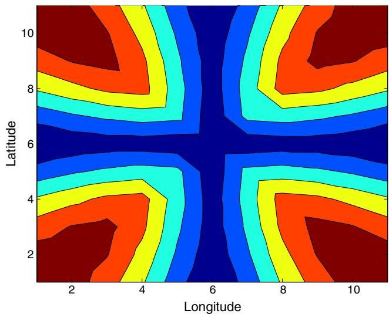  
Fig. 2. Relative reduction in effective distance. Note: Contours for average reductions in effective distance to other locations from the transport infrastructure improvement.

## 4.2. Reduction in transport costs

Using the assumed parameters {a, s, h, 0, 4}, location characteristics $\left\{ H _ { n } , A _ { n } , B _ { n } \right\}$ and initial transport costs $\{ d _ { n i } \}$ , we first solve for the initial general equilibrium of the model using the system of Eqs. $( 1 5 ) – ( 1 7 )$ . Given the assumed reduction in transport costs $\{ \hat { d } _ { n i } { = } d _ { n i } ^ { \prime } / d _ { n i } \}$ , we next solve for the general equilibrium of the model after the transport infrastructure improvement. In Fig. 3, we show the impact of the reduction in transport costs on the spatial distribution of economic activity, by displaying the relative change in each measure of economic activity $( \hat { x } = x ^ { \prime } / x )$ between the new and initial equilibria. Again blue (cold) colors denote lower values and red (hot) colors denote higher values. Locations close to the route of the road/railroad experience the largest reductions in transport costs. Therefore we find that these locations typically experience the largest increases in population (Panel A) and wages (Panel B). Nonetheless, the economic impact ofa given transport cost reduction between a pair of locations also depends on their economic characteristics (e.g. productivity and amenities), which vary spatially as discussed above.

The direct effect of the larger reduction in transport costs for locations close to the route of the road/railroad is a larger reduction in the consumption price index for these locations. But there is also an indirect effect of the larger increase in wages for these locations that raises the consumption price index. Nevertheless, the direct effect dominates, so that locations close to the route of the road/railroad experience larger reductions in consumption price indices (Panel C). The increase in both population and wages in these locations also leads to an increase in the price of land (Panel D).

While the increase in wages and the reduction in consumer price indices raise real wages, the increase in land prices has the opposite effect of reducing real wages. On net, we find that locations close to the route of the road/railroad experience larger increases in real wages (Panel E) as higher real wages have to be paid to attract additional workers with lower realizations of idiosyncratic tastes for these locations. In contrast, average utility conditional on residing in each location (not shown in the figure) takes into account both real wages and average idiosyncratic tastes. As discussed above, average utility is equalized across all locations in the spatial equilibrium and is equal to expected utility for the economy as a whole. We find that the transport improvement raises this common level of expected utility by around 9%. This common change in expected utility takes into account both the change in the domestic trade share and the change in population (Eq. (28)). To provide a point of comparison, Panel F displays the increase in welfare that would be computed by a policy analyst, who falsely assumed that labor is perfectly immobile across locations and calculated the welfare gains from the transport improvement based solely on the change in the domestic trade share (Eq. (30)). Whereas the true change in expected utility is the same for all locations, those locations close to the route of the road/railroad experience the largest increases in this incorrect measure of welfare based on the (false) assumption of labor immobility.

## 4.3. Treatment effects ofthe transport improvement

A growing empirical literature uses quasi-experimental variation in transport infrastructure investments to estimate the reducedform impact of these investments on the spatial distribution of economic activity (see for example Michaels, 2008, Duranton and Turner, 2012 and the review in Redding and Turner, 2015). Although most of this literature focuses on estimating average treatment effects, Donaldson and Hornbeck (forthcoming) examine the effects of the U.S. railroad network on county land values through changes in market access. A key implication of our model is that the transport infrastructure improvement has heterogeneous treatment effects across locations. Among the treated locations, those closest to the intersection of the horizontal and vertical lines in Fig. 1, experience the largest reductions in transport costs. Among the untreated locations that are not directly affected by the transport infrastructure, many are indirectly affected by it because it reduces transport costs along the least cost route to other locations (Fig. 2). We now examine the quantitative relevance of these heterogeneous treatment effects in the model.

In our model economy in Fig. 1, the route for the transport infrastructure improvement was exogenously assigned. Therefore we use this quasi-experimental variation to estimate the impact of this transport infrastructure improvement on the spatial distribution of economy activity within the model. Under exogenous assignment, the causal impact of the transport infrastructure improvement can be estimated using the following “differences-in-differences” specification:

$$
\ln Y _ {n t} = \vartheta_ {n} + \beta \mathbb {I} _ {n t} + d _ {t} + u _ {n t},\tag{49}
$$

where n indexes locations and t indexes periods (before and after the transport improvement); $Y _ { n t }$ is an economic outcome of interest (e.g. population); $\mathbb { I } _ { n t }$ is an indicator variable that is one if a location is treated with transport infrastructure and zero otherwise; treatment is defined in terms of a location being directly affected by the transport infrastructure improvement; $\vartheta _ { n }$ are location fixed effects; d are period fixed effects; and $u _ { n t }$ is a stochastic error. The inclusion of both sets of fixed effects ensures a “differences-in-differences” interpretation, where the first difference is between treated and untreated locations and the second difference is before and after the transport improvement.

Taking differences in Eq. (49) before and after the transport infrastructure improvement, we obtain the following “long differences” specification:

$$
\triangle \ln Y _ {n t} = \nu + \beta \mathbb {I} _ {n t} + e _ {n t},\tag{50}
$$

where the location fixed effects have now differenced out and with only two periods the change in the period fixed effects is captured in the regression constant m.

In Column (1) of Table 1, we report the results of estimating the long differences specification (Eq. (50)) for the transport infrastructure improvement shown in Fig. 1. Consistent with the reorientation of the spatial distribution of economic activity shown in Fig. 3, we find positive average treatment effects for population and wages, a negative average treatment effect for the price index, and positive average treatment effects for land rents, real wages and the incorrect measure of welfare based on the (false) assumption of labor immobility. However, as apparent from Fig. 3, these estimated average treatment effects mask considerable heterogeneity in the impact of the transport improvement.

In Fig. 4, we provide further evidence on these heterogeneous treatment effects by displaying the distributions of the relative changes $( \hat { x } = x ^ { \prime } / x )$ in the economic outcomes shown in Fig. 3 as histograms across twenty equally-spaced bins. We show the distributions for treated locations (in black) and untreated locations (in light blue) separately. As apparent from the figure, we find considerable heterogeneity among both groups of locations. Heterogeneity in access to transport infrastructure among the treated locations and in the indirect effects of the transport infrastructure among the untreated locations imply that the smallest positive changes for the treated locations are close to the largest positive changes for the untreated locations. For example, for population, the relative change among treated locations varies from 1.6 to less than 1.2, while the relative change among untreated locations varies from 0.9 to more than 1.1. Therefore, for central parameter values from the existing empirical literature, the model implies quantitatively relevant heterogeneous treatment effects.

As discussed above, the true relative change in welfare as a result of the transport improvement (Eq. (28)) is the same across all locations. Therefore, the treatment effect for true welfare (not reported in Table 1) is zero, because there is no differential change between treated and untreated locations. In contrast, a policy analyst who measured the relative change in welfare under the false assumption of perfect labor immobility would estimate a substantial positive treatment effect of 0.2179 for this incorrect measure of welfare in Table 1. Additionally, this policy analyst would find substantial heterogeneity across locations in the measured welfare effects of the transport improvement, ranging from around 1 to 1.4 in Panel F of Fig. 4, even though the true common change in welfare for all locations is equal to 1.0928. While reality may lie in between the mobile and immobile cases, these results highlight the quantitative relevance of factor mobility across locations for the measurement of locations’ welfare gains from trade.

A) Population  
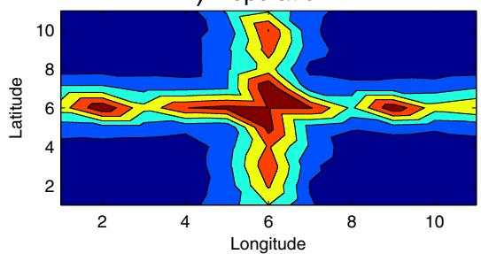  
C) Price Index  
B) Wages

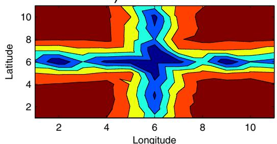

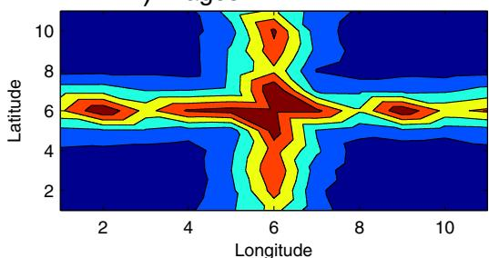  
D) Land Rents

E) Real Wage  
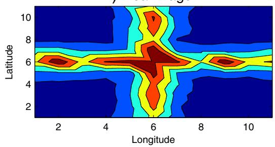

  
F) Incorrect Immobile Welfare

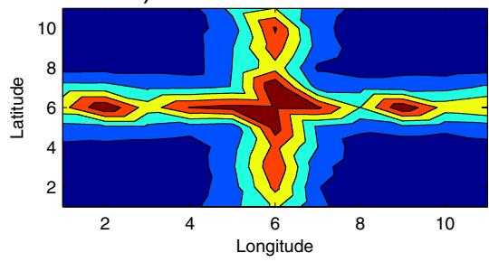  
Fig. 3. Relative changes $( \hat { x } = x ^ { \prime } / x )$ following the transport improvement. Note: Contours for relative changes in economic activity in the constant returns model following the transport improvement.

Table 1  
Treatment effects of the transport improvement.

<table><tr><td rowspan="3">Economic outcome</td><td>(1)</td><td>(2)</td></tr><tr><td>Constant returns model</td><td>Increasing returns model</td></tr><tr><td>Treatment effect</td><td>Treatment effect</td></tr><tr><td>Population</td><td>0.3735***(0.0195)</td><td>0.5086***(0.0272)</td></tr><tr><td>Wage</td><td>0.0876***(0.0046)</td><td>0.1758***(0.0094)</td></tr><tr><td>Price index</td><td>-0.2029***(0.0106)</td><td>-0.2198***(0.0117)</td></tr><tr><td>Land rents</td><td>0.4611***(0.0241)</td><td>0.6845***(0.0366)</td></tr><tr><td>Real wages</td><td>0.1245***(0.0065)</td><td>0.1696***(0.0091)</td></tr><tr><td>Immobile welfare</td><td>0.2179***(0.0114)</td><td>0.2013***(0.0108)</td></tr></table>

Note: Table reports the results from the long differences specification (Eq. (50)) for the impact of the transport infrastructure improvement on each of the economic outcomes for treated relative to untreated locations. A separate regression is estimated for each cell in the table. Column (1) reports results for the constant returns to scale model. Column (2) reports results for the increasing returns to scale model. The increasing returns model is calibrated to the same initial equilibrium (wages, population and land area) as the constant returns to scale model, with the same trade elasticity $( \theta ^ { N } = \sigma ^ { G } - 1 > \sigma ^ { N } - 1 )$ and same values ofother model parameters. Standard errors in parentheses.  
∗∗∗ Denotes statistical significance at the 1 percent level.

Finally, another challenge faced by the reduced-form regression specification is that the relative comparison between treated and untreated locations does not distinguish reallocation effects from the creation of new economic activity. Comparing the distributions of treatment effects for population in $\mathrm { F i g . ~ 4 }$ (which range up to 60%) to the true common change in welfare across all locations (of around 9%), it is apparent that the reallocation effects are large relative to the welfare effect. As argued by Fogel (1964), large-scale reallocations of economic activity as a result of a new transport technology need not necessarily imply welfare gains of the same magnitude. Although workers have heterogeneous preferences across locations, the equalization of expected utility across locations implies that the welfare effects of the transport improvement on treated locations are shared with the economy as a whole, dampening the magnitude of these welfare effects.

## 4.4. Trade and labor supply elasticities

We now explore how the sizes of the trade and labor supply elasticities influence the impact of the transport improvement. We undertake a grid search over values for the Fréchet shape parameter for productivity h (that determines the trade elasticity) and the Fréchet shape parameter for idiosyncratic tastes 4 (that determines the labor supply elasticity). We consider values of h ranging from 3.1 to 5.1 and values of 4 ranging from 3.1 to 5.1 (which satisfy $\theta > \sigma - 1 )$ and hold the other parameters $\{ \alpha , \phi , \sigma \}$ and productivity, amenities and land supply $\left\{ A _ { n } , B _ { n } , H _ { n } \right\}$ constant. For each parameter combination, we solve for the initial and new equilibria before and after the transport improvement, and estimate the reduced-form regression (Eq. (50)) for the average impact on treated relative to untreated locations (b).

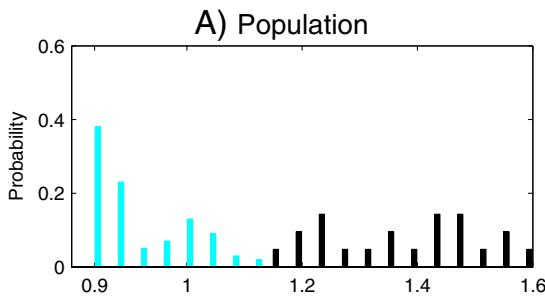

C) Price Index  
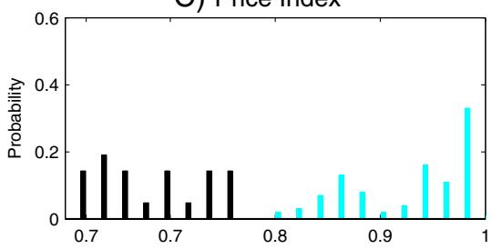

E) Land Rents  
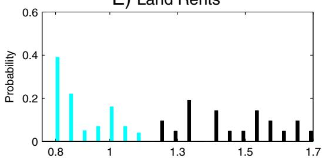

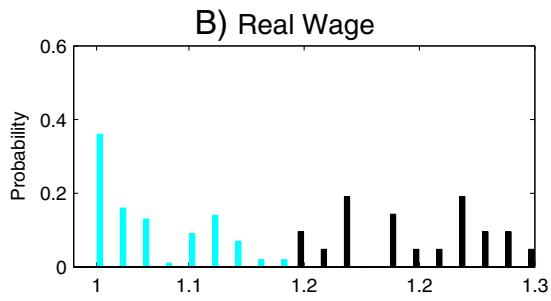

D) Wage  
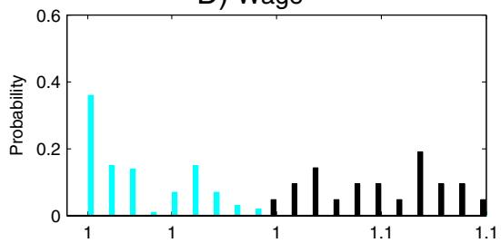

F) Incorrect Immobile Welfare  
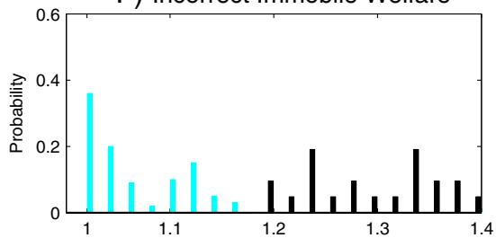  
Fig. 4. Distribution of relative changes $( \hat { x } = x ^ { \prime } / x )$ following the transport improvement. Note: Histogram of relative changes in economic activity in the constant returns model following the transport improvement.

In Fig. 5, we display contour plots for the average treatment effects for each economic outcome in the {h, 4} parameter space. Again red (hot) corresponds to higher values and blue (cold) corresponds to lower values. As shown in Panel A, the average treatment effect for population is larger for higher values of 4 and intermediate values of h. The reason is as follows. For higher values of $\epsilon ,$ there is less dispersion in idiosyncratic tastes, so that the transport improvement leads to a greater reallocation of population. For intermediate values of h, the change in transport costs has the largest effects on the relative attractiveness of locations, so that the transport improvement again leads to a greater reallocation of population. In contrast, for low values of h all locations have similar levels of access to goods from other locations, while for high values of h all locations are largely closed to goods trade.

As shown in Panel B, the average treatment effect for wages is larger for smaller values of 4 and higher values of h. For smaller values of $\epsilon ,$ there is more dispersion in idiosyncratic tastes, so that larger wage changes are required to induce workers to reallocate between locations. For higher values of h, the goods market effects of the transport improvement are more localized, which in turn leads to larger wage changes. As shown in Panel C, the average treatment effect for the price index displays a similar pattern as for wages. The reduction in the price index in treated relative to untreated locations is larger for high values of 4 and low values of h. On the other hand, as shown in Panel D, the average treatment effect for land prices shows a similar pattern as for population. The increase in land prices in treated relative to untreated locations is larger for higher values of

4 and intermediate values for h, which reflects the larger population reallocations for these parameter values shown in Panel A.

As shown in Panel E, the average treatment effect for real wages is larger for lower values of 4 and intermediate values for h. For lower values of 4, there is more dispersion in idiosyncratic tastes, so that larger changes in real wages are required to reallocate labor. For intermediate values of h, the change in transport costs has the largest effects on the relative attractiveness of locations, as discussed above.

Across all of the parameter combinations shown in Fig. 5, the average treatment effect for the true measure of welfare (Eq. (28)) is zero, because expected utility conditional on living in a location is the same for treated and untreated locations. In contrast, as shown in Panel F, a policy analyst who measured the average treatment effect for welfare under the false assumption that labor is perfectly immobile (Eq. (30)) would measure a larger average treatment effect for smaller values of 4 (more dispersion in idiosyncratic tastes) and intermediate values of h (for which the transport improvement has the largest effects on the relative attractiveness of locations).

In general, more dispersion in idiosyncratic tastes (lower 4) implies larger treatment effects for wages, but smaller treatment effects for population and land prices. For example, for trade and labor supply elasticities of $\theta \ : = \ : 4 \ : \mathrm { a n d } \ : \epsilon \ : = \ : 3 . 1$ , we find average treatment effects for population (0.3798), wages (0.0867) and land rents (0.4664). In contrast, for trade and labor supply elasticities of $\theta = 4$ and $\epsilon = 5 . 1$ , we find average treatment effects for population (0.4733), wages (0.0725) and land rents (0.5458).

A) Population Treatment  
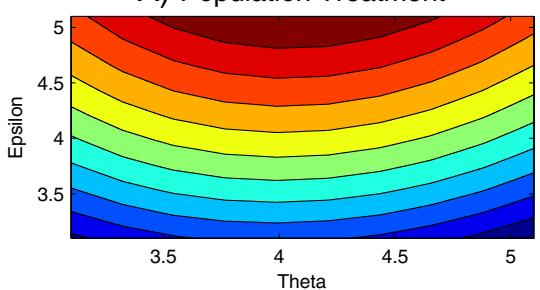

C) Price Treatment  
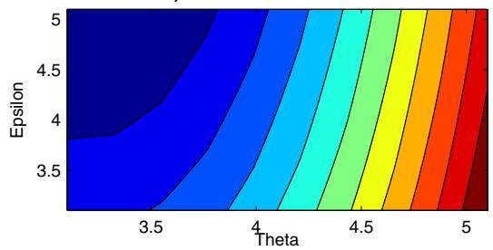  
B) Wage Treatment

E) Real Wage Treatment  
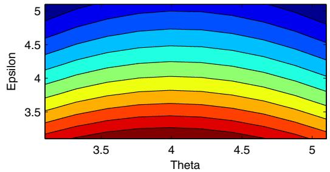

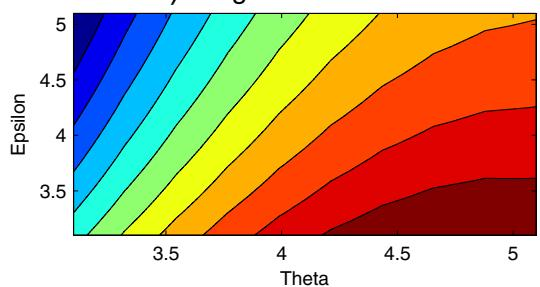

D) Land Rent Treatment  
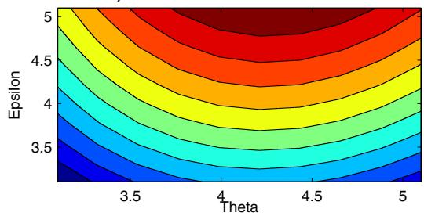

F) Incorrect Immobile Welfare  
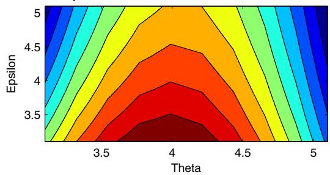  
Fig. 5. Comparative statics for average treatment effects. Note: Contours for average treatment effect from the transport improvement for each measure of economic activity across the parameter grid 4 ∈ [3.1, 5.1] and h ∈ [3.1, 5.1].

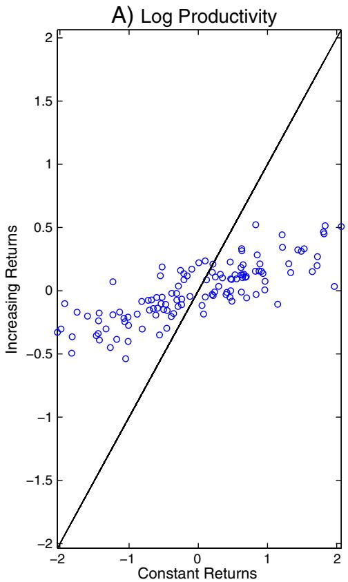

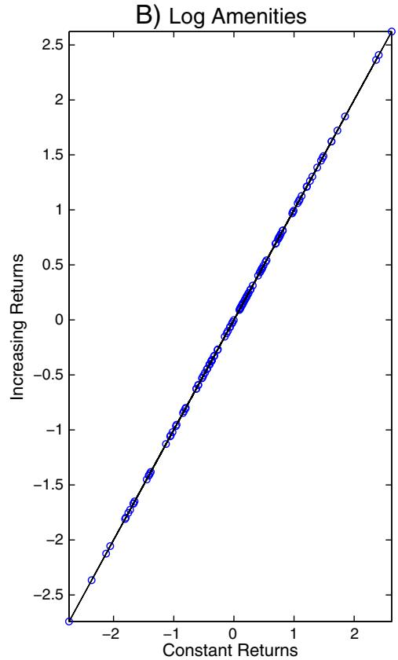  
Fig. 6. Productivity and amenities (Calibrated to same initial $( w _ { n } , L _ { n } , H _ { n } ) )$ . Note: Increasing returns model calibrated to the same initial equilibrium (wages, population and land area) as the constant returns model, with the same trade elasticity $( \theta = \sigma - 1 )$ , migration elasticity (4) and land share (1 − a), which implies different elasticities of substitution and initial productivities in the two models

## 4.5. Constant versus increasing returns to scale

To examine the quantitative implications ofagglomeration forces, we compare the counterfactual predictions of the constant and increasing returns to scale models for the impact of the transport infrastructure improvement. We assume the same values for the share of land in consumption expenditure $( 1 - \alpha = 0 . 2 5 )$ ), the elasticity of population supply with respect to real income (4 = 3), the elasticity of trade costs with respect to effective distance $( \phi = 0 . 3 3 ) ,$ and the elasticity of trade flows with respect to trade costs in the two models $( \theta ^ { N } \overset { \cdot } { = } \sigma ^ { G } - 1 )$ . We begin with the values of population, wages and land supply $\left\{ L _ { n } , w _ { n } , H _ { n } \right\}$ from the initial equilibrium of the constant returns model. We first calibrate the model with increasing returns to exactly replicate these endogenous variables as an equilibrium (as in Proposition 7). Starting from this common initial equilibrium, we next examine the impact of the transport improvement shown in Fig. 1 on the spatial distribution of economic activity (as in Proposition 8).11

In Fig. 6, we compare the calibrated values of productivity and amenities in the increasing returns and constant returns models required to rationalize the initial equilibrium distribution of economic activity. We display the values in the increasing returns model on the vertical axis and the values in the constant returns model on the horizontal axis. As apparent from the figure, less dispersion in productivity is required in the increasing returns model to explain the same dispersion in economic activity across locations. This property reflects two features of the increasing returns model. First, productivity enters the trade shares (Eq. (36)) in the increasing returns to scale model with the exponent s − 1 (compared to an exponent of one for the trade shares (Eq. (16)) in the constant returns model). Second, some of the concentration of economic activity in the increasing returns model is explained by agglomeration forces from an endogenous measure of varieties (leaving less to be explained by exogenous differences in productivity than in the constant returns model). As also apparent from the figure, the two models rationalize the common initial equilibrium with the same calibrated amenities, as shown formally in Proposition 7 above.

Although the qualitative pattern of average treatment effects of the transport improvement is similar in the increasing returns model to that in the constant returns model, we find that the quantitative magnitudes are substantially larger in the increasing returns model. In Column (2) of Table 1 above, we report the results of estimating the long differences specification (Eq. (50)) for the transport infrastructure improvement in the increasing returns model. We again find positive average treatment effects for population and wages, a negative average treatment effect for the price index, and positive average treatment effects for land rents, real wages and the incorrect measure of welfare based on the (false) assumption of perfect labor immobility. However, the estimated magnitudes are substantially and statistically significantly larger in the increasing returns model. For example, we find average treatment effects of around 51% for population (compared to around 37% in the constant returns model) and around 18% for wages (compared to around 9% in the constant returns model). Again we find that more dispersion in idiosyncratic tastes implies larger treatment effects for wages, but smaller treatment effects for population and land prices. For example, for trade and labor supply elasticities of $\theta = 4$ and $\epsilon = 3 . 1$ , we find average treatment effects for population (0.5205), wages (0.1766) and land rents (0.6971). In contrast, for $\theta = 4 \mathrm { a n d } \epsilon = 5 . 1$ , we find average treatment effects for population (0.7183), wages (0.1899) and land rents (0.9082).

As in our earlier analysis for the constant returns model, we again find that these average treatment effects mask considerable heterogeneity in the impact of the transport improvement among treated and untreated locations. In Fig. 7, we illustrate this heterogeneity by displaying the distributions of the relative changes $( { \hat { x } } \ = \ x ^ { \prime } / x )$ in the economic outcomes as histograms across twenty equallyspaced bins. We again show the distributions for treated locations (in black) and untreated locations (in light blue). The largest increases in population (Panel A), wages (Panel D) and land rents (Panel E) are around 80%, 20% and more than 120% respectively in the increasing returns model, compared to around 60%, 10% and 70% respectively in the constant returns model. We also find larger increases in real wages and in the measure of welfare based on the (false) assumption of perfect labor immobility in the increasing returns model. The magnitudes of the differences for real wages and immobile welfare are smaller, which is consistent with our earlier findings of larger reallocation effects than welfare effects.

These findings of larger average treatment effects than in the constant returns model reflect the endogenous changes in the measures of varieties produced by each location in the increasing returns model. As population increases in treated locations, this expands the measure of varieties produced, which further increases the attractiveness ofthese treated locations. In contrast, as population declines in untreated locations, this reduces the measure of varieties produced, which further reduces the desirability of these untreated locations. As long as the stability condition s $( 1 - \tilde { \alpha } ) > 1$ is satisfied, there is a unique equilibrium distribution of economic activity across locations, but these agglomeration forces magnify the impact of the transport improvement on the relative attractiveness of locations.

## 5. Regions and countries

In this section, we explore the implications of a distinction between regions and countries, where workers with heterogeneous preferences are mobile across regions within countries, but are immobile across countries (see also Ramondo et al., 2012). We show that the general equilibrium of the model can be characterized and counterfactuals can be undertaken using a directly analogous approach to before. We examine the implications of worker mobility across regions within countries for the measurement of countries welfare gains from trade.

## 5.1. Preferences, endowments and technology

We consider a world economy consisting of many (potentially asymmetric) countries indexed by $j \in J .$ We allow each country to consist of many (potentially asymmetric) regions indexed by i, n ∈ Nj, such that the world economy comprises $N = \{ N ^ { 1 } , \ldots , N ^ { J } \}$ regions. Between countries, labor is completely immobile. Within countries, workers have heterogeneous preferences for regions, as modeled in the previous sections. We first develop this extension of our baseline constant returns model from Section 2, but later report results for the same extension of our increasing returns model from Section 3.

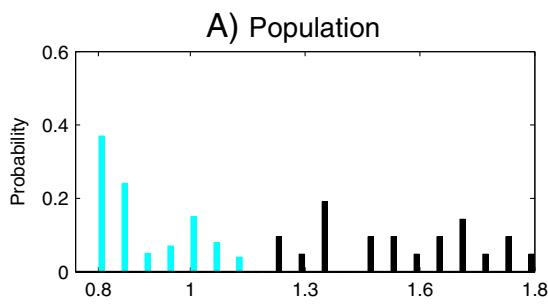

C) Price Index  
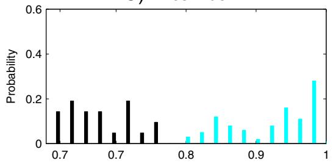  
E) Land Rents

B) Real Wage  
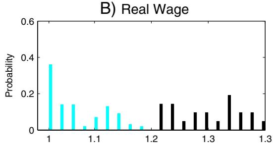

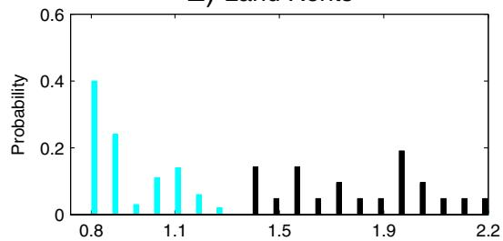

D) Wage  
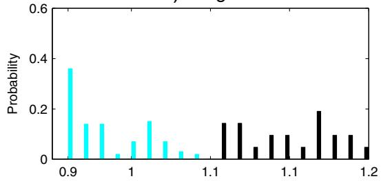

F) Incorrect Immobile Welfare  
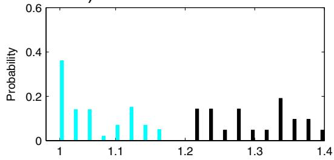  
Fig. 7. Impact of transport improvement (Calibrated to same initial equilibrium $( w _ { n } , L _ { n } , H _ { n } ) )$ . Note: Increasing returns to scale model calibrated to the same initial equilibrium (wages, population and land area) as the constant returns to scale model, with the same trade elasticity $( \theta ^ { N } = \stackrel { \smile } { \sigma } ^ { G } - 1 > \sigma ^ { N } - 1 )$ and values of other model parameters.

## 5.2. General equilibrium

The general equilibrium of the model again can be represented by the measure of workers $( L _ { n } ) _ { 1 }$ , the trade share $( \pi _ { n i } )$ and the wage $( w _ { n } )$ for each location $n , i \in N ^ { j }$ and each country $j \in J .$ Using labor income $\left( \operatorname { E q . } ( 1 3 ) \right)$ , trade share (Eq. (7)), price index $\left( \operatorname { E q . } \left( 8 \right) \right)$ , residential choice probabilities (Eq. (10)) and land market clearing (Eq. (14)), this equilibrium triple $\{ L _ { n } , \pi _ { n i } , w _ { n } \}$ solves the following system of equations for all $i , n \in N .$ First, each location’s income must equal expenditure on the goods produced in that location:

$$
w _ {i} L _ {i} = \sum_ {j \in J} \sum_ {n \in N ^ {j}} \pi_ {n i} w _ {n} L _ {n}.\tag{51}
$$

Second, regional expenditure shares are:

$$
\pi_ {n i} = \frac {A _ {i} (d _ {n i} w _ {i}) ^ {- \theta}}{\sum_ {j \in J} \sum_ {k \in N ^ {j}} A _ {k} (d _ {n k} w _ {k}) ^ {- \theta}}.\tag{52}
$$

Third, residential choice probabilities imply:

$$
\frac {L _ {n}}{\bar {L} ^ {j}} = \frac {B _ {n} \left(\frac {A _ {n}}{\pi_ {n n}}\right) ^ {\frac {\alpha \epsilon}{\theta}} \left(\frac {L _ {n}}{H _ {n}}\right) ^ {- \epsilon (1 - \alpha)}}{\sum_ {k \in N ^ {j}} B _ {k} \left(\frac {A _ {k}}{\pi_ {k k}}\right) ^ {\frac {\alpha \epsilon}{\theta}} \left(\frac {L _ {k}}{H _ {k}}\right) ^ {- \epsilon (1 - \alpha)}},\tag{53}
$$

where the only difference is that the residential choice probabilities $( L _ { n } / \bar { L } ^ { j } )$ now apply country by country, so that the summation in the denominator of Eq. (53) is across regions k within a given countryj.

## 5.3. Counterfactuals

The system of equations for general equilibrium (Eqs. (51)–(53)) again provides an approach for undertaking model-based counterfactuals that uses only parameters and the values of endogenous variables in an initial equilibrium. Denoting the relative value of variables in the counterfactual and initial equilibria by a hat $( \hat { x } = x ^ { \prime } / x ) ,$ we can solve for the counterfactual effects of a change in trade frictions, productivity or amenities using:

$$
\hat {w} _ {i} \hat {\lambda} _ {i} ^ {j} Y _ {i} = \sum_ {m \in J} \sum_ {n \in N ^ {m}} \pi_ {n i} ^ {\prime} \hat {w} _ {n} \hat {\lambda} _ {n} ^ {m} Y _ {n},\tag{54}
$$

$$
\hat {\pi} _ {n i} \pi_ {n i} = \frac {\pi_ {n i} \hat {A} _ {i} (\hat {d} _ {n i} \hat {w} _ {i}) ^ {- \theta}}{\sum_ {j \in J} \sum_ {k \in N ^ {j}} \pi_ {n k} \hat {A} _ {k} (\hat {d} _ {n k} \hat {w} _ {k}) ^ {- \theta}},\tag{55}
$$

$$
\hat {\lambda} _ {n} ^ {j} \lambda_ {n} ^ {j} = \frac {\hat {B} _ {n} \hat {\mathrm{A}} _ {n} ^ {\frac {\alpha \epsilon}{\theta}} \hat {\pi} _ {n n} ^ {- \frac {\alpha \epsilon}{\theta}} \left(\hat {\lambda} _ {n} ^ {j}\right) ^ {- \epsilon (1 - \alpha)} \lambda_ {n} ^ {j}}{\sum_ {k \in N ^ {j}} \hat {B} _ {k} \hat {\mathrm{A}} _ {k} ^ {\frac {\alpha \epsilon}{\theta}} \hat {\pi} _ {k k} ^ {- \frac {\alpha \epsilon}{\theta}} \left(\hat {\lambda} _ {k} ^ {j}\right) ^ {- \epsilon (1 - \alpha)} \lambda_ {k} ^ {j}},\tag{56}
$$

where $Y _ { i } = w _ { i } L _ { i }$ denotes labor income and $\lambda _ { n } ^ { j } = L _ { n } / \bar { L } ^ { j }$ denotes the population share ofeach location n $\mathbf { \chi } \in N ^ { j }$ within countryj in the initial equilibrium. Again the only difference from before is that the residential choice probabilities $( \lambda _ { n } ^ { j } = L _ { n } / \bar { L } ^ { j } )$ apply country by country, so that the summation in the denominator of Eq. (56) is across regions k within a given countryj.

## 5.4. Welfare gainsfrom trade

As in the specification of the model without the distinction between regions and countries (Section 2.9), the common welfare gains from trade across all locations within country $j ~ \in ~ J$ can be expressed as a weighted average ofthe changes in the domestic trade share and population in all locations:

$$
\frac {\bar {U} ^ {j T}}{\bar {U} ^ {j A}} = \left[ \sum_ {n \in N ^ {j}} \frac {L _ {n}}{\bar {L}} \bigg (\frac {\pi_ {n n} ^ {A}}{\pi_ {n n} ^ {T}} \bigg) ^ {\frac {\alpha \epsilon}{\theta}} \bigg (\frac {L _ {n} ^ {A}}{L _ {n} ^ {T}} \bigg) ^ {\epsilon (1 - \alpha)} \right] ^ {\frac {1}{\epsilon}},\tag{57}
$$

where the summation is now only across locations within country $j ;$ these welfare gains in general differ across countries m $\neq j ;$ and $\pi _ { n n } ^ { A } \neq 1$ because there is trade across regions within a country even when there is no trade between countries under autarky. Equivalently, these common welfare gains from trade within country j can be expressed in terms of the change in the domestic trade share $\left( \pi _ { n n } \right)$ and population $\left( L _ { n } \right)$ of any one location $n \in N ^ { j }$ , and hence in terms of the change in the geometric mean domestic trade share $( \tilde { \pi } _ { n n } )$ and geometric mean population $( { \tilde { L } } _ { n } )$ across locations $\boldsymbol { \imath } \in N ^ { j } ;$

$$
\frac {\bar {U} ^ {j T}}{\bar {U} ^ {j A}} = \left(\frac {\pi_ {n n} ^ {A}}{\pi_ {n n} ^ {T}}\right) ^ {\frac {\alpha}{\theta}} \left(\frac {L _ {n} ^ {A}}{L _ {n} ^ {T}}\right) ^ {\frac {1}{\epsilon} + (1 - \alpha)} = \left(\frac {\tilde {\pi} _ {n n} ^ {A}}{\tilde {\pi} _ {n n} ^ {T}}\right) ^ {\frac {\alpha}{\theta}} \left(\frac {\tilde {L} _ {n} ^ {A}}{\tilde {L} _ {n} ^ {T}}\right) ^ {\frac {1}{\epsilon} + (1 - \alpha)},\tag{58}
$$

where the tilde above a variable denotes a geometric mean across locations within each country, such that $\begin{array} { r } { \tilde { L } _ { n } ^ { A } = [ \prod _ { n \in N ^ { j } } L _ { n } ^ { A } ] ^ { \frac { 1 } { | N ^ { j } | } } } \end{array}$ for n ∈ $N ^ { j } .$

We compare this true measure of the welfare gains from trade with two alternative measures. First, we consider a policy analyst who computes welfare for each region under the (false) assumption that labor is perfectly immobile across regions (Eq. (30) for each region). Second, we consider a policy analyst who aggregates regions within countries and computes welfare treating each country as a single location (Eq. (30) for each country). The country-level measure of the welfare gains from trade is thus:

$$
\frac {\bar {U} ^ {j T}}{\bar {U} ^ {j A}} = \left(\frac {1}{\dot {\pi} ^ {j T}}\right) ^ {\frac {\alpha}{\theta}},\tag{59}
$$

where the dot denotes a country-level variable, such that $\dot { \pi } ^ { j T }$ is countryjs domestic trade share, and we have $\dot { \pi } ^ { j A } = 1$ under autarky.

$$
\begin{array}{c c c c c c c c c c} \bullet & \bullet & \bullet & \bullet & \bullet & \bullet & \bullet & \bullet & \bullet & \bullet \\ \hline \bullet & \bullet & \bullet & \bullet & \bullet & \bullet & \bullet & \bullet & \bullet & \bullet \\ \hline \bullet & \bullet & \bullet & \bullet & \bullet & \bullet & \bullet & \bullet & \bullet & \bullet \\ \hline \bullet & \bullet & \bullet & \bullet & \bullet & \bullet & \bullet & \bullet & \bullet & \bullet \\ \hline 0 & 0 & 0 & 0 & 0 & 0 & 0 & 0 & 0 & 0 \\ \hline 0 & 0 & 0 & 0 & 0 & 0 & 0 & 0 & 0 & 0 \\ \hline 0 & 0 & 0 & 0 & 0 & 0 & 0 & 0 & 0 & 0 \\ \hline 0 & 0 & 0 & 0 & 0 & 0 & 0 & 0 & 0 & 0 \end{array}
$$

Fig. 8. Model economy with East and West. Note: Grid of locations in latitude and longitude space, the route of the transport infrastructure improvement (thin lines), and the border between East and West (thick lines).

## 5.5. Quantitative analysis

To examine the quantitative implications of the distinction between regions and countries, we return to the model economy in Section 4. We assume that the model economy consists of two countries (East and West), with the border between them shown by the thick vertical line in Fig. 8. We suppose that population is distributed between the two countries in proportion to their share of the economy’s total land area. We assume the same values for the trade elasticity $( \theta ^ { N } = \sigma ^ { G } - 1 > \sigma ^ { N } - 1 )$ and other model parameters in the constant and increasing returns models.

We suppose that the two countries are initially closed to trade and solve for the equilibrium spatial distribution of economic activity in the constant returns model. We next calibrate the increasing returns model to exactly replicate this spatial distribution of economic activity as an equilibrium in the closed economy. We then open the closed economy to trade in both models and examine the implications for the spatial distribution of economic activity and expected utility within each country. We assume that the transport infrastructure shown by the thin lines in Fig. 8 exists in both the closed and open economies. In Fig. 9, we show the impact of the opening of trade on the spatial distribution of economic activity in East and West in the constant returns model. We display the relative change in each measure of economic activity $( \hat { x } ~ = ~ x ^ { \prime } / x )$ between the open economy (denoted by a prime) and the closed economy. Again blue (cold) colors denote lower values and red (hot) colors denote higher values. The thick black vertical line denotes the border between East and West. We find a similar qualitative pattern for the impact of the opening of trade in the increasing returns model (but the quantitative magnitudes are again larger). Locations close to the opened border typically experience the largest increases in population (Panel A), wages (Panel B), land rents (Panel D), real wages (Panel E) and welfare under the (false) assumption of perfect labor immobility (Panel F). These locations also typically experience the largest reductions in price indices (Panel C). Of all locations along the opened border, those closest to the route of the transport infrastructure experience the largest changes in levels of economic activity.

In Fig. 10, we show the distribution of relative changes in population (Panels A and B), land rents (Panels C and D), and welfare under the (false) assumption of perfect labor immobility (Panels E and F). The left panels (A, C and E) show outcomes for West, while the right panels (B, D and F) show outcomes for East. We find that the opening of trade leads to substantial reallocations of economic activity within countries. Population changes range from reductions of 8% to rises of 18%, while land rent changes vary from reductions of 13% to rises of 17%. In general, the dispersion of population and land rent changes is larger in East than in West, which in part reflects its smaller size and relative scarcity of transport infrastructure (only one East–West line). Again we find that the true changes in welfare are smaller than the reallocation effects (1.0763 for East and 1.0380 for West). Although these true changes in welfare are the same across regions within each country (as shown by the vertical red lines in Panels E and F), a policy analyst who measured the welfare gains from trade at

A) Population  
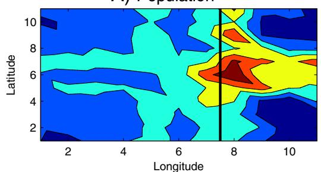  
C) Price Index

B) Wages  
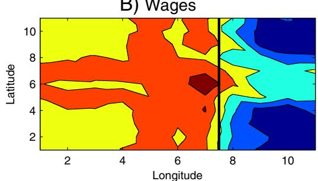

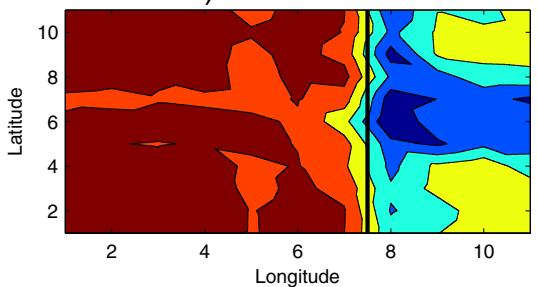

E) Real Wage  
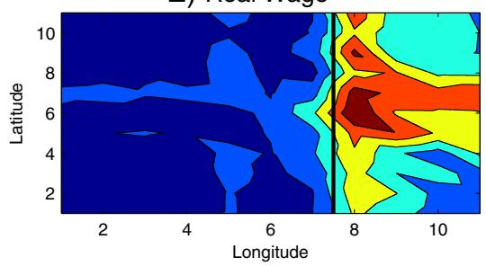

D) Land Rents  
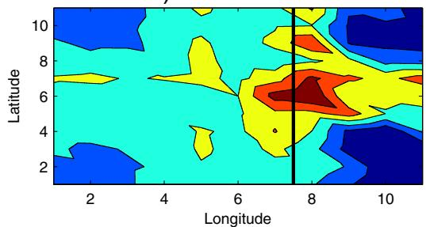

F) Incorrect Immobile Welfare  
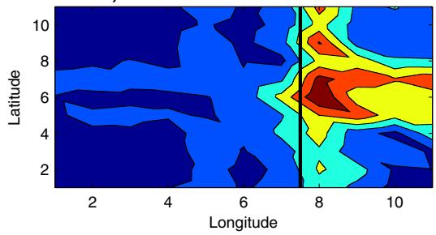  
Fig. 9. Impact of opening of trade between East and West. Note: Results from the constant returns model under the assumption that the transport infrastructure exists in both the closed and open economies Thick vertical line denotes the border

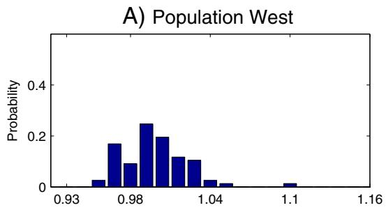

C) Land Rents West  
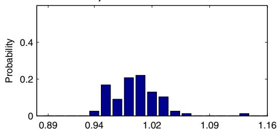

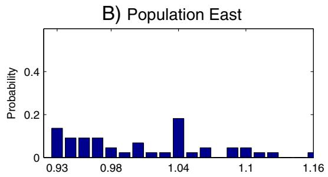

D) Land Rents East  
E) Immobile Welfare West  
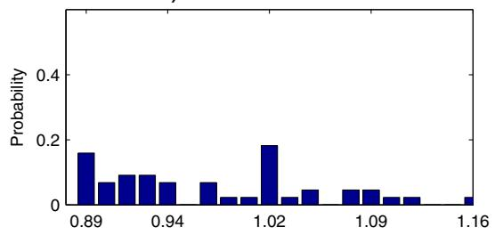

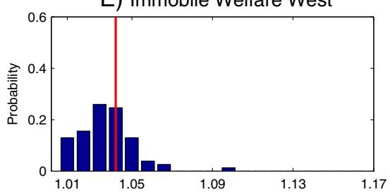

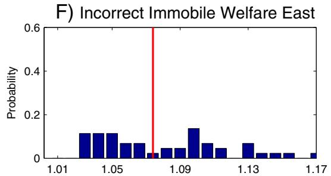  
Fig. 10. Impact of opening of trade between East and West. Note: Results from the constant returns model under the assumption that the transport infrastructure exists in both the closed and open economies.

the regional level under the (false) assumption that labor is perfectly immobile across regions would incorrectly find substantial variation in welfare effects (ranging from 1.01 to 1.17 in Panels E and F).

In Table 2, we compare the true welfare gains from trade (Eq. (57)) to those measured by a policy analyst who aggregates regions to the country-level (Eq. (59)). The first two columns report results for the constant returns to scale model (for East and West). The second two columns report results for the increasing returns model (for East and West). Comparing the first two columns to the second two columns, we again find that the differences in counterfactual welfare effects between the constant and increasing returns to scale models are smaller than the differences in counterfactual reallocation effects. We find that the country-level measure of the welfare gains from trade provides a good approximation to the true welfare gains for each region (and a much better approximation than the regional measure assuming factor immobility in Panels E and F of Fig. 10). The reason is that both the true welfare impact (as measured by Eq. (57)) and the predicted welfare impact based on the change in a country’s domestic trade share (as measured by Eq. (59)) are weighted averages of the changes in location characteristics within countries.

True and measured welfare effects of trade liberalization.

<table><tr><td rowspan="2"></td><td>Constant returns</td><td>Constant returns</td><td>Increasing returns</td><td>Increasing returns</td></tr><tr><td>West</td><td>East</td><td>West</td><td>East</td></tr><tr><td>True expected utility</td><td>1.0380</td><td>1.0763</td><td>1.0381</td><td>1.0767</td></tr><tr><td>Measured country welfare</td><td>1.0374</td><td>1.0738</td><td>1.0377</td><td>1.0756</td></tr></table>

Note: Results from the constant and increasing returns models.

## 6. Conclusions

We develop a quantitative spatial model that incorporates a rich geography of trade costs and labor mobility with heterogeneous preferences across locations. We allow locations to differ from one another in terms of their productivity, amenities and transport infrastructure. Despite the large number of asymmetric locations and the presence of trade costs and heterogeneous worker preferences, the model remains highly tractable and amenable to both analytical and quantitative analyses. We provide comparative statics for the unique equilibrium with respect to the characteristics of locations. We show that there is a one-to-one mapping from the model’s parameters and data on wages, population, land area and trade costs to the unobserved characteristics of locations (productivity and amenities). Therefore the model can be inverted to recover these unobserved characteristics from the endogenous variables.

Our quantitative spatial model provides a useful complement to reduced-form regressions in analyzing the impact of transport infrastructure improvements. These reduced-form regressions abstract from general equilibrium effects and face the challenge of distinguishing between the creation and reallocation of economic activity. They also mask considerable heterogeneity in the impact of transport improvements within the groups of treated and untreated locations, which has received relatively little attention in existing empirical research. Even if a location is not directly treated with transport infrastructure, it can indirectly benefit because of the resulting reduction in transport costs along the least cost route to other locations. We show that the average treatment effect of the transport improvement depends in a quantitatively relevant way on the degree of trade costs and heterogeneity in worker preferences.

In an international trade context, where labor is immobile across locations, the constant and increasing returns models considered in this paper have the same counterfactual predictions for the effects of reductions in trade costs. In contrast, when labor is mobile across locations, we show that the two models have different counterfactual predictions for the impact of these reductions in trade costs, even when calibrated to the same initial equilibrium and trade elasticity. As trade costs fall, population reallocates across locations. In the increasing returns model, these population reallocations directly affect trade shares (whereas they do not in the constant returns to scale model), which leads to different counterfactual predictions in the two models for wages, trade shares, populations and welfare. We show that these differences in counterfactual predictions can be quantitatively relevant for empirically plausible reductions in trade costs.

We show that reallocations of economic activity across locations play an important role in understanding the welfare gains from trade. To the extent that some locations experience larger reductions in trade costs than others, labor reallocates to these locations, until the price of land adjusts such that all locations experience the same welfare gains from trade. We find that these reallocations of economic activity are large relative to the overall welfare gains from trade. Failing to take them into account when measuring welfare at the regional level can lead to large discrepancies from the true welfare gains from trade. In contrast, measuring the welfare gains from trade at the country-level provides a much closer approximation to the common welfare gains from trade across regions within each country.

## Appendix A. Supplementary data

Supplementary data to this article can be found online at http:/ dx.doi.org/10.1016/j.jinteco.2016.04.003.

## References

Allen, T., Arkolakis, C., 2014. Trade and the topography of the spatial economy. Q. J. Econ. 129 (3), 1085–1140.

Alvarez, F., Lucas, R.E., 2007. General equilibrium analysis of the Eaton–Kortum model of international trade. J. Monet. Econ. 54, 1726–1768.

Arkolakis, C., Costinot, A., Rodriguez-Clare, A., 2012. New trade models, same old gains Am. Econ. Rev. 102 (1), 94–130.

Artuc, E., Chaudhuri, S., McLaren, J., 2010. Trade shocks and labor adjustment: a structural empirical approach. Am. Econ. Rev. 100 (3), 1008–1045.

Baum-Snow, N., 2007. Did highways cause suburbanization? Q. J. Econ. 122 (2), 775–780.

Behrens, K., Gaigné, C., Ottaviano, G.I., Thisse, J.-F., 2007. Countries, regions and trade: on the welfare impacts of economic integration. Eur. Econ. Rev. 51, 1277–1301.

Bernard, A.B., Eaton, J., Jensen, J.B., Kortum, S.S., 2003. Plants and productivity in international trade Am Econ Rev 93 (4) 1268-1290

Blanchard, O., Katz, L., 1992. Regional evolutions. Brook. Pap. Econ. Act. 23 (1), 1–76.

Bound, J., Holzer, H.J., 2000. Demand shifts, population adjustments and labor market outcomes during the 1980s L Labor Econ. 18 (1). 20–54

Bryan, G., Morten, M., 2014. Economic Development and the Spatial Allocation of Labor: Evidence From Indonesia, Stanford University, mimeograph.

Busso, M., Gregory, J., Kline, P., 2013. Assessing the incidence and eficiency of a prominent place based policy. Am. Econ. Rev. 103 (2), 897–947.

Caliendo, L., Parro, F., 2012. Estimates of the trade and welfare effects of NAFTA. NBER Working Paper, 18508.

Caliendo L Parro E Rossi-Hansberg E Sarte P-D 2014 The impact of regional and sectoral productivity changes on the U.S, economy, NBER Working Paper

Co ¸sar, K., Fajgelbaum, P., 2013. Internal geography, international trade, and regional specialization, NBER Working Paper, 19697.

Costinot, A., Donaldson, D., Komunjer, I., 2012. What goods do countries trade? A quantitative exploration of Ricardo's ideas Rey, Econ Stud 79 (2). 581-608

Courant, P.N., Deardorff, A.V., 1992. International trade with lumpy countries. J. Polit Econ. 100 (1), 198–210.

Courant, P.N., Deardorff, A.V., 1993. Amenities, nontraded goods, and the trade of lumpy countries. J. Urban Econ. 34 (2), 299–317.

Davis, D.R., Weinstein, D.E., 2002. Bones, bombs, and break points: the geography of economic activity. Am. Econ. Rev. 92 (5), 1269–1289.

Davis, M.A., Ortalo-Magné, F., 2011. Housing expenditures, wages, rents. Rev. Econ. Dyn. 14 (2), 248–261.

Dekle, R., Eaton,J., Kortum, S., 2007. Unbalanced trade. Am. Econ. Rev. 97 (2), 351–355.

Desmet, K., Nagy, D. K., Rossi-Hansberg, E., 2014. The Geography of Development: Evaluating Migration Restrictions and Coastal Flooding, Princeton University, mimeograph.

Desmet, K., Rossi-Hansberg, E., 2014. Spatial development. Am. Econ. Rev. 104 (4), 1211–1243.

Donaldson, D., 2014. Railroads of the Raj: estimating the impact of transportation infrastructure. Am. Econ. Rev. forthcoming.

Donaldson, D., Hornbeck, R., 2016. Railroads and American economic growth: a “market access” approach. Q. J. Econ. forthcoming

Duranton, G., Turner, M.A., 2012. Urban growth and transportation. Rev. Econ. Stud. 79 (4), 1407–1440.

Eaton, J., Kortum, S., 2002. Technology, geography, and trade. Econometrica 70 (5), 1741–1779.

Eaton, J., Kortum, S., Neiman, B., Romalis, J., 2011. Trade and the global recession. NBER Working Paper, 16666.

Faber, B., 2014. Integration and the periphery: the unintended effects ofnew highways in a developing country. Rev. Econ. Stud. 81 (3), 1046–1070.

Fieler, C., 2011. Non-homotheticity and bilateral trade: evidence and a quantitative explanation. Econometrica 79 (4), 1069–1101.

Fogel, R., 1964. Railroads and American Economic Growth: Essays in Econometri History. Johns Hopkins University Press, Baltimore ( )

Fujita, M., Krugman, P., Venables, A.J., 1999. The Spatial Economy: Cities, Regions and International Trade. MIT Press, Cambridge.

Grogger, J., Hanson, G., 2011. Income maximization and the selection and sorting of international migrants. J. Dev. Econ. 95 (1), 42–57.

Hanson, G.H., 1996. Localization economies, vertical organization, and trade. Am. Econ Rev. 86 (5), 1266–1278.

Hanson, G.H., 1997. Increasing returns, trade, and the regional structure of wages. Econ. J. 107 (1), 113–133.

Hanson, G.H., 2005. Market potential, increasing returns, and geographic concentration. J. Int. Econ. 67 (1), 1–24.

Head, K., Ries, J., 2001. Increasing returns versus national product differentiation as an explanation for the pattern of U.S.–Canada trade. Am. Econ. Rev. 91, 858–876.

Helpman, E., 1998. The size of regions. In: Pines, D., Sadka, E., Zilcha, I. (Eds.), Topics in Public Economics: Theoretical and Applied Analysis. Cambridge University Press, Cambridge.

Hsieh, C.-T., Ossa, R., 2011. A global view of productivity growth in China. NBER Working Paper, 16778.

Jones, R., 1967. International capital movements and the theory of tariffs and trade Q. J. Econ. 81, 1–38.

Kennan, J., Walker, J.R., 2011. The effect of expected income on individual migration decisions Econometrica 79 (1).211–251

Krugman, P., 1991. Geography and Trade. MIT Press, Cambridge.

Krugman, P., 1991. Increasing returns and economic geography. J. Polit. Econ. 99 (3), 483-499

Krugman, P., Venables, A.J., 1995. Globalisation and inequality of nations. Q. J. Econ 60, 857–880.

Markusen, J.R., 1983. Factor movements and commodity trade as complements. J. Int. Econ. 14 (34), 341–356.

McFadden, D., 1974. The measurement of urban travel demand. Journal of Public Economics 3 (4), 303–328.

Michaels, G., 2008. The effect of trade on the demand for skill: evidence from the interstate highway system. Rev. Econ. Stat. 90 (4), 683–701.

Moretti, E., 2011, Local labor markets, In: Card, D., Ashenfelter, O. (Eds.), Handbook of Labor Economics. 4b. Elsevier North Holland, Amsterdam, pp. 1238–1303.

Mundell, R.A., 1957. International trade and factor mobility. Am. Econ. Rev. 47, 321–337.

Ossa, R., 2011. Trade wars and trade talks with data. NBER Working Paper, 17347.

Puga, D., 1999. The rise and fall of regional inequalities. Eur. Econ. Rev. 43, 303–334.

Ramondo, N., Rodríguez-Clare, A., Saborio, M., 2012. Scale effects and productivity across countries: does country size matter? NBER Working Paper, 18532.

Ramondo, N., Rodríguez-Clare, A., Saborio, M., 2016. Trade, domestic frictions, and scale effects. Am. Econ. Rev. forthcoming.

Redding, S., Turner, M., 2015. Transportation costs and the spatial organization of economic activity. In: Duranton, G., Henderson, J.V., Strange, W. (Eds.), Handbook of Urban and Regional Economics. 5. Elsevier: North Holland, Amsterdam, pp. 1339–1398.

Redding, S.J., 2012. Goods trade, factor mobility and welfare. NBER Working Paper, 18008

Redding, S.J., Sturm, D.M., 2008. The costs of remoteness: evidence from German division and reunification Am Econ, Rev, 98 (5). 1766-1797

Redding, S.J., Venables, A.J., 2004. Economic geography and international inequality J. Int. Econ. 62 (1), 53–82.

Rossi-Hansberg, E., 2005. A spatial theory of trade. Am. Econ. Rev. 95 (5), 1464–1491.

Simonovska, I., Waugh, M.E., 2014. The elasticity of trade: estimates and evidence J. Int. Econ. 92 (1), 34–50.