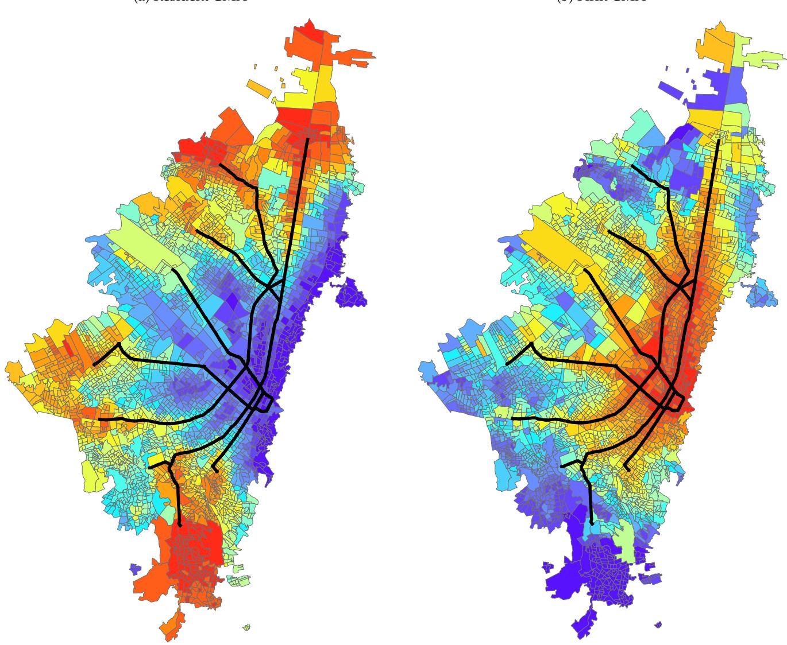
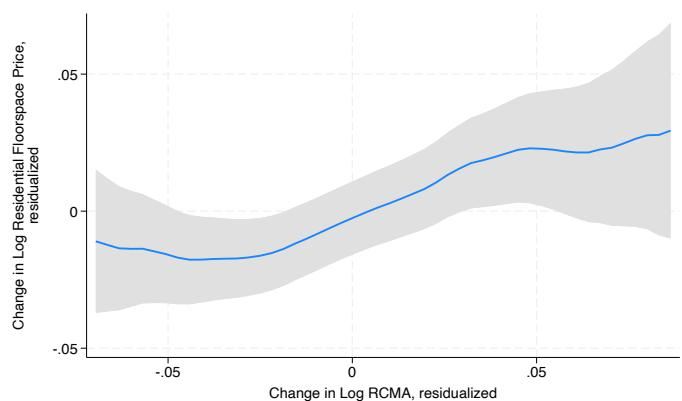
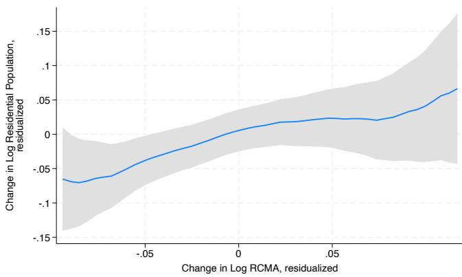
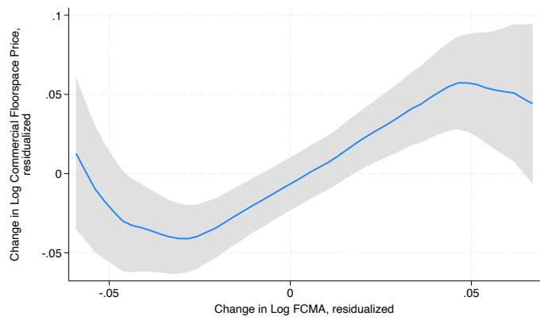
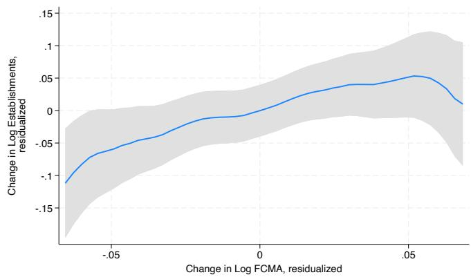
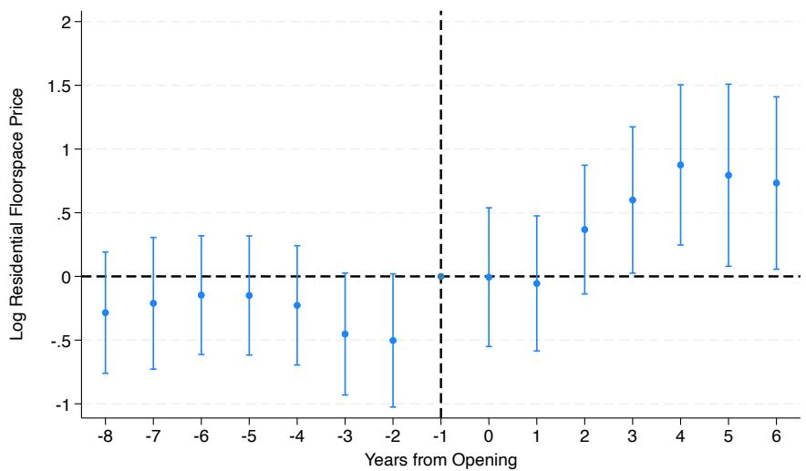

# Evaluating the Impact of Urban Transit Infrastructure: Evidence from Bogotá’s TransMilenio\*

Nick Tsivanidis† University of California, Berkeley

August, 2025

## Abstract

This paper estimates the equilibrium effects of improving public transit infrastructure on city structure and welfare. It begins by developing a quantitative urban model with multiple groups of workers and transit modes. A special case of this model admits a sufficient statistics approach that measures aggregate welfare gains from improved transit in a broader class of models. The paper then estimates the reduced-form elasticities needed to implement the approach using data spanning the construction of the world’s largest Bus Rapid Transit system in Bogotá, Colombia. This class of models performs well in explaining the adjustment of economic activity to the system. The standard approach for measuring the welfare gains from new infrastructure based on the value of travel time saved only accounts for 52% of the total welfare gain. Using the more general model to assess the distributional consequences, there is little impact on inequality after accounting for reallocation and general equilibrium effects.

## 1 Introduction

How large are the economic gains from improving public transit in cities? With 2.5 billion people expected to move to urban areas by 2050—mostly in developing countries—governments will devote vast resources to mass transit to ease congestion from rapid growth. While existing approaches focus on the value of travel time saved (VTTS), measuring the benefits of these systems is challenging.1 Individuals may change where they live and work, firms may expand or enter in newly accessible locations, and wages and house prices may adjust to this reallocation. These effects are missed by time savings, and indirect effects may be felt throughout the city even on those who do not use the system. The lack of detailed intra-city data in less developed countries coinciding with the opening of large transit systems makes the task of evaluating these impacts even more daunting.

This paper studies the impact of new transit infrastructure on the structure of cities and the welfare of their residents. It does so in the context of the construction of the world’s most-used Bus Rapid Transit (BRT) system–TransMilenio–in Bogotá, Colombia. Opened in 2000, TransMilenio handles over 2.2 million trips daily and operates similarly to a subway. Buses run in dedicated lanes with express and local services, and passengers board buses at stations using smart cards. BRTs provide an attractive alternative to subways in rapidly growing developing country cities: they deliver similar reductions in commute times at a fraction of the cost, and are much faster to build.2 This paper uses new sources of data covering 2,800 census tracts on residence, employment, commuting patterns, and land markets available before and after the system’s construction.

Before TransMilenio, poor residents relied on informal buses that were 36% slower than cars. This suggests that new transit may affect the distribution of welfare across the rich and poor. To better understand the implications of improving transit infrastructure, this paper develops a quantitative urban model. Multiple worker skill groups have non-homothetic preferences over transit modes and residential locations, and make decisions over where to live and work and which travel mode to use to commute. Cars are faster than public transit, but are expensive. In equilibrium, rich, higheducated workers are more likely to buy cars while the poor rely on public transit. While this suggests that the poor are likely to benefit most from improved public transit, worker types differ in their willingness to substitute between alternative residential and employment locations and are exposed to equilibrium effects on wages and house prices.

While this model can speak to distributional impacts, a special case provides a simpler sufficient statistics approach to measure the aggregate effects from new transit infrastructure and how it reshapes economic activity across the city. This approach has appeal since these statistics are transparently estimated through linear regression, and because the approach is applicable in a wide class of log-linear models that allow for endogenous firm location choice, endogenous housing supply, capital in the production function, preferences over leisure, and other extensions. These statistics are (i) a location’s change in “commuter market access” (CMA), which summarizes worker and firm access to each other through the commuting network, and (ii) the elasticities of residential population, employment and floorspace prices to CMA, and the elasticity of commute flows to commute costs. Across alternative models, the structural parameters in the reduced-form elasticities of economic activity to CMA differ, but the reduced-form elasticities and the change in CMA are sufficient statistics to specify the impacts of changes in transit infrastructure on economic activity.3

The construction of TransMilenio provides variation in commute costs that can be used to estimate these elasticities, but concerns remain that this variation is endogenous to local unobserved economic fundamentals. Instead of leaning on a single approach, this paper exploits a variety of TransMilenio’s institutional features to establish its causal impact on Bogotá’s structure. First, I digitize four different plans from the 1980s and 1990s for a new transit network in Bogotá and include as regressors both the realized change in CMA due to TransMilenio and the hypothetical change had the network been built under these plans. This serves both as a falsification check (by showing the hypothetical changes had no impact on economic activity conditional on the realized CMA change) and controls for the omitted variable bias that can arise from locations’ non-random exposure to infrastructure changes (Borusyak and Hull 2023). Second, I exploit TransMilenio’s staggered rollout across three phases through event studies and falsification tests and demonstrate that there is no trend in outcomes prior to line openings. Third, I use variation in CMA induced by changes in the network more than 1.5km from a location, which is less likely to be correlated with local unobservables. Fourth, I condition on distance to the closest station to assess whether effects are driven by changes in accessibility rather than by other features of stations (e.g. changes in foot traffic or pollution). Fifth, I construct cost-shifting instruments to predict TransMilenio’s routes based both on a historical tram network and engineering estimates of the cost to build BRT on different types of land. In this estimation, I validate this class of models by demonstrating that the log-linear relationships it predicts between changes in outcomes and CMA are supported by the data.

I then use the estimated elasticities to apply the sufficient statistics approach, leading to one of the paper’s central findings: equilibrium effects—specifically, how commuting choices and land and labor markets adjust—are crucial for accurately valuing the gains from new transit infrastructure in cities. A key theoretical result that arises through the application of the envelope theorem to the social planner’s problem in an efficient economy is that the elasticity of welfare to a change in transit infrastructure is proportional to a weighted average of time savings. This is precisely the VTTS expression used in the literature: when the equilibrium is efficient and the change in infrastructure is infinitesimally small, only the direct effects of time saved matter. However, my results show that the VTTS only accounts for 52% of the total welfare gains in the equilibrium model. The size of the shock explains one-third of the gap, and the externalities explain two-thirds. Welfare rose by 2.34% in the baseline case where the BRT does not cause migration into Bogotá from the rest of Colombia, and 0.69% with migration. GDP per capita rose by 2.6-5.9% in these cases, respectively, net of construction and operating costs. Overall, TransMilenio can account for between 3.1-16.6% of GDP growth in Bogotá from 2000 to 2016, and up to 40.3% of observed population growth. While these findings are specific to Bogotá, the framework can be applied to other cities in both developed and developing countries. While I do not find evidence that TransMilenio impacted travel times on other modes of transportation, an extension of the model allowing for traffic congestion leaves these results qualitatively unchanged.

I next estimate the full model to assess distributional impacts and find that welfare inequality rises by a mild 0.59% due to the BRT. Since this runs against the intuition that the poor benefit more from transit, I use the model to unpack this result. Low-skilled workers do benefit more from improved public transit through higher use. However, two forces favor the high-skilled. First, the incidence of long commute times depends on workers’ ability to substitute away from costly commutes. For instance, if workers have highly specific preferences for certain home and work locations, they will be less responsive to changes in travel times and opt for home-work pairs with relatively high commute costs (all else equal). In the data, high-skilled workers have more inelastic demand for home and work locations, and bear more of the costs of high commute times through this channel (and benefit more when they are reduced). Second, the large shift in the supply of low-skilled labor across the city induced by the BRT lowers their wages in equilibrium. On balance, these forces tend to offset each other. This result is robust to allowing for employment in domestic services and alternative homeownership assumptions.

Two sets of counterfactuals draw additional policy insights. First, I evaluate a “land value capture” (LVC) scheme under which development rights to increase building densities near stations are sold by the government to developers. This increases housing supply and raises government revenue, and similar schemes have seen great success in Asian cities like Hong Kong and Tokyo. However, one of the main criticisms of TransMilenio was that the city experienced a large change in transit without any adjustment to zoning laws to allow housing supply to respond. A well-targeted scheme would have increased the welfare gains from TransMilenio by around 36%, while government revenues would have covered 19-64% of the BRT’s capital costs, depending on the migration response from the rest of Colombia. This highlights the return to cities pursuing an integrated transit and land use policy. Second, by measuring the impacts of counterfactual networks I find that the system of feeder buses, which run on regular roads and connect dense, outlying residential neighborhoods with TransMilenio terminals, have greater welfare gains than either of the two key trunk lines (conditional on the rest of the network being built). This emphasizes the importance of cheap, last-mile services that increase access to mass rapid transit infrastructure.

A large body of work examines the impact of transportation infrastructure on economic activity. One strand examines the impact of new transit infrastructure and typically measures changes in population and property prices as a function of distance to the central business district (Baum-Snow 2007; Gonzalez-Navarro and Turner 2018; Baum-Snow et al. 2017) or distance to stations (Gibbons and Machin 2005; Glaeser et al. 2008; Billings 2011). This paper adds to this work by developing a theory-consistent sufficient statistics approach to measure the impacts of transit infrastructure. The

CMA measures used in this approach embrace the spillovers across spatial units induced through a commuting network that can invalidate identification assumptions in distance-based regressions.4

A second strand of this literature explores the effect of infrastructure between regions on economic development through goods market access in models where agents live and work in the same location (Redding and Sturm 2008; Bartelme 2018; Donaldson and Hornbeck 2016; Donaldson 2018; Alder 2019). This paper considers a different class of urban models where individuals can live and work in separate locations. This distinction leads to meaningful differences in the way the same transit network might affect firm access to workers and resident access to jobs in any location.5 I use the context provided by a large, real world change in transit infrastructure to show that these differential shocks to employment and residence capture the reallocation of economic activity in the city.

This paper also contributes to the growing body of work on quantitative spatial models (Ahlfeldt et al. 2015; Allen et al. 2015; Bird and Venables 2019; Fajgelbaum and Schaal 2020; Monte et al. 2018; Owens et al. 2020; Severen 2021; Bryan and Morten 2019; Heblich et al. 2020; Adao et al. 2019; Allen and Arkolakis 2021). Its main contribution lies in the development of a model in which multiple worker groups have non-homothetic preferences over transit modes and residential amenities. This allows the model to capture how new transit can affect the distribution of welfare across groups through their differential reliance on public transit, and through residential neighborhood choice and gentrification when house prices rise in response to better transit access.

Lastly, this paper relates to work in transportation economics measuring the benefits of improved transportation through the VTTS (Train and McFadden 1978; Small and Verhoef 2007). It connects with work measuring agglomeration externalities, providing intra-city estimates of productivity and amenity spillovers in a developing country city, identified using an expansion in the transit network that separately shifts the supply of labor and residents across the city.6

The paper proceeds as follows. Section 2 discusses the context of TransMilenio and the data. Section 3 develops the model. Section 4 presents and estimates the sufficient statistics approach to assess the BRT’s aggregate effects. Section 5 estimates the full model to measure its distributional effects. Section 6 concludes.

## 2 Background and Data

## 2.1 TransMilenio: The World’s Most-Used BRT System

Background Bogotá is the economic center of Colombia, accounting for 16% of population and 25% of GDP. In 1995, the average work commute took 55 minutes, more than double that in US cities. The vast majority were taken by bus (73%), followed by car (17%) and walking (9%). Despite its importance, public transit was highly inefficient. Bus companies operated routes allocated to them by the city, but a lack of entry controls led to a large over-supply of vehicles. Low enforcement meant that up to half of the city’s bus fleet operated illegally (Cracknell 2003). Disregard of bus stops led to frequent boarding and alighting along curbs, further reducing traffic flows.

At the start of his first term as mayor of Bogotá, Enrique Peñalosa wasted no time in transforming the city’s transit infrastructure. TransMilenio was approved in March 1998, and its first phase opened a mere twenty-one months later, adding 42km along Avenida Caracas and Calle 80, two arteries of the city.7 Phases 2 and 3 added an additional 70km in 2006 and 2012, creating a network spanning the majority of the city. Today, the system is recognized as the “gold standard” of BRT and with more than 2.2mm riders a day using its 147 stations. It is the most heavily utilized system of its kind in the world (Cervero et al. 2013).8 Its average operational speed of 26.2km/h reported during phase one is on par with that of the New York subway (Cracknell 2003), and far surpassed the reported 10km/h speeds on the incumbent bus network (Wright and Hook 2007).

The system involves exclusive dual bus lanes running along the median of arterial roads separated from other traffic. Buses stop only at stations which are entered using a smart card so that fares are paid before arriving at platforms. Dual lanes allow for both express and local services, and passing at stations. Accessibility for poorer citizens in the urban periphery is increased through a network of feeder buses that use existing roads to bring passengers to “portals” at the end of trunk lines at no additional cost. Free transfers and a fixed fare further enhance the subsidization of the poor (at the periphery) while the government sets fares close to those offered by existing buses.

BRT is a particularly attractive alternative to subways in developing country cities since it (i) delivers similar reductions in commute times at a fraction of the cost and (ii) is much faster to build. These features have led to systems being built in more than 200 cities, the vast majority constructed over the past fifteen years in Latin America and Asia (BRT Data 2017).

Route Selection and System Rollout The corridors built during the first phase of the system were consistently mentioned in thirty years of transportation studies as first priority for mass transit (Cracknell 2003). These studies chose routes based on current and future demand levels and expected capital costs. The result was a network that connected the city center with dense residential areas in the north, northwest and south of the city (Hidalgo and Graftieux 2005). The number of car lanes was left unchanged, either because existing busways were converted or due to road widening.

Three features make TransMilenio an attractive context for empirical analysis. First, since 1980 multiple administrations worked on proposals for a subway system. These can be used as placebo checks. Second, having identified neighborhoods in the city’s periphery to be connected with the center, the final routes were chosen largely to minimize construction costs. Lines were placed along wide arterial roads, which were cheaper to convert and determined by the city’s historical evolution. Third, TransMilenio was rolled out quickly, primarily so that a portion could be completed within Mayor Peñalosa’s term that ran between 1998 and 2001. The unanticipated nature of the system’s construction and the staggered opening of lines across three phases provide sources of time series variation used in the analysis.

One central criticism of TransMilenio was its singular focus on improving urban mobility without coordinated changes in land use regulation (Bocarejo et al. 2013): Appendix H shows that housing supply did not respond to the system’s construction. An integrated land use and transit policy that increases housing densities near stations allows more residents and firms to take advantage of improved commuting infrastructure, and sales of development rights can finance construction. In Section 5.3, I assess the impact TransMilenio would have had if Bogotá pursued such an integrated policy.

Trip Characteristics Appendix H.1 summarizes TransMilenio use. First, it is a quantitatively important mode of transit used for longer trips than other modes. Second, TransMilenio provides doorto-door speeds around 25.7% faster than buses and roughly the same as cars. Third, when compared to other modes, the BRT is used more for work commutes than leisure trips. TransMilenio’s outsized role in commuting motivates the focus on access to jobs in this paper.

However, this improvement in public transit may have differentially affected the rich and poor. Table A.19 shows that prior to TransMilenio, commutes by car were around 36% faster than by bus, but that low-educated Bogotanos were about 23% more likely to use buses than cars. Both facts are robust to controlling for origin-destination pair fixed effects to adjust for differences in trip composition.

## 2.2 Data

This section summarizes the data used in the analysis, with further details in Appendix G. The primary geographic unit used in the analysis is the census tract (“sección”). Bogotá is partitioned into 2,799 tracts, with an average size of 133,303 square meters and a mean population of 2,429 in 2005. These are contained within larger spatial units including nineteen localities and 113 planning zones (UPZs).

The primary source of population data is the Department of Statistics (DANE) General Censuses of 1993, 2005 and 2018. This provides the residential population of each block by education level. College-educated individuals are defined as those with some post-secondary education.

Employment data come from two sources. The first is a census covering the universe of establishments from DANE’s 2005 General Census and 1990 Economic Census which report the location, industry and employment of each unit. The second is a database of establishments registered with the city’s Chamber of Commerce (CCB) in 2000 and 2015. The data from 2015 contain the location, industry and employment of each establishment, but in 2000 employment is not provided. I therefore use establishment counts to proxy for employment, but show that establishment count and employment densities are highly correlated in years when both are available. An additional concern is that the spatial distribution of registered establishments may be different from that of total establishments. Figure A.7 shows that the employment and establishment densities in both years of the CCB data are highly correlated with the 2005 census. Coverage is even across rich and poor neighborhoods, suggesting that the CCB data is fairly representative of overall employment. The main specifications examine changes from the CCB data, allowing employment over ten years to respond to the first two phases of the system, but additional analyses use the economic census data to examine the impacts of phase 1 on employment growth in the years following TransMilenio’s opening.

Housing market data between 2000 and 2018 come from Bogotá’s cadastre. Its mission is to keep the city’s geographical information up-to-date. All parcels, formal or informal, are included and the dataset covers 98.6% of the city’s more than two million properties (Ruiz and Vallejo 2010).9 It reports the use, floorspace and land area, and value per square meter of land and floorspace, as well as a number of property characteristics. Values in the cadastre are important for the government since they determine property taxes which make up a substantial portion of city revenue. In developed countries, these valuations are typically determined using information on market transactions. However, like most developing cities, Bogotá lacks comprehensive records of such data and those available may be subject to systematic under-reporting. The city addresses this through an innovative approach involving sending officials to pose as potential buyers in order to negotiate a sales price under the premise of a cash payment (Anselin and Lozano-Gracia 2012). Professional assessors are also sent to value at least one property in one of each of the city’s more than 16,000 “homogeneous zones” (Ruiz and Vallejo 2010). As a result, Figure A.8 shows that the average price per square meter of floorspace in the cadastre is highly correlated with the average purchase price per room reported in a DANE worker survey. Importantly, the relationship is constant across rich and poor neighborhoods which would not be the case were the cadastre over- or under-valuing expensive properties.

Microdata on commuting behavior come from the city’s Mobility Survey administered by the Department of Mobility and overseen by DANE in 2005, 2011 and 2015. For 1995, I obtained the Mobility Survey undertaken by the Japan International Cooperation Agency (JICA) to similar specifications as the DANE surveys in later years. These are representative household surveys in which each respondent was asked to complete a travel diary for the previous day. The survey reports the demographic information of each traveler and household, including age, education, gender, industry of occupation, car ownership and in some years income. For each trip, the data report the departure time, arrival time, purpose of the trip, travel mode, and origin and destination UPZs.

Employment data by worker come from DANE’s Continuing Household Survey (ECH) between 2000 and 2005, and its extension into the Integrated Household Survey (GEIH) for 2008-2015. These are monthly, repeated cross-sectional labor market surveys covering approximately 10,000 households in Bogotá annually. Commute times between each pair of census tracts by mode are computed in ArcGIS using shapefiles of each mode’s network from the city. Figure A.10 shows that the computed times correlate well with observed door-to-door times from the Mobility Surveys.

## 3 A Quantitative Model of a City with Heterogeneous Skills

This section develops a quantitative model that captures the impact of transit infrastructure on the spatial organization of economic activity within a city. It departs from recent work (e.g. Ahlfeldt et al. 2015) by incorporating multiple skill groups of workers, commute modes and industries. Locations differ in terms of commute times, housing floorspace, and (exogenous) amenities and productivities.10 Workers decide where to live, whether to own a car, where to work, and which mode of transit to use to commute. Public transit is available to everyone, but only those with a car have the option to drive. Non-homothetic preferences for car ownership and residential amenities mean the rich are more likely to own cars and live in high-amenity neighborhoods. Amenities and productivities also have components that depend on local economic activity. In equilibrium, floorspace use, floorspace prices and wages adjust to clear markets.

## 3.1 Workers

The city is populated by worker groups indexed by $g \in G = \{ L , H \}$ with a fixed population $\bar { L } _ { g }$ . A worker ω in group g chooses a location i in which to live, a location j in which to work, whether or not to own a car $a \in \{ 0 , 1 \}$ , and the mode of transport m to use to commute to work. Individuals derive utility from consumption of a freely traded numeraire good $\left( C _ { i } ( \omega ) \right)$ ; consumption of residential floorspace $\left( H _ { R i } ( \omega ) \right)$ ; and an amenity reflecting the average preference of each group to live in i under car ownership a $( u _ { i a g } )$ . Owning a car provides an additional mode to use for commuting and an amenity benefit, but comes at a fixed cost $p _ { c a r }$ . Workers are heterogeneous in their match-productivity with firms in each location $( \epsilon _ { j } ( \omega ) )$ ), their preference for each residence-car ownership pair $( \nu _ { i a } ( \omega ) )$ , and their disutility from commuting that reduces their productivity at work $( d _ { i j m } ( \omega ) \geq 1 )$ . Land is owned by residents and rents are redistributed lump sum through payment $\pi .$ 11

Individuals have Stone-Geary preferences in which they need a minimum amount of floorspace $\bar { h }$ in which to live. The indirect utility of a worker who has made choice $( i , j , a , m )$ is then

$$
U _ {i j a m g} (\omega) = u _ {i a g} \left(\frac {w _ {j g} \epsilon_ {j} (\omega)}{d _ {i j m} (\omega)} - p _ {c a r} a - r _ {R i} \bar {h} + \pi\right) r _ {R i} ^ {\beta - 1} \nu_ {i a} (\omega)\tag{1}
$$

where $w _ { j g }$ is the wage per effective unit of labor, $r _ { R i }$ is the price of residential floorspace in $i ,$ and $\beta \in ( 0 , 1 )$

The fixed expenditures on cars and housing allow me to match the Engel curves I document for car ownership and housing expenditure (Figure A.9) and drive sorting of workers over car ownership and residential neighborhoods by income. When cars are quicker than public transit, the rich are more willing to pay the fixed cost since their value of time is higher. The fixed expenditure on subsistence housing means that the poor spend a greater share of their income on housing and are attracted to low amenity neighborhoods where it is cheap.

Workers first choose where to live and whether to own a car, then where to work, and finally which transportation mode to use.12 I solve their problem by backward induction.

Mode Choice Having chosen where to live and work and whether to own a car, individuals choose which mode of transport to use to commute to work. Commuters have nested logit demand across modes. A nest of public modes $B _ { P u b } \equiv \{ { \cal W } { \sf a l k } , \mathrm { B u s }$ , TransMilenio} is available to everyone, while a nest of private modes $\boldsymbol { B _ { P r i v } } \equiv \{ \boldsymbol { \mathrm { C a r } } \}$ is available only to car owners. Therefore, the set of modes available depends on car ownership with $\mathcal { M } _ { 0 } = \mathcal { B } _ { P u b }$ and $\mathcal { M } _ { 1 } = \mathcal { B } _ { P u b } \cup \mathcal { B } _ { P r i v }$ . Individuals have idiosyncratic preferences across modes $v _ { i j m } ( \omega )$ such that the realized commute cost for individual ω is given by $d _ { i j m } ( \omega ) = \exp \left( \kappa t _ { i j m } - \tilde { b } _ { m } + v _ { i j m } ( \omega ) \right)$ , where $t _ { i j m }$ is the time it takes to travel from i to $j$ using mode $m , \tilde { b } _ { m }$ is a preference shifter for mode m and κ controls the disutility from travel time. The commuter’s problem conditional on choice $( i , j , a )$ is simply $\mathrm { m i n } _ { m \in \mathcal { M } _ { a } } \left\{ d _ { i j m } ( \omega ) \right\}$

Following McFadden $( 1 9 7 4 ) , v _ { i j m } ( \omega )$ are drawn from a generalized extreme value (GEV) distribution

$$
F \left(v _ {i j 1}, \dots , v _ {i j N}\right) = 1 - \exp \left(- \sum_ {k} \left(\sum_ {m \in \mathcal {B} _ {k}} \exp \left(v _ {i j m} / \lambda_ {k}\right)\right) ^ {\lambda_ {k}}\right) \quad \text { for } k \in \{\text { Public }, \text { Private } \}.
$$

This allows for correlation of preference shocks within nests, with $\lambda _ { k } \to 0$ under perfect correlation.

Standard results for GEV distributions imply that this leads to nested logit demand for travel modes (see Appendix E.4). Expected utility prior to drawing the shocks $v _ { i j m } ( \omega )$ is given by

$$
U _ {i j a g} (\omega) = u _ {i a g} \left(\frac {w _ {j g} \epsilon_ {j} (\omega)}{d _ {i j a}} - p _ {c a r} a - r _ {R i} \bar {h} + \pi\right) r _ {R i} ^ {\beta - 1} \nu_ {i} (\omega)
$$

where $d _ { i j a } = \exp { ( \kappa t _ { i j a } ) }$ and

$$
t _ {i j 0} = - \frac {\lambda}{\kappa} \ln \sum_ {m \in \mathcal {B} _ {\mathrm{Pub}}} \exp \left(b _ {m} - \frac {\kappa}{\lambda} t _ {i j m}\right)\tag{2}
$$

$$
t _ {i j 1} = - \frac {1}{\kappa} \ln \left(\exp (b _ {C a r} - \kappa t _ {i j C a r}) + \exp (\kappa t _ {i j 0})\right)\tag{3}
$$

where $\boldsymbol { b } _ { m } \equiv \tilde { \boldsymbol { b } } _ { m } / \lambda _ { k } ( m )$ . Intuitively, average commute times $t _ { i j a }$ are a weighted average or inclusive value of commute times on modes available to the individual with car ownership a.

Employment Choice Having chosen where to live and whether to own a car, individuals draw a vector of match productivities with firms across the city from an independent Fréchet distribution $F ( \epsilon _ { j } ) = \exp \left( - \tilde { T } _ { g } \bar { \epsilon } _ { j } ^ { - \theta _ { g } } \right)$ , where $\theta _ { g }$ determines the dispersion of productivities and $\tilde { \cal T } _ { g }$ controls their level.

With these draws in hand, linearity of (1) means that workers choose to work in the location that offers the highest income net of commute costs ma ${ \mathfrak { c } } _ { j } \{ w _ { j g } \epsilon _ { j } ( \omega ) / d _ { i j a } \}$ . Standard results imply that the probability a type-g worker who has made choice $( i , a )$ decides to work in j is given by

$$
\pi_ {j | i a g} = \frac {(w _ {j g} / d _ {i j a}) ^ {\theta_ {g}}}{\sum_ {s} (w _ {s g} / d _ {i s a}) ^ {\theta_ {g}}} \equiv \frac {(w _ {j g} / d _ {i j a}) ^ {\theta_ {g}}}{\Phi_ {R i a g}}.\tag{4}
$$

The term $\begin{array} { r } { \Phi _ { R i a g } \equiv \sum _ { s } ( w _ { s g } / d _ { i s a } ) ^ { \theta _ { g } } } \end{array}$ is defined as Residential Commuter Market Access (RCMA). It captures residents’ access to well-paid jobs from location i. Individuals are more likely to commute to locations with a high wage net of commute costs (the numerator) relative to other locations (the denominator). The sensitivity of commute decisions to commute costs is governed by the dispersion of productivities, with a greater dispersion (lower $\theta _ { g } )$ making choices less sensitive. Differences in $\theta _ { g }$ across groups will be important in determining the incidence of improved infrastructure, since it controls the extent to which individuals are willing to bear high commute costs to work in a location.

Expected income prior to drawing the vector of match productivities is related to RCMA through

$$
\bar {y} _ {i a g} = T _ {g} \Phi_ {R i a g} ^ {1 / \theta_ {g}},\tag{5}
$$

where $T _ { g }$ is a transformation of the location parameter of the Fréchet distribution.13

Residence and Car Ownership Choice In the first stage, individuals choose where to live and whether to own a car to maximize expected indirect utility. The idiosyncratic preferences $\nu _ { i a } ( \omega )$ are drawn from a Fréchet distribution with shape parameter $\eta _ { g } > 1$ and unit scale. The supply of type-g individuals to location i and car ownership a is then

$$
L _ {R i a g} = \lambda_ {U, g} \left(u _ {i a g} \tilde {y} _ {i a g} r _ {R i} ^ {\beta - 1}\right) ^ {\eta_ {g}}\tag{6}
$$

where $\tilde { y } _ { i a g } \equiv \bar { y } _ { i a g } - p _ { c a r } a - r _ { R i } \bar { h } + \pi$ is expected net income and $\lambda _ { U , g }$ is an equilibrium constant.

## 3.1.1 Aggregation

Firm Commuter Market Access and Labor Supply The supply of workers to any location is found by summing over the number of residents who commute there $\begin{array} { r } { L _ { F j g } = \sum _ { i , a } \pi _ { j | i a g } L _ { R i a g } } \end{array}$ . This implies

$$
\begin{array}{c} L _ {F j g} = w _ {j g} ^ {\theta_ {g}} \Phi_ {F j g} \\ \text { where } \Phi_ {F j g} \equiv \sum_ {i, a} d _ {i j a} ^ {- \theta_ {g}} \frac {L _ {R i a g}}{\Phi_ {R i a g}}. \end{array}\tag{7}
$$

Labor supply is log-linear and depends on two forces. First, more workers commute to destinations paying higher wages. Second, conditional on wages firms attract workers when they have better access to them through the commuting network. This is captured through $\Phi _ { F j g }$ which I refer to as Firm Commuter Market Access as it reflects firms’ access to workers. This is because individuals care about wages net of commute costs. Total effective labor supply to a location is given by $\tilde { \cal L } _ { F j g } = \bar { \epsilon } _ { j g } { \cal L } _ { F j g } ,$ , where $\bar { \epsilon } _ { j g }$ is the average productivity of type-g workers who decide to work in $j .$

Worker Welfare Properties of the Fréchet distribution imply that average welfare in each location is equal to the expected utility prior to the first stage given by

$$
\bar {U} _ {g} = \gamma_ {\eta , g} \left[ \sum_ {i, a} \left(u _ {i a g} \tilde {y} _ {i a g} r _ {R i} ^ {\beta - 1}\right) ^ {\eta_ {g}} \right] ^ {1 / \eta_ {g}}.\tag{8}
$$

## 3.1.2 Firms

Technology There are $s \in \{ 1 , \ldots , S \}$ industries that produce varieties differentiated by location under perfect competition. Output is freely traded, and consumers aggregate each variety into the numeraire under CES with elasticity of substitution $\sigma _ { D } > 1$ . Firms produce using a Cobb-Douglas technology over labor and commercial floorspace

$$
\begin{array}{c} Y _ {j s} = A _ {j s} N _ {j s} ^ {\alpha_ {s}} H _ {F j s} ^ {1 - \alpha_ {s}} \\ \text {where} N _ {j s} = \left(\sum_ {g} \alpha_ {s g} \tilde {L} _ {F j g s} ^ {\frac {\sigma - 1}{\sigma}}\right) ^ {\frac {\sigma}{\sigma - 1}}. \end{array}
$$

The labor input is a CES aggregate over each skill group’s effective labor with elasticity of substitution $\sigma , \alpha _ { s } = \textstyle \sum _ { g } \alpha _ { s g }$ is the total labor share, and $A _ { j s }$ is the productivity of location $j$ for firms in industry s which firms take as given.

Industries differ in terms of the intensity in which they use different types of workers $\alpha _ { s g }$ . All else equal, industries like real estate and financial services demand more high-skilled workers while others, such as hotels and restaurants, rely on the low-skilled.

Factor Demand Perfect competition implies that the price of each variety is equal to its marginal

cost $p _ { j s } = W _ { j s } ^ { \alpha _ { s } } r _ { F j } ^ { 1 - \alpha _ { s } } / A _ { j s } ,$ , where $r _ { F j }$ is the price of commercial floorspace in $j$ and

$$
W _ {j s} = \left(\sum_ {g} \alpha_ {s g} ^ {\sigma} w _ {j g} ^ {1 - \sigma}\right) ^ {\frac {1}{1 - \sigma}}
$$

is the cost of labor for firms of industry s in location $j .$ . Intuitively, labor costs differ by industry due to their differential skill requirements. Solving the firm’s cost minimization problem and letting $X _ { j s }$ denote firm sales, the demand for labor and commercial floorspace is

$$
\tilde {L} _ {F j g s} = \left(\frac {w _ {j g}}{\alpha_ {s g} W _ {j s}}\right) ^ {- \sigma} N _ {j s}\tag{9}
$$

$$
H _ {F j s} = (1 - \alpha_ {s}) \frac {X _ {j s}}{r _ {F j}}.\tag{10}
$$

## 3.1.3 Floorspace

Market Clearing In each location there is a fixed amount of floorspace $H _ { i } ,$ a fraction $\vartheta _ { i }$ of which is allocated to residential use and $1 - \vartheta _ { i }$ to commercial use. Market clearing for residential floorspace requires its supply $H _ { R i } = \vartheta _ { i } H _ { i }$ equals demand:

$$
r _ {R i} = (1 - \beta) \frac {E _ {i}}{H _ {R i} - \beta \bar {h} L _ {R i}}\tag{11}
$$

where $\begin{array} { r } { L _ { R i } = \sum _ { g , a } L _ { R i a g } } \end{array}$ is the total number of residents in i. Likewise, the supply of commercial floorspace $H _ { F j } = ( 1 - \vartheta _ { i } ) H _ { j }$ must equal that which is demanded by firms:

$$
r _ {F j} = \frac {\sum_ {s} (1 - \alpha_ {s}) \left(W _ {j s} ^ {\alpha_ {s}} r _ {F j} ^ {1 - \alpha_ {s}} / A _ {j s}\right) ^ {1 - \varsigma} X}{H _ {F j}}.\tag{12}
$$

Floorspace Use Allocation Landowners allocate floorspace $\vartheta _ { i }$ to maximize profits. They receive $r _ { R i }$ per unit allocated to residential use, but land use regulations limit the return to each unit allocated to commercial use to $( 1 - \tau _ { i } ) r _ { F i }$ . Since they maximize profits,

$$
\begin{array}{r l r} & & {\vartheta_ {i} = 1 \mathrm{if} r _ {R i} > (1 - \tau_ {i}) r _ {F i}} \\ & & {(1 - \tau_ {i}) r _ {F i} = r _ {R i} \forall \{i: \vartheta_ {i} \in (0, 1) \}} \\ & & {\vartheta_ {i} = 0 \mathrm{if} (1 - \tau_ {i}) r _ {F i} > r _ {R i}.} \end{array}\tag{13}
$$

## 3.1.4 Externalities

Productivities A location’s productivity depends on both an exogenous component, $\bar { A } _ { j s }$ , which reflects features independent of economic activity (e.g. access to roads, slope of land), and the density of employment in that location

$$
A _ {j s} = \bar {A} _ {j s} \left(\tilde {L} _ {F j} / T _ {j}\right) ^ {\mu_ {A}},\tag{14}
$$

where $\begin{array} { r } { \tilde { L } _ { F j } = \sum _ { s } \tilde { L } _ { F j s } } \end{array}$ is the total effective labor supplied to that location and $T _ { j }$ is its land area. The strength of agglomeration externalities is governed by the parameter $\mu _ { A }$

Amenities Amenities depend on an exogenous component, ${ \bar { u } } _ { i a g } ,$ which varies by car ownership (e.g. leafy streets, proximity to getaways surrounding the city) and a residential externality that depends on the college share of residents

$$
u _ {i a g} = \bar {u} _ {i a g} \left(L _ {R i H} / L _ {R i}\right) ^ {\mu_ {U, g}}.\tag{15}
$$

In contrast to existing urban models (e.g. Ahlfeldt et al. 2015), endogenous amenities depend on demographic composition across skill groups rather than the total density of residents. This seems especially applicable in developing country cities that lack strong public goods provision. In Bogotá, where crime is a significant problem, the rich often pay for private security around their buildings, increasing safety in those areas. This externality provides an additional force toward residential segregation, since the high-skilled are more willing to pay to live in high-amenity neighborhoods and by doing so increase amenities further.

## 3.1.5 Equilibrium

Definition. Given vectors of exogenous location characteristics $\{ H _ { i } , \bar { u } _ { i a g } , \bar { A } _ { j s } , t _ { i j a } , \tau _ { i } \}$ , city group-wise pop ulations $\{ \bar { L } _ { g } \}$ and model parameters $\{ \bar { h } , \beta , \alpha , p _ { c a r } , \kappa , \theta _ { g } , T _ { g } , \eta _ { g } , \alpha _ { s g } , \sigma _ { D } , \sigma , \mu _ { A } , \mu _ { U } \}$ , an equilibrium is defined as a vector of endogenous objects $\{ L _ { R i a g } , L _ { F j g } , w _ { j g } , r _ { R i } , r _ { F i } , \vartheta _ { i } , \bar { U } _ { g } , \pi \}$ such that

1. Labor Market Clearing The supply of labor by individuals (7) is consistent with demand for labor by firms (9);

2. Floorspace Market Clearing The market for residential floorspace clears (11) and its price is consistent with residential populations (6), the market for commercial floorspace clears (12) and floorspace shares are consistent with landowner optimality (13);

3. Closed City Populations add up to the city total, i.e. $\begin{array} { r } { \bar { L } _ { g } = \sum _ { i , a } L _ { R i a g } \forall g } \end{array}$ , and rents are redistributed lump sum to residents.

## 4 Empirical Analysis and Aggregate Effects

This section turns to a reduced form analysis of how TransMilenio reshaped the organization of economic activity in Bogotá. To guide this analysis, I use the insight that a special case of the model delivers a log-linear reduced form between CMA and endogenous variables. The coefficients of these regressions are in fact sufficient statistics to analyze the impact of transit on the distribution of economic activity across the city and aggregate welfare. This approach has appeal since i) its parameters are transparently estimated via linear regression, ii) it holds for a broad class of models and, iii) it can be implemented using less data than is needed to estimate the full model (see Proposition 1). The drawback is that it only speaks to aggregate effects, and so in Section 5 I estimate the full model to measure the BRT’s distributional impacts.

## 4.1 Reduced Form in a Special Case of the Model

Proposition 1 in Appendix A shows that when there is one group of workers and firms, no fixed elements of expenditure or income, and a fixed supply of housing floorspace, the equilibrium can be written as14

$$
\ln \hat {\mathbf {y}} _ {R i} = \boldsymbol {\beta} _ {R} \ln \hat {\Phi} _ {R i} + e _ {R i}\tag{16}
$$

$$
\ln \hat {\mathbf {y}} _ {F i} = \boldsymbol {\beta} _ {F} \ln \hat {\Phi} _ {F i} + e _ {F i}.\tag{17}
$$

The outcome variables $\hat { \mathbf { y } } _ { R i } = [ \hat { L } _ { R i } , \hat { r } _ { R i } ]$ and $\hat { \mathbf { y } } _ { F i } = [ \hat { L } _ { F i } , \hat { r } _ { F i } ]$ are changes in residential and commercial outcomes, consisting of residential population $\hat { L } _ { R i }$ , residential floorspace prices ${ \hat { r } } _ { R i }$ , employment $\hat { L } _ { F i }$ and commercial floorspace prices ${ \hat { r } } _ { F i }$ . The right-hand side variables $\hat { \Phi } _ { R i }$ and $\hat { \Phi } _ { F i }$ are changes in CMA. These depend on average commute times across all modes, $t _ { i j } ,$ as defined in Appendix D.2. The coefficients $\beta _ { R } = [ \beta _ { L _ { R } } , \beta _ { r _ { R } } ]$ and $\beta _ { F } = [ \beta _ { L _ { F } } , \beta _ { r _ { F } } ]$ reflect both the direct and indirect effects of improving CMA as it filters through land and labor markets. Finally, the residuals contain clusters of location characteristics that are exogenous to economic activity. For residential outcomes, eRi contains changes in amenities and residential floorspace supplies while for commercial outcomes, $e _ { F i }$ contains changes in productivities and commercial floorspace supplies.15

This system shows that the transit network only matters for equilibrium outcomes through the two CMA variables. In fact, the change in the entire distribution of economic activity across the city only depends on the change in CMA and on a structural residual that reflects changing exogenous location fundamentals (productivities, amenities and floorspace supplies).16

Proposition 1 also shows that this specification is shared by a broad class of urban models that include endogenous housing supply, firm mobility, capital as a productive input, and leisure in utility. Moreover, it shows that (i) the change in CMA terms and (ii) the reduced-form elasticities of outcomes to CMA are sufficient statistics for the relative change in economic activity across the city in response to changes in transit infrastructure. The overall level of the changes are pinned down by an assumption on population mobility into the city from the rest of the country, as well as by values for the elasticity of demand across varieties $\sigma _ { D }$ and housing expenditure share $1 - \beta .$ These must be specified in some other way by the researcher, for example by calibrating them to external values or aggregate moments.

The CMA terms can be easily recovered (to scale) using data on residential populations, employment, commute costs $d _ { i j } = \exp ( \kappa t _ { i j } )$ , and the commuting elasticity θ from the following system of

equations

$$
\Phi_ {R i} = \sum_ {j} d _ {i j} ^ {- \theta} \frac {L _ {F j}}{\Phi_ {F j}}\tag{18}
$$

$$
\Phi_ {F j} = \sum_ {i} d _ {i j} ^ {- \theta} \frac {L _ {R i}}{\Phi_ {R i}}.\tag{19}
$$

RCMA reflects access to well-paid jobs. It is greater when a location is close (in terms of having low commute costs) to other locations with high employment, particularly when these other locations lack access to workers (increasing the wages that firms there are willing to pay). FCMA reflects access to workers through the commuting network. It is greater when a location is close to other locations with high residential populations, particularly when these other locations lack access to jobs (lowering the wages that individuals are willing to work for there).

I now turn to the specific context of Bogotá to visualize the change in CMA and how it differs from the distance-based measures of treatment effects commonly found in the literature. Figure 1 plots the distribution of changes in CMA induced by the construction of the first two phases of the system, holding population and employment fixed at their initial levels. The system increased access to jobs much more in the outskirts of the city, which were far from the high-employment densities in the center. Firms’ access to workers rose more in the center, where firms stood to benefit from the increased labor supply along all spokes of the network.

## 4.2 Measuring CMA

Computing changes in CMA induced by TransMilenio requires values for θ and $d _ { i j } = \exp ( \kappa t _ { i j } )$

Identifying $\kappa , \lambda , b _ { m }$ . Estimating commute costs $d _ { i j }$ requires values for the mode choice model parameters $\kappa , \lambda , b _ { m }$ to construct the average commute times $t _ { i j }$ . These are estimated via maximum likelihood using standard expressions for choice shares in the nested logit model (see Appendix E.4). The data come from the 2015 Mobility Survey when all modes are available. κ is identified from the sensitivity of choices to differences in travel time across options, λ is identified from the differen tial sensitivity within public modes, and the preference shifters $b _ { m }$ are identified from differences in choice shares conditional on observed travel times. The results are in Panel A of Table 1. The estimate of $\kappa = 0 . 0 1 2$ is very close to the 0.01 reported in Ahlfeldt et al. (2015). The value $\lambda = 0 . 1 3 8$ indicates a sizable correlation of draws within the public nest. Conditional on travel time, cars are most attractive, followed by (non-BRT) bus and TransMilenio. That TransMilenio is the least desirable likely reflects high crowds on the system, and the inconvenience of having to walk between stations and final origins and destinations. With these parameters, $t _ { i j 0 }$ and $t _ { i j 1 }$ can be obtained from (2) and (3). As described in Appendix D.2, average commute times $t _ { i j }$ are computed by assuming residents become car owners according to a Bernoulli distribution, with probability equal to the share of car owners in Bogotá.

Identifying θ. As shown in Appendix D.2, the special case of the model yields a simple gravity equation that relates changes in log commute flows to changes in (average) commute times between any origin-destination pair, net of origin and destination fixed effects. The parameter cluster θκ is identified from how sensitive changes in commute flows are to changes in commute times. Estimating this relationship in Panel B of Table 1 via PPML to account for zeros in the data yields a value of θ = 3.401, similar to existing estimates (Monte et al. 2018; Heblich et al. 2020). I use this as the baseline value, but use alternative values in robustness checks (see Appendix D.2).

## 4.3 Empirical Results

Identifying TransMilenio’s Reduced Form Effect on Economic Activity. The regressions (16) and (17) may be biased if Bogotá’s government chose routes in a way that targeted neighborhoods with differential trends in unobserved characteristics, such as if trying to stimulate lagging regions or to support thriving ones. Instead of leaning on a single approach, I exploit a variety of TransMilenio’s institutional features to establish its causal impact on Bogotá’s structure.

First, I include a rich set of controls, including locality fixed effects to (partially) control for changes in unobservables. Second, I use variation in CMA induced by changes in the network more than 1.5km from a location, which is less likely to be correlated with changes in surrounding unob servables. Third, I condition on distance to closest TransMilenio station to assess whether the effects are driven by changes in accessibility rather than by other station features (e.g. changes in foot traffic, pollution or complementary infrastructure). Fourth, I digitize four different historical plans for Bogotá’s transit network and run specifications including both the realized change in CMA and the change induced by these (hypothetical) planned networks. The coefficients on the planned CMA variables can be interpreted as a placebo check that the planned-but-unbuilt locations do not grow differentially in the absence of new transit. The stability of the coefficients on the realized CMA variables addresses any omitted variable bias (not captured by the controls) that can arise from a location’s non-random exposure to transport infrastructure (Borusyak and Hull 2023). Fifth, I exploit TransMilenio’s staggered rollout across three phases by using event studies and falsification tests which assess whether there is growth in outcomes prior to line openings. Sixth, I construct cost-shifting instruments to predict TransMilenio’s routes based on a historical tram network and on engineering estimates of the cost to build BRT on different types of land.

An additional challenge is that changes in CMA contain population and employment in both periods. Since productivity and amenity shocks that determine residential population and employment are contained in the error terms, they will be mechanically correlated with changes in CMA. I thus construct versions of the change in CMA by solving (18) and (19) while holding population and employment fixed at their initial levels, allowing only commute costs to change, and use these throughout the empirical analysis. This isolates the variation in CMA due only to changing commute costs through TransMilenio’s construction. After solving for the CMA terms, I construct the change in CMA for a given location by excluding the location itself in the summation. This addresses the possibility that changes in unobservables may be correlated with a location’s initial level of economic activity. The main specifications use these CMA measures as regressors, but later in this section I use these to instrument for the “realized” change in CMA.

Main Specification. Table 2 presents the baseline results. Each entry corresponds to the coefficient from a regression of the change in each outcome on the change in RCMA or FCMA in each census tract. Since the data do not all line up, each specification relies on changes over different periods. However, the changes in CMA are always measured using changes in commute times due to TransMilenio routes constructed between the two periods over which the outcome is measured.17 Establishment regressions are weighted by the share of establishments in 2000 in each tract to increase precision.18 Since some establishment results are noisy, I include the share of floorspace used for commercial purposes as an outcome to provide supplemental evidence for TransMilenio’s impact on the reallocation of employment. In the isomorphic model in Appendix D.4, this is an isoelastic function of relative floorspace prices.

Column (1) controls for locality fixed effects, basic tract characteristics, and log distance to central business district (CBD) interacted with region dummies.19 Changes in CMA due to TransMilenio have strong, positive impacts on all outcomes. These relationships are mostly stable as more controls are added in columns (2) and (3), sometimes becoming sharper. The exception is log establishments in the final row, whose coefficient falls by a quarter with the full set of controls. I consider column (3) to be the baseline specification continued in later tables, as it includes the full set of controls.

Column (4) excludes tracts that are closer than 500m from an endpoint of a TransMilenio route (a “portal”) or the CBD. The intent of the government was to connect outlying neighborhoods with the CBD, so the location of these portals may have been endogenous to underlying trends in local economic activity. The coefficients remain largely stable in this subsample of tracts, suggesting that endogeneity in the locations directly targeted by TransMilenio is not driving the results.

Column (5) uses the change in CMA to locations farther than 1.5km away from a tract. Network additions at this distance from a tract are less likely to be linked to local trends in unobservables. The results remain robust and, for the most part, stable. Column (6) assumes users take the quickest mode of public transit available, to show the results are robust to alternative forms of aggregation.

Lastly, column (7) conditions on distance to stations to establish that the effects are primarily driven by changes in accessibility rather than by station features (e.g. changes in foot traffic, pollution or complementary infrastructure). This finding supports the model’s emphasis on accessibility.

Visualizing the Relationship. Figure 2 plots the non-parametric relationship between residual growth in outcomes and CMA. The relationship appears approximately log-linear for each outcome, as predicted by the model. The simple model seems to capture the heterogeneous effects observed in the data: tracts with large improvements in accessibility experience large growth in outcomes.

Hypothetical Changes in CMA from Historical Network Plans. The location of the TransMilenio network was not random. The government may have located the network to support or spur existing local trends in economic activity. To provide additional evidence of TransMilenio’s causal impact, I leverage four distinct historical plans for a transit network digitized from planning documents.

Since 1980, multiple administrations had worked on proposals for building a subway or metro system in Bogotá. Four distinct plans for the network were prepared before Mayor Peñalosa agreed with the proposal by JICA to build a BRT, given that the cost of a subway would have been “ten times higher than the alternative of articulated buses”. I obtained and digitized the maps for these four planned networks, shown in Figure A.3.20 I then solve for the predicted change in CMA had TransMilenio been been built along each of the planned networks, and compute the average change in log RCMA and FCMA across all four plans.

The baseline specification (column 3 of Table 2) is then extended to include these expected changes in CMA under the plans as additional regressors. One interpretation of the results is as a placebo check. If the observed impacts are due to TransMilenio itself rather than to the selection of routes based on trends in unobservables in adjacent neighborhoods, there should be no impact of these planned-but-unbuilt networks. A second interpretation is that this controls for the omitted variable bias that can arise from a location’s non-random exposure to transport infrastructure, as highlighted by Borusyak and Hull (2023). The idea is that some locations may receive systemically different changes in accessibility under any network realization. For example, central neighborhoods will tend to have greater increases in FCMA since they are close to where workers live by virtue of their central location. Identification requires that these “on average” more exposed locations do not differ in their trends in unobservables. While any such trends may already be controlled for by the rich fixed effects and controls used in this paper, controlling for the average change in CMA under these counterfactual networks conducts the exact “recentering” shown by the authors to remove the omitted variable bias. If the controls already capture any differential trend in unobservables in more “on average” exposed locations, then the coefficient on the realized CMA terms should be invariant to the inclusion of the expected change in CMA and the coefficient on the latter should be zero.

Table 3 presents the results. Column (1) repeats the baseline specification, while column (2) adds the control for the expected change in CMA across the four plans. In each case, the coefficient on the realized change in CMA due to TransMilenio is invariant to the inclusion of this additional control. The p-value testing for equality of coefficients on the realized CMA variable across both columns ranges from 0.16 to 0.9 with an average of 0.5 across all five specifications. The coefficient on the planned CMA variable is statistically insignificant from zero in all specifications. These results suggest two things: first, that the observed impacts of TransMilenio are unlikely due to pre-existing trends in neighborhoods selected by city planners, and second, that the existing set of controls does a sufficient job controlling for any omitted variable bias that could arise from non-random exposure to the network.

Staggered Station Openings. TransMilenio was opened in three distinct phases during the 2000s and $2 0 1 0 \mathrm { s } . ^ { 2 1 }$ This section runs a set of falsification checks to test for changes in outcomes prior to the opening of stations in later phases. The specification is

$$
\Delta_ {t, t - \ell} \ln y _ {i} = \beta^ {C u r r e n t} \Delta_ {t, t - \ell} \ln \Phi_ {i} + \beta^ {F u t u r e} \Delta_ {t + k, t} \ln \Phi_ {i} + \gamma^ {\prime} X _ {i} + \varepsilon_ {i}
$$

The outcome is the growth in a variable, $y _ { i } ,$ between two periods, t and t−ℓ (e.g. 2006 and 2000). This is regressed on (i) the change in CMA between t and $t - \ell ,$ (ii) the change in future CMA between $t + k$ and t (e.g. 2015 and 2006), as well as the same set of controls as the baseline specification. If there is no growth in outcomes prior to TransMilenio being built, the coefficient $\beta ^ { F u t u r e }$ should be zero.

The time periods are chosen to best line up with the available data and the opening of TransMilenio lines. Since the openings of phases 1 and 2 are spread out between 2000 and 2006 (with every year except 2004 experiencing station openings), I focus the analysis on phase 3, which opened in 2012 and 2013. For land market outcomes, the change in outcomes is measured between 2008 and 2000. The right-hand side variables include CMA growth due to (i) phases 1 and 2 of the system open by 2006 (to identify $\beta ^ { C u r r e n t } )$ and (ii) phase 3 of the system open by 2013 (to identify $\beta ^ { F u t u r e } )$ . While prices may experience some anticipation effects, plans for phase 3 were mired in uncertainty and delays, with construction only beginning in late 2009. For residential population, the change is measured between the 1993 and 2005 censuses. The right-hand side variables include CMA growth due to phase 1 (open by 2003, with most stations opening by 2001), as well as the change in CMA due to phases 2 and 3. Lastly, for employment, I turn to the measures from the economic census rather than the CCB data. While the latter is available only in 2000 and 2015 (bookending the entire network construction), the economic census is available in 1990 and 2005. This permits me to separately examine the impacts of changes in CMA due to phase 1 versus phases 2 and 3, albeit with a smaller time window for employment outcomes to adjust.

In Table 4, Panel A presents the results for residential population and residential floorspace prices. Odd columns repeat the baseline specification but with outcomes measured over this different period (e.g. 1993 to 2005 for residential population, compared to 1993 to 2018 in the baseline results). The positive relationships remain significant, although the point estimates are somewhat attenuated. This might be expected given that there is less time for outcomes to respond to the change in CMA than in the baseline specification. Even columns then run the specification above. They maintain a significant relationship between outcome growth and CMA growth due to lines constructed over the period, but an insignificant impact due to accessibility from future lines. While insignificant, these estimates of $\beta ^ { F u t u r e }$ are noisy. Panel B finds similar patterns for commercial land market outcomes.

Panel C reports the impact on total and formal employment from the economic census.22 In the odd columns, which regress on realized changes in CMA, the coefficients are positive but imprecisely estimated (p-values of 0.08 and 0.15). These estimates are similar to baseline estimates using the CCB data. The even columns include future CMA growth, which is insignificant (though noisy) for formal employment but significant for overall employment. As shown in Table A.18 Panel A, this result is driven by outliers in the change in CMA; once the top and bottom 1% are trimmed, the impacts of future CMA become insignificant.

Floorspace Price Event Study. I leverage the annual cadastral data to examine more granular house price dynamics prior to the opening of TransMilenio’s third phase. I run regressions of the form

$$
\ln r _ {R i t} = \alpha_ {i} + \gamma_ {\ell (i) t} + \sum_ {\tau = - 8} ^ {\tau = 6} \beta^ {\tau} \Delta_ {1 2, 0 6} \ln \Phi_ {R i} + \delta_ {t} ^ {\prime} X _ {i} + \varepsilon_ {i t},
$$

where $\alpha _ { i }$ are tract fixed effects, $\gamma _ { \ell ( i ) t }$ are locality-year fixed effects, and $\delta _ { t } ^ { \prime } X _ { i }$ is a set of controls with time-varying coefficients. The controls include those from the baseline specification, with the addition of the change in CMA due to the first two phases of the system. This helps capture the impact that these earlier phases had on house prices, which is correlated with the change resulting from phase 3. The regression is weighted by initial floorspace price in 2000 to improve precision. The $\beta ^ { \tau }$ coefficients capture the response of residential floorspace prices in a tract τ years from the third phase lines opening to the change in CMA due to the lines that open during this phase.

Figure 3 plots the event study coefficients. Reassuringly, the change in CMA induced by the network expansion in phase 3 has no impact on floorspace price growth prior to the line openings. It is not clear ex ante that this would be the case. Prices could rise due to anticipatory effects as expectations around whether and where the line would open firm up. Alternatively, they could fall due to the disamenities surrounding the construction from late 2009 through 2012. In fact, consistent with this possibility, there is a mild decrease in house prices in tracts that experienced a larger growth in accessibility due to phase 3 in the two or three years prior to opening. The year before the lines open, the responsiveness of prices to CMA jumps approximately 0.5 log points. This is potentially due to anticipation effects as the opening of the third phase became certain.23 This effect is stable until two years after opening, after which the elasticity rises 0.75 log points until six years after opening.

Instrumental Variables to Predict TransMilenio’s Placement. Lastly, I construct two cost-shifting instruments for TransMilenio routes. These in turn imply two instruments for the change in CMA.24 The first takes as given the government’s overall strategy of connecting portals at the edge of the city with the CBD, excludes those areas from the analysis, and constructs the routes that would have been built if the sole aim had been to minimize costs. This is done by using engineering estimates to compute the cost to build BRT in each parcel of land in Bogotá based on its land use in 1980. This is a valid instrument when these least-cost routes predict TransMilenio’s placement but are uncorrelated with trends in unobserved amenities and productivities (conditional on controls).

The second instrument exploits the location of a tram system that opened in 1884, was last extended in 1921, and stopped operating in 1951. I extend the 1921 lines to the present edge of the city to improve predictive fit, given the city’s substantial expansion over the period. The tram was built along wide arterial roads, which are cheaper to convert to BRT than narrow ones. The tram may have had persistent direct effects on trends in unobservables that lasted well after its construction, which I capture by including historical controls. Conditional on these historical variables, the tram routes should be uncorrelated with changes in productivities and amenities between 2000 and 2012 to the extent that these were unanticipated by city planners in 1921.

The identification assumption is that the instruments have only an indirect effect on outcome growth through the predicted change in CMA. One concern is that features that make a location cheaper to build BRT, such as proximity to a main road, can have direct effects on outcomes. A key advantage of my approach is that I can control for distance to these features (distance to the tram, distance to main roads) and use only residual variation in predicted CMA growth for identification.

Table 5 presents the results. Column 1 reproduces the baseline results for reference. Column 2 shows that the results are very similar when instrumenting the realized change in CMA (allowing residence and employment to change across periods and summing over all locations) with the measure from the baseline specification. Columns 3 and 4 instrument the realized change in CMA using the average change across the tram and least-cost path instruments, using either all tracts except the tract itself (column 3) or only tracts 1.5km away (column 4). The coefficients are mostly stable across these specifications, except for residential floorspace prices which rise when instrumenting for Trans-Milenio’s placement. The population and commercial floorspace price coefficients are imprecise, but sharpen in the last column. Taken together, these specifications support the impression from the analyses above—that changes in CMA due to TransMilenio seem unrelated to trends in unobservables conditional on the rich set of controls. Given the broad stability of the estimates across specifications, I use the coefficients from the baseline specification in the next section but explore the robustness of the results to using the elasticities from the other columns in this table (see Table A.2).

Robustness Checks and Additional Results. Appendix H.6 presents robustness of these results to alternative i) methods of aggregating times; ii) commute elasticities; iii) clustering of standard errors; iv) additional controls and sample selection criterion and v) weighting procedures. Appendix

H.4 provides evidence that TransMilenio increased wages but also led to a sorting response where the high-skilled moved into neighborhoods with improved market access. This is consistent with the model’s Stone-Geary preferences, since the rich are more likely to move into appreciating neighborhoods, given that they spend a smaller fraction of their income on housing.

## 4.4 Aggregate Effects from Reduced Form Sufficient Statistics

Table 6 measures TransMilenio’s aggregate effects by using the estimated reduced-form elasticities to implement the sufficient statistics approach outlined in Proposition 1.

First Order vs General Equilibrium Welfare Impacts. The standard approach to evaluate the gains from transit infrastructure is based on the “value of travel time savings” (e.g. Small and Verhoef 2007). Despite the rich channels captured in the general equilibrium model, Proposition 2 in Appendix D.3 shows that when the equilibrium is efficient, an application of the envelope theorem implies that this is precisely the first order welfare impact from a change in infrastructure.

Panel A of Table 6 simulates what Bogotá would have looked like in 2018 without TransMilenio, and then adds it back in under the different approaches.25 The first column reports TransMilenio’s gains under the first order approximation or VTTS approach from Proposition 2. This delivers a welfare increase of 1.25%, accruing solely through time savings. The second column shows the welfare gains using the full model from Proposition 1 and the estimated elasticities. These deliver a much larger gain of 2.39%. The VTTS thus accounts for only 52% of the total welfare gains, yielding one of the paper’s central results—that equilibrium effects matter for valuing the gains from new transit infrastructure in cities. Confidence intervals for these main welfare effect are reported from a bootstrap procedure that accounts for the uncertainty in the model’s parameter estimates (see Appendix E.3 for details). While there is meaningful uncertainty surrounding these estimates, I can reject the null that the fraction of welfare gains accounted for by the VTTS is not less than one (p-value of 0.01). The difference between the equilibrium and the first order welfare effects could be due either to the size of the shock (since the approximation may perform poorly for large shocks) or deviation from efficiency (due to amenity and productivity externalities). The final column shows that, when externalities are shut down, the VTTS accounts for a larger share of the equilibrium welfare effect. Of the gap between the VTTS and the full general equilibrium effect, roughly one quarter is due to approximation error from the size of the shock, while about three quarters is due to amenity and productivity externalities.

Aggregate Effects. Panel B presents TransMilenio’s impact on aggregate outcomes using the results from Proposition 1.26 Doing so requires values for firm and household expenditure shares on floorspace $1 - \alpha$ and $1 - \beta ,$ , and the demand elasticity $\sigma _ { D } ,$ in addition to the CMA elasticities. I estimate the $1 - \alpha = 0 . 2 0 6$ by computing the share of floorspace in total costs across establishments in each one digit non-agricultural industry, and averaging these by the sectoral employment shares in Bogotá.27 I estimate $1 - \beta = 0 . 2 7 4$ from the average expenditure share of housing in Bogotá. Lastly, I set $\sigma _ { D } = 6$ close to median estimates from Feenstra et al. (2018), but vary this in robustness checks.

The first column presents the closed city results from the model developed above. The second column presents results from an extension outlined in Appendix F.1, which allows for an upwardsloping supply of migrants into the city from the rest of the country. There are large aggregate impacts on welfare and city output under either mobility assumption. Without migration into Bogotá, GDP and welfare rise by 3.25% and 2.34% respectively, with a slight fall in the level of floorspace prices.28 With migration, the welfare gain falls to 0.69% since the increase in population of 11% bids up floorspace values by 7.2%. GDP rises by 17.5%, but this is mostly due to population growth: GDP per capita rises by 6.5%. The final two rows show that TransMilenio can account for between 3.1% and 16.6% of Bogotá’s GDP growth from 2000 to 2016, and up to 40.3% of observed population growth. TransMilenio’s effects are quantitatively important, but not implausibly large. The third row shows that it was also a profitable investment for the city, leading to an increase of at least 2.6% in the steady state level of GDP net of construction and operating costs (see Appendix G.4 for details).

Incorporating Congestion. While speeds for cars and other types of buses did not change on routes adjacent to TransMilenio (see Appendix H), the BRT could have had aggregate effects on road speeds that do not appear in a difference-in-difference specification. Appendix F.2 extends the baseline model to gauge the impact of the BRT in the presence of congestion. The extension blends elements from Allen and Arkolakis (2021) and Gaduh et al. (2022). The “economic module” of the model is unchanged: the same system of equations governs the response of economic activity to a change in commute times. However, a new “traffic module” is added that allows the change in commute times to depend on both new physical infrastructure and any changes in commuting patterns via congestion. The result is one combined system of equations where the change in economic activity and commute times are jointly determined in response to new infrastructure.

The results are shown in Panel C of Table 6, using the congestion elasticity of 0.06 estimated for Bogotá by Akbar and Duranton (2017). The first two rows show TransMilenio’s welfare effect in the model with and without congestion.29 Allowing for congestion leads to a larger welfare gain: as some commuters substitute away from cars onto the BRT, roads become less congested and driving times fall. This effect is small, however, with a welfare increase that is only 0.56% larger than without congestion. The last row assesses the welfare impact had the TransMilenio lanes been used to add new car instead of BRT lanes. The welfare effects are tiny in comparison: the welfare change would have been only 0.64% of the gains caused by TransMilenio. Overall, these results suggest that the baseline welfare effects provide a lower bound of the BRT system’s impact in the presence of congestion.

## 5 Distributional Effects

While the sufficient statistics approach from the previous section can speak to the BRT’s aggregate effects, it is silent on the distribution of these impacts across worker groups. This section therefore estimates the full model from Section 3 to answer this question.30

## 5.1 Parameter Estimation

## 5.1.1 Parameters Estimated without Solving the Model

Externally Calibrated Parameters $\{ \sigma , \sigma _ { D } \}$ I set the elasticity of substitution between labor skill groups to $\sigma = 1 / 0 . 7$ based on the review in Card (2009), and $\sigma _ { D } = 6$ as described in Section 4.4.

Share Parameters $\{ \alpha _ { s } , \beta , \alpha _ { s g } \}$ I estimate $1 - \alpha _ { s } = 0 . 2 0 6$ as described in Section 4.4 using data on the share of floorspace in total production costs, and set this to be equal across industries. I estimate $1 - \beta = 0 . 2 4$ to match Bogotá’s "long-run" housing expenditure share as incomes grow large (see Figure A.9). The labor shares $\alpha _ { s g }$ are calibrated to match the relative wage bill for college-educated workers in each industry (see Appendix E.6).

Commute Costs and Elasticity The estimates $\kappa , \lambda , b _ { m }$ were provided in Table 1, delivering average commute times $t _ { i j a }$ by car ownership status from (2) and (3). The commute elasticities $\theta _ { g }$ can be estimated by taking logs and first differences of the expression for commute flows (4) to yield

$$
\Delta \ln \pi_ {j | i a g} = \gamma_ {i a g} + \delta_ {j g} - \theta_ {g} \kappa \Delta t _ {i j a} + \varepsilon_ {i j a g},
$$

where $\gamma _ { i a g }$ and $\delta _ { j g }$ are fixed effects and $\varepsilon _ { i j a g }$ is an unobserved component of commute costs. Given a value of $\kappa , \theta _ { g }$ is identified off the sensitivity of changes in commute flows to changes in commute times induced by TransMilenio for each group.31

Table 7 presents the results. Across all specifications, high-skilled workers are found to have a lower $\theta _ { g }$ (i.e. a higher dispersion of productivity shocks across locations) making their commute choices less sensitive to commute times. The overall magnitude and fact that more educated workers are estimated to have a greater dispersion of match-productivities line up with existing estimates (e.g. Lee 2020; Hsieh et al. 2019; Galle et al. 2022). Since the moment conditions in the following section use the instruments for TransMilenio’s placement, I use the IV estimates in column 2 as preferred estimates, which yield values of $\theta _ { H } = 2 . 4 4$ and $\theta _ { L } = 4$ . I explore the robustness of the results to using the OLS or PPML estimates in Table A.4.

## 5.1.2 Parameters Estimated Solving the Full Model

It remains to estimate the parameters $\{ \bar { h } , p _ { c a r } , T _ { g } , \eta _ { g } , \mu _ { A } , \mu _ { U , g } \}$ . Appendix E.7 shows how, given prior parameter estimates, there is a vector $\{ \bar { h } , p _ { c a r } , T _ { g } \}$ that matches the average expenditure share on housing, the average expenditure on cars, and the college wage premium, respectively.

The residential supply elasticity $\eta _ { g }$ and the spillover parameters $\mu _ { A } , \mu _ { U , g }$ are estimated via GMM. The intuition for identification is very similar to that of the sufficient statistics approach of Section 4. TransMilenio provides a shock to the attractiveness of each residential neighborhood through increased RCMA. The response of residential inflows to this shock identifies the residential supply elasticity. The response of model-inferred amenities to the resultant change in neighborhood composition identifies the amenity spillover. TransMilenio also provides a shock to the supply of workers commuting to each employment location through increased FCMA. The response of model-inferred productivity to this change in employment identifies the productivity spillover.

Amenities Moments Taking logs of the expression for resident supply (6) delivers

$$
\Delta \ln L _ {R i a g} = \eta_ {g} \Delta \ln V _ {i a g} + \eta_ {g} \mu_ {U, g} \Delta \ln \frac {L _ {R i H}}{L _ {R i}} + \gamma_ {\ell , g} + \gamma_ {R, g} ^ {\prime} \mathsf {C o n t r o l s} _ {i} + \Delta \ln \epsilon_ {R i a g}\tag{20}
$$

where $\Delta$ ln $V _ { i a g } \equiv \Delta$ ln $\tilde { y } _ { i a g } - ( 1 - \beta ) \Delta$ ln $r _ { R i } , \gamma _ { \ell g }$ are locality-group fixed effects, and Controlsi denote tract characteristics (that can have separate effects by group) used to partially control for changes in unobserved amenities. ∆ ln $\epsilon _ { R i a g }$ reflects residual variation in unobserved amenity growth.

The residential supply elasticity $\eta _ { g }$ is identified off the responsiveness of residential populations to exogenous variation in the common utility from living in a location $\Delta$ ln $V _ { i a g }$ . This comes from my instruments for RCMA, which I use to construct predicted change in net income using the instrument for TransMilenio to generate expected income in the post-period. Let $\Delta \ln { \tilde { \Phi } _ { R i a g } ^ { I V } }$ denote the expected growth in net income growth averaged across the LCP and Tram instruments (as in Table 5).32

Identification of the spillovers $\mu _ { U , g }$ requires exogenous variation in a neighborhood’s college share. I use two instruments to this end. First, tracts that experience a greater growth in CMA to high-skilled jobs relative to low-skilled jobs should experience a larger increase in the share of college residents. This is captured by $Z _ { D i f f , i } = \Delta \ln \bar { \tilde { \Phi } } _ { R i H } ^ { I V } - \Delta \ln \bar { \tilde { \Phi } } _ { R i L } ^ { I V }$ where $\begin{array} { r } { \bar { \tilde { \Phi } } _ { R i g } ^ { I V } = \sum _ { a } \tilde { \Phi } _ { R i a g } ^ { I V } . } \end{array}$ . Second, tracts with expensive housing where CMA improves should see a greater rise in the college share. This comes directly from log-linearizing the expression for residential populations (6). Intuitively, poor low-skilled residents are less willing to pay for increased access to jobs in expensive neighborhoods due to their greater expenditure on housing. I capture this by interacting the change for high-skilled residents with the house price in the initial period $Z _ { R e n t s , i } = \Delta \ln \bar { \tilde { \Phi } } _ { R i H } ^ { I V } \times \ln r _ { R i } ^ { 2 0 0 0 } . ^ { 3 3 }$

The moment conditions used to identify $\eta _ { g }$ and $\mu _ { U , g }$ are therefore

$$
E \left[ \Delta \ln \epsilon_ {R i a g} Z _ {R i a g} \right] = 0, \qquad Z _ {R i a g} \in \left\{\Delta \ln \tilde {\Phi} _ {R i a g} ^ {I V} Z _ {D i f f, i} Z _ {R e n t s, i} \right\}.
$$

Productivity Moments Composite productivity $A _ { j s } \propto W _ { j s } ^ { \alpha _ { s } } r _ { F j } ^ { 1 - \alpha _ { s } } X _ { j s } ^ { 1 / ( \sigma _ { D } - 1 ) }$ is the residual that ensures the model definition for sales holds. As shown in Proposition 3 in Appendix E.5, this can be recovered (to scale) using data on employment, residence, floorspace prices and commute costs. The model infers high productivity in locations where employment is high (reflected through high sales) relative to the observed price of commercial floorspace and the accessibility to workers through the commuting network (which determines wages). Taking logs of (14) and including a set of control variables to (partially) capture changing fundamentals yields

$$
\Delta \ln A _ {j s} = \mu_ {A} \Delta \ln \tilde {L} _ {F j} + \gamma_ {\ell} + \gamma_ {F} ^ {\prime} \mathrm{Controls} _ {j} + \Delta \ln \epsilon_ {F j s}
$$

where $\Delta$ ln $\epsilon _ { F j s }$ reflects residual variation in unobserved productivity growth.

The agglomeration elasticity is identified from the extent to which model-implied composite productivity depends on employment. Since employment will be correlated with unobserved components that make locations more productive, I use the instruments for FCMA growth as a labor supply shock. The moment conditions used to identify $\mu _ { A }$ are therefore

$$
E \left[ \Delta \ln \epsilon_ {F i s} Z _ {F i g} \right] = 0, \qquad Z _ {F i g} \in \left\{\Delta \ln \bar {\Phi} _ {F i L} ^ {I V} \quad \Delta \ln \bar {\Phi} _ {F i H} ^ {I V} \right\}.
$$

Both sets of moments are stacked into a system of moment conditions which is estimated jointly in a single GMM estimation. I estimate standard errors via a block-bootstrap procedure, resampling at the tract-level to allow for arbitrary within-tract correlation in unobservables.34

GMM Results Table 8 presents the main results. The productivity externality of 0.253 is somewhat larger than existing estimates, although it is noisy and its confidence interval includes smaller values. This is also one of the first estimates outside a developed-country setting. The residential population elasticities are 1.93 and 2.02 for low- and high-skilled workers, respectively. The externality for residential amenities is 1.11 for high-skilled workers, indicating a strong preference for living in neighborhoods with other high-skilled residents, while the externality for low-skilled residents is 0.77 and statistically indistinguishable from zero.

Model Validation The model’s fit of two non-targeted moments provides additional confidence in its results. First, Figure A.4 plots the observed change in the share of floorspace used for residential purposes against that predicted by the model. While the two correlate well, the correct test of the model is not that the correlation or $R ^ { 2 }$ is high but rather that the regression of the observed on the model-predicted changes has a slope of one (e.g. Adao, Costinot and Donaldson (2023)). The slope of this regression is 1.454 (0.722), which is statistically indistinguishable from one (p-value 0.53). Second, the model predicts that changes in income are related to RCMA through d ln $\begin{array} { r } { \bar { y } _ { i } = \frac { 1 } { \theta } d \ln \Phi _ { R i } } \end{array}$ with elasticity $1 / \theta .$ . This regression is reported in column (3) of Table A.15. The coefficient of 0.522 (0.224) is statistically indistinguishable from $1 / \theta$ after plugging in the estimate of θ = 3.4 (p-value 0.31).

## 5.2 Results

Panel A of Table 9 presents the main result: welfare inequality increases by 0.59% as a result of TransMilenio. It should be noted that the confidence intervals convey uncertainty in this estimate, and the test of whether the high-skilled gain more than the low-skilled only has a p-value of 0.14. With this caveat in mind, I turn to understanding the source of this result.

Why would the high-skilled benefit the most? Panel B decomposes the welfare gains, starting with a simplified case of the model and slowly adding its ingredients to isolate each one’s impact.

The first row assumes that workers share the same (average) value for η and θ and are perfect substitutes in production. This model is similar to the special case in Section 4.4 since it abstracts from heterogeneity across workers. Low-skilled workers benefit the most, with inequality falling by 0.34%.

The second row allows workers to differ in their commuting elasticities. Recall that the highskilled have a lower commute elasticity. This shifts the gains towards the high-skilled, with inequality now rising by 0.2%. A lower commuting elasticity tends to increase the incidence of high commute costs, since workers have very sticky preferences for workplace locations and are less able to substitute away to less costly options when transit is slow. The third row allows the residential choice parameters to equal their estimated values, with a similar increase in inequality of 0.25%.

Note that across these three rows, the average welfare effects between 1.93%-2.41% in the full model are very close to the 2.39% effect from the sufficient statistics approach in Table 6. This suggests that whenever the researcher assumes perfect substitutability in production, the aggregate results from the simpler model provide a good approximation of the welfare effects even when a richer multi-group model is driving the data.

The last thing that changes as one moves to the result from the full model in Panel A is that workers are imperfect substitutes in production. The average welfare effect falls. The reason is that when skill groups are imperfect substitutes, the shock to labor supply from improved transit is smaller. For example, a large inflow of low-skilled workers will increase the supply of the labor bundle less than when workers are perfect substitutes. However, this also causes the sign of the impact on inequality to switch, with welfare inequality rising by 0.59%. This occurs for two reasons. First, high-skilled workers are now partially shielded from the reduction in wages due to the large labor supply shift of low-skilled workers who use public transit, since they are no longer perfect substitutes. Second, it now matters whether each skill group is connected to locations where demand for their skill is highest. For the geography of Bogotá and TransMilenio, this tends to benefit the high-skilled who are concentrated in the city’s north, which TransMilenio connected with the high skill-intensive industries in the center and center-north. Residence and employment for the low-skilled is more dispersed, so TransMilenio connected a smaller fraction of these workers with high-wage locations.

Overall, these results suggest that the incidence of improving public transit depends not only on how much each group uses it, but also on how willing each group is to bear high commute costs to work at a particular location, whether the system connects worker groups with their high-wage locations and the general equilibrium response of wages and house prices. In the context of Bogotá’s TransMilenio, these reallocation and equilibrium effects are large enough to reverse the effects on inequality, which ultimately rose 0.59% as a result of the BRT.

Domestic Services and Alternative Home Ownership Assumptions. From 2000-2014, 7.3% of noncollege educated Bogotanos worked as domestic helpers while almost no college-educated workers did. On the one hand, the model may underestimate the gains to the low-skilled by ignoring the fact that TransMilenio improved access to domestic services jobs in the homes of the college educated in the North. On the other hand, the high-skilled also benefited from this increased labor supply, which lowered the cost of hiring domestic workers. Appendix F.5 extends the model to incorporate employment in domestic services, and Panel C of Table 9 presents the results. Overall, these two effects tend to balance out—the increase in inequality is very similar to the main model in Panel A. The last two rows of Panel C incorporate different assumptions over homeownership as outlined in Appendix F.6, with the results fairly invariant across the alternatives.35

## 5.3 Policy Counterfactuals

Impact of Alternative Networks. The first panel of Table 10 reports the impact on welfare, inequality, and output had alternative TransMilenio networks been built. The first row shows the effect of excluding lines A and H, which connect the city’s north and south to the CBD. The southern line generates a larger welfare effect (welfare would have been 0.41% lower without it), reflecting the higher population density of poor and middle-income workers in that area. By contrast, the northern line has a greater effect on inequality (inequality would have risen by 0.22% less without it). Intuitively, each group benefits most from lines that improve accessibility from where they live.

The welfare gains from these trunk lines are exceeded by those from the feeder bus network (welfare would have been 1.08% lower without it). These buses connect outlying areas with portals and operate on existing roadways. By providing complementary services that extend mass transit access to dense peripheral neighborhoods, they address the last-mile problem between stations and final destinations. Given the relatively low cost of feeder systems compared with capital-intensive BRT, the results suggest a high return to policymakers from investing in inexpensive, complementary services that expand access to mass rapid transit infrastructure.

A key trade-off for policymakers is whether to prioritize fast rail, medium-speed BRT, or slower bus networks. Network speed can shape distributional consequences—for instance, if high-skilled workers are especially willing to pay to live near faster systems and displace poorer residents. The last row considers a counterfactual that increases TransMilenio’s speed to 35 km/h, comparable to the average operating speed of London’s Underground. Both welfare and inequality gains would have been substantially higher, confirming the intuition that faster systems disproportionately benefit richer households. However, Figure A.5 shows that while the college share of residents rises slightly within 500 meters of a station, the increase is modest. This suggests that the mechanisms described above, rather than gentrification, explain why the rich benefit more from faster transit.

Land Value Capture One major criticism of TransMilenio is that its construction was not accompanied by zoning reforms that would have allowed housing supply to adjust where needed. Appendix H shows that housing supply did not respond to the system’s construction, consistent with broader evidence on the restrictive role of land-use regulation (Cervero et al. 2013). By contrast, cities such as Hong Kong and Tokyo have successfully implemented LVC schemes that increase permitted densities around new stations while charging developers for the right to build (Hong et al. 2015). These policies expand housing supply and generate revenue to finance infrastructure construction.

I next evaluate the impact of TransMilenio had housing supply responded to the system’s opening. As a benchmark, I allow supply to adjust log-linearly to increases in floorspace values. Because Bogotá shows no observable supply response that would allow estimation of a city-specific elasticity, I adopt a conservative assumption: housing supply in Bogotá is as inelastic as that of Oakland, CA, the sixth most inelastic U.S. city according to Saiz (2010). I then simulate two potential LVC schemes. First, the government sells developers the rights to increase floorspace by up to 30% within 500m of stations, mimicking “development rights sales” in Asian, European, and U.S. cities.36 Second, the government sells permits for the same total increase in floorspace, but allocates them according to each location’s predicted change in CMA. Appendix F.4 provides details. I compare equilibria by removing TransMilenio (without housing adjustment) and then adding it back under each supply model.

The last two panels of Table 10 present the results. Panel B shows the welfare impacts. Under free adjustment, welfare would have been 35.9% higher than today. Under the LVC schemes, welfare would have been 17.8% higher with the distance-based policy and 35.6% higher with the CMAbased policy (with similar relative effects on output). These gains arise from expanding housing supply where it is most demanded, dampening floorspace price appreciation. The higher return to the CMA-based scheme highlights the value of well-targeted zoning adjustments that direct permits to the areas of greatest demand. Panel C shows the fiscal effects. Depending on population growth in response to the BRT, the distance-based scheme recoups 12–34% of construction costs, while the CMA-based scheme covers 19–64%.

These results suggest substantial welfare gains from integrating transit and land-use policy. Such policies can both finance transit construction and maximize welfare, with the largest benefits achieved when zoning adjustments are targeted to the areas where housing demand increases most.

## 6 Conclusion

This paper makes four contributions to our understanding of the aggregate and distributional effects of urban transit systems. First, it develops a sufficient-statistics approach to evaluate the aggregate effects of new transit infrastructure in cities. Second, it shows how these statistics can be measured from readily available data and estimates them using the variation in accessibility created by Trans-Milenio’s construction. Third, it quantifies the welfare gains from the BRT within the equilibrium model and compares them with the VTTS to isolate the role of reallocation and general equilibrium effects. Fourth, it estimates a richer model that nests the sufficient-statistics approach as a special case to quantify how gains are shared between rich and poor.

The study finds that the quantitative urban model performs well in explaining how economic activity adjusts to transit infrastructure, with the log-linear relationships predicted by the model borne out in the data. The VTTS explain only 52% of the total welfare gain from the new transit infrastructure. Thus, accounting for equilibrium effects is essential for valuing the gains from new transit investments, and the framework developed here provides a blueprint for doing so. It also shows that reallocation and general equilibrium effects diminish the benefits to poorer workers, who use transit most intensively, leading to a modest 0.59% rise in welfare inequality in the case of TransMilenio.

The paper also provides two insights with direct policy relevance. First, low-cost “feeder” bus systems that complement mass rapid transit by providing last-mile connections to terminals yield high returns. Second, welfare gains would have been about 36% larger under a more accommodative zoning policy, while government revenues from an LVC scheme could have covered a substantial share of construction costs. Together, these results underscore the potential for large benefits when cities pursue integrated transit and land-use policies.

ADAO, R., ARKOLAKIS, C., AND F. ESPOSITO (2019), “Spatial Linkages, Global Shocks, and Labor Markets: Theory and Evidence,” Working Paper.

ADAO, R., COSTINOT, A., AND D. DONALDSON (2023), “Putting Quantitative Models to the Test: An Application to Trump’s Trade War,” Working Paper.

AHLFELDT, G.M., REDDING, S.J., STURM, D.M. AND N. WOLF (2015), “The Economics of Density: Evidence from the Berlin Wall,” Econometrica, 83(6): 2127-2189.

AKBAR, P., AND G. DURANTON (2017), “Measuring the Cost of Congestion in a Highly Congested City: Bogotá,” Working Paper.

AKBAR, P., G. DURANTON, COUTURE, V., GHANI, E., AND A. STOREYGARD (2021), “Accessibility and Mobility in Urban India,” Working Paper.

ALCALDÍA MAYOR DE BOGOTÁ D.C. (2009), “Evaluación de la Alternativas de la Red Metro Del SITP,” https://www.metrodebogota.gov.co/sites/default/files/documentos/Producto%2015.%20Tomo %201.%20Formulación%20y%20caracterización%20de%20las%20alternativas%20de%20red%20de %20metro\_0.pdf?width=800&height=800&iframe=true.

ALDER, S., (2019), “Chinese Roads in India: The Effect of Transport Infrastructure on Economic Development,” Working Paper.

ALLEN, T., ARKOLAKIS, C. AND X. LI (2014), “On the Existence and Uniqueness of Trade Equilibria,” Working Paper.

ALLEN, T., ARKOLAKIS, C. AND X. LI (2015), “Optimal City Structure,” Working Paper.

ALLEN, T., AND C. ARKOLAKIS (2019), “The Welfare Effects of Transportation Infrastructure Improvements,” NBER Working Paper 25487.

ALLEN, T., AND C. ARKOLAKIS (2021), “The Welfare Effects of Transportation Infrastructure Improvements,” Working Paper.

ANSELIN, L., AND N. LOZANO-GRACIA (2012), “Is the price right?: Assessing estimates of cadastral values for Bogotá, Colombia,” Regional Science Policy & Practice, 4(4): 495-508.

BALTES, M., J. BARRIOS, A. CAIN, G. DARIDO, P. RODRIGUEZ (2006), “Applicability of Bogotá’s Trans-Milenio BRT System to the United States,” Federal Transit Administration Report Number FL-26- 7104-01.

BARR, J., J. BEVERIDGE, C. CLAYTON, A. DANAHAR, J. GONSALVES, B. KOZIOL, S. RATHWELL (2010), “Designing Bus Rapid Transit Running Ways”, American Public Transportation Association, Recommended Practice Report APTA-BTS-BRT-RP-003-10.

BARTELME, D. (2018), “Trade Costs and Economic Geography: Evidence from the U.S.,” Working Paper.

BAUM-SNOW, N. (2007), “Did Highways Cause Suburbanization?”Quarterly Journal of Economics, 122: 775–805.

BAUM-SNOW, N., BRANDT, L., HENDERSON, J., TURNER, M., AND Q. ZHANG (2017), “Roads, Railroads and Decentralization of Chinese Cities,” Review of Economics and Statistics, 99(3): 435-448.

BAYER, P., FERREIRA, F., AND R. MCMILLAN (2007), “A Unified Framework for Measuring Preferences for Schools and Neighborhoods,” Journal of Political Economy, 115(4): 588— 638.

BILLINGS, S. (2011), “Estimating the value of a new transit option,” Regional Science and Urban Economics, 41(6):525–536.

BIRD, J AND A. VENABLES. (2019), “The efficiency of land-use in a developing city: traditional vs modern tenure systems in Kampala, Uganda,” CEPR Discussion Papers 13563, C.E.P.R. Discussion Papers.

BOCAREJO, J-P., PEREZ, M.A., AND I. PORTILLA (2013), “Impact of Transmilenio on Density, Land Use,

and Land Value in Bogotá,” Research in Transportation Economics, 40:78-86.

BORUSYAK, K., AND P. HULL (2023), “Non-Random Exposure to Exogenous Shocks,” Econometrica, 91(6), p.2155-2185

BRT DATA (2017), Global BRT Statistics, retrieved from http://brtdata.org.

BRYAN, G., AND M. MORTEN (2019), “The Aggregate Productivity Effects of Internal Migration: Evidence from Indonesia,” Journal of Political Economy, 127(5):2229-2268.

CARD, D. (2009),“Immigration and Inequality,” American Economic Review, 99(2): 1–21.

CERVERO, R., IUCHI, K., AND H. SUZUKI (2013), Transforming Cities with Transit: Transit and Land-Use Integration for Sustainable Urban Development., Washington, DC: World Bank.

COMBES, P.-P., G. DURANTON, L. GOBILLON, AND S. ROUX (2010), “Estimating Agglomeration Economies with History, Geology, and Worker Effects,” in Agglomeration Economies, ed. by E. L. Glaeser, Chicago University Press, Chicago.

CONLEY, T. (1999), “GMM Estimation with Cross Sectional Dependence,” Journal of Econometrics, 92(1), 1–45.

CRACKNELL, J. (2003), “Transmilenio Busway-Based Mass Transit, Bogotá, Colombia,” World Bank Working Paper.

DAVIS,M., AND F. ORTALO-MAGNÉ (2011), “Household expenditures, wages, rents,” Review of Economic Dynamics,14(2):248-261.

DIAMOND, R. (2016), “The Determinants and Welfare Implications of US Workers’ Diverging Location Choices by Skill: 1980-2000,” American Economic Review, 106(3):479–524.

DIAZ, O. (2008) “TransMilenio Bus Rapid Transit, Bogotá”, Photograph, Urban Age, https://urbanage.lsecities.net/photographs/transmilenio-bus-rapid-transit-bogota.

DONALDSON, D. (2015), “The Gains from Market Integration,” Annual Review of Economics, 7:619-647.

DONALDSON, D., AND R. HORNBECK (2016), “Railroads and American Economic Growth: A Market Access Approach,” Quarterly Journal of Economics, 131(2): 799-858.

DONALDSON, D. (2018), “Railroads of the Raj: Estimating the Impact of Transportation Infrastructure,” American Economic Review, 108(4-5):899-934.

EATON, J., AND S. KORTUM (2002), “Technology, Geography, and Trade,” Econometrica, 70(5), 1741–1779.

FAJGELBAUM, P. D., AND E. SCHAAL (2020), “Optimal Transport Networks in Spatial Equilibrium,” Econometrica, 88(4):1411-1452.

FEENSTRA, R., P. LUCK, M. OBSTFELD AND K. RUSS (2018), “In Search of the Armington Elasticity,” The Review of Economics and Statistics, 100(1): 135-150.

FERNANDEZ-VAL, I. AND M. WEIDNER (2016), “Individual and Time Effects in Nonlinear Panel Data Models with Large N, T,” Journal of Econometrics, 192(1): 291-312

FUJIMOTO, T., AND U. KRAUSE (1985), “Strong ergodicity for strictly increasing nonlinear operators,” LINEAR ALGEBRA AND ITS APPLICATIONS, 71: 101-112.

GADUH, A., GRACNER, T., AND A ROTHENBERG (2022), “Life in the Slow Lane: Unintended Consequences of Public Transit in Jakarta,” Journal of Urban Economics, 128.

GALLE, S., RODRIGUEZ-CLARE, A., AND M. YI (2022), “Slicing the Pie: Quantifying the Aggregate and Distributional Consequences of Trade,” The Review of Economic Studies.

GANONG P., AND D. SHOAG (2017), “Why has regional income convergence in the U.S. declined?” Journal of Urban Economics, 102:76-90.

GIANNONE, E. (2021), “Skill-Biased Technical Change and Regional Convergence,” Working Paper.

GIBBONS, S., AND S. MACHIN (2005), “Valuing rail access using transport innovations,” Journal of Urban

Economics, 57(1):148–169.

GLAESER, E., KAHN, M., AND J. RAPPAPORT (2008), “Why do the poor live in cities? The role of public transportation,” Journal of Urban Economics, 63(1):1–24.

GONZALEZ-NAVARRO, M., AND M. TURNER (2018), “Subways and urban growth: Evidence from Earth,” Journal of Urban Economics, 108:85-106.

GUERRIERI, G., HARTLEY, D., AND E. HURST (2013), “Endogenous Gentrification and Housing Price Dynamics,” Journal of Public Economics, 100:45-60.

GREENSTONE, M., HORNBECK, R., AND E. MORETTI (2010), “Identifying Agglomeration Spillovers: Evidence from Winners and Losers of Large Plant Openings,” Journal of Political Economy, 118(3), 536–598.

HEBLICH, S., REDDING, S., AND D. STURM (2020), “The Making of the Modern Metropolis: Evidence from London,” The Quarterly Journal of Economics, 135(4):2059-2133.

HIDALGO, D., AND P. GRAFTIEAUX (2008), “Bus Rapid Transit Systems in Latin America and Asia: Results and Difficulties in 11 Cities,” Journal of the Transportation Research Board, 2072(1):77-88.

HISTORIA DE TRANSMILENIO, TransMileno.gov.co. Feb 15, 2022. https://www.transmilenio.gov.co/pub licaciones/146028/historia-de-transmilenio/.

HONG, Y-H., MURAKAMI, J., SUZUKI, H., AND B. TAMAYOSE (2015), Financing Transit-Oriented Development with Land Values, Washinton, DC: The World Bank.

HSIEH, C-T., HURST, E., JONES, C., AND P. KLENOW (2019), “The Allocation of Talent and US Economic Growth,” Econometrica,87(5):1439-1474.

KLINE, P., E. MORETTI (2014), “Local Economic Development, Agglomeration Economies, and the Big Push: 100 Years of Evidence from the Tennessee Valley Authority,” Quarterly Journal of Economics, 129(1), 275–331.

LAWELL, C., UMANSKAYA, V., AND ZHANG, W., (2017), “The Effects of License Plate-Based Driving Restrictions on Air Quality: Theory and Empirical Evidence,” Journal of Environmental Economics and Management,82:181-220.

LEE, E. (2020), “Trade, Inequality, and the Endogenous Sorting of Heterogeneous Workers,” Journal of International Economics, 125.

MACKIE, P., J. NELLTHORP, AND J. LAIRD (2005), “Notes on the Economic Evaluation of Transport Projects,” World Bank Transport Note No. TRN-5.

MCFADDEN, D. (1974), “The measurement of urban travel demand”, Journal of Public Economics, 3(4): 303-328.

MENCKHOFF, G. (2005), “Latin American Experience with Bus Rapid Transit,” presented at Institute of Transportation Engineers Annual Meeting, Melbourne, Australia.

MONTE, F., REDDING, S., AND E. ROSSI-HANSBERG (2018), “Commuting, Migration and Local Employment Elasticities,” American Economic Review,108(12):3855-3890.

MORRISON, A., (2007), “The Tramways of Bogotá, Colombia,” http://www.tramz.com/co/bg/t/te.html

MÜLLER, J.M. (2014), Bus Rapid Transit: The Answer to Transport Problems in Megacities? The Example of TransMilenio (Bogotá, Colombia), in Kraas, F., Aggarwal, S., Coy, M., Mertins, G. (eds) Megaci-

ties, International Year of Planet Earth., Springer, Dordrecht.

OWENS, R., E. ROSSI-HANSBERG, AND P-D. SARTE (2020), “Rethinking Detroit,” American Economic Journal: Economic Policy, 12(2):258-305.

REDDING, S., AND D. STURM (2008), “The Costs of Remoteness: Evidence from German Division and Reunification,” American Economic Review, 98(5), 1766–1797.

ROSENTHAL, S., AND W. STRANGE (2004), “Evidence on the Nature and Sources of Agglomeration Economics,” in Handbook of Regional and Urban Economics, ed. by J. V. Henderson, and J. Thisse, vol. 4. Elsevier North Holland, Amsterdam.

ROSSI-HANSBERG, E., P. SARTE, AND R. OWENS III (2010), “Housing Externalities,” Journal of Political Economy, 118(3): 485-535.

RUIZ, F., AND G. VALLEJO (2010), “Using Land Registration as a Tool to Generate Municipal Revenue: Lessons from Bogota,” Cadastre of Bogota Working Paper.

SAIZ, A. (2010), “The Geographic Determinants of Housing Supply,” The Quarterly Journal of Economics, 125(3):1253-1296.

SALON, D. (2014), “Location Value Capture Opportunities for Urban Public Transport Finance,” Transit Leadership Summit, London, White Paper.

SEVEREN, C. (2021), “Commuting, Labor, and Housing Market Effects of Mass Transportation: Welfare and Identification,” The Review of Economics and Statistics.

STEINER, R., AND H. VALLEJO (2010), Economy, in Colombia: a country study, Library of Congress. Federal Research Division.

SMALL, K., AND E. VERHOEF (2007), The Economics of Urban Transportation, New York: Routledge.

TRAIN, K., AND D. MCFADDEN (1978), “The goods/leisure tradeoff and disaggregate work trip mode choice models,” Transportation Research, 12(5): 349-353.

TRANSPORTATION RESEARCH BOARD (2003), “Bogotá, Colombia. Brief: TransMilenio BRT”, Transit Cooperative Research Program, Report 90.

TRANSPORTATION RESEARCH BOARD (2007), “Bus Rapid Transit Practitioner’s Guide”, Transit Cooperative Research Program, Report 118.

URIBE SANCHEZ, M.C. (2010), “Land Information Updating, a De Facto Tax Reform: Bringing up to Date the Cadastral Database of Bogota,” Cadastre of Bogota Working Paper.

WORLD BANK (2009), 2009 Annual Report: Energy Sector Management Assistance Program (ESMAP), Washington, DC: World Bank.

WRIGHT, L., AND W. HOOK (2007), Bus Rapid Transit Planning Guide, New York: Institute for Transportation and Development Policy.

Table 1: Mode Choice and Commuting Parameter Estimates

<table><tr><td colspan="2">Panel A: Mode Choice</td></tr><tr><td>Parameter</td><td>Estimate</td></tr><tr><td> $\kappa$ </td><td>0.012**(0.006)</td></tr><tr><td> $b_{Bus}$ </td><td>-0.085*(0.051)</td></tr><tr><td> $b_{Car}$ </td><td>0.853***(0.291)</td></tr><tr><td> $b_{TM}$ </td><td>-0.212*(0.108)</td></tr><tr><td> $\lambda$ </td><td>0.138**(0.067)</td></tr><tr><td>N</td><td>19,510</td></tr><tr><td colspan="2">Panel B: Commute Semi-Elasticity(Aggregate)</td></tr><tr><td>Parameter</td><td>Estimate</td></tr><tr><td> $\theta \kappa$ </td><td>0.039**(0.016)</td></tr><tr><td>N</td><td>710</td></tr></table>

Table 2: Baseline Estimates

<table><tr><td></td><td>(1)</td><td>(2)</td><td>(3)</td><td>(4)</td><td>(5)</td><td>(6)</td><td>(7)</td></tr><tr><td colspan="8">Panel A: Residents</td></tr><tr><td>ln(Res Floorspace Price)</td><td>0.345**(0.164)</td><td>0.390**(0.161)</td><td>0.410**(0.159)</td><td>0.375**(0.165)</td><td>0.411***(0.141)</td><td>0.236***(0.087)</td><td>0.372**(0.185)</td></tr><tr><td>N</td><td>2,236</td><td>2,236</td><td>2,236</td><td>2,201</td><td>2,236</td><td>2,236</td><td>2,236</td></tr><tr><td> $R^2$ </td><td>0.42</td><td>0.43</td><td>0.43</td><td>0.43</td><td>0.43</td><td>0.43</td><td>0.43</td></tr><tr><td>ln(Res Population)</td><td>0.630**(0.317)</td><td>0.691**(0.325)</td><td>0.732**(0.318)</td><td>0.620*(0.320)</td><td>0.651**(0.281)</td><td>0.308*(0.169)</td><td>0.983***(0.365)</td></tr><tr><td>N</td><td>2,276</td><td>2,276</td><td>2,276</td><td>2,239</td><td>2,276</td><td>2,276</td><td>2,276</td></tr><tr><td> $R^2$ </td><td>0.34</td><td>0.34</td><td>0.36</td><td>0.36</td><td>0.36</td><td>0.36</td><td>0.36</td></tr><tr><td colspan="8">Panel B: Firms</td></tr><tr><td>ln(Comm Floorspace Price)</td><td>0.575**(0.239)</td><td>0.636***(0.239)</td><td>0.728***(0.238)</td><td>0.683***(0.237)</td><td>0.620***(0.208)</td><td>0.424***(0.130)</td><td>0.811***(0.286)</td></tr><tr><td>N</td><td>2,116</td><td>2,116</td><td>2,116</td><td>2,083</td><td>2,116</td><td>2,116</td><td>2,116</td></tr><tr><td> $R^2$ </td><td>0.10</td><td>0.11</td><td>0.11</td><td>0.12</td><td>0.11</td><td>0.12</td><td>0.11</td></tr><tr><td>Comm Floorspace Share</td><td>0.277***(0.086)</td><td>0.265***(0.087)</td><td>0.258***(0.086)</td><td>0.253***(0.087)</td><td>0.168**(0.071)</td><td>0.133***(0.047)</td><td>0.266***(0.100)</td></tr><tr><td>N</td><td>2,270</td><td>2,270</td><td>2,270</td><td>2,235</td><td>2,270</td><td>2,270</td><td>2,270</td></tr><tr><td> $R^2$ </td><td>0.14</td><td>0.15</td><td>0.15</td><td>0.15</td><td>0.15</td><td>0.15</td><td>0.15</td></tr><tr><td>ln(Establishments)</td><td>2.032**(0.789)</td><td>1.645**(0.789)</td><td>1.508*(0.788)</td><td>1.470*(0.792)</td><td>1.671**(0.674)</td><td>1.082***(0.418)</td><td>1.457(0.950)</td></tr><tr><td>N</td><td>2,026</td><td>2,026</td><td>2,026</td><td>1,993</td><td>2,026</td><td>2,026</td><td>2,026</td></tr><tr><td> $R^2$ </td><td>0.65</td><td>0.67</td><td>0.67</td><td>0.67</td><td>0.67</td><td>0.67</td><td>0.67</td></tr><tr><td>Locality FE</td><td>X</td><td>X</td><td>X</td><td>X</td><td>X</td><td>X</td><td>X</td></tr><tr><td>Log Dist CBD X Region FE</td><td>X</td><td>X</td><td>X</td><td>X</td><td>X</td><td>X</td><td>X</td></tr><tr><td>Basic Tract Controls</td><td>X</td><td>X</td><td>X</td><td>X</td><td>X</td><td>X</td><td>X</td></tr><tr><td>Historical Controls</td><td></td><td>X</td><td>X</td><td>X</td><td>X</td><td>X</td><td>X</td></tr><tr><td>Land Market Controls</td><td></td><td></td><td>X</td><td>X</td><td>X</td><td>X</td><td>X</td></tr><tr><td>Exclude Portals+CBD</td><td></td><td></td><td></td><td>X</td><td></td><td></td><td></td></tr><tr><td>Exclude Band</td><td></td><td></td><td></td><td></td><td>1.5km</td><td></td><td></td></tr><tr><td>Alt Time Aggregation</td><td></td><td></td><td></td><td></td><td></td><td>X</td><td></td></tr><tr><td>Distance to TM Controls</td><td></td><td></td><td></td><td></td><td></td><td></td><td>X</td></tr></table>

Note: Observation is a census tract. Each entry reports the coefficient from a regression of the change in the variable in each row on the change in firm or residential commuter market access (RCMA for residential outcomes, FCMA for commercial outcomes). CMA is always computed holding employment and population fixed at their initial levels and excluding the location itself from the summation. Each column corresponds to a specification. In land market regressions of row 1, 3 and 4, outcomes are log changes between 2018 and 2000 and the change in CMA is that induced by all three phases holding residential population and employment fixed at their levels in 2000 (population in 2000 is a linear interpolation from the 1993 and 2005 census; employment is from the 2000 CCB data). In population regressions of row 2, the outcome is the log change in residential population between 1993 and 2018. The change in CMA is that induced by all three phases of TransMilenio, holding residential population and employment fixed at their levels in 1993 and 1990 respectively (measured from the population and economic censuses). In establishment regressions of row 5, the outcome is the log change in the number of establishments between 2000 and 2015 from the CCB data against the same CMA measures as the land market regressions. Establishment specifications are weighted by the share of establishments in a tract in the initial period. CBD X Region controls are log distance to the CBD, interacted with dummies for whether the locality is in the North, West or South of the city. Basic tract controls include (i) log area, (ii) log distance to the main road, (iii) log distance to a main road interacted with log distance to the CBD, (iv) dummies for each quartile of 1993 population density, 1990 employment share (employment divided by employment plus population), and 1993 college share. Historical controls include dummies for each quartile of population density in 1918, and a dummy for whether the tract was closer than 500m to a main road in 1933. Land market controls include the share of land developed, floor area ratio, share of floorspace used for commercial purpose, and log average floorspace value in 2000. Any control that represents the initial value of an outcome variable is dropped from that specification. Columns (1) to (3) incrementally add controls. Column (4) restricts the sample to tracts more than 500m from a portal or the CBD. Column (5) computes the change in market access to tracts further than 1.5km from the tract itself. Column (6) assumes users take the quickest form of public transit (i.e. the minimum rather than the weighted average within the public nest). Column (7) includes a dummy for whether the tract is closer than 500m from any TransMilenio station. Heteroscedasticity and Autocorrelation Consistent (HAC) standard errors (Conley (1999)) with a 0.5km bandwidth reported in parentheses. $* _ { \boldsymbol { p } } < 0 . 1 ;$ \*\* $p < 0 . 0 5 ; { \^ { * * * } p } < 0 . 0 1$

Table 3: Planned Networks

<table><tr><td></td><td>(1)</td><td>(2)</td></tr><tr><td colspan="3">Panel A: Residents</td></tr><tr><td colspan="3">ln(Res Floorspace Price)</td></tr><tr><td>Δ ln(CMA)</td><td>0.410** (0.159)</td><td>0.397** (0.167)</td></tr><tr><td>E[Δ ln(CMA Plan)]</td><td></td><td>0.066 (0.226)</td></tr><tr><td>N</td><td>4,472</td><td>4,472</td></tr><tr><td>R2</td><td>0.43</td><td>0.43</td></tr><tr><td>p-val</td><td></td><td>0.77</td></tr><tr><td colspan="3">ln(Res Population)</td></tr><tr><td>Δ ln(CMA)</td><td>0.732** (0.318)</td><td>0.803** (0.324)</td></tr><tr><td>E[Δ ln(CMA Plan)]</td><td></td><td>-0.364 (0.365)</td></tr><tr><td>N</td><td>4,552</td><td>4,552</td></tr><tr><td>R2</td><td>0.36</td><td>0.36</td></tr><tr><td>p-val</td><td></td><td>0.32</td></tr><tr><td colspan="3">Panel B: Firms</td></tr><tr><td colspan="3">ln(Comm Floorspace Price)</td></tr><tr><td>Δ ln(CMA)</td><td>0.728*** (0.238)</td><td>0.799*** (0.248)</td></tr><tr><td>E[Δ ln(CMA Plan)]</td><td></td><td>-0.399 (0.414)</td></tr><tr><td>N</td><td>4,232</td><td>4,232</td></tr><tr><td>R2</td><td>0.12</td><td>0.12</td></tr><tr><td>p-val</td><td></td><td>0.33</td></tr><tr><td colspan="3">Comm Floorspace Share</td></tr><tr><td>Δ ln(CMA)</td><td>0.258*** (0.086)</td><td>0.260*** (0.088)</td></tr><tr><td>E[Δ ln(CMA Plan)]</td><td></td><td>0.024 (0.099)</td></tr><tr><td>N</td><td>4,540</td><td>4,540</td></tr><tr><td>R2</td><td>0.15</td><td>0.15</td></tr><tr><td>p-val</td><td></td><td>0.90</td></tr><tr><td colspan="3">ln(Establishments)</td></tr><tr><td>Δ ln(CMA)</td><td>1.508* (0.788)</td><td>1.288 (0.813)</td></tr><tr><td>E[Δ ln(CMA Plan)]</td><td></td><td>1.097 (0.745)</td></tr><tr><td>N</td><td>4,052</td><td>4,052</td></tr><tr><td>R2</td><td>0.67</td><td>0.67</td></tr><tr><td>p-val</td><td></td><td>0.16</td></tr></table>

Note: Column (1) repeats the baseline specification i.e. column $( 3 )$ from Table 2. That is, each entry reports the coefficient from a regression of the change in the variable in each row on the change in firm or residential commuter market access (RCMA for residential outcomes, FCMA for commercial outcomes). Column (2) adds as an additional explanatory variable the average change in RCMA or FCMA (depending on the outcome, RCMA for residential and FCMA for commercial) each tract would have received had TransMilenio been built across the 4 historical plans. The p-value corresponds to a $\chi ^ { 2 }$ test of equality of coefficients on ∆ ln(CMA) in columns 1 and 2. Heteroscedasticity and Autocorrelation Consistent (HAC) standard errors (Conley (1999)) with a 0.5km bandwidth reported in parentheses. $^ { * } p < 0 . 1 ; ^ { * * } p < 0 . 0 5 ; ^ { * * * } p < 0 . 0 1$

<table><tr><td></td><td>(1)</td><td>(2)</td><td>(3)</td><td>(4)</td></tr><tr><td colspan="5">Panel A: Residents</td></tr><tr><td></td><td>Res Price</td><td>Res Price</td><td>Res Pop</td><td>Res Pop</td></tr><tr><td>ln(RCMA)</td><td>0.183*(0.096)</td><td>0.218**(0.101)</td><td>0.279*(0.168)</td><td>0.315*(0.171)</td></tr><tr><td>ln(RCMA) Later Phase</td><td></td><td>0.292(0.211)</td><td></td><td>0.615(0.493)</td></tr><tr><td>N</td><td>2,235</td><td>2,235</td><td>2,277</td><td>2,277</td></tr><tr><td> $R^2$ </td><td>0.46</td><td>0.46</td><td>0.33</td><td>0.33</td></tr><tr><td colspan="5">Panel B: Firms (Land Markets)</td></tr><tr><td></td><td>Comm Price</td><td>Comm Price</td><td>Comm Share</td><td>Comm Share</td></tr><tr><td>ln(FCMA)</td><td>0.595***(0.182)</td><td>0.610***(0.181)</td><td>0.210***(0.055)</td><td>0.213***(0.055)</td></tr><tr><td>ln(FCMA) Later Phase</td><td></td><td>0.748(0.605)</td><td></td><td>0.128(0.177)</td></tr><tr><td>N</td><td>2,133</td><td>2,133</td><td>2,271</td><td>2,271</td></tr><tr><td> $R^2$ </td><td>0.07</td><td>0.07</td><td>0.08</td><td>0.08</td></tr><tr><td colspan="5">Panel C: Firms (Census Employment)</td></tr><tr><td></td><td>Emp</td><td>Emp</td><td>Formal Emp</td><td>Formal Emp</td></tr><tr><td>ln(FCMA)</td><td>1.709*(0.978)</td><td>1.973**(0.979)</td><td>1.681(1.168)</td><td>1.877(1.179)</td></tr><tr><td>ln(FCMA) Later Phase</td><td></td><td>4.622**(2.116)</td><td></td><td>3.781(2.714)</td></tr><tr><td>N</td><td>2,012</td><td>2,012</td><td>1,701</td><td>1,701</td></tr><tr><td> $R^2$ </td><td>0.23</td><td>0.24</td><td>0.17</td><td>0.17</td></tr></table>

Table 4: Staggered Station Openings

Note: Table repeats the baseline specification i.e. column (3) from Table 2. Outcomes are (growth in) residential floorspace prices (Res Prirce), residential population (Res Pop), commercial floorspace prices (Comm Price), commercial floorspace share (Comm Share), employment from the census (Emp), employment in establishments with more than 5 workers (Formal Emp). For land market outcomes, the change in outcomes are measured between 2008 and 2000. The right hand side variables include CMA growth due to (i) phases 1 and 2 of the system open by 2006 (ln(CMA)) and (ii) phase 3 of the system open by 2013 (ln(CMA) Later Phase). For residential population, the change in outcome in measured between the 2005 and 1993 census. The right hand side variables include CMA growth due to phase 1 (open by 2003, with most opening by 2001), and the change in CMA due to phases 2 and 3 (opened in 2006 and 2013). For employment, the change in employment is measured from between the 2005 and 1990 economic censuses. The CMA variables are the same as for residential population. Heteroscedasticity and Autocorrelation Consistent (HAC) standard errors (Conley (1999)) with a 0.5km bandwidth reported in parentheses $^ { * } p < 0 . 1 ; ^ { * * } p < 0 . 0 5 ; ^ { * * * } p < 0 . 0 1$

Table 5: IV Estimates

<table><tr><td></td><td>Baseline</td><td>IV</td><td>IV-LCP&amp;Tram Exc Own</td><td>IV-LCP&amp;Tram Exc 1.5km</td></tr><tr><td colspan="5">Panel A: Residents</td></tr><tr><td>ln(Res Floorspace Price)</td><td>0.410**(0.159)</td><td>0.282***(0.090)</td><td>1.125***(0.213)</td><td>1.115***(0.197)</td></tr><tr><td>N</td><td>2,236</td><td>2,236</td><td>2,201</td><td>2,201</td></tr><tr><td>F-Stat</td><td></td><td>2,564.18</td><td>249.58</td><td>293.35</td></tr><tr><td>ln(Res Population)</td><td>0.732**(0.318)</td><td>0.513***(0.198)</td><td>0.650(0.411)</td><td>0.659*(0.376)</td></tr><tr><td>N</td><td>2,276</td><td>2,276</td><td>2,239</td><td>2,239</td></tr><tr><td>F-Stat</td><td></td><td>1,643.93</td><td>302.37</td><td>349.02</td></tr><tr><td colspan="5">Panel B: Firms</td></tr><tr><td>ln(Comm Floorspace Price)</td><td>0.728***(0.238)</td><td>0.669***(0.201)</td><td>0.640**(0.291)</td><td>0.792***(0.292)</td></tr><tr><td>N</td><td>2,116</td><td>2,116</td><td>2,083</td><td>2,083</td></tr><tr><td>F-Stat</td><td></td><td>2,853.13</td><td>644.24</td><td>788.89</td></tr><tr><td>Comm Floorspace Share</td><td>0.258***(0.086)</td><td>0.236***(0.072)</td><td>0.159(0.103)</td><td>0.142(0.099)</td></tr><tr><td>N</td><td>2,270</td><td>2,270</td><td>2,235</td><td>2,235</td></tr><tr><td>F-Stat</td><td></td><td>2,783.80</td><td>659.57</td><td>790.47</td></tr><tr><td>ln(Establishments)</td><td>1.508*(0.788)</td><td>1.462**(0.621)</td><td>1.574(1.319)</td><td>2.655***(0.843)</td></tr><tr><td>N</td><td>2,026</td><td>2,026</td><td>1,993</td><td>1,993</td></tr><tr><td>F-Stat</td><td></td><td>2,350.59</td><td>165.93</td><td>591.87</td></tr></table>

Note: Observation is a census tract. Specification corresponds to column (3) of Table 2. Column 1 reproduces the baseline results. Column 2 instruments the true change in CMA (i.e. including the location itself in the summation and measure employment and population in both periods instead of holding them constant at their initial values) with the baseline change in CMA measure from column 1. Column 3 instruments for the change in CMA using the average change in CMA across the least cost path (LCP) IV and tram instruments constructing excluding the tract itself in the summation, while column 4 excludes all tracts closer than 1.km from the tract. In this specification, only census tracts further than 500m from a portal and a dummy for whether a census tract is further than 1km from the historical tram system is included (to capture direct effects from the tram instrument). Column 1 reports HAC standard errors as in the baseline specification. Columns 2-4 report heteroscedasticity robust standard errors. $^ { * } p < 0 . 1 ; ^ { * * } p < 0 . 0 5 ; ^ { * * * } p < 0 . 0 1$

## Table 6: Aggregate Results Using Sufficient Statistics Approach

<table><tr><td colspan="4">Panel A: VTTS Comparison</td></tr><tr><td></td><td>VTTS</td><td>GE</td><td>GE (No Ext.)</td></tr><tr><td>Welfare Gain (%)</td><td>1.246</td><td>2.393</td><td>1.526</td></tr><tr><td>90% CI</td><td>(0.431,3.211)</td><td>(0.748,6.360)</td><td></td></tr><tr><td>95% CI</td><td>[0.263,3.691]</td><td>[0.450,8.556]</td><td></td></tr><tr><td>As Fraction of VTTS</td><td></td><td>52.06</td><td>81.63</td></tr><tr><td>90% CI</td><td></td><td>(42.20,63.77)</td><td></td></tr><tr><td>95% CI</td><td></td><td>[38.76,65.83]</td><td></td></tr><tr><td colspan="4">Panel B: Aggregate Effects</td></tr><tr><td></td><td>No Migration</td><td>Migration</td><td></td></tr><tr><td>Welfare</td><td>2.337</td><td>0.688</td><td></td></tr><tr><td>GDP</td><td>3.247</td><td>17.490</td><td></td></tr><tr><td>GDP Net of Costs</td><td>2.630</td><td>16.872</td><td></td></tr><tr><td>Population</td><td>0.000</td><td>10.985</td><td></td></tr><tr><td>Rents</td><td>-0.406</td><td>7.200</td><td></td></tr><tr><td>% of Obs GDP Growth</td><td>3.082</td><td>16.601</td><td></td></tr><tr><td>% of Obs Population Growth</td><td>0.000</td><td>40.282</td><td></td></tr><tr><td colspan="4">Panel C: Incorporating Congestion</td></tr><tr><td></td><td>% Change in Welfare</td><td>% of No Congestion Welfare Change</td><td></td></tr><tr><td>No Congestion</td><td>4.013</td><td>100.00</td><td></td></tr><tr><td>Congestion</td><td>4.035</td><td>100.56</td><td></td></tr><tr><td>Convert TM to Car Lanes</td><td>0.026</td><td>0.64</td><td></td></tr></table>

Notes: Table shows the welfare effects from TransMilenio using the sufficient statistics approach from Proposition 1. Panel A compares the GE welfare effects with those from the first order approximation (VTTS) in proposition 2. The % change in welfare is computed as adding TransMilenio back to the counterfactua equilibrium without it. Each entry is computed by first simulating the effect of removing TransMilenio (the initial equilibrium) and then adding it back in under the different approaches. In column 1, the change in travel times accounts for the discrete choice over modes used to aggregate mode-specific travel times. In column 2, the GE effects are reported using the main reduced form elasticities (column 3 in Table 2). 90% and 95% confidence intervals are provided by bootstrapping the quantitative exercise 200 times as described in Appendix E.3. The second row reports the fraction of GE gains are explained by VTTS, with confidence intervals also reported. The non-parametric test on the bootstrap sample of whether the fraction of gains explained by VTTS is greater than 1 rejects this null (p-value 0.04). Column 3 reports GE results from a model without externalities. It computes the reduced form elasticities using the expressions derived in Appendix E.1.1, using estimates for $\theta , \alpha , \beta ,$ σ and setting $\mu _ { A } = \mu _ { U } = 0 .$ Confidence intervals are not reported since this removes sampling variation from the 4 estimated reduced form elasticities. Panel B shows the (negative of the) value of the percentage change in each variable from removing the TransMilenio network (phases 1 through 3) from the 2016 equilibrium, under both assumptions on population mobility. The scenario with migration assumes a migration elasticity of $\rho = 3$ (see Appendix F.1 for details). The last two rows show the fraction of observed growth of population and GDP between 2000 and 2016 that can be accounted for by TransMilenio under each scenario. Bogotá’s GDP increased by 105.35% (average annual growth rate of 4.6%) while population grew by 27% over the period. GDP net of costs shows the net present value (NPV) increase in GDP accounting for capital costs and the NPV of operating costs as described in Appendix G.4. Note the average welfare value in Panel B differs from that in Panel A, which uses the counterfactual equilibrium without TransMilenio as the initial equilibrium for ease of comparison with the VTTS. Lastly, Panel C reports welfare results from the model allowing for congestion (see Appendix F.2 for details). A congestion elasticity of 0.06 is used, the average congestion elasticity estimated for Bogotá by Duranton and Akbar (2017). The first row shows the welfare effect (the absolute value of $\bar { U } ^ { N o T M } / \bar { U } ^ { T M } - \mathrm { 1 } )$ ) in the closed city model in this model extension, when the congestion elasticity is set to zero. This differs slightly from the baseline number since the congestion elasticity is used when calibrating the unobserved traffic matrix for the observed equilibrium, and the construction of commute times is slightly different due to the routing model of commutes. The second row shows the welfare impact of TransMilenio with congestion, and the second column shows the welfare gains as a fraction of the baseline case without congestion in row 1. The third row shows the welfare impact had TransMilenio routes been made into car lanes instead of BRT (the absolute value of ${ { \bar { U } } ^ { N o T M } } / { { \bar { U } } }$ ReplaceTMW ithRoads − 1).

Table 7: Commuting Elasticities

<table><tr><td></td><td>OLS</td><td>IV-LCP&amp;Tram</td><td>PPML</td><td>PPML</td><td>PPML</td></tr><tr><td>HighSkill X In Commute Cost</td><td>-0.0250**(0.0116)</td><td>-0.0281**(0.0124)</td><td>-0.0154***(0.0028)</td><td>-0.0054(0.0103)</td><td>-0.0257***(0.0089)</td></tr><tr><td>LowSkill X In Commute Cost</td><td>-0.0278**(0.0121)</td><td>-0.0462***(0.0151)</td><td>-0.0292***(0.0027)</td><td>-0.0534***(0.0108)</td><td>-0.0666***(0.0096)</td></tr><tr><td>N</td><td>1,738</td><td>1,738</td><td>1,444</td><td>2,608</td><td>4,032</td></tr><tr><td>Years</td><td>1995,2015</td><td>1995,2015</td><td>2015</td><td>1995,2015</td><td>1995,2011,2015</td></tr><tr><td>Origin-Destination-Skill-Car Ownership FE</td><td>X</td><td>X</td><td></td><td>X</td><td>X</td></tr><tr><td>Destination-Skill-Year FE</td><td>X</td><td>X</td><td>X</td><td>X</td><td>X</td></tr><tr><td>Origin-Skill-Car Ownership-Year FE</td><td>X</td><td>X</td><td>X</td><td>X</td><td>X</td></tr></table>

Note: Outcome is the conditional commuting shares. Observation is an origin-destination-skill-car ownership-year cell. Skill corresponds to college or non college educated workers. Only trips to work during rush hour (5-8am) by individuals aged 18-65. Columns 1 and 2 estimate OLS and IV models between 1995 and 2015. Columns 3-5 run PPML models on alternative sets of years: 2015, 1995 and 2015, and 1995, 2011 and 2015 respectively. Since the coefficient for high-skill workers is imprecise in the main specification using two years in column 4, the final column 5 pools data from 3 years. Travel times are measured according to the network in each year e.g. travel times for TransMilenio in 2011 come from the 2006 network, while those in 2015 come from the 2012 network. Standard errors are clustered at the origin-destination locality. $^ { * } \mathrm { p } < 0 . 1 ; ^ { * * } \mathrm { p } < 0 . 0 5 ; ^ { * * * } \mathrm { p } < 0 . 0 1$

Table 8: GMM Results

<table><tr><td>Parameter</td><td>Estimate</td></tr><tr><td colspan="2">Panel A: Firms</td></tr><tr><td> $\mu_A$ </td><td>0.253**(0.107)</td></tr><tr><td colspan="2">Panel B: Workers</td></tr><tr><td> $\eta_L$ </td><td>1.928**(0.834)</td></tr><tr><td> $\eta_H$ </td><td>2.017***(0.746)</td></tr><tr><td> $\mu_U^L$ </td><td>0.769(0.602)</td></tr><tr><td> $\mu_U^H$ </td><td>1.105**(0.511)</td></tr></table>

Note: Estimates are from joint GMM procedure as described in the text. In Panel A, controls are locality fixed effects, log distance to CBD interacted with region fixed effects, basic tract controls (log area, log distance to the main road, log distance to a main road interacted with log distance to the CBD, dummies for each quartile of 1993 population density, 1990 employment share (employment divided by employment plus population), and 1993 college share), land market controls (share of land developed, floor area ratio, share of floorspace used for commercial purpose, and log average floorspace value in 2000) and historical controls (dummies for each quartile of population density in 1918). In Panel B, controls are locality fixed effects, basic tract controls (log area, log distance to the main road, log distance to a main road interacted with log distance to the CBD, dummies for each quartile of 1990 employment share), land market controls (share of land developed, floor area ratio, share of floorspace used for commercial purpose, and dummies for each quartile of floorspace value in 2000) and historical controls (dummies for each quartile of population density in 1918). All controls and fixed effects are interacted with group-specific dummies. Tracts closer than 500m to a TransMilenio portal are excluded. Instruments exclude the tract itself in summations, and are averages across the LCP and Tram measured as in the reduced form results. Standard errors clustered by tract obtained from 200 block-bootstrapped replications resampled at the tract-level. $^ { * } p < 0 . 1 ; ^ { * * } p < 0 . 0 5 ; ^ { * * * } p < 0 . 0 1$

Table 9: Main Quantitative Results & Distributional Effects

<table><tr><td></td><td>Average Welfare</td><td>Inequality</td></tr><tr><td colspan="3">Panel A: Main Results</td></tr><tr><td>Diff θ, η, Imperf Sub</td><td>1.197</td><td>0.585</td></tr><tr><td>90% CI</td><td>(0.336, 4.198)</td><td>(-0.186, 0.921)</td></tr><tr><td>95% CI</td><td>[0.095, 4.726]</td><td>[-0.486, 1.031]</td></tr><tr><td>P-value  $\widehat{U}_{H} > \widehat{U}_{L}$ </td><td colspan="2">0.14</td></tr><tr><td colspan="3">Panel B: Decomposing the Role of Elasticities</td></tr><tr><td>Same η, θ, Perf Sub</td><td>1.925</td><td>-0.339</td></tr><tr><td>Diff θ, same η, Perf Sub</td><td>2.140</td><td>0.204</td></tr><tr><td>Diff θ, η, Perf Sub</td><td>2.412</td><td>0.249</td></tr><tr><td colspan="3">Panel C: Model Extensions</td></tr><tr><td>Domestic Services</td><td>0.999</td><td>0.621</td></tr><tr><td>Local Home Ownership</td><td>1.045</td><td>0.712</td></tr><tr><td>All Renters</td><td>1.046</td><td>0.755</td></tr></table>

Note: Table shows the percentage welfare and inequality change (defined as $\widehat { \bar { U } } _ { H } / \widehat { \bar { U } } _ { L } )$ from TransMilenio under models. Each entry is computed by first simulating the effect of removing TransMilenio, and reports the absolute value of the percentage welfare change from moving from the TM to no TM equilibrium. Panel A reports results from the full model, where $\theta _ { g } , \eta _ { g }$ are set to their estimated values and $\sigma = 1 / 0 . 7$ as described in the text. Confidence intervals from 200 bootstrap replications are reported (using the same procedure as described in Appendix E.3), as well as the p-value from a non-parametric test of whether the high-skill gain more than the low-skilled across these bootstraps. Panel B reports results decomposing the role of these elasticities. The first row assumes $\theta , \eta$ are equal across groups (set to their average value) and labor types are perfect substitutes in production. The second and third rows allow θ and η to differ across groups (set to their estimated values). Panel C shows results from model extensions to allow for employment of the low-skilled in domestic services, as well as alternative assumptions over homeownership. See Appendix F.5 and F.6 for further details.

<table><tr><td colspan="4">Panel A: Alternative Networks</td></tr><tr><td></td><td>% Δ Welfare</td><td>% ΔInequality</td><td>% ΔOutput</td></tr><tr><td>Remove Line South</td><td>-0.409</td><td>-0.049</td><td>-0.324</td></tr><tr><td>Remove Line North</td><td>-0.141</td><td>-0.224</td><td>-0.715</td></tr><tr><td>Remove Feeders</td><td>-1.083</td><td>-0.198</td><td>-1.039</td></tr><tr><td>Faster TM</td><td>1.622</td><td>0.690</td><td>2.856</td></tr></table>

Panel B: Land Value Capture Welfare Effects

<table><tr><td rowspan="2"></td><td colspan="2">% Increase Relative to Baseline</td></tr><tr><td>Welfare</td><td>Output</td></tr><tr><td>Free Adjustment</td><td>35.87</td><td>16.50</td></tr><tr><td>LVC, Bands</td><td>17.82</td><td>9.46</td></tr><tr><td>LVC, CMA</td><td>35.64</td><td>12.44</td></tr></table>

Panel C: Land Value Capture Revenue Effects

<table><tr><td></td><td>Closed City</td><td>Open City</td></tr><tr><td>LVC Band Revenue (mm)</td><td>185.78</td><td>493.12</td></tr><tr><td>As share of capital costs</td><td>12.82</td><td>34.01</td></tr><tr><td>LVC CMA Revenue (mm)</td><td>281.13</td><td>924.77</td></tr><tr><td>As share of capital costs</td><td>19.39</td><td>63.79</td></tr></table>

Note: Panel A shows the impact of particular network components relative to the full network using the full model. The numbers report the percentage change in each variable from moving from the full TransMilenio network to the counterfactual one. The last row reports results from making the TransMilenio faster, with an operational speed of 35km/h. Panel B shows the impacts of alternative housing supply models, using the model extension from Section F.4. I first solve for the counterfactual equilibrium without TransMilenio. I then compute the equilibrium returning to the TransMilenio network under each housing supply model, and report the percentage change in each variable as a fraction of returning to the observed network under the fixed housing supply assumption (minus one, since the change in each variable in each counterfactual scenario exceeds the value under fixed housing supply). The first row is the case with freely adjusting housing. The second row is the distance-band based land value capture (LVC) scheme, where the government sells rights to construct up to 30% new floorspace in tracts closer than 500m from stations. The third row is the CMA-based scheme where the same number of permits are issued by distributed instead by a tract’s relative change in CMA as described in the text. These figures are all from the closed city model, relative comparisons are similar in the open city model. Panel C shows the government revenue earned under the land value capture policies, in levels and as a fraction of TransMilenio’s construction costs. These are reported for the closed and open city model separately since the results vary by assumption. Numbers in millions of 2016 USD.

(b) Firm CMA

## Figures

Figure 1: Change in Commuter Market Access from TransMilenio

(a) Resident CMA

Note: Plot shows the change in CMA from the baseline specification. The change in CMA is computed holding population and employment fixed at their initial level in 1993 and 1990 respectively and changing only commute costs to the full TransMilenio network as of phase 3. This isolates the change due only to TransMilenio (discussed in Section 4.3). FCMA increases toward the center-North due to the high density of (low-skilled) workers in the South. Tracts are grouped into vigintiles based on the change in CMA, with warmer colors indicating a larger increase in CMA. The black line shows the TransMilenio routes as of 2013. The changes in CMA are normalized to have mean zero. For the change in RCMA, the min is -.198, the max is .375, the standard deviation is 0.097 and the average range of each vigintile is .028. For the change in FCMA, the min is -.147, the max is .246, the standard deviation is 0.068 and the average range of each vigintile is .020.

Figure 2: Non-Parametric Relationship Between Outcomes and Commuter Market Access  
(a) Residential Floorspace Prices  
  
(c) Commercial Floorspace Prices

(b) Residential Population  
  
(d) Employment

  
Note: Plot shows the non-parametric relationship between outcomes and CMA. Specifications correspond to the reduced form from column (3) of Table 2. Top and bottom 2% of the change in CMA are trimmed to reduce noise at the tails and zoom in on the main relationship.

Figure 3: Residential Floorspace Price Event Study  
  
Note: See discussion in Section 4.3 for details. The year before opening is the omitted category. Heteroscedasticity and Autocorrelation Consistent (HAC) standard errors (Conley (1999)) with a 0.5km bandwidth reported.

## Appendix

## A Sufficient Statistics for Impacts of Transit Infrastructure

The following proposition shows how the model and related extensions admit a simple reduced form and sufficient statistics approach to quantify the impacts of changes in transit infrastructure.

Proposition 1. Consider a special case of the model with one group of workers and firms, no fixed elements of expenditure or income, and a fixed supply of residential and commercial floorspace. Consider a change in commute costsfrom d to d′, and let $\hat { x } \equiv x ^ { \prime } / { : }$ x denote relative changes in a variable between the pre- and post-period. Then:

Part 1: Reduced Form. The model yields a reduced form where endogenous variables can be written as log-linear functions of CMA as

$$
\begin{array}{r} \ln \hat {\mathbf {y}} _ {i} = \boldsymbol {\beta} _ {R} \ln \hat {\Phi} _ {R i} + \tilde {\boldsymbol {\beta}} _ {1, F} \ln \hat {\Phi} _ {F i} + \tilde {\boldsymbol {\beta}} _ {2, F} \ln \hat {\tilde {\Phi}} _ {F i} + \mathbf {e} _ {i} \\ \approx \boldsymbol {\beta} _ {R} \ln \hat {\Phi} _ {R i} + \boldsymbol {\beta} _ {F} \ln \hat {\Phi} _ {F i} + \mathbf {e} _ {i} \end{array}
$$

where $\mathbf { y } _ { i } ~ = ~ \left[ L _ { R i } , r _ { R i } , r _ { F i } , L _ { F i } \right]$ and $\mathbf { e } _ { i }$ is a vector of structural residuals. $\beta _ { F }$ and $\beta _ { R }$ have zero elements in the first and last two entries respectively, so this is a system of 4 univariate regressions yielding 4 coefficients $\beta _ { L _ { R } } , \beta _ { r _ { R } } , \beta _ { r _ { F } } , \beta _ { L _ { F } }$ . Unique (to-scale) values ofthe CMA terms $\Phi _ { R i } , \Phi _ { F i }$ can be computed given data $\{ L _ { R i } , L _ { F i } , d _ { i j } \}$ and the commuting elasticity θ. While the first line holds exactly (given the values for $\hat { \Phi } _ { R i } , \hat { \Phi } _ { F i } , \hat { \tilde { \Phi } } _ { F i }$ which also depend on $\hat { L } _ { R i } , \hat { L } _ { F i } ) .$ , the second lines uses thefirst-order approximation ln $\begin{array} { r } { \hat { \tilde { \Phi } } _ { F i } \approx \frac { \theta - 1 } { \theta } } \end{array}$ ln $\Phi _ { F i }$ around $d _ { i j } ^ { - \theta } = 0$

Part 2: Relative Impacts of Transit Infrastructure. Assuming that exogenous, location-specific characteristics are unchanged by the infrastructure, relative changes in endogenous variables $\begin{array} { r } { \hat { \hat { \mathbf { y } } } _ { i } \equiv \hat { \mathbf { y } } _ { i } / ( \prod _ { r } \hat { \mathbf { y } } _ { i } ) ^ { 1 / I } } \end{array}$ can be computed using (i) estimates of $\beta _ { L _ { R } } , \beta _ { r _ { R } } , \beta _ { r _ { F } } , \beta _ { L _ { F } } , \theta ,$ (ii) data on the initial distribution of economic activity $\{ L _ { R i } , L _ { F i } , d _ { i j } \}$ and (iii) data on the change in commute costs $\{ \hat { d } _ { i j } \}$

Part 3: Level Impacts of Transit Infrastructure. Level changes in endogenous variables $\hat { \mathbf { y } } _ { i }$ and endogenous constants $\hat { \bar { L } } , \hat { \bar { U } }$ can be computed from the relative changes obtained in part 2 with (i) an assumption on population mobility between the city and the rest of the country, and (ii) valuesfor $\sigma _ { D } , \beta .$

Part 4: Isomorphisms. Parts 1 and 2 apply to a more general class of models which feature (i) a gravity equation for commute flows and (ii) an equilibrium that can be written as a system of K equations in K endogenous variables $\{ y _ { 1 i } , \dotsc , y _ { k i } \} _ { i = 1 } ^ { I }$ of the form

$$
\prod_ {k = 1} ^ {K} y _ {k i} ^ {\alpha_ {k h}} = \lambda_ {h} \Phi_ {R i} ^ {b _ {h} ^ {R}} \Phi_ {F i} ^ {b _ {h} ^ {F}} e _ {i h} f o r h = 1, \ldots , K.
$$

These models will yield the same counterfactual changes in outcomes (relative to city-wide averages) as those from the baseline model, given estimates of $\beta _ { R } , \beta _ { F } , \theta .$ . This class includes models with isoelastic housing supply, endogenous firm location choice, capital in the production function, Eaton and Kortum production, leisure, preference rather than productivity shocks, and alternative residential and employment supply elasticities and timing assumptions. However, the overall level of changes and changes in endogenous constants will depend on (a subset of) the particular structural parameters ofthe model $\{ \{ \alpha _ { k h } \} _ { k } , b _ { h } ^ { R } , b _ { h } ^ { F } \} _ { h } ,$ and are not determined by the reducedform elasticities alone.

The implications of these results are now discussed in turn.

Reduced Form Representation. The first part of Proposition 1 shows that the transit network only matters for equilibrium outcomes through the two CMA variables. In fact, the change in the entire distribution of economic activity across the city between two periods depends only on the change in CMA as well as a structural residual that reflects changing location fundamentals (productivities, amenities and floorspace supplies).37 This system reduces to a system of four univariate regressions, where residential outcomes depend on RCMA and commercial outcomes depend on FCMA.

These CMA terms can be easily recovered using data on residential populations, employment, commute costs and the commuting elasticity θ. This ensures that estimation of the reduced form is straightforward, even if CMA is not directly observed in the data.

The proof of Proposition 1 shows that the CMA terms are the unique to-scale solution to the system given in (18) and (19) in the paper. It also discusses the approximation used to collapse the reduced form that contains three CMA terms $\Phi _ { R i } , \Phi _ { F i } , \tilde { \Phi } _ { F i }$ into one with just $\Phi _ { R i } , \Phi _ { F i }$ . This choice is made both for parsimony and empirical feasibility (the correlation between $\Phi _ { F i }$ and $\tilde { \Phi } _ { F i }$ is 0.98 in the data). The unapproximated reduced form is used to conduct counterfactuals, with a simple adjustment made to the coefficients from the approximated reduced form to map them to the coefficients from the unapproximated system (see proof in Appendix E.1.1 for details).

Counterfactual Impacts of Transit Infrastructure. Part 2 of Proposition 1 shows that relative changes in endogenous variables across the city in response to a change in commute costs can be computed using data on the initial distribution $L _ { R i } , L _ { F i } , d _ { i j } ,$ , the change in commute costs $\hat { d } _ { i j }$ , the commuting elasticity $\theta ,$ and the reduced form parameters $\beta _ { L _ { R } } , \beta _ { r _ { R } } , \beta _ { r _ { F } } , \beta _ { L _ { F } }$ . In other words, these data and parameters are sufficient statistics for the change in economic activity across the city in response to changes in transit infrastructure. As shown in the proof, the elasticities and the change in CMA are the sufficient statistics; the data on initial economic activity and changes in commute costs are necessary to compute the change in CMA.

Part 3 shows that computing both the level change in endogenous variables and the change in equilibrium constants requires slightly more structure. These require an assumption on population mobility into the city from the rest of the country, and values for two parameters $\sigma _ { D }$ and $\beta$ that cannot be estimated from the reduced form. These must be specified in some other way by the researcher, for example by calibrating to external values or aggregate moments.

Part 4 shows that some of these results apply more generally to a wider class of models which feature a gravity equation for commute flows and a log-linear equilibrium representation. Despite having different underlying structural parameters, these models yield the same log-linear reduced form. Since part 2 requires only values of these reduced form elasticities to compute relative changes in activity across the city in response to changes in the transit network, they yield the same (relative) counterfactual impacts as the baseline model. This result is particularly useful because the researcher does not need to take a stand on which particular modeling assumption is true; each will yield the same counterfactual impact on relative outcomes as the baseline model conditional on the reduced form estimates $\beta _ { R } , \beta _ { F }$

Where the modeling assumptions do come into play is in determining the overall level of changes and aggregate effects (such as welfare). As the example in part 3 shows, this depends on the underlying structural parameters of the model. However, if the researcher is ready to take a stand on the value of those parameters in their model, then these aggregate impacts can be computed using the procedure shown in the proof of part 3 and the values of the particular structural parameters of that model.