# 土地的区域间配置与新发展格局

赵扶扬 陈斌开

[摘要] “优化国土空间布局”是实现高质量发展和新发展格局的重要内容 2003 年以来 中国城镇建设用地供应逐步向中西部省份倾斜 东部地区土地供应则逐步受到压缩 这一土地配置趋势明显地缩小了区域差距 但潜在地带来了资源错配 并抬高了东部地区的房价 本文基于量化空间模型 将地区数据匹配至一般均衡框架 较好地刻画了中国区域间房价分化的特征事实 并对中国土地的区域间配置进行量化评估 首先 本文考察了最优土地配置策略 最大化 GDP 的方式倾向于对东部发达省份配置更多的土地 这一策略可以同时抑制东部地区城市房价上涨 但不可避免地扩大了区域间人均收入差距最小化区域间人均收入差距的方式难以显著提高 GDP 其次 本文发现 现实中的土地配置方式在“效率”和“公平”上找到了一个良好的平衡点 既实现了 GDP 和总福利的显著提升 又明显缩小了区域间人均收入差距 最后 针对土地配置中存在的“效率”和“公平”两难问题 本文结合“新发展格局下畅通国内市场生产 分配 流通环节”的政策内涵展开了政策模拟 在生产要素的配置优化方面提出了“土地配置与户籍制度改革相结合”的政策建议 在产品和服务的流通方面提出了“畅通国内贸易”的政策建议

关键词 土地空间配置 区域协调发展 量化空间模型 新发展格局

[中图分类号]F123 [文献标识码]A [文章编号]1006-480X （2021 ）08-0094-20

DOI:10.19581/j.cnki.ciejournal.2021.08.006

## 一 引言

中国疆土辽阔 区域协调发展不仅是解决发展不平衡不充分问题的内在要求 更是构建新发展格局的重要途经 党的十九大报告将“区域协调发展”列为建设现代化经济体系的重要内容 提出“建立更加有效的区域协调发展新机制” 改革开放以来 东部沿海地区快速发展 中国区域差距出现了持续扩大的趋势 在此背景下 党的十六届三中全会提出了“区域协调发展战略” 此后 各类资源开始向中西部地区引导和倾斜 其中就包含本文所着重关注的建设用地指标

中国一直实施严格的建设用地指标管理 形成了“以土地利用总体规划为约束 以年度土地利收稿日期 2021 04 25

用计划 基本农田保护为主要内容”的管理体系 其核心特点是土地供给的计划指标管理 2004 年后 中央进一步强化土地的宏观调控① 建设用地指标成为国家支持落后地区经济发展的重要手段如图 1 （a）所示 2003—2017 年 在区域协调发展战略的引导下 东部省份与中西部省份的城镇建设用地供给占比发生了相反的趋势变化 2003 年 东部省份的土地供给占全国的 65% 随后逐年递减 到 2017 年仅占 1/3 的水平 中部 西部省份的土地供给占比分别从 2003 年的 20%和 15%一路攀升 其中 西部省份的土地供给占比于 2014 年达到 40% 在建设用地指标和财政转移支付②的持续倾斜下 中国区域间的总量差距出现缩小趋势 如图 1 （b）所示 2004 年为拐点 中国东部 中部西部省份 GDP 占比存在着截然不同的变动趋势 2004 年之前 东部省份快速发展 其 GDP 占比不断攀升 而中部 西部省份 GDP 占比则持续下降 2004 年之后 趋势出现反转 东部省份 GDP 占比从 59 5%的顶峰降至 2019 年的 54 5% 而中部 西部省份 GDP 占比则持续上升 其中 西部省份上升尤为明显 从 17%升至 2019 年的 21% 可以说 从区域经济总量看 偏向中西部地区的土地配置方式取得了明显成效 促进了中西部地区发展 缩小了经济总量差距

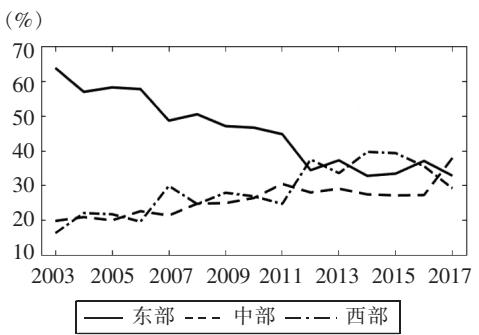  
（a）东部 中部 西部省份土地供给占比

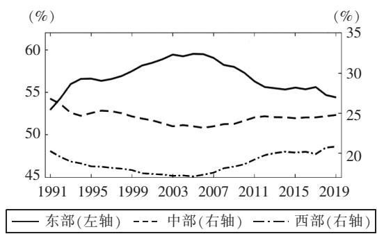  
（b）东部 中部 西部省份 GDP 占比  
图 1 土地配置与区域差距  
资料来源 历年《国土资源年鉴》 国家统计局

然而 偏向中西部的土地配置也可能导致其他负面影响 一是抑制了整体资源配置效率 陆铭和向宽虎（2014）发现 中国整体 TFP 增速不断提高的趋势在 2003 年后停止了 原因主要是在政策向中西部倾斜时东部地区发展受到了限制 陆铭等（2019）基于城市距港口距离和 GDP 的关系 发现 2003 年后更多的土地资源被配置在了人口流出的地区以及投资对 GDP 拉动力较低的地区 二是导致了区域间房价的分化 韩立彬和陆铭（2018）研究了 2003 年后土地供给倾向中西部地区的政策转变对城市房价的影响 发现 2004—2013 年土地供给相对收紧城市的房价比相对放松城市的房价高出 10 6% 从而证明土地在空间上的供需错配是导致区域间房价分化的根源 三是通过房价等渠道间接抑制了劳动力流动并抬高了东部地区的劳动力成本（陆铭等 2015 张莉等 2017） 高企的用地和用工成本最终也对中国的产业布局产生了影响③

① 2004 年国务院发布了《国务院关于深化改革严格土地管理的决定》（国发〔2004〕28 号） 将土地管理正式定位为国家宏观经济管理的重要手段

② 依据财政部公布的数据 西部省份获得的中央补助收入占其 GDP 比例从 1999 年的不足 8%攀升至 2009 年的 16% 中部省份的相应比例从 1999 年的不足 6%攀升至 2009 年的 11% 而东部省份的相应比例在 1999年至今一直保持在 3%—4%的水平

③ 当东部地区的用地成本和用工成本较高时 部分文献认为劳动密集型产业将迁至中西部地区 但陆铭等（2019）认为 在全球化视角下 劳动密集型产业更可能会迁至东南亚国家 而中西部地区承接的有不少是高污染 高耗能产业

当前 “优化国土空间布局” 仍是非常重要的课题 这一重点任务被写入了“ ‘十四五 ’规划和2035 年远景目标”中 那么 怎样的土地配置方式最能提高总体效率？ 怎样的土地配置方式最能缩小区域差距？如何客观准确地评价中国过去土地配置的影响？未来优化国土空间布局的具体路径是什么？ 要回答这些问题 至少面临两方面困难 一方面 如果同时对区域间土地配置 劳动力流动 产品贸易 房价等诸多因素的内生互动关系进行研究 至少需要一个全面刻画区域经济的一般均衡分析框架 另一方面 如果对不同情况和不同政策的潜在影响效果进行讨论和测算 同样需要一个易于展开“反事实实验”的可操作框架 然而 既有文献大多基于简化型的实证研究 难以满足上述研究需要 基于此 本文借助量化空间模型 （Quantitative Spatial Models QSM）展开研究 这一框架基于 Eaton and Kortum （ 2002 ） 的贸易模型 由 Desmet and Rossi-Hansberg （ 2013 ） Ahlfeldt et al.（2015） Redding（2016）等不断完善并推广至一般的贸易和区域研究中

本文在标准量化空间模型中 引入了新增建设用地指标在不同区域间的配置 并将土地用途分为住宅和工商业用地 每个区域由一个省份代表 同时将世界其他国家地区也当作一个区域 除了土地的区域间配置外 模型中还存在着区域间劳动力流动和商品贸易的一般均衡效应 基于全国人口普查 地区投入产出表等地区结构数据 本文对模型进行了校准 模型模拟了 2002—2012 年全国各省份的房价变动 发现十年来东部地区的房价增速明显快于中西部地区 再现了 Fang et al.（2016） 韩立彬和陆铭（2018）等强调的房价分化事实 同时肯定了本文框架的解释力度

本文考察了不同的土地配置策略 研究发现 向东部发达省份配置更多的土地是最有效率的方式 既能提高总体 GDP 又能提高国民总福利 同时可以抑制东部城市的房价 但这一土地配置方式不可避免地扩大了区域间人均收入差距 而向中西部落后省份配置更多土地是更加公平的方式 能够明显缩小区域间的人均收入差距 却难以显著提高 GDP 和总福利 同时放大了区域间房价分化趋势 因此 在土地的空间配置中 天然存在“效率”和“公平”的权衡问题 本文继而对现实中中国的土地配置方式展开了研究 将现实情况与平均分配 最大化 GDP 分配 最小化区域差距分配等方式进行对比 发现现实中在土地配置的“效率”和“公平”上找到了一个良好的平衡点 既实现了 GDP和总福利的显著提升 又明显缩小了区域的人均收入差距

本文认为 区域的均衡发展无法仅靠调整土地配置实现 需要进一步结合“新发展格局”的政策内涵 “以国内大循环为主体 国内国际双循的新发展格局”的核心 在于生产 分配 流通 消费等环节更多依托国内市场 形成国民经济良性循环 这一概念的背后至少包含两个内涵 一是生产要素的配置优化 二是产品和服务的流通 一方面 在生产要素的配置优化上 本文提出“土地配置与户籍制度改革结合”的政策建议 基于政策模拟 本文发现东部发达省份放松人口流入的管制后 对提高总体 GDP 和缩小区域间人均收入差距作用明显 因而 同时将人口与土地向东部地区引导 可以实现“效率”“公平”和“抑制房价”等多重目标 另一方面 在产品和服务的流通上 本文提出“畅通国内贸易”的政策建议 基于政策模拟 本文发现降低国内贸易成本后 同样能够实现多重目标 且其效果远高于降低对外贸易成本 尤其是促进出口 后带来的效果 这表明 实现双循环格局应以扩大内需和国内大循环作为战略基点 综上 本文认为 实现区域均衡发展和新发展格局 应加强顶层设计和政策统筹 从优化国土空间布局 户籍制度改革 推进国内大市场等多方面共同发力

与本文相关 且采用量化空间模型的文献包括 Tombe and Zhu （2019 ） Hao et al. （2020 ） 将量化空间模型用于分析中国经济发展和结构转换过程中劳动力流动 国内贸易等因素的影响 这一框架尚未在国内学术界得到普遍应用 为数不多的国内文献主要以探讨人口迁移与城市规模为主 如潘士远等（2018）等 刘修岩和李松林（2017）进一步深入探讨了房价在人口迁移与城市规模中的影响 王丽莉和乔雪（2020）从城市 农村农业和农村非农业三个部门探讨了人口迁移与城市规模的影响 少数文献在量化空间模型中考虑了土地的作用 Tombe and Zhu（2019）在一个反事实实验中考虑了流动人口对户籍所在地的土地是否享有收益权带来的影响 段巍等（2020a）测算了土地供给扩张对中国经济增长的促进作用 段巍等（2020b）与本文的视角较为相似 同样探讨了土地和劳动力的空间配置 但该文重点在于探讨省会等中心城市的首位程度对区域经济的影响 着眼于城市规模分布 而本文则基于省级层面的量化空间模型 引入土地空间配置结构 劳动力流动和省际贸易 从东部 中部 西部的大区域视角出发 探讨了促进经济增长 提高居民福利 改善收入分配和房价分化等多个政策目标的可行路径

## 二 模型设定

本 文 的 空 间 一 般 均 衡 模 型 基 于 Eaton and Kortum （ 2002 ） Ahlfeldt et al. （ 2015 ） Redding（2016） Tombe and Zhu（2019）等文献的标准框架 并引入了对不同地区住宅用地 工商业用地的供给和使用 以及基于税收 卖地收入和转移支付收入的地方财政与支出 整个经济由 M+1 个地区组成 包含中国的 M 个省份 此外 将世界其余经济体看成一个整体地区 不同地区分别由 $j \in \left\{ 1 , \cdots \right.$ $M { + } 1 \}$ 标记 整个经济体内共有 N 单位劳动力 劳动力由 $i \in \{ 1 , \cdots , N \}$ 标记 每个劳动力具有原有的户籍地 同时每个劳动力对不同地区有异质性的偏好 劳动力可以根据个人偏好 收入 房价等综合决定自己的工作居住地 不同地区间具有各类企业 由于企业具有异质性的生产率 各地的企业产品可以相互贸易 同时面临不同的贸易成本 中央政府将城镇建设用地指标和转移支付配置到不同地区 地方政府将土地按照住宅用途和工商业用地进行出让获取土地出让收入 并连同税收和中央转移支付共同形成地方财政收入 以支持当地的公共支出

## 1 劳动力偏好

假设劳动力可以选择在中国国内不同地区定居和工作 但中国和世界其他地区的劳动力不可以互相流动 劳动力 i 在地区 $j$ 的效用依赖于最终品的消费 c 住房的享用 $c _ { i j } ^ { \phantom { } } ,$ $h _ { i j }$ 以及分配到的人均公共服务水平 $g _ { j }$ 其效用函数形式为柯布—道格拉斯函数 即

$$
U _ {i j} = \varepsilon_ {i j} g _ {j} ^ {\phi_ {h}} \left(\frac {c _ {i j}}{\beta}\right) ^ {\beta} \left(\frac {h _ {i j}}{1 - \beta}\right) ^ {1 - \beta}\tag{1}
$$

其中 ${ \mathcal { B } } \in ( 0 , 1 )$ 衡量一般消费品在家庭效用中的重要程度 $\phi _ { h } \in ( 0 , 1 )$ 衡量公共服务对居民效用的提升效果 $, \mathcal { E } _ { i j }$ 表示劳动力 i 对地区j 的个体性偏好 假设 ε 服从对任意 i 和j 都独立且相同的 $\varepsilon _ { i j }$ Fréchet 分布 即 $F _ { \varepsilon } ( x ) { = } \exp ( - x ^ { - \kappa } )$ 参数 $\kappa { > } 0$ 代表分布的离散程度 影响劳动力流动 正是由于 $\mathcal { E } _ { i j }$ 分布的存在 才使得劳动力不会被完全吸引到高工资（低房价）的地区 令 $w _ { j } \mathscr { , } _ { \boldsymbol { j } } \mathscr { , } _ { \boldsymbol { j } } \mathscr { , } _ { \boldsymbol { j } } \mathscr { , } _ { \boldsymbol { j } } \mathscr { q } _ { j } ^ { h }$ 分别表示地区j的工资水平 工资税率 消费价格水平 房价 则劳动力 i 在地区j 的预算约束为

$$
p _ {j} c _ {i j} + q _ {j} ^ {h} h _ {i j} \leqslant (1 - \tau_ {j}) w _ {j}\tag{2}
$$

易证明家庭消费支出和住房支出均为工资收入的固定比例

$$
p _ {j} c _ {i j} = \beta (1 - \tau_ {j}) w _ {j}\tag{3}
$$

$$
q _ {j} ^ {h} h _ {i j} = (1 - \beta) (1 - \tau_ {j}) w _ {j}\tag{4}
$$

可以看到 给定某一个地区的工资 税率 房价 物价水平 任意一个居民在一般消费品和住房上的消费比例都是固定的 分别为β和 $1 - \beta _ { \ast }$

令地区 $j$ 的劳动力总量为 $N _ { j }$ 住宅用地总量为 ${ L } _ { j } ^ { h }$ 公共支出水平为 $G _ { j }$ 因此人均住房和人均公共服务水平可表示为

$$
h _ {i j} = \frac {L _ {j} ^ {h}}{N _ {j}}, g _ {j} = \frac {G _ {j}}{\left(N _ {j}\right) ^ {\chi}}\tag{5}
$$

其中 由于公共品在不同居民使用时不存在绝对的排他性 因此 令 $\chi \in ( 0 , 1 ]$ 表示公共品分配对拥挤程度的反应弹性①

最后 令 $V _ { j }$ 表示劳动力在地区 $j$ 的平均间接效用 即

$$
V _ {j} = g _ {j} ^ {\phi_ {h}} \frac {(1 - \tau_ {j}) w _ {j}}{\left(p _ {j}\right) ^ {\beta} \left(q _ {j} ^ {h}\right) ^ {1 - \beta}} = G _ {j} ^ {\phi_ {h}} \frac {\left(1 - \tau_ {j}\right) ^ {1 - \beta} \left(w _ {j}\right) ^ {\beta} \left(N _ {j}\right) ^ {\beta - 1 - \phi_ {h} \chi} \left(L _ {j} ^ {h}\right) ^ {1 - \beta}}{(1 - \beta) ^ {1 - \beta} \left(p _ {j}\right) ^ {\beta}}\tag{6}
$$

所谓平均间接效用 可以认为是消除了个体偏好 $\varepsilon _ { i j } \sqrt { \underset { \mathrm { H } } {  } }$ 的间接效用 $^ \circ$ 可以看到 某一地区居民平均效用的高低不仅依赖于当地的工资水平 税率 物价 房价 还依赖于当地的公共服务供给 住宅用地供给 人口拥挤程度 基于式（6） 个体的间接效用函数可表示为 $\varepsilon _ { i j } V _ { j }$ 下文将基于此 求解每个劳动力的居住地选择问题

## 2. 劳动力的迁移

由于中国户籍制度 参考 Tombe and Zhu （ 20 1 9 ） 假设地区 $j$ 原本有 $\overline { { N } } _ { j }$ 的户籍人口 而劳动力的流动使得地区 $j$ 的劳动力总量为 $N _ { j }$ 因此 全国户籍人口和总居民数应当相等 即 $\begin{array} { r } { N { = } \sum _ { j } N _ { j } { = } \sum _ { j } \overline { { N } } _ { j } } \end{array}$ 。 定义 $m _ { k j }$ 为户籍在地区 $k$ 的人口迁移到地区 $j$ 的比例 因此 必有如下关系

$$
\sum_ {j} m _ {k j} = 1, \quad \sum_ {k} m _ {k j} \overline {{N}} _ {k} = N _ {j}\tag{7}
$$

户籍制度的存在使得劳动力迁移面临额外的成本 假设户籍在地区 k 的劳动力迁移至地区 $j$ 将导致 $( 1 - \mu _ { k j } ) \in [ 0 , 1 ]$ 比例的效用损失 越小 劳动力迁移的效用损失就越大 因此可以将劳动力 $\mu _ { \boldsymbol { k } j }$ 迁移成本定义为 $1 / \mu _ { _ { k j ^ { \circ } } }$ 假设劳动力在户籍所在地工作和生活不面临成本 即 $\mu _ { \boldsymbol { k } \boldsymbol { k } } { = } 1 , \forall k _ { \mathrm { ~ c ~ } }$ 同时假设劳动力无法在中国与世界其他经济体之间进行迁移 因此 $, \mu _ { k , M + 1 } { = } 0 , \mu _ { M + 1 , k } { = } 0$ ， 坌 k 。

劳动力选择工作居住地 使得其在当地获得的效用大于其在其他地区获得的效用 即 户籍地为地区 k 的劳动力 i 将对比不同区域带来的间接效用 $\mu _ { _ { k j } } \varepsilon _ { _ { i j } } V _ { _ { j } }$ 从中挑选最大的区域作为自己的工作居住地 在大数定律下 户籍在地区 k 人口迁移到地区 $^ { \circ }$ $j$ 的比例 应等于某一个户籍在地区 k 的 $m _ { k j }$ 劳动力迁移到地区 $j$ 的概率 因此比例 m 应表示为 $m _ { k j }$

$$
m _ {k j} = \operatorname * {P r} (\varepsilon_ {i j} \mu_ {k j} V _ {j} \geqslant \max _ {j ^ {\prime}} \{\varepsilon_ {i j ^ {\prime}} \mu_ {k j ^ {\prime}} V _ {j ^ {\prime}} \})\tag{8}
$$

可以证明 当 $\varepsilon _ { i j }$ 服从参数为 $\kappa$ 的 Fréchet 分布时 $m _ { k j }$ 可表示为如下表达式

$$
m _ {k j} = \frac {\left(\mu_ {k j} V _ {j}\right) ^ {\kappa}}{\sum_ {j ^ {\prime}} \left(\mu_ {k j ^ {\prime}} V _ {j ^ {\prime}}\right) ^ {\kappa}}\tag{9}
$$

从上式可以看出 决定人口分布的不仅是区域带来的效用 $V _ { j }$ 和人口迁移成本 个体偏好的 $\mu _ { k j }$ 分布形状也起到了关键作用 $\kappa$ 越大 居民的迁移弹性就越大 劳动力流动就越充分 反之当 $\kappa$ 趋近于 0 时 居民完全不愿意从户籍地迁出 也完全不存在区域间人口流动

## 3 中间品与最终品生产

假设存在无穷种中间品 每种中间品用 0—1 上的连续实数 $v \in [ 0$ 1]来标记 这些中间品在不同地区均有企业进行生产 地区 $\cdot j$ 生产的中间品 $v$ 的产量为 $y _ { v j }$ 生产函数为：

$$
y _ {v j} = z _ {v j} T _ {j} \left(G _ {j}\right) ^ {\phi_ {p}} \left(N _ {v j}\right) ^ {1 - \alpha} \left(L _ {v j} ^ {p}\right) ^ {\alpha}\tag{10}
$$

其中 $N _ { v j }$ 和 $L _ { v j } ^ { p }$ 分别表示地区 $j$ 中间品 $v$ 使用的劳动和工商业用地 $\mathsf { \Gamma } _ { \mathsf { 3 } } \alpha \in ( 0 , 1 )$ 表示工商业用地的产出弹性 $\boldsymbol \phi _ { \boldsymbol \rho } \in ( 0 , 1 )$ 表示公共服务 （或基础设施 ）对生产的外部性 $T _ { j }$ 表示地区 $j$ 的总体生产率 $z _ { v j }$ 表示地区 $j$ 中间品 $v$ 的异质性生产率 假设 $z _ { v j }$ 服从对任意 $v$ 和j 都独立且相同的 Fréchet 分布 $\scriptstyle { F _ { z } ( x ) = \exp ( - x ^ { - \theta } ) }$ 其中 参数 θ＞0 代表分布的离散程度

中间品企业以工资 $w _ { j }$ 支付劳动报酬 以价格 ${ q _ { j } } ^ { h }$ 购买工业用地使用权 同时假设企业面临 $t _ { j }$ 的营业税率 因此 经过最优化推导 地区 $j$ 中 1 单位中间品 $v$ 产出的最小成本为

$$
\frac {x _ {j}}{(1 - t _ {j}) z _ {v j} T _ {j} (G _ {j}) ^ {\phi_ {p}}}\tag{11}
$$

其中 x表示 1 单位中间品产出对应的要素投入成本 即 $x _ { j }$

$$
x _ {j} = \frac {\left(w _ {j}\right) ^ {1 - \alpha} \left(q _ {j} ^ {p}\right) ^ {\alpha}}{(1 - \alpha) ^ {1 - \alpha} \alpha^ {\alpha}}\tag{12}
$$

可以看到 企业生产带来的单位成本 依赖于要素价格 w和 $w _ { j }$ $q _ { j } ^ { ~ p }$ 依赖于生产率 $T _ { j }$ 和 z 还依赖于 $z _ { v j }$ 地区税率 $t _ { j }$ 和公共基础设施水平 $G _ { j \circ }$

地区 $j$ 生产的最终品 $Y _ { j }$ 由不同种类 $v \in [ 0$ 1]的中间品基于 CES 函数复合而成 即：

$$
Y _ {j} = \left[ \int_ {v} \left(\varphi_ {v j}\right) ^ {\frac {\sigma - 1}{\sigma}} \mathrm{d} v \right] ^ {\frac {\sigma}{\sigma - 1}}\tag{13}
$$

其中 $, \varphi _ { v j }$ 为地区 $j$ 生产最终品 $Y _ { j }$ 时对中间品 $v$ 的投入 $, \sigma { > } 1$ 为中间品的替代弹性 令 表示地 $\boldsymbol { p } _ { v j }$ 区 $\cdot j$ 生产最终品时中间品 $v$ 的单位价格 ${ \bf \nabla } , p _ { j }$ 表示地区 $j$ 最终品价格 基于最终品生产的最优化过程可推导出中间品需求和最终品产出的关系 $\varphi _ { v j } { = } ( p _ { v j } / p _ { j } ) ^ { - \sigma } Y _ { j }$ 以及地区 $j$ 物价水平与中间品价格的关系

$$
p _ {j} = \left[ \int_ {v} \left(p _ {v j}\right) ^ {1 - \sigma} \mathrm{d} v \right] ^ {\frac {1}{1 - \sigma}}\tag{14}
$$

需要强调的是 地区 $j$ 的最终品生产中 对最终品 $\varphi _ { v \jmath }$ 的需求并不一定全部来自地区 $j$ 的中间品产出 而是可以通过地区间中间品贸易使用其他地区的中间品 因而中间品投入的价格 $y _ { v j }$ $\boldsymbol { p } _ { v j }$ 是 $\varphi _ { v j }$ 的价格 并不一定是中间品产出 $y _ { v j }$ 的价格

## 4 地区间的中间品贸易

尽管每个地区都能够生产全部种类的中间品 但如果其他地区的中间品更加便宜时 在最终品的生产中可以使用其他地区的中间品 因此不同地区间可以进行中间品贸易 假设地区 的中间品 $\mathrm { ~ \textbar ~ { ~ o ~ } ~ }$ 运输至地区 $j$ 需要支付运输成本 该成本以冰山成本形式体现 为中间品生产成本的 $\gamma _ { k j }$ 倍 $( \gamma _ { k j } \geqslant 1 )$ 。因此 地区 $j$ 使用地区 k 的中间品面临的单位成本为

$$
\frac {\gamma_ {k j} x _ {k}}{\left(1 - t _ {k}\right) z _ {v k} T _ {k} \left(G _ {k}\right) ^ {\phi_ {p}}}\tag{15}
$$

假设使用当地生产的中间品不需要运输成本 则 $\gamma _ { _ { k k } } { = } 1$ 坌 $k _ { \textrm { c } }$ 地区 $j$ 最终品生产过程中 面临各个区域供给的中间品 v 应选取最便宜的 因此 地区 $j$ 采购的中间品 v 价格应表示为

$$
p _ {v j} = \min _ {k} \left\{\frac {\gamma_ {k j} x _ {k}}{(1 - t _ {k}) z _ {v k} T _ {k} (G _ {k}) ^ {\phi_ {p}}} \right\}, \forall k\tag{16}
$$

当 $z _ { v k }$ 服从参数为 θ 的 Fréchet 分布时 地区 $j$ 的最终品价格（或物价水平）可表示为

$$
p _ {j} = \left[ \Gamma (1 + \frac {1 - \sigma}{\theta}) \right] ^ {\frac {1}{1 - \sigma}} \left\{\sum_ {k} \left[ \frac {\gamma_ {k j} x _ {k}}{(1 - t _ {k}) T _ {k} (G _ {k}) ^ {\phi_ {p}}} \right] ^ {- \theta} \right\} ^ {- \frac {1}{\theta}}\tag{17}
$$

其中 $, T ( \cdot )$ 为标准 Gamma 函数

令 $X _ { j }$ 表示地区 $j$ 对所有中间品的总支出 $X _ { \mathit { k j } }$ 表示地区 $j$ 对地区 k 中间品的支出 定义 π 为地区 $\pi _ { k j }$ $j$ 采购地区 k 中间品的贸易份额 当每个地区不同中间品产业数目足够多时 在大数定律下 贸易份额 π 应当等于某一区域中间品价格小于其他区域的概率 $\pi _ { k j }$ $^ { \circ }$ 因此 π 服从 $\pi _ { k j }$

$$
\pi_ {k j} = \frac {X _ {k j}}{X _ {j}} = \operatorname * {P r} \left\{\frac {\gamma_ {k j} x _ {k}}{\left(1 - t _ {k}\right) z _ {v k} T _ {k} \left(G _ {k}\right) ^ {\phi_ {p}}} \leqslant \min _ {k ^ {\prime}} \left(\frac {\gamma_ {k ^ {\prime} j} x _ {k ^ {\prime}}}{\left(1 - t _ {k ^ {\prime}}\right) z _ {v k ^ {\prime}} T _ {k ^ {\prime}} \left(G _ {k ^ {\prime}}\right) ^ {\phi_ {p}}}\right) \right\}\tag{18}
$$

可以证明 当 $z _ { v k }$ 服从参数为 θ 的 Fréchet 分布时 贸易份额 $\pi _ { k j }$ 可表示为

$$
\pi_ {k j} = \frac {\lambda_ {k j}}{\sum_ {k ^ {\prime}} \lambda_ {k ^ {\prime} j}}, \quad \lambda_ {k j} = \left[ \frac {\gamma_ {k j} x _ {k}}{(1 - t _ {k}) T _ {k} (G _ {k}) ^ {\phi_ {p}}} \right] ^ {- \theta}\tag{19}
$$

可以看到 地区 $j$ 采购地区 $k$ 中间品的贸易份额 主要依赖于中间品价格的相对比例 而中间品价格则依赖于贸易成本和原产地的单位成本 基于 $X _ { k j }$ 的定义 地区 $j$ 的中间品总销售额应表示为$^ { , } \circ$ $\textstyle \sum _ { k } X _ { j k }$ 因此 地区 $j$ 中间品支付的劳动总报酬以及工业用地成本分别为

$$
w _ {j} N _ {j} = (1 - \alpha) (1 - t _ {j}) \sum_ {k} X _ {j k}\tag{20}
$$

$$
q _ {j} ^ {p} L _ {j} ^ {p} = \alpha (1 - t _ {j}) \sum_ {k} X _ {j k}\tag{21}
$$

## 5 土地供给与政府行为

中央政府向地区j 提供两种资源：一是财政转移支付 $T S _ { i }$ 二是审批城镇建设用地指标 $L _ { j \circ }$ 假设中央政府提供的转移支付是各地产出的固定比例 $\scriptstyle { T S _ { j } = s _ { j } \sum _ { k } X _ { j k } }$ 其中 不同的比例 $s _ { j }$ 衡量了中央政府对不同省份的财政帮扶强度 地区 $^ { \circ }$ $j$ 的地方政府基于总量为 $L _ { j }$ 的土地总量 将土地使用权出让给住宅用途 $L _ { j } ^ { ^ h }$ 或工商业生产用途 $L _ { j } ^ { ' }$ 并满足

$$
L _ {j} ^ {h} + L _ {j} ^ {p} = L _ {j}\tag{22}
$$

地方政府的财政收入包含三个方面 一是其保留一半的税收收入（另一半上缴中央） 二是土地使用权的出让收入 三是来自中央政府的转移支付收入 财政收入全部用于公共支出（或基础设施建设） $) G _ { j \circ }$ 综上所述 地方政府的预算约束可表示为

$$
p _ {j} G _ {j} = \left(\tau_ {j} w _ {j} N _ {j} + t _ {j} \sum_ {k} X _ {j k}\right) / 2 + q _ {j} ^ {h} L _ {j} ^ {h} + q _ {j} ^ {p} L _ {j} ^ {p} + T S _ {j}\tag{23}
$$

参考段巍等（2020a） 引入地方政府的目标函数 假设地区 $j$ 的地方政府同时关心辖区内的实际 GDP 和居民总福利

$$
\max _ {G _ {j}, L _ {j} ^ {p}, L _ {j} ^ {h}} \left(G D P _ {j}\right) ^ {\xi_ {j}} (N _ {j} \int_ {\varepsilon_ {i j}} U _ {i j} \mathrm{d} F _ {\varepsilon}) ^ {1 - \xi_ {j}}\tag{24}
$$

其中 $\xi _ { j } \in [ 0 , 1 ]$ 代表实际 GDP 在地方政府目标函数中的权重 即地方政府对实际 GDP 的重视程度 由于模型中最终品部门完全竞争不创造增加值 因此 实际 GDP 等于中间品的实际销售额之和 即 $\mathit { G D P } _ { j } { = } \sum _ { k } X _ { j k } / p _ { j }$ 。

作为当地经济的管理者 地方政府并不是一个如居民或企业一样的简单的竞争性部门 因此需要首先对地方政府的能力范围作出清晰的定义 一方面 地方政府是当地土地市场的垄断者 其知晓居民对住宅用地的需求函数式（4）和企业对工商业用地的需求函数式（21） 另一方面 地方政府具备公司化特征 深入地参与到了企业生产决策中 其知晓企业的最优生产决策 然而 地方政府无法像中央政府一样具有全局的影响力 例如 单个地方政府无法影响区域间的产品和要素的流动 因此 会将当地常住人口数 $N _ { j }$ 和价格水平 $p _ { j }$ 视为给定 求解地方政府问题① 可得地方政府在工业和住宅两类用途的土地配置比例

$$
\frac {L _ {j} ^ {p}}{L _ {j} ^ {h}} = \frac {\alpha \xi_ {j} + \alpha \phi_ {h} (1 - \xi_ {j})}{(1 - \phi_ {p}) (1 - \beta) (1 - \xi_ {j})}\tag{25}
$$

上式的含义非常简单直观 ①比例随着 $\xi _ { j }$ 递增 即当 GDP 在地方政府目标函数的权重越大时地方政府会供应越多的工业用地 ②比例随着 $\phi _ { p }$ 和 $\phi _ { h }$ 递增 即当公共支出对产出和居民效用的作用越强时 地方政府越有动机提高公共支出 而公共支出是以当地产出和财政收入为支撑的 因此地方政府会提高工业用地的供给 ③α 为工业用地的产出弹性 $\left( 1 - \beta \right)$ 为家庭对住房的偏好程度 上述比例随着 α和β的变化也符合经济学含义

## 6 市场出清

为了令模型封闭 本模型还需如下市场出清条件和均衡条件 首先 地区 $j$ 的劳动力出清和工业用地出清

$$
\int_ {v} N _ {v j} = N _ {j}, \int_ {v} L _ {v j} ^ {p} = L _ {j} ^ {p}\tag{26}
$$

其次 地区 $j$ 的最终品市场出清

$$
c _ {j} N _ {j} + G _ {j} = Y _ {j}\tag{27}
$$

又因为最终品企业是完全竞争的 没有利润 因此有如下条件存在

$$
p _ {j} c _ {j} N _ {j} + p _ {j} G _ {j} = X _ {j}\tag{28}
$$

中间品市场同样应当实现出清 但由于本文不考虑某一地区某一类中间品的绝对产量 因此不必将其列在均衡系统中

## 三 数据 参数校准与模型求解

## 1 数据与校准

本文将需要校准的参数分为两类 一是对所有区域都相同的共有参数 二是对区域间并不相同的独有结构性参数 本文使用的现实数据如下 ①针对人口流动的数据 使用了 2000 年 2010 年全国人口普查结果 其中 “现住地人口中的户口登记地”相关表格汇报了不同户籍所在地和不同现居住地对应的人口数量 由此得到了人口迁移比例矩阵 m ②针对国内外贸易的数据 使用了李善同 $m _ { k j }$ （2018）编制的地区投入产出表 包含 2002 年 2007 年 2012 年省份之间 各省份与国（境）外的投入产出关系 由此得到了区域间贸易份额矩阵 $\pi _ { k j }$ 该数据在 2002 年 2007 年缺乏西藏的地区投入产出数据 因此如 Tombe and Zhu（2019）一样 本文在校准和量化测算中将西藏数据剔除 $\textcircled{3}$ 国家统计局公布的各省份历年人均可支配收入及 CPI 价格指数 ④财政部公布的各省份历年财政决算表中一般公共预算收入及接受中央补助收入 ⑤原国土资源部和历年《国土资源年鉴》披露的各省份建设用地面积（居民及工矿） 及不同用途土地供给面积 ⑥由于国（境）外在模型中也属于一个区域 因此对上述数据也补充国（境）外相关变量 主要数据来源是 Penn World Table 和世界银行数据库

对于第一类区域共有参数的校准 主要来自宏观总体数据和经典文献 依据国家统计局公布的劳动报酬占 GDP 比例 劳动的产出弹性应为 0.48 综合参考 Tombe and Zhu（2019）和赵扶扬等（2017 ） 土地的 $\vec { \cal J } ^ { \mathrm { z } }$ 出弹性为 0.1 由于本文模型中的产出是不包含实物资本的劳动和土地带来的增加值 因此需要在规模报酬不变的假设下对劳动和土地的产出弹性重新标准化 得到的参数 α 为0.1724 公共支出外部性 $\phi _ { h }$ 和 $\phi _ { p }$ 在文献中的取值较为多样 Aschauer （1989） 估得取值均为 0.24Leeper et al. （2010 ） 分别取 0.1 和 0.05 Baxter and King （1993 ） 均取 0.05 赵扶扬等 （2017 ） 估得中国取值均为 0.0739 综合考虑 本文令两个参数均为 0.1 依据国家统计局住户调查中非住房支出所占比例 如 Tombe and Zhu （2019 ） 一样 本文取 $\beta$ 为 0.87 令公共品分配对拥挤程度的反应弹性 $\chi$ 为0.5 经检验 这一参数的取值大小对本文的核心结论没有影响 在量化空间模型的特殊求解方式下 中间品的替代弹性 $\sigma$ 取值完全不影响结果 最后 参考 Tombe and Zhu（2019） 对劳动力迁移弹性 $\kappa$ 和区域间贸易弹性 θ 分别取 1.5 和 4

对于第二类区域间并不相同的独有结构性参数 则主要依靠区域结构数据校准 省际贸易成本$\gamma _ { k j }$ 由区域间贸易份额反解而得 人口迁移成本 $\mu _ { k j }$ 由人口流动比例 各省份实际收入数据共同反解而得 劳动收入税率 $\tau _ { j }$ 和企业营业税率 $t _ { j }$ 由各省份一般公共预算收入（不含上缴中央部分） GDP 劳动收入算出 各省份接受转移支付的数目 $T S _ { j } ,$ 对应现实中地方政府接受中央补助收入得到 进而计算转移支付占 GDP 的比例 $s _ { j ^ { \circ } }$ 由各省份历年建设用地面积（居民及工矿）得到各地土地面积 $L _ { j \circ }$ 由各省份不同用途土地供给面积得到地方政府在工业和住宅两类用途的土地配置比例 $L _ { j } ^ { ' } / L _ { j } ^ { h }$ 进而可以通过式（5）反解得到各地地方政府目标函数中的权重参数 $\xi _ { j ^ { \vee } }$ 在量化空间模型的特殊求解方式下 各省份的总体生产率取值 $T _ { j }$ 并不影响本文的分析结果

## 2 模型求解

在模型的求解中 由于涉及多个地区 均衡系统存在大量非线性方程 因此将全部变量一一求解并不现实 在量化空间模型中 常用的做法是考察外生变量（参数 的百分比变化将带来多少内生变量的百分比变化 将某一变量 转换为 $\scriptstyle { \hat { x } } = \Delta x / x \ F $ 均衡系统的求解将大为简化 本文主要讨论的也是外生变量变化后 会给关键变量带来多少的百分比变化

本文着重关注两个反映宏观总体效率的变量 即实际 GDP 和居民总福利 以及两个反映区域差异的变量 即区域间人均收入差距和房价分化程度 ①这些关键变量的选取依据来自“高质量发展”的内涵 即中国的发展不仅应当关注总量的发展（实际 GDP 的高低） 更应当关注人民对美好生活的需要（居民总福利 房价）和不平衡不充分发展（区域间人均收入差距）之间的矛盾 实际 GDP为各省份名义 GDP 除以各省份价格指数后求和：

$$
G D P = \sum_ {j = 1} ^ {M} \frac {\sum_ {k} X _ {j k}}{\left(p _ {j}\right) ^ {\beta} \left(q _ {j} ^ {h}\right) ^ {1 - \beta}}\tag{29}
$$

其中 各省份价格指数为居民的总体生活成本 即消费品价格和房价的复合 $( p _ { j } ) ^ { \beta } ( q _ { j } ^ { h } ) ^ { 1 - \beta } \ : _ { \mathtt { C } }$ ①总福利是由户籍人口加权得到的总效用

$$
W e l = \sum_ {k = 1} ^ {M} \left[ \frac {\overline {{{N}}} _ {k}}{\sum_ {k ^ {\prime} = 1} ^ {M} \overline {{{N}}} _ {k ^ {\prime}}} \int_ {i} \max _ {j} \left\{\varepsilon_ {i j} \mu_ {k j} V _ {j} \right\} d i \right]\tag{30}
$$

其中 $\operatorname* { m a x } _ { j } \{ \varepsilon _ { i j } \mu _ { k j } V _ { j } \}$ 为户籍在地区 k 的个体 $j$ 在最优选择工作居住地后的最大效用 人均收入 $^ { \circ }$ 差距是全国居民实际收入的 Gini 系数 由于模型中同一省份内的居民收入相同 因此 Gini 系数本质上度量了区域间人均收入差距 在计算 Gini 系数之前 首先 对各省份实际人均收入 $w _ { j } / p _ { j }$ 从低到高进行排序 令 $s \in \{ 1 , \cdots , M \}$ 表示排序序号 其次 用 $C u m _ { s }$ 表示前 s 位省份的累计收入占比 即

$$
C u m _ {s} = \frac {\sum_ {u = 1} ^ {s} w _ {u} N _ {u} / p _ {u}}{\sum_ {u = 1} ^ {M} w _ {u} N _ {u} / p _ {u}}\tag{31}
$$

因此 Gini 系数可表示为

$$
G i n i = 1 - C u m _ {1} \frac {N _ {1}}{\sum_ {s ^ {\prime} = 1} ^ {M} N _ {s ^ {\prime}}} - \sum_ {s = 2} ^ {M} \left(C u m _ {s - 1} + C u m _ {s}\right) \frac {N _ {s}}{\sum_ {s ^ {\prime} = 1} ^ {M} N _ {s ^ {\prime}}}\tag{32}
$$

此外 区域间房价分化程度为不同省份间房价的变异系数（标准差除以均值）

## 四 土地配置分析

基于对 2002—2012 年数据的匹配 本文首先通过均衡房价的角度观察了模型对现实的解释力 研究发现 十年间东部省份与中西部省份的房价出现了明显的分化 前者房价增长高达 110%而后者房价增长仅为 80% 区域间土地配置是房价分化的重要原因（陆铭等 2015 韩立彬和陆铭2018） 此外 在一般均衡的框架下 房价分化还受到人口流动和区域间生产率差异的影响 ②可以说 从房价分化的角度 本文较好地模拟了中国的区域分化事实 校准 $\cdot \sqrt { \_ }$ 的模型框架具备良好的现实适应性 这为本文的量化测算奠定了基础

受数据可得性的限制 本文无法对 2012 年后的均衡进行全局刻画 因此 在下面的分析中 本文遵循 Desmet and Rossi-Hansberg （2013 ） 、 刘修岩和李松林 （2017 ） 、Tombe and Zhu （2019 ） 等经典QSM 框架的做法 基于 2012 年的均衡进行反事实分析（Counterfactual） 考察外生变量如何带来内生变量的百分比变动

① 与地方政府实际 GDP 的计算不同 在全国实际 GDP 的计算中 采用了消费品价格和房价的复合指数 这一方式遵循了经典文献的传统做法 经检验 无论是仅采用消费品价格 还是采用消费品价格和房价的复合指数 对本文核心结论没有影响 但不同的方式对量化结果的数值存在一定影响 详见本文对表 2 的分析

② 本文通过三组反事实检验 分别验证了土地供给 人口流动 生产率差异对房价分化的影响 具体内容参见《中国工业经济 》网站 （ http ： //ciejournal.ajcass.org ） 附件

## 1 土地给谁更有效 一个初步的观察

本文关注的核心问题是不同土地空间配置方式对宏观经济和区域差距的影响 在对真实土地配置和最优土地配置进行评估之前 本文首先通过一组简单的反事实分析进行初步观察 即各省份分别获得相同的土地后 带来的全国 GDP 总福利及区域间人均收入差距等指标的百分比变化 图2展示了不同省份分别增加 1 千公顷建设用地面积后的影响 图 2（a）—（c）对应着不同的衡量指标表示不同省份分别获得 1 千公顷建设用地后对该指标的影响 省份排序是按照对不同指标影响大小降序排列的

从图 2 可以看到 对于绝大多数省份 建设用地面积增加都能带来全国 GDP 和总福利的上升但对区域间人均收入差距的影响有正有负 在对具体省份的观察中 本文发现东部发达省份建设用地面积的扩张 包括上海 北京 浙江 广东 福建 天津 江苏等 对全国 GDP 和总福利的促进作用是最明显的 却会导致区域间人均收入差距进一步拉大 与此同时 对中西部省份增加建设用地面积 可以明显缓解区域间人均收入差距 但对全国 GDP 和总福利的提升作用却微乎其微 ①

图 2 揭示了公共管理中最常见的“效率”与“公平”两难问题 从提高效率的角度看 应向东部发达省份配置更多的土地 而从保证公平的角度看 应向中西部落后省份配置更多土地 那么 中国现实中土地区域间配置的真实影响如何 与最优的土地配置相比在“效率”与“公平”方面有何得失 仍需进一步研究

（ a ） GDP 增长  
（b）福利改善  
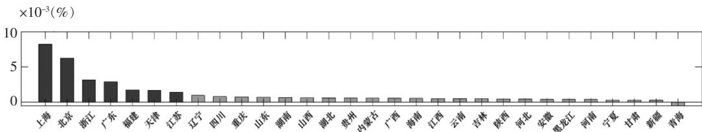

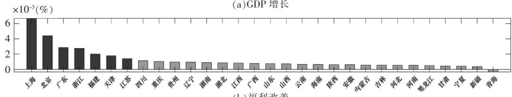

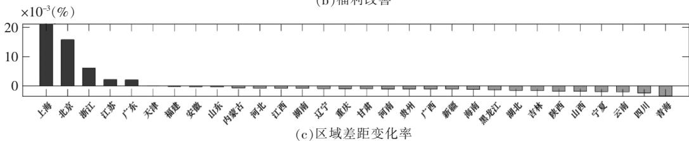  
图 2 各省份分别增加等量土地后的经济影响  
注 基于 2012 年的均衡 各省份分别增加 1 单位面积的土地 按影响大小在图中降序排列

## 2 现实土地供给的效率研究 2013—2017 年

本文在图 2 分别给各省份“凭空”提供了等量的新增土地 这种模拟可以用于直观的比较和理解 但其得到的具体数值却不具备任何定量含义 准确可信的定量分析 应当是给定现实中的土地供给总量 对不同的土地区域配置结构下的均衡进行测算

本文拟基于 2012 年的均衡 在给定 2013—2017 年新增的土地总量下 对不同的土地配置结构进行研究和对比 表 1 展示了现实中土地配置的测算结果 并提供了平均分配和最优分配的反事实测算结果 各种分配方式都基于相同的 2013—2017 全国新增建设用地总面积 平均分配分为两种方式 一种为按照等面积均匀分配 另一种以各省份原有城镇面积为基准 令各省份新增面积比例相同 最优分配分为三种 分别以最大化 GDP 最大化总福利 最小化区域人均收入差距为最优分配目标进行土地配置

可以看到 2013—2017 年 现实中明确偏向中西部地区的土地供给 对总产出和总福利存在明显的提升 分别为 2 31 %和 2 57% 同时这段时间的土地供给缩小了区域间人均收入差距（ -0 73%） 这恰是中国区域均衡发展战略的初衷 也是偏向中西部地区土地供给的目标 此外 由于房价较高的东部地区新增土地较少 而房价较低的中西部地区新增土地较多 导致区域间房价分化程度加剧 （ +1 23% ）

表 1  
2013—2017 城镇建设用地增加带来的影响  
单位 ： %

<table><tr><td rowspan="2" colspan="2">真实情况</td><td>GDP</td><td>总福利</td><td>区域差距</td><td>房价分化</td></tr><tr><td>2.3138</td><td>2.5712</td><td>-0.7294</td><td>1.2324</td></tr><tr><td rowspan="2">平均分配</td><td>等面积分配</td><td>3.3545</td><td>3.2899</td><td>2.0856</td><td>-6.4274</td></tr><tr><td>等比例分配</td><td>2.4470</td><td>2.6356</td><td>-0.1339</td><td>-0.2446</td></tr><tr><td rowspan="3">最优分配</td><td>最大化GDP</td><td>5.2569</td><td>4.5785</td><td>8.2358</td><td>-8.5328</td></tr><tr><td>最大化总福利</td><td>5.1450</td><td>4.6200</td><td>7.4496</td><td>-9.5392</td></tr><tr><td>最小化区域人均收入差距</td><td>1.6129</td><td>2.0073</td><td>-2.5004</td><td>3.1328</td></tr></table>

注 所有影响均以百分比变化率度量

与平均分配和最优分配的对比中 本文得以更全面对 2013—2017 年真实的土地配置展开分析 ①真实情况对 GDP 和总福利的提升效果 基本达到了等比例分配的水平 但比等比例分配对区域人均收入差距的改善效果更好 此外 真实情况比等比例分配导致了更强的区域房价分化 ②与等面积分配 最大化 GDP 和最大化总福利分配相比 真实情况尽管存在效率损失 对提升GDP 和总福利效果较小 且导致更强的区域房价分化 但在缩小区域人均收入差距方面具有更好的作用 ③与最小化区域人均收入差距的分配相比 真实情况对提高 GDP 和总福利的效果较强 且对房价分化的作用较弱

综上所述 现实中 2013—2017 年的土地配置 在“效率”和“公平”之间找到了一个良好的平衡点 既实现了 GDP 和总福利的可观提升 又明显缩小了区域间人均收入差距 这是中国在国土资源利用中取得的巨大成就 在人口流动受限 国内统一大市场尚未实现的情况下 中国的土地空间配置兼顾了多方考虑 一直以来 偏向中西部地区的土地供给方式饱受学术界争议 但未有任何研究能够在一般均衡中展开客观和精准的量化评估 本文为此提供了新的认知

## 3 最优土地配置 逻辑与特征

通过对图 2 的直观观察 如果以追求总产出和总福利为目标 应对东部发达省份配置更多的土地 但这并没有说明应该对东部哪些省份配置多少土地 是否对中西部省份不配置任何土地 以及这些配置对各个地区房价的影响如何 因此 本文对最优土地配置的逻辑和特征展开分析

定义最优土地配置的目标函数 不同的评判标准下 可以设置不同的目标函数 本文分别考虑三种目标函数 ①最大化全国的实际 GDP 式（29） ②最大化全国的居民福利式（30） ③最小化全国的 Gini 系数式（32） 最优土地配置本质上是一种反事实模拟 其核心思路是基于 2012 年的均衡 在给定 2013—2017 年新增的土地总量下 进行了 100 万次随机分配 依据不同的目标函数获得最优的土地配置策略 ①

三组不同的最优土地配置对经济的影响结果在表 1 中展示 此外 图 3 展示了两个最优标准的排序结果 一是依据对 GDP 的影响排序 对 GDP 提升效果越强的配置方式排名越靠前 二是依据对区域人均收入差距的影响排序 对降低区域差距效果越强的配置方式排名越靠前 可以看到 提升 GDP 效果越强的土地配置方式 也越能提高总福利 同时也越能降低区域间的房价分化程度 但会放大区域间人均收入差距 而抑制区域间人均收入差距效果越强的土地配置策略 提升 GDP 和总福利的效果越差 同时会导致区域间房价分化程度加强 因此 并不存在一种最优土地配置策略既能提高 GDP 又能缩小区域人均收入差距 图 3 再次揭示了土地配置在“效率”与“公平”之间难以两全的事实

更深入的问题是 最优的土地配置策略是如何在各省份之间进行土地配置的 图 4 以最大化实际 GDP 为例 对比了最优情况和真实情况在各省份之间的土地配置 并按照最优标准下不同省份获得的土地面积进行排序 可以看到 最大化 GDP 的土地供给 是保证北京 上海 广东 浙江等省份获得更多的土地供给 同时令其他省份获得较为均匀的土地供给（见图 4（a）的深色柱 湖南之后的各省份土地分配“高度”是较为一致的）② 此外 最大化 GDP 的土地供给 相对于真实的分配情况 对房价的最大影响在北京和上海 最优的土地供给 使得北京和上海的房价相对于真实房价大大下降 但对其他省份的房价影响不大（见图 4（b） 上海之后的各省份房价 深色柱与浅色柱高度较为一致）

图 4 赋予了本文更丰富的结论 如果以最大化效率为目标 应对东部发达省份配置更多的土地 这并不意味着走向另一个极端 即对中西部省份配置过少的土地 最优的土地配置策略应当是在保证东部发达省份获得足够土地的同时 对其他省份配置均匀且适量的土地 此外 最优的土地配置策略在房价的影响上 主要体现在明显抑制了北京和上海的高房价 却对其他省份的房价影响不大 其中 部分原因是因为在一般均衡的框架下 上述最优的土地配置促进了人口向东部地区流动 对其他省份房价的潜在升高趋势起到了反向的抵消作用 因此 在偏向东部地区的土地配置中并不需要过度担心中西部省份土地供给过少而面临房价飙升的问题 因为东部地区在获得土地后会进一步增加经济势能并吸引人口流入 真正应该考虑的是 当人口无法充分流动时 偏向东部地区的土地配置难以保证中西部省份居民人均收入的提高

## 五 政策分析

如果仅依靠土地配置这一个政策手段 将无法兼顾“效率”和“公平”的双重目标 在这一两难境地下 结合“新发展格局”的政策内涵是有益的参考方向 “新发展格局”的要义 在于生产 分配 流通 消费等环节更多依托国内市场 形成国民经济良性循环 这一概念至少包含两个内涵 一是生产

（ % ）

（千公顷）  
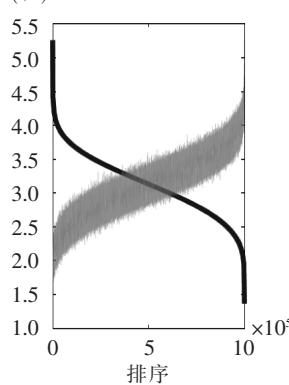  
（ ） GDP 变化率

（ % ）  
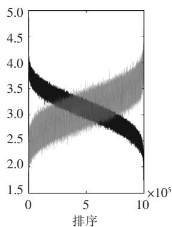  
（b）福利变化率

（ % ）  
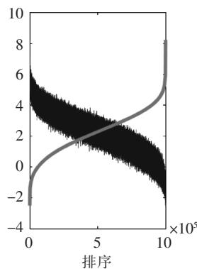  
（c）区域差距变化率

（ % ）  
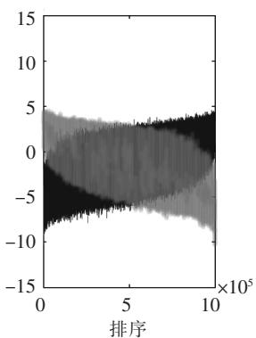  
（d）房价分化程度变化率  
图 3 不同土地分配下 GDP 福利 区域差距 房价分化的关系  
注 基于 2002 年的均衡 给定 2013—2017 年土地供给总量 一百万次不同的土地随机分配下的结果 深灰色为按对GDP 的影响降序排列 浅灰色为按对区域差距的改善作用降序排列

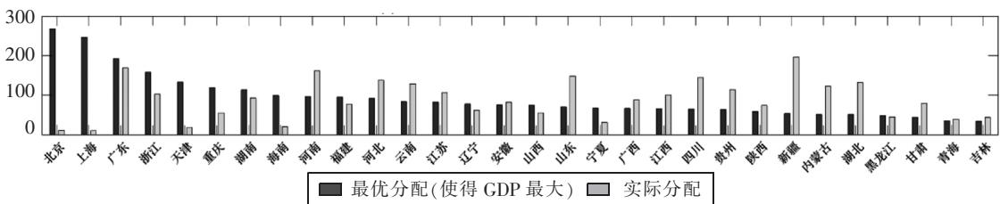

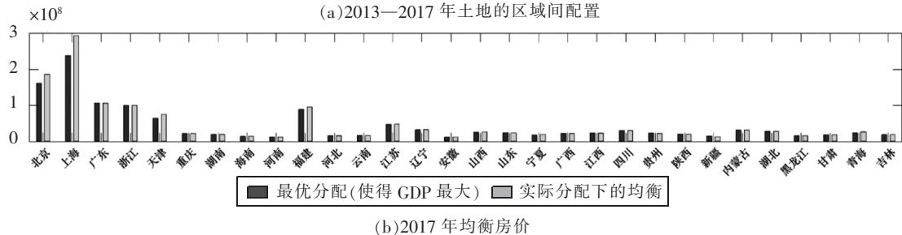  
图 4 最优策略下土地的区域间配置  
注 给定 2013—2017 年土地供给总量 其中 实际房价由模型均衡内生算出 并非实际数据 没有单位

要素的配置优化 二是产品和服务的流通 在生产要素的配置优化上 本文提出“土地配置与户籍制度改革结合”的政策建议 在产品和服务的流通上 本文提出“畅通国内贸易”的政策建议

## 1 将土地的空间配置与人口流动相结合

区域间的总量差距并不是阻碍区域均衡发展的核心 降低区域间人均收入差距才是区域均衡发展的根本目标 区域间人均收入差距的存在 究其根本 在于户籍制度使人口流动受到了限制 这不仅扭曲了劳动力资源的配置效率（梁琦等 2013） 更扩大了区域间的收入差距（陆铭等 2015） 从模型均衡得到的 2012 年人口流动成本看 人口流入最开放的省份是广东 而同样作为人口流入重要区域的北京和上海 其人口流入平均成本约为广东的 1 6 倍 当劳动力要素可以自由流动时 区域间的人均收入差距将自然抹平 这一思路为实现“效率”和“公平”双重目标提供了可能 即倘若土地和人口同向聚集 不仅能优化资源配置 还能降低人均收入差距

基于此 图 5 进行了降低人口流动成本的反事实政策模拟 考察不同省份分别将人口流入成本降低 10%后带来的影响 具体讲 当考察某一固定省份j 时 户籍在其他省份 k 的人口迁移至省份j的成本 ${ ( \mu _ { k j } ) } ^ { - 1 }$ 降低 $1 0 \% ( k \neq j )$ 图 5 中不同的影响指标 同样为政策变化后带来的全国 GDP 总福利及区域间人均收入差距的百分比变化 并依据不同指标将各省份分别的模拟结果降序排列 可以看到 放松北京 上海 广东 浙江等东部发达省份人口流入的管制 对缩小区域间人均收入差距作用最明显 当这些省份获得更丰沛的劳动力后 资源配置效率得以改善 全国 GDP 出现明显上升国民总福利也出现明显上升 而其他省份放松人口流入管制的效果则不明显 甚至还可能会导致人口的逆流 加剧劳动力资源错配现象 在降低 GDP 总福利的同时扩大区域人均收入差距

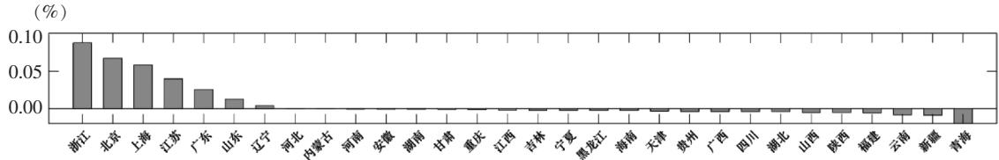

（ % ）  
（ ） GDP 增长  
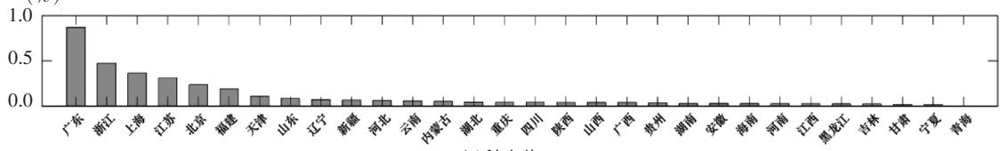  
（b）福利改善

（ % ）  
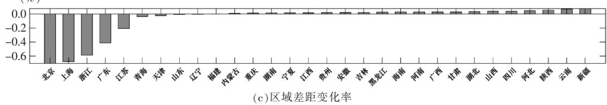  
图 5 各省份分别降低人口流入成本后的经济影响  
注 基于 2012 年的均衡 每个省份的人口流入成本分别降低 10% 按影响大小在图中降序排列

图 5 虽可以用于直观地比较和理解 但其得到的具体数值却不具备任何定量含义 为了进行可信的量化分析 本文参考王丽莉和乔雪（2020） 在反事实实验降低人口流入成本时 寻找一个参照点① 而不是随意将人口流入成本降低一个数值 具体讲 本文针对北京 天津 上海 江苏 浙江 福建 广东 海南这八个东部和南部沿海的人口流入省份 将其人口流入成本 ${ ( \mu _ { k j } ) } ^ { - 1 }$ 按人口流出地 k分类 分别降低至省份 k 的人口流入其他省份的最低流入成本②

表 2 展示了上述反事实情况相对于 2012 年均衡的变化 可以看到 降低东部 南部人口流入省份的迁入成本 可进一步促进劳动力的聚集 不仅带来实际 GDP 和总福利的提升 更降低了区域间人均收入差距 由于涉及人口和劳动力的再配置 与民生和收入分配紧密相关 反事实对总福利和Gini 系数的改善尤为明显 新均衡对总福利的提升高达 35.53% 对 Gini 系数的降低达 20.51% 需要强调的是 由于实际 GDP 中的综合物价指数考虑了房价 如果剔除人口集聚对房价的影响 仅用最终品价格度量总物价 那么新均衡中实际 GDP 的提高会更为明显 不再是 1.47% 而将高达 4.63%

需要注意的是 尽管劳动力向东 南部发达省份流动 会提高劳动力的资源配置效率 也会降低区域人均收入差距 但将不可避免地推高发达省份的房价 如表 2 所示 新均衡下房价分化程度扩大了 26 22% 这主要是由东部 南部发达省份房价提高导致的 在一般均衡效应下 房价的上升将在一定程度上阻碍人口的充分流动 部分抵消放松人口流入后的改善效果 针对这一难题 需要同时向东部发达省份配置更多的土地 提高东部的人均土地面积和人均居住面积

表 2  
人口流动与土地的空间配置相结合比较分析  
单位 ： %

<table><tr><td></td><td>GDP</td><td>总福利</td><td>区域差距</td><td>房价分化</td></tr><tr><td>东部、南部人口流入省份降低迁入成本</td><td>1.4730</td><td>35.5279</td><td>-20.5132</td><td>26.2218</td></tr><tr><td>最大GDP的土地配置</td><td>5.2569</td><td>4.5785</td><td>8.2358</td><td>-8.5328</td></tr><tr><td>上述两个政策相搭配</td><td>8.0951</td><td>44.7407</td><td>-13.7874</td><td>18.0809</td></tr><tr><td>东部、南部人口流入省份降低迁入成本</td><td>1.4730</td><td>35.5279</td><td>-20.5132</td><td>26.2218</td></tr><tr><td>最大福利的土地配置</td><td>5.1450</td><td>4.6200</td><td>7.4496</td><td>-9.5392</td></tr><tr><td>上述两个政策相搭配</td><td>7.8064</td><td>47.1327</td><td>-13.5041</td><td>16.3926</td></tr></table>

注 所有影响均以百分比变化率度量

表 2 同时展示了引入最优土地配置的反事实实验 以及将人口流动和土地配置相结合的反事实实验 无论是向东部 南部沿海发达省份配置更多土地 还是令其吸引更多人口 均能促进总体效率的改善（GDP 总福利） 但也有各自的掣肘之处 单独向东部地区配置土地会扩大区域人均收入差距（8.24%或 7.45%） 而单独向东部地区配置劳动力会扩大区域间房价的分化（26.22%） 当两个政策相结合时 对总体效率的提升出现了相辅相成的促进效果 总体效果明显大于各自效果的叠加 例如 人口流动与最大化福利土地配置对总福利的影响 ： 1+47.13%>> （1+35.53% ） × （1+4.62% ）此外 两方面政策也相互弥补了对方的短板 向发达地区配置土地缓解了人口过度聚集导致的高房价问题 （18.08% vs. 26.22%或 16.39% vs. 26.22% ） 推动人口流动则缓解了向发达地区配置导土地致的区域间人均收入差距问题 （-13.79% vs. 8.24%或-13.50% vs. 7.45% ）

因此 只有将土地空间配置的优化与户籍制度改革进行搭配 推动土地资源和人力资源的同向聚集 才能实现相辅相成的效果 同时达成提升总体效率 缩小区域人均收入差距 稳定发达地区住房价格等多重目标 ①

## 2 畅通国内贸易推动内循环

从更广阔的视角看 区域协调发展和新发展格局需要在国内形成统一的要素市场和产品市场因此 不仅应促进要素（土地 劳动力）的循环与流动 还应同时促进产品与服务的贸易

一直以来 对外贸易是拉动中国各省份经济发展的主要驱动力 而国内省际贸易仍有较大的发展空间 依据李善同（2018）编制的地区投入产出表 2002 年 2007 年和 2012 年 各省份卖到省份外的（中间）产品与服务中 出口至国外的占比分别高达 32 02% 34 77% 26 30% 卖给国内其他省份的占比则分别为 67 98% 65 23% 73 70% 换句话说 各省份每卖出 3 单位（中间）产品 就有约 1 单位（中间）产品是出口至国外的 ①

事实上 中国内部市场存在着较强的分割现象和地方保护主义（Young 2000） 尽管部分学者发现国内市场存在潜在的整合趋势（白重恩等 2004；桂琦寒等 2006；陈敏等 2008） 但这些现象在当今仍然显著存在（张宇 2018 张昊 2020） 此外 国内贸易和出口贸易存在一定的联系 国内市场的分割潜在导致了中国出口的扩张（朱希伟等 2005 张杰等 2010） 而对出口的依赖又可能会加剧国内市场的分割（陈敏等 2008 ；陆铭和陈钊 2009）

基于此 本文拟考虑不同区域降低贸易成本 $\gamma _ { k j }$ 带来的改进作用 基于 2012 年的均衡 表 3 分别考察了国内省际贸易和对外进出口贸易的成本降低后带来的影响 国内和国外贸易均区分了进口和出口（即降低卖出产品的成本和降低买入产品的成本） 此外国内贸易还区分了东部 中部 西部地区

表 3  
降低 10%的区域贸易成本带来的改进作用  
单位 ： %

<table><tr><td colspan="3"></td><td>GDP</td><td>总福利</td><td>区域分化</td><td>房价分化</td></tr><tr><td rowspan="6">国内贸易</td><td rowspan="3">进口成本降低</td><td>东部省份</td><td>1.7738</td><td>1.7047</td><td>3.7698</td><td>2.8308</td></tr><tr><td>中部省份</td><td>0.5738</td><td>0.7395</td><td>-0.9985</td><td>-0.2813</td></tr><tr><td>西部省份</td><td>0.6163</td><td>0.7464</td><td>-1.2101</td><td>-0.3888</td></tr><tr><td rowspan="3">出口成本降低</td><td>东部省份</td><td>1.9236</td><td>1.9184</td><td>3.1929</td><td>2.9024</td></tr><tr><td>中部省份</td><td>0.5602</td><td>0.6896</td><td>-0.6674</td><td>-0.2387</td></tr><tr><td>西部省份</td><td>0.4698</td><td>0.5747</td><td>-0.9942</td><td>-0.4989</td></tr><tr><td rowspan="2">国际贸易</td><td colspan="2">全国进口成本降低</td><td>0.6470</td><td>0.6481</td><td>1.1468</td><td>1.2111</td></tr><tr><td colspan="2">全国出口成本降低</td><td>0.1307</td><td>0.1234</td><td>0.3544</td><td>0.3089</td></tr></table>

注 所有影响均以百分比变化率度量

（1 ）通过降低国内贸易成本带来的 GDP 和福利改进 远高于降低国际贸易成本带来的改进 需要强调的是 表 3 国内贸易部分是从东部 中部 西部分别考察的 国际贸易部分是针对全国的 倘若国际贸易也从东部 中部 西部分别考察 得到的 GDP 和福利改进将更小 因此 当前进一步促进对外贸易的额外收益并不大 而在“国内循环”和“国际循环”的对比中 显然应当以国内大循环为基础

（2）国内贸易中 分东部 中部 西部分析 东部地区基于较为雄厚的经济基础 降低其国内贸易成本带来的全国 GDP 和总福利改进明显较高 但也不可避免地将扩大区域人均收入差距 也将进一步抬升东部地区的房价 针对中部 西部地区 降低其国内贸易成本不仅能带来全国 GDP 和总福利改进 还能降低区域人均收入差距和区域房价差异 需要说明的是 针对不同地区降低贸易成本并不涉及如土地等资源的竞争性分配 尤其是在当前的背景下 主要的国内贸易成本来自制度环境 而非交通等客观硬件条件（范欣等 2017 张宇 2018 张昊 2020） 同时降低东部 中部 西部各区域的国内贸易成本并不互斥 不存在排他性的选择难题

（3）对比国际贸易中降低进口成本和降低出口成本带来的影响 可以发现前者带来的 GDP 和总福利改进更为明显 而后者仅为前者的 1/5 可见 尽管出口是改革开放以来拉动中国经济快速发展的重要驱动力 但其驱动作用在不断减弱 “国际循环”要求持续扩大对外开放 但在这一过程中中国应摆脱单纯对出口的依赖 并以开放的胸怀吸引全球资源要素和产品的进入 形成参与国际经济合作与竞争新优势

需要注意的是 表 3 将所有地区的贸易成本降低相同比例 但是东部省份的进口和出口成本都已经较低 进一步降低贸易成本的空间可能并不大 相比较看 中部 西部省份的贸易成本颇高 平均对内贸易成本比东部省份分别高 5 94%和 9 79% 其中 青海对国内其他省份贸易成本甚至高于全国对海外的平均贸易成本 因此 着重对中西部省份降低贸易成本应当成为相关政策的发力重点 ①

## 六 结论 优化国土空间布局 统筹构建新发展格局

“优化国土空间布局 推进区域协调发展”是“十四五”时期国民经济和社会发展的重点任务 这不仅是高质量发展的内在要求 更是实现“双循环新发展格局”的重要途经 在区域协调发展战略的影响下 中国城镇建设用地供给自 2003 年起逐步向中西部省份倾斜 东部的土地供给则逐步受到压缩 这一土地配置趋势明显地缩小了区域差距 但也潜在地带来了资源错配 并抬高了东部地区的房价和劳动力成本 量化空间模型可以较好地刻画中国区域经济的发展趋势 本文基于这一框架对不同的新增建设用地指标区域配置策略进行量化分析 研究发现 最大化 GDP 的方式倾向于对东部发达省份配置更多的土地 这一策略同时可以抑制东部城市的房价 但不可避免地扩大了区域间人均收入差距 最小化区域间人均收入差距的方式 却难以显著提高 GDP 中国现实情况中的土地配置方式 在“效率”和“公平”上找到了一个良好的平衡点 既实现了 GDP 和总福利的显著提升又明显缩小了区域间人均收入差距

基于此 本文认为 仅靠调整国土空间布局难以实现“效率”和“公平”的双重最优目标 构建“新发展格局” 应当借助多维度政策工具

（1 ）将国土空间布局的优化与户籍制度的改革相结合 无论是向东部发达省份配置更多土地还是引导更多劳动力流入 都是把资源配置在边际生产率更高地区的优化路径 同时 由于前者将潜在扩大区域人均收入差距 而后者将潜在提升东部地区房价上涨压力 只有将二者结合 推动资源和人口的同向聚集 才能相辅相成 克服彼此的政策短板 因此 应增强土地管理的灵活性 建立跨区域土地指标交易机制 推动户籍制度改革 放宽落户限制 推动外来人口公共服务均等化 提高城市管理水平 完善新增建设用地与转移人口挂钩政策

（2）推动国内统一大市场的实现 国内大循环和扩大内需是“双循环”发展格局的战略基点 然而 在中国内部市场中 无论是要素与人口 还是产品与服务 都仍然存在流动不畅的问题 尽管中央政府一直在推动市场整合 但体制机制障碍仍然没有得到根本消除 因此 贯通生产 分配 流通消费各环节 打破行业垄断和地方保护 降低全社会交易成本 形成国民经济良性循环 就变得尤为迫切

（3）转变政府职能 完善地方政府激励机制 以往的“区域均衡发展”主要专注于“总量的均衡”这与地方政府追求 总量的内在激励不谋而合 综合导致了土地等资源的错配和人口向东部地区流动的受限 此外 地方政府是土地制度 户籍制度改革的直接执行者 其激励的扭曲将不可避免地影响区域房价水平 公共服务水平和要素与产品市场化水平 因此 应转变思路 转而追求“区域间人均水平的均衡” 在地方官员考核机制中用人均 GDP 人均可支配收入等人均指标取代总量指标 同时将人均居住面积 人均公共服务资源及人民满意度等民生福利指标纳入考核体系

实现高质量发展 构建新发展格局 亟需通过顶层设计统筹推进各项改革 以优化资源配置效率和缩小人均差距为中心 统筹推进土地 户籍 财税 市场改革 完善地方政府激励机制 构建现代化治理体系 需要指出的是 为了更加全面深入地研究这些措施的作用机制 本文模型还存在很多改进和拓展空间 例如 未来可引入更丰富的地方政府动机与行为 多层级的财税体系和政府博弈能体现中国现实的市场摩擦和市场分割的机理

## 〔参考文献〕

〔1〕白重恩 杜颖娟 陶志刚 仝月婷. 地方保护主义及产业地区集中度的决定因素和变动趋势[J]. 经济研究 2004（4 ） ： 29-40.

〔2〕陈敏 桂琦寒 陆铭 陈钊. 中国经济增长如何持续发挥规模效应?——经济开放与国内商品市场分割的实证研究[J].经济学 （ 季刊 ） 2008 （1 ） 125-150.

〔3〕段巍 王明 吴福象. 中国式城镇化的福利效应评价（2000—2017）——基于量化空间模型的结构估计[J]. 经济研究 2020a （5 ） ： 166-182.

〔4 〕 段巍 ， 吴福象 ， 王明. 政策偏向 、 省会首位度与城市规模分布[J]. 中国工业经济 ， 2020b ， （4 ） ： 42-60.

〔5〕范欣 宋冬林 赵新宇. 基础设施建设打破了国内市场分割吗[J]. 经济研究 2017 （2） ：20-34.

〔6〕桂琦寒 陈敏 陆铭 陈钊. 中国国内商品市场趋于分割还是整合 基于相对价格法的分析[J]. 世界经济 2006（2 ） ： 20-30.

〔7 〕 韩立彬 陆铭. 供需错配 解开中国房价分化之谜[J]. 世界经济 2018 （10 ） 126-149.

〔8〕李善同. 2012 年中国地区扩展投入产出表 ：编制与应用[M]. 北京 ： 经济科学出版社 2018.

〔9〕梁琦 陈强远 王如玉. 户籍改革 劳动力流动与城市层级体系优化[J]. 中国社会科学 2013 （12） ：36-59.

〔10〕刘修岩 李松林. 房价 迁移摩擦与中国城市的规模分布——理论模型与结构式估计[J]. 经济研究 2017 （7） ：65-78.

〔11〕陆铭 陈钊. 分割市场的经济增长——为什么经济开放可能加剧地方保护[J]. 经济研究 2009 （3） ：42-52.

〔12〕陆铭 李鹏飞 钟辉勇. 发展与平衡的新时代——新中国 70 年的空间政治经济学[J]. 管理世界 2019 （10） 11-23.

〔13〕陆铭 向宽虎. 破解效率与平衡的冲突——论中国的区域发展战略[J]. 经济社会体制比较 2014 （4） ：1-16.

〔14〕陆铭 张航 梁文泉. 偏向中西部的土地供应如何推升了东部的工资[J]. 中国社会科学 2015 （5） ：59-83.

〔15〕潘士远 朱丹丹 徐恺. 中国城市过大抑或过小?——基于劳动力配置效率的视角[J]. 经济研究 2018 （9） 68-82.

〔16〕王丽莉 乔雪. 我国人口迁移成本 城市规模与生产率[J]. 经济学 （季刊 ） 2020 （1） 165-188.

〔17〕张昊. 地区间生产分工与市场统一度测算 “价格法”再探讨[J]. 世界经济 2020 （4） 52-74.

〔18〕张杰 张培丽 黄泰岩. 市场分割推动了中国企业出口吗[J]. 经济研究 2010 （8） 29-41.

〔19 〕 张莉 何晶 马润泓. 房价如何影响劳动力流动[J]. 经济研究 2017 （8 ） 155-170.

〔20 〕 张宇. 地方保护与经济增长的囚徒困境[J]. 世界经济 2018 （3 ） ： 147-169.

〔21 〕 赵扶扬 王忏 龚六堂. 土地财政与中国经济波动[J]. 经济研究 2017 （12 ） ： 46-61.

〔22〕朱希伟 金祥荣 罗德明. 国内市场分割与中国的出口贸易扩张[J]. 经济研究 2005 （12） ：68-76.

〔 23 〕 Ahlfeldt G. M. S. J. Redding D. M. Sturm and N. Wolf. The Economics of Density ： Evidence from the Berlin Wall[J]. Econometrica 2015 83 （ 6 ） 2127-2189.

〔 24 〕 Aschauer D. A. Does Public Capital Crowd Out Private Capital [J]. Journal of Monetary Economics 1989 24（2 ） ： 171-188.

〔 25 〕 Baxter M. and R. G. Kin . Fiscal Polic in General E uilibrium [J]. American Economic Review 1993 83

（3 ） ： 315-334.

〔 26 〕 Desmet K. and E. Rossi-Hansberg. Urban Accounting and Welfare [J]. American Economic Review 2013 103 （6 ） ： 2296-2327.

〔 27 〕 Eaton J. and S. Kortum. Technology Geography and Trade[J]. Econometrica 2002 70 （ 5 ） ： 1741-1779.

〔 28 〕 Fang H. Q. Gu W. Xiong and L. Zhou. Demystifying the Chinese Housing Boom [J]. NBER Macroeconomics Annual 2016 30 （1 ） 105-166.

〔 29 〕 Hao T. R. Sun T. Tombe and X. Zhu. The Effect of Migration Policy On Growth Structural Change and Regional Inequality in China[J]. Journal of Monetary Economics 2020 （ 113 ） 112-134.

〔 30 〕 Leeper E. M. T. B. Walker and S. S. Yang. Government Investment and Fiscal Stimulus [J]. Journal of Monetary Economics 2010 57 （8 ） ： 1000-1012.

〔 31 〕 Redding S. J. Goods Trade Factor Mobility and Welfare [J]. Journal of International Economics 2016 （101 ） ： 148-167.

〔 32 〕 Tombe T. and X. Zhu. Trade Migration and Productivity ： A Quantitative Analysis of China [J]. AmericanEconomic Review 2019 109 （5 ） ： 1843-1872.

〔 33 〕 Young A. The Razor ’ s Edge ： Distortions and Incremental Reform in the People ’ s Republic of China [J].Quarterly Journal of Economics 2000 115 （4 ） 1091-1135

# Spatial Allocation of Land and New Development Pattern——Based on the Analysis of Quantitative Spatial Equilibrium

ZHAO Fu-yang CHEN Bin-kai （ School of Economics ， Central University of Finance and Economics ， Beijing 100081 ， China ）

Abstract ： Optimizing the spatial allocation of land is an important part of achieving high-quality development and a new development pattern. Since 2003 the allocation of urban construction land supply has gradually tilted to the central and western provinces while the land supply in eastern provinces has gradually been compressed. This land allocation trend has obviously narrowed the regional gap but it has potentially led to resource misallocations and soaring housing prices in the eastern region. Based on the quantitative spatial model this paper matches the regional data to a general equilibrium framework which could well replicate the fact of the differentiation in housing prices among regions. We use this framework to quantitatively evaluate the effect of regional land allocations. Firstly under the investigation of the optimal land allocations we find that the way to maximize GDP tends to allocate more land to the eastern developed provinces. But this allocation strategy inevitably expands the per capita income gaps between regions. In addition the way to minimize the gap in per capita income between regions is difficult to increase GDP significantly. Secondly this article finds that the real land allocation in China has found a good balance between “efficiency ” and “fairness ” which not only achieves a significant increase in GDP and total welfare but also significantly reduces the regional per capita income gap. Finally in response to the dilemma of “efficiency ” and “fairness ” in land allocation we take the new development pattern into consideration. Based on the policy simulations this paper proposes two policy suggestions ： one is the combination of the land allocation and household registration system reform while the other is the unblocking of the domestic trade to boost the internal circulation.

Key Words ： spatial allocation of land ； regional coordinated development ； quantitative spatial model ； newdevelopment pattern

JEL Classification R13 R52 O18

〔责任编辑 崔志新 〕