重大选题征文

# 跨地投资扭曲、产品市场分割与资本的空间配置效率—基于量化空间均衡模型的研究

赵扶扬 王 都 戴若尘 陈斌开

摘要：建设全国统一大市场，需要同时促进要素和商品在地区间畅通流动。本文聚焦资本要素的跨地区流动，从跨地投资扭曲和产品市场分割的交互关系出发，研究我国“资本逆回报率流动”的空间错配现象。本文认为，招商引资逻辑下的跨地投资扭曲是直接原因，而在产品市场分割下，企业为规避跨地贸易成本而直接在市场所在地投资建厂的动机同样会导致资本要素的空间错配。本文构建了一个包含跨地投资决策和地区间产品、资本、劳动力市场的量化空间一般均衡模型，发现跨地投资扭曲和产品市场分割对资本空间错配的影响占比基本相当，而忽略产品市场与资本市场的交互效应将导致国内贸易开放带来的总体利得被低估约20%；造成资本空间错配的深层原因，是地方政府在经济和财税激励下的扭曲行为。政策模拟显示，地区间资本市场和产品市场一体化程度提高可以有效缓解资本空间错配从而带来整体效率提升，但也会面临一定成本与困境：第一，欠发达地区资源被压缩导致地区差距扩大，需要推动劳动力的同向集聚才能实现“公平”和“效率”的统一；第二，市场一体化的建设将在地方执行层面面临潜在阻力，而消费税征收环节后移等财税制度改革可以推动地方政府的激励相容。

关键词：跨地投资 市场分割 资本空间配置 量化空间均衡模型

## 一、引言

党的二十大报告指出：“加快构建新发展格局着力推动高质量发展”构建新发展格局的基础支撑是建设全国统一大市场从而发挥超大规模市场优势《中共中央国务院关于加快建设全国统一大市场的章见》进一步指出，“打通制约经济循环的关键堵点，促进商品要素资源在更大范围内畅通流动”。因此，破除妨碍产品服务和生产要素流通的体制机制障碍显得尤为重要。

在各类生产要素中，资本是极其重要的方面，其不仅是供给侧的要素，更在需求侧以投资为形式对中国经济增长起到重要拉动作用（王一鸣， ）。增量资本（即投资）对中国经济增长的作用固然重要，但同样不可忽视的是存量资本的配置效率。大量文献已发现，我国的资本配置效率存在巨大的提升空间（谢、克莱诺，2009；尹恒、李世刚，2019）。而资本在空间维度上的错配是不可忽视的方面，特别地，资本并没有配置在回报率和效率更高的地区（郝等，2020）。为了进一步印证这一事实，本文基于国家市场监督管理总局的企业工商注册数据考察了中国区域间资本流向和单位资本回报的关系。

如图 所示，我国资本要素在区域间的配置与单位资本回报呈现出明显的错配关系。从图 （）可以看到在区域层面，我国资本流向与单位资本回报相悖：回报率最高的东南部沿海处于资本净流出状态，而回报率最低的中西部地区却配置到了更多的资本。进一步地，图 （ ）中每一个点都代表一个城市，可以看到我国单位

（a）区域间资本错配

资本回报与资本流向在全局视角下也呈现出显著的负相关关系，即更多的资本配置在了回报率较低的地区。图1中呈现的“资本逆回报流动”现象，恰是本文的研究动机。什么因素导致了资本的空间错配，特别是资本的逆向流动？如何量化评估乃至分解不同因素的影响？如何提高资本的空间配置效率？本文将对这些问题展开研究。

本文认为，导致资本空间错配的核心原因有两个方面。一方面，最直接的原因在于我国要素市场，特别是资本市场存在地区间扭曲与分割（中国人民大学“完善要素市场化配置政策路径和实施举措”课题组等， ；刘志彪、孔令池， ）。而在区域间资本市场，地方政府往往出于招商引资的目的，通过设置税收补贴（江飞涛等，2012）、对企业提供廉价的土地（李力行等，2016）等优惠政策吸引外地企业和资本进入本地。不同地区的多种因素共同构成了跨地投资扭曲，直接影响是扭曲了资本的真实回报率，影响资本流动的因素变成了考虑各类补贴、摩擦的实际回报率，最终导致资本流动方向和数据观察到的回报率出现偏离。

另一方面，产品市场分割也是影响资本空间配置的重要因素。当前，我国产品市场分割依旧存在且绝对水平仍然颇高（李自若等，2022），其影响资本跨地区流动的逻辑与国际贸易领域中关税跳跃（tariff jumping）的逻辑类似（霍斯特， ）。外地企业进入本地市场有两种选择：一是通过产品贸易的方式将外地生产的产品销售至本地；二是通过跨地投资的方式在本地建厂并将产品在本地销售。在两种方式的权衡之下，企业家往往会选择在国内贸易壁垒较高的地区投资建厂从而免受高贸易摩擦带来的成本加成，最终导致资本空间配置受到产品市场分割的影响。

本文构建了一个多地区量化空间一般均衡模型，创新性地为企业跨地投资决策赋予微观基础并匹配以企业工商注册数据，同时构造了地方政府激励从而讨论不同市场分割的深层次原因。基于以上工作，本文较好地复现并解释了我国“资本逆回报率流动”的错配现象。此外，本文针对影响资本空间配置效率的不同因素进行了量化分解，并对进一步降低跨地投资扭曲、国内贸易壁垒等举措的潜在影响和阻力进行了政策模拟。

本文有如下研究结论和发现。第一，基于对跨地投资扭曲和产品市场分割的量化分解，本文发现两个因素对资本空间错配贡献的占比基本相当；倘若忽视产品市场与资本市场的交互机制，国内贸易开放带来的总体利得将被低估约 ；只有同时推进两种市场的一体化建设，才能逆转“资本逆回报率流动”的现象。第二，造成资本空间错配的根本原因，是最大化辖区总产出和财政收入动机下地方政府执行的一系列扭曲性行为。招商引资的税收优惠力度与地方政府效用号现出倒U型关系而贸易保护程度降低则会使得地方政府效用单调下降。第三，跨地投资扭曲和产品市场分割降低可以有效缓解资本空间错配从而带来整体效率提升，但也面临着扩大地区差距和与地方政府激励不协调的困境，需要分别搭配以促进劳动力同向集聚和消费税征收环节后移的政策，才能兼顾“公平”和“效率”并实现激励相容。

相较于现有文献，本文的特点及潜在贡献体现在如下4点。第一，在视角上，相比于多数文献专注于研究

资本在微观企业间的配置，本文重点关注了资本的空间配置效率。而不同于传统量化空间均衡文献较多关注的劳动或土地要素，本文对资本要素进行了建模。第二，在方法上，不同于通过利率楔子直接刻画资本配置的方式，本文基于企业跨地投资的微观最优决策刻画了资本从来源地到目的地的流动，并匹配以工商企业注册数据展开量化结构分析。第三，在理论上，得益于上述微观基础，本文可以在一个统一的理论框架下讨论资本市场与

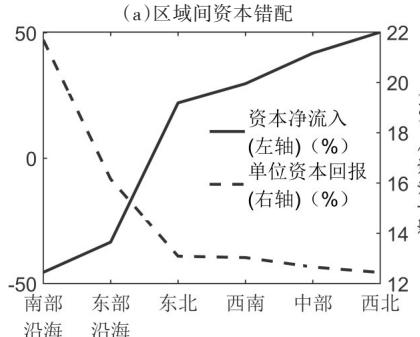

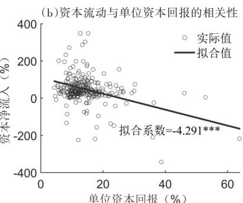  
图 我国资本空间错配的特征事实

注，图1中资本净流人及其他数据的具体处理与计算方式加《管理世界》网络发行版附录4所示，本文也使用了2010-2015年的数据进行了测算，发现了与图1相同的特征事实详见《管理世界》网络发行版附录A。资本净流入计算方式为（资本流入-资本流出）/GDP（刘莉亚等，2013；戴维斯等，2021）。

数据来源：统计年鉴和企业工商注册数据，数据的时间范围是2016年、2017年和2018年的平均。数据处理过程及稳健性检验详见《管理世界》网络发行版附录 。

## 重大选题征文

产品市场的交互机制以及改进效应的分解。第四，在政策上，本文量化分析了地区间市场一体化政策的效率提升作用，进一步地，本文发现政策面临着扩大地区差距和地方政府激励不协调的困境，并分别考察了潜在应对举措。

当前，世界百年变局加速演进，而我国经济增长正面临传统模式驱动力减弱的趋势。站在现代化进程的关键节点，我国亟须立足要素资源在全国范围的畅通流动和高效配置，发挥超大规模市场优势并构建全国统一大市场。这一背景也为本文赋予更强的现实意义和政策含义。第一，构建更加完善的资本跨地区配置的市场化机制，特别是降低以恶性引资竞争或省界壁垒为代表的行政性扭曲，将释放出巨大经济增长空间。第二，在构建全国统一大市场的过程中，应格外重视不同要素市场建设和产品市场建设的系统性、协同性，而资本空间配置的优化需要与全国统一、畅通的产品市场和劳动力市场建设相结合。第三，构建全国统一大市场的过程中，应格外重视地方政府激励问题，需要加强行政性分权与经济性分权之间的协调，通过深化财税体制的改革和完善地方官员考核机制以提升地方政府参与全国统一大市场建设的激励相容性。

本文后续安排如下：第二部分是相关文献评述，第三部分为模型设置，第四部分为模型求解、校准与估计，第五部分为特征事实解释与机制分析，第六部分为政策模拟，第七部分为结论与建议。

## 二、文献评述

## （一）我国资本配置效率相关事实

卢卡斯于1990年提出了著名的“卢卡斯之谜”，即资本为什么不从发达国家流向资本回报率更高的发展中国家（卢卡斯， ），这与我国“资本逆回报率流动”的事实有相似的表现，却未必有相同的原因。关于我国的资本配置效率，多数文献关注资本在企业间尤其是制造业企业间的错配，这种错配会通过影响在位企业的资源配置效率（龚关、胡关亮， ）和企业的进入退出行为（盖庆恩等， ）等路径降低总体生产率①。除此之外，资本在不同所有制企业之间的错配也得到了广泛关注，基本共识是国有企业的效率低于非国有企业但国有企业享受了更多的资本，从而造成了效率损失（多拉尔、魏，2007；布兰特、朱，2010）。

除了企业间错配，资本在空间维度上同样存在错配现象。首先，我国的投资回报率呈现出明显的区域异质性，东、中、西部回报率依次递减（柏培文、许捷， ；刘仁和等， ），这与本文的特征事实吻合。其次，资本在区域间流动时也表现出错配的特性，流向东部地区的资金更注重回报而流向非东部地区的资金则不注重投资回报率（曹廷求、张翠燕，2021）。最后，另有部分文献发现经济发展水平与资本回报率存在一定的倒U型关系（赵善梅、吴士炜， ）。

既有文献较为充分地关注了我国的资本配置问题但仍存在一定不足。一方面大量研究仍集中于资本在企业或行业层面的错配，对于资本在空间上的配置问题讨论仍有不足。另一方面，虽有部分文献关注到了资本的空间配置问题，但该类研究仍以实证分析为主，缺乏一般均衡视角下的结构和量化分析，也未能对错配的成因进行严谨的理论分析和量化分解。

## （二）影响资本空间配置效率的因素

影响资本空间配置的最直接原因是资本市场的扭曲与分割，主要包括客观因素和制度因素两方面。其中客观因素主要包括信息摩擦（黄等， ）、交通成本（阿尔卡塞尔、德尔加多， ）和文化因素等（刘毓芸等，）。在制度因素方面，地方政府可以通过设置各类补贴和税收优惠（陶然等， ；江飞涛等， ）或通过金融抑制手段限制金融资源流通（宋等， ；马草原等， ），从而导致资本跨区域流动时面临较大的摩擦和扭曲。

本文重点关注地方政府引资补贴和税收优惠的制度手段②。由于地方与中央之间信息不对称的存在且税法和相关政策给予了地方一定的税收优惠权力，各地可以通过税收竞争争夺稀缺资源（郭杰、李涛， ），且我国西部地区税收优惠强度高于由东部地区（王延明2003：朱轶 能思敏2009），这种竞争会导致一系列潜在结果，如低效的资源分配（方等， ）和对居民福利以及收入水平产生的影响（储德银等， ）。进一步地，税负与投资存在明显的负相关关系，即资本税负越严重，资本外流越严重（付文林、耿强，2011；刘穷志，2017），因此激励投资的一个重要方法就是降低相关税负，且这种激励在低治理能力地区的效果更为显著（唐飞鹏，2016）。

除此之外，产品市场分割同样对跨地投资决策产生深刻影响，其核心逻辑是企业在跨地生产与跨地贸易的权衡。这种权衡关系在国际贸易和跨国生产领域被称为关税跳跃（tariff jumping）（霍斯特，1971；莫塔，1992；布洛尼根，2002）。从定量的角度上，忽略这种交互权衡效应即仅关注纯贸易模型可能会使估计结果存在严重低估（雷蒙多、罗德里格斯，2013）。国内研究中关注产品市场分割与资本空间配置交互的研究较少，仅有少数文献讨论了产品市场分割与企业异地投资存在负相关关系（严兵、肖琬君， ；张安军、叶彤， ；徐光伟等，2023）。

综上，既有文献更多关注资本配置扭曲带来的效率损失，较少讨论产品或其他要素市场分割对资本空间配置的影响机制。尽管有关税跳跃相关文献注意到了产品市场与资本配置的交互机制，但仅聚焦于跨国的空间视角，而针对我国国内产品市场分割和资本空间错配现象的交互关系仍存在一定的探索空间。

## （三）空间一般均衡范式下的地区间资本市场

研究产品和各类要素区域间流动和配置的方法范式不一而足，而量化空间均衡模型（Quantitative SpatialEquilibrium Models）是重要的研究范式之一。该方法允许多维度空间异质性的存在，可以匹配多维数据并进行丰富的反事实模拟，在我国幅员辽阔且区域间存在明显异质性的背景下具有较大应用空间。汤比和朱（2019）的早期工作论文率先将这一方法用于分析中国问题，为相关问题的研究和范式的推广奠定了重要基础，之后国内文献在多个领域均进行了广泛应用和拓展。

当前，资本要素正逐步在量化空间均衡范式中被引入，但常见的引入方式集中在通过外在的“利率楔子”影响资本的空间配置（陈诗一等， ；郝等， ；钱学锋、周文倩， ），且往往不区分资本的来源地。研究跨国企业相关话题的文献刻画了企业的跨地建厂和跨地生产行为（雷蒙多、罗德里格斯， ；樊、罗， ），但往往缺乏对显性资本流动的刻画。近年来，动态化的量化空间一般均衡文献在空间视角下引入了资本的动态积累过程（伊顿等， ；克莱因曼等， ），克莱因曼等（ ）则在动态基础上刻画了企业家的跨地投资决策，与本文资本跨地流动的微观设定较为相似。

总体来看，基于量化空间一般均衡范式的国内文献，对于资本空间流动的研究和刻画仍然存在不足。虽有少数文献初步考察了资本的空间配置但对于配置效率的建模和衡量方式仍旧普遍缺少微观基础无法刻画资本从源头地到目的地的流动。本文将在以上研究的基础上，进一步刻画跨地投资决策的微观基础和资本的空间流动，并匹配以工商企业注册数据进行量化分析。

## 三、模型设置

本文模型在标准量化空间一般均衡范式的基础上，参考克莱因曼等（ ）、克莱因曼等（ ）引入跨地投资决策③。整体经济由N个城市组成，对应我国大陆N个地级市及以上级别城市，不同城市用i，n∈{1，…，N}标记。产品、劳动力和资本均可以在全国范围内跨地流动。产品的生产依赖于劳动和资本两种生产要素。资本的所有者是每个城市的代表性企业家，企业家将给定的资本存量投资到全国各地，通过设立子公司开展生产活动，最终获取资本回报。

## （一）居民偏好与人口迁移

城市i的某个体ω的效用取决于消费水平cω 和宜居程度b，其中 $c ^ { \omega } { } _ { i }$ 是来自不同地区消费品的复合，其效用为：

$$
u _ {i} ^ {\omega} = z _ {i} ^ {\omega} b _ {i} \left[ \sum_ {n = 1} ^ {N} \left(c _ {n i} ^ {\omega}\right) ^ {\sigma - 1 / \sigma} \right] ^ {\sigma / \sigma - 1}, \sigma > 1\tag{1}
$$

其中， $\sigma > 1$ 是 $\vec { J } ^ { \pm }$ 品替代弹性， $\boldsymbol { \cdot } \boldsymbol { c } ^ { \omega } { } _ { n }$ 表示地区i的个体ω消费的是来自地区n的产品。 ${ z ^ { \omega } } _ { i }$ 体现个体的异质性偏好，服从对任意 i 和ω 都独立同分布且参数为 $\rho$ 的第二型极值分布。劳动力使用工资w 进行消费，并且

## 重大选题征文

∑ $P _ { n i } c _ { n i } ^ { \omega } \leqslant w _ { i }$ ，其中Pni是消费品 ${ c ^ { \omega } } _ { n i }$ i的价格。求解最优化可以得到i城市劳动力ω的个体间接效用为 $z ^ { \omega } , V _ { i }$ ，其中：

$$
V _ {i} = \frac {b _ {i} w _ {i}}{P _ {i}}\tag{2}
$$

V表示不考虑个体异质性偏好的劳动力在i城市的间接效用，取决于当地宜居程度和实际工资。

各地区户籍人口是外生给定的，以Li标记，但人口可以跨地迁移，因此各地实际人口Li为内生变量。经济系统内人口总量固定，即 $\sum _ { i } { L _ { i } } = \sum _ { i } { \bar { L } } _ { i }$ 。令 $M _ { i n }$ 表示户籍在i地的人口迁往n地的比例，则有：

$$
L _ {n} = \sum_ {i} M _ {i n} \bar {L} _ {i}\tag{3}
$$

由于我国地理距离、文化差异、户籍制度等因素的存在，人口迁移时还面临着效用的损耗 $0 { < } \mu _ { i n } { < } 1 \left( i { \neq } n \right)$ $\mu _ { i i } { = } 1$ 。人口的迁移决策是在不同区域之间选择使自己的间接效用 $z ^ { \omega } { } _ { i } V _ { i } \mu _ { i n }$ 最大的地区。在大数定律下，户籍在地区i的劳动力迁移到地区 $n$ 的比例 $M _ { i n }$ 应该等于某一个户籍在地区i的劳动力迁移到地区 $n$ 的概率，可以证明：

$$
M _ {i n} = \frac {\left(\mu_ {i n} V _ {n}\right) ^ {\rho}}{\sum_ {m} \left(\mu_ {i m} V _ {m}\right) ^ {\rho}}\tag{4}
$$

其中， $, \rho$ 是人口迁移弹性。ρ越大则人口流动就越依赖于相对效用，反之当 $\rho$ $\rho$ 趋近于 时，人口流动则不受到相对效用的影响。

## （二）生产

城市i的企业家在城市n进行某一笔投资 $\varphi$ ，投资设立的每个子公司生产同质产品，生产函数是规模报酬不变的：

$$
y _ {i n} (\varphi) = \frac {\varepsilon_ {i n} (\varphi)}{\bar {\varepsilon}} Z _ {n} \left[ k _ {i n} (\varphi) \right] ^ {\alpha} \left[ l _ {i n} (\varphi) \right] ^ {1 - \alpha}\tag{5}
$$

其中， $k _ { i n } ( \varphi )$ 为投资金额， ${ . y _ { i n } } ( \varphi )$ 是投资落地后成立的子公司产出， $l _ { i n } ( \varphi )$ 是子公司在城市n雇佣的劳动力数量。 $Z _ { n }$ 是城市n的平均生产率。此外，不同企业生产还面临着微观随机异质性冲击 ${ \pmb { \varepsilon } } _ { i n } ( \varphi ) , { \pmb { \varepsilon } } _ { i n } ( \varphi )$ 服从对任意i、n、φ都独立同分布且参数为 $\kappa$ 的第二型极值分布，κ代表分布的离散程度，ε表示随机变量 $\varepsilon _ { i n } ( \varphi )$ 的均值。该随机异质性冲击类似于企业家的微观异质性偏好，在大数定律下，无论i地与n地宏观回报率孰高，总会有一定比例的资本从i地流向n地，也会有一定比例的资本从n地流向i地。在上述资本空间流动的逻辑下，各地（有效）单位资本回报并不会完全相等。

设 $p _ { n }$ 为城市n企业的单位成本（单位产出价格），则企业面临如下最优化问题是：

$$
\max _ {l _ {i n} (\varphi)} y _ {i n} (\varphi) p _ {n} - w _ {n} l _ {i n} (\varphi)\tag{6}
$$

由于本文重点关注资本在区域间的配置，且生 $\vec { \boldsymbol { J } ^ { \pm } }$ 函数是规模报酬不变的，因此可以将个体生 $\vec { J } ^ { \pm }$ 函数加总求平均从而得到总体生产函数：

$$
Y _ {i n} = Z _ {n} \left(k _ {i n}\right) ^ {\alpha} \left(l _ {i n}\right) ^ {1 - \alpha}\tag{7}
$$

其中， $Y _ { i n }  k _ { i n }  l _ { i n }$ 分别表示城市i在城市 $n$ 投资生产的总产出、投资总量以及雇用的劳动力总量。城市n总人口 $L _ { n } = \sum _ { i } l _ { i n }$ ，对总体生产函数求解同样的最优化问题可以得到：

$$
p _ {n} = \frac {L _ {n} ^ {\alpha} w _ {n}}{(1 - \alpha) Z _ {n} \left(\sum_ {i} k _ {i n}\right) ^ {\alpha}}\tag{8}
$$

可以看到，企业的出厂价格依赖于生产要素供给量、要素价格和技术。进一步地，也可以得到城市n的平均投资回报率：

$$
r _ {n} = \alpha \left(p _ {n} Z _ {n}\right) ^ {1 / \alpha} \left(\frac {1 - \alpha}{w _ {n}}\right) ^ {1 - \alpha / \alpha}\tag{9}
$$

可以看到城市平均投资回报率对每个城市来说是独立的且并不依赖于某个子公司 $\varphi$ 或随机变量 $\varepsilon _ { i n } ( \varphi )$ 。

## （三）投资决策

企业家的投资回报往往还面临一些损耗不同的投资损耗也就导致了跨地投资扭曲的存在，假设对于城市i到城市n的每一单位投资回报，企业家只能回收 $\tau _ { i n }$ 的比例。则城市i企业家在城市n进行某一笔投资 $\varphi$ 的

净回报率为 $: \varepsilon _ { i n } ( \varphi ) \tau _ { i n } r _ { n } .$ C

对于每一单位投资，企业家的最优决策是将资本投资到回报率最高的城市，如该城市为 $n$ ，则需要满足$\begin{array} { r } { \pmb { \mathscr { E } } _ { i n } \left( \varphi \right) \pmb { \tau } _ { i n } \pmb { r } _ { n } \gtrless \operatorname* { m a x } _ { m \neq n } \pmb { \mathscr { E } } _ { i m } \left( \varphi \right) \pmb { \tau } _ { i m } \pmb { r } _ { m \circ } } \end{array}$ 由于投资笔数足够多，只需要求解企业家资本总量 $\overline { { K } } _ { i }$ 在全国各个城市的配置概率（或比例）。 $k _ { i n }$ 表示城市i企业家在城市 $n$ 配置的资本总量，令 $S _ { i n } { = } k _ { i n } / \overline { { K } } _ { i }$ 表示配置比例。可以证明投资矩阵 $S _ { i n }$ 为（证明参见《管理世界》网络发行版附录 ）：

$$
S _ {i n} = \operatorname * {P r} \left(\varepsilon_ {i n} (\varphi) \tau_ {i n} r _ {n} \geqslant \max _ {m \neq n} \varepsilon_ {i n} (\varphi) \tau_ {i m} r _ {m}\right) = \frac {\left(\tau_ {i n} r _ {n}\right) ^ {\kappa}}{\sum_ {m} \left(\tau_ {i m} r _ {m}\right) ^ {\kappa}}\tag{10}
$$

可以看到资本的配置不仅取决于地区单位资本回报，跨地投资扭曲也会影响企业家的投资决策，二者共同构成了有效单位资本回报。在本文的这种设定下，资本流动可能会使得有效回报率 $\tau _ { i n } r _ { n }$ 趋同，但现实数据观测到的各地单位资本回报r 仍存在较大差异，相当于在有效回报率和观测回报率之间打入了一个楔子（郝等，2020；钱学锋、周文倩，2024）。同时，κ在此处即投资弹性，投资弹性越大，资本流动受有效回报率 $\tau _ { i n } r _ { n }$ 的影响（即回报率弹性）越大，受微观随机异质性的影响就越小。另外可以证明城市i企业家投资的平均（预期）回报率是各个地区回报率的加总（证明参见《管理世界》网络发行版附录B）：

$$
R _ {i} = \Gamma \bigg (\frac {\kappa - 1}{\kappa} \bigg) \Big [ \sum_ {n} \big (\tau_ {i n} r _ {n} \big) ^ {\kappa} \Big ] ^ {\frac {1}{\kappa}}\tag{11}
$$

## （四）产品贸易

本文通过阿明顿（1969）的传统方式引入产品贸易。假设地区间贸易面临冰山成本形式的地区间贸易壁垒： $: \gamma _ { n m } { \geqslant } 1 , \gamma _ { n n } { = } 1$ ，因此某 $\vec { \boldsymbol { J } ^ { \pm } }$ 品从n地运送到m地的最终销售价格是 $p _ { n } \gamma _ { n m } c$ 。在居民的CES消费偏好下，可以证明地区m的物价水平为：

$$
P _ {m} = \left[ \sum_ {n} \left(\frac {\gamma_ {n m} L _ {n} ^ {\alpha} w _ {n}}{(1 - \alpha) Z _ {n} (\sum_ {i} k _ {i n}) ^ {\alpha}}\right) ^ {- \theta} \right] ^ {- \frac {1}{\theta}}\tag{12}
$$

其中， $\scriptstyle \theta = \sigma - 1$ 表示贸易弹性 $^ { , \circ }$ 令 $X _ { m }$ 表示m地区对所有产品的总支出， $X _ { n m }$ 表示m地区对n地区产品的总支出， $\pi _ { n m }$ 表示m地区购买 $n$ 地区产品的贸易份额，在大数定律下等于某地区产品价格小于其他地区的概率。可以证明贸易份额为：

$$
\pi_ {i n} = \frac {\left[ \gamma_ {i n} p _ {i} \right] ^ {- \theta}}{\sum_ {m} \left[ \gamma_ {m n} p _ {m} \right] ^ {- \theta}}\tag{13}
$$

可以看到，地区n购买地区 $i \stackrel { \triangledown } { \vec { J } ^ { \varepsilon } }$ 品的份额，主要依赖于地区间贸易壁垒和企业生 $\vec { \boldsymbol { J } ^ { \pm } }$ 单位成本的相对比例。基于 $X _ { i n }$ 的定义，地区i的总销售额为 $\sum { X _ { i n } }$ 。

另外需要强调的是，本文贸易设定所参考的阿明顿（1969）和当今学界广泛采用的伊顿和科图姆（2002）的设定在本质上没有差别，所得出的贸易矩阵完全一致（雷丁、罗西 汉斯贝格， ；赵扶扬等， ）④。

## （五）市场出清与一般均衡

资本市场出清条件由 $K _ { i } = \sum _ { n } S _ { n i } \bar { K } ,$ 给出，劳动力市场出清由式（3）给出，产品市场出清需要i地生产总额等于销售总额，即 $Y _ { i } = \sum _ { n } X _ { i n }$ ，在完全竞争的条件 $\top$ ，等式左侧的i地生产总额等于要素报酬，等式右侧的n地总支出又等于该地居民总收入，包括劳动收入和资本收入，因此产品市场出清条件可改写为：

$$
w _ {i} L _ {i} + \left(\sum_ {n} S _ {n i} \tau_ {n i} \bar {K} _ {n}\right) r _ {i} = \sum_ {n} \pi_ {i n} \left(w _ {n} L _ {n} + R _ {n} \bar {K} _ {n}\right)\tag{14}
$$

上式同时潜在刻画了地区间的贸易均衡，但需要注意的是，由于存在跨地区投资，某地区的部分产出将归属于其他地区的资本收入，因此本文模型中的地区间贸易并不是平衡贸易。

## 四、模型求解、校准与估计

## （一）模型的均衡及求解

本文均衡的定义如下：在给定地区特有参数 $\{ \overline { { K } } _ { n } , \overline { { L } } _ { n } , Z _ { n } , b _ { n } , \gamma _ { i n } , \mu _ { i n } , \tau _ { i n } \} _ { i , n = 1 } ^ { N }$ ，以及其他地区同质性参数 $\{ \alpha , \rho$

资本流入地

## 重大选题征文

θ，κ}后，满足均衡条件的内生变量集合 $\{ w _ { n } , r _ { n } , p _ { n } , P _ { n } , L _ { n } , K _ { n } , V _ { n } , R _ { n } , M _ { i n } , S _ { i n } , \pi _ { i n } \} _ { i , n = 1 } ^ { N }$ ，即为本文的全局一般均衡。基于标准的非线性渐进迭代算法，本文可以在不同参数环境下对基准模型或反事实模型进行数值求解。

## （二）数据来源与处理

基于数据可得性，本文量化的地域范围为我国大陆277个城市，所使用现实数据的简要说明如下。（1）2017年、 年各城市单位资本回报，由各城市资本报酬和资本存量计算而来；其中资本报酬的计算使用收入法中扣除劳动报酬的部分来衡量（黄先海等， ；钱学锋、周文倩， ），同时本文也使用其他测算方式进行了稳健性检验，详见《管理世界》网络发行版附录 和附录 ；城市资本存量的测算使用永续盘存法计算而来（张军等，2004；单豪杰，2008），数据来源为统计年鉴。（2）2017年、2018年企业工商注册数据⑤，数据来源是由北京大学企业大数据中心通过国家市场监督管理总局（原工商总局）数据整理的全国企业工商注册数据。对于法人公司或企业，本文按照注册年份、注册地址的行政区划代码进行加总，得到城市对（ ）层面的企业投资数据。（3）人口流动数据，本文使用第六次全国人口普查微观数据中“调查时居住地”和“户籍所在地”两项获得人口迁移矩阵。（4）2017年、2018年各地区户籍人口数和劳动报酬，数据来源是各地区统计年鉴中户籍人口和在岗职工平均工资。

## （三）参数校准与估计

首先是基于文献和数据取值的参数。（1）资本产出弹性 $\alpha _ { \iota }$ 。根据国家统计局劳动收入占比的数据得到劳动产出弹性为0.5，从而推出资本产出弹性为0.5。（2）人口迁移弹性 $: \rho .$ 。静态框架下人口流动相关文献常用的人口迁移弹性为1.5（汤比、朱，2019），该取值也在国内得到了广泛应用（周慧珺等，2024），本文沿用这一取值。（3）贸易弹性 $\theta _ { \circ }$ 遵循大部分量化空间一般均衡范式的国内应用（汤比、朱，2019；林晨、李宇潇，2024），本文将贸易弹性设定为4；此外，本文也对贸易弹性取值为2（韩佳容，2021）和6（樊等，2023）时分别进行了稳健性检验，具体结果参见《管理世界》网络发行版附录 。（ ）国内贸易壁垒 $\gamma _ { i n \circ }$ 本文使用樊等（ ）估计的中国地级市层面的贸易成本矩阵。

其次是通过实证估计得到的参数。由于投资弹性 $\kappa$ 没有现成的文献或数据支持，本文基于式（10）构造如下回归方程对其进行估计：

$$
\ln \left(S _ {i n t} / S _ {i i t}\right) = \kappa \ln \left(r _ {n t}\right) + \vartheta_ {i t} + v _ {i n} + \xi_ {i n t}\tag{15}
$$

其中，自变量为投资目的地n的单位资本回报， $\vartheta _ { i t }$ 和 $v _ { i n }$ 分别是源头地固定效应和源头地—目的地高维固定效应。控制 $v _ { i n }$ 的目的在于消除源头地和目的地之间的投资扭曲项，ξ 是误差项。同时参考汤比和朱（2019）、

周慧珺等（2022）的做法，使用Bartik IV等工具变量进行估计。估计结果较为稳定，主要集中在 之间（具体参见《管理世界》网络发行版附录D），综合考虑取κ为1.5。

最后是通过模型匹配数据反解得到的参数.（1）人口迁移成本$\mu _ { i n }$ ，基于式（4）匹配人口迁移矩阵的现实数据解得。（2）跨地投资扭曲 $\tau _ { i n }$ ，基于式（ ）匹配投资矩阵和回报率的现实数据解得。（ ）全要素生产率Z、资本存量K和宜居程度 $b _ { i }$ 则需要从模型的均衡系统中进行反向求解。

## （四）模型的量化适应性和现实解释力

## 1.关键参数的合理性讨论

本文大部分参数都有较成熟的文献支持或较强的数据基础，但跨地投资扭曲 $\tau _ { i n }$ 在文献中并不常见且没有直接的数据对应，因此需要对其合理性进行讨论。

图 是由 个 $\tau _ { i n }$ 构成的矩阵，每一个像素点都代表一个$\tau _ { i n } .$ ，颜色越深代表投资扭曲越小，即 $\tau _ { i n }$ 值越大。图 中每行都对应

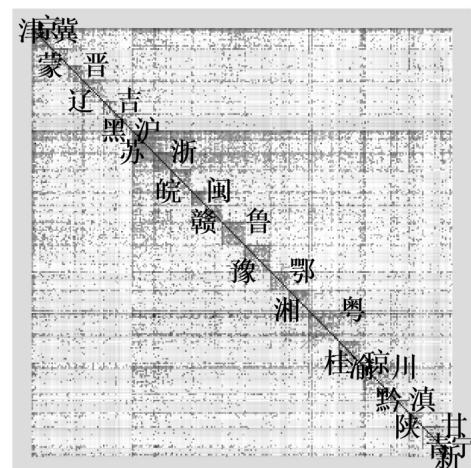  
图 跨地投资扭曲的城市矩阵

注：(1)图中行(列)的排序方式为行政区划代码由小到大排列。（ ）图中每行对应一个资本流出城市，每列对应一个资本流入城市。（ ）图中每个像素点对应一个资本流出—流入的城市对（city-pair），像素点的颜色越深，代表τ越大，投资扭曲越小。

一个资本流出地，每列都对应一个资本流入地。可以从图2中观察到如下结论。第一，一条黑色的对角线贯穿图形，这条对角线是由277个点组成的，每一个点都代表各城市内部的投资不存在损耗，即 $\tau _ { i i } { = } 1$ 。第二，在对角线上出现了很多深色的方块，每个方块对应的都是一个省级行政区，方块内部颜色较深说明同省内投资的扭曲较小，反映出资本流动存在明显的省界效应。第三，经济发展程度较高的地区（京、沪、苏、浙、粤及多数省会），对应的水平行颜色较深，说明对外投资扭曲较小，资本溢出能力较强。第四，京津冀和长三角两个区域内部的省界效应较弱，反映出两个发达城市群内部资本市场一体化程度较高。综上，本文关键参数 $\tau _ { i n }$ 与我国现实直觉高度符合，具备量化合理性。

## 2.模型与现实数据的拟合程度

在现实解释力方面，图3展现了本文基准模型与现实数据的匹配度检验。从图 $3 ( \mathrm { a } )$ 可以看到本文较好地复刻出了现实中单位资本回报与资本流向负相关的特征事实，基准模型中单位资本回报和资本流动的散点分布、拟合线以及统计关系均与现实数据高度相似，说明至少在重点关注的资本错配问题上本文模型具有较强的解释力。

此外，本文还使用GDP数据为本文模型匹配度提供更充分的证据。如图3（b）所示，模型的结果和现实数据均匀且紧密地分布在45度线周围。值得强调的是，GDP的现实数据在本文的校准过程中完全没有使用过，但基准模型的结果依旧能与其形成较好的拟合，充分证明了本文模型对现实经济结构具有一定的解释力。

## 五、资本空间错配事实的解释与机制分析

## （一）跨地投资扭曲与产品市场分割的影响及分解

基于以上对模型解释力的讨论，本节将重点验证资本空间错配的内在机制，即跨地投资扭曲与产品市场分割对资本空间配置的影响。首先，企业家进行投资决策时关注的是净回报率，不仅包含回报本身，还需要扣除投资回报的损耗。当某地区的投资损耗较小时，即使该地回报率不高但该地依旧能吸引来更多的资本。其次，企业家也面临着跨地贸易和跨地投资的权衡，为了避开较高的贸易成本，企业家往往会选择在地区间贸易壁垒较高的地区投资建厂，最终导致资本空间配置受到产品市场分割的影响。

为了验证以上机制，本文进行了 个模拟，即降低跨地投资扭曲、降低地区间贸易壁垒以及二者同时降低，分别观察不同模拟下资本流动与资本回报的关系，以直观剖析不同因素对资本空间配置的影响并进一步量化分解出不同因素的影响大小。图 $4 ( \mathrm { a } ) \mathrm { \sim ( c ) }$ 分别模拟了将各地区投资扭曲和贸易壁垒差距降低一半以及二者同时降低时资本净流入与单位资本回报的散点图以及拟合线，其中黑色虚线是基准模型中的情况。

可以看到相较于基准模型中的情况，图4(a)和图4(b)中任一单个因素的改善都可以在一定程度上缓解“资本逆回报率流动”现象，回报率与资本流向的负相关关系得到明显改善，且从统计学意义上不再显著，说明跨地投资扭曲和地区贸易壁垒对资本的跨地区流动的确有较大影响。但是仍然需要强调的是，单个市场的完

善均没有从根本上扭转资本流向低回报地区的错配关系，即资本仍未达到充分的自由流动状态。在此基础上，如图 $4 ( \mathrm { c } )$ 所示，当投资扭曲和地区贸易壁垒同时降低时，单位资本回报与资本流动呈现出十分显著的正相关关系，说明多个市场同时推动一体化建设强化了市场化机制在资本要素配置中的主导作用，资源得到了有效利用和分配。

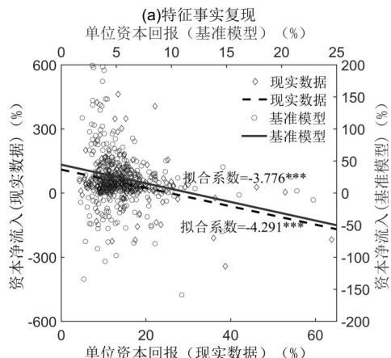

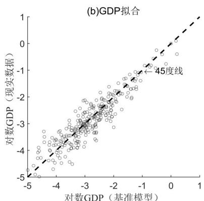  
图 模型匹配度检验

## 重大选题征文

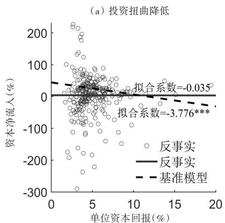

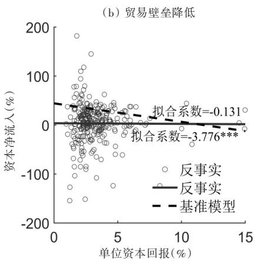

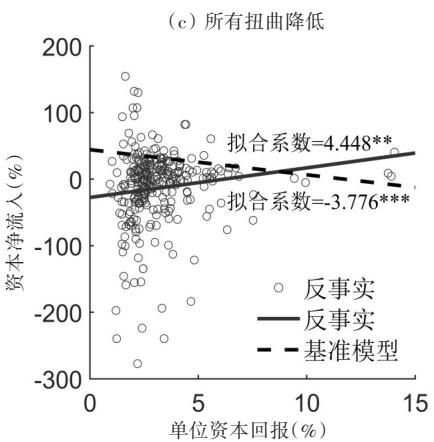  
图4 机制检验——不同扭曲降低对资本空间配置效率的改善  
注：本文通过缩尾剔除极端值的形式对三幅图的相关性进行了稳健性检验，图 （）和图 （ ）反事实模拟的非显著性是稳健的，图 （）反事实模拟的显著正相关关系也是稳健的。

图4（c）中资本的高效配置来自不同渠道阻碍和扭曲的破除，但其只是定性地展示了两个因素的独立和叠加影响，那么不同的扭曲在数量上对资本空间配置效率的影响又是多少？为了进一步从定量的角度测算二者的贡献，表1对其进行了分解。

表 不同摩擦与分割对资本配置

<table><tr><td></td><td>投资扭曲</td><td>贸易壁垒</td><td>交互强化效应</td></tr><tr><td>改善程度</td><td>5.96</td><td>5.18</td><td>1.25</td></tr><tr><td>相对占比</td><td>45.489%</td><td>44.321%</td><td>10.19%</td></tr></table>

注：改善程度衡量方式为图4(a)\~(c)

具体来说，图 $4 \left( \mathrm { a } \right) \sim \left( \mathrm { c } \right)$ 中资本配置效率直接反映为拟合线的斜率，而配 中拟合线斜率与基准模型中斜率的差值。置效率的提升就表现为不同反事实下拟合线斜率相较于基准模型中斜率的差值，因此表1中改善程度反映了拟合线斜率变化的绝对大小，相对占比则是以图 （）中资本有效配置的情况和基准模型中拟合线斜率的差值为参照分别计算图4(a)和图4(b)中反事实斜率与基准斜率的差值相对于该参照的大小。

从表1可以看到，投资扭曲对扭曲的改善效果最大，占比达到了45.5%，说明资本市场体制机制不完善的确是资本空间错配的关键因素，但是值得注意的是国内贸易壁垒降低带来的改善程度占比也高达44.3%与对资本空间配置有直接影响的投资扭曲基本相当，其潜在作用不可谓不大。说明在资本的空间配置效率问题上，资本市场一体化建设虽然起主要作用，但若只考虑资本市场，配置效率的提升空间将被大大压缩，对于错配成因的分解也将缺乏全面性。此外，本文发现两种因素的改善程度小于图 （）中有效配置的情况，说明当不同市场的阻碍同时降低时，得益于生产要素和产品均能较为充分地流动，全国统一大市场建设的潜在收益被进一步激发，因此不同扭曲的改善效应存在交互强化的作用，在本文中这种强化作用约为 。这进一步深化了全国统一大市场建设的政策目标，同时为本文同时关注不同市场扭曲和一体化提供了新的内涵和意义。

## （二）地方政府激励：引资竞争与贸易保护

通过上节分析可知跨地投资扭曲和产品市场分割是影响资本空间配置效率的重要因素，而需要进一步认识的是，这两种因素的根源是地方政府为了吸引外地资本进行的引资竞争和为了保护本地产品而设置的贸易保护。为了直观考察这一现象，本文外生引入地方政府效用函数。参考文献常见做法（赵扶扬， ；吕冰洋、胡深， ），假设地区i的地方政府关心其辖区产出水平（Y）和财政收入（T）：

$$
U _ {i} = \left(\frac {Y _ {i}}{\xi_ {i}}\right) ^ {\xi_ {i}} \left(\frac {T _ {i}}{1 - \xi_ {i}}\right) ^ {1 - \xi_ {i}}\tag{16}
$$

其中，ξ 表示i地政府对当地产出水平的相对重视程度，由各地产出水平与税收收入相对占比计算而来。由于跨地投资扭曲中有很大一部分是不可改变且无关地方政府激励的客观因素（韩佳容，2021），而税收优惠作为地方政府招商引资行为的重要环节，在相关话题中始终受到较多关注且足以充分体现地方政府引资意愿（王凤荣、苗妙，2015；刘穷志，2017）。因此本文为了直观考察地方政府的引资竞争激励，将资本税收优惠从总投资扭曲中分离并在本节中重点讨论。参考唐飞鹏（ ）、郭杰和李涛（ ）的方法，使用企业所得税占地区第二、三产业增加值的比重衡量资本税率。此时跨地投资扭曲由 $\tau _ { i n }$ 和资本税率tk 两部分组成。

那么，地方政府行为是否真的满足其内在激励，其行为本身到底又如何影响资本流动？本节将针对引资竞争和贸易保护行为分别展开模拟。在引资竞争方面，分别将每一个城市的资本税率降低0%\~90%，计算当地地方政府效用，最后对各城市取均值。在贸易保护方面，分别将每一个城市的地区贸易壁垒降低0%\~90%，计算当地地方政府效用，最后对各城市取均值。模拟结果如图5所示。

首先讨论引资竞争行为。从图 （）可以看到地方政府效用随着资本税率的降低呈现出先升后降的倒型趋势其原因在于两个相反作用的叠加：产出水平的增加和税收收入的降低，税率降低会使得该地对资本的吸引力增强，结果是如图 （ ）、图 （）中所反映的外地资本流入和本地产出变多，同时这也挤出了一部分外地产品到本地的销售，说明资本市场分割对产品市场也产生了一定的影响，进一步印证本文多种市场分割是同源而生，不能拆分讨论的观点。而从图 （）也可以看到，在税率降低和税基增加的共同作用下，税收收入表现出降低的趋势，说明通过引资手段吸引来的资本虽然可以提高产出，但不足以抵消税率降低的税收损失。综上，产出和税收的一涨一消共同造就了政府效用的倒U型走向。同时值得注意的是，图5（a）中初始点对应反映现实情况的基准模型，处在最优点的左侧，地方政府效用随税收优惠的变化仍处在上升阶段，因此地方政府有激励进一步设置更强的引资政策，可能带来进一步的资本市场扭曲。

其次关注贸易保护行为。从图5（d）可以看到贸易开放对当地政府效用的作用是明显负面的，贸易开放导致本地的市场进一步被外地产品所占有，且由于我国目前生产地征税的原则，本地政府难以从中获取利益，这成为产品市场分割背后的制度性根源。具体来看，如图5（f）所示，该负面效应来自产出水平和税收收入的下降，而其下降的原因则正是本文认为产品市场分割影响资本配置效率的核心机制：地区间贸易壁垒降低导致企业家失去了来该地投资的动机，面对欠发达地区较低的单位资本回报和较低的贸易成本，企业家会更多地选择通过产品销售的方式进入当地市场，总体资本配置效率由此提高的同时使得该地产出和财政收入大幅下降，该投资与贸易的权衡机制由图5（e）得到了直接验证。

从本部分的模拟可以看到，跨地投资扭曲会影响产品的流动，而产品市场分割对资本的空间配置也有显著影响。因此现实中的资本错配现象一定不是因某一市场不完善而独立存在的，而是由多个市场、多个环节、多个地区的扭曲交织而成。本节和上一节均证明了将产品市场分割和跨地投资扭曲纳入统一的框架下考虑是极具必要性的。

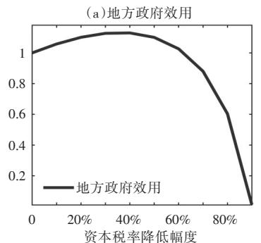

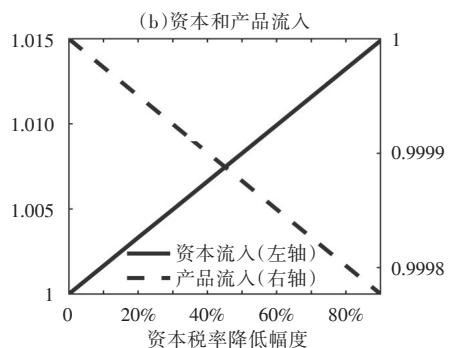

（c）产出水平与财政收入  
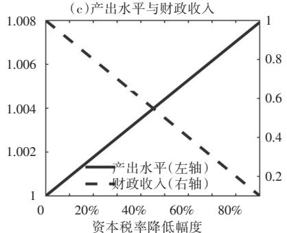

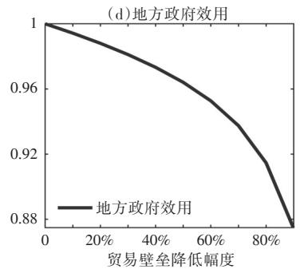

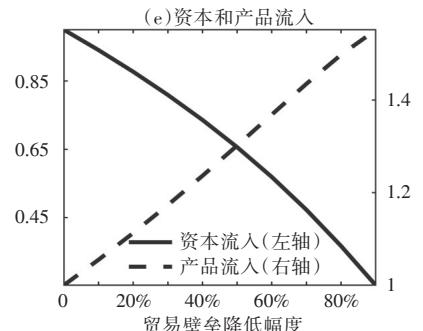  
图 降低资本税率和贸易壁垒的地方政府效用变化

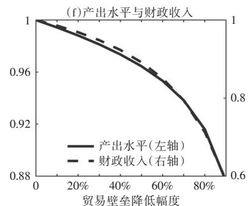  
注：图 中所有图片纵轴单位均为“倍”，即初始点标准化为 时反事实与初始值的相对大小。

重大选题征文

## 六、改善资本空间错配的政策模拟

上一节针对资本空间错配的形成机制已给出清晰的讨论。那么面对资本配置的效率损失，潜在的改善空间有多大？为了实现不同政策目标，又该执行怎样的政策组合？本节将针对跨地投资扭曲和地区贸易壁垒展开一系列政策模拟。本文使用单位资本回报的标准差衡量资本配置效率，使用人均 和人均工资的标准差从区域发展和人均收入两个角度对区域协调发展进行考量。此外，本文还通过不同模拟下地方政府效用函数的变化考察了政策落地受到的潜在阻力⑥。

## （一）地区间资本市场一体化建设的改进效应

为了使政策评估的量化结果具有实际参考价值，需要为参数的调整空间寻找有现实意义的参照系。本节重点关注地区间资本市场一体化建设的政策效应，而由于现有文献中较少将跨地投资决策和投资扭曲纳入量化空间一般均衡框架讨论，因此缺乏文献参考依据。基于此本文从现实出发，选取了两个可比标准来考察降低跨地投资扭曲后的政策效应。第一，本文使用 年的投资矩阵数据反解出 年的跨地投资扭曲矩阵，计算 年每个城市投资扭曲的相对变化并以此作为现实可比标准。第二，省界效应是市场分割的重要表现之一（马草原等，2023），因此本文进行了降低跨地投资省界效应的模拟，分别包括流入和流出的省界效应。模拟结果如表2所示。

观察表2，首先可以看到当τ 按照2013\~2018年的变化为标准进行调整时，实际GDP有所上升，同时资本配置效率也变高，反映出我国要素市场一体化程度进一步完善。其次关注降低省界效应的政策，其同样可以带来效率的提升，且资本流出省界效应的改善作用小于流入的省界效应。最后，缓解省界效应的平均政策效应大于投资扭曲全国调整的政策效应，说明破除省界效应的确是全国统一大市场建设的重要环节之一。

另外还有两个方面需要注意。第一，在区域协调发展方面，现实中资本错配的情况反映在欠发达地区吸引来了更多的资本，因此虽然经济总量上的损失不可避免，但区域间的差距实际上得以缩小。故而当投资扭曲降低时，部分资本流回发达地区，造成欠发达地区的人均GDP和人均工资出现大幅下降，同时发达地区人均收入又会上升，因此资本市场一体化面临着扩大区域分化的潜在困境。第二，在政策落地的地方阻力方面，可以看到各项政策会偏离于地方政府最优激励和行为，即政策的落地目前面临一定的执行阻力。因此，从全局视角来看，要素市场一体化建设意义重大，是统一大市场建设的重要环节，但需要中央与地方做到目标一致、激励相容，才能进一步完善资本的市场化配置机制，释放出更大的经济效率。

## （二）地区间产品市场一体化建设的改进效应

《中共中央 国务院关于加快建设全国统一大市场的意见》中明确指出，要“推进商品和服务市场高水平统一”，充分反映了统一产品市场的基础性作用，本节便重点关注产品市场一体化相关政策。首先关于调整国内贸易壁垒的可靠参照，陈斌开和赵扶扬（2023）发现2002\~2017年我国贸易成本降低了9%，基于汤比和朱（2019）测算的贸易成本，可得到我国2002\~2007年加权平均贸易成本降低超过10%。基于此，本节分别模拟地区间贸易壁垒降低和 的情况。结果如表 所示。

首先从效率提升作用来看，全国贸易成本降低20%会使实际提升约 ，而资本的回报率差异也缩小了约 ，这表明贸易开放有效提高了资本的空间配置效率。此外可以看到贸易放开具有边际递增的政策效应，当壁垒降低程度翻倍时其效率改善的提升大于两倍，产品市场一体化的关键性作用和潜在收益不容忽视。

表 地区间资本市场一体化政策模拟

<table><tr><td rowspan="2"></td><td rowspan="2">以2013~2018年的变化为标准</td><td colspan="2">降低省界效应</td></tr><tr><td>流入效应</td><td>流出效应</td></tr><tr><td>实际GDP</td><td>3.091%</td><td>6.279%</td><td>1.548%</td></tr><tr><td>单位资本回报差异</td><td>-4.798%</td><td>-3.849%</td><td>-14.671%</td></tr><tr><td>人均GDP差异</td><td>4.693%</td><td>22.105%</td><td>11.548%</td></tr><tr><td>人均工资差异</td><td>4.712%</td><td>26.672%</td><td>35.348%</td></tr><tr><td>政策落地的地方阻力</td><td>2.512%</td><td>14.128%</td><td>9.747%</td></tr></table>

注：政策落地阻力表示地方政府效用的GDP补偿（详见注释 ），正数代表存在阻力。

表3 地区间产品市场一体化政策模拟

<table><tr><td></td><td>贸易成本降低10%</td><td>贸易成本降低20%</td></tr><tr><td>实际GDP</td><td>0.679%</td><td>1.572%</td></tr><tr><td>资本有效配置渠道(占比)</td><td>23.564%</td><td>21.755%</td></tr><tr><td>畅通贸易渠道(占比)</td><td>76.436%</td><td>78.245%</td></tr><tr><td>单位资本回报差异</td><td>-2.328%</td><td>-4.990%</td></tr><tr><td>人均GDP差异</td><td>0.515%</td><td>1.071%</td></tr><tr><td>人均工资差异</td><td>1.467%</td><td>3.322%</td></tr><tr><td>政策落地的地方阻力</td><td>-0.032%</td><td>-0.067%</td></tr></table>

注：政策落地阻力表示地方政府效用的 补偿（详见注释 ），正数代表存在阻力。

其次关注对效率提升渠道的分解。经过前文的讨论，产品市场连通带来的效率改善至少有两层含义：第一，产品市场连通会直接影响贸易量大小。第二，产品市场连通会通过放松企业家在投资和贸易之间抉择而提升资本的空间配置效率。表3中所有结果都有这两种机制的共同作用，而本文的结构性框架使得本文可以分解出两种渠道的作用大小。从结果来看，贸易开放通过提升资本配置效率渠道带来的效率改进在总效应中的占比超过 。这说明若不考虑产品市场分割与资本要素市场的交互作用，贸易开放的优化作用至少会被低估20%，这一数字在我国庞大的经济体量下是十分显著且重要的，因此本文对产品市场一体化潜在收益的分析和研判具有重要参考意义。

最后需要着重强调的是，表3最后一行显示全国贸易壁垒降低反而会带来地方阻力的下降，这一结果看似反直觉，但却是符合基本经济逻辑的。事实上，产品市场存在的地方保护主义源于地区间陷入的“囚徒困境”（张宇， ），让某单一地区的保护程度降低相当于该地区在博弈中选择了与个体最优违背的选项，这无疑会带来该区域激励与政策的不协调，正如前文图5（d）所示。然而，从顶层设计的全局角度来看，当全国同时推动产品市场一体化时，各地都会因国内贸易条件的改善而获益，即同时实现了全局最优和个体改善双重结果。这一结果及背后的逻辑揭示了全国统一大市场构建过程中，中央政府顶层设计与地方协调的重要性（陆铭、陈钊，2009）。

## （三）优化资本空间配置的困境及政策的搭配应对

## 1.市场一体化建设与区域协调发展的政策组合

党的二十大报告指出，“深人实施区域协调发展战略”。尽管资本市场和产品市场一体化建设均如前文所述可以释放出较大经济效率，但这并不是政策效应的唯一衡量标准。而生产要素高效配置的同时，潜在问题是此时欠发达地区的资源实质上受到了压缩，造成区域差距扩大。那么是否有合理的政策组合，能统筹兼顾“公平”和“效率”？本小节将在前两小节的基础上，引入促进劳动力同向集聚的政策并重点讨论不同政策的组合搭配效应。

关于人口迁移成本降低的现实参考，基于郝等（2020）测算的人口迁移成本，可得2000\~2015年期间我国人口迁移成本下降约45%；陈斌开和赵扶扬（2023）基于人口普查数据发现15年间我国人口迁移成本下降81.08%，本文保守取值，令人口迁移成本降低50%。

表 展现了各种政策组合下的模拟结果。可以发现相较于独立政策，各类政策组合主要表现出“互补”和“增强”的作用。首先关注本小节要回答的关键问题，即如何通过政策搭配实现“公平”和“效率”的两全。从表中可以看到当促进劳动力同向集聚的政策搭配各种扭曲降低时，都可以有效缩小原本被极化的区域差距，即政策组合之间实现了“互补”，说明劳动力市场一体化的政策可以在提高整体效率的同时兼顾区域协调发展（钟粤俊等， ）。当然，发达地区和欠发达地区的总量差距或许会提升，但人均差距得以缩小才是区域协调发展的核心内涵（国家发改委宏观经济研究院国土开发与地区经济研究所课题组， ）。

其次关注“增强”作用。在各类政策组合下，对 的改进相较于独立政策都有不同程度的放大和叠加。值得强调的是，结合人口自由流动政策时单位资本回报差异会进一步扩大，但这并不代表资本空间配置效率的恶化，恰恰相反，此时人口更多地流向了高生产率地区，这些回报率本就高的地区对资本要素的需求变大所以拉高了资本的回报率，同时欠发达地区的回报率则进一步下降，因此回报率差异扩大，这意味着资本空间配

置效率优化的需求和空间进一步提升，相应政策的迫切性和有效性更强。

## 2.市场一体化建设与克服政策落地阻力的政策组合

除了“效率”与“公平”的兼顾之外，市场一体化建设相关政策与地方政府激励存在的潜在不相容问题也亟待关注。虽然资本空间配置效率具有较大改善空间，但由于引导要素向高效率地区聚集会使得部分地区的经济发展和财政收入受到制约，

表 不同政策组合的模拟结果

<table><tr><td></td><td>投资扭曲降低搭配贸易开放</td><td>投资扭曲降低搭配人口流动</td><td>贸易壁垒降低搭配人口流动</td><td>所有扭曲降低搭配人口流动</td></tr><tr><td>实际GDP</td><td>1.826%</td><td>4.026%</td><td>3.473%</td><td>4.666%</td></tr><tr><td>单位资本回报差异</td><td>-2.612%</td><td>13.730%</td><td>11.453%</td><td>11.293%</td></tr><tr><td>人均GDP差异</td><td>2.644%</td><td>-13.588%</td><td>-14.669%</td><td>-13.238%</td></tr><tr><td>人均工资差异</td><td>1.936%</td><td>-12.399%</td><td>-10.843%</td><td>-10.526%</td></tr><tr><td>政策落地的地方阻力</td><td>0.375%</td><td>14.335%</td><td>13.741%</td><td>14.084%</td></tr></table>

注：政策落地阻力表示地方政府效用的GDP补偿(详见注释 ），正数代表存在阻力。

## 重大选题征文

因此政策执行与地方激励之间存在不协调。党的二十届三中全会上通过了《中共中央关于进一步全面深化改革、推进中国式现代化的决定》，指出要“推进消费税征收环节后移并稳步下划地方”的财税体制深化改革措施。基于此，本文在降低各地区贸易壁垒的基础上，引入消费税征收环节后移的政策。模拟结果见图6。

可以看到，在完全生产地征税的情况下，当我国地区间贸易壁垒降低时，地方政府效用单调下降，这与上文提到的政策潜在执行阻力相对应。当消费税征收从完全生产地征税变为生产地和消费地共享时，政府效用的变化也从单调下降变为先下降后上升的“正U型”曲线，说明此时央地之间的激励已经开始向协调一致转变。最后，在完全消费地征税的情况下，政府效用曲线的上升趋势和上升幅度则更为明显，此时贸易开放是消费地财政收入的有力保障，地方政府会更多地主动选择良好的贸易和消费环境，市场一体化的顶层政策在地方将面临更小的潜在执行阻力。

## 七、结论与建议

长期以来，高速的投资和资本积累是我国建构供给侧基础、拉动内部需求的重要渠道。然而，重视资本规模和资本增量的同时，不能忽视资本配置效率的优化。构建高水平社会主义市场经济体制，实现资源配置效率最优化和效益最大化是党的二十届三中全会精神的重要体现，着眼当前依靠投资规模拉动的传统增长动力出现边际弱化迹象，叠加我国发展面临的外部环境挑战，更应该立足资本配置效率的优化，构建全国统一大市场和高水平社会主义市场经济体制。

本文从空间维度切入，考察资本在地区间的配置效率。首先，本文基于企业工商注册数据，研究发现我国资本在空间上存在“逆回报率流动”的现象，即更多的资本配置在了回报率和生产率较低地区，尽管这在一定程度上缩小了地区差距，但导致了更大的资本配置效率损失。其次，本文构建了一个包含跨地投资决策和多个市场分割的量化空间均衡模型，在统一的理论和量化框架下复现并解释了我国资本空间错配的现象及机制。本文发现，招商引资逻辑下的回报率扭曲是影响资本空间配置的直接原因。同时，由于产品市场分割的存在，企业为避免贸易成本而选择直接在市场所在地投资建厂，共同导致了“资本逆回报率流动”的现象。本文进一步探究了跨地投资扭曲和产品市场分割的成因，发现其与地方政府激励与行为密切相关。最后，本文针对地区间资本市场和产品市场一体化程度的提高及配套政策进行了政策模拟。本文的研究具有三方面潜在政策含义。

第一，构建更加完善的资本跨地区配置的市场化机制，将释放出巨大的增长空间。党的二十届三中全会指出，“聚焦构建高水平社会主义市场经济体制，充分发挥市场在资源配置中的决定性作用”。本文从资本要素配置的视角模拟发现2013\~2018年我国跨地投资摩擦的变化对实际GDP的影响达到了3.09% 而跨地投资的省界壁垒对实际GDP的影响更是高达1.5%\~6.3%。尽管资本要素的配置优化在政策文件中已得到突出强调，如 年《中共中央 国务院关于构建更加完善的要素市场化配置体制机制的意见》或 年《中共中央国务院关于加快建设全国统一大市场的意见》，但应在注重金融资本的行业间、部门间配置的同时，进一步加

强对实物资本及其空间配置效率的重视。实物资本空间流动这一理论概念的现实映射是企业的跨地投资建厂行为，应进一步降低阻碍企业跨地投资建厂的隐性摩擦，在杜绝恶性引资竞争和地方保护的同时，建立并完善统一的产权保护制度、市场准入制度、公平竞争制度，增加支持企业跨地投资的有效金融服务供给和制度保障，从而在统一市场基础制度下突出市场机制在资本跨地配置中的核心作用。

第二，构建全国统一大市场的过程中，应格外重视不同要素市场建设和产品市场建设的系统性、协同性。产品市场分割影响资本空间配置效率是本文的核心结论之一，企业为避免贸易成本而跨地投资，进一步降低了资本的空间配置效率。量化分解发现，跨地投资扭曲和产品市场分割对资本空间错配贡献的占比基本相当，而忽略产品市场与资本市场的交互效应将导致国内贸易开放带来的总体利得被低估约 。同时，本文在政策模拟中发现，仅仅提高资本的空间配置效率将带来“公平”和“效率”的两难决策，需要深化户籍制度改革以促进人口流动，才能实现“公平”和“效率”的统筹兼顾。因此，资本空间配置的优化，需要与全国统一、畅通的产品市场和劳动力市场建设相结合。 年中共中央 国务院发布的《关于加快建设全国统一大市场的意见》将“系统协同，稳妥推进”作为四大工作原则之一，而党的二十届三中全会更加强调全面深化改革的“系统集成”，指出“增强改革系统性、整体性、协同性”。本文则为之提供了新的理论支撑和解读视角。

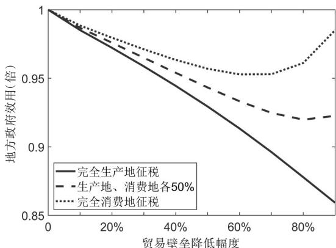  
图 消费税相关政策对地方政府效用的影响

第三，优化资本的空间配置、构建全国统一大市场，需要重视地方政府的激励问题。本文证明，无论是跨地投资扭曲，抑或是产品市场分割，在一定程度上均源自地方政府在经济发展和财税压力下的固有激励。本文进一步发现，资本和产品在地区间的市场化配置，可能在一定程度上降低地方政府效用从而导致政策在地方执行层面面临潜在阻力。因此，破除全国统一大市场的制度障碍，单纯禁止地方保护或引资竞争行为是不够的，更应该加强行政性分权与经济性分权之间的协调，通过深化财税体制改革推动地方政府财权与事权对称化，完善地方官员考核机制以提升地方政府参与全国统一大市场建设的激励相容性。党的二十届三中全会指出，“建立权责清晰、财力协调、区域均衡的中央和地方财政关系”“推进消费税征收环节后移并稳步下划地方”。本文通过政策模拟，验证了消费税征收环节后移政策对地方政府激励及资本和产品市场分割的调节作用。此外，都市圈和城市群建设能够成为促进地方政府间分工合作的一个重要潜在切入点，并将进一步构建跨行政区合作发展新机制，作为优化地方政府激励机制、稳步推进全国统一大市场建设的起点⑦。

（作者单位：中央财经大学经济学院）

## 注释

## 重大选题征文

（6）单豪杰：《中国资本存量K的再估算：1952\~2006年》，《数量经济技术经济研究》，2008年第10期。

（7）付文林、耿强：《税收竞争、经济集聚与地区投资行为》，《经济学（季刊）》，2011年第4期。

（8）盖庆恩、朱喜、程名望、史清华：《要素市场扭曲、垄断势力与全要素生产率》，《经济研究》，2015年第5期。

（9）龚关、胡关亮：《中国制造业资源配置效率与全要素生产率》，《经济研究》，2013年第4期。

(10)郭杰李涛：《中国地方政府间税收竞争研究——基于中国省级面板数据的经验证据》《管理世界》2009年第11期

（11）国家发改委宏观经济研究院国土开发与地区经济研究所课题组：《区域经济发展的几个理论问题》，《宏观经济研究》，2003年第12期。

（12）韩佳容：《中国区域间的制度性贸易成本与贸易福利》，《经济研究》，2021年第9期。

（13）黄先海、杨君、肖明月：《资本深化、技术进步与资本回报率：基于美国的经验分析》，《世界经济》，2012年第9期。

（14）江飞涛、耿强、吕大国、李晓萍：《地区竞争、体制扭曲与产能过剩的形成机理》，《中国工业经济》，2012年第6期。

（15）李力行、黄佩媛、马光荣：《土地资源错配与中国工业企业生产率差异》，《管理世界》，2016年第8期。

（ ）李自若、杨汝岱、黄桂田：《中国省际贸易流量与贸易壁垒研究》，《经济研究》， 年第 期。

（ ）林晨、李宇潇：《全国统一大市场与地方产业政策竞争》，《经济研究》， 年第 期。

（18）刘莉亚、程天笑、关益众、杨金强：《资本管制能够影响国际资本流动吗？》，《经济研究》，2013年第5期。

（ ）刘穷志：《税收竞争、资本外流与投资环境改善——经济增长与收入公平分配并行路径研究》，《经济研究》， 年第 期。

（20）刘仁和、陈英楠、吉晓萌、苏雪锦：《中国的资本回报率：基于q理论的估算》，《经济研究》，2018年第6期。

（21）刘毓芸、严翠欣、陈强远：《信息壁垒与资本空间配置：方言的视角》，《世界经济》，2024年第6期。

（22）刘志彪、孔令池：《从分割走向整合：推进国内统一大市场建设的阻力与对策》，《中国工业经济》，2021年第8期。

（23）陆铭、陈钊：《分割市场的经济增长——为什么经济开放可能加剧地方保护？》，《经济研究》，2009年第3期。

（ ）吕冰洋、胡深：《中国央地财政关系的演进：一个理论框架》，《经济研究》， 年第 期。

（25）马草原、孙思洋、张昭：《中国地区间要素市场分割的识别与影响因素分析》，《金融研究》，2023年第2期。

（26）钱学锋、周文倩：《国内国际双循环对冲“友岸外包”经济成本的效应评估》，《管理世界》，2024年第7期。

（27）唐飞鹏：《省际财政竞争、政府治理能力与企业迁移》，《世界经济》，2016年第10期。

（28）陶然、陆曦、苏福兵、汪晖：《地区竞争格局演变下的中国转轨：财政激励和发展模式反思》，《经济研究》，2009年第7期。

（29）王凤荣、苗妙：《税收竞争、区域环境与资本跨区流动——基于企业异地并购视角的实证研究》，《经济研究》，2015年第2期。

（ ）王延明：《上市公司所得税负担研究——来自规模、地区和行业的经验证据》，《管理世界》， 年第 期。

（31）王一鸣：《中国经济新一轮动力转换与路径选择》，《管理世界》，2017年第2期。

（ ）徐光伟、乔婉容、惠慧：《区域一体化下高铁开通对企业异地投资的影响——基于市场分割的作用机制》，《新经济》， 年第6期。

（33）严兵、肖琬君：《市场分割、异质性与对外直接投资——基于企业层面的考察》，《国际贸易问题》，2018年第10期。

（ ）尹恒、李世刚：《资源配置效率改善的空间有多大？——基于中国制造业的结构估计》，《管理世界》， 年第 期。

（35）张安军、叶彤：《产品市场竞争、财政补贴与资本配置效率》，《财经论丛》，2022年第5期。

（36）张军、吴桂英、张吉鹏：《中国省际物质资本存量估算：1952—2000》，《经济研究》，2004年第10期。

（ ）张宇：《地方保护与经济增长的囚徒困境》，《世界经济》， 年第 期。

（38）赵扶扬、陈斌开、傅春杨：《动态量化空间均衡模型的理论进展与中国应用》，《中国工业经济》，2022年第9期。

（39）赵善梅、吴士炜：《基于空间经济学视角下的我国资本回报率影响因素及其提升路径研究》，《管理世界》，2018年第2期。

（ ）中国人民大学“完善要素市场化配置实施路径和政策举措”课题组、陈彦斌、王兆瑞、于泽、夏晓华、宋扬、杨继东：《要素市场化配置的共性问题与改革总体思路》，《改革》，2020年第7期。

（ ）钟粤俊、奚锡灿、陆铭：《城市间要素配置：空间一般均衡下的结构与增长》，《经济研究》， 年第 期。

（ ）周慧珺、傅春杨、龚六堂：《就业政策如何影响收入分配？——基于量化空间一般均衡模型的理论分析》，《管理世界》，年第1期。

（ ）周慧珺、傅春杨、龚六堂：《人口流动、贸易与财政支出政策的地区性配置》，《中国工业经济》， 年第 期。

（44）朱轶、熊思敏：《财政分权、FDI引资竞争与私人投资挤出——基于中国省际面板数据的经验研究》，《财贸研究》，2009年第4期。

（45）Alca'cer，J. and Delgado，M.，2016，“Spatial Organization of Firms and Location Choices through the Value Chain”，Management Science，vol.62（11），pp.3213\~3234.

（46）Armington，P. S.，1969，“A Theory of Demand for Products Distinguished by Place of Production”，Staff Papers-International Monetary Fund， （ ），

（47）Blonigen，B. A.，2002，“Tariff-jumping Antidumping Duties”，Journal of International Economics，vol.57（1），pp.31\~49.

（48）Brandt，L. and Zhu，X.，2010，“Accounting for China’s Growth”，IZA Discussion Papers，No.4764.

（49）Brandt，L.，Tombe，T. and Zhu，X.，2013，“Factor Market Distortions across Time，Space and Sectors in China”，Review of EconomicDynamics，vol.16（1），pp.39\~58.

（50）Davis，J. S.，Valente，G. and Van Wincoop，E.，2021，“Global Drivers of Gross and Net Capital Flows”，Journal of International Eco⁃nomics，vol.128，pp.103397.

（51）Dollar，D. and Wei，S. J.，2007，“Das（Wasted）Kapital：Firm Ownership and Investment Efficiency in China”，NBER Working Paper，No.13103.

（52）Eaton，J. and Kortum，S.，2002，“Technology，Geography，and Trade”，Econometrica，vol.70（5），pp.1741\~1779.

（53）Eaton，J.，Kortum，S.，Neiman，B. and Romalis，J.，2016，“Trade and the Global Recession”，American Economic Review，vol.106（11），pp.3401\~3438.

（54）Fan，J. and Luo，W.，2019，“Financing Multinationals”，Available at SSRN 3355695.

（55）Fan，J.，Lu，Y. and Luo，W.，2023，“Valuing Domestic Transport Infrastructure：A View From the Route Choice of Exporters”，Re⁃view of Economics and Statistics，vol.105（6），pp.1562\~1579.

（56）Fang，H.，Li，M. and Wu，Z.，2022，“The Downside of Tournament-Style Political Competition：Evidence from China”，Working Paper，University of Pennsylvania.

（57）Hao，T.，Sun，R.，Tombe，T. and Zhu，X.，2020，“The Effect of Migration Policy on Growth，Structural Change，and Regional Inequality in China”，Journal of Monetary Economics，vol.113，pp.112\~134.

（58）Horst，T.，1971，“The Theory of the Multinational Firm：Optimal Behavior under Different Tariff and Tax Rates”，Journal of PoliticalEconomy，vol.79（5），pp.1059\~1072.

（59）Hsieh，C. T. and Klenow，P. J.，2009，“Misallocation and Manufacturing TFP in China and India”，The Quarterly Journal of Econom⁃ics，vol.124（4），pp.1403\~1448.

（60）Huang，Z.，Li，L.，Ma，G. and Xu，L. C.，2017，“Hayek，Local Information，and Commanding Heights：Decentralizing State-Owned En⁃terprises in China”，American Economic Review，vol.107（8），pp.2455\~2478.

（61）Kleinman，B.，Liu，E.，Redding，S. J. and Yogo，M.，2024，“Neoclassical Growth in an Interdependent World”，NBER Working Paper，No.31951.

（62）Kleinman，B.，Liu，E. and Redding，S. J.，2023，“Dynamic Spatial General Equilibrium”，Econometrica，vol.91（2），pp.385\~424.

（63）Lucas，R. E.，1990，“Why Doesn’t Capital Flow From Rich to Poor Countries？”，American Economic Review，vol.80（2），pp.92\~96.

（64）Lucas，R. E.，2000，“Inflation and Welfare”，Econometrica，vol.68（2），pp.247\~274.

（65）Motta，M.，1992，“Multinational Firms and the Tariff-jumping Argument：A Game Theoretic Analysis with Some Unconventional Conclusions”，European Economic Review，vol.36（8），pp.1557\~1571.

（66）Ramondo，N. and Rodríguez-Clare，A.，2013，“Trade，Multinational Production，and the Gains from Openness”，Journal of PoliticalEconomy，vol.121（2），pp.273\~322.

（67）Redding，S. J. and Rossi-Hansberg，E.，2017，“Quantitative Spatial Economics”，Annual Review of Economics，vol.9（1），pp.21\~58.

（68）Song，Z. and Wu，G. L.，2015，“Identifying Capital Misallocation”，Working Paper，University of Chicago.

（69）Song，Z.，Storesletten，K. and Zilibotti，F.，2011，“Growing Like China”，American Economic Review，vol.101（1），pp.196\~233.

（70）Tombe，T. and Zhu，X.，2019，“Trade，Migration，and Productivity：A Quantitative Analysis of China”，American Economic Review，vol.109（5），pp.1843\~1872.

# Cross-regional Investment Distortion, Product Market Segmentation, and the Spatial Allocation Efficiency of Capital: A Study Based on Quantitative Spatial Equilibrium Mode

Zhao Fuyang, Wang Du, Dai Ruochen and Chen Binkai

(School of Ecnomics, Central University of Finance and Economics)

Abstract: The construction of a unified national market requires the simultaneous promotion of the smooth flow of factors and commodities across regions. This paper focuses on the cross-regional flow of capital factors, studies the spatial misallocation phenomenon of "capita flow against the rate of return." from the interactive relationship between cross-regional investment distortion and product market segmentation The paper argues that cross-regional investment distortions under the logic of investment promotion are the direct cause. Further, under the influence of product market segmentation, firms intend to invest and build factories directly in the market location to avoid cross-regional trade costs, leading to additional spatial misallocation of capital. We construct a quantitative spatial equilibrium model which includes cross-regional investment decisions and cross-regional product, capital, and labor markets. We find that the effects of cross-regional investment distortions and product market segmentation on spatial misallocation of capital account for basically equal proportions, and ignoring the interactive effect of product and capital markets will lead to an underestimation of the overall benefits from domestic trade opening by about 20%. The root cause of spatial misallocation of capital is the distorted behaviours of local governments under the economic and fiscal incentives. The polic simulation shows that increasing integration of capital and product markets can effectively mitigate the spatial misallocation of capital and bring about an overall efficiency improvement, but it will also face certain costs and dilemmas. First, the resources of underdeveloped regions are compressed, leading to the widening of regional disparities, which needs to promote homogeneous labor pooling in order to achieve the "equity" and "efficiency" at the same time. Second, the construction of market integration will face potential resistance at the local implementation level while the reform of the fiscal system, such as the transfer of the consumption tax collection link, can promote the incentive compatibility of local governments.

Keywords: cross-regional investment; market segmentation; spatial allocation of capital; quantitative spatial equilibrium model

# Cross-regional Investment Distortion, Product Market Segmentation, and the Spatial Allocation Efficiency of Capital: A Study Based on Quantitative Spatial Equilibrium Model

Zhao Fuyang, Wang Du, Dai Ruochen and Chen Binkai

(School of Ecnomics, Central University of Finance and Economics)

Summary: Our paper examines the relationship between interregional capital flows and return on capital in China based on the full volume of enterprise business registration data, and finds that there is a phenomenon of "capita flow against the rate of return" in China. The paper argues that cross-regional investment distortions under the logic of investment promotion are the direct cause. Further, under the influence of product market segmentation, firms in tend to invest and build factories directly in the market location to avoid cross-regional trade costs, leading to additional spatial misallocation of capital. Market segmentation is due to frictions and distortions set up by local governments through institutional means in order to compete for resources, resulting in the impairment of the market-based allocation mechanism for commodities or factors.

The paper constructs a multi- region quantitative spatial equilibrium model (QSM), innovatively assigns microfoundations to cross-regional investment decision and matches it with the full amount of business registration data, and constructs local government incentives so as to discuss the deeper reasons for the segmentation of different markets. The above framework could replicate and explain the misallocation phenomenon of "capital flow against the rate of return" in China. We further quantitatively decompose the contributions of different factors to the efficiency of spatial allocation of capital. It is found that the distortion of cross-regional investment and product market segmentation have similar contributions on spatial misallocation of capital, and the overall gains from domestic trade liberalization would be underestimated by about 20 percent if the mechanism of interaction between product and capital markets is ignored. The misallocation can be reversed only by promoting the integration of the two markets at the same time. Further, the paper finds that the root cause of spatial capital misallocation is a series of distorted behaviors of loca governments motivated by maximizing the total output and fiscal revenue. Finally, based on policy simulations, we find that the cross-regional investment distortion and the reduction of product market segmentation can effectively alleviate the spatial misallocation of capital and thus bring about the overall efficiency improvement. However, the we also face the dilemma of widening regional disparities and incentives uncoordination with the local government. In order to achieve the "fairness" and "efficiency" at the same time, and to make the incentives of local governments compatible, it is necessary to promote the agglomeration of labor and to induce the backward shifting of the consumption tax collection.

The potential innovations of this paper are as follows. First, in contrast to the traditional quantitative spatial equilibrium literature, which focuses on the labor or land elements, we model the capital element and focus on the spatia allocation efficiency of capital. Second, unlike the direct determination of capital allocation through interest rate wedg es, we portray the flow of capital from source to destination based on the micro-optimal decisions of firms investing across locations. Third, benefiting from the above microfoundations, we can discuss the interaction mechanism between capital and product markets and the decomposition of the improvement effects under a unified theoretica framework. Fourth, we analyze the efficiency-enhancing effects of interregional market integration policies quantitatively, and propose solutions respectively for potential policy dilemmas.

Keywords: cross-regional investment; market segmentation; spatial allocation of capital; quantitative spatial equilibrium model

JEL Classification: C31, E22, R28

## 附录A 特征事实的补充讨论与稳健性检验

## 1.图1处理细节的补充说明以及更换数据时间范围的结果

正文中图 展示了我国资本空间错配的现状与事实，此处对图 中数据处理和指标测算细节进行补充。

（ ）图 （）中地区划分依据是我国六大综合经济区：东北（辽宁省、吉林省、黑龙江省）、东部沿海（北京市、天津市、河北省、山东省、上海市、江苏省、浙江省）、南部沿海（福建省、广东省、海南省）、中部（陕西省、山西省、河南省、内蒙古自治区、湖北省、湖南省、江西省、安徽省）、西南（云南省、贵州省、四川省、重庆市、广西壮族自治区）、西北（甘肃省、青海省、宁夏回族自治区、新疆维吾尔自治区、西藏自治区）。

（ ）图 （）和图 （ ）中“资本净流入”指标数据来源是由北京大学企业大数据中心通过国家市场监督管理总局（原工商总局）数据整理的全国企业工商注册数据。本文将法人股东与工商注册数据基本信息相匹配，从而识别了一个企业作为法人股东的所有投资信息和该法人股东的注册信息（包括注册地址）。对于法人公司或企业，本文按照注册年份、注册地址的行政区划代码进行加总，得到城市对层面的企业投资金额，接着基于上述数据构建不同城市对（city-pair）之间的投资金额。随后，考虑到不同地区经济总量和投资体量不同存在横向不可比因素 因此参考戴维斯等(2021)等文献中的常见做法 将该差值与本地名义GDP相除得到可比的“资本净流入”。对于区域层面数据的计算，是将某区域视为一个整体，将该区域所含城市资本流入和流出数据相加再做差，最后除以区域总GDP计算而来。

（ ）关于单位资本回报，本文的具体衡量方法是各城市（区域）资本报酬与资本存量之比，其中关于资本报酬的测算，常见的方法分两种，分别是从收入法GDP中扣除劳动报酬（钱学锋、周文倩，2024）和在扣除劳动报酬的基础上再将生产税净额按照劳动报酬与资本报酬的比例进行分配（蔡晓陈，2009；赵善梅、吴士炜，2018）。本文模型框架中从GDP中扣除劳动报酬的剩余部分就直接对应着资本报酬，因此为了模型与现实数据的匹配，本文在正文中使用第一种方法进行测算，使用第二种方法进行稳健性检验，具体结果详见《管理世界》网络发行版附录 。

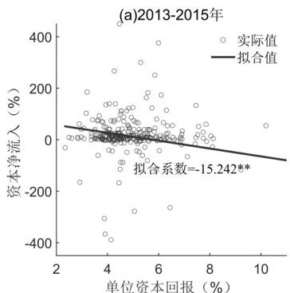

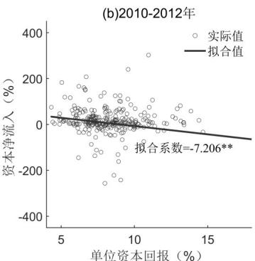  
附图A-A1 我国资本空间错配特征事实的补充

（ ）正文图 的结果是 年、 年和 年数据取平均计算而来，本文同样使用了其他时间段的数据检验了单位资本回报与资本净流入的相关性，如附图A-A1所示。

## 2.针对单位资本回报指标的稳健性检验

本文使用 债券数据库中所有发债企业的财务数据中的总资产报酬率（ ）和投入资本回报率（ ）两项指标作为对特征事实进行检验的替代指标。企业财务口径下的资产回报率剔除了公共基础设施投资的影响，代表性和针对性与本文核心故事更为契合，而在这样的视角下本文的特征事实依旧稳健存在基至更为明显，具体结果如下

附表 基于 和 的特征事实稳健性检验

<table><tr><td rowspan="2"></td><td>(1)</td><td>(2)</td><td>(3)</td><td>(4)</td><td>(5)</td><td>(6)</td><td>(7)</td><td>(8)</td></tr><tr><td>净流入/GDP</td><td>净流入/流入</td><td>净流入/GDP</td><td>净流入/流入</td><td>净流入/GDP</td><td>净流入/流入</td><td>净流入/GDP</td><td>净流入/流入</td></tr><tr><td>ROA</td><td>-0.489***(0.166)</td><td>-0.072***(0.023)</td><td></td><td></td><td>-0.123**(0.053)</td><td>-0.012*(0.007)</td><td></td><td></td></tr><tr><td>ROIC</td><td></td><td></td><td>-0.400***(0.140)</td><td>-0.061***(0.020)</td><td></td><td></td><td>-0.134***(0.044)</td><td>-0.017**(0.007)</td></tr><tr><td>评级AAA</td><td></td><td></td><td></td><td></td><td>2.298**(0.990)</td><td>0.410***(0.136)</td><td>2.290**(0.981)</td><td>0.408***(0.134)</td></tr><tr><td>评级AA+</td><td></td><td></td><td></td><td></td><td>1.618*(0.885)</td><td>0.279**(0.116)</td><td>1.604*(0.870)</td><td>0.275**(0.114)</td></tr><tr><td>非城投</td><td></td><td></td><td></td><td></td><td>-1.829**(0.822)</td><td>-0.301***(0.115)</td><td>-1.782**(0.770)</td><td>-0.288***(0.108)</td></tr><tr><td>常数项</td><td>1.392***(0.466)</td><td>0.221***(0.054)</td><td>1.217**(0.478)</td><td>0.200***(0.058)</td><td>-0.457(1.072)</td><td>-0.104(0.143)</td><td>-0.414(1.016)</td><td>-0.090(0.135)</td></tr><tr><td>N</td><td>3317</td><td>3317</td><td>3317</td><td>3317</td><td>3211</td><td>3211</td><td>3211</td><td>3211</td></tr></table>

注：、 、 分别代表 、 、 的显著性水平；括号中的值为标准误。

附表 展示了资本流动与不同类型资本回报率的实证结果，可以看到无论选取何种资本流动指标，资本流动均与回报率存在显著的负相关关系，说明在企业投资口径下，我国资本空间错配的特征事实依旧存在。

同时考虑到不同地区的企业资质和属性可能存在系统性不同，本文进一步纳入了一系列对于企业性质的控制，一是其发行债券评级（AAA、AA+、AA）作为企业资质的衡量，二是以Wind分类标准区分了城投平台和非城投平台企业，将“是城投平台”取值为0，否则为 。在控制了企业评级和债券性质之后，不同回报率指标和资本流动仍然存在显著的负相关关系，而非城投平台企业对应的和 与资本流入的负相关关系更为明显，说明正文中“资本逆回报率流动”的特征事实仍是稳健的。

## 3.关于资本流动度量方式的稳健性检验

为了进一步强化特征事实，本文同样对不做标准化处理的资本净流入（对数）进行了考察，检验结果如附表 所示。

附表 A-A2 中 log（K）的计算方式是 log[（资本流入-资本流出）/10 亿+1]。本文分别考察了 2010\~2012 年、2013\~2015 年、2016\~2018年 个时间段的平均资本流入和单位资本回报的关系。首先从前 列可以看到，在简单回归中，个阶段的单位资本回报与资本流动均呈现与正文一致的显著负相关关系，且2016\~2018年时期的负相关关系更为明显。

附表 的后 列中控制了城市层面的一系列控制变量，以排除部分未观测因素的影响，包括人口密度（常住人口 占地面积）、政府干预（政府预算支出/GDP）、产业结构（第三产业占比）、专利申请、经济发展（人均GDP），数据来源均为城市统计年鉴。可以看到在控制一系列潜在影响因素之后，资本回报与资本流动的负相关关系依旧存在甚至更为明显，为本文“资本逆回报率流动”的特征事实进一步提供了证据。

附表A-A2 资本流动稳健性检验

<table><tr><td rowspan="2"></td><td>(1)</td><td>(2)</td><td>(3)</td><td>(4)</td><td>(5)</td><td>(6)</td></tr><tr><td> $\log(K_{-}10)$ </td><td> $\log(K_{-}13)$ </td><td> $\log(K_{-}16)$ </td><td> $\log(K_{-}10)$ </td><td> $\log(K_{-}13)$ </td><td> $\log(K_{-}16)$ </td></tr><tr><td>单位资本回报</td><td>-0.006**(0.002)</td><td>-0.011**(0.005)</td><td>-0.061***(0.021)</td><td>-0.008***(0.003)</td><td>-0.011**(0.005)</td><td>-0.075***(0.024)</td></tr><tr><td>人口密度</td><td></td><td></td><td></td><td>YES</td><td>YES</td><td>YES</td></tr><tr><td>政府干预</td><td></td><td></td><td></td><td>YES</td><td>YES</td><td>YES</td></tr><tr><td>产业结构</td><td></td><td></td><td></td><td>YES</td><td>YES</td><td>YES</td></tr><tr><td>专利申请</td><td></td><td></td><td></td><td>YES</td><td>YES</td><td>YES</td></tr><tr><td>经济发展</td><td></td><td></td><td></td><td>YES</td><td>YES</td><td>YES</td></tr><tr><td>常数项</td><td>0.001***(0.000)</td><td>0.001***(0.000)</td><td>0.003***(0.001)</td><td>0.001(0.002)</td><td>-0.007**(0.003)</td><td>-0.020*(0.012)</td></tr><tr><td>N</td><td>277</td><td>277</td><td>277</td><td>277</td><td>277</td><td>277</td></tr></table>

注：、 、 分别代表 、 、 的显著性水平；括号中的值为标准误。

## 4.资本在区域内部的空间错配

本文认为，若资本要素是通过市场化机制有效配置的，回报率高的地区总会有正的资本净流入，与其自有资本存量的多少无关.比如东部地区回报率高时，其内部的资本也应该留在东部，即使由于微观个体异质性因素导致有少量企业家仍旧选择投资到回报率较低的地区，但这部分投资应当会被其余地区流入的资本覆盖。

为了进一步夯实本文特征事实并为上述观点提供证据本文区分了东中西三大板块对各自区域内部的资本配置情况进行了补充考察，如附图 所示。该图展示了东、中、西三大板块内部单位资本回报与资本流动的关系，结合正文图 可以得出结论，我国资本不但在整体层面上呈现出“逆回报率流动”的特征，各区域内部的资本流动也同样与单位资本回报呈负相关关系，其中东部与中部的错配关系基至比西部地区的错配更为严重说明我国资本空间错配并不是由于发达地区资本存量更高从而资本流出难以覆盖资本流入而导致。

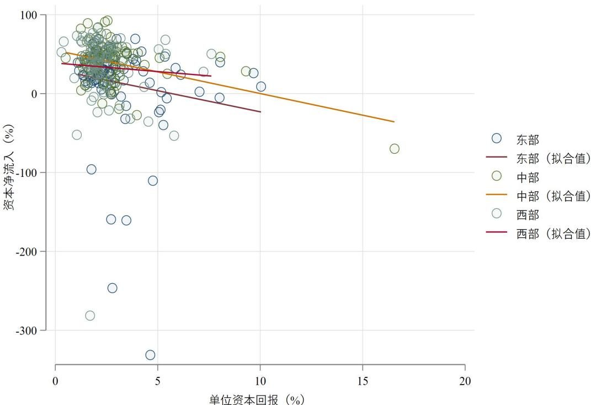  
附图A-A2 东、中、西三大板块内部的资本空间错配

## 附录B 关键结论的证明与推导

1.投资矩阵 $S _ { i n } = \frac { \left( \tau _ { i n } r _ { n } \right) ^ { \kappa } } { \sum _ { m } \left( \tau _ { i m } r _ { m } \right) ^ { \kappa } }$ 的证明

投资决策要求将资本投资到回报率最高的城市，即：

$$
S _ {i n} = \varepsilon_ {i n} (\varphi) \tau_ {i n} r _ {n} \geqslant \max _ {m \neq n} \varepsilon_ {i m} (\varphi) \tau_ {i m} r _ {m}\tag{A-B1}
$$

由于投资笔数足够多，因此只需要满足：

$$
S _ {i n} = \operatorname * {P r} \left[ \varepsilon_ {i n} (\varphi) \tau_ {i n} r _ {n} \geqslant \max _ {m \neq n} \varepsilon_ {i m} (\varphi) \tau_ {i m} r _ {m} \right]\tag{A-B2}
$$

又 $\therefore F ( \varepsilon ) = e x p { \left( - \varepsilon ^ { - \kappa } \right) }$ ，因此有：

$$
P r \left[ \varepsilon_ {i n} (\varphi) \tau_ {i n} r _ {n} \leqslant x \right] = P r \left[ \varepsilon_ {i n} (\varphi) \leqslant \frac {x}{\tau_ {i n} r _ {n}} \right] = e x p \left\{- \left(\frac {x}{\tau_ {i n} r _ {n}}\right) ^ {- \kappa} \right\} = e x p \left\{- \left(\frac {x}{\phi_ {i n}}\right) ^ {- \kappa} \right\}\tag{A-B3}
$$

其中 $\phi _ { { \scriptscriptstyle i n } } = \tau _ { { \scriptscriptstyle i n } } r _ { { \scriptscriptstyle n } }$ 。同理有：

$$
P r \left[ \max _ {m \neq n} \varepsilon_ {i m} (\varphi) \tau_ {i m} r _ {m} \leqslant y \right] = \prod_ {m \neq n} P r \left[ \varepsilon_ {i m} (\varphi) \tau_ {i m} r _ {m} \leqslant y \right] = e x p \left\{- \left(\frac {y}{\Phi_ {i m}}\right) ^ {- \kappa} \right\}\tag{A-B4}
$$

其中 $\begin{array} { r } { \boldsymbol { \hat { P } } _ { i m } = \left[ \sum _ { \boldsymbol { m } \neq \boldsymbol { n } } \left( \boldsymbol { \tau } _ { i m } \boldsymbol { r } _ { m } \right) ^ { \kappa } \right] ^ { 1 / \kappa } } \end{array}$

令 $\begin{array} { r } { \mathbf { \nabla } \cdot \mathbf { \mathcal { E } } _ { i n } ( \varphi ) \tau _ { i n } r _ { n } = X , \operatorname* { m a x } _ { m \neq n } \mathbf { \mathcal { E } } _ { i n } ( \varphi ) \tau _ { i m } r _ { m } = Y } \end{array}$ ，则投资矩阵：

$$
S _ {i n} = \operatorname * {P r} (X \geqslant Y) = \int_ {0} ^ {\infty} \operatorname * {P r} (X \geqslant Y | Y = y) f _ {Y} (y) d y = \int_ {0} ^ {\infty} \operatorname * {P r} (X \geqslant Y) f _ {Y} (y) d y\tag{A-B5}
$$

其中：

$$
f _ {Y} (y) = \frac {d F (Y \leqslant y)}{d y} = \frac {d P r (Y \leqslant y)}{d y} = \kappa y ^ {- 1 - \kappa} \left(\Phi_ {i m}\right) ^ {\kappa} e x p \left\{- \left(\frac {y}{\Phi_ {i m}}\right) ^ {- \kappa} \right\}\tag{A-B6}
$$

以及：

$$
P r (X \geqslant Y) = 1 - e x p \left\{- \left(\frac {x}{\phi_ {i n}}\right) ^ {- \kappa} \right\}\tag{A-B7}
$$

将以上两式带回投资矩阵的表达式有：

$$
S _ {i n} = \int_ {0} ^ {\infty} \left[ 1 - e x p \left\{- \left(\frac {x}{\Phi_ {i n}}\right) ^ {- \kappa} \right\} \right] \kappa y ^ {- 1 - \kappa} \left(\Phi_ {i m}\right) ^ {\kappa} e x p \left\{- \left(\frac {y}{\Phi_ {i m}}\right) ^ {- \kappa} \right\} d y = 1 - \left(\Phi_ {i m}\right) ^ {\kappa} \int_ {0} ^ {\infty} e x p \left\{- \left[ \left(\phi_ {i n}\right) ^ {\kappa} + \left(\Phi_ {i m}\right) ^ {\kappa} \right] y ^ {- \kappa} \right\} \kappa y ^ {- 1 - \kappa} d y\tag{A-B8}
$$

其中：

$$
\left(\Phi_ {i m}\right) ^ {\kappa} \int_ {0} ^ {\infty} \exp \left\{- \left[ \left(\phi_ {i n}\right) ^ {\kappa} + \left(\Phi_ {i m}\right) ^ {\kappa} \right] y ^ {- \kappa} \right\} \kappa y ^ {- 1 - \kappa} d y = - \frac {\left(\Phi_ {i m}\right) ^ {\kappa}}{\left(\Phi_ {i m}\right) ^ {\kappa} + \left(\phi_ {i n}\right) ^ {\kappa}}\tag{A-B9}
$$

则可以证明投资矩阵为：

$$
S _ {i n} = 1 - \frac {\left(\Phi_ {i m}\right) ^ {\kappa}}{\left(\Phi_ {i m}\right) ^ {\kappa} + \left(\phi_ {i n}\right) ^ {\kappa}} = \frac {\left(\tau_ {i n} r _ {n}\right) ^ {\kappa}}{\sum_ {m} \left(\tau_ {i m} r _ {m}\right) ^ {\kappa}}\tag{A-B10}
$$

证毕。

2.平均投资回报率 $\begin{array} { r } { R _ { i } = \Gamma \bigg ( \frac { \kappa - 1 } { \kappa } \bigg ) \big [ \sum _ { n } ( \tau _ { i n } r _ { n } ) ^ { \kappa } \bigg ] ^ { \frac { 1 } { \kappa } } } \end{array}$ 的证明

平均投资回报率R是每笔投资能获得的最大收益率r的期望值，其中r需要满足：

$$
\operatorname * {P r} \left(\max _ {n} \left\{\varepsilon_ {i n} (\varphi) \tau_ {i n} r _ {n} \right\} <   r\right) = \prod_ {n} \operatorname * {P r} \left[ \varepsilon_ {i n} (\varphi) \tau_ {i n} r _ {n} <   r \right] = \prod_ {n} \operatorname * {P r} \left[ - \left(\frac {r}{\tau_ {i n} r _ {n}}\right) ^ {- \kappa} \right]\tag{A-B11}
$$

$$
\mathrm{令} \varPsi_ {n} = \left[ \sum_ {n} \left(\tau_ {i n} r _ {n}\right) ^ {\kappa} \right] ^ {1 / \kappa}
$$

则有：

$$
P r \left(\max _ {n} \left\{\varepsilon_ {i n} (\varphi) \tau_ {i n} r _ {n} \right\} <   r\right) = e x p \left\{- \left(\frac {r}{\Psi_ {n}}\right) ^ {- \kappa} \right\}\tag{A-B12}
$$

即r的分布函数为：

$$
F (r) = \operatorname * {P r} \left(\max _ {n} \left\{\varepsilon_ {i n} (\varphi) \tau_ {i n} r _ {n} \right\} <   r\right) = \exp \left\{- \left(\frac {r}{\Psi_ {n}}\right) ^ {- \kappa} \right\}\tag{A-B13}
$$

因此平均投资回报率R为：

$$
R _ {i} = E (r) = \Gamma \left(\frac {\kappa - 1}{\kappa}\right) \Psi_ {n} = \Gamma \left(\frac {\kappa - 1}{\kappa}\right) \left[ \sum_ {n} \left(\tau_ {i n} r _ {n}\right) ^ {\kappa} \right] ^ {\frac {1}{\kappa}}\tag{A-B14}
$$

证毕。

## 附录C 对模型校准的稳健性检验

## 1.更换资本报酬衡量方式的稳健性检验

虽然本文正文中所用方法与本文模型和故事较为匹配，且具备相当的文献基础。但同时，也有很多文献使用其他衡量方法计算资本报酬，目前常见的是将“收入法 —劳动报酬—劳动报酬比例 生产税净额”作为资本报酬（蔡晓陈， ；赵善梅、吴士炜，2018）。基于此方法，本文使用城市层面多地区投入产出表重新计算了资本报酬和单位资本回报，由于城市层面收入法的GDP核算并没有官方数据，本次稳健性检验的数据来源是清华大学CEADs中国碳核算数据库（https://www.ceads.net.cn/）中的2017年城市层面多地区投入产出表。对本文核心结论稳健性检验的结果如附图A-C1所示。

附图 展示了重新计算资本报酬与单位资本回报，重新校准模型并进行机制检验的结果。与正文中一致，附图 $\mathrm { A { - } C l \left( a \right) { \sim } \left( c \right) }$ 分别展示了将投资扭曲和国内贸易壁垒降低一半以及二者同时进行时，资本净流入与单位资本回报的关系，其中红色虚线是基准模型中的情况。

首先可以看到的是，更换资本报酬计算方式后校准的基准模型仍然可以较好地复刻“资本逆回报率流动”的特征事实，反映在红色虚线即基准模型，资本净流入与单位资本回报呈显著负相关关系。

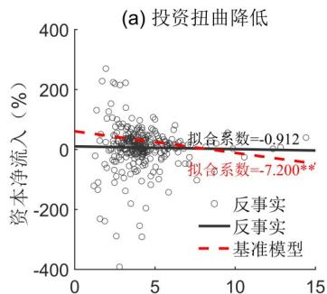  
单位资本回报（%）

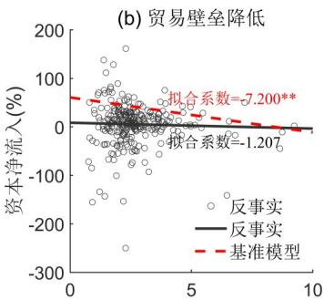  
单位资本回报(%)

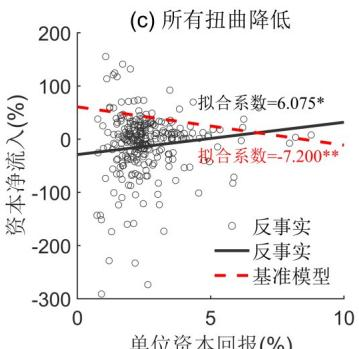  
单位资本回报(%)  
附图A-C1 更换资本报酬衡量方式的稳健性检验——不同扭曲降低对资本配置效率的改善

其次在机制分解上可以看到当投资扭曲或地区间贸易壁垒单个降低后资本的空间配置效率得到了一定程度的优化虽然单位资本回报与资本净流入仍然保持负相关但统计上不再显著，说明这两种扭曲的确是资本空间错配的重要成因，本文核心结论依旧稳健存在。最后当两种扭曲同时降低时资本流向与回报率呈显著的正相关关系 资本要素按照市场化机制有效配置资本空间错配的现象得以消除。

附表 不同摩擦与分割对资本配置效率改善的分解（替换资本报酬）

<table><tr><td></td><td>投资扭曲</td><td>贸易壁垒</td><td>交互强化效应</td></tr><tr><td>改善程度</td><td>6.288</td><td>5.993</td><td>0.994</td></tr><tr><td>相对占比</td><td>47.367%</td><td>45.145%</td><td>7.488%</td></tr></table>

注·改善程度衡量方式为附图 $\mathrm { A { - } C l \left( a \right) { \sim } \left( c \right) }$ 中拟合线斜率与基准模型中斜率的差值

除此之外，本文同样计算了不同扭曲对资本空间错配在定量上的改善程度，如附表A-C1所示，结果与正文依旧保持一致。

## 2.更换贸易弹性取值的稳健性检验

虽然绝大多数文献在使用 方法研究国内问题时将贸易弹性取值设定为 ，但也有部分文献尤其是关注城市层面问题的文献采用了与本文不同的值，因此为了进一步巩固本文研究结论并强化模型的适用性，除了正文中所用值4之外，本文也分别将贸易弹性设定为 （韩佳容， ）和 （樊等， ），重新校准模型后针对本文核心结论开展稳健性检验，结果如下所示。

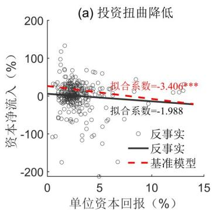

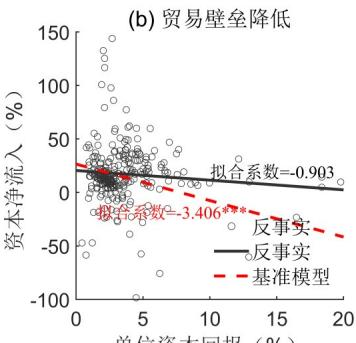

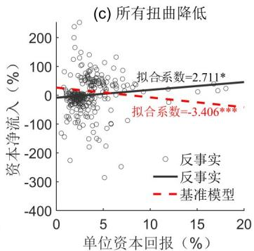  
附图A-C2 θ取2的稳健性检验——不同扭曲降低对资本空间配置效率的改善

附图A-C2和附图A-C3分别是将贸易弹性设定为2和6时，重新校准模型并重新求解后本文的机制分解图。可以看到当贸易弹性取值发生变化时，本文的核心结论仍然没有改变：投资扭曲和贸易壁垒的单个降低仍然可以缓解资本空间错配的现状，但完全扭转资本逆回报率流动需要资本市场和产品市场同时实现高效的市场化配置机制。

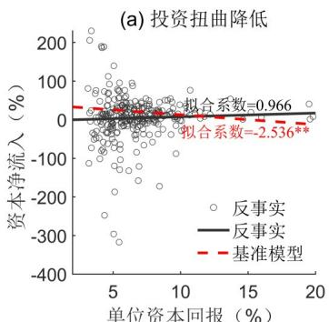

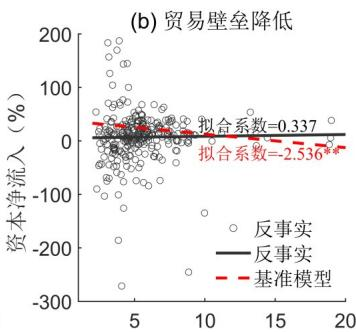

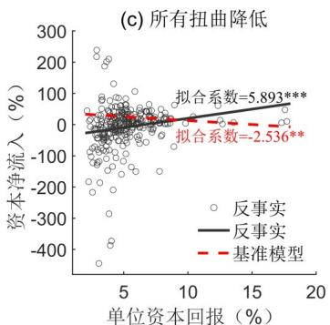  
附图 θ取 的稳健性检验——不同扭曲降低对资本空间配置效率的改善

本文同样基于机制分解图定量计算了贸易弹性改变后不同因素对资本配置效率改善的贡献大小和占比。附表A-C2和附表A-分别是贸易弹性取 和取 时的计算结果，分别对应于附图 和附图 。

附表A-C2 不同摩擦与分割对资本配置效率改善的分解（θ=2）

<table><tr><td></td><td>投资扭曲</td><td>贸易壁垒</td><td>交互强化效应</td></tr><tr><td>改善程度</td><td>1.418</td><td>2.503</td><td>2.196</td></tr><tr><td>相对占比</td><td>23.181%</td><td>40.919%</td><td>35.900%</td></tr></table>

注：改善程度衡量方式为附图A-C2（a）\~（c）中拟合线斜率与基准模型中斜率的差值。

从两个分解结果中可以看出，贸易弹性的大小对两种扭曲改善资本配置效率的定量效果影响不大，当贸易弹性较小时贸易壁垒的贡献程度更多，反之则投资扭曲的贡献度更大，但这都对本文核心结论即二者都是造成资本空间错配的重要因素没有根本影响，仍然凸显了将不同市场扭曲和分割纳入统一的框架下考虑的必要性和合理性。

附表A-C3 不同摩擦与分割对资本配置效率改善的分解（θ=6）

<table><tr><td></td><td>投资扭曲</td><td>贸易壁垒</td><td>交互强化效应</td></tr><tr><td>改善程度</td><td>3.502</td><td>2.873</td><td>2.054</td></tr><tr><td>相对占比</td><td>41.547%</td><td>34.085%</td><td>24.368%</td></tr></table>

注：改善程度衡量方式为附图 $\mathrm { A - C } 3 \left( \mathrm { a } \right) \sim \left( \mathrm { c } \right)$ ）中拟合线斜率与基准模型中斜率的差值。

## 附录D 投资弹性的估计

本文对投资弹性κ进行实证估计的结果如附表A-D1。考虑到双向固定效应并不能完全解决内生性问题，本文首先使用源头地到目的地之间的地理距离作为投资扭曲的代理变量，此时v 便不再需要控制。之后分别使用地理上相邻城市的平均单位资本回报、以全国单位资本回报增长率计算的Bartik IV和外部城市距离加权的平均单位资本回报作为工具变量进行估计，回归结果如附表A-所示，可以看到估计结果分布在 之间，且主要集中在 之间，综合考虑取κ为 。

附表A-D1 投资弹性κ估计

<table><tr><td rowspan="3"></td><td colspan="2">OLS</td><td colspan="6">IV</td></tr><tr><td colspan="2"></td><td colspan="2">Neibor</td><td colspan="2">Bartik IV</td><td colspan="2">External</td></tr><tr><td>(1)</td><td>(2)</td><td>(3)</td><td>(4)</td><td>(5)</td><td>(6)</td><td>(7)</td><td>(8)</td></tr><tr><td>单位资本回报</td><td>0.916***(0.031)</td><td>1.331***(0.093)</td><td>0.965***(0.066)</td><td>1.766***(0.254)</td><td>0.562***(0.033)</td><td>1.399***(0.129)</td><td>1.199***(0.059)</td><td>2.090***(0.210)</td></tr><tr><td>源头地—目的地距离</td><td>-0.834***(0.008)</td><td></td><td>-0.835***(0.008)</td><td></td><td>-0.830***(0.008)</td><td></td><td>-0.837***(0.008)</td><td></td></tr><tr><td>源头地—时间固定效应</td><td>Yes</td><td>Yes</td><td>Yes</td><td>Yes</td><td>Yes</td><td>Yes</td><td>Yes</td><td>Yes</td></tr><tr><td>源头地—目的地固定效应</td><td>No</td><td>Yes</td><td>No</td><td>Yes</td><td>No</td><td>Yes</td><td>No</td><td>Yes</td></tr><tr><td colspan="9">First-stage</td></tr><tr><td>Neibor</td><td></td><td></td><td>0.594***(0.005)</td><td>0.467***(0.008)</td><td></td><td></td><td></td><td></td></tr><tr><td>Bartik</td><td></td><td></td><td></td><td></td><td>1.053***(0.002)</td><td>1.182***(0.008)</td><td></td><td></td></tr><tr><td>External</td><td></td><td></td><td></td><td></td><td></td><td></td><td>0.743***(0.006)</td><td>0.669***(0.010)</td></tr><tr><td>N</td><td>46485</td><td>33817</td><td>46485</td><td>33817</td><td>46485</td><td>33817</td><td>46263</td><td>33681</td></tr></table>

注：\*、\*\*、\*\*\*分别代表10%、5%、1%的显著性水平；括号中的值为标准误。

## 附录E 剔除跨行业投资的稳健性检验

本文所用全国企业工商注册数据包括了成立企业之时所投入的资金数额、资金来源地、投资目的地、行业信息等，正文中所使用的“投资矩阵”并未区分投资所成立企业的行业信息。但是在跨地投资中由于政府管控，定点帮扶等其他不可观测因素企业家有可能在外地投资建厂但从事的是自己非本职行业，这种跨行业的投资可能并不只是为了单纯的跨地生产销售，可能会对本文机制产生较大影响。

基于以上考虑，本文进一步剔除了跨行业投资的数据以对本文主要结果进行稳健性检验。具体来说，本文识别了企业家某笔投资和他上一笔投资的行业代码，保留行业代码一位数相同的投资数据以获得剔除跨行业投资的投资矩阵。

附图A-E1是剔除跨行业投资之后的资本空间错配特征事实和机制检验。首先附图A-E1（a）与初稿引言中的图1（b）相对应，可以看到，即便剔除跨行业投资，资本流动与单位资本回报依旧存在显著的负相关关系，“资本逆回报率流动”的特征事实依旧稳健。其次，附图 （ ）（ ）是进一步使用同行业投资的数据进行的降低各种扭曲的机制检验，结果与正文中类似，单个扭曲的降低都可以有效化解资本空间错配现象，而彻底的扭转需要不同市场一体化的同步推进和大力建设。

综上，在剔除可能会对本文机制和主要结果造成影响的跨行业投资数据之后，本文特征事实、核心机制以及量化结果均与正文保持一致，说明本文的研究结论具有一定稳健性①。

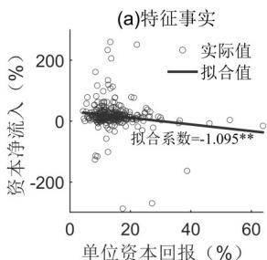

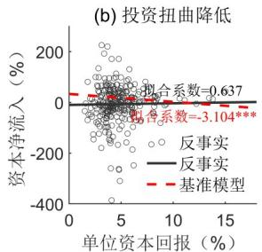

(c)贸易壁垒降低  
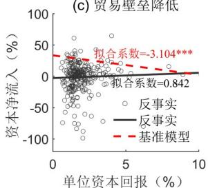

(d) 所有扭曲降低  
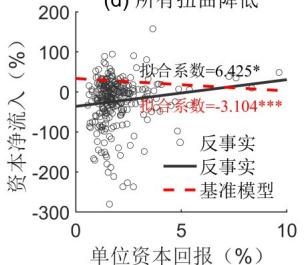  
附图 基于行业内投资数据的特征事实与机制检验

## 注释

①中外文人名（机构名）对照：戴维斯（Davis）；樊（Fan）。

## 参考文献

（1）蔡晓陈：《中国资本投入：1978\~2007——基于年龄—效率剖面的测量》，《管理世界》，2009年第11期。

（ ）韩佳容：《中国区域间的制度性贸易成本与贸易福利》，《经济研究》， 年第 期。

（3）钱学锋、周文倩：《国内国际双循环对冲“友岸外包”经济成本的效应评估》，《管理世界》，2024年第7期。

（4）赵善梅、吴士炜：《基于空间经济学视角下的我国资本回报率影响因素及其提升路径研究》，《管理世界》，2018年第2期。

（5）Davis，J. S.，Valente，G. and Van Wincoop，E.，2021，“Global Drivers of Gross and Net Capital Flows”，Journal of International Eco⁃nomics，vol.128，p.103397.

（6）Fan，J.，Lu，Y. and Luo，W.，2023，“Valuing Domestic Transport Infrastructure：A View From the Route Choice of Exporters”，Review of Economics and Statistics，vol.105，pp.1562\~1579.