# 公共支出区域均等化政策效果的定量评估

——基于量化空间一般均衡模型的分析

周慧珺　龚六堂

摘要：本文构建包含人口流动和异质性居民偏好的量化空间一般均衡模型，模拟并分析了区域财政支出均等化政策的定量效果。研究表明，各地区人均生产性支出均等化将带来产出提升和福利改进，而社会保障性支出的完全均等化则会带来更大幅度的福利改善和小幅产出回落。在逐步提高生产性支出均等化程度的过程中，社会总福利的改善程度将不断上升，产出的改善程度则先增加后下降；在逐步提高社会保障性支出均等化程度的过程中，福利的改善幅度和产出的下降幅度均会越来越大。因此，当政策目标越偏向于居民福利时，越倾向于保障各项支出的区域间均等化，政策目标越偏向于经济产出时，则越偏向于保持大城市的高公共支出水平。

关键词：人口流动　要素配置　财政支出均等化　政府目标

## 一、引言

党的十九大报告中首次明确指出，中国经济已经从高速增长阶段转向高质量发展阶段。①与此同时，发展不平衡、不充分的问题仍然突出，社会主要矛盾逐渐转化为人民日益增长的美好生活需要和不平衡不充分的发展之间的矛盾。其中，最重要的不平衡、不充分问题之一就是区域发展的不均衡。国家统计局数据显示，近年来北京市人均GDP已达到20万元，部分欠发达地区人均GDP还在4万到5万元的量级上、差距超过4倍。这样的差异还体现在经济的方方面面：产业结构，全融可及性。研发投入、人力资本、公共服务、基础设施，等等。不均衡的空间增长格局俨然成为中国经济发展进程中的重要特点，也逐渐成为制约未来经济发展和社会稳定的重要因素。为此，党和国家先后出台了一系列政策举措以优化区域布局，缩小区域差距，其中一项关键举措就是地区财政支出的倾向性配置。党的二十届三中全会明确指出，到2035年，要聚焦提高人民生活品质，健全社会保障体系，增强基本公共服务均衡性和可及性，推动全体人民共同富裕取得更为明显的实质性进展。②这一目标充分体现了我国政府积极运用财政政策调节区域发展的信心和决心，也为未来一段时间财政政策的制定指明了方向。当通过增加转移支付等方式，提高欠发达地区的人均财政支出水平时，当地居民生活质量固然可以得到改善但中央总财力是有限的发达地区得到的财政支持降低经济增速可能放缓，整个社会的经济总产出和总福利可能下降。那么，公共支出的倾向性配置是否有利于整体经济的发展及居民福利的改善？又能够起到多大的定量作用？财政支出包括社会保障、交通运输等多种类型，不同类型的支出对于经济的影响渠道和大小有所不同。那么，支出配置到哪一类型上效果更好？不同类型支出之间如何实现优化配置？这些问题还缺乏系统性的理论研究。

为了回答上述问题，本文构建包含地区间人口流动和异质性个体偏好的量化空间一般均衡模型，模拟财政支出的均等化政策给区域经济和福利带来的影响。这一模型框架的优势在于可以将地区异质性的禀赋及地区间的要素流动纳入同一框架中。具体而言，如果各个地区相互独立，那么政策的效果等于各个地区效果的加总财政支出的配置也就只需要单独考虑各地区的情况·反之如果各地区人口、资本等完全无摩擦流动，那么政策实施于任何一个地区，其影响都会通过要素流动分散到其他所有地区，最终达到的政策效果也是相同的。遗憾的是，现实情况远比这两种极端情况复杂，单个地区政策的效果会通过人口流动和贸易往来溢出到其他地区，最终的整体效果与地区间要素流动及其摩擦息息相关。因此，在多地区模型下，本文可以更好地匹配现实情况，得到更准确可靠的结果。不仅如此，这一模型还可以得到政策实施后各地区劳动力数量、工资水平和经济体量等的变化，而这也将为政策作用机制分析打下良好的基础。

从文献角度来说，这一模型建立在两组文献的基础上。第一支文献在一个包含居民异质性偏好的量化空间一般均衡模型框架下展开。这一模型框架的优势在于可以将地区异质性的禀赋及地区间的要素流动纳入同一框架中，更好地匹配现实情况，得到更准确可靠的结果。在这支文献中，Desmet& Rossi-Hansberg（2013）开创性地引入了异质性居民效用的模型设定，并将城市规模分布的决定因素定量分解为效率、宜居程度和摩擦。Moretti（2013）进一步引入住房市场，认为住房需求同工资、便利设施一样，是居民选择居住地时需要考虑的重要因素之一。此后，越来越多的研究者们开始利用这一模型框架讨论地区间要素配置等因素给整体经济带来的定量影响（Hsieh & Klenow，2009）。例如， （ ）研究发现，区位差异可以解释美国可观察的居民收入空间分布的 。Behrens et al（. 2017）则讨论了美国城市内部的通勤摩擦及跨地区货物运输的贸易摩擦对美国城市规模、生产效率和居民福利的影响，发现在2007年的美国，空间摩擦给城市规模带来的影响其实是有限的。Bryan & Morten（2019）同样利用该模型框架解释1976年之后印度尼西亚劳动生产率的变化及其与美国的差距来源。结果表明，人力资本的空间配置和大城市宜居程度的改善对该国劳动生产率的提高存在显著影响，消除所有障碍能够让劳动生产率提高22%。Hsieh & Moretti（2019）基于美国220个都市地区数据的测算发现，土地供给的限制使得1964-2009年美国经济增长率下降36%。国内文献对地区间要素流动和空间错配的关注度在近几年集中上升，如王丽莉和乔雪（2020）发现，我国2000年的流动人口数量贡献了11.1%的产出增长，而此后五年人口迁移成本的下降则让经济效率提高4%。段巍等(2020)的核算结果则表明2000—2017年中国城镇居民的福利变动可以分解为生产效率等四类，其中生产效率贡献率最高。其他国内研究还包括梁婧等（2015）、刘修岩和李松林（ ）、赵扶扬和陈斌开（ ）等。这些研究较多集中于要素错配本身带来的影响，针对实际政策问题的研究还较少。从这一角度看，本文以财政政策为出发点和落脚点，定量估计现行政策的实施效果，具有一定的理论贡献。

另一支和本文密切相关的文献主要研究地区性公共支出政策及其影响。在这支文献中，大量研究致力于利用实证策略考察政策对经济社会的综合影响。例如夏怡然和陆铭（2015）通过劳动力流动的微观数据实证检验了基本公共服务均等化和劳动力流向的关系，发现基本公共服务均等化能够避免劳动力向大城市的高度集聚但作用系数小于工资水平 张睿等(2018)则表明基础设施建设支出能够有效提高企业生产效率。韩峰和李玉双（2019）基于工业企业数据库和城市层面数据研究了我国不同类型公共服务供给对城市人口规模的影响，发现公共服务支出不仅能提高当地及周边地区的人口规模还能和产业集聚形成协同效应 除此之外周颖刚等(2019)发现公共服务对国内高房价存在负向的调节作用。缪小林和张蓉（2022）则基于CGSS数据发现，民生服务、交通运输等支出会影响居民的充分性和平衡性感知。杨晓军和陈浩（2020）分解得到了城乡基本公共服务均等化的区域差异及来源，发现总体差异仍在波动中上升。类似的研究还包括李华和董艳玲（2020）、王志刚和黎恩银（2022）、姚东旻等（2024）等。由于制度背景差异，国外文献中公共支出均等化政策的相关研究较少，更多是对地区偏向性政策的研究。如Ehrlich & Seidel（2018）则通过德国的一项自然实验发现，临时性的地区性转移支付也能对德国经济活动及其空间格局产生持续性影响。其他相关研究还包括 Turner et al（. 2014）、Berger & Enflo（2017）等。

不难看出，这些研究大多使用实证分析方法，且更多聚焦于支出政策对当地经济的影响效应或对周边地区经济的外溢效应，较少讨论涉及多地区的支出配置对整体经济的影响。仅有Fajgelbaumet al（. 2019）通过包含美国税收制度特征的空间一般均衡模型确定了抹平州税率对整体经济的影响，（ ）基于欧洲各国数据评估了多种转移支付政策对生产率的影响弹性。此外，Kline & Moretti（2014）也估计了地区异质性的财政支出乘数，但更集中于转移支付本身的作用，没有引入政策对生产效率和效用的影响。类似研究还包括Albouy（2012）、Albouy et al（. 2019）等。周慧珺等（2022）是和本文联系较紧密的文献，这一研究在量化空间模型的理论框架下给出了单个地区支出政策对整体经济的影响渠道，并定量分析了影响弹性中直接效应和溢出效应的比例。但由于致力于理论机制分析和直接效应-外溢效应的区分，他们并没有引入支出的均等化政策及其经济效应。总体而言对于中国政策影响弹性和政策成效估计的研究仍相对缺乏 本文也将试图从这一点入手使用多地区的框架模拟地区性财政政策的整体经济效果，探索其随政策实施程度的变化。

本文从定量的角度模拟公共支出均等化政策带来的产出提升、福利改善和对不平等改进。研究贡献体现在以下三点：第一，在量化空间一般均衡模型下引入了中国特有的制度和政策，给出了财政支出配置对区域经济及整体经济的影响弹性及其作用机制；第二，模拟了公共支出的均等化带来的影响，从理论角度阐述了公共支出均等化在实现经济稳步提升、人民生活水平提高及收入差距缩小的多元化目标中发挥的作用及其随均等化程度的变化；第三，区分了不同类型财政支出政策对经济变量影响的差异，为后续涉及范围更广、更持续的政策实施提供了有益的理论依据。

## 二、典型化事实

从空间分布看，我国各地区人均财政支出、人均GDP等经济指标的分布始终较为分散，说明区域间不均衡的问题一直存在，地区异质性仍然是我国经济发展和财政配置格局的重要特点。具体而言，本文主要考察两大类财政支出，一类是经济生产相关支出，包括交通运输等，一类是社会保障相关支出，包括社会保障与就业支出和住房保障支出。这两大类支出在财政支出中均占比较高，但影响经济的渠道和方法却大不相同，前者主要通过提高生产技术和加大企业优惠政策力度等渠道影响经济产出，通过增加就业人员工资等渠道影响居民生活，后者则主要通过提升社会保障水平提高居民福利，通过影响就业间接影响当地经济产出。从空间分布看，两类支出的地区差异均非常强，人均支出最高的省份支出比最低的省份高出数倍，两类支出的地域分布亦有所差异，东部发达省份和西部欠发达地区的人均生产性支出均较高（前者得益于自身经济发展水平的循环拉动，后者则得益于较大力度的政策支持和较低的人口密度），内陆中部地区人均生产性支出则较低，人均社会保障性支出的地域分布一度表现出东低西高，南低北高的特点。这两点均说明，在财政政策的制定中，两类支出均需要考虑地区间的差异，且考虑的重点和方向并不相同，需要仔细甄别和区分对待。

本文研究的另一重要现实背景是人口的跨地区流动。随着户籍制度的放开和交通、通讯便利程度的上升，越来越多居民开始根据生活质量和经济收入等选择自己的居住地。从1%人口抽样数据中各省份居住人口中非本地户籍人口的比重和各省份人均GDP水平的空间分布可以看出东部发达地区的非本地户籍人口比例明显较高，北京等特大城市的人户分离比例达六成以上。近年来，随着人口流动的摩擦下降，各个地区的联系更加紧密，人才吸引力的竞争更加激烈，而人口的流入流出也引发了各地企业招工、技术创新、物价、房价等一系列经济变量的连锁反应，最终形成各地区经济$\vec { \cal J } ^ { \pm }$ 出和居民福利的空间分布格局。不仅如此，各省份经济发展程度及居民生活水平表现出和流动人口比例类似的分布特征，流入人口越多的地区经济发展水平和居民消费也越高。正因如此，在各个地区政策的制定中，人力资本的去留成为至关重要的因素，这也是本文使用量化空间一般均衡模型来研究地区政策配置及其成效的理由。

## 三、模型设定

本文基于 Desmet & Rossi-Hansberg（2013）、Tombe & Zhu（2019）及 Blouri & Ehrlich（2020）的标准框架构建包含异质性个体和地区间人口流动的量化空间一般均衡模型，并在模型中引入政府的土地收益及地区异质性的财政支出水平。具体来说，本文假设整个经济体中有Q个地区，共有Nˉ 个工人，每个工人具有异质性的区位偏好，并根据其区位偏好和各个地区的客观经济条件自由选择居住地。每个地区的生产部门包括代表性房地产商和代表性非房地产商，房地产商使用劳动、资本和住宅用地作为投入要素生产不可贸易的房产，非房地产商使用劳动、资本、工业用地及中间品作为投入要素生产可贸易品。政府部门收入来自税收和土地使用权的出让，财政支出包括生产性支出和社会保障性支出；前者主要用于提高生产技术，后者则主要用于提升当地的社会保障水平。

## （一）居民异质性偏好

居民根据自身偏好、地区的生活成本等因素选择工作和居住地。在地区i居住的居民的效用由地域偏好、当地政府提供的福利水平和消费（非房产消费和房产消费）决定，假设效用函数形式为：

$$
U _ {i} = \varphi_ {i} (l) V _ {i} = \varphi_ {i} (l) g _ {i} ^ {\theta_ {W}} \left[ \left(\frac {c _ {i} ^ {H} (l)}{\theta_ {H}}\right) ^ {\theta_ {H}} \left(\frac {c _ {i} ^ {M} (l)}{\theta_ {M}}\right) ^ {\theta_ {M}} \right] ^ {1 - \theta_ {W}}, i = 1, 2, 3, \dots , Q\tag{1}
$$

其中， $, c _ { i } ^ { M } ( l )$ 和 $c _ { i } ^ { H } ( l )$ 分别表示地区i居民l的非房产消费和房产消费， $g _ { i }$ 代表当地政府提供的福利水平。参数 $\theta _ { H }$ 和 $\theta _ { M }$ 分别表示居民对于房地产消费和非房产消费的相对关注程度， $\theta _ { w }$ 表示居民消费与政府提供的福利水平的重要程度。 $\varphi _ { i } ( l )$ 代表居民l区位选择时的异质性偏好，服从独立且相同的 Frechet 分布：

$$
F (x) = \exp (- \sum_ {i = 1} ^ {Q} x _ {i} ^ {- \kappa})\tag{2}
$$

其中，形状参数 $\kappa$ 代表人口迁移弹性，刻画了居民偏好的同质性程度，κ越大说明居民对于各个地区主观偏好的同质性越强，客观因素（如地区工资、福利水平等）对于区位选择的边际影响越大。假设地区i政府提供的福利水平 $g _ { i }$ 由该地区社会保障性财政支出的大小与当地人口密集程度决定：

$$
g _ {i} = \frac {G _ {i} ^ {S}}{N _ {i} ^ {\chi_ {w}}}, i = 1, 2, 3, \dots , Q\tag{3}
$$

其中， $G _ { i } ^ { S }$ 是地区i的社会保障性财政支出，如就业补助等， $N _ { i }$ 是地区i的人口数量，参数 $\chi _ { W }$ 决定人口集聚对于公共品提供的影响弹性。 $\chi _ { \scriptscriptstyle W } = 1$ 说明该公共物品是竞争性的，即人口密度越高，人均福利水平越低 $\mathsf { \Omega } ; \chi _ { W } > 1$ 说明人口密度的上升会给人均福利水平带来负外部性，使得每个人获得的福利之和小于政府付出的实际总支出；反之， $\chi _ { \scriptscriptstyle W } \in ( 0 ,$ 1)则意味着人均福利受人口密度的干扰较小，每个人获得的福利之和大于政府总支出水平 ${ \mathfrak { s } } \chi _ { w } = 0$ 说明该公共物品完全没有排他性和竞争性，人均公共支出不受当地人口数量的影响。

在预算约束下，地区i的居民选择房产消费和非房产消费来最大化自己的效用，得到间接效用函数V，然后基于间接效用最大化选择居住地。在总人口数量不变的情况下，每个地区的人口比例由

当地间接效用水平的相对大小来决定，即：

$$
\theta_ {i} = \frac {V _ {i} ^ {\kappa}}{\sum_ {i} V _ {i} ^ {\kappa}} = g _ {i} ^ {\kappa \theta_ {w}} \left[ \frac {(1 - \tau_ {i} ^ {\omega}) \omega_ {i}}{(1 + \tau_ {i} ^ {C}) ^ {\theta_ {M}} (P _ {i} ^ {H}) ^ {\theta_ {H}}} \right] ^ {\kappa (1 - \theta_ {w})} / \sum_ {i} g _ {i} ^ {\kappa \theta_ {w}} \left[ \frac {(1 - \tau_ {i} ^ {\omega}) \omega_ {i}}{(1 + \tau_ {i} ^ {C}) ^ {\theta_ {M}} (P _ {i} ^ {H}) ^ {\theta_ {H}}} \right] ^ {\kappa (1 - \theta_ {w})}\tag{4}
$$

其中， $V _ { i }$ 代表间接效用， $\omega _ { i }$ 表示工资水平， $P _ { i } ^ { H }$ 表示房价水平， $\tau _ { i } ^ { \omega }$ 和 $\tau _ { i } ^ { C }$ 分别表示居民所面临的收入税和消费税税率。从上式中不难看出，地区工资水平和房价水平直接影响间接效用，工资水平越高、房价越低的地区越容易受到居民的青睐。同时，因为社会保障性公共财政支出影响了每个地区提供的公共福利水平，所以社会保障性支出越高的地区，能够吸引的人口比例也越大。

## （二）技术与企业部门结构

为了体现房地产在我国经济中的重要作用，更准确刻画我国地方政府的财政来源，本文假设每个地区有两类企业，分别为房地产企业（记为H）和非房地产企业（记为M）。假设房地产企业以资本、劳动和住宅用地作为生产要素，生产同质性的房地产产品，房产仅供当地居民消费，不可跨地区贸易。非房地产企业以资本、劳动、工业用地和中间品作为生产要素，生产可贸易品供所有地区居民消费。两类企业的生产函数都为Cobb-Douglas形式：

$$
Q _ {i} ^ {J} = A _ {i} ^ {J} \left(\frac {K _ {i} ^ {J}}{\alpha_ {J}}\right) ^ {\alpha_ {J}} \left(\frac {N _ {i} ^ {J}}{\beta_ {J}}\right) ^ {\beta_ {J}} \left(\gamma_ {J} L _ {i} ^ {J}\right) ^ {\gamma_ {J}} \left(\frac {I _ {i} ^ {J}}{\eta_ {J}}\right) ^ {\eta_ {J}}, J = H, M\tag{5}
$$

其中， $, A _ { i } ^ { J }$ 表示地区i的房地产企业 $\scriptstyle ( J = H )$ 和非房地产企业 $( J { = } M )$ 的技术， $K _ { i } ^ { J } , N _ { i } ^ { J }$ 和LJ分别表示地区i两类企业的资本、劳动和土地要素， $\alpha _ { J \setminus \beta _ { J } }$ 和 $\gamma _ { J }$ 分别表示三种要素的收入份额，I为中间品投入，η 代表中间品的收入份额，在房地产企业中设为0。此外，对于非房地产企业，为了促进区域发展，各地政府在不同程度上动用财政支出，以交通运输、金融监管等多种形式为当地企业的高质量、高效率生产保驾护航。假设非房地产企业的技术是地方政府生产性财政支出 $G _ { i } ^ { M }$ 的函数，即：

$$
A _ {i} ^ {M} = \bar {A} _ {i} ^ {M} (G _ {i} ^ {M}) ^ {\mu_ {M}}\tag{6}
$$

其中， ${ \bf \nabla } \cdot { \boldsymbol { \mu } } _ { M }$ 代表政府支出对于生 $\vec { J } ^ { \pm }$ 效率的提升弹性。简单而不失一般性地，假设房地 $\vec { J } ^ { \pm }$ 企业的全要素生 $\vec { \cal J } ^ { \pm }$ 率为常数。最终消费品由Q个地区的非房地产企业生产的消费品以CES形式复合：

$$
Q ^ {M} = \left[ \sum_ {i = 1} ^ {Q} (Q _ {i} ^ {M}) ^ {\frac {\sigma - 1}{\sigma}} \right] ^ {\frac {\sigma}{\sigma - 1}}
$$

（7）

其中， $, \sigma$ 代表每个地区非房地产部门产品的替代弹性。为简单起见，假设复合产品 $Q ^ { M }$ 的价格 $P ^ { M }$ 单位化为1。

## （三）政府部门

一般来说，各地区的财政支出政策主要由当地地方政府决定，其大小受到地方财力高低的影响。但与此同时由央政府也可以通过转移支付等多种形式影响地方财政收支、很多地方政府 尤其是西部欠发达省份的政府总支出构成中，相当比例的部分依赖于中央转移支付，这意味着中央政府的政策调控在均衡地方财力和区域发展方面发挥着重要作用①鉴于此本文假设中央政府可以进行地区间支出调控其财政收入一方面来源于企业和居民部门税收包括增值税企业所得税和个人所得税；另一方面来源于土地出让收入，包括住宅用地和工业用地出让收入，即：

$$
R e v e n u e = \sum_ {i = 1} ^ {Q} \binom{P _ {i} ^ {L M} L _ {i} ^ {M} + P _ {i} ^ {L H} L _ {i} ^ {H} + \tau_ {R i} ^ {M} P _ {i} ^ {M} Q _ {i} ^ {M} + \tau_ {R i} ^ {H} P _ {i} ^ {H} Q _ {i} ^ {H}}{+ \tau_ {V i} ^ {M} P _ {i} ^ {M} Q _ {i} ^ {M} - \tau_ {V i} ^ {M} I _ {i} ^ {M} + \tau_ {V i} ^ {H} P _ {i} ^ {H} Q _ {i} ^ {H} + \tau_ {i} ^ {\omega} \omega_ {i} N _ {i} + \tau_ {i} ^ {C} C _ {i} ^ {M}}\tag{8}
$$

其中， $\mathbf { \nabla } cdot P _ { i } ^ { L H }$ 和 $P _ { i } ^ { L M }$ 分别代表住宅用地和工业用地价格， $P _ { i } ^ { M }$ 代表当地消费品价格， $\omega _ { i }$ 代表工资水平， $C _ { i } ^ { M } { = } N _ { i } c _ { i } ^ { M } ( { \boldsymbol { l } } ~ ;$ )代表该地区的一般消费品总量， $\tau _ { R i } ^ { M }$ 和τM分别表示非房地产企业的所得税和增值税税率， $\tau _ { R i } ^ { H }$ 和 $\tau _ { V i } ^ { H }$ 则分别表示房地产企业的所得税和增值税税率， $\tau _ { i } ^ { \omega }$ 表示居民部门所得税税率，τC代表居民部门消费税税率。财政支出用于各个地区的社会保障性支出 $G _ { i } ^ { S }$ 和生产性支出 $G _ { i } ^ { M } ,$ 。事实上，这一假设类似于先将政府部门分为中央和地方两级政府，中央政府主要通过转移支付的方式向地方提供额外财政收入，实现区域协调发展。这一设定基本符合我国两级政府职能分配的现实情况，且也可以得到和上述模型类似的结果。

## （四）市场均衡

在市场均衡的条件下，各地区的人口数量 $N _ { i } , \vec { J } ^ { E }$ 品的价格 $\{ P _ { i } ^ { M } , P _ { i } ^ { H } , P _ { i } ^ { L M } , P _ { i } ^ { L H } , \omega _ { i } , r \}$ 和 $\vec { J } ^ { \pm }$ 品的数量 $\{ Q _ { i } ^ { M } , Q _ { i } ^ { H } , c _ { i } ^ { M } ( \mathit { l } ) , c _ { i } ^ { H } ( \mathit { l } ) , K _ { i } ^ { M } , K _ { i } ^ { H } , I _ { i } ^ { M } , G _ { i } ^ { s } , G _ { i } ^ { M } \}$ }满足：居民的效用最优化条件；代表性房地产企业和非房地产企业的利润最大化条件；政府部门的预算约束；劳动力市场、房地产市场、产品市场和资本市场出清。

## 四、理论机制分析

劳动力的跨地区流动是地区间联系的重要纽带，因此，本文以劳动力市场的地区配置为基础，考察均衡条件下政策调整对地区和整体经济变量带来的边际影响。结合居民和两类企业的最优化条件可以得到劳动力的供给和需求弹性，式（9）给出了地区i劳动力供给数量的工资弹性：

$$
\varepsilon_ {S} = \frac {\partial \ln N _ {i}}{\partial \ln \omega_ {i}} = \rho_ {\omega} ^ {S} - \rho_ {\omega} ^ {S} \theta_ {i}\tag{9}
$$

其中，

$$
\rho_ {\omega} ^ {S} = \frac {\kappa [ 1 - (1 - \alpha_ {H}) \theta_ {H} ] (1 - \theta_ {W})}{1 + \kappa [ \gamma_ {H} \theta_ {H} (1 - \theta_ {W}) + \theta_ {W} (\chi_ {W} - 1) ]}\tag{10}
$$

从式（9）给出的弹性可知：一方面，弹性系数可以分为两个部分，第一部分只与人口迁移弹性、房地产部门的要素份额等参数有关，与地区差异无关，表示地区工资水平上升对地区劳动力数量改变带来的直接效应；第二部分和第一部分效应方向相反，且与当地劳动力数量成正比，表示空间均衡带来的间接效应。当某一地区工资水平上升时，该地区的人才吸引力上升，其他地区劳动力数量下降，其他地区工资水平随之上升，这一效应称为溢出效应，其通过劳动力、资本和商品市场的区域间流动影响当地的劳动力数量，形成与人口比例相关的间接影响。另一方面，劳动力供给的工资弹性系数 $\rho _ { \omega } ^ { S }$ 仅与居民部门、房地产企业部门的系数有关，而与非房地产企业部门无关。当人口迁移弹性越大时，代表地区间的可替代性越强，当地工资水平对于居住地选择的影响效果也越大。此外，人们对于个人消费的相对关注程度越高，工资弹性也越高。同理，劳动力的需求弹性也可以划分为直接效用和间接效应且系数 $\rho _ { \omega } ^ { D }$ 仅与非房地产企业的要素收入份额和不同地区商品的替代弹性相关。①其他的地区异质性因素，如税收、土地和生产技术等对于劳动力供给和需求的弹性也与式（9）类似，其中，住宅用地、房地产部门的技术等通过供给侧影响劳动力市场均衡，进而影响均衡下的劳动力数量，工业用地、非房地产部门技术等则通过需求侧影响劳动力市场均衡。

紧接着，考虑政府财政支出对劳动力的影响，分别记 $\xi _ { i } ^ { M } = G _ { i } ^ { M } / N _ { i }$ 和 $\xi _ { i } ^ { S } = G _ { i } ^ { S } / N _ { i }$ 为人均政府生 $\vec { \cal J } ^ { \pm }$ 性公共支出和社会保障性公共支出，其中， $\xi _ { i } ^ { S }$ 通过劳动力供给影响均衡， $\boldsymbol { \xi } _ { i } ^ { M }$ 通过改变劳动力需求影响均衡。式（11）给出 $\overline { { \textbf { J } } } \xi _ { i } ^ { S }$ 对均衡下劳动力数量的影响：①

$$
\frac {\partial \ln N _ {j}}{\partial \ln \xi_ {i} ^ {S}} = \left\{ \begin{array}{l} \frac {\rho_ {T} ^ {S} \rho_ {\omega} ^ {D}}{\underbrace {\rho_ {\omega} ^ {S} + \rho_ {\omega} ^ {D}} _ {\text {直接效应}}} - \frac {\rho_ {T} ^ {S} \rho_ {\omega} ^ {D}}{\underbrace {\rho_ {\omega} ^ {S} + \rho_ {\omega} ^ {D}} _ {\text {间接效应}}} \theta_ {i}, i f j = i \\ - \frac {\rho_ {T} ^ {S} \rho_ {\omega} ^ {D}}{\underbrace {\rho_ {\omega} ^ {S} + \rho_ {\omega} ^ {D}} _ {\text {间接效应}}} \theta_ {i}, i f j \neq i \end{array} \right.\tag{11}
$$

从式（11）中不难看出，地区i的人均社会保障性财政支出的上升同样给当地劳动力数量带来直接效应和间接效应，并通过要素流动和贸易往来溢出至各个地区。财政支出政策最终会通过劳动力市场影响产出和居民福利，因此，本文进一步分析产出和福利如何受财政支出的影响及同一政策对于两者影响的差异。在一般均衡下：②

$$
\frac {\partial \ln \Lambda}{\partial \ln \xi_ {i} ^ {\vartheta}} = \rho_ {Q} ^ {\Lambda} \frac {\rho_ {Q} ^ {\vartheta}}{\rho_ {\omega} ^ {S} + \rho_ {\omega} ^ {D}} \frac {G D P _ {i}}{G D P} + \rho_ {N} ^ {\Lambda} \frac {\rho_ {N} ^ {\vartheta}}{\rho_ {\omega} ^ {S} + \rho_ {\omega} ^ {D}} \frac {N _ {i}}{N}\tag{12}
$$

其中， $\vartheta = M$ 代表生产性支出， $\vartheta = S$ 代表社会保障性支出， $\varLambda = Y = G D P$ 代表最终产出对应的系数， $\varLambda = W = W e l f a r e$ 代表居民福利对应的系数。可以看出，两类支出对总产出和福利的影响均取决于当地的GDP份额及人口占比，地区GDP份额越高，人口比例越大，一单位支出提升带来的总产出和福利边际提升也越大。

式（12）还表明：第一，同一政策对产出和福利的边际影响 $\mathcal { A } \mathrm { n } Y / \mathcal { A } \mathrm { n } \xi _ { i } ^ { \circ }$ 和 $\mathcal { A } \mathrm { n } W / \mathcal { A } \mathrm { n } \xi _ { i } ^ { \circ }$ 不同，差异主要来源于两者与 GDP份额、人口份额的相关程度。政策对产出的边际效果受 GDP份额的影响取决于非房地产部门的产业结构及地区消费结构，受人口占比的影响取决于非房地产部门产业结构和社会保障性支出的外部性大小，而政策对福利的边际效果则取决于房地产部门的产业结构。这是因为地区产出取决于可贸易品部门，也就是非房地产部门，而福利更多地考虑居民的生活成本，包括房价水平、收入水平等，所以更多地取决于房地产部门。第二，对于相同的政策目标（总产出或居民福利），不同政策的影响效果 $\mathcal { A } { \mathrm { n } } A / \partial \mathrm { l n } \xi _ { i } ^ { M }$ 和 $\partial \mathrm { l n } { \cal A } / \partial \mathrm { l n } \xi _ { i } ^ { S }$ 也有所不同，这是因为不同政策对均衡结果的影响渠道不同，社会保障性支出主要通过劳动供给，生产性支出主要通过劳动需求影响产出和福利。

对于政府而言，经济发展水平和居民生活幸福感，即产出和福利都是重要的政策目标，不同政府或在经济发展的不同时期，政府目标的侧重点往往会有所不同。为此，假设中央政府的政策目标 $U _ { g }$ 中同时包含整体GDP水平和社会总福利，其中 $\phi$ 代表对GDP的关注权重。此时求解模型得，地区的人均最优财政支出满足

$$
\xi_ {i} ^ {\vartheta *} = s _ {W} ^ {\vartheta} \frac {G D P _ {i} / N _ {i}}{G D P / N} \frac {E}{N} + s _ {N} ^ {\vartheta} \frac {E}{N}\tag{13}
$$

其中， $\vartheta = M$ 代表生产性支出，ϑ= S代表社会保障性支出， $E / N$ 代表整个经济体的人均财政支

$$
\begin{array}{l} \text {①} \rho_ {T} ^ {S} = \frac {\kappa \theta_ {W}}{1 + \kappa [ \gamma_ {H} \theta_ {H} (1 - \theta_ {W}) + \theta_ {W} (\chi_ {W} - 1) ] ^ {\circ}} \\ \text {②} \rho_ {Q} ^ {Y} = \frac {\frac {\sigma}{\sigma - 1} - \eta_ {M} - \alpha_ {M}}{\alpha_ {M} + \eta_ {M}}, \rho_ {N} ^ {Y} = \frac {\frac {1}{\sigma - 1} + \eta_ {M} + \alpha_ {M}}{\alpha_ {M} + \eta_ {M}}, \rho_ {Q} ^ {W} = \frac {1 - \theta_ {W}}{\alpha_ {M} + \eta_ {M}} \frac {[ 1 - \theta_ {H} (1 - \alpha_ {H}) ]}{\sigma - 1}, \\ \rho_ {N} ^ {W} = \frac {1}{\kappa} + [ \gamma_ {H} \theta_ {H} + \frac {\gamma_ {M} - \mu_ {M}}{\alpha_ {M} + \eta_ {M}} (1 - \theta_ {H} + \theta_ {H} \alpha_ {H}) ] (1 - \theta_ {W}) + (\chi_ {W} - 1) \theta_ {W}, \\ \rho_ {T} ^ {D} = \frac {\mu_ {M} (\sigma - 1)}{(\gamma_ {M} - \mu_ {M}) (\sigma - 1) + 1}, \rho_ {Q} ^ {M} = \rho_ {T} ^ {D} (1 + \rho_ {\omega} ^ {S}), \rho_ {N} ^ {M} = \rho_ {T} ^ {S} (\rho_ {\omega} ^ {D} - 1), \rho_ {Q} ^ {S} = \rho_ {T} ^ {D} \rho_ {\omega} ^ {S}, \rho_ {N} ^ {S} = \rho_ {T} ^ {S} \rho_ {\omega} ^ {D}. \end{array}
$$

出，( GDPi Ni ) ( GDP N )表示当地人均 GDP 份额，sϑW 和 sϑN是和权重 $\phi$ 相关的系数。①式（13）也表明，每个地区的最优支出政策的确与全国人均财政支出紧密相关，其一部分取决于人均财政支出，另一部分取决于地区i的人均GDP份额。当sϑ 远大于 $\boldsymbol { s } _ { \scriptscriptstyle W } ^ { \vartheta }$ 时，最优政策为每个地区人均财政支出的完全均等化；当 $\boldsymbol { s } _ { \scriptscriptstyle W } ^ { \vartheta }$ 远大于 $\boldsymbol { s } _ { N } ^ { \vartheta }$ 时，最优政策则需要更多地考虑地区经济发展水平差异。系数分析表明：

$$
\frac {s _ {W} ^ {S}}{s _ {N} ^ {S}} > \frac {s _ {W} ^ {M}}{s _ {N} ^ {M}} > 0\tag{14}
$$

也就是说，相比于生产性支出，最优社会保障性支出更偏向于均等化。此外，值得强调的是，人均GDP份额和人口比例等都是内生于人均财政支出的变量，因此，式（13）并不是最优人均支出的显式表达，仅仅是为本文数值模拟提供了更为明确的方向，即各地区的最优人均支出同时决定于整体经济的人均支出及当地的经济发展水平，财政支出均等化也可能不是能实现政府目标最大化的方式。随着均等化程度的加深，政府目标函数到底会如何变化并无法直接得出，还有待在实际数据的背景下进一步探索。

## 五、数值模拟

## （一）参数校准与模型估计

在进行反事实模拟之前，本文先校准数值模拟所需的一系列参数。根据历年《中国统计年鉴》、部门投入产出表及文献的常用取值，本文将房地产部门的资本、劳动和土地要素份额分别设为0.3、0.4和 0.3，非房地产部门的资本、劳动和土地要素份额分别设为 0.2、0.2和 0.02，中间品份额设为0.58。根据历年国家统计年鉴的居民支出比例，将 $\theta _ { M }$ 设为 $0 . 8 , \theta _ { H }$ 设为 $0 . 2 , \theta _ { w }$ 设为0.1。许多文献估计过非房地产企业产品的替代弹性 $\sigma _ { \circ }$ 例如，Bernard et al（. 2003）使用美国企业层面数据将替代弹性估计为 3.6，Anderson & van Wincoop（2003）将其取为 5，Arkolakis et al（. 2012）认为这一参数在 4\~5之间，Simonovska & Waugh（2014）利用跨国数据将替代弹性设定为 $4 \phantom { . }$ 此外，聚焦于中国问题的Tombe & Zhu（2019）和周慧珺等（2022）均将取值选取在4。因此，本文将该弹性取值为4。此外，人口迁移弹性 κ 参考 Tombe & Zhu（2019）和周慧珺等（2022）设为 1.462。根据 Fajgelbaum et al（. 2019）的参数设定，社会保障支出投入的竞争程度 $\chi _ { W }$ 设为 1。参考 Blouri & Ehrlich（2020）的参数设定，政府支出对于非房地产企业全要素生产率的提升效率 $\nu _ { M }$ 设为0.006。参考周慧珺等（2022）的设定，模型中的社会保障性支出对应为社会保障和就业支出和住房保障支出的总和，生产性支出对应为城乡社区事务、资源勘探电力信息等事务、交通运输、节能环保、商业服务业、金融监管等的总和。

## （二）基于反事实模拟的政策评估

## 1. 人均财政支出均等化政策的定量评估

本部分在整体经济财政总支出不变的情况下模拟人均财政支出均等化配置的情况，分析此时总体产出、福利和不平等程度的变化。图1（a）给出了人均生产性支出变化对平均工资水平和地区人口数量的影响。其中，横轴代表人均支出变化的相对幅度，纵轴代表地区经济变量变化的相对幅度，实线表示人均生产性支出的变化与平均工资水平的关系，虚线表示人均生产性支出的变化与当地人口数量的关系。从图中可以看出：第一，随着人均生产性支出的增加，当地平均工资水平和劳动力数量都会不断上升。这是因为生产性财政支出的上升直接提升了该地区的技术水平，使得单位劳动力的边际产出上升，工资水平增加。在当地福利水平、房价水平均不发生变化的前提下，工资水平的增加提高了居民在该地区居住的间接效用，进而提升了地区的人才吸引力。因此，工资水平上升的同时，当地劳动力数量也随之增加。第二，财政支出对工资水平和劳动力的边际影响递减，即随着财政支出提升幅度的增大，工资和劳动力数量提升速度在逐渐下降。也就是说，生产性财政支出每下降1%带来的当地工资下降幅度总是大于其每上升1%带来的当地工资上升幅度。这是因为财政支出下降的地区原有财政支出往往较高，相同的变化百分比意味着更大的变化量，且这些地区的生产技术也更高，降低支出带来的实际损失也更大。第三，实线和虚线都不会过（0，0）点，这意味着即使存在一个地区，其原来的生产性财政支出水平恰好在总体平均水平上，本身财政支出不发生任何变化，该地区的工资水平、劳动力数量也不是毫无变化。这是因为在空间均衡模型的设定下，所有其他地区财政支出变化的影响都会通过劳动力市场的流动溢出到该地区，进而改变该地区的人口和工资。图1（b）给出了生产性支出变化对于经济产出和福利的影响。可以看出，随着财政支出的上升，产出和福利水平均有上升趋势，且由于生产性财政支出先直接影响生产部门，提高产出，产出的变化弹性总是高于福利即同样幅度的支出变化带来的产出变化通常要比福利变化更加剧烈。

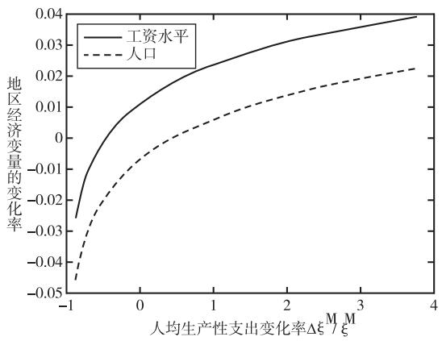

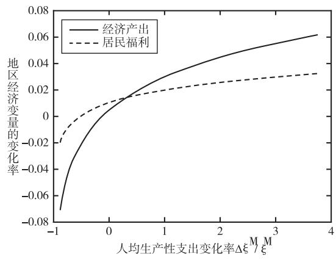  
(b)

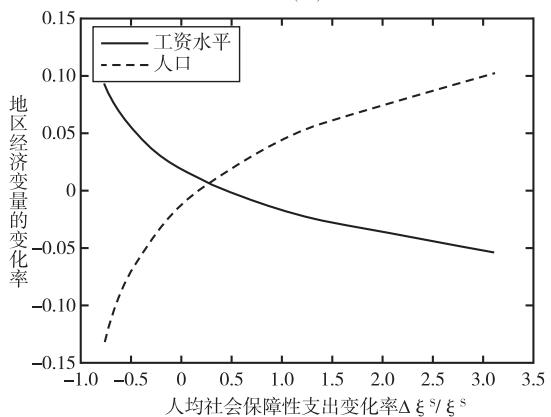

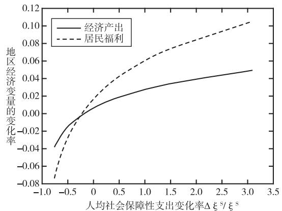  
(d)  
图1　人均支出变化对当地经济变量的影响

图1（c）给出了人均社会保障性财政支出对工资水平和人口变化的影响。不难看出，随着社会保障性财政支出的增加，当地人口数量上升，工资水平则不断下降。这是因为此时地区人均福利水平提高，居民间接效用提升，人才吸引力增加。这一效果传导到生产部门后，则会带来劳动力供给的上升和均衡工资的下降。同时，这也说明，当地区社保资金非常充裕，完全可以为居民提供合意的效用水平时，人们将可以接受较低的劳动收入。换句话说，从福利的角度出发，即使工资下降，人们的生活质量和效用水平也未必会降低。图 1（d）报告了地区经济产出和福利的变化趋势，由于当社会保障性支出增加时，人口的增加幅度大于工资的下降幅度，因此，最终产出变化与支出变化仍表现为正相关关系。与人均生产性支出不同的是，此时财政支出的变化率先影响福利，而后才传导至生产部门，导致生产总值变化，因此，福利的变化弹性总是较地区产出的变化弹性更大。

上文分析表明，财政支出对经济产出和居民福利的影响方向及强弱取决于两方面因素的权衡取舍：一方面，各个地区差异的下降显然降低了错配的程度，减少了扭曲带来的负向影响，提升了经济产出和福利水平；另一方面，正如图1中所反映的，由于基本面及调整幅度的差异，每1%财政支出调低带来的负向效果总是大于每 财政支出上升带来的正向效果，高财政支出地区的损失构成了经济产出和福利提升的最大阻力，尤其是对于经济产出而言，均等化使得欠发达地区的人才吸引力普遍提高，发达地区劳动力供给明显下降，这对于经济产出的提高显然是极为不利的。表1报告了在两方面因素的共同作用下财政支出调整的整体效果。结果表明，对于生产性支出而言，消除错配的影响占主导地位在均等化调整之后经济产出和福利都得到提升提升幅度分别达到1.505%和1.555%。对于社会保障性支出而言，由于直接影响居民效用，其调整总是更容易带来居民总福利的提高。但同时，这相当于将更多的劳动力从劳动工资较高、生产效率较高的发达地区吸引到福利更高、生产效率相对更低的地区。因此，均等化调整之后，生产部门的扭曲程度反而提高，产出下降0.625%，居民福利则上升2.693%。值得强调的是，两类支出的整体调整幅度并不完全一致，生产性支出的整体调整幅度明显更大。因此，本文并无法从表1经济产出和福利变化大小差异中直接得到哪一类支出的调整更加有效的结论。

公共支出均等化的出发点除了消除错配，改善经济产出和福利外，还有调节区域差距，促进各地区均衡发展。因此，本文也从福利的角度出发，分析这些可能的政策对于区域间居民福利不平等程度的影响，采用的指标包括GINI系数，Theil指数和HHI。其中，GINI系数更侧重于低福利地区，Theil指数更侧重于高福利地区。为了更全面地刻画不平等程度，本文沿用 Shorrocks（1980）的做法，将广义熵指数中的权重参数取为2，即形成HHI，更加侧重于中等福利地区。从表1后三行可以看出，各项财政支出均等化政策均起到了改善区域间不平等的作用，且对于中等福利地区的改善最大（这些地区的数量也最大），对于低福利地区的改善较小。此外，通过比较生产性支出和社会保障性支出列可以发现，在整体调整幅度更大的前提下，生产性支出的调整对于福利不平等的改善程度尚且不如社会保障性支出，说明在调节福利不平等方面，社会保障性支出的均等化是更加有效的政策。

总体而言，生产性支出均等化的优势是对产出和福利都有改善作用；劣势是由于其本身两极分化程度较高，均等化又过于“一刀切”，因此，其对超大城市的削弱过强。不仅如此，正如前文所述，在整体调整幅度更大的前提下，生产性支出对地区间不平等程度的改善效率依然不高。社会保障性支出均等化政策的优势是整体调整幅度较小，且仍能够实现对整体福利水平及福利均等化水平的较大改善，但与此同时它的劣势也士分明显即对产出存在负面影响，好在对于政策制定者而言两者并不是竞争关系，而是相互独立的，即可以同时进行，政府可以根据自己的目标偏好，合理选择和搭配两类支出政策。

为了进一步检验结论的可靠性，本文针对几个关键参数的取值进行了稳健性检验。首先是非房地产企业产品替代弹性σ。σ越大意味着各地区产品的可替代性越强，在文献中σ的取值并不局限于4，因此，本文考虑了 $\sigma = 3 . \sigma = 3 . 5 , \sigma = 4 . 5$ 和 $\sigma = 5$ 四种情况进行稳健性检验。结果显示，经济产出、居民福利和不平等程度的结果均没有发生质的变化。从趋势上分析，随着替代弹性的不断提高，生产性支出均等化对经济产出、居民福利和不平等的正面效果都有所加强。这是因为替代弹性越大，地区间的产品流动性越强，消除错配带来的产出效果也越强。相反，由于此时劳动力更容易集中到发达地区，社会保障性支出的效果则有所减弱。其次是人口迁移弹性 $\kappa _ { \circ }$ 实证结果表明，人口迁移弹性在1.462左右（周慧珺等，2022），因此，本文选取 $\kappa = 1 . 5$ 3和 $\kappa = 1 . 5$ 两种情况重新模拟，发现此时定性结论亦不发生变化。从变化趋势看，随着人口迁移弹性的提高，跨地区流动摩擦越来越小，居民能够更容易地流向间接效用更高的地区，社会福利改善也越来越大。最后是人口集聚对公共品提供的影响弹性 $\chi _ { W } c$ 。基准结果参考 Fajgelbaum et al（. 2019）将 $\chi _ { W }$ 设为1，即认为该公共物品是竞争性的。稳健性检验中考虑 $\chi _ { W } = 0 . 5$ 和 $\chi _ { W } = 1 . 5$ ，即人口密度的上升给人均福利水平带来正外部性和负外部性的两种情况。结果显示， $\chi _ { W }$ 的变化同样不会影响文章结论。

表1　人均财政支出均等化对整体经济的影响

<table><tr><td colspan="2"></td><td>生产性支出</td><td>社会保障性支出</td></tr><tr><td colspan="2">经济产出</td><td>1.505%</td><td>-0.625%</td></tr><tr><td colspan="2">居民福利</td><td>1.555%</td><td>2.693%</td></tr><tr><td rowspan="3">不平等指数</td><td>GINI系数</td><td>-0.990%</td><td>-2.469%</td></tr><tr><td>Theil指数</td><td>-2.051%</td><td>-5.349%</td></tr><tr><td>HHI</td><td>-2.948%</td><td>-8.650%</td></tr></table>

## 2. 支出的区域均等化程度对经济的影响

对于基本公共服务体系建设，党的二十届三中全会明确指出，要尽力而为、量力而行，完善基本公共服务制度体系。①在现实经济中，考虑到人口的持续流动等多方面因素，人均支出的完全均等化也往往很难做到，不能盲目追求一步到位。由此可见，完全的均等化是一种较为理想的情况，那么更有意义的问题是，在政策逐渐偏向均等化的过程中，经济总产出和福利的改善程度可能会如何变化。此外，从式（13）中不难看出，各地区的最优人均财政支出并不是一个常数，而是仍决定于整体人均支出和地区的相对生产力水平。也就是说，可能在某一个不完全均等化的财政政策下，经济产出、福利能够更好地实现最优。因此，本文也希望进一步回答，在支出趋向完全均等化的过程中，最优政策对应的拐点是否会出现。基于以上两点原因，本部分将讨论经济产出和福利随支出区域均等化程度的变化趋势，选用的均等化程度衡量方法包括两种，一种是根据理论模型中最优支出表达式设置的均等化指标，另一种则是基于平均支出水平和实际支出水平的实际均等化程度。

首先，本文以模型所得的式（13）为基础，以系数sϑ 作为财政支出相对均等化程度的代理指标，考察其与整体经济产出、福利之间的相关关系。图2横轴代表这一均等化指标的相对大小（%），纵轴代表产出的变化率（ΔY Y）或福利的变化率（ΔW W），图2（a）实线代表调整生产性支出时产出的变化率，虚线则表示调整社会保障性支出时产出的变化率。此时，一方面，公共支出的完全均等化意味着各地区的绝对平等，这将有效地提高欠发达地区居民的生活水平，促进社会公平。另一方面，将更高的财政支出留在发达地区能够扩大其高生产效率的惠及范围进而提高产出和居民收入也有可能达到事半功倍的效果。从模拟结果来看，生产性支出均等化带来的产出提升始终大于0，说明错配消除带来的正面边际效果始终高于发达地区生产率降低带来的负面效果。社会保障性支出均等化带来的产出改善则一直为负，且其地区配置越偏向于公平，产出的受损程度越高，而这也与本文前一部分所得到的结论相符。图2（b）实线和虚线则分别表示生产性支出和社会保障性支出的均等化程度与整体居民福利水平变化的关系。结果表明，两种支出的均等化均能够带来居民福利的改善，且两类支出的调整程度越接近完全均等化时，福利的改善程度越高。这说明站在居民福利的角度，扭曲消除带来的积极影响始终大于生产效率下降带来的消极影响。

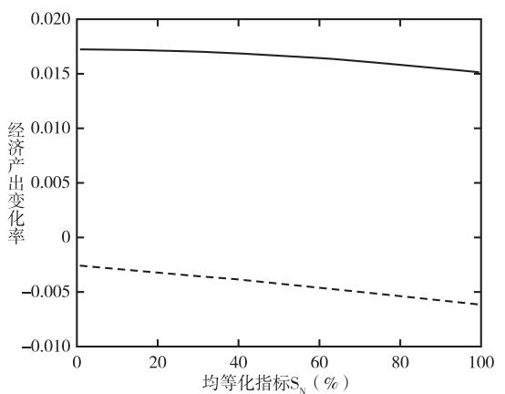

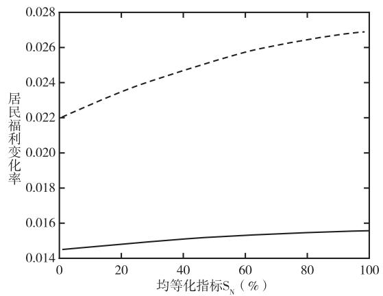  
(b)  
图2　均等化指标对经济总产出和福利的影响

其次，我国财政支出的地域分布仍表现出富省多，穷省少的特点，因此，保持原状同样是一种优先保证效率而牺牲平等的策略。且受公式本身所限，即使当sϑ 等于0时，财政支出的均等化程度也并不是0，而是一个和系数 $\boldsymbol { s } _ { \scriptscriptstyle W } ^ { \vartheta }$ 及人均GDP份额相关的、大于0的常数。这也就是说，上述分析尚未遍历所有均等化程度对经济的影响。鉴于此，本文进一步定义：

调整后支出=ψ整体人均支 $\ ! \Psi + ( 1 - \psi$ )调整前支出

此时， $\psi \in \left[ 0 , 1 \right]$ 得以更为完整和连续地刻画财政支出政策的均等化程度。为了与 $s _ { N } ^ { \vartheta }$ 区分开，本文将 $\psi$ 标记为支出的实际均等化程度。图3报告了 $\psi$ 和产出、福利水平变化的关系，其中，（a）中垂直的灰色虚线表示产出提升极大值对应人均生产性支出的实际均等化程度，①其他线条含义同图 $2 _ { \circ }$ 可以看出，随着生产性支出政策逐渐趋向于均等化，产出的提升程度先上升后下降，极大值点出现在82%，即此时政策对整体产出的提升效果最强。对于社会保障性支出来说，均等化程度越高，产出的降低幅度也越高。这也就意味着，一个仅以经济 $\cdot \vec { p } ^ { \dotsc }$ 出为政策目标的政府不应该对社会保障性支出作任何调整，以避免劳动力反向流动带来的效率损失。图3（b）的结果则表明，随着两类支出实际均等化程度的提高整体福利水平始终上升说明对于只关心居民福利的中央政府而言两类支出的均等化都能够成为福利改善的有效政策工具。这是因为错配的消除总是能够促进居民在地区间的流动，从而让他们获得更高的效用水平。综合图2和图3不难看出图2实际上类似于截取了图3的后阶段， $, s _ { N } ^ { \vartheta } = 1 0 0$ 时，和 $\psi = 1 0 0$ 的效果实际上是完全相同的，从0%到100%的设置无疑更全面和完整地展示了政策的均等化程度对整体经济变量变化的影响。

最后，正如理论分析中所假设的，中央政府目标函数 $U _ { g }$ 同时包含GDP和居民福利，处于不同发展阶段的政府可能对两者的侧重程度 $\phi$ 有所不同均等化政策的效果也与这一侧重程度息息相关鉴于此，本文进一步选用不同的 $\phi ,$ ，考察不同目标倾向下均等化政策的有效程度及其差异。如图4所示，横轴依然表示人均财政支出的实际均等化程度纵轴则表示中央政府效用变化的相对幅度垂直实线表示政府效用函数极大值对应的人均生产性支出实际均等化程度，垂直虚线则表示极大值对应的人均社会保障性支出实际均等化程度，其他线条含义同图2，图从左到右分别表示 $\phi = 1 / 3$ $ . \phi = 1 / 2$ 和 $\phi = 2 / 3$ 的情况， $, \phi \colon$ 越大表示对总产出的相对关注程度越高，对福利的相对关注程度越低。不难看出，随着支出均等化程度的提高，效用函数的变化率先上升后下降，且极大值点往往出现在后半段。具体而言，对于社会保障性支出而言，政府对福利的关注程度越高，越应该采用完全公平的支出配置政策；对产出的关注程度越高，则越应该注重效率，适当保持大城市的较高支出，降低均等化程度。相比之下，生产性支出政策的选择与政府目标权重的相关程度较低，且非常倾向于地区间的完全平均配置。

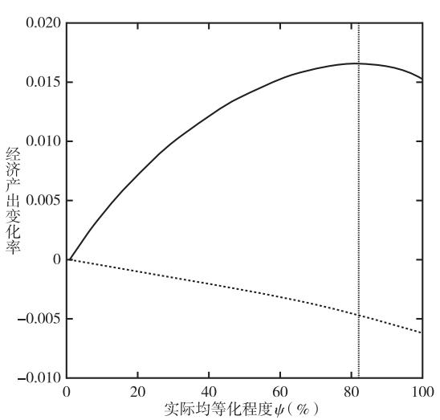

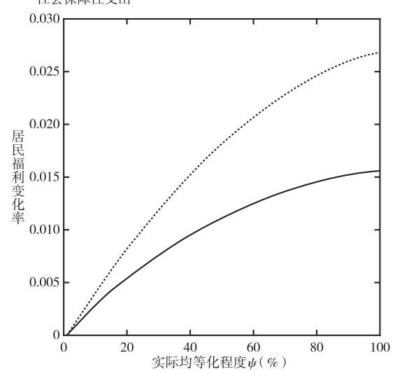  
(b)  
图3　人均财政支出政策的实际均等化程度对经济总产出和福利的影响

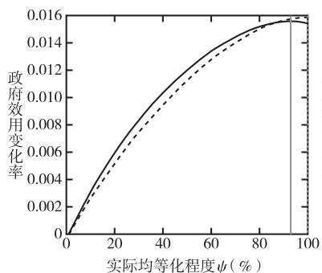  
(a)φ=1/3

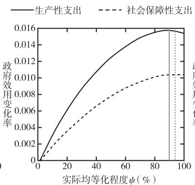  
(b) φ=1/2

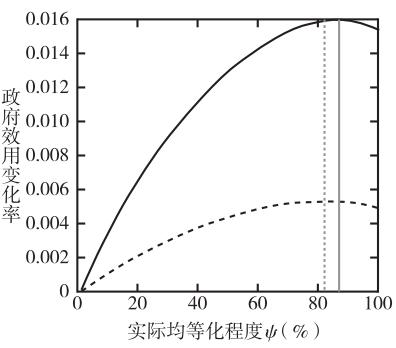  
(c)φ=2/3  
图4　人均财政支出的实际均等化程度与中央政府政策目标权重

## 3. 进一步讨论

进一步地，本文基于现实经济背景给出四种可能的模型拓展。

第一放松支出总量不变的假设 考虑新增支出的项目和地区间配置对经济的影响具体来说，在政府的统筹规划下，新增支出用作生产性支出或社会保障性支出时，对经济的影响是有所差异的，即两者的占比同样会影响经济产出和居民福利的变化幅度。表2前两列结合我国现实情况，假设中央政府新增一万亿元补贴，用于等幅增加各地区财政支出。可以看出，如果将一万亿元完全用于提高各个地区的生产性支出那么即使不作地区间均等化调整总体产出和居民福利也都会有所上升。这是由于各地区支出等幅变化，不会改变地区的相对人才吸引力，政策效果也与地区间人口流动无关，仅来自各地生产效率上升直接带来的工资和产出提高。如果将一万亿元完全用于提高社会保障性支出，那么福利提升将高达 7.691%，产出则完全不发生变化，这是因为地区间相对支出完全不变，人口完全不流动，社会保障性支出的效果也仅停留在居民部门，通过提高社保水平直接提高居民效用，不会传导至生产部门。同理，如表 2列（3）-（6）所示，当总支出增加量发生变化时，定性结论仍然保持不变。值得注意的是，由于此时支出是等幅提高的，不平等程度几乎不会发生改变，即均为0.000%，表格中不再一一列出。

表2　增加财政支出对经济的影响效果

<table><tr><td rowspan="2"></td><td colspan="2">增加一万亿元支出</td><td colspan="2">增加五千亿元支出</td><td colspan="2">支出增加10%</td></tr><tr><td>经济产出</td><td>居民福利</td><td>经济产出</td><td>居民福利</td><td>经济产出</td><td>居民福利</td></tr><tr><td>生产性支出</td><td>2.074%</td><td>1.163%</td><td>1.108%</td><td>0.621%</td><td>0.716%</td><td>0.402%</td></tr><tr><td>社会保障性支出</td><td>0.000%</td><td>7.691%</td><td>0.000%</td><td>4.264%</td><td>0.000%</td><td>1.669%</td></tr></table>

第二，在现实经济中，政府几乎无法真正剥夺某些地区的支出，促进支出均等化的手段更多的是让新增支出向弱势地区倾斜。因此，本文引入一个选择性补贴的情景：假设中央政府对低支出地区和高支出地区采取区别政策，如果该地区人均支出高于平均水平，则不向该地区投入；如果人均支出低于平均水平，则向该地区投入补贴，直到其人均支出达到平均水平。表3展示了这一情景下经济产出、居民福利和不平等程度的变化。不难发现，此时选择性补贴政策对于不平等的改善力度都小于完全均等化的情况，对产出和居民总福利的影响结果都有完全均等化的情况。这从经济学直觉上也是容易理解的：其一，选择性补贴政策的前提是存在新增支出，这对于经济的影响通常是正面的。其二，在选择性补贴政策中，高支出地区的产出和福利水平不再因为支出减少而下降。因此，即使在人口流动过程中，劳动力数量有所下降，其下降幅度也不及完全均等化情况。在这两种效应的叠加影响下，政策对产出和福利的正面效果增强，负面效果减弱。值得注意的是，即使在没有任何地区支出下降的情况下，新增社会保障性支出仍会使得整体产出下降0.201%，这是因为此时弱势地区的人口相对吸引力仍会较反事实调整前有所增强，劳动力仍会向弱势地区流动，整体生产效率随之下降，产出降低。

表3　利用新增支出补贴弱势地区的情景模拟

<table><tr><td colspan="2"></td><td>生产性支出</td><td>社会保障性支出</td></tr><tr><td colspan="2">经济产出</td><td>3.467%</td><td>-0.201%</td></tr><tr><td colspan="2">居民福利</td><td>2.263%</td><td>4.896%</td></tr><tr><td rowspan="3">不平等指数</td><td>GINI系数</td><td>-0.462%</td><td>-0.793%</td></tr><tr><td>Theil指数</td><td>-1.212%</td><td>-2.405%</td></tr><tr><td>HHI</td><td>-2.215%</td><td>-5.042%</td></tr></table>

第三，上文将土地出让收入和税收同时视为财政收入的做法其实也是一种简化设置，在现实经济中，土地出让金是政府性基金的主要组成部分，而政府性基金收支大多是专款专用的。因此，这一简化设置可能带来偏差。鉴于此，本文令各地区用于生产、社会保障的政府性基金支出均维持原状态，不进行均等化。如表4所示，结果表明，此时模型的定性结果与基准结果相同，没有发生改变。从定量上看，生产性支出的均等化对经济产出的影响幅度为1.594%，较基准结果1.505%稍有上升；对居民福利的影响幅度则为1.519%较基准模型结果有所下降，这是因为引入政府性基金收支的专款专用时，类似于只对一部分支出进行均等化，均等化的程度较基准模型有所降低。参照图3中均等化程度与产出提升、居民福利的关系，当均等化程度相对于完全均等化稍有下降时，产出的提升幅度上升，福利的改善幅度下降，可以与表4结果对应起来。同理，社会保障性支出的均等化对产出和福利的影响分别为-0.624%和2.693%，与基准结果同样相差很小，且变化方向与图3中所示一致。

表4　考虑政府性基金收支专款专用的情景模拟

<table><tr><td colspan="2"></td><td>生产性支出</td><td>社会保障性支出</td></tr><tr><td colspan="2">经济产出</td><td>1.594%</td><td>-0.624%</td></tr><tr><td colspan="2">居民福利</td><td>1.519%</td><td>2.693%</td></tr><tr><td rowspan="3">不平等指数</td><td>GINI系数</td><td>-0.904%</td><td>-2.467%</td></tr><tr><td>Theil指数</td><td>-1.898%</td><td>-5.347%</td></tr><tr><td>HHI</td><td>-2.785%</td><td>-8.647%</td></tr></table>

第四，前文的均等化大多是从数量意义上理解的，在现实经济中，居民实际感知和体验的均等化同样具有重要的意义。因此，本文进一步丰富对均等化的模型理解，补充考虑了居民实际感知和体验均等化的相关情形。具体地，本文基于模型计算出每个地区的相对居民福利及其与平均值的比值，如果某一地区的居民福利低于均值，说明可能需要向该地区投入更多的财政支出，以提高这些地区的福利水平，促进均等化。简化起见，假设人均支出的调整幅度为幂函数形式，底数为当地居民福利与平均值的比值，指数设置为-1。如果福利高于均值，则说明该地区居民获得感和幸福感已经较强，此时为了更加贴合现实经济情况，本文不再对这些地区的支出做任何调整。如表5所示，如果是给予这些地区更高的生产性支出，带来的总产出提升和福利改善分别为1.584%和1.007%；如果是给予这些地区更高的社会保障性支出，则福利提高4.247%，经济产出下滑0.115%，不平等程度则均表现为下降。这也就是说，此时定性结果也与基准情形相同，只是定量成效上稍有差异，这一方面可能源于各地区人均支出和人均福利水平的空间分布不同，另一方面也可能与调整函数的设置形式有关。总体而言，这一结果表明，以居民实际感知和体验为目的的均等化同样能够起到提高福利、缩小不平等的成效，但调整社会保障性支出带来的产出下降也同样存在。

表5　考虑居民实际感知和体验均等化的情景模拟

<table><tr><td colspan="2"></td><td>生产性支出</td><td>社会保障性支出</td></tr><tr><td colspan="2">经济产出</td><td>1.584%</td><td>-0.115%</td></tr><tr><td colspan="2">居民福利</td><td>1.007%</td><td>4.247%</td></tr><tr><td rowspan="3">不平等指数</td><td>GINI系数</td><td>-0.403%</td><td>-1.814%</td></tr><tr><td>Theil指数</td><td>-0.701%</td><td>-3.139%</td></tr><tr><td>HHI</td><td>-0.467%</td><td>-2.114%</td></tr></table>

## 六、结论与政策建议

本文构建包含人口流动和异质性居民偏好的量化空间一般均衡模型，讨论公共财政支出的区域均等化对经济产出和居民福利的定量影响。研究表明，第一，人均生产性支出的地区均等化将带来1.505%的产出上升和1.555%的福利改进 人均社会保障性支出的均等化亦能使福利上升2.693%但要以0.625%的经济产出下降为代价。两类支出均等化的政策都可以缩小地区福利不平等，其中社会保障性支出对于不平等的改进效率相对更高。第二，在逐步提高生产性支出均等化程度的过程中，产出的改善程度先增加后下降，福利的改善程度则不断上升；在逐步提高社会保障性支出均等化程度的过程中，福利的改善幅度和产出的下降幅度均会越来越大。第三，无论目标权重如何，中央政府都更加倾向于提高人均生产性支出的均等化程度，即生产性支出政策受目标权重的影响较小。相比之下人均社会保障性支出的政策规划受目标权重的影响则较大政府对产出的关注程度越高政策越趋向于保证大城市的高财政支出水平；对居民福利的关注程度越高，政策越偏向于区域均等化。第四，全国性新增支出在生产性支出和社会保障性支出间的配置同样会影响政策成效，对福利的相对关注程度越高新增支出应当越多配置到社会保障性支出上，此外研究表明区域选择性补贴政策在产出提升和福利改善方面的积极效果都将强于完全均等化政策。

结合文章结论和我国现实经济情况，本文可以得到以下几点政策启示：

第一，进一步增强基本公共服务的均衡性、可及性，完善基本公共服务制度体系。本文理论研究的结果表明，基本公共服务的均等化能够成为改善整体居民福利，调节区域不平等，促进地区协调发展的有益手段。因此，应当继续增强基本公共服务的均衡性和可及性，通过扩大失业、工伤、生育保险覆盖面，加强基层医疗卫生机构标准化建设，为困难家庭老年群体提供集中托养等多项措施健全各地区社会保障体系，补齐当前基本公共服务短板，持续推动区域基本公共服务均等化。除此之外，随着经济社会的发展，居民对生活质量的要求也会逐渐提高，非基本公共服务和生活服务的供给质量与均衡性同样影响着居民的幸福感。因此，还应持续关注与人民群众生活密切相关，但优质资源仍然有限且分布不均衡的非基本公共服务项目、生活服务项目，在合理范围内逐步增强支持力度，力求满足更高层次的居民需要，切实保障各地区居民福利水平。

第二，遵循因地制宜原则，形成与主体功能定位相匹配的支出策略。支出的均等化政策有助于缩小地区差距，提升居民福利，但忽略现实情况，盲目追求完全的平等化可能会抑制发达地区创新活力，导致资源配置效率降低，整体经济效益受损。本文的理论分析也发现，当生产性支出的均等化程度提高至较高水平后继续追求均等化可能会带来产出损失因此 在财政政策 尤其是生产端财政政策的实施过程中，应当贯彻党的二十届三中全会中指出的“健全因地制宜发展新质生产力体制机制”理念，①充分考虑各地区的自然资源、经济基础等条件，立足实际问题、实际需求，结合地区异质性的主体功能定位制定有针对性的财政支持政策，例如在资源型城市投入基础设施建设，提升其资源开发和利用能力，在传统制造业密集的城市促进产业数字化、智能化转型，在发达地区注重引导新产业新模式孵化和新兴产业、未来产业发展等，合理规划各个地区的政策力度，切实推动技术突破和产业创新，促进区域经济健康协调发展。

第三，合理配置不同类型支出，最大化发挥支出效益。对于新增支出而言，不同类型的支出对经济和社会发展的贡献路径各不相同，社会保障性支出的投入能够更好地提高社会福利，增强居民获得感、满足感，生产性支出的投入则主要通过提升生产部门的技术创新促进居民收入上涨、产出上升。因此，中央政府在进行转移支付时，应当结合每个地区的经济发展、公共服务建设情况，合理分配各项支出比例，针对不同类型支出和不同政策目标设置对应的专项转移支付及绩效目标管理体系，通过科学设定支出目标、加强对资金使用过程的监管和绩效评估等方法保障财政支出效率，最大化地发挥财政资金的效益，切实提高各地区经济发展水平和人民生活质量。

本文从理论模型出发，定量考察了财政支出均等化政策带来的产出、福利改进等一系列成效，为财政支出政策的制定提供了有益的参考，但文中为了简化分析没有引入地区异质性的产业结构或高低技能劳动力对于不同地区的偏好差异也因此没有考虑产业升级的溢出效应及不同人群对于政策实施反应的异质性，而这些也都将成为未来进一步研究的方向。

## 参考文献：

王志刚 黎恩银，2022：《政府基建支出如何兼顾稳增长与调结构——基于生产网络的视角》，《经济学动态》第8期。

夏怡然 陆铭，2015：《城市间的“孟母三迁”——公共服务影响劳动力流向的经验研究》，《管理世界》第10期。

杨晓军 陈浩，2020：《中国城乡基本公共服务均等化的区域差异及收敛性》，《数量经济技术经济研究》第2期。

姚东旻 庄露 高文静，2024：《地方政府财政科技支出预算的收入效应与替代效应》，《经济学动态》第1期。

张睿 张勋 戴若尘，2018：《基础设施与企业生产率：市场扩张与外资竞争的视角》，《管理世界》第1期。

赵扶扬 陈斌开，2021：《土地的区域间配置与新发展格局——基于量化空间均衡的研究》，《中国工业经济》第8期。

周慧珺 傅春杨 龚六堂，2022：《人口流动、贸易与财政支出政策的地区性配置》，《中国工业经济》第2期。

周颖刚 蒙莉娜 卢琪，2019：《高房价挤出了谁？——基于中国流动人口的微观视角》，《经济研究》第9期。

Albouy， D.（2012），“Evaluating the efficiency and equity of federal fiscal equalization”，Journal of Public Economics，96（9-10）：824-839.

Albouy， D. et al.（2019），“The optimal distribution of population across cities”，Journal of Urban Economics，110：102-113.

Allen， T. & C.Arkolakis （2014），“Trade and the topography of the spatial economy”，Quarterly Journal of Economics，129（3）：1085-1140.

Anderson， J.E. & E. van Wincoop （2003），“Gravity with gravitas： A solution to the border puzzle”，American EconomicReview，93（1）：170-192.

Arkolakis， C. et al.（2012），“New trade models， same old gains？”，American Economic Review，102（1）：94-130.

Behrens， K. et al.（2017），“Spatial frictions”， Journal of Urban Economics，97：40-70.

Berger， T. & K.Enflo （2017），“Locomotives of local growth： The short-and long-term impact of railroads in Sweden”，Journal of Urban Economics，98：124-138.

Bernard， A. B. et al.（2003），“Plants and productivity in international trade”，American Economic Review，93（4）：1268-1290.

Blouri， Y. & M.V.Ehrlich （2020），“On the optimal design of place-based policies： A structural evaluation of EU regionaltransfers”，Journal of International Economics，125：103319.

Bryan， G. & M. Morten （2019），“The aggregate productivity effects of internal migration： Evidence from Indonesia”，Journal of Political Economy，127（5）：2229-2268.

Desmet， K. & E. Rossi-Hansberg （2013），“Urban accounting and welfare”，American Economic Review，103（6）：2296-2327.

Ehrlich， M. V. & T. Seidel （2018），“The persistent effects of place-based policy： Evidence from the West-GermanZonenrandgebiet”，American Economic Journal: Economic Policy，10（4）：344-74.

Fajgelbaum， P. D. et al. （2019），“State taxes and spatial misallocation”，Review of Economic Studies，86（1）：333-376.

Hsieh， C.T. & P.J.Klenow （2009），“Misallocation and manufacturing TFP in China and India”，Quarterly Journal ofEconomics，124（4）：1403-1448.

Hsieh， C.T. & E.Moretti （2019），“Housing constraints and spatial misallocation”，American Economic Journal: Macroeconomics，11（2）：1-39.

Kline， P. & E.Moretti （2014），“Local economic development， agglomeration economies， and the big push：100 yearsof evidence from the Tennessee Valley Authority”，Quarterly Journal of Economics，129（1）：275-331.

Moretti， E.（2013），“Real wage inequality”，American Economic Journal: Applied Economics，5（1）：65-103.

Shorrocks， A. F.（1980），“The class of additively decomposable inequality measures”，Econometrica，48（3）：613-625.

Simonovska， I. & M.E.Waugh （2014），“The elasticity of trade： Estimates and evidence”，Journal of International Eco⁃nomics，92（1）：34-50.

Tombe， T. & X. D. Zhu （2019），“Trade， migration， and productivity： A quantitative analysis of China”，AmericanEconomic Review，109（5）：1843-1872.

Turner， M.A. et al.（2014），“Land use regulation and welfare”，Econometrica，82（4）：1341-1403.

# Quantitative Evaluation of the Effect of Equalization of Fiscal Expenditure among Regions: Analysis Based on Quantitative Spatial General Equilibrium Model

ZHOU Huijuna, GONG Liutɑngb,c (a: Chinese Academy of Social Sciences, Beijing, China; b: Peking University, Beijing, China; c: Beijing Technology and Business University, Beijing, China)

Summary： In recent years， China’s economy has shifted from the stage of high-speed growth to the stage of high-quality development， possessing a series of advantages and conditions for the long-term sustainable development. However， the challenge of imbalances and insufficient in development still persists， with the imbalances among regions standing out as one of the most significant issues. Accordingly， the government has implemented a series of policy to pro mote regional economic development and narrow the gap among regions. A crucial policy in this regard is the preferential allocation of fiscal expenditure across regions. When the central government increases transfer payments to improve the per capita fiscal expenditure in underdeveloped regions， the living standard of the local residents in these regions can in deed be improved. However， the total financial resources of the central government are limited. The financial support re ceived by developed regions may decrease， potentially slowing the economic growth in these regions， and then leading to a decrease in overall economic output and social welfare. Then， does the equalization of fiscal expenditure contribute to overall economic output and the social welfare. If so， what is the quantitative impact of the policy？ Furthermore， fiscal expenditure encompass various categories， such as social security， transportation and so on. Different types of fiscal expenditure may have distinct influences on the economy in terms of channels and magnitude. Which type of expenditure leads to the most effective results， what is the optimal allocation of the fiscal expenditure？ These issues are of significant importance in the field of regional development， yet still lack systematic theoretical research.

By constructing a quantitative spatial general equilibrium model incorporating migration and heterogeneous workers preferences， this paper explores the quantitative effect of the equalization of fiscal expenditure among regions on the economic output and social welfare. The results show that： Firstly， the equalization of per capita productive expenditure results in a 1.505% increase in aggregate output and a 1.555% improvement in social welfare. Meanwhile， the equalization of social security expenditure among different regions could also increase social welfare by 2.693% while sacrifices aggregate output by 0.625%. Both policies could contribute to the reduction of the welfare inequality， with the equalization of social security expenditure demonstrates a higher efficiency. Secondly， when we gradually increase the equalization de gree of productive expenditure， the degree of improvement of aggregate output initially increases and then decreases， while the degree of improvement of social welfare continued to rise. On the other hand， when we gradually increase the equalization degree of social security expenditure， both the improvement of welfare and the sacrifice of output become higher and higher. Thirdly， from the policymaker’s perspective， whether focusing on economic output or social welfare， the central government tends to increase the degree of equalization of productive expenditure， while the decision-making regarding the equalization of social security expenditure depends on the central government’s preference between outpu and welfare. When the policy goal is biased toward social welfare， the government could pay more attention to fairness among regions and guarantee the equalization of per capita fiscal expenditure. In contrast， when the central government fo cuses more on economic output， then the incentive of equalization， especially equalization of the social security expendi ture declines， and the policy tends to maintain high expenditure in big cities. Lastly， this paper further extend the mode on the basis of the current economic context. The results indicate that the conclusion remain robust when accounting for the specificities of government-managed funds， as well as residents’ actual perceptions and of the equalization. Further more， the allocation of the additional expenditure between productive expenditure and social security expenditure also af fects effectiveness of the policy. The higher the preference for welfare， the more additional expenditure should be allo cated to social security spending. A subsidy policy in selected regions demonstrates a stronger effectiveness than the equal ization of fiscal expenditure.

The potential contributions of this paper are mainly reflected in three aspects. Firstly， it introduces China’s unique in stitutions and policies into a quantitative spatial general equilibrium model， providing a quantitative analysis of the elasticity and mechanisms of the allocation of the fiscal expenditure on regional and overall economy. Secondly， it simulates the influence of the equalization of fiscal expenditure， theoretically providing the roles played by policies such as the equalization of public services in achieving diversified goals of the steady economic improvement， elevated living standards， and reduced income inequality. Lastly， the paper distinguishes the differences in the impact of different types of fiscal expendi ture policies on the economy， offering theoretical evidence for the subsequent， broader， and sustained policy implementa tions.

Keywords： Migration； Factor Allocation； Equalization of Fiscal Expenditure； Policy GoalJEL Classification： E62， R13， R58

（责任编辑：金 禾）（校对：木 丰）